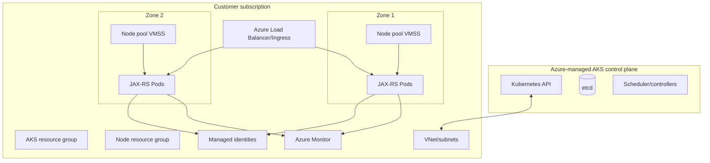
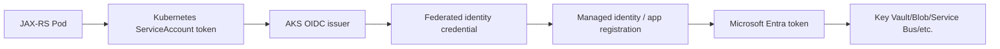
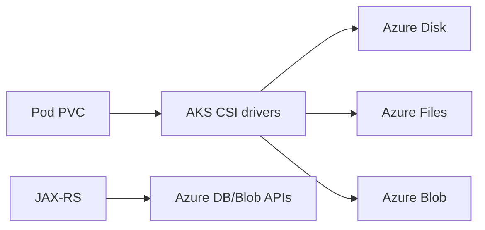
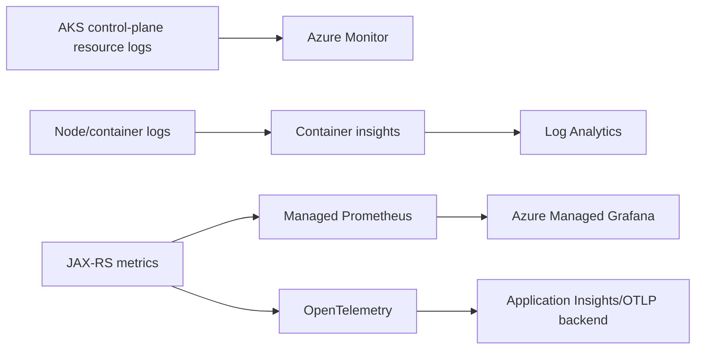

# Part 050 — Azure AKS Architecture, Identity, Networking, and Operations

> Azure Kubernetes Service mengelola Kubernetes control plane, tetapi production reliability tetap bergantung pada node pools, managed identities, Microsoft Entra access, virtual-network topology, Pod IP strategy, egress, private DNS, Azure Load Balancer, ingress/application routing, CSI storage, observability, upgrade channels, OS lifecycle, quotas, and application behavior. AKS Automatic memperluas platform-managed defaults for compute, networking, ingress, and monitoring; AKS Standard provides wider control. “Managed” means ownership is shifted and constrained, not removed.

## Daftar Isi

1. [Target kompetensi](#target-kompetensi)
2. [Scope dan baseline](#scope-dan-baseline)
3. [Boundary dengan Kubernetes generik](#boundary-dengan-kubernetes-generik)
4. [Current AKS operating models](#current-aks-operating-models)
5. [Shared responsibility model](#shared-responsibility-model)
6. [Mental model AKS architecture](#mental-model-aks-architecture)
7. [Managed control plane](#managed-control-plane)
8. [Control-plane and node-resource ownership](#control-plane-and-node-resource-ownership)
9. [Node resource group](#node-resource-group)
10. [Subscription and resource-group boundaries](#subscription-and-resource-group-boundaries)
11. [Kubernetes API access](#kubernetes-api-access)
12. [Public API server](#public-api-server)
13. [Authorized IP ranges](#authorized-ip-ranges)
14. [Private cluster](#private-cluster)
15. [API Server VNet Integration boundary](#api-server-vnet-integration-boundary)
16. [Private DNS](#private-dns)
17. [Hub-spoke connectivity](#hub-spoke-connectivity)
18. [AKS Standard](#aks-standard)
19. [AKS Automatic](#aks-automatic)
20. [Automatic managed defaults](#automatic-managed-defaults)
21. [Automatic suitability boundary](#automatic-suitability-boundary)
22. [Migration and coexistence](#migration-and-coexistence)
23. [Node-pool mental model](#node-pool-mental-model)
24. [System node pools](#system-node-pools)
25. [User node pools](#user-node-pools)
26. [System-pool availability](#system-pool-availability)
27. [Virtual Machine Scale Sets](#virtual-machine-scale-sets)
28. [Node-pool modes](#node-pool-modes)
29. [Multiple node pools](#multiple-node-pools)
30. [Node-pool immutability and recreation](#node-pool-immutability-and-recreation)
31. [Availability zones](#availability-zones)
32. [Zone-redundant node pools](#zone-redundant-node-pools)
33. [Regional node-pool boundary](#regional-node-pool-boundary)
34. [VM sizes](#vm-sizes)
35. [CPU architecture](#cpu-architecture)
36. [Spot node pools](#spot-node-pools)
37. [GPU and specialized pools](#gpu-and-specialized-pools)
38. [Windows node pools boundary](#windows-node-pools-boundary)
39. [Azure Linux and Ubuntu](#azure-linux-and-ubuntu)
40. [Azure Linux 2 retirement](#azure-linux-2-retirement)
41. [Node images](#node-images)
42. [Node image upgrades](#node-image-upgrades)
43. [Virtual nodes boundary](#virtual-nodes-boundary)
44. [Node labels and taints](#node-labels-and-taints)
45. [System workload isolation](#system-workload-isolation)
46. [Cluster Autoscaler](#cluster-autoscaler)
47. [Autoscaler profiles](#autoscaler-profiles)
48. [Scale-down and disruption](#scale-down-and-disruption)
49. [Capacity and quota](#capacity-and-quota)
50. [Authentication and authorization model](#authentication-and-authorization-model)
51. [Microsoft Entra authentication](#microsoft-entra-authentication)
52. [Kubernetes RBAC](#kubernetes-rbac)
53. [Azure RBAC for Kubernetes authorization](#azure-rbac-for-kubernetes-authorization)
54. [Local accounts boundary](#local-accounts-boundary)
55. [Admin kubeconfig risk](#admin-kubeconfig-risk)
56. [Human-access lifecycle](#human-access-lifecycle)
57. [CI/CD identities](#cicd-identities)
58. [Cluster managed identity](#cluster-managed-identity)
59. [System-assigned managed identity](#system-assigned-managed-identity)
60. [User-assigned managed identity](#user-assigned-managed-identity)
61. [Kubelet identity](#kubelet-identity)
62. [Control-plane identity versus kubelet identity](#control-plane-identity-versus-kubelet-identity)
63. [Managed-identity role assignments](#managed-identity-role-assignments)
64. [Workload identity mental model](#workload-identity-mental-model)
65. [Microsoft Entra Workload ID](#microsoft-entra-workload-id)
66. [OIDC issuer](#oidc-issuer)
67. [Federated identity credential](#federated-identity-credential)
68. [Kubernetes ServiceAccount](#kubernetes-serviceaccount)
69. [Azure Identity SDK](#azure-identity-sdk)
70. [DefaultAzureCredential](#defaultazurecredential)
71. [Workload identity mutation and labels](#workload-identity-mutation-and-labels)
72. [Workload identity versus legacy pod-managed identity](#workload-identity-versus-legacy-pod-managed-identity)
73. [Least-privilege Azure RBAC](#least-privilege-azure-rbac)
74. [Cross-subscription access](#cross-subscription-access)
75. [Credential caching and rotation](#credential-caching-and-rotation)
76. [Network architecture choices](#network-architecture-choices)
77. [Azure CNI overview](#azure-cni-overview)
78. [Azure CNI Overlay](#azure-cni-overlay)
79. [Azure CNI Powered by Cilium](#azure-cni-powered-by-cilium)
80. [Azure CNI flat networking](#azure-cni-flat-networking)
81. [Kubenet boundary](#kubenet-boundary)
82. [Automatic networking defaults](#automatic-networking-defaults)
83. [Pod and node address spaces](#pod-and-node-address-spaces)
84. [Service CIDR](#service-cidr)
85. [DNS service IP](#dns-service-ip)
86. [Subnet sizing](#subnet-sizing)
87. [Pod IP exhaustion](#pod-ip-exhaustion)
88. [`maxPods`](#maxpods)
89. [Overlay routing and SNAT](#overlay-routing-and-snat)
90. [VNet-routable Pod IPs](#vnet-routable-pod-ips)
91. [Dual-stack networking](#dual-stack-networking)
92. [Cilium eBPF data plane](#cilium-ebpf-data-plane)
93. [NetworkPolicy](#networkpolicy)
94. [Cilium Network Policy](#cilium-network-policy)
95. [Azure Network Policy Manager retirement](#azure-network-policy-manager-retirement)
96. [Security groups and NSGs](#security-groups-and-nsgs)
97. [Application Security Groups boundary](#application-security-groups-boundary)
98. [Private Link and private endpoints](#private-link-and-private-endpoints)
99. [User-defined routes](#user-defined-routes)
100. [Azure Firewall egress](#azure-firewall-egress)
101. [Outbound types](#outbound-types)
102. [Azure Load Balancer egress](#azure-load-balancer-egress)
103. [Managed NAT Gateway](#managed-nat-gateway)
104. [User-assigned NAT Gateway boundary](#user-assigned-nat-gateway-boundary)
105. [Egress FQDN requirements](#egress-fqdn-requirements)
106. [Restricted-egress clusters](#restricted-egress-clusters)
107. [SNAT port exhaustion](#snat-port-exhaustion)
108. [LocalDNS boundary](#localdns-boundary)
109. [CoreDNS](#coredns)
110. [Custom DNS and hybrid resolution](#custom-dns-and-hybrid-resolution)
111. [Load-balancing options](#load-balancing-options)
112. [Azure Load Balancer](#azure-load-balancer)
113. [Public and internal Services](#public-and-internal-services)
114. [Backend pools and health probes](#backend-pools-and-health-probes)
115. [Source IP and external traffic policy](#source-ip-and-external-traffic-policy)
116. [Application routing add-on](#application-routing-add-on)
117. [Managed NGINX ingress](#managed-nginx-ingress)
118. [Application routing and community ingress-nginx retirement](#application-routing-and-community-ingress-nginx-retirement)
119. [Azure DNS integration](#azure-dns-integration)
120. [Gateway API boundary](#gateway-api-boundary)
121. [Application Gateway for Containers boundary](#application-gateway-for-containers-boundary)
122. [Application Gateway Ingress Controller boundary](#application-gateway-ingress-controller-boundary)
123. [NGINX and other ingress controllers](#nginx-and-other-ingress-controllers)
124. [Web Application Firewall boundary](#web-application-firewall-boundary)
125. [TLS and Key Vault certificate boundary](#tls-and-key-vault-certificate-boundary)
126. [Deregistration and graceful termination](#deregistration-and-graceful-termination)
127. [Storage mental model](#storage-mental-model)
128. [Azure Disk CSI](#azure-disk-csi)
129. [Disk zone affinity](#disk-zone-affinity)
130. [Disk performance tiers](#disk-performance-tiers)
131. [Azure Files CSI](#azure-files-csi)
132. [NFS and SMB](#nfs-and-smb)
133. [Azure Blob CSI boundary](#azure-blob-csi-boundary)
134. [Ephemeral OS and temporary disks](#ephemeral-os-and-temporary-disks)
135. [StorageClass governance](#storageclass-governance)
136. [Volume expansion](#volume-expansion)
137. [Volume snapshots](#volume-snapshots)
138. [Stateful workload placement](#stateful-workload-placement)
139. [Backup and restore](#backup-and-restore)
140. [Azure Backup for AKS](#azure-backup-for-aks)
141. [External database backups](#external-database-backups)
142. [Key Vault and secrets](#key-vault-and-secrets)
143. [Azure Key Vault provider for Secrets Store CSI](#azure-key-vault-provider-for-secrets-store-csi)
144. [Secret rotation](#secret-rotation)
145. [Kubernetes Secret boundary](#kubernetes-secret-boundary)
146. [Observability mental model](#observability-mental-model)
147. [Azure Monitor](#azure-monitor)
148. [Container insights](#container-insights)
149. [Managed service for Prometheus](#managed-service-for-prometheus)
150. [Azure Managed Grafana](#azure-managed-grafana)
151. [Control-plane resource logs](#control-plane-resource-logs)
152. [Activity logs](#activity-logs)
153. [Diagnostic settings](#diagnostic-settings)
154. [OpenTelemetry](#opentelemetry)
155. [Network observability](#network-observability)
156. [Application logs](#application-logs)
157. [Cost and cardinality](#cost-and-cardinality)
158. [Security posture](#security-posture)
159. [Private API and network segmentation](#private-api-and-network-segmentation)
160. [Microsoft Entra and RBAC](#microsoft-entra-and-rbac)
161. [Pod Security Admission](#pod-security-admission)
162. [Azure Policy for Kubernetes boundary](#azure-policy-for-kubernetes-boundary)
163. [Defender for Containers boundary](#defender-for-containers-boundary)
164. [Azure Container Registry](#azure-container-registry)
165. [ACR pull identity](#acr-pull-identity)
166. [Image scanning and provenance](#image-scanning-and-provenance)
167. [Encryption](#encryption)
168. [Disk encryption sets boundary](#disk-encryption-sets-boundary)
169. [Confidential containers boundary](#confidential-containers-boundary)
170. [Multi-subscription and landing-zone architecture](#multi-subscription-and-landing-zone-architecture)
171. [Multi-tenancy](#multi-tenancy)
172. [Reliability mental model](#reliability-mental-model)
173. [Availability zones and zone resilience](#availability-zones-and-zone-resilience)
174. [Control-plane versus data-plane availability](#control-plane-versus-data-plane-availability)
175. [System-pool resilience](#system-pool-resilience)
176. [Application topology spread](#application-topology-spread)
177. [Node replacement and PDBs](#node-replacement-and-pdbs)
178. [Regional outage](#regional-outage)
179. [Multi-region deployment models](#multi-region-deployment-models)
180. [Failure-domain headroom](#failure-domain-headroom)
181. [Cluster recreation](#cluster-recreation)
182. [Upgrade lifecycle](#upgrade-lifecycle)
183. [Supported Kubernetes versions](#supported-kubernetes-versions)
184. [Control-plane and node version skew](#control-plane-and-node-version-skew)
185. [Manual upgrades](#manual-upgrades)
186. [Automatic upgrade channels](#automatic-upgrade-channels)
187. [Node OS upgrade channels](#node-os-upgrade-channels)
188. [Planned maintenance](#planned-maintenance)
189. [Surge upgrades](#surge-upgrades)
190. [PDB and drain behavior](#pdb-and-drain-behavior)
191. [Upgrade prechecks](#upgrade-prechecks)
192. [API deprecation](#api-deprecation)
193. [Blue-green node-pool upgrade](#blue-green-node-pool-upgrade)
194. [Blue-green cluster migration](#blue-green-cluster-migration)
195. [Rollback boundary](#rollback-boundary)
196. [Cost model](#cost-model)
197. [Control-plane tier and Automatic charges](#control-plane-tier-and-automatic-charges)
198. [VM and node-pool cost](#vm-and-node-pool-cost)
199. [Spot and reservations](#spot-and-reservations)
200. [Load balancer and public-IP cost](#load-balancer-and-public-ip-cost)
201. [NAT Gateway and Firewall cost](#nat-gateway-and-firewall-cost)
202. [Storage and backup cost](#storage-and-backup-cost)
203. [Log Analytics and metrics cost](#log-analytics-and-metrics-cost)
204. [Cross-zone and egress cost](#cross-zone-and-egress-cost)
205. [Rightsizing and autoscaling](#rightsizing-and-autoscaling)
206. [Cost allocation](#cost-allocation)
207. [JAX-RS workload integration](#jax-rs-workload-integration)
208. [Java Azure SDK identity](#java-azure-sdk-identity)
209. [Azure SDK client lifecycle](#azure-sdk-client-lifecycle)
210. [Key Vault, Blob, Service Bus, and Cosmos access](#key-vault-blob-service-bus-and-cosmos-access)
211. [Private endpoints and DNS](#private-endpoints-and-dns)
212. [Health and load balancers](#health-and-load-balancers)
213. [Graceful termination](#graceful-termination)
214. [Connection pools and node churn](#connection-pools-and-node-churn)
215. [Failure-model matrix](#failure-model-matrix)
216. [Debugging playbook](#debugging-playbook)
217. [Testing strategy](#testing-strategy)
218. [Architecture patterns](#architecture-patterns)
219. [Anti-patterns](#anti-patterns)
220. [PR review checklist](#pr-review-checklist)
221. [Trade-off yang harus dipahami senior engineer](#trade-off-yang-harus-dipahami-senior-engineer)
222. [Internal verification checklist](#internal-verification-checklist)
223. [Latihan verifikasi](#latihan-verifikasi)
224. [Ringkasan](#ringkasan)
225. [Referensi resmi](#referensi-resmi)

---

## Target kompetensi

Setelah menyelesaikan part ini, Anda harus mampu:

- membedakan AKS Standard and AKS Automatic operating models;
- menjelaskan managed control plane, customer subscription resources, and node resource group ownership;
- memilih public endpoint, authorized ranges, private cluster, or API Server VNet Integration;
- mendesain system and user node pools across zones, VM types, OS, architecture, Spot, and specialized workloads;
- membedakan Microsoft Entra authentication, Kubernetes RBAC, Azure RBAC for Kubernetes, local admin, cluster identity, kubelet identity, and workload identity;
- mengimplementasikan Microsoft Entra Workload ID for Java Azure SDK clients;
- memilih Azure CNI Overlay, Azure CNI Powered by Cilium, or VNet-routable networking;
- merencanakan node/Pod/Service CIDRs, subnet capacity, `maxPods`, outbound type, NAT, Firewall, and private endpoints;
- memahami Cilium network policy and Azure NPM retirement;
- memilih Azure Load Balancer, application routing add-on, managed NGINX, Application Gateway, or another controller;
- memilih Azure Disk, Azure Files, Blob, or external managed data services;
- mengintegrasikan Azure Monitor, Container insights, managed Prometheus, Grafana, diagnostic settings, and OpenTelemetry;
- menjalankan Kubernetes/node-image upgrades with channels, maintenance windows, surge, PDB, and API-deprecation gates;
- merencanakan zone resilience, multi-region, backup, and cluster recreation;
- menganalisis cost from nodes, NAT/Firewall, load balancers, storage, and observability;
- mendiagnosis identity, private DNS, IP exhaustion, image pull, LoadBalancer, disk, and upgrade incidents.

---

## Scope dan baseline

Baseline:

- generic Kubernetes and networking from Parts 046–048;
- Java/JAX-RS workloads;
- Azure subscription, resource groups, VNet, Microsoft Entra, ACR, Azure Monitor, and managed identity concepts;
- IaC/GitOps as desired source of truth;
- Linux node pools as primary example;
- AKS Standard or Automatic.

Part ini **tidak mengasumsikan**:

- current CSG deployment is AKS;
- AKS Automatic;
- public/private cluster;
- Azure CNI mode;
- Cilium;
- application routing add-on;
- Azure Policy/Defender;
- Azure Disk/Files;
- exact region, subscription, VNet, VM size, Kubernetes version, or pricing tier;
- Helm, Terraform, Bicep, ARM, or Azure CLI as source of truth.

---

## Boundary dengan Kubernetes generik

This part focuses on Azure implementation:

- AKS control plane and node resource ownership;
- Entra and managed identities;
- Azure CNI;
- Azure Load Balancer and routing add-ons;
- Azure storage and monitoring;
- AKS lifecycle and platform constraints.

Generic Kubernetes manifests and lifecycle remain Parts 046–047.

---

## Current AKS operating models

### AKS Standard

Platform team configures:

- node pools and autoscaling;
- CNI/network data plane;
- ingress;
- monitoring;
- upgrades;
- egress;
- policies;
- add-ons.

### AKS Automatic

AKS applies production-oriented managed defaults and automatically manages more compute/platform behavior.

Current official documentation positions Automatic as the recommended production-ready default for many workloads, but workloads requiring unsupported customizations remain candidates for Standard.

---

## Shared responsibility model

| Layer | Azure-managed baseline | Customer responsibility |
|---|---|---|
| Control plane | API server/etcd/control components | access model, logs, upgrades/channels |
| Cluster identity | managed identity capability | role assignments and least privilege |
| Nodes | managed lifecycle features vary by mode | pools, sizing, workloads, PDB, security |
| Network | Azure primitives/integrations | address plan, CNI, egress, policy, DNS |
| Storage | Azure services/CSI | class, topology, performance, backup |
| Observability | Azure Monitor integrations | enablement, retention, alerts, cost |
| Application | none | correctness, auth, resilience, data recovery |

---

## Mental model AKS architecture



---

## Managed control plane

Azure operates control-plane components.

Customer does not manage etcd/control-plane VMs.

Availability and SLA options depend on AKS mode/tier and region; verify current service terms.

---

## Control-plane and node-resource ownership

Control plane is provider-managed.

Nodes, load balancers, disks, public IPs, and related resources are created in customer subscription, commonly in a managed node resource group.

---

## Node resource group

AKS creates/manages infrastructure resources in a node resource group by default.

Manual modification of AKS-managed resources can be overwritten or break lifecycle.

Use supported AKS APIs.

---

## Subscription and resource-group boundaries

Design:

- platform subscription;
- workload subscriptions;
- hub/spoke VNets;
- shared ACR/Key Vault/monitoring;
- role assignments;
- policy;
- quotas.

---

## Kubernetes API access

Access path combines:

- network reachability;
- Microsoft Entra/IAM token;
- Kubernetes or Azure RBAC;
- local account policy.

---

## Public API server

Public endpoint must use:

- Entra auth;
- authorized IP ranges where possible;
- no shared admin credentials;
- audit/resource logs.

---

## Authorized IP ranges

Ranges can restrict public endpoint.

Maintain CI, VPN, NAT, and admin egress changes.

They do not apply to every private access mode identically.

---

## Private cluster

Private AKS uses private networking for API server/node communication and private endpoint/DNS architecture.

Operators need VNet connectivity and private DNS resolution.

---

## API Server VNet Integration boundary

API Server VNet Integration provides VNet-integrated API connectivity with different architecture from Private Link-based private cluster.

Feature and migration support are version/region dependent.

Choose with current docs and network team.

---

## Private DNS

Private clusters depend on private DNS zones/links/resolvers.

Hub-spoke custom DNS must forward AKS private zone correctly.

---

## Hub-spoke connectivity

Validate:

- routes;
- peering;
- DNS;
- firewall;
- UDR;
- return path;
- private endpoints;
- on-prem access.

---

## AKS Standard

Benefits:

- broad VM/network/add-on customization;
- bring your VNet/subnets;
- choose CNI/data plane;
- custom ingress/egress;
- explicit upgrade strategy.

Costs:

- more platform decisions and lifecycle ownership.

---

## AKS Automatic

Automatic provides managed defaults such as:

- automatically allocated/scaled compute;
- production-tuned policies;
- managed networking baseline;
- application routing;
- monitoring baseline;
- security defaults.

Exact managed components and restrictions evolve.

---

## Automatic managed defaults

Current docs describe Automatic with defaults including Azure CNI Overlay powered by Cilium, managed egress/NAT behavior, application routing, LocalDNS, and preconfigured monitoring.

Do not reproduce these manually without checking ownership.

---

## Automatic suitability boundary

Verify support for:

- custom CNI;
- Windows/GPU/special nodes;
- host networking;
- privileged DaemonSets;
- custom ingress;
- storage;
- policy;
- regulated network path;
- fixed capacity/reservations.

---

## Migration and coexistence

Moving between Standard/Automatic or rebuilding can affect:

- node provisioning;
- network CIDRs;
- egress IPs;
- ingress classes;
- policy;
- monitoring;
- storage;
- identity;
- pricing.

Use blue-green cluster migration where in-place conversion is unsupported/risky.

---

## Node-pool mental model

Node pool groups nodes with common:

- VM size;
- OS;
- mode;
- zones;
- autoscaling;
- taints/labels;
- max Pods;
- upgrade behavior.

---

## System node pools

System mode hosts critical system Pods.

It has AKS-specific requirements and should use reliable capacity.

Do not schedule ordinary heavy workloads there.

---

## User node pools

User pools host application workloads.

They can use different:

- VM sizes;
- OS;
- Spot;
- zones;
- taints;
- autoscaling.

---

## System-pool availability

Use multiple system nodes and zones according to production reliability guidance and region support.

Protect CoreDNS, metrics, policy, CSI, and ingress dependencies.

---

## Virtual Machine Scale Sets

AKS node pools commonly use VMSS for node lifecycle and scaling.

Do not manually scale/mutate VMSS outside supported AKS operations.

---

## Node-pool modes

`System` and `User` affect scheduling rules and platform expectations.

At least one valid system pool is required.

---

## Multiple node pools

Create pools by operational requirement, not one per microservice.

Useful dimensions:

- system/application;
- Spot/baseline;
- CPU/memory/GPU;
- Linux/Windows;
- architecture;
- compliance.

---

## Node-pool immutability and recreation

Some pool properties cannot change in place.

Use new pool, cordon/drain, migrate, remove old pool.

Plan PDB and storage topology.

---

## Availability zones

Zone support depends on region/VM size/storage.

AKS cluster/node pools created without zones may require recreation to gain zonal resilience.

---

## Zone-redundant node pools

Spread nodes and application Pods across zones.

A zonal node pool plus no Pod topology spread can still co-locate replicas.

---

## Regional node-pool boundary

Some configurations use regional/zone-balanced behavior.

Check actual VMSS zone settings and failure semantics.

---

## VM sizes

Select from:

- CPU/memory ratio;
- network/storage throughput;
- ephemeral disk;
- architecture;
- quota/capacity;
- price;
- accelerated networking.

Benchmark Java workload.

---

## CPU architecture

Use ARM64 where supported and images/native agents are multi-arch.

Separate architecture pools with labels/affinity.

---

## Spot node pools

Spot pools are interruptible and user-mode.

Use:

- taint;
- toleration;
- multiple replicas;
- PDB;
- idempotency;
- no sole system capacity.

---

## GPU and specialized pools

Need drivers/device plugins, compatible images, quotas, taints, and expensive idle-capacity governance.

---

## Windows node pools boundary

Windows has separate networking, OS, storage, and version constraints.

Keep Linux system pool.

---

## Azure Linux and Ubuntu

Choose supported node OS SKU and patch lifecycle.

Custom node packages are not a durable configuration mechanism.

---

## Azure Linux 2 retirement

As of July 2026, Azure Linux 2.0 support and security updates ended on November 30, 2025, and node images were removed starting March 31, 2026.

Existing designs must migrate to Azure Linux 3 or another supported OS SKU.

---

## Node images

Node image contains:

- OS;
- container runtime;
- kernel;
- packages;
- Kubernetes node components.

Track node image version separately from Kubernetes minor version.

---

## Node image upgrades

Node image-only upgrade can deliver security/package fixes without changing Kubernetes minor.

Still drains/reimages nodes.

---

## Virtual nodes boundary

Virtual nodes/ACI can burst selected Pods without VM nodes, with significant feature/network/storage limits.

Do not treat as transparent node pool.

---

## Node labels and taints

Use AKS-supported labels/taints.

System-reserved labels may be immutable.

---

## System workload isolation

Use taints, priorities, resources, and separate system pools.

---

## Cluster Autoscaler

AKS integrates Kubernetes Cluster Autoscaler per node pool.

It adds/removes VMSS instances based on unschedulable Pods and utilization.

---

## Autoscaler profiles

Profiles are cluster-wide and affect scale-down timing, utilization, delays, and unready handling.

Changing one value affects every autoscaled pool.

---

## Scale-down and disruption

Scale-down must respect Pods and constraints but can be blocked by:

- PDB;
- local storage;
- system Pods;
- affinity;
- unmanaged Pods;
- safe-to-evict annotations.

---

## Capacity and quota

Azure quotas include:

- regional vCPU;
- VM family;
- public IP;
- load balancer;
- disk;
- network;
- subscription/resource limits.

Autoscaling cannot exceed quota or regional capacity.

---

## Authentication and authorization model

```text
Network access
→ Microsoft Entra authentication
→ Azure RBAC or Kubernetes RBAC authorization
→ admission
```

---

## Microsoft Entra authentication

AKS integrates with Entra for users/groups and tokens.

Use group-based access and conditional access/MFA where applicable.

---

## Kubernetes RBAC

Native roles and bindings authorize Kubernetes API resources.

---

## Azure RBAC for Kubernetes authorization

Azure RBAC can authorize Kubernetes actions using Azure role assignments and AKS integration.

Understand propagation latency and supported role scopes.

---

## Local accounts boundary

Disable local accounts where Entra-only operation and break-glass design permit.

Local admin kubeconfig is highly privileged.

---

## Admin kubeconfig risk

Admin credentials can bypass normal Entra group governance.

Protect, audit, rotate, and restrict retrieval.

---

## Human-access lifecycle

Use Privileged Identity Management/eligible roles and groups where available.

Separate read, deploy, and admin.

---

## CI/CD identities

Use workload federation/managed identity/service principal with limited Azure and Kubernetes rights.

Avoid client secrets.

---

## Cluster managed identity

AKS cluster identity lets control plane manage Azure resources.

It is separate from application workload identity.

---

## System-assigned managed identity

Lifecycle tied to AKS resource.

Simple, but identity ID changes if cluster recreated.

---

## User-assigned managed identity

Independent Azure resource.

Useful for stable lifecycle, pre-created roles, and controlled sharing.

Sharing one identity across clusters increases blast radius.

---

## Kubelet identity

Nodes/kubelet use a managed identity for operations such as pulling from ACR and managing certain node tasks.

Do not grant application data access to kubelet identity.

---

## Control-plane identity versus kubelet identity

| Identity | Purpose |
|---|---|
| Cluster/control-plane managed identity | AKS manages Azure infrastructure |
| Kubelet identity | node-level Azure operations and image pull |
| Workload identity | application Pod accesses Azure APIs |
| Human/CI identity | cluster administration/deployment |

---

## Managed-identity role assignments

Role assignment can take time to propagate.

IaC should order identity creation, role assignment, and cluster/workload rollout.

---

## Workload identity mental model



---

## Microsoft Entra Workload ID

Workload ID is the current Pod-to-Azure identity mechanism.

It uses OIDC federation and short-lived tokens.

---

## OIDC issuer

AKS exposes an issuer URL when feature enabled.

Federated credential trusts issuer, subject, and audience.

---

## Federated identity credential

Defines trust:

```text
issuer + subject(system:serviceaccount:namespace:name) + audience
```

Scope exactly.

---

## Kubernetes ServiceAccount

Use one ServiceAccount per workload capability.

Annotation/client-id configuration depends on setup.

---

## Azure Identity SDK

Use supported Azure Identity library that understands Workload ID.

Old SDKs may require upgrade/migration sidecar; do not standardize the sidecar as permanent.

---

## DefaultAzureCredential

`DefaultAzureCredential` can use workload identity when environment/token file is injected.

In production, verify provider order and avoid accidental fallback to developer credentials or node metadata.

---

## Workload identity mutation and labels

Pods typically need the workload-identity enablement label and a matching ServiceAccount/federated credential.

Verify exact required annotations/labels for installed version.

---

## Workload identity versus legacy pod-managed identity

Legacy AAD Pod Identity/pod-managed identity uses node/NMI/MIC-style mechanisms and has migration complexity.

Prefer Entra Workload ID for new workloads.

---

## Least-privilege Azure RBAC

Scope roles to:

- one Key Vault/secret;
- storage account/container;
- Service Bus namespace/queue;
- Cosmos account/database;
- resource group only if required.

Avoid Contributor.

---

## Cross-subscription access

Managed identity can receive roles in another subscription/tenant subject to Entra and Azure RBAC policy.

Model tenant boundaries and federation.

---

## Credential caching and rotation

Azure SDK caches tokens and refreshes.

Do not persist access tokens.

Handle Entra endpoint/network/clock failures.

---

## Network architecture choices

AKS networking includes:

- CNI/IPAM;
- data plane;
- NetworkPolicy;
- VNet/subnets;
- service/load balancer;
- egress;
- DNS;
- private endpoints.

---

## Azure CNI overview

Azure CNI variants assign and route Pod addresses differently.

Choose before cluster creation because migration can require new cluster/pool.

---

## Azure CNI Overlay

Pods receive addresses from an overlay CIDR separate from VNet node subnet.

Benefits:

- reduced VNet IP consumption;
- scalable address plan;
- simpler subnet sizing.

Egress to VNet uses node translation/routing semantics.

---

## Azure CNI Powered by Cilium

Uses Cilium/eBPF data plane with Azure CNI IPAM options.

Benefits can include scalable service routing, policy, and observability.

Verify supported Kubernetes versions/features.

---

## Azure CNI flat networking

Pods receive VNet-routable addresses through Azure CNI models.

Benefits:

- direct VNet reachability;
- NSG/infrastructure integration.

Costs:

- subnet IP consumption;
- planning;
- route/security complexity.

---

## Kubenet boundary

Kubenet is older/basic networking with node-based routing/NAT.

For new production designs, evaluate current Azure guidance and CNI roadmap rather than selecting from familiarity.

---

## Automatic networking defaults

AKS Automatic currently uses Azure CNI Overlay powered by Cilium and provider-managed networking defaults.

Do not add conflicting CNI/egress components.

---

## Pod and node address spaces

Plan non-overlapping:

- VNet/subnets;
- Pod CIDR;
- Service CIDR;
- on-prem/hub;
- peered VNets;
- private endpoints;
- future clusters.

---

## Service CIDR

Service virtual IP range must not overlap connected networks.

Changing often requires cluster recreation.

---

## DNS service IP

Choose an IP inside Service CIDR according to AKS requirements.

---

## Subnet sizing

Account for:

- nodes;
- upgrade surge;
- autoscaler max;
- flat Pod IPs if used;
- load balancers/private endpoints;
- other resources;
- one-zone failure.

---

## Pod IP exhaustion

In flat networking, subnet exhaustion blocks Pod scheduling.

Overlay reduces VNet Pod IP consumption but Pod CIDR still needs capacity.

---

## `maxPods`

Affects per-node address allocation and scheduling density.

Too high can exhaust IPs and node CPU/memory.

---

## Overlay routing and SNAT

Overlay Pod traffic to outside cluster is typically translated through node/egress path.

This affects source IP and NetworkPolicy/NSG analysis.

---

## VNet-routable Pod IPs

Direct Pod addresses simplify some reachability but increase subnet and route dependence.

---

## Dual-stack networking

Requires cluster/network/LB/application/dependency support.

Test IPv6 egress and private endpoints.

---

## Cilium eBPF data plane

eBPF replaces parts of service/network-policy dataplane.

Use Cilium tooling/metrics for diagnosis in addition to Azure/Kubernetes logs.

---

## NetworkPolicy

Standard Kubernetes policy requires selected engine.

AKS supports policy options according to networking mode/version.

---

## Cilium Network Policy

Cilium can enforce standard NetworkPolicy and Cilium extensions.

Extensions increase platform coupling.

---

## Azure Network Policy Manager retirement

Microsoft announced Linux Azure NPM support ending September 30, 2028.

New/modern designs should plan Cilium Network Policy and migrate before deadline.

---

## Security groups and NSGs

NSGs apply at subnet/NIC infrastructure boundaries.

They do not replace Pod NetworkPolicy.

Overlay Pod source can appear as node addresses externally.

---

## Application Security Groups boundary

ASGs group Azure NICs, not arbitrary Kubernetes ServiceAccounts.

Use only where networking mode/integration supports intended resources.

---

## Private Link and private endpoints

Use private endpoints for Azure PaaS services.

Need:

- DNS zone links;
- routes;
- NSG/firewall;
- service-specific policies;
- cross-region resolution.

---

## User-defined routes

UDRs send egress through firewall/NVA.

AKS route ownership and outbound type must align.

Asymmetric routing breaks traffic.

---

## Azure Firewall egress

Provides centralized filtering, FQDN/application rules, and logging.

Costs and SNAT capacity must be modeled.

---

## Outbound types

AKS supports different outbound models depending mode/version:

- load balancer;
- managed NAT gateway;
- user-assigned NAT gateway;
- user-defined routing;
- none/blocked scenarios;
- Automatic-managed defaults.

Choose deliberately.

---

## Azure Load Balancer egress

Outbound rules can use Load Balancer public IP/SNAT.

Port capacity depends on configuration and node count.

---

## Managed NAT Gateway

Provides managed outbound IP and SNAT scale.

Automatic clusters may provision managed egress according to current defaults.

---

## User-assigned NAT Gateway boundary

Attach existing NAT to subnet for controlled addresses/ownership where supported.

---

## Egress FQDN requirements

Restricted clusters need documented Azure endpoints for:

- control plane/node operations;
- MCR/ACR;
- Entra;
- monitoring;
- extension/add-ons;
- workload identity;
- OS updates.

Required list changes with features.

---

## Restricted-egress clusters

Use Azure Firewall/UDR/private endpoints with explicit validation.

Blocking required FQDNs can stop upgrades, identity, monitoring, or node operations.

---

## SNAT port exhaustion

Symptoms:

- intermittent outbound timeout;
- destination-specific failures;
- high connection churn.

Mitigate:

- connection pooling;
- NAT Gateway;
- more egress IPs;
- Private Link;
- destination distribution;
- monitoring.

---

## LocalDNS boundary

AKS Automatic includes LocalDNS according to current docs.

Standard clusters may use different DNS caching architecture.

Treat it as a node-local dependency.

---

## CoreDNS

CoreDNS remains Kubernetes service discovery.

Protect replicas/system pools/resources.

---

## Custom DNS and hybrid resolution

Azure custom DNS must resolve:

- cluster-private API;
- Azure private endpoints;
- cluster Services;
- on-prem domains.

Conditional forwarding and private resolver design are critical.

---

## Load-balancing options

| Requirement | Common Azure mechanism |
|---|---|
| Kubernetes L4 Service | Azure Load Balancer |
| Managed NGINX Ingress | AKS application routing add-on |
| Azure-native L7/WAF | Application Gateway/AGC family |
| Custom proxy | NGINX/Envoy/HAProxy controller |
| Global edge | Front Door/Traffic Manager plus regional path |

---

## Azure Load Balancer

AKS Service `LoadBalancer` integrates with Azure Load Balancer.

Public/internal configuration uses annotations and Azure resources.

---

## Public and internal Services

Internal Services use private frontend IP/subnet configuration.

Public Services require public IP and exposure policy.

---

## Backend pools and health probes

AKS manages LB rules/backends/probes from Service.

Health probe path/protocol must align with application or node target mode.

---

## Source IP and external traffic policy

`externalTrafficPolicy: Local` can preserve source IP but requires local healthy endpoints and changes availability.

---

## Application routing add-on

AKS application routing add-on manages one or more NGINX ingress controllers and integrates with Azure DNS according to configuration.

Microsoft currently recommends it for AKS ingress use cases.

---

## Managed NGINX ingress

Provider manages lifecycle/configuration surface of the add-on.

Application teams still own Ingress objects, TLS, DNS intent, routes, and backend health.

---

## Application routing and community ingress-nginx retirement

The application routing add-on is an AKS-managed product capability even though it uses NGINX ingress technology.

Do not equate its support lifecycle with a self-installed retired community `kubernetes/ingress-nginx` deployment.

Verify Microsoft service support and migration notices.

---

## Azure DNS integration

Application routing can manage records for configured public/private Azure DNS zones.

Use least-privilege identity and ownership boundaries.

---

## Gateway API boundary

AKS/ingress implementations evolve toward Gateway API.

Check exact controller, CRD, conformance, and provider support.

---

## Application Gateway for Containers boundary

AGC is Azure-native L7 application delivery with Gateway API/Ingress integrations according to current service support.

Evaluate WAF, private/public, performance, identity, and migration.

---

## Application Gateway Ingress Controller boundary

AGIC integrates AKS with Application Gateway.

Its architecture differs from AGC and NGINX.

Do not mix resource ownership.

---

## NGINX and other ingress controllers

Self-managed controllers require:

- lifecycle;
- security;
- LoadBalancer;
- class;
- metrics;
- migration;
- community support.

Community ingress-nginx is retired; use a maintained option.

---

## Web Application Firewall boundary

Front Door/Application Gateway/other products provide WAF.

WAF does not replace application security.

---

## TLS and Key Vault certificate boundary

Certificates can live in Kubernetes Secret, Key Vault-integrated path, or edge service.

Define rotation and trust.

---

## Deregistration and graceful termination

Align:

```text
Pod readiness
→ Azure LB/ingress backend update
→ connection drain
→ Java shutdown
→ termination grace
```

---

## Storage mental model



---

## Azure Disk CSI

Provides block storage attached to nodes.

Suitable for single-node attached filesystems and stateful applications.

---

## Disk zone affinity

Zonal disks constrain Pod scheduling to compatible zone.

Use topology-aware binding and multi-zone replicas where application supports.

---

## Disk performance tiers

Select size/type/IOPS/throughput from workload.

Disk scaling may affect cost and performance independently.

---

## Azure Files CSI

Shared SMB/NFS file storage.

Consider latency, identity, permissions, throughput, and protocol.

---

## NFS and SMB

Linux/Windows support and mount options differ.

Test locking and case semantics.

---

## Azure Blob CSI boundary

Blob CSI exposes object data through mount semantics with limitations.

Prefer Blob SDK for true object workflows.

---

## Ephemeral OS and temporary disks

Ephemeral disks are fast and node-local but disappear on reimage/replacement.

Use only for reconstructable data.

---

## StorageClass governance

Platform defines:

- CSI driver;
- disk/file SKU;
- reclaim;
- expansion;
- binding mode;
- zone;
- encryption;
- mount options;
- tags.

---

## Volume expansion

Verify driver/filesystem support and Pod restart requirements.

---

## Volume snapshots

CSI snapshot resources integrate with Azure snapshots according to driver/support.

Application consistency remains separate.

---

## Stateful workload placement

Combine zone, disk, PDB, node pools, backup, and replication.

---

## Backup and restore

Back up:

- Kubernetes objects;
- persistent volumes;
- external PaaS data;
- Key Vault/identity config;
- DNS;
- IaC.

---

## Azure Backup for AKS

Azure Backup can protect AKS resources and persistent volumes according to supported coverage.

Verify region, storage type, extension, identity, vault, and restore behavior.

---

## External database backups

Azure Database for PostgreSQL, Cosmos DB, SQL, etc. use service-native backup/replication.

AKS backup does not automatically include them.

---

## Key Vault and secrets

Prefer workload identity and direct SDK retrieval or CSI provider rather than static secrets.

---

## Azure Key Vault provider for Secrets Store CSI

Mounts Key Vault objects into Pods using managed/workload identity.

Rotation updates mounted files according to configured behavior.

---

## Secret rotation

Application must reload files/credentials and reconnect.

---

## Kubernetes Secret boundary

Kubernetes Secret remains API data protected by RBAC/etcd controls, not a vault.

---

## Observability mental model



---

## Azure Monitor

Azure Monitor is the umbrella for metrics, logs, alerts, dashboards, and integrations.

---

## Container insights

Collects container inventory/performance/logs according to data-collection rules.

Control ingestion volume.

---

## Managed service for Prometheus

Managed Prometheus collects/stores Prometheus metrics.

Use recording/alert rules and cardinality governance.

---

## Azure Managed Grafana

Visualizes Prometheus and other data sources with Entra access.

---

## Control-plane resource logs

Enable relevant AKS control-plane categories through diagnostic settings.

Categories/availability vary by mode/tier/version.

---

## Activity logs

Azure Activity Log captures Azure resource-management operations.

Kubernetes audit/resource logs are separate.

---

## Diagnostic settings

Route logs/metrics to:

- Log Analytics;
- Storage;
- Event Hub;
- partner destinations.

Set retention and access.

---

## OpenTelemetry

Use Azure Monitor OpenTelemetry distribution or vendor-neutral collectors according to organization standard.

Avoid double collection.

---

## Network observability

Cilium/Azure network observability features can expose flows and DNS/service data.

Feature maturity and cost vary.

---

## Application logs

Use structured stdout with cluster/namespace/workload/Pod/image/trace fields.

---

## Cost and cardinality

Log Analytics and Prometheus costs rise with volume/cardinality.

Filter debug logs and high-cardinality labels.

---

## Security posture

Layers:

- tenant/subscription;
- Entra;
- Azure RBAC;
- Kubernetes RBAC;
- network;
- Pod security;
- identity;
- image;
- Key Vault;
- Defender/Policy;
- audit.

---

## Private API and network segmentation

Private API reduces public exposure but requires secure admin connectivity.

Use network policy and private endpoints for workloads.

---

## Microsoft Entra and RBAC

Centralize human identity, MFA/PIM, groups, and revocation.

Avoid permanent cluster-admin groups.

---

## Pod Security Admission

Enforce restricted/baseline standards per namespace.

---

## Azure Policy for Kubernetes boundary

Azure Policy can audit/enforce cluster/workload rules through add-ons/integrations.

Admission dependency and policy rollout can block workloads.

---

## Defender for Containers boundary

Defender can provide posture and runtime/vulnerability signals depending plan and agents.

It is not a substitute for controls and incident ownership.

---

## Azure Container Registry

ACR stores images close to AKS.

Use private endpoints/firewall, retention, immutable digests, and geo-replication where needed.

---

## ACR pull identity

Kubelet identity needs `AcrPull` or equivalent access.

Application workload identity should not receive image-pull role unless needed.

---

## Image scanning and provenance

Use Defender/ACR ecosystem and admission policies for vulnerabilities/signatures.

---

## Encryption

Cover:

- managed disks/files;
- Key Vault;
- TLS;
- Log Analytics/storage;
- backups;
- customer-managed keys where required.

---

## Disk encryption sets boundary

Customer-managed-key disk encryption adds key availability/role complexity.

---

## Confidential containers boundary

Confidential nodes/containers protect specific threat models with hardware isolation.

Compatibility and cost must be evaluated.

---

## Multi-subscription and landing-zone architecture

Separate platform, production, non-production, shared networking, and security as required.

Use Azure Policy and management groups.

---

## Multi-tenancy

For hostile/high-regulation tenants, use separate clusters/subscriptions.

Namespace is logical isolation only.

---

## Reliability mental model

Availability requires:

```text
AKS control plane
+ system pool
+ user-node capacity
+ CNI/IP
+ DNS
+ LB/ingress
+ storage
+ Azure dependencies
+ workload replicas
```

---

## Availability zones and zone resilience

Create zone-redundant pools where region supports.

Distribute Pods with topology spread.

---

## Control-plane versus data-plane availability

Control plane can be healthy while node pools/IP/DNS/LB fail.

---

## System-pool resilience

If system pool fails, CoreDNS/policy/CSI/metrics can fail cluster-wide.

Use reliable multi-node/zone capacity.

---

## Application topology spread

Spread at zone and hostname levels.

Ensure every zone has node capacity and disk/network compatibility.

---

## Node replacement and PDBs

Upgrades, autoscaler, repairs, and Spot terminate nodes.

PDBs plus replicas and surge capacity determine progress.

---

## Regional outage

One AKS cluster is regional and cannot survive full regional loss.

---

## Multi-region deployment models

Use active/passive, active/active, or stamps/cells.

Need Front Door/Traffic Manager/global DNS, data replication, identity, artifacts, and failover runbook.

---

## Failure-domain headroom

Remaining zones/pools must handle critical traffic after loss.

---

## Cluster recreation

Versioned IaC and GitOps plus external backups make clusters replaceable.

---

## Upgrade lifecycle

Upgrade includes:

- Kubernetes control plane;
- node pools;
- node images/OS;
- add-ons/extensions;
- APIs;
- workloads.

---

## Supported Kubernetes versions

AKS support varies by region and changes over time.

Use AKS release tracker/API, not hard-coded assumptions.

---

## Control-plane and node version skew

AKS enforces supported skew and upgrade paths.

Upgrade control plane and pools according to current policy.

---

## Manual upgrades

Explicitly select target version and node pools.

Validate prechecks and quota.

---

## Automatic upgrade channels

Channels can automate Kubernetes upgrades.

Choose from stability/compliance appetite and maintenance windows.

Automation does not prove application compatibility.

---

## Node OS upgrade channels

Node OS channels control security/node-image updates separately.

Understand reimage/drain behavior.

---

## Planned maintenance

Configure allowed maintenance windows for control plane/node OS where supported.

Emergency security action can still occur outside ideal window.

---

## Surge upgrades

AKS adds surge nodes during pool upgrade.

Requires subnet IP, VM quota/capacity, and downstream capacity.

---

## PDB and drain behavior

PDB can block upgrade.

AKS force/timeout behavior depends on operation settings.

Review unready Pods and max surge.

---

## Upgrade prechecks

AKS prechecks can catch quota, subnet, PDB, and compatibility issues.

Still run application tests.

---

## API deprecation

Scan manifests, controllers, webhooks, and audit logs.

---

## Blue-green node-pool upgrade

Create new pool with desired OS/version/settings, shift workloads, drain old pool.

Good for immutable properties and rollback.

---

## Blue-green cluster migration

Use for network-mode, private-cluster, Automatic/Standard, or major architecture change.

---

## Rollback boundary

AKS control-plane rollback support is limited compared with application rollback and may not be available for every upgrade path.

Assume forward-fix or blue-green unless current docs explicitly support rollback.

---

## Cost model

Cost includes more than nodes.

---

## Control-plane tier and Automatic charges

AKS offers modes/tiers with different management/SLA/Automatic pricing.

Use current Azure pricing; avoid permanent assumptions.

---

## VM and node-pool cost

Cost drivers:

- VM SKU;
- OS;
- disk;
- idle system pools;
- max autoscaler;
- surge;
- zones;
- reservations/savings.

---

## Spot and reservations

Spot lowers interruptible cost.

Reservations/savings plans reduce stable baseline.

---

## Load balancer and public-IP cost

Track rules, data processing, public IPs, Application Gateway/AGC/Front Door, and shared ingress.

---

## NAT Gateway and Firewall cost

Hourly/data/SNAT architecture can dominate egress.

---

## Storage and backup cost

Managed disks, snapshots, Files, Blob, backup vault, cross-region replication.

---

## Log Analytics and metrics cost

Container logs, audit, Prometheus samples, Application Insights, and long retention.

---

## Cross-zone and egress cost

Cross-region/internet/firewall and some zone paths can add cost.

---

## Rightsizing and autoscaling

Accurate Pod requests enable bin-packing.

Automatic/Cluster Autoscaler still needs workload requests and PDBs.

---

## Cost allocation

Use Azure tags at infrastructure level and Kubernetes labels/cost tooling for shared clusters.

---

## JAX-RS workload integration

### ServiceAccount

One Azure workload identity per application capability.

### Network

Private endpoints and DNS for Azure PaaS.

### Health

LB/ingress readiness aligned with Java lifecycle.

### Observability

OpenTelemetry plus platform metadata.

---

## Java Azure SDK identity

Use supported `azure-identity` and workload identity.

Do not inject client secret for normal AKS workload.

---

## Azure SDK client lifecycle

Reuse clients.

Configure:

- endpoint;
- credential;
- retry;
- timeout;
- connection pool;
- diagnostics;
- shutdown.

---

## Key Vault, Blob, Service Bus, and Cosmos access

Each service requires:

- data-plane RBAC;
- private DNS/network;
- quota;
- retry/idempotency;
- SDK semantics;
- cost.

---

## Private endpoints and DNS

A private endpoint without correct private DNS can silently resolve public address or fail.

Test from the Pod.

---

## Health and load balancers

Azure LB and ingress health can differ from Kubernetes readiness.

Map every probe and backend mode.

---

## Graceful termination

Align:

- Pod readiness;
- Load Balancer/ingress backend update;
- `preStop`;
- Java drain;
- termination grace;
- long connections.

---

## Connection pools and node churn

Rollouts/upgrades create connection churn to PostgreSQL, Redis, Service Bus, and other services.

Use jitter and pool limits.

---

## Failure-model matrix

| Failure | Impact | Detection | Response |
|---|---|---|---|
| Public API unrestricted | attack surface | AKS config | private/authorized ranges |
| Private cluster DNS missing | admin/node failure | DNS tests | zone links/forwarding |
| Node resource group edited manually | lifecycle drift | activity log | supported AKS API |
| System pool on Spot/single node | cluster add-on outage | placement | reliable system pool |
| Azure Linux 2 retained after removal | cannot scale/security risk | OS inventory | migrate to Azure Linux 3 |
| Cluster identity gets app data roles | privilege expansion | role audit | workload identity |
| Kubelet identity gets Key Vault/Blob app rights | node compromise impact | RBAC review | separate identities |
| Federated credential wildcard subject | cross-workload access | Entra audit | exact subject |
| Old Azure Identity SDK | Workload ID failure | SDK logs | supported version |
| `DefaultAzureCredential` uses wrong provider | unexpected privilege | identity telemetry | deterministic config |
| Flat CNI subnet exhausted | Pods cannot start | IP metrics/events | overlay/larger subnet |
| Overlay CIDR overlaps hub/on-prem | routing failure | design review | non-overlap/rebuild |
| Azure NPM retirement ignored | unsupported policy | inventory | migrate Cilium before 2028 |
| UDR/firewall blocks required AKS FQDN | upgrade/identity failure | flow logs | egress matrix |
| SNAT ports exhausted | intermittent outbound failure | NAT metrics | NAT/pooling/private endpoint |
| Application routing confused with self-managed ingress-nginx | wrong lifecycle decision | add-on inventory | provider-managed support model |
| LB health path differs from readiness | dropped traffic | probe logs | align health |
| Azure Disk zone mismatch | Pod Pending | scheduler/CSI | topology-aware binding |
| Key Vault CSI rotates file but app does not reload | stale credential | version/connection | reload/reconnect |
| Diagnostic settings disabled | weak incident evidence | policy | enable/retain |
| Log Analytics cardinality grows | cost/ingestion issue | billing | DCR/filter/labels |
| Surge upgrade lacks VM quota/IP | upgrade stuck | precheck/events | quota/headroom |
| PDB blocks node image update | stale nodes | operation error | replicas/PDB |
| Automatic channel upgrades incompatible app | outage | release tests | staging/maintenance/gates |
| One zone contains all application Pods | zone outage | placement | topology spread |
| AKS backup assumed to include PaaS DB | incomplete restore | drill | service-native backup |

---

## Debugging playbook

### Nodes are not ready or pool cannot scale

Check:

1. regional/family vCPU quota;
2. VM SKU capacity;
3. subnet/IP;
4. route/NSG/firewall;
5. node image/OS support;
6. cluster/kubelet identity roles;
7. private DNS/API;
8. CNI;
9. VMSS provisioning errors.

### Pods are Pending despite autoscaler

Check requests, node selectors/taints, zones, max Pods/IP, disk zone, Spot availability, autoscaler max, quota, and system-reserved capacity.

### Workload ID returns 401/credential unavailable

Check:

- cluster OIDC/Workload ID enabled;
- Pod label;
- ServiceAccount annotation/client ID;
- federated credential issuer/subject/audience;
- Azure Identity version;
- role assignment propagation;
- Entra/network/clock;
- wrong tenant;
- fallback provider.

### ACR image pull fails

Check kubelet identity `AcrPull`, ACR firewall/private endpoint/DNS, image name/tag/digest, architecture, and node egress.

### Private Key Vault/Storage access fails

From Pod, verify DNS resolves private endpoint, route/firewall, Workload ID token, data-plane role, and service firewall.

### Service `LoadBalancer` remains pending

Check Azure LB quota, subnet/public IP annotations, permissions, node resource group policy, controller events, and unsupported configuration.

### Application routing returns 502/503

Check IngressClass/add-on, controller Pods, backend Service/EndpointSlices, readiness, TLS Secret, DNS, and timeout.

### Azure Disk cannot attach

Check zone, CSI driver, identity, disk state, attachment limit, StorageClass, encryption, and node pool.

### Upgrade fails

Check prechecks, PDB, max surge, subnet IPs, VM quota, unsupported node OS, deprecated APIs, admission webhooks, and maintenance settings.

### DNS works on one node only

Check CoreDNS/LocalDNS, Cilium, node route/NSG, custom DNS, private-zone links, and node health.

---

## Testing strategy

### Cluster foundation tests

- public/private API path;
- Entra and RBAC;
- private DNS;
- system-pool failure;
- zone spread;
- quota;
- IaC recreation.

### Identity tests

- workload positive/denied actions;
- wrong ServiceAccount;
- wrong namespace;
- token rotation;
- role propagation;
- no kubelet/cluster-identity fallback;
- private Entra path.

### Network tests

- overlay/flat IP capacity;
- Cilium NetworkPolicy;
- UDR/Firewall;
- NAT/SNAT;
- private endpoints;
- DNS;
- LoadBalancer source IP;
- dual-stack where used.

### Node-pool tests

- autoscale up/down;
- Spot eviction;
- system/user isolation;
- node image upgrade;
- zone loss;
- ARM64;
- blue-green pool migration.

### Ingress tests

- application routing;
- public/private DNS;
- TLS;
- client IP;
- path/host;
- drain;
- controller upgrade;
- migration from self-managed controller.

### Storage and backup tests

- disk/files provisioning;
- zone scheduling;
- expansion;
- snapshots;
- Key Vault CSI rotation;
- AKS Backup restore;
- external DB restore.

### Upgrade tests

- channels in non-prod;
- prechecks;
- surge/quota;
- PDB;
- API scan;
- node OS;
- application mixed version;
- rollback/forward-fix.

---

## Architecture patterns

### Private AKS in hub-spoke

Private API, custom/private DNS, Azure Firewall/UDR, private endpoints, controlled admin path.

### System/user pool isolation

Reliable zonal system pool plus application-specific user pools.

### Entra Workload ID per ServiceAccount

No client secrets and no application roles on cluster/kubelet identities.

### Azure CNI Overlay with Cilium

Reduces VNet IP pressure and provides modern policy/data plane for suitable workloads.

### Managed application routing

Provider-managed NGINX ingress with explicit service support ownership.

### Replaceable regional cluster

IaC/GitOps plus PaaS databases, Azure Backup, and tested recreation.

### Multi-region stamp

Independent regional AKS and data plane behind global routing.

---

## Anti-patterns

- treat AKS managed control plane as fully managed application;
- leave API server public without ranges;
- manually edit node resource-group VMSS/LB;
- put applications on system pool without policy;
- use Spot as only system capacity;
- retain Azure Linux 2 after support/image removal;
- grant application data roles to cluster or kubelet identity;
- use client secrets in Pods instead of Workload ID;
- wildcard federated credential subjects;
- use outdated Azure Identity SDK;
- choose flat CNI without subnet growth model;
- overlap Pod/Service CIDR with hub/on-prem;
- ignore Azure NPM retirement;
- block egress without AKS/add-on FQDN matrix;
- assume private endpoint works without private DNS;
- equate AKS application routing add-on with unsupported self-managed ingress-nginx;
- assume Azure LB balances each HTTP/2 request;
- use Azure Disk without zone-aware scheduling;
- assume AKS Backup covers external PostgreSQL/Cosmos/Blob;
- enable all logs indefinitely;
- use auto-upgrade channel without staging and maintenance gates;
- define impossible PDB during upgrades;
- claim zone resilience without topology spread and spare capacity.

---

## PR review checklist

### Cluster and access

- [ ] Standard or Automatic decision?
- [ ] API public/private/integration mode?
- [ ] authorized ranges/private DNS?
- [ ] Entra auth?
- [ ] Kubernetes or Azure RBAC?
- [ ] local accounts/admin kubeconfig?
- [ ] control-plane logs?
- [ ] IaC ownership?

### Node pools

- [ ] system/user separation?
- [ ] multiple system nodes/zones?
- [ ] VM size/architecture/OS supported?
- [ ] no Azure Linux 2?
- [ ] Spot tainted and optional?
- [ ] max Pods/subnet capacity?
- [ ] autoscaler profile?
- [ ] PDB/surge/quota?
- [ ] blue-green path for immutable change?

### Identity/security

- [ ] cluster and kubelet identities separated?
- [ ] Workload ID enabled?
- [ ] exact federated subject/audience?
- [ ] one ServiceAccount/capability?
- [ ] supported Azure Identity SDK?
- [ ] least-privilege data-plane roles?
- [ ] ACR pull role only on kubelet?
- [ ] Pod Security/Policy/Defender boundaries?

### Networking/edge

- [ ] Azure CNI mode/data plane?
- [ ] Pod/Service/VNet CIDR non-overlap?
- [ ] Cilium policy?
- [ ] Azure NPM migration?
- [ ] outbound type/NAT/Firewall?
- [ ] required FQDN/private endpoints?
- [ ] ingress/application routing ownership?
- [ ] LB source IP/health/drain?
- [ ] private DNS tested from Pod?

### Storage/observability

- [ ] Disk/Files/Blob semantics?
- [ ] zone binding?
- [ ] encryption/Key Vault?
- [ ] snapshots/backup?
- [ ] Azure Monitor/Container insights?
- [ ] managed Prometheus/Grafana?
- [ ] diagnostic categories/retention?
- [ ] cardinality/cost?

### Reliability/upgrades

- [ ] zone spread and failure headroom?
- [ ] system-pool resilience?
- [ ] supported Kubernetes/OS versions?
- [ ] upgrade channels/windows?
- [ ] max surge and quota?
- [ ] API-deprecation gate?
- [ ] AKS Backup plus external data?
- [ ] multi-region/restore drill?

---

## Trade-off yang harus dipahami senior engineer

| Decision | Benefit | Cost/risk |
|---|---|---|
| AKS Standard | customization/control | platform operations |
| AKS Automatic | managed production defaults | supported-feature constraints |
| System/user pools | isolation | extra baseline cost |
| Spot pool | cost | interruption/capacity |
| Azure Linux 3 | Azure-optimized supported OS | migration/testing |
| Ubuntu | ecosystem familiarity | different lifecycle |
| Entra + Azure RBAC | centralized Azure governance | propagation/role mapping |
| Kubernetes RBAC | native granularity | separate governance plane |
| System-assigned identity | simple lifecycle | changes on recreation |
| User-assigned identity | stable/reusable | role/lifecycle complexity |
| Workload ID | no secrets/short-lived tokens | OIDC/SDK/config |
| Azure CNI Overlay | lower VNet IP use | translated Pod networking |
| Flat Azure CNI | VNet-routable Pods | subnet consumption |
| Cilium | eBPF/policy/scale | operational/tool coupling |
| Private cluster | lower API exposure | DNS/admin complexity |
| Azure Firewall | centralized egress policy | cost/latency/SNAT |
| NAT Gateway | scalable stable egress | cost/no L7 policy |
| Managed application routing | reduced ingress lifecycle | provider feature boundary |
| Self-managed ingress | flexibility | security/upgrade burden |
| Azure Disk | performant block | zonal attachment |
| Azure Files | shared storage | latency/protocol cost |
| Automatic upgrades | security currency | compatibility risk |
| Blue-green pool/cluster | rollback/isolation | duplicate cost |

---

## Internal verification checklist

### Tenant/subscription/cluster

- [ ] Entra tenant and subscriptions.
- [ ] management groups/policies.
- [ ] AKS cluster mode/tier/version.
- [ ] resource groups/node resource group.
- [ ] public/private/API integration.
- [ ] authorized ranges.
- [ ] local accounts.
- [ ] Entra/RBAC model.
- [ ] IaC/GitOps source.

### Node pools

- [ ] system/user pools.
- [ ] VMSS/VM sizes.
- [ ] zones.
- [ ] OS SKU and node image.
- [ ] no Azure Linux 2.
- [ ] architecture.
- [ ] Spot/GPU/Windows.
- [ ] autoscaler profile.
- [ ] quotas/reservations/headroom.

### Identity

- [ ] cluster managed identity.
- [ ] kubelet identity.
- [ ] ACR role.
- [ ] Workload ID/OIDC.
- [ ] ServiceAccounts.
- [ ] federated credentials.
- [ ] Azure Identity SDK versions.
- [ ] role assignments/scopes.
- [ ] PIM/break-glass.

### Networking

- [ ] VNet/subnets/CIDRs.
- [ ] Azure CNI mode.
- [ ] Cilium/data plane.
- [ ] max Pods/IP capacity.
- [ ] Service/DNS CIDR.
- [ ] NetworkPolicy engine.
- [ ] NSGs/UDRs/Firewall.
- [ ] outbound type/NAT/SNAT.
- [ ] private endpoints/DNS.
- [ ] CoreDNS/LocalDNS.

### Edge/storage

- [ ] Azure LB Services.
- [ ] application routing add-on.
- [ ] other ingress/Gateway.
- [ ] public/private DNS.
- [ ] TLS/WAF/source IP.
- [ ] Azure Disk/Files/Blob CSI.
- [ ] StorageClasses/zones.
- [ ] Key Vault CSI.
- [ ] backup/snapshots.

### Operations

- [ ] Azure Monitor/Container insights.
- [ ] managed Prometheus/Grafana.
- [ ] diagnostic settings.
- [ ] Defender/Policy.
- [ ] upgrade and node-OS channels.
- [ ] maintenance windows.
- [ ] API/OS lifecycle.
- [ ] restore/multi-region tests.
- [ ] FinOps/budgets.

---

## Latihan verifikasi

1. Draw the AKS control plane, node resource group, VNet, system/user pools, LB, private endpoint, identity, and monitoring paths.
2. Migrate one Java workload from client-secret authentication to Microsoft Entra Workload ID and prove least privilege.
3. Calculate subnet/IP capacity for Azure CNI flat versus Overlay under max autoscaling, surge upgrade, and zone failure.
4. Build a private AKS cluster path through hub DNS and private endpoints; test resolution from admin and Pod.
5. Apply Cilium default-deny policy and restore only DNS, Entra, monitoring, Key Vault, and application flows.
6. Compare Azure Load Balancer and application routing add-on for source IP, health, HTTP/2, and drain.
7. Upgrade or replace an Azure Linux 2 test pool with Azure Linux 3 through blue-green node-pool migration.
8. Trigger Spot eviction and system/user pool failure while measuring JAX-RS availability.
9. Run node-image/Kubernetes upgrade with max surge, quota pressure, and PDB constraints.
10. Restore AKS resources and Azure Disk data to a recreated cluster while separately restoring external databases.

---

## Ringkasan

- AKS manages Kubernetes control plane; customer remains responsible for workloads, node/network policy, identity, data, and operations.
- AKS Standard maximizes configuration control; Automatic provides broader provider-managed defaults.
- Node pools are the core data-plane lifecycle and failure boundary.
- Reliable clusters isolate system workloads from application/Spot capacity and spread both across zones.
- Azure Linux 2 is no longer a supported 2026 production node-image choice; migrate to Azure Linux 3 or another supported OS.
- Microsoft Entra authentication and Kubernetes/Azure RBAC govern human access.
- Cluster identity, kubelet identity, and application Workload ID must remain separate.
- Entra Workload ID uses OIDC federation and supported Azure Identity SDKs, not static client secrets.
- Azure CNI Overlay reduces VNet IP demand; Azure CNI Powered by Cilium provides an eBPF data plane and modern policy option.
- Network CIDRs, subnet capacity, max Pods, outbound type, SNAT, private endpoints, and DNS are architectural constraints.
- Azure NPM for Linux has a 2028 retirement deadline; Cilium migration should be planned early.
- AKS application routing add-on is provider-managed and should not be treated as a self-installed retired community ingress-nginx deployment.
- Azure Disk is zonal block storage; Azure Files is shared file storage; Blob remains object storage.
- Azure Monitor, Container insights, managed Prometheus, Grafana, and diagnostic settings provide complementary signals.
- Upgrade lifecycle spans Kubernetes, node images/OS, add-ons, policies, and workloads.
- Surge upgrades need VM quota, subnet capacity, PDB compatibility, and downstream headroom.
- AKS Backup does not replace service-native backups for external databases.
- Zone resilience requires actual Pod spread and capacity after a zone/pool loss.
- Exact tenant, subscription, cluster mode, CNI, identity, routing, storage, and lifecycle remain **Internal verification checklist**.

---

## Referensi resmi

- [What is Azure Kubernetes Service](https://learn.microsoft.com/en-us/azure/aks/what-is-aks)
- [AKS Best Practices](https://learn.microsoft.com/en-us/azure/aks/best-practices)
- [AKS Automatic](https://learn.microsoft.com/en-us/azure/aks/intro-aks-automatic)
- [AKS Reliability Best Practices](https://learn.microsoft.com/en-us/azure/aks/best-practices-app-cluster-reliability)
- [Reliability in AKS](https://learn.microsoft.com/en-us/azure/reliability/reliability-aks)
- [AKS System Node Pools](https://learn.microsoft.com/en-us/azure/aks/use-system-pools)
- [AKS Node Pools](https://learn.microsoft.com/en-us/azure/aks/create-node-pools)
- [AKS Cluster Autoscaler](https://learn.microsoft.com/en-us/azure/aks/cluster-autoscaler)
- [AKS Managed Identity Overview](https://learn.microsoft.com/en-us/azure/aks/managed-identity-overview)
- [Microsoft Entra Workload ID](https://learn.microsoft.com/en-us/azure/aks/workload-identity-overview)
- [AKS Access and Identity](https://learn.microsoft.com/en-us/azure/aks/concepts-identity)
- [Private AKS Clusters](https://learn.microsoft.com/en-us/azure/aks/private-clusters)
- [AKS Networking Concepts](https://learn.microsoft.com/en-us/azure/aks/concepts-network)
- [Azure CNI Overview](https://learn.microsoft.com/en-us/azure/aks/concepts-network-cni-overview)
- [Azure CNI Overlay](https://learn.microsoft.com/en-us/azure/aks/azure-cni-overlay)
- [Azure CNI Powered by Cilium](https://learn.microsoft.com/en-us/azure/aks/azure-cni-powered-by-cilium)
- [AKS Network Best Practices](https://learn.microsoft.com/en-us/azure/aks/operator-best-practices-network)
- [AKS Network Policies](https://learn.microsoft.com/en-us/azure/aks/use-network-policies)
- [AKS Network Policy Best Practices](https://learn.microsoft.com/en-us/azure/aks/network-policy-best-practices)
- [AKS Outbound Network Requirements](https://learn.microsoft.com/en-us/azure/aks/outbound-rules-control-egress)
- [AKS Application Routing Add-on](https://learn.microsoft.com/en-us/azure/aks/app-routing)
- [AKS Storage Concepts](https://learn.microsoft.com/en-us/azure/aks/concepts-storage)
- [Azure Disk CSI on AKS](https://learn.microsoft.com/en-us/azure/aks/azure-disk-csi)
- [Azure Files CSI on AKS](https://learn.microsoft.com/en-us/azure/aks/azure-files-csi)
- [Azure Key Vault Provider for Secrets Store CSI](https://learn.microsoft.com/en-us/azure/aks/csi-secrets-store-driver)
- [Monitor AKS](https://learn.microsoft.com/en-us/azure/aks/monitor-aks)
- [Azure Monitor Kubernetes Best Practices](https://learn.microsoft.com/en-us/azure/azure-monitor/containers/best-practices-containers)
- [AKS Supported Kubernetes Versions](https://learn.microsoft.com/en-us/azure/aks/supported-kubernetes-versions)
- [AKS Upgrade Options](https://learn.microsoft.com/en-us/azure/aks/upgrade-options)
- [Upgrade an AKS Cluster](https://learn.microsoft.com/en-us/azure/aks/upgrade-cluster)
- [AKS Zone Resiliency](https://learn.microsoft.com/en-us/azure/aks/reliability-zone-resiliency-recommendations)
- [AKS Multi-region Deployment Models](https://learn.microsoft.com/en-us/azure/aks/reliability-multi-region-deployment-models)
- [AKS Cost Best Practices](https://learn.microsoft.com/en-us/azure/aks/best-practices-cost)
