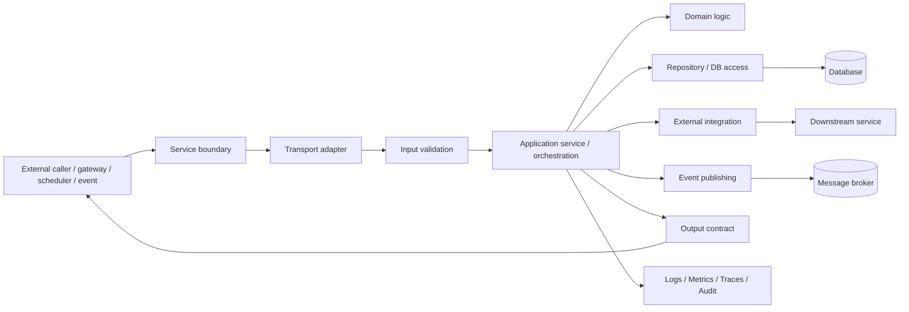
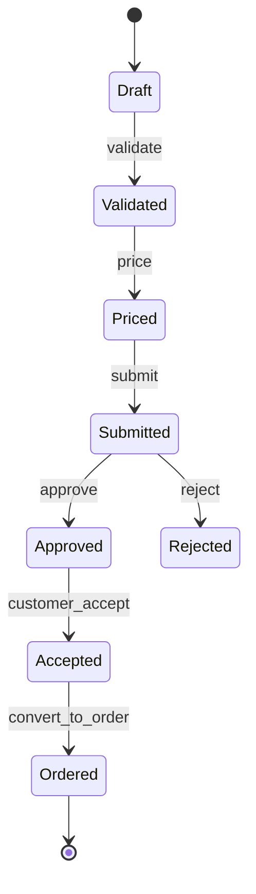
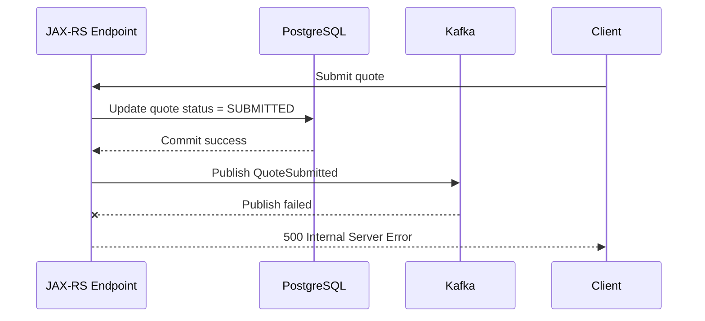
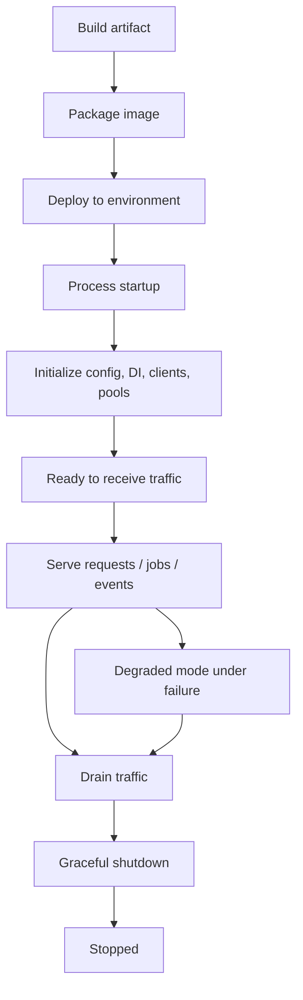

# Part 001 — Java Backend Mental Model

## 1. Posisi Part Ini Dalam Seri

Part ini membangun fondasi berpikir sebelum masuk ke JAX-RS, Jersey, Servlet container, Kafka, PostgreSQL, Kubernetes, atau cloud runtime.

Tujuannya bukan mengulang Java syntax. Tujuannya adalah mengubah cara melihat aplikasi Java backend: dari sekadar kumpulan class dan method menjadi **runtime system** yang menerima input dari luar, mengubah state, memanggil dependency, menghasilkan output, dan harus tetap bisa dioperasikan ketika ada latency, error, partial failure, retry, deployment, dan konfigurasi yang berubah.

Untuk konteks enterprise CPQ / quote management / order management seperti CSG Quote & Order, mental model ini penting karena sebagian besar bug production bukan berasal dari syntax Java yang salah, tetapi dari salah memahami boundary, lifecycle, state ownership, concurrency, dependency failure, compatibility, dan observability.

> Catatan konteks CSG: materi ini tidak mengklaim detail internal arsitektur CSG. Semua asumsi tentang runtime, framework, deployment, dan ownership harus diverifikasi di codebase, dokumentasi internal, pipeline, dan diskusi team.

---

## 2. Core Mental Model

Aplikasi Java backend production dapat dilihat sebagai kombinasi dari enam hal:

1. **Process** — JVM process yang hidup di OS/container.
2. **Boundary** — API, queue, scheduler, database, file, cache, atau event yang menjadi titik masuk/keluar.
3. **Lifecycle** — startup, ready, serve traffic, degrade, drain, shutdown.
4. **State** — in-memory state, persistent state, cached state, external state.
5. **Side effect** — write database, publish event, call downstream API, update cache, send notification.
6. **Operational surface** — log, metric, trace, health check, config, secret, alert, runbook.

Dalam aplikasi kecil, semua ini sering terasa menyatu. Dalam sistem enterprise, keenam hal ini harus dipisahkan secara eksplisit. Kalau tidak, service akan sulit di-debug, sulit di-scale, sulit di-review, dan berbahaya saat diubah.

### Simplified runtime picture



Pada JAX-RS nanti, bagian `Transport adapter` akan muncul sebagai resource class, filters, interceptors, entity providers, dan exception mappers. Tetapi sebelum masuk ke sana, penting untuk paham bahwa resource method bukan pusat aplikasi. Resource method hanyalah salah satu adapter dari dunia HTTP ke logic internal service.

---

## 3. Java Class Bukan Service Boundary

Kesalahan umum engineer yang baru masuk backend enterprise adalah melihat boundary sistem sebagai class atau method. Dalam production, boundary sebenarnya adalah kontrak eksternal dan efeknya.

Contoh:

```java
public QuoteResponse submitQuote(SubmitQuoteRequest request) {
    // validate
    // price
    // persist
    // publish event
    // return response
}
```

Secara Java, ini method. Secara sistem, ini mungkin operasi enterprise yang:

- menerima input dari HTTP API;
- memvalidasi entitlement, catalog, pricing, agreement, dan tenant;
- mengubah status quote;
- membuat audit record;
- menulis database;
- mem-publish event;
- memengaruhi downstream order management;
- harus aman terhadap retry;
- harus compatible dengan client lama;
- harus observable saat gagal.

Jadi pertanyaan senior engineer bukan hanya: “Apakah method ini compile?” tetapi:

- Apa boundary input dan output-nya?
- Apa invariant yang harus selalu benar?
- State apa yang berubah?
- Side effect apa yang terjadi?
- Apakah operasi ini idempotent?
- Apa yang terjadi jika database berhasil ditulis tetapi publish event gagal?
- Apakah error-nya bisa dipahami oleh client dan operator?
- Apakah ada log, metric, trace, dan audit yang cukup?
- Apakah perubahan ini backward-compatible?

---

## 4. Backend Service Sebagai State Transition System

Service enterprise jarang hanya membaca data. Banyak operasi adalah state transition.

Contoh generik:



Diagram di atas bukan klaim internal CSG. Ini hanya model konseptual untuk memahami sistem quote/order.

Dalam sistem seperti CPQ dan order management, setiap transition biasanya memiliki:

- precondition;
- authorization rule;
- validation rule;
- data mutation;
- audit requirement;
- event emission;
- compatibility implication;
- failure recovery path.

Sebagai senior engineer, biasakan melihat endpoint atau service method sebagai `attempted transition`, bukan hanya `function call`.

---

## 5. Boundary Utama Dalam Java Backend

### 5.1 HTTP/API boundary

HTTP boundary menerima request dari client, gateway, atau service lain. Di JAX-RS, ini akan dimodelkan oleh resource method dan provider pipeline.

Hal yang harus dipikirkan:

- method semantics;
- path dan resource naming;
- request DTO;
- response DTO;
- status code;
- error contract;
- auth/authz;
- timeout;
- idempotency;
- backward compatibility.

### 5.2 Database boundary

Database bukan sekadar tempat menyimpan object Java. Database memiliki transaction, isolation, locks, indexes, constraints, triggers, functions, dan migration lifecycle.

Hal yang harus dipikirkan:

- transaction boundary;
- consistency model;
- optimistic/pessimistic locking;
- migration compatibility;
- query performance;
- duplicate prevention;
- auditability.

### 5.3 Event boundary

Event bukan hanya “message”. Event adalah kontrak asinkron yang bisa diproses lambat, duplicate, out-of-order, atau di-replay.

Hal yang harus dipikirkan:

- event name;
- schema compatibility;
- producer/consumer ownership;
- idempotent consumer;
- retry dan DLQ;
- replay semantics;
- causation/correlation ID.

### 5.4 External service boundary

External dependency bisa lambat, gagal, berubah contract, atau memberikan partial response.

Hal yang harus dipikirkan:

- timeout;
- retry budget;
- circuit breaker;
- fallback;
- error mapping;
- request signing;
- authentication;
- observability.

### 5.5 Configuration and secret boundary

Config dan secret mengubah behavior runtime tanpa mengubah code. Ini powerful, tetapi juga riskan.

Hal yang harus dipikirkan:

- precedence;
- safe default;
- environment-specific value;
- tenant-specific value;
- secret rotation;
- drift;
- runtime reload.

### 5.6 Clock boundary

Waktu sering menjadi hidden dependency. Dalam CPQ/order systems, waktu memengaruhi effective date, catalog version, quote expiry, pricing validity, tax boundary, dan SLA.

Hal yang harus dipikirkan:

- UTC vs local time;
- timezone;
- clock abstraction;
- effective date;
- validity window;
- serialization format;
- test determinism.

---

## 6. State: In-Memory, Persistent, Cached, External

Tidak semua state setara.

| State type | Contoh | Risiko utama | Prinsip review |
|---|---|---|---|
| In-memory | static map, singleton field, local cache | hilang saat restart, tidak konsisten antar pod | jangan jadi source of truth |
| Persistent | PostgreSQL table | lock, migration, consistency, data corruption | jaga invariant dan migration safety |
| Cached | Redis/local cache | stale data, invalidation bug, stampede | TTL dan invalidation harus eksplisit |
| External | downstream service, object storage | latency, partial failure, contract drift | timeout dan error mapping wajib |
| Derived | read model, materialized view | out-of-date, replay issue | punya rebuild/reconciliation path |

Mental model senior: **setiap state harus punya owner, lifecycle, consistency expectation, dan recovery model**.

---

## 7. Side Effect Harus Eksplisit

Side effect adalah perubahan di luar memory lokal method.

Contoh side effect:

- insert/update database;
- publish Kafka event;
- call downstream API;
- write file/object storage;
- update Redis;
- send notification;
- create audit log;
- mutate workflow state.

Side effect sulit karena bisa gagal sebagian.

Contoh failure:



Pertanyaan penting:

- Apakah quote sudah submitted walau client menerima 500?
- Apakah client akan retry?
- Kalau retry, apakah duplicate state transition terjadi?
- Bagaimana event yang gagal dipublish dipulihkan?
- Apakah perlu outbox pattern?
- Apa log/audit yang menunjukkan keadaan sebenarnya?

Part selanjutnya tentang database, Kafka, outbox, dan reconciliation akan membahas ini lebih dalam. Pada part ini, cukup pegang prinsip: **setiap side effect harus punya failure model**.

---

## 8. Lifecycle Service Production

Service production melewati lifecycle berikut:



Bug sering muncul karena engineer hanya memikirkan `Serve`, tetapi lupa fase lain:

- startup bisa gagal karena missing config;
- readiness bisa true sebelum dependency siap;
- shutdown bisa memotong request/event processing;
- deploy bisa menjalankan dua versi service bersamaan;
- rollback bisa bertemu schema baru;
- retry bisa memproses request lama setelah state berubah.

---

## 9. Failure Model Dasar

Failure dalam backend bukan hanya exception.

### 9.1 Technical failure

- network timeout;
- database unavailable;
- connection pool exhausted;
- thread pool saturated;
- disk full;
- OOM;
- invalid config;
- dependency version conflict.

### 9.2 Domain failure

- quote expired;
- product not eligible;
- pricing rule missing;
- catalog version mismatch;
- approval rejected;
- order already submitted;
- tenant not allowed;
- account agreement invalid.

### 9.3 Contract failure

- client sends unknown field;
- server removes response field;
- status code changes meaning;
- event schema breaks consumer;
- enum value not handled;
- timezone format inconsistent.

### 9.4 Operational failure

- logs missing correlation ID;
- alert too noisy;
- dashboard hides real latency;
- runbook outdated;
- no replay procedure;
- no clear owner.

A good senior engineer asks: **which class of failure is this, who can recover, and what signal proves it?**

---

## 10. Debugging Mental Model

Debugging production-style systems requires boundary thinking.

### Step 1 — Define the observed symptom

Bad: “API broken.”

Better:

- `POST /quotes/{id}/submit` returns 500 for tenant X since deployment Y.
- p95 latency increased from 300 ms to 4 s after feature flag Z enabled.
- Kafka consumer lag grows only for topic A partition 3.
- DB lock wait spikes during quote approval.

### Step 2 — Identify the boundary

Ask where the symptom appears:

- inbound HTTP;
- validation;
- domain transition;
- database;
- outbound HTTP;
- Kafka;
- cache;
- config;
- deployment;
- tenant-specific data.

### Step 3 — Find the invariant violation

Examples:

- quote cannot move from `EXPIRED` to `SUBMITTED`;
- order item count must match decomposed fulfillment tasks;
- event must not be published before DB commit;
- one request must have one correlation ID across logs/traces;
- retry must not create duplicate order.

### Step 4 — Use signal, not guesswork

Minimum useful signals:

- structured logs with correlation ID;
- metric for latency/error/count;
- trace for dependency timing;
- audit log for business action;
- database query/lock insight;
- event offset/partition/consumer group;
- deployment version;
- feature flag/config snapshot.

---

## 11. Java-Specific Pitfalls In Backend Services

### 11.1 Static mutable state

Static mutable state can look convenient but is dangerous in service runtime:

- shared across all requests inside one JVM;
- not shared across pods;
- not automatically cleared between tests;
- can cause race condition;
- can hide dependency and lifecycle.

Acceptable static state is usually immutable constants. Anything else needs strong justification.

### 11.2 Exception leakage

A Java exception is not automatically an API error contract.

Bad pattern:

```java
throw new RuntimeException("Invalid quote");
```

Better mental model:

- domain error has stable error code;
- validation error has field-level detail;
- technical error is sanitized;
- retryable and non-retryable errors are separated;
- logs include internal detail, response does not leak sensitive data.

### 11.3 Hidden blocking

A method call may hide network I/O:

```java
priceService.calculate(request); // maybe calls DB, cache, rules engine, downstream service
```

Review questions:

- Does this call block?
- What timeout applies?
- Does it use connection pool?
- Can it be retried?
- Is it safe under high concurrency?
- What telemetry exists?

### 11.4 Object reuse across request boundary

Avoid sharing request-specific mutable objects in singleton services. Request-scoped data such as identity, tenant, locale, correlation ID, and transaction context must be propagated explicitly.

---

## 12. Senior Engineer PR Review Lens

Saat mereview Java backend code, gunakan checklist berikut.

### Boundary

- Apa input boundary-nya?
- Apa output contract-nya?
- Apakah DTO/domain/entity terpisah?
- Apakah error contract jelas?

### Lifecycle

- Apakah object ini singleton, request-scoped, atau transient?
- Apakah resource perlu close?
- Apakah initialization fail-fast?
- Apakah shutdown aman?

### State

- State apa yang berubah?
- Source of truth-nya apa?
- Apakah ada cache?
- Apakah ada consistency assumption?

### Side effect

- Apa side effect utama?
- Apakah side effect terjadi dalam transaction?
- Apa yang terjadi jika side effect kedua gagal?
- Apakah operasi idempotent?

### Failure

- Apa domain failure-nya?
- Apa technical failure-nya?
- Apa retry behavior-nya?
- Apakah duplicate request aman?

### Observability

- Apakah log cukup tapi tidak bocor PII/secret?
- Apakah ada metric yang relevan?
- Apakah trace menampilkan dependency timing?
- Apakah audit diperlukan?

### Compatibility

- Apakah perubahan breaking untuk client?
- Apakah enum/field baru backward-compatible?
- Apakah DB migration compatible dengan versi lama service?
- Apakah event schema compatible?

---

## 13. Internal Verification Checklist

Gunakan checklist ini saat mulai membaca codebase atau onboarding.

### Codebase structure

- Di mana entrypoint service?
- Di mana package resource/API layer?
- Di mana service/application layer?
- Di mana domain logic?
- Di mana repository/data access?
- Di mana integration client?
- Apakah ada shared framework internal?

### Runtime

- Apakah service berjalan sebagai standalone Java process, Servlet container, Jakarta EE server, atau embedded runtime?
- Apakah memakai JAX-RS/Jersey?
- Apakah memakai Spring di bagian tertentu?
- Apakah ada CDI/HK2/manual DI?
- Bagaimana startup log menunjukkan runtime aktif?

### State and data

- Database apa yang dipakai per service?
- Apakah PostgreSQL menjadi source of truth?
- Apakah Redis dipakai sebagai cache/lock/idempotency?
- Apakah ada event broker Kafka/RabbitMQ?
- Apakah ada outbox/inbox/reconciliation pattern?

### API and contract

- Di mana OpenAPI spec?
- Apakah spec generated dari code atau code generated dari spec?
- Bagaimana versioning API dilakukan?
- Bagaimana error code dicatat?
- Siapa consumer utama API?

### Observability

- Format log apa yang dipakai?
- Bagaimana correlation ID dibuat dan dipropagasi?
- Tool metrics/tracing apa yang dipakai?
- Dashboard mana yang wajib diketahui?
- Alert apa yang dimiliki service?

### Delivery and operations

- Bagaimana CI/CD pipeline berjalan?
- Bagaimana deployment ke environment dilakukan?
- Apakah ada feature flag?
- Bagaimana rollback dilakukan?
- Di mana runbook production?

---

## 14. Anti-Patterns Yang Harus Dihindari

1. **Resource method menjadi tempat semua logic** — membuat endpoint sulit diuji dan sulit berevolusi.
2. **Entity database dipakai langsung sebagai API DTO** — membocorkan schema internal dan menyulitkan compatibility.
3. **Static mutable cache tanpa invalidation** — menghasilkan bug antar tenant/pod.
4. **Retry tanpa idempotency** — menciptakan duplicate order/quote/event.
5. **Catch exception lalu return generic 500 tanpa signal** — membuat debugging production mahal.
6. **Log semua request body** — risiko PII/secret leak.
7. **Timeout tidak eksplisit** — request menggantung dan menghabiskan thread.
8. **Config default terlalu permisif** — failure tersembunyi sampai production.
9. **Tidak membedakan domain error dan technical error** — client dan operator sama-sama bingung.
10. **Menganggap single-node behavior sama dengan Kubernetes multi-pod behavior** — state lokal menjadi sumber bug.

---

## 15. Practical Exercises

### Exercise 1 — Trace one operation

Pilih satu endpoint atau service method di codebase. Buat catatan:

- input boundary;
- validation;
- domain transition;
- database operation;
- event publish;
- external calls;
- response contract;
- logs/metrics/traces;
- failure modes.

### Exercise 2 — Identify side effects

Cari satu use case yang terlihat sederhana. Tulis semua side effect yang mungkin terjadi. Tandai mana yang transactional dan mana yang tidak.

### Exercise 3 — Find hidden state

Cari penggunaan:

- `static` mutable field;
- singleton service dengan mutable field;
- local cache;
- ThreadLocal;
- global config holder.

Tentukan apakah aman, perlu refactor, atau perlu dokumentasi lifecycle.

### Exercise 4 — Review one PR lama

Ambil PR backend lama. Review ulang dengan lens:

- boundary;
- lifecycle;
- state;
- side effect;
- failure;
- observability;
- compatibility.

Tulis komentar review yang akan membantu engineer lain berpikir lebih tajam, bukan sekadar komentar style.

---

## 16. Key Takeaways

- Java backend production adalah runtime system, bukan hanya codebase.
- Resource/API method hanyalah adapter dari external contract ke internal behavior.
- State, side effect, lifecycle, dan failure harus eksplisit.
- Setiap operasi enterprise harus direview dari sisi correctness, compatibility, observability, dan recovery.
- Untuk konteks CSG Quote & Order, jangan mengarang detail internal; gunakan codebase, deployment artifact, observability, dan diskusi team sebagai evidence.

Part berikutnya akan masuk ke **JVM Process, Threads, Memory, and Resource Lifecycle**, yaitu fondasi untuk memahami kenapa service bisa lambat, stuck, OOM, kehabisan thread, atau gagal shutdown dengan benar.
