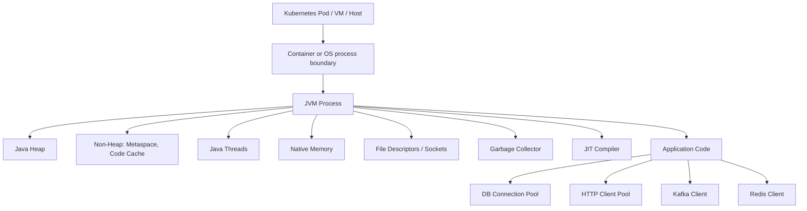
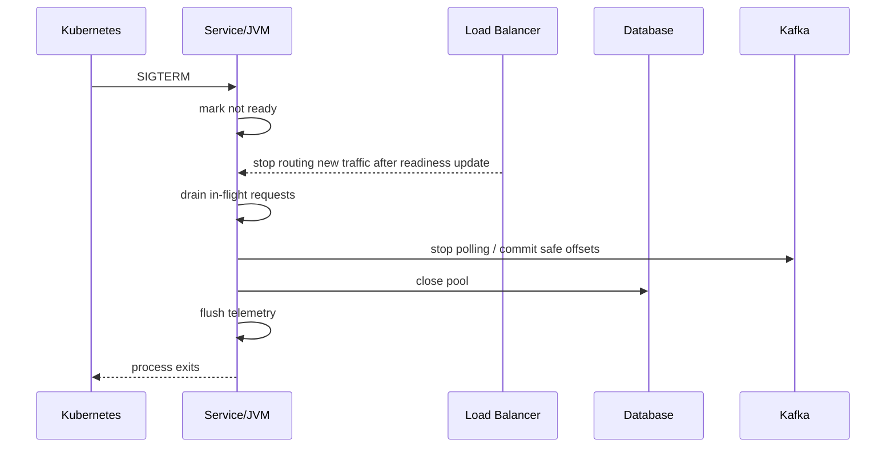
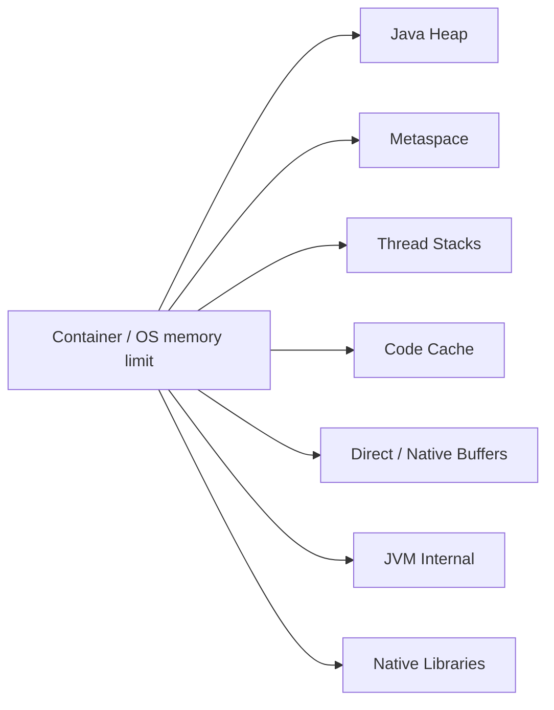

# Part 002 — JVM Process, Threads, Memory, and Resource Lifecycle

## 1. Posisi Part Ini Dalam Seri

Part sebelumnya melihat Java backend sebagai runtime system. Part ini memperdalam runtime paling dasar: **JVM process**.

Sebelum memahami JAX-RS request lifecycle, Jersey/HK2 injection, Servlet container thread model, PostgreSQL connection pool, Kafka consumer loop, atau Kubernetes OOMKilled, kita harus paham bagaimana JVM hidup, memakai CPU, membuat thread, memakai memory, membuka resource, dan berhenti.

Untuk senior engineer, JVM bukan black box. JVM adalah runtime yang punya batas fisik:

- CPU terbatas;
- memory terbatas;
- thread terbatas;
- file descriptor terbatas;
- network socket terbatas;
- connection pool terbatas;
- startup dan shutdown tidak instan;
- GC dan JIT memengaruhi latency.

> Catatan konteks CSG: part ini tidak mengklaim JVM flags, GC, container limit, atau runtime setting internal CSG. Semua detail tersebut harus diverifikasi di Dockerfile, Helm chart/Kubernetes manifest, deployment pipeline, runtime logs, dan observability platform.

---

## 2. Mental Model JVM Process

Aplikasi Java backend berjalan sebagai satu atau lebih JVM process. Dalam Kubernetes, biasanya satu pod menjalankan satu container utama yang menjalankan satu JVM process untuk service tersebut.



Ketika production incident terjadi, symptom bisa muncul di application layer, tetapi penyebabnya sering berada di resource layer:

- heap penuh;
- native memory naik;
- thread pool habis;
- connection pool exhausted;
- CPU throttled;
- GC pause tinggi;
- file descriptor habis;
- startup terlalu lama;
- shutdown memotong in-flight work.

---

## 3. JVM Lifecycle: From Startup to Shutdown

### 3.1 Startup

Saat JVM start, beberapa hal terjadi:

1. OS/container membuat process.
2. JVM membaca options dan environment.
3. Classpath/module path disiapkan.
4. Main class/container launcher dipanggil.
5. Framework bootstrap berjalan.
6. Configuration dibaca.
7. Dependency injection container diinisialisasi.
8. HTTP server/container start.
9. Connection pool/client dibuat.
10. Health/readiness mulai melaporkan status.

Dalam service JAX-RS/Jersey, startup nanti bisa mencakup:

- registrasi resource;
- registrasi provider/filter/interceptor;
- scanning package;
- inisialisasi HK2/CDI;
- konfigurasi JSON provider;
- setup servlet/Grizzly/GlassFish/Tomcat/Jetty runtime.

### Startup failure modes

- missing config;
- invalid secret;
- dependency class conflict;
- incompatible Jakarta/Jersey version;
- duplicate provider registration;
- failed DB migration;
- connection pool eager initialization gagal;
- port already in use;
- memory limit terlalu kecil;
- readiness terlalu cepat true.

### 3.2 Serving traffic

Setelah ready, JVM menerima request/job/event. Runtime mulai menjalankan:

- request threads;
- worker threads;
- scheduler threads;
- DB pool threads;
- Kafka consumer threads;
- HTTP client callbacks;
- GC threads;
- JIT compiler threads.

### 3.3 Degradation

Service bisa tetap hidup tetapi tidak sehat penuh:

- latency naik;
- queue menumpuk;
- DB pool hampir habis;
- GC overhead tinggi;
- downstream timeout;
- Kafka lag naik;
- cache unavailable;
- error rate meningkat.

Senior engineer harus membedakan **process alive** dari **service healthy**.

### 3.4 Shutdown

Shutdown dapat terjadi karena:

- deployment rolling update;
- pod eviction;
- node drain;
- crash;
- OOMKilled;
- manual restart;
- autoscaling down;
- config rollout.

Graceful shutdown idealnya:

1. stop menerima traffic baru;
2. readiness menjadi false;
3. drain in-flight requests;
4. stop background consumers/jobs;
5. flush logs/metrics/traces;
6. close DB/HTTP/Kafka/Redis clients;
7. exit process.



Shutdown failure modes:

- readiness tetap true setelah SIGTERM;
- request dipotong saat masih menulis DB;
- Kafka offset commit sebelum processing selesai;
- background job berhenti di tengah mutation;
- connection tidak ditutup;
- telemetry hilang;
- termination grace period terlalu pendek.

---

## 4. Thread Mental Model

Thread adalah unit eksekusi. Dalam backend Java, concurrency sering terjadi karena banyak request atau event diproses bersamaan.

### 4.1 Thread types yang umum

| Thread type | Contoh | Risiko |
|---|---|---|
| Request thread | Servlet/Jersey HTTP request | blocking call membuat thread habis |
| Worker thread | executor internal app | queue tak terkendali, lost context |
| Scheduler thread | periodic job | overlap job, lock tidak aman |
| DB pool helper | pool housekeeping | leak sulit terlihat |
| Kafka consumer thread | poll loop | rebalance, commit salah |
| GC thread | garbage collector | pause/CPU pressure |
| JIT compiler thread | runtime compilation | warmup latency |

### 4.2 Request thread bukan tempat kerja tak terbatas

Dalam model blocking server umum, satu request aktif memakai satu thread. Jika request melakukan blocking I/O lama, thread tersebut tidak bisa melayani request lain.

Contoh sederhana:

```java
public Response submitQuote(SubmitQuoteRequest request) {
    validate(request);
    pricingClient.calculate(request); // outbound HTTP, bisa timeout
    repository.save(request);         // DB I/O, bisa lock wait
    kafkaPublisher.publish(...);      // network I/O
    return Response.ok().build();
}
```

Method di atas terlihat sequential, tetapi setiap langkah bisa block. Jika timeout tidak eksplisit, request thread bisa tertahan lama.

### 4.3 Thread pool exhaustion

Thread pool exhaustion terjadi saat semua thread sibuk dan request/job baru harus menunggu atau ditolak.

Symptom:

- latency naik tajam;
- CPU belum tentu tinggi;
- request timeout di gateway;
- thread dump menunjukkan banyak thread `WAITING`, `TIMED_WAITING`, atau blocked di socket/DB;
- queue executor membesar;
- downstream call menumpuk.

Root cause umum:

- timeout terlalu panjang atau tidak ada;
- downstream lambat;
- DB lock wait;
- connection pool kecil;
- retry storm;
- blocking call di executor kecil;
- synchronous fan-out ke banyak dependency.

### 4.4 ThreadLocal risk

`ThreadLocal` sering dipakai untuk MDC, security context, tenant context, transaction context, atau request context. Masalahnya, request dapat berpindah execution boundary ke executor lain.

Risiko:

- correlation ID hilang;
- tenant context bocor ke request lain;
- security context tidak ikut async task;
- MDC tidak dibersihkan;
- memory leak karena ThreadLocal menyimpan object besar.

Prinsip:

- context harus dipropagasi eksplisit;
- ThreadLocal harus clear setelah request;
- executor wrapper harus menjaga context jika memang perlu;
- jangan simpan object domain besar di ThreadLocal.

---

## 5. Memory Mental Model

Memory JVM bukan hanya heap.



### 5.1 Heap

Heap menyimpan object Java. Contoh:

- DTO request/response;
- domain object;
- collections;
- caches;
- JSON object tree;
- query result;
- temporary buffers.

Heap failure modes:

- memory leak;
- object allocation terlalu besar;
- load entire file into memory;
- query mengambil terlalu banyak rows;
- unbounded cache;
- unbounded queue;
- large JSON payload;
- GC overhead tinggi.

### 5.2 Metaspace

Metaspace menyimpan class metadata. Biasanya masalah muncul pada:

- classloader leak;
- dynamic proxy/class generation berlebihan;
- redeploy di container lama;
- library instrumentation.

### 5.3 Thread stack

Setiap thread butuh stack memory. Terlalu banyak thread dapat membuat native memory habis walau heap masih aman.

Risiko:

- thread pool terlalu besar;
- per-request thread ditambah executor tanpa kontrol;
- stuck thread tidak pernah selesai;
- scheduler membuat thread baru terus.

### 5.4 Direct/native memory

Native memory bisa dipakai oleh:

- NIO buffers;
- TLS/native libraries;
- compression;
- Netty/HTTP clients;
- JVM internals;
- memory-mapped files.

OOMKilled di Kubernetes bisa terjadi tanpa Java `OutOfMemoryError` yang jelas jika total process memory melebihi container limit.

---

## 6. Garbage Collection and Latency

Garbage Collector membebaskan object yang tidak lagi dipakai. Namun GC memakai CPU dan kadang menyebabkan pause.

Untuk Java 17, pilihan GC umum meliputi G1 GC sebagai default server-class collector, serta opsi lain seperti ZGC atau Shenandoah tergantung distribusi dan kebutuhan latency. Detail aktual harus diverifikasi di JVM flags runtime.

### GC-related symptoms

- p95/p99 latency naik;
- CPU tinggi tanpa throughput naik;
- request timeout saat traffic tinggi;
- log menunjukkan frequent young GC/full GC;
- allocation rate tinggi;
- memory sawtooth tidak stabil;
- pod restart karena memory.

### Common root causes

- response payload terlalu besar;
- parsing JSON besar ke object tree;
- collection intermediate terlalu banyak;
- mapping DTO/entity berlebihan;
- unbounded cache;
- stream dibuffer penuh;
- query tanpa pagination;
- log string besar.

### Review questions

- Apakah endpoint bisa menerima payload besar?
- Apakah file/stream dibaca penuh ke memory?
- Apakah list query punya limit?
- Apakah mapper membuat copy object terlalu banyak?
- Apakah cache punya TTL dan max size?
- Apakah ada memory profile untuk operasi berat?

---

## 7. CPU, Blocking I/O, and Throughput

CPU tinggi tidak selalu buruk. CPU tinggi bisa berarti service bekerja. Yang berbahaya adalah CPU tinggi dengan throughput turun atau latency naik.

### CPU pressure sources

- JSON serialization besar;
- compression;
- encryption/TLS;
- regex berat;
- inefficient mapping;
- busy loop;
- excessive logging;
- GC overhead;
- high-cardinality metrics;
- crypto/request signing.

### Blocking I/O sources

- database query;
- downstream HTTP;
- Kafka broker;
- Redis;
- object storage;
- filesystem;
- DNS lookup;
- TLS handshake.

Blocking I/O tidak selalu salah. Banyak enterprise Java service berbasis blocking I/O. Yang penting adalah:

- thread pool dibatasi;
- timeout eksplisit;
- pool size masuk akal;
- queue tidak unbounded;
- backpressure ada;
- dependency latency terlihat di trace/metric.

---

## 8. Resource Lifecycle

Resource adalah sesuatu yang harus dibuat, dipakai, dan ditutup dengan benar.

### 8.1 Common resources

- database connection pool;
- HTTP client;
- Kafka producer;
- Kafka consumer;
- Redis client;
- thread pool;
- scheduler;
- file stream;
- object storage client;
- metrics/tracing exporter.

### 8.2 Resource ownership

Setiap resource harus punya owner:

- siapa yang membuat;
- kapan dibuat;
- apakah lazy atau eager;
- siapa yang menutup;
- kapan ditutup;
- apa yang terjadi saat gagal dibuat;
- apa yang terjadi saat dependency unavailable.

### 8.3 Bad patterns

#### Membuat client per request

```java
public Response callDownstream(Request request) {
    HttpClient client = HttpClient.newHttpClient();
    // use client once
}
```

Risiko:

- connection reuse hilang;
- resource overhead tinggi;
- DNS/TLS berulang;
- sulit dikonfigurasi dan diobservasi.

#### Tidak menutup response/stream

```java
InputStream in = client.downloadFile(id);
byte[] bytes = in.readAllBytes();
```

Risiko:

- memory spike;
- connection leak;
- file descriptor leak;
- timeout lambat.

#### Executor unbounded

```java
ExecutorService executor = Executors.newCachedThreadPool();
```

Risiko:

- thread explosion;
- native memory habis;
- context propagation kacau;
- graceful shutdown sulit.

---

## 9. JVM In Container: Early Mental Model

Topik JVM in containers akan dibahas lebih dalam di Part 100. Namun fondasinya perlu dikenali sejak awal.

Di container, JVM hidup dalam limit CPU/memory yang dikontrol platform. Hal ini memengaruhi:

- heap sizing;
- native memory;
- GC thread count;
- CPU throttling;
- startup probe;
- OOMKilled;
- pod restart;
- readiness/liveness behavior.

### OOMKilled vs Java OutOfMemoryError

- `OutOfMemoryError` muncul dari JVM ketika alokasi memory gagal di dalam JVM.
- `OOMKilled` adalah keputusan platform/OS/container runtime ketika process melampaui limit memory.

Dalam kasus OOMKilled, aplikasi bisa mati tanpa sempat menulis log error Java yang jelas.

### Internal checks awal

- Berapa memory limit pod?
- Apakah heap diset via `-Xmx` atau percentage?
- Apakah native memory diperhitungkan?
- Berapa jumlah thread maksimum?
- Apakah ada GC log?
- Apakah restart reason terlihat di Kubernetes events?

---

## 10. Health, Readiness, and Liveness

Health endpoint sering terlihat sederhana, tetapi sangat menentukan production behavior.

### Liveness

Menjawab: “Apakah process ini perlu direstart?”

Liveness tidak boleh terlalu sensitif. Jika liveness gagal karena dependency sementara lambat, Kubernetes bisa restart pod terus-menerus dan memperburuk incident.

### Readiness

Menjawab: “Apakah pod ini siap menerima traffic?”

Readiness harus false saat:

- startup belum selesai;
- service sedang shutdown/draining;
- dependency wajib tidak tersedia;
- local critical initialization gagal.

### Startup probe

Menjawab: “Apakah aplikasi masih dalam fase startup normal?”

Berguna untuk service Java yang startup-nya lambat karena classloading, DI bootstrap, migration check, atau warmup.

### Review questions

- Apakah readiness true terlalu cepat?
- Apakah liveness memeriksa dependency eksternal secara agresif?
- Apakah shutdown mengubah readiness sebelum stop?
- Apakah startup probe cukup untuk cold start?
- Apakah health endpoint sendiri bisa overload?

---

## 11. Thread Dump, Heap Dump, and Runtime Diagnostics

### 11.1 Thread dump

Thread dump berguna untuk melihat apa yang sedang dilakukan thread.

Cari pola:

- banyak thread blocked di DB driver;
- banyak thread blocked di HTTP client;
- deadlock;
- executor queue menumpuk;
- request thread menunggu lock;
- Kafka consumer stuck;
- scheduler overlap.

### 11.2 Heap dump

Heap dump berguna untuk memory leak atau object growth.

Cari pola:

- collection besar;
- cache tanpa bound;
- DTO besar;
- byte array besar;
- retained object dari static field;
- classloader leak.

### 11.3 GC log

GC log membantu memahami:

- allocation rate;
- pause time;
- heap pressure;
- full GC;
- humongous allocation;
- memory after GC.

### 11.4 Container/platform signal

Untuk Kubernetes:

- pod restart count;
- last termination reason;
- OOMKilled;
- CPU throttling;
- memory working set;
- readiness/liveness failures;
- node pressure;
- events.

---

## 12. Production Failure Scenarios

### Scenario A — Latency naik tetapi CPU rendah

Kemungkinan:

- blocking I/O;
- DB lock wait;
- downstream timeout;
- connection pool exhausted;
- thread pool saturated;
- DNS/TLS issue.

Investigasi:

- trace dependency timing;
- DB pool metrics;
- thread dump;
- downstream latency metrics;
- gateway timeout logs.

### Scenario B — CPU tinggi dan latency naik

Kemungkinan:

- GC overhead;
- serialization besar;
- compression;
- inefficient loop;
- logging terlalu banyak;
- high-cardinality metrics;
- crypto overhead.

Investigasi:

- CPU profile;
- GC logs;
- allocation profile;
- endpoint payload size;
- recent deployment diff.

### Scenario C — Pod sering restart tanpa Java stacktrace

Kemungkinan:

- OOMKilled;
- liveness probe terlalu agresif;
- crash native;
- container limit terlalu kecil;
- startup timeout;
- node eviction.

Investigasi:

- Kubernetes describe pod;
- last state/reason;
- memory metrics;
- events;
- container logs before restart;
- probe configuration.

### Scenario D — Request berhasil tapi event tidak muncul

Kemungkinan:

- publish setelah DB commit gagal;
- Kafka producer flush tidak selesai saat shutdown;
- outbox publisher lag;
- transaction boundary salah;
- topic/config salah;
- serialization failure.

Investigasi:

- application log dengan correlation ID;
- DB state;
- outbox table;
- producer error metric;
- Kafka topic/partition;
- deployment/shutdown timing.

---

## 13. PR Review Checklist: JVM and Runtime Foundation

### Startup

- Apakah config divalidasi saat startup?
- Apakah missing required config membuat service fail-fast?
- Apakah client/pool dibuat sekali dan reusable?
- Apakah startup dependency terlalu berat?

### Threading

- Apakah ada executor baru?
- Apakah executor bounded?
- Apakah shutdown executor jelas?
- Apakah context propagation dipikirkan?
- Apakah blocking call terjadi di thread yang tepat?

### Memory

- Apakah payload besar dibuffer?
- Apakah collection/query result dibatasi?
- Apakah cache bounded dan punya TTL?
- Apakah file/stream diproses streaming?

### Resource

- Apakah resource closeable ditutup?
- Apakah HTTP/DB/Kafka/Redis client lifecycle jelas?
- Apakah retry bisa membuat resource pressure?
- Apakah pool size masuk akal?

### Shutdown

- Apakah graceful shutdown aman?
- Apakah consumer/job berhenti dengan benar?
- Apakah in-flight request dipotong?
- Apakah telemetry flush?

### Observability

- Apakah metric resource tersedia?
- Apakah log cukup untuk startup/shutdown failure?
- Apakah trace menampilkan dependency latency?
- Apakah thread/heap/GC diagnostic bisa diambil saat incident?

---

## 14. Internal Verification Checklist

Gunakan checklist ini untuk memvalidasi kondisi nyata di codebase dan runtime internal.

### JVM and process

- Java version aktual apa?
- Vendor/distribution JDK apa?
- Bagaimana JVM dijalankan di Dockerfile/entrypoint?
- Apa JVM flags production?
- Apakah ada perbedaan flags antar environment?

### Memory and GC

- Berapa container memory request/limit?
- Apakah `-Xmx` eksplisit atau percentage?
- GC apa yang dipakai?
- Apakah GC logs aktif?
- Apakah heap dump on OOM aktif?
- Di mana heap dump disimpan?

### Threads and pools

- Thread pool apa saja yang ada?
- Berapa request thread max?
- Berapa DB pool max?
- Berapa HTTP client pool max?
- Apakah scheduler bisa overlap?
- Apakah executor bounded?

### Startup and shutdown

- Apa entrypoint utama?
- Apakah ada startup validation?
- Apakah migration dijalankan saat startup atau pipeline?
- Apakah shutdown hook ada?
- Berapa termination grace period?
- Apakah readiness berubah saat shutdown?

### Health and observability

- Endpoint health/readiness/liveness apa?
- Apakah probes dikonfigurasi di Kubernetes?
- Dashboard JVM apa yang tersedia?
- Apakah ada metrics heap, GC, thread, CPU, pool?
- Apakah ada alert untuk OOM/restart/thread/pool?

### Runtime evidence

- Cek startup logs.
- Cek Kubernetes manifest/Helm values.
- Cek Dockerfile.
- Cek CI/CD deploy configuration.
- Cek runbook production.
- Cek incident lama terkait OOM, latency, thread, DB pool, Kafka lag.

---

## 15. Anti-Patterns Yang Harus Dihindari

1. **Membuat client/pool per request** — boros resource dan merusak connection reuse.
2. **Executor unbounded** — dapat membuat thread explosion dan OOM.
3. **Queue unbounded** — menyembunyikan overload sampai memory habis.
4. **Tidak punya timeout** — thread menggantung dan pool habis.
5. **Read all bytes untuk file besar** — heap spike dan GC pressure.
6. **Readiness true sebelum service siap** — traffic masuk terlalu cepat.
7. **Liveness terlalu agresif** — pod restart saat dependency lambat sementara.
8. **Tidak menutup stream/response** — connection/file descriptor leak.
9. **Mengandalkan in-memory state sebagai source of truth** — tidak aman di multi-pod runtime.
10. **Tidak punya runtime metrics** — incident berubah menjadi tebak-tebakan.

---

## 16. Practical Exercises

### Exercise 1 — Map JVM runtime from codebase

Cari cara service dijalankan:

- Dockerfile;
- entrypoint script;
- Maven plugin;
- main class;
- server/container bootstrap;
- Kubernetes deployment.

Tulis diagram singkat dari container start sampai service ready.

### Exercise 2 — Inventory all pools

Buat daftar:

- request thread pool;
- DB pool;
- HTTP client pool;
- Kafka producer/consumer;
- Redis client;
- executor internal;
- scheduler.

Untuk masing-masing, catat owner, size, timeout, shutdown, dan metric.

### Exercise 3 — Read a thread dump

Ambil thread dump dari local atau environment non-production. Kelompokkan thread berdasarkan fungsi. Cari thread yang blocked/waiting dan tebak dependency yang sedang ditunggu.

### Exercise 4 — Memory risk review

Pilih endpoint yang mengembalikan list atau file. Jawab:

- apakah ada pagination/limit?
- apakah file diproses streaming?
- apakah response bisa sangat besar?
- apakah mapper membuat copy besar?
- apakah log mencetak payload besar?

### Exercise 5 — Shutdown path review

Cari apakah service memiliki graceful shutdown. Cek apakah:

- readiness berubah;
- executor ditutup;
- Kafka consumer berhenti aman;
- DB pool ditutup;
- telemetry flush;
- termination grace period cukup.

---

## 17. Key Takeaways

- JVM service adalah process dengan batas CPU, memory, thread, socket, dan lifecycle.
- Thread pool, connection pool, timeout, dan queue adalah bagian dari correctness production.
- Heap bukan satu-satunya memory; native memory, thread stack, metaspace, dan direct buffer juga penting.
- `process alive` tidak sama dengan `service ready` atau `service healthy`.
- Graceful shutdown sama pentingnya dengan startup.
- Debugging production membutuhkan thread dump, heap/GC insight, pool metrics, logs, traces, dan platform signal.

Part berikutnya akan masuk ke **HTTP Semantics for Java Engineers**, yaitu fondasi untuk memahami method semantics, idempotency, status code, header, cache, dan bagaimana semua itu nanti dipetakan ke JAX-RS resource method.
