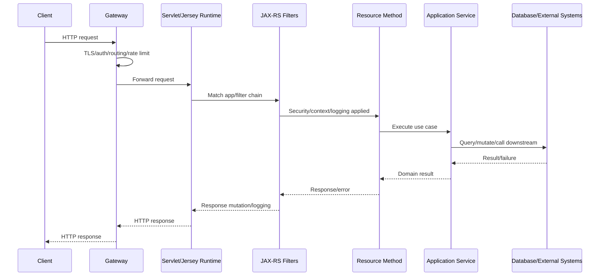

# Part 003 — HTTP Semantics for Java Engineers

> Fokus part ini: membangun mental model HTTP sebagai **kontrak sistem**, bukan sekadar cara mengirim JSON ke method Java.

Di sistem enterprise seperti CPQ, quote management, order management, atau quote-to-cash, HTTP endpoint bukan hanya “controller”. Endpoint adalah boundary antar sistem, antar tim, antar runtime, antar deployment, dan sering kali antar organisasi. Kesalahan kecil pada semantics HTTP dapat berubah menjadi bug serius: operasi dipanggil dua kali, client melakukan retry yang salah, gateway meng-cache response yang tidak boleh di-cache, atau consumer salah membaca arti status code.

Untuk engineer Java yang baru masuk ke stack JAX-RS, jebakan paling umum adalah melihat HTTP sebagai:

```java
String inputJson -> Java method -> String outputJson
```

Padahal model production yang lebih benar adalah:

```text
network request
  -> HTTP semantics
  -> gateway/proxy/security/filtering
  -> container/runtime
  -> JAX-RS matching and binding
  -> application behavior
  -> response contract
  -> client interpretation
  -> retry/cache/observability consequence
```

JAX-RS memudahkan kita menulis endpoint, tetapi JAX-RS tidak menggantikan kewajiban untuk memahami HTTP.

---

## 1. Core Mental Model

HTTP adalah protocol berbasis **message exchange**. Client mengirim request, server mengembalikan response. Namun, yang penting bukan hanya format message-nya, melainkan **semantics** di balik message itu.

Semantics menjawab pertanyaan seperti:

- Apakah request ini hanya membaca data atau mengubah state?
- Apakah request ini aman di-retry?
- Apakah response boleh di-cache?
- Jika request gagal, siapa yang boleh mencoba ulang?
- Jika status code `409` muncul, apakah client harus retry, memperbaiki request, atau reload state?
- Jika response `202 Accepted`, apakah operasi sudah selesai atau baru diterima?
- Jika ada `ETag`, apakah client boleh melakukan conditional update?

Dalam JAX-RS, semantics HTTP diekspresikan lewat annotation, method signature, header, status code, DTO shape, dan provider/filter behavior. Namun semantics aslinya tetap berasal dari HTTP.

---

## 2. HTTP Is Not RPC with JSON

Banyak backend Java system secara tidak sadar menjadikan HTTP sebagai RPC:

```http
POST /doCreateQuote
POST /executeSubmitOrder
POST /processCancelRequest
POST /getQuoteDetails
```

Endpoint seperti ini mungkin “jalan”, tetapi semantics-nya lemah. Client, gateway, observability tool, cache, retry library, dan generated client tidak bisa memahami niat operasi dengan baik.

Pendekatan HTTP-oriented lebih baik:

```http
POST /quotes
GET /quotes/{quoteId}
POST /quotes/{quoteId}/submit
POST /orders/{orderId}/cancel-requests
GET /orders/{orderId}
```

Ini bukan soal REST purity. Ini soal membuat boundary yang:

- bisa direview,
- bisa diobservasi,
- bisa di-govern,
- bisa di-versioning,
- bisa di-debug,
- bisa diberi security policy,
- bisa dijelaskan kepada consumer.

Di enterprise production system, endpoint yang “jelas secara HTTP” lebih mudah dioperasikan daripada endpoint yang hanya jelas bagi author-nya.

---

## 3. Request Anatomy

HTTP request memiliki beberapa bagian utama:

```http
POST /quotes HTTP/1.1
Host: api.example.com
Content-Type: application/json
Accept: application/json
Authorization: Bearer <token>
X-Correlation-Id: 9f1a...
Idempotency-Key: create-quote-123

{
  "customerId": "CUST-001",
  "catalogVersion": "2026.07",
  "items": []
}
```

Bagian-bagiannya:

| Bagian | Fungsi | Contoh |
|---|---|---|
| Method | Niat operasi | `GET`, `POST`, `PUT`, `PATCH`, `DELETE` |
| Target URI | Resource atau action target | `/quotes`, `/quotes/{id}` |
| Headers | Metadata request | `Accept`, `Content-Type`, `Authorization` |
| Body | Representation atau command payload | JSON/XML/binary/form |

Dalam JAX-RS, bagian ini biasanya masuk ke:

```java
@Path("/quotes")
public class QuoteResource {

    @POST
    @Consumes(MediaType.APPLICATION_JSON)
    @Produces(MediaType.APPLICATION_JSON)
    public Response createQuote(
            @HeaderParam("Idempotency-Key") String idempotencyKey,
            CreateQuoteRequest request
    ) {
        // application behavior
    }
}
```

Yang penting: method Java hanyalah target akhir. Semantics sudah mulai terbentuk sebelum method dipanggil.

---

## 4. Response Anatomy

HTTP response juga bukan hanya JSON body.

```http
HTTP/1.1 201 Created
Content-Type: application/json
Location: /quotes/Q-10001
ETag: "quote-v3"
X-Correlation-Id: 9f1a...

{
  "quoteId": "Q-10001",
  "status": "DRAFT",
  "version": 3
}
```

Bagian-bagiannya:

| Bagian | Fungsi | Contoh |
|---|---|---|
| Status code | Outcome semantics | `201 Created`, `400 Bad Request`, `409 Conflict` |
| Headers | Metadata response | `Location`, `ETag`, `Retry-After` |
| Body | Representation atau error detail | resource DTO, error envelope |

Di JAX-RS:

```java
return Response
    .created(URI.create("/quotes/" + quote.id()))
    .tag(new EntityTag("quote-v" + quote.version()))
    .entity(QuoteResponse.from(quote))
    .build();
```

Response yang baik membantu client menjawab:

- Apakah operasi berhasil?
- Resource apa yang dibuat/diubah?
- Apakah saya boleh retry?
- Apakah state saya stale?
- Apakah saya perlu melakukan follow-up request?
- Apakah error terjadi karena input, permission, conflict, atau server failure?

---

## 5. Resource, Representation, and State

Tiga konsep HTTP yang harus dibedakan:

### Resource

Resource adalah konsep yang dapat diidentifikasi oleh URI.

Contoh:

```text
/quotes/Q-10001
/orders/O-7781
/customers/C-001
/catalogs/enterprise-v2026/items/SKU-1
```

Resource bukan selalu table database. Resource adalah **API-facing abstraction**.

Satu resource bisa berasal dari:

- satu row database,
- gabungan beberapa table,
- hasil query/materialized view,
- state machine projection,
- output dari service lain,
- hasil computation.

### Representation

Representation adalah bentuk resource yang dikirim lewat HTTP.

Contoh:

```json
{
  "quoteId": "Q-10001",
  "status": "DRAFT",
  "total": "120.50",
  "currency": "USD"
}
```

Resource yang sama bisa punya representation berbeda:

- JSON untuk API modern,
- XML untuk legacy integration,
- partial response untuk UI,
- summary response untuk list endpoint,
- detailed response untuk read endpoint.

### State

State adalah data aktual di server-side domain/persistence system.

Jangan samakan:

```text
HTTP representation == domain model == database entity
```

Dalam enterprise system, ketiganya biasanya harus dipisah.

---

## 6. URI Is a Contract

URI bukan hanya routing string. URI adalah bagian dari public contract.

Contoh buruk:

```http
POST /quoteService/doAction?action=submit&id=Q-1
```

Masalah:

- action tersembunyi di query parameter,
- sulit diberi access policy granular,
- sulit di-lint,
- sulit dibaca dari log,
- sulit dikelola compatibility-nya.

Contoh lebih baik:

```http
POST /quotes/Q-1/submission
```

Atau jika submission adalah command:

```http
POST /quote-submissions
{
  "quoteId": "Q-1"
}
```

Pilihan desain bergantung pada domain dan governance internal, tetapi URI harus menjelaskan target operasi secara stabil.

### URI design heuristics

Gunakan URI untuk menyatakan:

- resource identity,
- collection,
- sub-resource,
- command resource,
- operation boundary yang penting secara domain.

Hindari URI yang terlalu mencerminkan:

- nama class Java,
- nama method service,
- nama table database,
- implementation package,
- workflow internal yang bisa berubah.

---

## 7. HTTP Methods: Overview

Part berikutnya akan membahas safe/idempotent/cacheable secara khusus. Di sini cukup pahami mapping awal:

| Method | Common semantics | Typical use |
|---|---|---|
| `GET` | Read representation | Ambil quote/order/customer |
| `HEAD` | Read metadata only | Cek existence/cache metadata |
| `POST` | Create subordinate resource atau execute command | Create quote, submit quote |
| `PUT` | Replace resource at known URI | Replace full config/resource |
| `PATCH` | Partial modification | Update selected fields |
| `DELETE` | Remove/cancel resource relation | Delete draft, cancel registration |
| `OPTIONS` | Discover allowed operations/CORS preflight | Browser/gateway behavior |

Kesalahan umum:

- memakai `GET` untuk operasi mutasi,
- memakai `POST` untuk semua hal,
- memakai `PUT` untuk partial update tanpa semantics jelas,
- memakai `DELETE` untuk operasi bisnis yang sebenarnya bukan deletion,
- menganggap `POST` tidak pernah boleh idempotent,
- menganggap `DELETE` berarti physical delete database row.

HTTP method tidak memaksa implementation tertentu, tetapi memberi ekspektasi kepada client dan platform.

---

## 8. Status Code Families

Status code adalah bahasa outcome.

### 2xx — Success

| Code | Meaning | Typical JAX-RS use |
|---|---|---|
| `200 OK` | Request berhasil dan ada body | GET/read, command result |
| `201 Created` | Resource baru dibuat | POST create |
| `202 Accepted` | Request diterima, belum selesai | async command |
| `204 No Content` | Berhasil tanpa body | delete/update tanpa representation |

### 3xx — Redirection

Jarang dipakai langsung di internal API, tetapi tetap penting untuk gateway, canonical URL, atau file download.

### 4xx — Client/request problem

| Code | Meaning | Example |
|---|---|---|
| `400 Bad Request` | Request invalid secara syntax/shape | malformed JSON |
| `401 Unauthorized` | Belum/invalid authentication | missing token |
| `403 Forbidden` | Authenticated tapi tidak boleh | no permission |
| `404 Not Found` | Resource tidak ditemukan atau disembunyikan | quote not found |
| `409 Conflict` | Conflict dengan current state | stale version, invalid state transition |
| `412 Precondition Failed` | Conditional request gagal | ETag mismatch |
| `415 Unsupported Media Type` | `Content-Type` tidak didukung | XML dikirim ke JSON-only endpoint |
| `422 Unprocessable Entity` | Semantically invalid | valid JSON, invalid business input |
| `429 Too Many Requests` | Rate limited | tenant/client over limit |

### 5xx — Server/platform problem

| Code | Meaning | Example |
|---|---|---|
| `500 Internal Server Error` | Unexpected server error | bug/unhandled exception |
| `502 Bad Gateway` | Gateway menerima bad upstream response | proxy/upstream failure |
| `503 Service Unavailable` | Service unavailable/overloaded | maintenance, circuit open |
| `504 Gateway Timeout` | Gateway timeout | downstream too slow |

Status code bukan dekorasi. Status code mengendalikan retry, alerting, dashboard, client branch, generated SDK behavior, dan incident triage.

---

## 9. Header Strategy: Metadata Must Not Be an Afterthought

Headers membawa metadata yang tidak semestinya masuk body.

Contoh header penting:

| Header | Purpose |
|---|---|
| `Content-Type` | Format request body |
| `Accept` | Format response yang diinginkan |
| `Authorization` | Credential/auth token |
| `X-Correlation-Id` atau standard internal equivalent | Trace request lintas service |
| `Idempotency-Key` | Deduplication command request |
| `ETag` | Resource version/cache validator |
| `If-Match` | Conditional update |
| `If-None-Match` | Conditional read/cache validation |
| `Retry-After` | Signal kapan client boleh retry |
| `Location` | URI resource yang dibuat |
| `Deprecation` / `Sunset` | API lifecycle signal, jika digunakan |

Di JAX-RS, header bisa diakses lewat:

```java
@HeaderParam("X-Correlation-Id") String correlationId
```

atau:

```java
@Context HttpHeaders headers
```

Untuk production system, lebih baik header umum seperti correlation ID, auth identity, tenant ID, dan trace context diproses di filter/provider, bukan manual di setiap resource method.

---

## 10. Content Negotiation

Content negotiation adalah proses menentukan representation berdasarkan request dan server capability.

Client mengirim:

```http
Accept: application/json
Content-Type: application/json
```

Server menyatakan di JAX-RS:

```java
@Consumes(MediaType.APPLICATION_JSON)
@Produces(MediaType.APPLICATION_JSON)
```

Failure umum:

| Symptom | Possible cause |
|---|---|
| `415 Unsupported Media Type` | `Content-Type` tidak cocok dengan `@Consumes` |
| `406 Not Acceptable` | `Accept` tidak cocok dengan `@Produces` |
| Serialization error | Provider JSON/XML tidak aktif atau DTO tidak serializable |
| Wrong response format | Default provider/media type tidak eksplisit |

Untuk enterprise APIs, eksplisit lebih baik daripada implicit default. Jika endpoint hanya mendukung JSON, nyatakan dengan jelas.

---

## 11. HTTP as a Lifecycle Contract

Sebuah request melewati banyak boundary sebelum dan sesudah resource method.



HTTP semantics bisa berubah atau rusak di tiap boundary:

- gateway mengubah path,
- proxy menghapus header,
- filter mengganti status code,
- exception mapper menyembunyikan error,
- compression layer mengubah body,
- gateway timeout mengembalikan `504`, bukan service,
- retry layer mengirim request dua kali.

Karena itu, debug HTTP tidak cukup hanya melihat Java stack trace.

---

## 12. JAX-RS Mapping to HTTP Concepts

| HTTP concept | JAX-RS surface |
|---|---|
| URI path | `@Path` |
| Method | `@GET`, `@POST`, `@PUT`, `@PATCH`, `@DELETE` |
| Request body format | `@Consumes` |
| Response body format | `@Produces` |
| Header | `@HeaderParam`, `HttpHeaders`, filter |
| Query parameter | `@QueryParam` |
| Path parameter | `@PathParam` |
| Status code | `Response.status(...)`, exception mapper |
| Response header | `Response.header(...)` |
| Body conversion | `MessageBodyReader`, `MessageBodyWriter` |
| Error mapping | `ExceptionMapper<T>` |
| Request context | `@Context` |

JAX-RS membuat mapping ini deklaratif. Tetapi deklarasi yang salah tetap menghasilkan contract yang salah.

---

## 13. Example: Read Quote Endpoint

```java
@Path("/quotes")
@Produces(MediaType.APPLICATION_JSON)
public class QuoteResource {

    private final QuoteApplicationService quoteService;

    public QuoteResource(QuoteApplicationService quoteService) {
        this.quoteService = quoteService;
    }

    @GET
    @Path("/{quoteId}")
    public Response getQuote(@PathParam("quoteId") String quoteId) {
        QuoteView quote = quoteService.getQuote(quoteId);
        return Response.ok(QuoteResponse.from(quote)).build();
    }
}
```

Semantics:

- `GET` berarti read representation.
- Tidak boleh melakukan mutation tersembunyi.
- Response `200` berarti representation ditemukan.
- Response `404` berarti quote tidak ditemukan atau tidak visible.
- Response `403` berarti identity valid tetapi tidak punya akses.
- Response body adalah API representation, bukan entity database mentah.

PR review question:

- Apakah method ini benar-benar safe?
- Apakah read ini punya side effect seperti “mark as viewed”?
- Apakah tenant/authorization diterapkan?
- Apakah response shape backward-compatible?
- Apakah not found dan forbidden dibedakan atau sengaja disamarkan?

---

## 14. Example: Create Quote Endpoint

```java
@POST
@Path("/quotes")
@Consumes(MediaType.APPLICATION_JSON)
@Produces(MediaType.APPLICATION_JSON)
public Response createQuote(
        @HeaderParam("Idempotency-Key") String idempotencyKey,
        CreateQuoteRequest request
) {
    CreatedQuote created = quoteService.createQuote(idempotencyKey, request);

    return Response
            .created(URI.create("/quotes/" + created.quoteId()))
            .entity(QuoteResponse.from(created))
            .build();
}
```

Semantics:

- `POST /quotes` membuat resource baru di collection `quotes`.
- `201 Created` lebih tepat daripada selalu `200 OK`.
- `Location` membantu client mengetahui canonical URI resource baru.
- `Idempotency-Key` dapat diperlukan jika client/gateway bisa retry.

Failure modes:

- client timeout tetapi server berhasil membuat quote,
- retry tanpa idempotency membuat duplicate quote,
- response `500` padahal operasi sudah committed,
- generated client tidak tahu resource baru karena tidak ada `Location`.

---

## 15. Status Code Strategy Must Be Consistent

Endpoint yang berbeda tidak boleh mengirim arti berbeda untuk error yang sama.

Contoh inconsistent:

| Situation | Endpoint A | Endpoint B |
|---|---|---|
| Validation failed | `400` | `422` |
| State conflict | `400` | `409` |
| Unauthorized | `403` | `401` |
| Resource missing | `200` with `null` | `404` |

Akibatnya:

- client logic penuh exception case,
- observability tidak bisa aggregate error dengan benar,
- API governance sulit,
- generated SDK behavior tidak konsisten,
- developer baru salah meniru endpoint lama.

Strategi status code sebaiknya menjadi platform/team-level convention.

---

## 16. HTTP Semantics and Observability

HTTP fields menjadi dimensi observability:

- method,
- route template,
- status code,
- response time,
- request size,
- response size,
- client/tenant,
- error code,
- correlation ID,
- trace ID.

Namun hati-hati dengan cardinality. Jangan menjadikan raw URI sebagai metric label:

```text
BAD: /quotes/Q-10001
GOOD: /quotes/{quoteId}
```

Jika metric label memakai raw resource ID, observability backend bisa mengalami high-cardinality explosion.

JAX-RS route template sering perlu diekstrak dari resource matching metadata atau instrumentation library. Ini harus diverifikasi di runtime aktual.

---

## 17. Common Failure Modes

### 17.1 GET with hidden mutation

Contoh:

```http
GET /quotes/Q-1/recalculate
```

Jika request ini mengubah pricing result, status, timestamp, atau audit state, maka semantics-nya berbahaya. Proxy, browser, crawler, prefetcher, atau retry mechanism bisa memanggil `GET` tanpa menganggapnya berbahaya.

### 17.2 POST used for every operation

Semua endpoint menjadi:

```http
POST /quote/actions/get
POST /quote/actions/create
POST /quote/actions/update
POST /quote/actions/delete
```

Akibatnya method semantics hilang. Client tidak tahu mana read, mutation, idempotent, atau cacheable.

### 17.3 Wrong status code for conflict

Jika quote sudah submitted, lalu client mencoba update draft fields, ini biasanya conflict dengan current resource state.

Response yang lemah:

```http
400 Bad Request
```

Response yang lebih informatif:

```http
409 Conflict
```

Dengan error body:

```json
{
  "code": "QUOTE_STATE_CONFLICT",
  "message": "Quote cannot be modified after submission.",
  "currentState": "SUBMITTED"
}
```

### 17.4 Missing media type declaration

Tanpa `@Consumes`/`@Produces`, behavior dapat bergantung pada provider default dan runtime configuration.

Di production, implicit behavior menyulitkan debugging.

### 17.5 Header not propagated

Correlation ID atau trace context hilang karena:

- gateway tidak forward header,
- filter tidak membaca header,
- outbound client tidak meneruskan header,
- async executor tidak membawa MDC,
- Kafka event tidak menyimpan correlation header.

Akibatnya incident timeline terputus.

---

## 18. Debugging Workflow for HTTP Issues

Saat endpoint bermasalah, jangan langsung masuk ke service method. Ikuti jalur kontrak.

### Step 1 — Confirm request seen by edge/gateway

Cek:

- method,
- path,
- host,
- protocol,
- TLS termination,
- request size,
- status dari gateway,
- route target.

### Step 2 — Confirm request seen by service

Cek access log/service log:

- apakah request masuk ke pod/process?
- correlation ID sama?
- route template terdeteksi?
- status code dari service atau gateway?

### Step 3 — Confirm JAX-RS matching

Cek:

- `@Path` class/method,
- HTTP method annotation,
- `@Consumes` dan `Content-Type`,
- `@Produces` dan `Accept`,
- path parameter binding.

### Step 4 — Confirm provider/filter behavior

Cek:

- auth filter,
- tenant filter,
- logging filter,
- exception mapper,
- JSON provider,
- validation provider.

### Step 5 — Confirm application behavior

Baru setelah itu cek:

- service logic,
- DB query,
- downstream call,
- Kafka publish,
- transaction boundary.

### Step 6 — Confirm response interpretation

Cek:

- status code,
- response body,
- response headers,
- retry behavior,
- client timeout,
- generated client mapping.

---

## 19. PR Review Checklist

Untuk setiap endpoint JAX-RS, review minimal:

### HTTP contract

- Method sesuai semantics?
- URI stabil dan tidak leaking implementation detail?
- `@Consumes` dan `@Produces` eksplisit?
- Status code konsisten dengan team convention?
- Header penting dipakai secara benar?
- Error response shape konsisten?

### Safety and compatibility

- Apakah endpoint read benar-benar tidak melakukan mutation?
- Apakah operation retry-safe?
- Apakah perubahan DTO backward-compatible?
- Apakah field baru optional?
- Apakah field lama masih dipertahankan?
- Apakah versioning/deprecation diperlukan?

### Operational behavior

- Apakah endpoint punya logging cukup?
- Apakah correlation ID/trace context dipertahankan?
- Apakah timeout jelas?
- Apakah response besar dipaginate/stream?
- Apakah validation error tidak menjadi 500?

### Security

- Authentication diterapkan?
- Authorization diterapkan pada resource level?
- Tenant boundary jelas?
- Sensitive data tidak keluar di response/log?

---

## 20. Internal Verification Checklist

Karena detail runtime CSG Quote & Order tidak boleh diasumsikan, verifikasi hal berikut di internal codebase/dokumentasi/team:

### API convention

- Apakah ada API style guide internal?
- Apakah status code strategy sudah distandardisasi?
- Apakah ada error code catalog?
- Apakah ada envelope response/error standard?
- Apakah pagination/filtering/sorting punya grammar standar?

### Runtime and framework

- Apakah endpoint memakai Jakarta REST/JAX-RS murni, Jersey-specific features, atau framework tambahan?
- Apakah ada API gateway yang mengubah path/header/status?
- Apakah CORS/compression/cache-control dikontrol di service, gateway, atau keduanya?

### Header and context

- Apa nama correlation ID standard?
- Apakah trace context memakai W3C traceparent, B3, atau format lain?
- Apakah tenant ID dikirim lewat header, token claim, path, atau resolved dari identity?
- Header apa yang wajib diteruskan ke downstream service?

### Contract management

- Apakah OpenAPI menjadi source of truth?
- Apakah API contract digenerate dari code atau code digenerate dari spec?
- Apakah ada linting API?
- Apakah breaking change dicek di CI?

### Operational behavior

- Di mana access log berada?
- Apakah route template tersedia di metrics?
- Apakah raw URI dengan ID masuk metric label?
- Bagaimana status code dari gateway dibedakan dengan status code dari service?

---

## 21. Senior-Level Trade-Offs

### Purist REST vs pragmatic enterprise API

Tidak semua enterprise API harus hypermedia-driven atau textbook REST. Namun semantics dasar HTTP tetap penting. Pragmatic API boleh memiliki command endpoint, tetapi command itu harus jelas, observable, secure, dan retry-aware.

### Status code precision vs client simplicity

Terlalu banyak status code bisa membingungkan client. Terlalu sedikit status code membuat error handling miskin. Pilih subset yang konsisten dan documented.

### Header metadata vs body metadata

Header cocok untuk protocol-level metadata seperti correlation, cache validator, location, retry-after. Body cocok untuk domain result dan error detail. Mencampur keduanya membuat client dan gateway sulit bekerja.

### Gateway responsibility vs service responsibility

Beberapa behavior bisa dilakukan gateway: auth, rate limit, CORS, compression, TLS, routing. Tetapi service tetap harus memahami contract akhir, karena client mengalami sistem secara keseluruhan.

---

## 22. Practical Exercises

### Exercise 1 — Classify endpoints

Ambil 10 endpoint dari codebase internal. Untuk setiap endpoint, catat:

- method,
- path,
- apakah read/mutation,
- expected status code,
- retry behavior,
- auth requirement,
- tenant requirement,
- response shape,
- compatibility risk.

### Exercise 2 — Trace one request

Pilih satu request dari gateway/access log dan telusuri:

```text
client -> gateway -> pod/service -> JAX-RS resource -> service layer -> DB/downstream -> response
```

Pastikan correlation ID tetap sama.

### Exercise 3 — Review one endpoint PR

Gunakan checklist part ini untuk mereview endpoint baru atau perubahan endpoint lama. Fokus pada semantics, bukan hanya coding style.

---

## 23. Key Takeaways

- HTTP adalah contract boundary, bukan sekadar transport JSON.
- Method, URI, status code, header, body, dan media type semuanya membawa semantics.
- JAX-RS memetakan HTTP ke Java, tetapi tidak otomatis membuat desain API benar.
- Status code dan header strategy harus konsisten di level team/platform.
- Banyak bug production berasal dari semantics yang ambigu: retry, cache, conflict, auth, timeout, dan duplicate operation.
- Senior engineer harus mereview endpoint dari sisi lifecycle, compatibility, failure mode, dan observability.

---

## 24. Next Part

Part berikutnya membahas lebih dalam tentang:

- safe operation,
- idempotent operation,
- cacheable operation,
- retry safety,
- duplicate request,
- dan bagaimana semantics ini memengaruhi desain endpoint JAX-RS enterprise.
