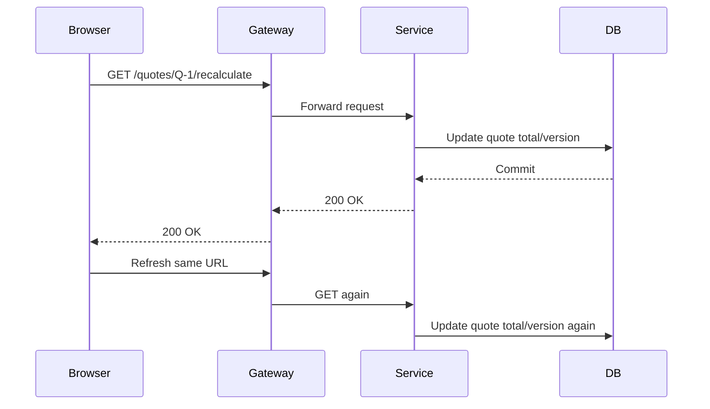
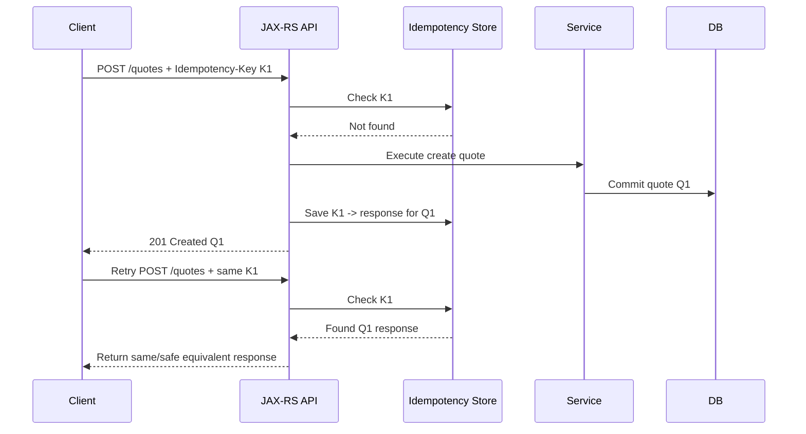
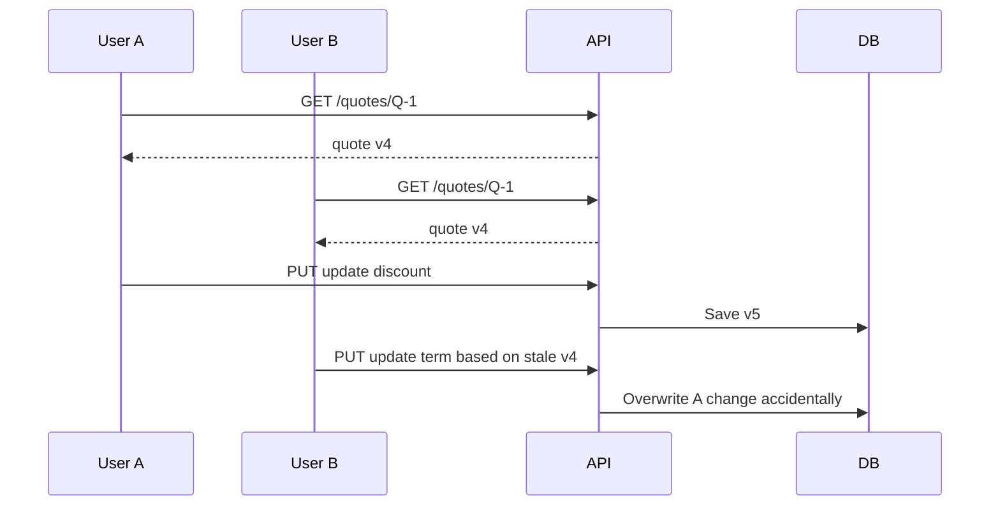
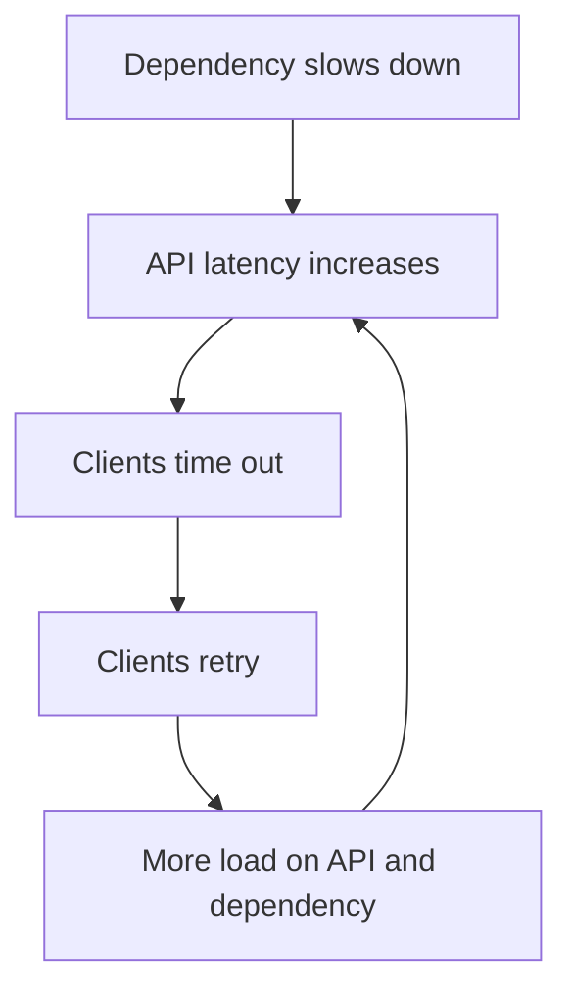

# Part 004 — Safe, Idempotent, and Cacheable Operations

> Fokus part ini: memahami perbedaan **safe**, **idempotent**, dan **cacheable**, lalu menerapkannya ke desain endpoint JAX-RS enterprise.

HTTP method bukan sekadar label. Method memberi sinyal tentang consequence operasi. Sinyal ini dipakai oleh client, gateway, retry library, cache, load balancer, crawler, browser, generated SDK, observability tool, dan manusia yang membaca log.

Di sistem enterprise, terutama CPQ/quote/order management, kesalahan memahami idempotency bisa menyebabkan:

- quote dibuat dua kali,
- order submission diproses dua kali,
- payment/charge/activation request terkirim ulang,
- state transition lompat,
- event Kafka duplicate tanpa deduplication,
- database row conflict,
- reconciliation job harus membersihkan efek samping yang seharusnya dicegah.

Part ini membangun mental model agar setiap endpoint punya consequence yang jelas.

---

## 1. Three Different Questions

Saat mendesain endpoint, jangan langsung memilih `GET`/`POST`/`PUT`. Tanyakan tiga hal berbeda:

### 1. Is it safe?

Apakah request ini hanya membaca state tanpa mengubah state server yang bermakna?

### 2. Is it idempotent?

Jika request yang sama dikirim beberapa kali, apakah efek akhirnya sama seperti dikirim sekali?

### 3. Is it cacheable?

Apakah response boleh disimpan dan digunakan ulang oleh client/proxy/cache berdasarkan aturan HTTP?

Ketiga pertanyaan ini sering tertukar. Operasi bisa idempotent tetapi tidak safe. Operasi bisa safe tetapi tidak cacheable karena policy. Operasi bisa `POST` tetapi dibuat idempotent secara application-level memakai idempotency key.

---

## 2. Method Semantics Matrix

| Method | Safe | Idempotent | Generally cacheable | Common use |
|---|---:|---:|---:|---|
| `GET` | Yes | Yes | Yes | Read representation |
| `HEAD` | Yes | Yes | Yes | Read metadata only |
| `OPTIONS` | Yes | Yes | No/rare | Discover capabilities/CORS |
| `PUT` | No | Yes | No/rare | Replace resource at known URI |
| `DELETE` | No | Yes | No/rare | Remove resource/relation |
| `POST` | No | No by default | Possible but uncommon | Create subordinate resource or command |
| `PATCH` | No | Not guaranteed | No/rare | Partial modification |

Important nuance:

- `POST` can be application-idempotent if you design it that way.
- `PATCH` can be idempotent if patch document semantics are idempotent, but do not assume it.
- `DELETE` is idempotent in terms of final server state, even if first call returns `204` and later call returns `404`.
- Safe does not mean “free”. A safe request can consume CPU, DB, or cache resources.

---

## 3. Safe Operation

A safe operation is intended only for retrieval. It must not change server state in a way the client is responsible for.

Typical safe methods:

```http
GET /quotes/Q-10001
GET /quotes?customerId=C-1&status=DRAFT
HEAD /quotes/Q-10001
OPTIONS /quotes
```

### What is allowed in safe operations?

Safe does not mean absolutely no side effect at infrastructure level. These are generally acceptable:

- access logs,
- metrics,
- tracing,
- cache warming,
- audit read log if policy requires,
- rate limit counters,
- temporary internal optimization.

But safe operations must not perform business mutation such as:

- submit quote,
- recalculate and persist price,
- reserve inventory,
- create order,
- update quote status,
- mark approval as completed,
- trigger external provisioning.

### Dangerous example

```http
GET /quotes/Q-1/recalculate
```

If this recalculates and persists new quote totals, it is not safe. It should not be `GET`.

Better options:

```http
POST /quotes/Q-1/reprice-requests
```

or:

```http
POST /quote-repricing-requests
{
  "quoteId": "Q-1"
}
```

Depending on internal API style.

---

## 4. Why Unsafe GET Is Dangerous

Unsafe `GET` causes subtle production risk because many systems assume `GET` can be repeated freely.

A `GET` request may be triggered by:

- browser prefetch,
- crawler,
- link preview,
- gateway retry,
- monitoring probe,
- cache validation,
- user pressing refresh,
- generated client retry policy,
- load test script,
- health check misconfiguration.

If `GET` mutates state, these innocent actions can change business state.

### Failure scenario



The user thought they refreshed a page. The system executed mutation twice.

---

## 5. Idempotent Operation

An operation is idempotent when repeating the same request results in the same intended final state as executing it once.

Idempotency is about **effect**, not necessarily response identity.

Example:

```http
PUT /customer-configs/C-1
{
  "timezone": "Asia/Jakarta",
  "currency": "IDR"
}
```

Sending the same request once or five times should leave the config in the same state.

### Response may differ

First request:

```http
200 OK
```

Second identical request:

```http
200 OK
```

or:

```http
204 No Content
```

or even include same representation. The key is final state.

---

## 6. Idempotency Is Essential Because Networks Fail

Distributed systems do not reliably tell you whether an operation succeeded.

Common ambiguous outcomes:

- client timeout after server commit,
- gateway timeout after downstream commit,
- response lost after DB transaction committed,
- service crashed after publish but before response,
- client retry library retries automatically,
- user double-clicks submit,
- mobile/browser sends duplicate request,
- load balancer retries to another pod.

From client perspective:

```text
I sent request. I did not receive success. I do not know whether server executed it.
```

Without idempotency, retry can duplicate business effects.

---

## 7. Idempotent vs Duplicate Detection

Idempotency can be achieved in several ways.

### Natural idempotency

The request sets resource state to a known value:

```http
PUT /notification-preferences/customer-1
{
  "emailEnabled": true
}
```

Repeating this request leaves the same final state.

### Application-level idempotency key

The request creates a new command/resource but includes a unique key:

```http
POST /quotes
Idempotency-Key: quote-create-client-request-123

{
  "customerId": "C-1",
  "items": []
}
```

Server stores the key and returns the same result for retries.

### Business key uniqueness

The request contains a natural unique key:

```json
{
  "externalOrderId": "CRM-ORDER-99881"
}
```

The database enforces uniqueness.

### State transition guard

The server only allows transition from expected state:

```http
POST /quotes/Q-1/submission
If-Match: "quote-v4"
```

If state already changed, retry can return existing result or conflict.

---

## 8. `POST` and Idempotency Keys

`POST` is not idempotent by default. But many enterprise commands are naturally modeled as `POST` and still need retry safety.

Examples:

```http
POST /quotes
POST /quotes/{quoteId}/submission
POST /orders/{orderId}/cancellation-requests
POST /pricing-calculation-requests
```

If retry is possible, require or support `Idempotency-Key`.

### Basic idempotency key flow



### What to store

Depending on policy:

- request hash,
- operation status,
- created resource ID,
- response status/body,
- failure classification,
- timestamp/expiry,
- tenant/client identity.

### Critical rule

Same idempotency key with different payload must not silently execute a different operation.

Return conflict-like error:

```http
409 Conflict
```

or team-standard equivalent.

---

## 9. Idempotency Key Scope

An idempotency key must have a scope. Otherwise two clients may accidentally collide.

Possible scope dimensions:

- tenant ID,
- authenticated subject/client ID,
- operation name,
- target resource,
- request hash,
- time window.

Example storage key:

```text
tenantId + clientId + operationType + idempotencyKey
```

Not just:

```text
idempotencyKey
```

In multi-tenant systems, global idempotency keys can create cross-tenant leakage or false duplicate detection.

---

## 10. Idempotency and Database Constraints

Application-level idempotency should usually be backed by durable constraints.

Example idempotency table:

```sql
CREATE TABLE idempotency_records (
    tenant_id text NOT NULL,
    client_id text NOT NULL,
    operation_type text NOT NULL,
    idempotency_key text NOT NULL,
    request_hash text NOT NULL,
    status text NOT NULL,
    resource_id text,
    response_code integer,
    response_body jsonb,
    created_at timestamptz NOT NULL,
    expires_at timestamptz NOT NULL,
    PRIMARY KEY (tenant_id, client_id, operation_type, idempotency_key)
);
```

Senior review points:

- Is insert atomic?
- What happens if process crashes after business commit but before idempotency record update?
- Is request hash checked?
- How long are keys retained?
- Is cleanup safe?
- Is there a reconciliation job?

---

## 11. `PUT` Semantics

`PUT` usually means replace the resource at a known URI.

```http
PUT /customer-configs/C-1
Content-Type: application/json

{
  "timezone": "Asia/Jakarta",
  "currency": "IDR",
  "language": "id"
}
```

If sent repeatedly, final resource is the same.

### Common mistake

Using `PUT` for partial update:

```http
PUT /customer-configs/C-1
{
  "currency": "IDR"
}
```

Does this mean:

- replace whole config and clear missing fields?
- only update currency?
- merge with existing config?

Ambiguity creates bugs.

If you use `PUT`, define whether full representation is required. If partial update is needed, consider `PATCH` or command endpoint.

---

## 12. `PATCH` Semantics

`PATCH` applies partial modification. It is not automatically idempotent.

Example non-idempotent patch:

```json
{
  "operation": "incrementQuantity",
  "lineId": "L1",
  "by": 1
}
```

Applied twice, quantity increases twice.

Example idempotent patch:

```json
{
  "operation": "setQuantity",
  "lineId": "L1",
  "quantity": 5
}
```

Applied twice, final quantity remains 5.

If internal APIs use `PATCH`, the patch document format and idempotency expectation must be explicit.

---

## 13. `DELETE` Semantics

`DELETE` is idempotent in intended final state.

```http
DELETE /draft-quotes/Q-1
```

First call may delete draft quote. Second call should not recreate it or cause a different business effect.

Possible second response:

```http
204 No Content
```

or:

```http
404 Not Found
```

Both can be acceptable depending on team convention. But client behavior must be documented.

### Business cancellation is not always DELETE

Canceling an order may not mean deleting a resource. It may mean creating a cancellation request or transitioning state.

Better:

```http
POST /orders/O-1/cancellation-requests
```

instead of:

```http
DELETE /orders/O-1
```

Especially when cancellation has approval, compensation, audit, downstream calls, and workflow.

---

## 14. Cacheable Operation

A cacheable response may be reused according to caching rules.

`GET` responses are commonly cacheable, but only if headers allow it.

Examples:

```http
Cache-Control: private, max-age=60
ETag: "quote-v4"
```

or:

```http
Cache-Control: no-store
```

### Enterprise caution

Many enterprise APIs should not be cached by shared proxies because they contain:

- tenant-specific data,
- customer-specific pricing,
- PII,
- permission-dependent representation,
- time-sensitive catalog/rules,
- quote/order state.

But some data may be cacheable:

- reference data,
- product catalog metadata,
- static configuration,
- public capability metadata,
- read-only dictionary values.

Cacheability is not just performance. It is correctness and confidentiality.

---

## 15. ETag and Conditional Requests

ETag represents a version/validator of a resource representation.

Read:

```http
GET /quotes/Q-1
```

Response:

```http
200 OK
ETag: "quote-v4"
```

Conditional update:

```http
PUT /quotes/Q-1
If-Match: "quote-v4"
```

If server currently has quote version 5:

```http
412 Precondition Failed
```

or team-standard conflict equivalent.

This prevents lost update.

### Lost update scenario without conditional request



Conditional update prevents this.

---

## 16. Retry Safety

Retry safety is broader than idempotency.

A request is retry-safe when retrying it under expected failure modes does not create unacceptable side effects.

Evaluate:

- Is operation idempotent?
- Is there idempotency key?
- Is DB transaction atomic?
- Is event publication deduplicated?
- Is downstream call idempotent?
- Is timeout shorter than server execution time?
- Does gateway/client retry automatically?
- Does error code tell client whether retry is allowed?

### Retry danger matrix

| Operation | Retry risk | Required control |
|---|---|---|
| `GET /quotes/{id}` | Usually low | timeout, auth, cache policy |
| `POST /quotes` | Duplicate quote | idempotency key/business key |
| `POST /orders/{id}/submit` | Duplicate order submission | state guard/idempotency key |
| `POST /payments` | Duplicate charge | strict idempotency/downstream idempotency |
| `PATCH /quotes/{id}` increment quantity | Double increment | avoid non-idempotent patch or require command ID |
| event consumer processing | Duplicate side effect | inbox/deduplication |

---

## 17. Thundering Herd and Retry Storm

Even if one retry is safe, many retries can be dangerous.

Retry storm occurs when many clients retry at once after latency/failure.



Controls:

- retry budget,
- exponential backoff,
- jitter,
- circuit breaker,
- rate limiting,
- load shedding,
- `Retry-After`,
- idempotency key,
- queue-based smoothing.

HTTP semantics and resilience engineering are connected. A retryable status code without retry budget can amplify failure.

---

## 18. JAX-RS Implementation Pattern: Safe Read

```java
@GET
@Path("/{quoteId}")
@Produces(MediaType.APPLICATION_JSON)
public Response getQuote(@PathParam("quoteId") String quoteId) {
    QuoteView quote = quoteQueryService.getQuote(quoteId);

    return Response
            .ok(QuoteResponse.from(quote))
            .tag(new EntityTag("quote-v" + quote.version()))
            .cacheControl(noSharedCache())
            .build();
}
```

Review points:

- `quoteQueryService` must not mutate business state.
- Response does not expose tenant/customer data incorrectly.
- Cache policy is explicit.
- ETag is based on representation version.
- Authorization is applied before returning data.

---

## 19. JAX-RS Implementation Pattern: Idempotent POST Command

```java
@POST
@Path("/{quoteId}/submission")
@Consumes(MediaType.APPLICATION_JSON)
@Produces(MediaType.APPLICATION_JSON)
public Response submitQuote(
        @PathParam("quoteId") String quoteId,
        @HeaderParam("Idempotency-Key") String idempotencyKey,
        SubmitQuoteRequest request
) {
    SubmitQuoteResult result = quoteCommandService.submitQuote(
            quoteId,
            idempotencyKey,
            request
    );

    return Response
            .status(result.created() ? 201 : 200)
            .entity(SubmitQuoteResponse.from(result))
            .build();
}
```

Important design questions:

- Is idempotency key required or optional?
- What if key is missing?
- What if same key has different payload?
- What if first request is still processing?
- What response should retry receive?
- How does this interact with Kafka events?
- Is state transition guarded?

---

## 20. JAX-RS Implementation Pattern: Conditional Update

```java
@PUT
@Path("/{quoteId}")
@Consumes(MediaType.APPLICATION_JSON)
@Produces(MediaType.APPLICATION_JSON)
public Response replaceQuote(
        @PathParam("quoteId") String quoteId,
        @HeaderParam("If-Match") String ifMatch,
        ReplaceQuoteRequest request
) {
    Quote updated = quoteCommandService.replaceQuote(
            quoteId,
            Version.fromEtag(ifMatch),
            request
    );

    return Response
            .ok(QuoteResponse.from(updated))
            .tag(new EntityTag("quote-v" + updated.version()))
            .build();
}
```

Failure cases:

- missing `If-Match`,
- stale version,
- invalid state transition,
- concurrent update,
- representation version mismatch.

Possible status codes:

- `400` for malformed header,
- `409` for state conflict,
- `412` for failed precondition,
- team standard must decide precise mapping.

---

## 21. Idempotency and Events

HTTP idempotency does not automatically make event processing idempotent.

Example flow:

```text
POST /quotes/{id}/submission
  -> update DB quote status
  -> publish QuoteSubmitted event
  -> downstream order service consumes event
```

If HTTP request is retried:

- API may return same submission result,
- but event publisher may publish duplicate event,
- downstream consumer may process duplicate event.

Controls:

- outbox pattern,
- event ID,
- aggregate version,
- idempotent producer/consumer,
- inbox pattern,
- unique business key,
- replay contract.

This is why idempotency design must cross API, DB, and messaging boundaries.

---

## 22. Idempotency and Multi-Tenancy

In multi-tenant systems, idempotency and cache keys must include tenant context.

Bad cache/idempotency key:

```text
quoteId=Q-1
```

Better:

```text
tenantId=T-1:quoteId=Q-1
```

For idempotency:

```text
tenantId=T-1:clientId=C-1:operation=SubmitQuote:key=K-1
```

Failure modes:

- cross-tenant idempotency collision,
- cache leaking tenant-specific response,
- wrong tenant config used during retry,
- log/trace missing tenant field,
- reconciliation job dedupes across tenant incorrectly.

---

## 23. Cache-Control Strategy

A safe operation is not automatically safe to cache.

### Sensitive data

Use:

```http
Cache-Control: no-store
```

for responses containing sensitive customer/order/pricing data if policy requires no storage.

### User-specific data

Use:

```http
Cache-Control: private, max-age=60
```

only if client-side caching is acceptable.

### Shared/reference data

Use:

```http
Cache-Control: public, max-age=300
ETag: "catalog-v2026-07"
```

only when representation is safe across users/tenants, or the cache key includes proper tenant/authorization dimensions.

### Common production mistake

Returning cacheable headers for data whose representation depends on authorization.

If two users see different fields for the same URI, shared caching can leak data unless varied correctly.

---

## 24. Conditional GET

Conditional GET reduces bandwidth and load.

Client:

```http
GET /catalogs/current
If-None-Match: "catalog-v2026-07"
```

Server:

```http
304 Not Modified
```

No body needed.

This is useful for:

- reference data,
- catalog metadata,
- UI configuration,
- static-ish lookup values.

But be careful with:

- tenant-specific catalog,
- customer-specific pricing,
- permission-dependent fields,
- effective date rules.

---

## 25. Choosing Methods for Enterprise Operations

### Create quote

```http
POST /quotes
```

Because server assigns quote ID and creates subordinate resource.

Add:

```http
Idempotency-Key: <client-generated-key>
```

if duplicate creation is harmful.

### Read quote

```http
GET /quotes/{quoteId}
```

Safe. Potentially cacheable depending on sensitivity and policy.

### Replace quote draft

```http
PUT /quotes/{quoteId}
If-Match: "quote-v4"
```

If full replacement semantics are intended.

### Update one field

Could be:

```http
PATCH /quotes/{quoteId}
```

if patch semantics are defined.

Or:

```http
POST /quotes/{quoteId}/discount-change-requests
```

if this is a business command requiring workflow/audit.

### Submit quote

Usually not:

```http
PUT /quotes/{quoteId}
{ "status": "SUBMITTED" }
```

Better as explicit command/sub-resource:

```http
POST /quotes/{quoteId}/submission
```

because submission may involve validation, pricing, approval, event emission, order creation, audit, and downstream integration.

### Cancel order

Usually not physical delete:

```http
DELETE /orders/{orderId}
```

Often better:

```http
POST /orders/{orderId}/cancellation-requests
```

because cancellation is a business process.

---

## 26. Common Failure Modes

### 26.1 Duplicate resource creation

Cause:

- client timeout,
- retry without idempotency key,
- no unique constraint,
- no business key.

Symptoms:

- duplicate quotes/orders,
- duplicate events,
- reconciliation cleanup,
- customer-facing confusion.

Detection:

- same client/request payload close in time,
- multiple records with same external reference,
- duplicate Kafka events,
- repeated correlation ID or idempotency key missing.

### 26.2 Lost update

Cause:

- two users update same resource,
- no version/ETag/optimistic lock,
- last write wins silently.

Symptoms:

- user change disappears,
- audit shows two updates close together,
- version not checked.

Detection:

- compare update timestamps,
- inspect version column,
- check absence of `If-Match`,
- review SQL `WHERE id = ?` without version guard.

### 26.3 Non-idempotent retry

Cause:

- retry library retries `POST`,
- gateway retry enabled,
- downstream timeout ambiguous,
- command not deduped.

Symptoms:

- duplicate downstream calls,
- duplicate order submission,
- duplicated event side effects.

Detection:

- repeated logs with same correlation/request body,
- same operation within retry window,
- downstream duplicate rejection,
- idempotency store misses.

### 26.4 Cache leak

Cause:

- response cached without tenant/auth dimension,
- incorrect `Cache-Control`,
- missing `Vary`,
- gateway cache misconfiguration.

Symptoms:

- user sees other tenant/customer data,
- stale pricing/catalog,
- inconsistent UI behavior.

Detection:

- inspect response headers,
- check gateway/cache logs,
- compare request identity vs cached response source,
- reproduce with different users/tenants.

### 26.5 Unsafe read endpoint

Cause:

- `GET` triggers recalculation/persistence,
- UI refresh causes mutation,
- crawler/monitor invokes endpoint.

Symptoms:

- versions increment on read,
- audit log shows mutation from read flow,
- cache/preload causes state change.

Detection:

- trace DB writes during `GET`,
- inspect service method used by read endpoint,
- check audit trail around read requests.

---

## 27. Debugging Idempotency Issues

When duplicate behavior appears, ask in order:

### Request identity

- Was there an idempotency key?
- Was it the same key?
- Was payload identical?
- Was tenant/client scope identical?
- Was correlation ID reused or regenerated?

### Transport behavior

- Did client retry?
- Did gateway retry?
- Did load balancer retry?
- Was there a timeout before response?
- Did user submit twice?

### Server behavior

- Was business transaction committed once or multiple times?
- Was idempotency record written atomically?
- Was there a crash between commit and response?
- Was unique constraint enforced?

### Event behavior

- Was event published more than once?
- Does event have unique event ID?
- Does consumer dedupe?
- Was replay running?

### Downstream behavior

- Was downstream call idempotent?
- Did downstream receive duplicate command?
- Was downstream timeout ambiguous?

---

## 28. PR Review Checklist

### Method semantics

- Is `GET` truly safe?
- Is `PUT` full replacement or misused partial update?
- Is `PATCH` semantics documented?
- Is `DELETE` representing deletion or business cancellation?
- Is command endpoint better than pretending state update is simple CRUD?

### Idempotency

- Can client/gateway retry this request?
- Is duplicate request harmful?
- Is idempotency key required?
- Is idempotency key scoped by tenant/client/operation?
- Is payload hash checked?
- Is there a unique DB constraint or durable store?
- What happens if process crashes mid-operation?

### Cacheability

- Is response safe to cache?
- Are `Cache-Control` headers explicit?
- Is response tenant/user-specific?
- Is `ETag` needed?
- Are conditional requests supported?
- Could gateway/browser cache this unexpectedly?

### Concurrency

- Is optimistic locking used where needed?
- Is `If-Match` or version field required?
- What happens on concurrent update?
- Is conflict returned as `409`/`412` according to team standard?

### Observability

- Are idempotency key, operation ID, and request hash logged safely?
- Are duplicates detectable?
- Is tenant/client included in logs/metrics where allowed?
- Are retry attempts visible?

---

## 29. Internal Verification Checklist

Verify these in CSG/internal environment instead of assuming:

### API semantics standard

- Is there an internal standard for safe/idempotent/cacheable methods?
- Are mutating `GET` endpoints forbidden by lint/review?
- Is `PATCH` allowed? If yes, which patch format?
- Is `DELETE` used for business cancellation or only resource deletion?

### Idempotency standard

- Is `Idempotency-Key` a standard header?
- Is idempotency required for create/submit/cancel operations?
- Where is idempotency stored: PostgreSQL, Redis, other store?
- What is key retention policy?
- Is payload hash checked?
- Is idempotency scoped by tenant/client/operation?

### Retry behavior

- Do clients auto-retry?
- Does API gateway retry upstream calls?
- Do service clients retry `POST`?
- Are retry budgets enforced?
- Are `Retry-After` headers used?

### Cache behavior

- Is gateway caching enabled?
- Are `Cache-Control` headers set by service or gateway?
- Are ETags used anywhere?
- Are catalog/reference endpoints cacheable?
- Is tenant-specific cache key handled safely?

### Concurrency control

- Are ETags used or is version field in DTO used instead?
- Is optimistic locking implemented in DB?
- How are stale updates reported?
- Are `409` and `412` used consistently?

### Event interaction

- Does HTTP idempotency connect to outbox/inbox/event dedupe?
- Are event IDs stable across retry?
- Are duplicate events expected and tolerated?
- Is replay contract documented?

---

## 30. Senior-Level Trade-Offs

### `POST` command vs REST resource purity

Enterprise systems often need command endpoints because operations like submit, approve, cancel, reprice, and activate have business semantics beyond CRUD. That is acceptable if command semantics, idempotency, authorization, audit, and event effects are explicit.

### Idempotency store cost vs duplicate cleanup cost

Durable idempotency adds complexity: storage, expiry, locking, cleanup, request hashing. But duplicate business effects can be far more expensive, especially when downstream provisioning, billing, or order activation is involved.

### Cache performance vs confidentiality/correctness

Caching can reduce load and latency, but in tenant-aware systems it can leak data or serve stale pricing/catalog rules if not designed carefully.

### Returning same response vs current state on retry

For idempotent `POST`, should retry return the original response or current resource state? Both can be valid, but behavior must be documented. Returning original response improves determinism. Returning current state may be more useful but can surprise clients.

### `409 Conflict` vs `412 Precondition Failed`

`412` is precise for failed conditional requests. `409` is common for domain state conflict. Teams should standardize usage to reduce client ambiguity.

---

## 31. Practical Exercises

### Exercise 1 — Audit method semantics

Pick 20 endpoints and classify:

| Endpoint | Safe? | Idempotent? | Cacheable? | Retry-safe? | Notes |
|---|---:|---:|---:|---:|---|
| `GET /...` | | | | | |
| `POST /...` | | | | | |

Look specifically for mutating `GET` and non-idempotent `POST` that can be retried.

### Exercise 2 — Trace duplicate creation

Simulate or inspect a duplicate create incident:

- Was there timeout?
- Was there retry?
- Was idempotency key absent?
- Was unique constraint absent?
- Was event duplicated?
- Was downstream idempotent?

### Exercise 3 — Design idempotency for submit operation

For a quote submission endpoint, define:

- endpoint path,
- method,
- idempotency key requirement,
- key scope,
- request hash behavior,
- storage table/Redis key,
- response on retry,
- response on different payload same key,
- event dedupe strategy,
- cleanup policy.

---

## 32. Key Takeaways

- Safe, idempotent, and cacheable are different concepts.
- `GET` must not perform meaningful business mutation.
- `POST` is not idempotent by default, but can be made retry-safe with idempotency keys and durable dedupe.
- `PUT` should have clear replacement semantics.
- `PATCH` idempotency depends on patch document semantics.
- `DELETE` is idempotent in final state but may not be appropriate for business cancellation.
- Cacheability must account for tenant, authorization, sensitivity, and freshness.
- Retry safety crosses HTTP, DB, events, downstream services, and job/reconciliation design.
- Senior engineers must review operation consequence, not only endpoint syntax.

---

## 33. Next Part

Part berikutnya masuk ke batas konseptual:

- Java SE,
- Servlet,
- Jakarta EE,
- JAX-RS,
- runtime vs specification,
- dan mengapa membedakan semua ini penting sebelum membaca Jersey/GlassFish/Grizzly/Tomcat/Jetty codebase.
