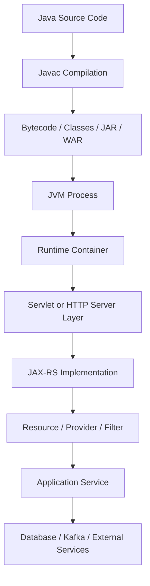
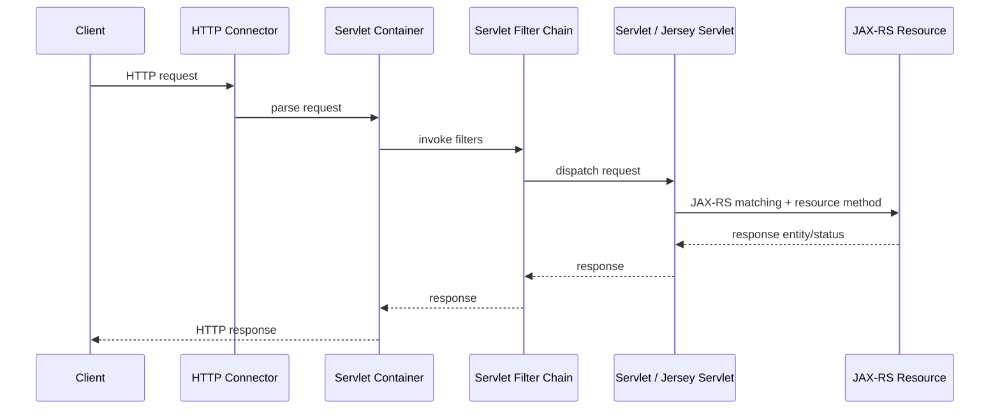
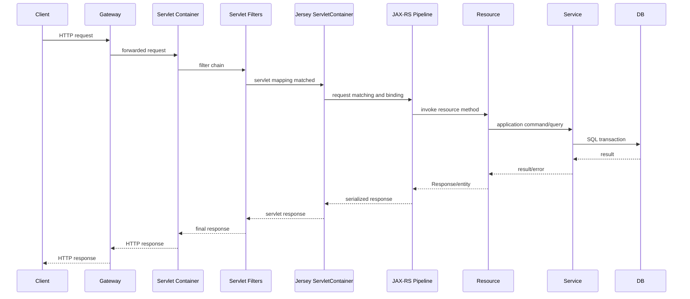

# Part 005 — Java SE, Servlet, Jakarta EE, and JAX-RS Boundaries

> Fokus part ini: membangun batas mental yang jelas antara **Java SE**, **Servlet**, **Jakarta EE**, **Jakarta RESTful Web Services/JAX-RS**, **Jersey**, dan **runtime/container**.

Di banyak codebase enterprise, engineer sering melihat import seperti ini:

```java
import jakarta.ws.rs.GET;
import jakarta.ws.rs.Path;
import jakarta.inject.Inject;
import jakarta.servlet.http.HttpServletRequest;
import org.glassfish.jersey.server.ResourceConfig;
```

Lalu semua disatukan secara mental sebagai “Jakarta” atau “Jersey”. Itu berbahaya.

Sebagai senior engineer, kita perlu tahu mana yang:

- bagian dari Java language/runtime,
- bagian dari Servlet specification,
- bagian dari Jakarta EE umbrella,
- bagian dari Jakarta RESTful Web Services/JAX-RS specification,
- bagian dari Jersey implementation,
- bagian dari runtime/container seperti Tomcat, Jetty, GlassFish, Grizzly, atau embedded server,
- bagian dari framework internal perusahaan.

Kesalahan memahami boundary ini sering menyebabkan debugging melebar ke tempat yang salah. Misalnya, error dependency injection dianggap error JAX-RS, padahal sumbernya HK2/CDI binding. Error path routing dianggap error gateway, padahal servlet mapping salah. Error serialization dianggap error resource method, padahal provider JSON tidak teregister.

---

## 1. Core Mental Model

Bayangkan backend Java production sebagai beberapa lapisan kontrak:

```text
Java Language + JVM
  -> Java SE Libraries
  -> HTTP server / Servlet container / Application server
  -> Jakarta/JAX-RS API contract
  -> JAX-RS implementation, for example Jersey
  -> Application bootstrap and dependency injection
  -> Resource methods and domain logic
  -> Platform deployment: Docker, Kubernetes, gateway, cloud networking
```

Setiap lapisan punya tanggung jawab berbeda.

JAX-RS tidak menjalankan JVM. Servlet tidak menentukan domain logic. Jersey bukan HTTP specification. Jakarta EE bukan selalu berarti full application server. Tomcat bukan full Jakarta EE server. Grizzly bukan Servlet container dalam arti yang sama seperti Tomcat. HK2 bukan CDI. CDI bukan JAX-RS. Semua bisa berinteraksi, tetapi tidak sama.

Mental model yang lebih tepat:



Saat terjadi bug, pertanyaan senior bukan “ini error Java atau Jersey?”, tetapi:

1. Di lapisan mana request gagal?
2. Contract apa yang dilanggar?
3. Siapa yang bertanggung jawab membuat object ini?
4. Siapa yang menjalankan thread ini?
5. Siapa yang mengelola lifecycle object ini?
6. Siapa yang mendaftarkan route/provider/filter ini?
7. Siapa yang membaca configuration ini?
8. Siapa yang menutup resource ini?

---

## 2. Java SE: Fondasi Bahasa dan Runtime

**Java SE** adalah fondasi bahasa, standard library, compiler, dan JVM behavior.

Contoh hal yang berasal dari Java SE:

```java
String
List
Map
Optional
CompletableFuture
ExecutorService
InputStream
BigDecimal
LocalDateTime
Instant
Throwable
RuntimeException
AutoCloseable
```

Java SE memberi kita:

- bahasa Java,
- type system,
- exception model,
- collection,
- concurrency primitives,
- I/O,
- date/time API,
- networking dasar,
- security primitives,
- JVM execution model.

Java SE **tidak** memberi kita:

- HTTP resource routing,
- `@GET`, `@POST`, `@Path`,
- dependency injection enterprise,
- Servlet lifecycle,
- request context,
- provider JSON otomatis,
- application server deployment model,
- container-managed transaction.

Contoh Java SE murni:

```java
public final class QuoteCalculator {
    public BigDecimal calculateTotal(List<QuoteLine> lines) {
        return lines.stream()
            .map(QuoteLine::amount)
            .reduce(BigDecimal.ZERO, BigDecimal::add);
    }
}
```

Class ini tidak peduli HTTP, JAX-RS, Servlet, Jersey, Tomcat, Kafka, atau Kubernetes. Ia hanya Java.

### Kenapa boundary ini penting?

Karena business/domain logic yang bisa tetap Java SE biasanya lebih mudah:

- dites,
- dipindah,
- direuse,
- direview,
- dijalankan tanpa container,
- diproteksi dari framework coupling.

Untuk sistem enterprise, semakin banyak domain rule yang bergantung langsung pada `HttpServletRequest`, `SecurityContext`, `ContainerRequestContext`, atau annotation framework, semakin sulit system berevolusi.

### PR review smell

Hati-hati jika domain logic mulai terlihat seperti ini:

```java
public class QuotePricingService {
    public Price calculate(HttpServletRequest request, QuoteRequest dto) {
        String tenantId = request.getHeader("X-Tenant-Id");
        // pricing logic mixed with transport concern
    }
}
```

Lebih baik boundary transport diekstrak lebih awal:

```java
public record RequestContext(
    String tenantId,
    String correlationId,
    String userId
) {}

public class QuotePricingService {
    public Price calculate(RequestContext context, QuoteCommand command) {
        // domain/application logic with explicit context
    }
}
```

---

## 3. Servlet: HTTP Request/Response Container Model

**Servlet** adalah specification untuk membangun web application di Java. Servlet container seperti Tomcat atau Jetty menyediakan runtime yang menerima HTTP request, membuat request/response object, menjalankan filter chain, lalu memanggil servlet.

Servlet layer biasanya berurusan dengan:

- HTTP request object,
- HTTP response object,
- servlet mapping,
- filter chain,
- context path,
- session,
- request attributes,
- deployment descriptor,
- listener,
- container-managed lifecycle.

Contoh import Servlet:

```java
import jakarta.servlet.Filter;
import jakarta.servlet.FilterChain;
import jakarta.servlet.ServletRequest;
import jakarta.servlet.ServletResponse;
import jakarta.servlet.http.HttpServletRequest;
import jakarta.servlet.http.HttpServletResponse;
```

### Servlet flow sederhana



JAX-RS sering berjalan **di atas** Servlet container melalui servlet atau filter yang disediakan implementasi JAX-RS seperti Jersey.

Dalam konfigurasi tertentu, Jersey dapat dipasang sebagai servlet, misalnya konsepnya seperti:

```xml
<servlet>
  <servlet-name>Jersey Web Application</servlet-name>
  <servlet-class>org.glassfish.jersey.servlet.ServletContainer</servlet-class>
</servlet>

<servlet-mapping>
  <servlet-name>Jersey Web Application</servlet-name>
  <url-pattern>/api/*</url-pattern>
</servlet-mapping>
```

Atau via programmatic initializer / embedded runtime. Detail aktual harus dicek di codebase.

### Yang Servlet lakukan

Servlet container bertanggung jawab atas:

- menerima TCP/HTTP request melalui connector,
- membuat request/response abstraction,
- menentukan context path,
- menerapkan servlet filter,
- mengelola lifecycle servlet/filter/listener,
- menyediakan thread request,
- melakukan dispatch ke servlet mapping.

### Yang Servlet tidak lakukan

Servlet tidak secara otomatis menentukan:

- resource method JAX-RS mana yang cocok,
- `@PathParam` binding,
- `MessageBodyReader` JSON,
- `ExceptionMapper`,
- JAX-RS provider ordering,
- domain error contract.

Itu tugas JAX-RS implementation dan aplikasi.

---

## 4. Jakarta EE: Umbrella Specification

**Jakarta EE** adalah kumpulan specification enterprise Java. Ia bukan satu library tunggal dan bukan selalu satu runtime tunggal.

Contoh specification yang bisa berada di bawah umbrella Jakarta EE:

- Jakarta Servlet,
- Jakarta RESTful Web Services,
- Jakarta Contexts and Dependency Injection,
- Jakarta Bean Validation,
- Jakarta Persistence,
- Jakarta JSON Binding,
- Jakarta XML Binding,
- Jakarta Annotations,
- Jakarta Security,
- dan lain-lain.

JAX-RS adalah salah satu specification dalam ekosistem Jakarta, tetapi memakai JAX-RS tidak berarti seluruh aplikasi berjalan sebagai full Jakarta EE application.

Sebuah service bisa saja:

- memakai Jakarta REST API,
- memakai Jersey sebagai implementation,
- berjalan di Tomcat,
- memakai HK2 untuk injection,
- tidak memakai CDI,
- tidak memakai Jakarta Persistence,
- tidak berjalan di GlassFish/Payara/WildFly.

Atau service lain bisa:

- berjalan di full Jakarta EE server,
- memakai CDI,
- memakai JPA,
- memakai JAX-RS bawaan server,
- tidak memakai Jersey secara eksplisit.

Keduanya sama-sama “Jakarta-ish”, tetapi runtime behavior-nya berbeda.

### Jakarta EE bukan sinonim dari Jakarta namespace

Melihat import `jakarta.ws.rs.Path` tidak otomatis berarti aplikasi adalah full Jakarta EE application.

Melihat dependency `jakarta.ws.rs-api` juga tidak otomatis berarti implementation-nya tersedia. API jar hanya berisi contract/interface/annotation, bukan runtime server yang menjalankan request.

Analogi:

```text
jakarta.ws.rs-api        = kontrak/annotation/interface
Jersey REST server       = implementasi JAX-RS
Tomcat/Jetty/GlassFish   = runtime/container
Application code         = resource, provider, business logic
```

---

## 5. JAX-RS / Jakarta RESTful Web Services

JAX-RS, sekarang dikenal sebagai **Jakarta RESTful Web Services**, adalah specification untuk membangun REST-style HTTP resource di Java.

JAX-RS mendefinisikan programming model seperti:

```java
@Path("/quotes")
public class QuoteResource {

    @GET
    @Path("/{quoteId}")
    @Produces(MediaType.APPLICATION_JSON)
    public QuoteResponse getQuote(@PathParam("quoteId") String quoteId) {
        // application logic
    }
}
```

JAX-RS standard mendefinisikan konsep seperti:

- resource class,
- resource method,
- request matching,
- parameter binding,
- entity provider,
- filter,
- interceptor,
- exception mapper,
- `Application`,
- context injection,
- response builder.

### JAX-RS standard tidak sama dengan Jersey

JAX-RS specification menjelaskan apa yang harus dilakukan implementation. Jersey adalah salah satu implementation.

Contoh standard JAX-RS import:

```java
import jakarta.ws.rs.GET;
import jakarta.ws.rs.POST;
import jakarta.ws.rs.Path;
import jakarta.ws.rs.PathParam;
import jakarta.ws.rs.QueryParam;
import jakarta.ws.rs.Consumes;
import jakarta.ws.rs.Produces;
import jakarta.ws.rs.core.Response;
import jakarta.ws.rs.ext.ExceptionMapper;
```

Contoh Jersey-specific import:

```java
import org.glassfish.jersey.server.ResourceConfig;
import org.glassfish.jersey.server.ContainerRequest;
import org.glassfish.jersey.server.mvc.Template;
import org.glassfish.jersey.media.multipart.FormDataParam;
import org.glassfish.hk2.utilities.binding.AbstractBinder;
```

Saat membaca code, pisahkan dua pertanyaan:

1. Apakah code ini memakai konsep standar JAX-RS?
2. Apakah code ini bergantung pada Jersey-specific behavior?

Ini penting untuk migration, debugging, dan PR review.

---

## 6. Implementation: Jersey, RESTEasy, CXF, and Others

Specification tidak berjalan sendiri. Ia butuh implementation.

Beberapa implementation JAX-RS yang dikenal:

- Jersey,
- RESTEasy,
- Apache CXF,
- implementation bawaan application server tertentu.

Jika codebase memakai Jersey, biasanya terlihat dari dependency atau import:

```text
org.glassfish.jersey.core:jersey-server
org.glassfish.jersey.containers:jersey-container-servlet
org.glassfish.jersey.inject:jersey-hk2
org.glassfish.jersey.media:jersey-media-json-jackson
org.glassfish.jersey.media:jersey-media-multipart
```

Atau class seperti:

```java
public class ApiApplication extends ResourceConfig {
    public ApiApplication() {
        packages("com.company.quote.api");
        register(MyExceptionMapper.class);
        register(MyRequestFilter.class);
    }
}
```

### Kenapa implementation matters?

Karena implementation dapat menentukan detail praktis seperti:

- provider auto-discovery,
- property names,
- integration dengan DI,
- multipart support,
- JSON provider preference,
- exception mapping precedence edge case,
- tracing/logging hook,
- resource lifecycle detail,
- startup diagnostics,
- integration dengan Servlet container.

Specification memberi contract umum. Implementation memberi behavior nyata.

---

## 7. Runtime/Container: Siapa yang Menjalankan Service?

Runtime/container adalah environment yang benar-benar menerima request dan menjalankan application code.

Beberapa kemungkinan:

### 7.1 Servlet container

Contoh:

- Tomcat,
- Jetty.

Biasanya application dikemas sebagai WAR atau embedded server.

Karakteristik:

- Servlet lifecycle penting,
- filter chain penting,
- servlet mapping penting,
- context path penting,
- JAX-RS implementation dipasang sebagai servlet/filter.

### 7.2 Full Jakarta EE server

Contoh:

- GlassFish,
- Payara,
- WildFly,
- Open Liberty.

Karakteristik:

- banyak Jakarta EE service disediakan container,
- CDI/JTA/JPA/JAX-RS mungkin container-managed,
- deployment model bisa WAR/EAR,
- runtime configuration lebih besar.

### 7.3 Embedded HTTP runtime

Contoh konsep:

- embedded Grizzly,
- embedded Jetty,
- custom main class yang start HTTP server.

Karakteristik:

- application punya `main`,
- packaging sering executable JAR,
- bootstrap eksplisit,
- container lebih ringan,
- perlu mengelola shutdown/config lebih sadar.

### 7.4 Kubernetes runtime bukan Java container

Kubernetes bukan Servlet container dan bukan JAX-RS runtime. Kubernetes menjalankan container process.

Kubernetes mengatur:

- pod lifecycle,
- restart,
- readiness/liveness probe,
- config/secret injection,
- service discovery,
- traffic routing,
- resource limit,
- scaling.

JAX-RS berjalan **di dalam process** yang berjalan **di dalam container** yang berjalan **di dalam pod**.

```text
Kubernetes Pod
  -> Linux container
    -> JVM process
      -> Java runtime / server
        -> Servlet/Jersey/JAX-RS
          -> resource method
```

---

## 8. Packaging: JAR, WAR, EAR, and Container Image

Cara aplikasi dipackage memberi petunjuk runtime.

### 8.1 WAR

WAR sering menunjukkan aplikasi web Java yang deploy ke Servlet container atau application server.

Clue:

```text
src/main/webapp
WEB-INF/web.xml
packaging: war
```

Kemungkinan:

- deployed ke Tomcat/Jetty/GlassFish,
- servlet mapping penting,
- container eksternal mungkin menyediakan HTTP server.

### 8.2 Executable JAR

Executable JAR sering menunjukkan embedded runtime.

Clue:

```text
public static void main(String[] args)
java -jar app.jar
```

Kemungkinan:

- embedded HTTP server,
- bootstrap manual,
- Docker entrypoint langsung menjalankan JVM.

### 8.3 EAR

EAR biasanya menunjukkan enterprise application archive lama/lebih berat.

Clue:

```text
packaging: ear
application.xml
```

Kemungkinan:

- full application server,
- multi-module deployment,
- container-managed services lebih banyak.

### 8.4 Container image

Container image adalah packaging deployment modern.

Ia tidak menjawab langsung apakah runtime internalnya Tomcat, Jetty, Grizzly, atau GlassFish. Harus lihat entrypoint, files, dan startup logs.

Contoh clue Dockerfile:

```dockerfile
ENTRYPOINT ["java", "-jar", "/app/service.jar"]
```

atau:

```dockerfile
COPY target/app.war /usr/local/tomcat/webapps/ROOT.war
```

Yang pertama mengarah ke executable JAR/embedded runtime. Yang kedua mengarah ke WAR di Tomcat.

---

## 9. Reading Imports as Architecture Evidence

Import sering menjadi forensic clue.

### 9.1 Java SE clue

```java
import java.time.Instant;
import java.math.BigDecimal;
import java.util.concurrent.ExecutorService;
```

Artinya: Java SE API.

### 9.2 Servlet clue

```java
import jakarta.servlet.http.HttpServletRequest;
import jakarta.servlet.Filter;
```

Artinya: code menyentuh Servlet layer.

Pertanyaan review:

- Apakah layer ini memang boleh tahu Servlet?
- Apakah domain logic tercemar request object?
- Apakah filter chain memengaruhi JAX-RS request?

### 9.3 JAX-RS clue

```java
import jakarta.ws.rs.Path;
import jakarta.ws.rs.GET;
import jakarta.ws.rs.core.Response;
import jakarta.ws.rs.ext.Provider;
```

Artinya: code memakai Jakarta REST/JAX-RS standard.

Pertanyaan review:

- Apakah route jelas?
- Apakah media type eksplisit?
- Apakah error mapping konsisten?
- Apakah provider global terlalu luas?

### 9.4 Jersey clue

```java
import org.glassfish.jersey.server.ResourceConfig;
import org.glassfish.jersey.media.multipart.FormDataParam;
```

Artinya: code bergantung pada Jersey-specific behavior.

Pertanyaan review:

- Apakah dependency pada Jersey disengaja?
- Apakah ada portability expectation?
- Apakah implementation-specific API dikurung di infrastructure layer?

### 9.5 HK2 clue

```java
import org.glassfish.hk2.utilities.binding.AbstractBinder;
```

Artinya: injection/binding kemungkinan memakai HK2.

Pertanyaan review:

- Apakah binding terlihat jelas?
- Apakah lifecycle service benar?
- Apakah CDI juga dipakai sehingga ada dual DI container?

### 9.6 CDI clue

```java
import jakarta.enterprise.context.ApplicationScoped;
import jakarta.enterprise.inject.Produces;
```

Artinya: CDI kemungkinan aktif.

Pertanyaan review:

- Apakah bean discovery benar?
- Apakah qualifier jelas?
- Apakah scope tepat?
- Apakah Jersey/CDI integration dikonfirmasi?

---

## 10. Request Lifecycle across Boundaries

Contoh lifecycle jika JAX-RS berjalan di Servlet container:



Failure dapat terjadi di setiap titik:

| Layer | Example failure | Typical symptom |
|---|---|---|
| Gateway | path rewrite salah | 404 sebelum service |
| Servlet mapping | `/api/*` tidak cocok | JAX-RS tidak terpanggil |
| Servlet filter | auth block | 401/403 tanpa resource log |
| Jersey bootstrap | provider gagal register | startup failure |
| JAX-RS matching | ambiguous path | 404/405/500 startup issue |
| MessageBodyReader | JSON invalid | 400/415/500 |
| Resource method | validation/domain error | 400/409/422 |
| DB | lock timeout | 500/503/timeout |
| Serializer | response tidak bisa serialize | 500 after business logic |

Senior debugging dimulai dari menentukan layer, bukan langsung membaca business logic.

---

## 11. Common Boundary Mistakes

### Mistake 1: Mengira Jakarta REST API jar cukup untuk menjalankan service

Dependency API hanya contract. Butuh implementation.

```xml
<dependency>
  <groupId>jakarta.ws.rs</groupId>
  <artifactId>jakarta.ws.rs-api</artifactId>
</dependency>
```

Ini tidak otomatis menyediakan Jersey/RESTEasy/CXF runtime.

### Mistake 2: Mengira Tomcat adalah full Jakarta EE server

Tomcat pada dasarnya Servlet container, bukan full Jakarta EE server. Jika aplikasi butuh JAX-RS/CDI/JPA, dependency dan integration-nya harus disediakan secara eksplisit atau lewat framework.

### Mistake 3: Mengira JAX-RS filter sama dengan Servlet filter

Servlet filter berjalan di Servlet layer. JAX-RS filter berjalan di JAX-RS pipeline. Urutan dan available context berbeda.

Servlet filter contoh:

```java
public class RawRequestFilter implements jakarta.servlet.Filter {
    // sees servlet request/response before JAX-RS matching
}
```

JAX-RS filter contoh:

```java
@Provider
public class ApiRequestFilter implements jakarta.ws.rs.container.ContainerRequestFilter {
    // sees JAX-RS request context
}
```

### Mistake 4: Mengira HK2 dan CDI sama

HK2 dan CDI sama-sama bisa melakukan injection, tetapi model, discovery, scope, dan configuration-nya berbeda.

Jika keduanya aktif, bug bisa muncul dari:

- bean didaftarkan di HK2 tetapi di-inject oleh CDI,
- scope tidak sama,
- object dibuat manual sehingga injection tidak terjadi,
- lifecycle hook tidak dipanggil.

### Mistake 5: Menganggap Kubernetes readiness sama dengan JAX-RS readiness

Pod bisa `Running`, tetapi aplikasi belum siap menerima request. Readiness harus merepresentasikan readiness aplikasi, bukan sekadar process hidup.

---

## 12. Standard vs Implementation vs Internal Framework

Gunakan klasifikasi ini saat membaca code:

| Category | Example | Meaning |
|---|---|---|
| Java SE | `java.time.Instant` | Standard Java runtime/library |
| Servlet standard | `jakarta.servlet.Filter` | Servlet specification |
| JAX-RS standard | `jakarta.ws.rs.Path` | Jakarta REST specification |
| Jakarta Injection standard | `jakarta.inject.Inject` | Injection annotation standard |
| CDI standard | `jakarta.enterprise.context.ApplicationScoped` | CDI programming model |
| Jersey-specific | `org.glassfish.jersey.server.ResourceConfig` | Jersey implementation API |
| HK2-specific | `org.glassfish.hk2.utilities.binding.AbstractBinder` | HK2 DI/binding API |
| Internal | `com.csg.*` or company framework | Internal framework/convention |

Saat review PR, tanyakan:

- Apakah dependency implementation-specific bocor ke layer yang salah?
- Apakah code mengandalkan behavior internal yang tidak terdokumentasi?
- Apakah ada standard API yang lebih tepat?
- Apakah portability dibutuhkan atau tidak?
- Apakah coupling tersebut sadar dan didokumentasikan?

---

## 13. Production Failure Modes

### 13.1 Route tidak pernah terpanggil

Kemungkinan layer:

- gateway path rewrite,
- Kubernetes ingress path,
- servlet context path,
- servlet mapping,
- JAX-RS application path,
- resource `@Path` mismatch.

Debug order:

1. Cek gateway/ingress logs.
2. Cek service access logs.
3. Cek servlet mapping/context path.
4. Cek JAX-RS application path.
5. Cek resource registration.
6. Cek request matching.

### 13.2 Resource class tidak ditemukan

Kemungkinan:

- package scanning salah,
- class tidak masuk artifact,
- resource tidak diregister,
- annotation tidak sesuai namespace,
- provider/resource disabled by profile.

### 13.3 Injection null atau gagal

Kemungkinan:

- object dibuat manual dengan `new`,
- binding HK2 belum register,
- CDI tidak aktif,
- qualifier ambiguous,
- scope salah,
- dependency implementation tidak tersedia.

### 13.4 Startup gagal karena provider conflict

Kemungkinan:

- duplicate provider,
- incompatible version,
- mixed `javax.*` dan `jakarta.*`,
- JSON provider lebih dari satu,
- missing transitive dependency.

### 13.5 Runtime berbeda antara local dan production

Kemungkinan:

- local memakai embedded server,
- production memakai Servlet container,
- profile berbeda,
- Docker image berbeda,
- classpath berbeda,
- environment variable berbeda.

---

## 14. Debugging Strategy

Saat menghadapi bug JAX-RS enterprise, gunakan pertanyaan berurutan ini:

### 14.1 Apakah request mencapai process?

Evidence:

- access log,
- gateway log,
- container log,
- trace span,
- TCP connection metric.

### 14.2 Apakah request mencapai Servlet/Jersey layer?

Evidence:

- servlet access log,
- request filter log,
- correlation ID masuk MDC,
- JAX-RS filter dipanggil.

### 14.3 Apakah resource matching berhasil?

Evidence:

- resource method log,
- route debug log,
- 404/405/406/415 pattern,
- startup resource registry log.

### 14.4 Apakah entity conversion berhasil?

Evidence:

- JSON parse error,
- media type error,
- validation error,
- provider log.

### 14.5 Apakah application logic berhasil?

Evidence:

- service log,
- DB query log,
- Kafka publish log,
- domain error.

### 14.6 Apakah response serialization berhasil?

Evidence:

- resource method selesai tetapi client mendapat 500,
- serializer exception,
- circular reference,
- unsupported type.

---

## 15. Internal Verification Checklist

Gunakan checklist ini saat masuk codebase enterprise seperti CSG Quote & Order. Jangan mengasumsikan runtime sebelum diverifikasi.

### 15.1 Build and dependency evidence

- Apakah project memakai Maven multi-module?
- Apakah packaging `jar`, `war`, atau lainnya?
- Apakah ada dependency `jakarta.ws.rs-api`?
- Apakah ada dependency `org.glassfish.jersey.*`?
- Apakah ada dependency `jersey-container-servlet`?
- Apakah ada dependency `jersey-hk2`?
- Apakah ada dependency CDI seperti Weld/OpenWebBeans?
- Apakah ada dependency Servlet API?
- Apakah dependency scope `provided`, `compile`, atau `runtime`?
- Apakah ada campuran `javax.*` dan `jakarta.*`?

### 15.2 Bootstrap evidence

- Apakah ada class extend `Application`?
- Apakah ada class extend `ResourceConfig`?
- Apakah ada `web.xml`?
- Apakah ada `ServletContainer` Jersey?
- Apakah ada `main` method yang start embedded server?
- Apakah resource/provider didaftarkan explicit atau via package scanning?
- Apakah ada profile-specific bootstrap?

### 15.3 Runtime evidence

- Apakah Dockerfile menjalankan executable JAR?
- Apakah Dockerfile menyalin WAR ke Tomcat/GlassFish?
- Apakah startup log menyebut Tomcat, Jetty, Grizzly, GlassFish, Jersey?
- Apakah Kubernetes manifest menunjukkan port/probe/path tertentu?
- Apakah deployment pipeline mem-build image berbeda per environment?

### 15.4 Request path evidence

- Apakah ada API gateway path prefix?
- Apakah ingress melakukan path rewrite?
- Apa context path service?
- Apa servlet mapping?
- Apa base path JAX-RS application?
- Apa `@Path` resource?

### 15.5 DI evidence

- Apakah injection memakai `jakarta.inject.Inject`?
- Apakah class memakai CDI scope?
- Apakah ada HK2 binder?
- Apakah object dibuat manual?
- Apakah lifecycle hook seperti `@PostConstruct` dipanggil?
- Apakah unit test memakai injection container atau manual wiring?

---

## 16. PR Review Checklist

Saat mereview perubahan yang menyentuh runtime/JAX-RS boundary:

- Apakah code baru memakai standard API atau implementation-specific API?
- Jika implementation-specific, apakah coupling-nya disengaja?
- Apakah resource/provider/filter diregister dengan jelas?
- Apakah package scanning terlalu luas?
- Apakah lifecycle object jelas?
- Apakah ada state mutable di singleton/provider?
- Apakah request context bocor ke domain layer?
- Apakah Servlet dependency muncul di layer yang salah?
- Apakah route baru mempertimbangkan gateway/context path?
- Apakah test mencakup registration/matching/error path?
- Apakah perubahan compatible dengan deployment runtime aktual?
- Apakah perubahan membutuhkan update Docker/Kubernetes/pipeline?

---

## 17. Senior Engineer Heuristics

Gunakan heuristik berikut:

1. **Specification is not implementation.** Annotation bukan runtime.
2. **Runtime determines lifecycle.** Object dibuat oleh siapa menentukan injection, scope, dan cleanup.
3. **Classpath is architecture evidence.** Dependency memberi petunjuk kuat tentang stack aktual.
4. **Entrypoint is truth.** `main`, `web.xml`, Docker entrypoint, dan startup log lebih penting daripada asumsi.
5. **Context path stacks.** Gateway prefix, ingress path, servlet mapping, application path, dan resource path bisa menumpuk.
6. **Do not leak transport into domain.** Servlet/JAX-RS object sebaiknya berhenti di boundary API/application.
7. **Internal framework must be verified.** Jangan mengarang behavior framework internal tanpa bukti.

---

## 18. Mini Exercise

Saat membuka service baru, jawab pertanyaan ini dalam 30 menit:

1. Packaging-nya JAR atau WAR?
2. Entrypoint-nya apa?
3. Runtime HTTP-nya apa?
4. JAX-RS implementation-nya apa?
5. Resource didaftarkan via scanning atau explicit registration?
6. Provider/filter global apa saja yang aktif?
7. Injection memakai HK2, CDI, manual wiring, atau kombinasi?
8. Context path lengkap dari gateway sampai resource apa?
9. Di mana configuration dibaca?
10. Bagaimana service shutdown?

Jika tidak bisa menjawab pertanyaan ini, kita belum benar-benar memahami runtime service tersebut.

---

## 19. Summary

Part ini memisahkan boundary utama:

- **Java SE**: bahasa, standard library, JVM behavior.
- **Servlet**: HTTP request/response container model.
- **Jakarta EE**: umbrella specification enterprise Java.
- **JAX-RS/Jakarta REST**: specification untuk resource HTTP.
- **Jersey**: implementation JAX-RS.
- **HK2/CDI**: injection/container model yang harus dibedakan.
- **Runtime/container**: environment nyata yang menerima request dan menjalankan code.
- **Kubernetes/cloud**: platform deployment, bukan pengganti runtime Java.

Kemampuan utama setelah part ini: membaca codebase dan deployment artifact untuk membuktikan stack runtime aktual, bukan menebaknya.

