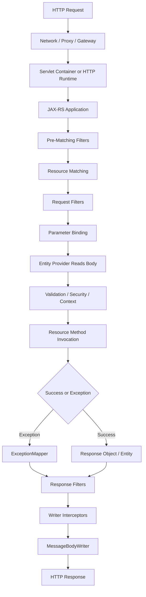

# Part 007 — JAX-RS Mental Model

> Fokus part ini: membangun mental model JAX-RS sebagai **pipeline HTTP request-response** yang dijalankan oleh runtime, bukan sekadar kumpulan annotation Java.

Setelah memahami Java SE, Servlet, Jakarta EE, namespace `jakarta.*`, dan annotation dasar, sekarang kita mulai masuk ke inti stack: **JAX-RS / Jakarta RESTful Web Services**.

Di level junior, JAX-RS sering dipahami seperti ini:

```java
@Path("/quotes")
public class QuoteResource {
  @GET
  public List<QuoteDto> listQuotes() {
    return service.findQuotes();
  }
}
```

Lalu disimpulkan: “JAX-RS adalah annotation untuk membuat REST API.”

Itu tidak salah, tetapi terlalu dangkal untuk sistem enterprise. Di production, yang penting bukan hanya annotation, tetapi:

- bagaimana runtime menemukan resource,
- bagaimana request dicocokkan ke method,
- bagaimana dependency di-inject,
- bagaimana body dibaca,
- bagaimana error dipetakan,
- bagaimana response ditulis,
- bagaimana filter/interceptor memodifikasi alur,
- bagaimana security, logging, telemetry, validation, dan serialization masuk ke pipeline,
- bagaimana failure muncul dan didiagnosis.

Mental model yang lebih tepat:

```text
JAX-RS is a standard programming model for exposing Java objects as HTTP resources through a runtime-managed request-response pipeline.
```

Dalam konteks enterprise seperti quote/order management, endpoint JAX-RS bukan hanya “function yang dipanggil lewat HTTP”. Endpoint adalah **public operational boundary** yang menjadi kontrak untuk user journey, integration, automation, workflow, event emission, audit, dan downstream dependency.

---

## 1. JAX-RS: Standard, Not Runtime by Itself

JAX-RS / Jakarta RESTful Web Services adalah specification. Ia mendefinisikan:

- annotation seperti `@Path`, `@GET`, `@POST`, `@Consumes`, `@Produces`, `@Context`,
- konsep resource class dan resource method,
- provider model,
- request/response filters,
- interceptors,
- exception mapping,
- entity provider,
- parameter binding,
- client API.

Namun specification tidak menjalankan aplikasi sendirian.

Yang menjalankan adalah implementation/runtime, misalnya:

- Jersey,
- RESTEasy,
- Apache CXF,
- runtime Jakarta EE server,
- Servlet container integration,
- embedded HTTP server integration.

Untuk konteks seri ini, kita berhati-hati karena kemungkinan stack berkaitan dengan Jersey, GlassFish, Grizzly, Tomcat, Jetty, HK2, CDI, atau kombinasi lain. Tetapi detail internal harus diverifikasi di codebase dan runtime, bukan diasumsikan.

### Standard vs implementation

| Area | Jakarta/JAX-RS Standard | Jersey/Runtime Specific |
|---|---|---|
| Resource annotation | `jakarta.ws.rs.Path`, `@GET`, `@POST` | Jersey scanning/config behavior |
| Response object | `jakarta.ws.rs.core.Response` | Jersey-specific entity provider behavior |
| Provider model | `@Provider`, `MessageBodyReader`, `ExceptionMapper` | Jersey auto-discovery, feature registration |
| Application bootstrap | `jakarta.ws.rs.core.Application` | `org.glassfish.jersey.server.ResourceConfig` |
| Injection | `@Context`, possible `@Inject` integration | HK2 binding, CDI bridge, custom factory |
| Runtime | Defined abstractly | Servlet, Grizzly, GlassFish, Tomcat, Jetty details |

Senior engineer perlu terus bertanya:

```text
Is this behavior guaranteed by the Jakarta REST standard,
or is it caused by Jersey/container/internal framework configuration?
```

Pertanyaan ini penting saat debugging, upgrading dependency, migrating namespace, atau mereview PR yang menggunakan feature khusus.

---

## 2. Resource-Oriented Programming Model

JAX-RS menggunakan istilah **resource**, bukan controller.

Dalam framework MVC, orang sering berpikir:

```text
HTTP request -> controller action -> service -> response
```

Di JAX-RS, modelnya lebih dekat ke:

```text
HTTP request identifies a resource or resource operation
  -> runtime selects matching resource method
  -> method consumes request representation
  -> method returns response representation
```

Resource adalah sesuatu yang punya identitas HTTP, misalnya:

```text
/quotes
/quotes/{quoteId}
/orders
/orders/{orderId}
/catalogs/{catalogId}/versions/{versionId}
```

Resource method adalah operasi terhadap resource tersebut:

```java
@Path("/quotes")
public class QuoteResource {

  @GET
  public List<QuoteSummaryDto> searchQuotes() {
    return quoteApplicationService.searchQuotes();
  }

  @POST
  public Response createQuote(CreateQuoteRequest request) {
    QuoteId id = quoteApplicationService.createQuote(request);
    return Response.created(URI.create("/quotes/" + id.value())).build();
  }

  @GET
  @Path("/{quoteId}")
  public QuoteDetailDto getQuote(@PathParam("quoteId") String quoteId) {
    return quoteApplicationService.getQuote(quoteId);
  }
}
```

Namun resource class sebaiknya tidak menjadi tempat semua logic. Dalam service enterprise, resource biasanya hanya:

1. menerima HTTP input,
2. melakukan transport-level validation,
3. memanggil application service,
4. memetakan result ke HTTP response,
5. menjaga contract dan observability boundary.

Resource class bukan tempat ideal untuk:

- business rule kompleks,
- database transaction orchestration besar,
- Kafka publication logic langsung,
- authorization logic tersebar tanpa policy layer,
- mapping DTO/entity yang terlalu berat,
- retry/circuit breaker manual tersebar.

---

## 3. Big Picture: JAX-RS Request-Response Pipeline

Secara konseptual, request JAX-RS melewati alur seperti ini:



Diagram ini sengaja tidak menyebut Jersey, Tomcat, GlassFish, atau Grizzly sebagai default. Itu runtime-specific. Yang penting di part ini adalah pipeline konseptual.

### Apa yang perlu diingat

Resource method bukan awal request. Banyak hal sudah terjadi sebelum method dipanggil:

- gateway mungkin rewrite path,
- container membuat request object,
- JAX-RS runtime mencocokkan resource,
- filter security mungkin menolak request,
- body mungkin gagal dideserialize,
- parameter binding mungkin gagal,
- content negotiation mungkin gagal,
- validation mungkin gagal.

Resource method juga bukan akhir response. Setelah method return:

- entity perlu diserialisasi,
- response filter bisa menambah header,
- writer interceptor bisa membungkus output,
- exception mapper bisa mengubah exception menjadi response,
- runtime bisa gagal menulis response karena client disconnect.

Karena itu saat debugging, jangan langsung melihat resource method. Lihat pipeline.

---

## 4. Bootstrap Mental Model

Sebelum request pertama bisa diproses, runtime perlu membangun aplikasi.

Secara umum:

```text
JVM starts
  -> container/runtime starts
  -> JAX-RS application is discovered/registered
  -> resources/providers/features are discovered/registered
  -> dependency injection graph is prepared
  -> HTTP listener/servlet mapping becomes active
  -> service is ready to receive request
```

Dalam JAX-RS standard, bootstrap bisa melalui `Application`:

```java
import jakarta.ws.rs.ApplicationPath;
import jakarta.ws.rs.core.Application;

@ApplicationPath("/api")
public class QuoteOrderApplication extends Application {
}
```

Dalam Jersey, sering terlihat `ResourceConfig`:

```java
import org.glassfish.jersey.server.ResourceConfig;

public class QuoteOrderResourceConfig extends ResourceConfig {
  public QuoteOrderResourceConfig() {
    packages("com.example.quoteorder.api");
    register(GlobalExceptionMapper.class);
    register(CorrelationIdFilter.class);
  }
}
```

`ResourceConfig` adalah Jersey-specific. Jika codebase memakai ini, berarti ada behavior Jersey yang perlu dipahami. Tetapi jangan langsung menyimpulkan runtime-nya GlassFish atau Grizzly hanya karena ada package Jersey. Jersey bisa berjalan di berbagai environment.

---

## 5. Resource Class: HTTP Boundary, Not Domain Boundary

Contoh resource untuk konteks quote/order:

```java
@Path("/quotes")
@Produces(MediaType.APPLICATION_JSON)
@Consumes(MediaType.APPLICATION_JSON)
public class QuoteResource {

  private final QuoteApplicationService quoteService;

  @Inject
  public QuoteResource(QuoteApplicationService quoteService) {
    this.quoteService = quoteService;
  }

  @POST
  public Response createQuote(@Valid CreateQuoteRequest request,
                              @Context UriInfo uriInfo) {
    QuoteCreated result = quoteService.createQuote(request);

    URI location = uriInfo
      .getAbsolutePathBuilder()
      .path(result.quoteId())
      .build();

    return Response
      .created(location)
      .entity(new CreateQuoteResponse(result.quoteId()))
      .build();
  }
}
```

Yang penting bukan hanya sintaks. Perhatikan responsibility boundary:

| Concern | Ideal location |
|---|---|
| HTTP path/method/media type | Resource class |
| Request DTO | API layer |
| API validation | DTO/resource boundary |
| Domain invariant | Domain/application service |
| Transaction | Application service/repository boundary |
| Persistence | Repository/data access layer |
| Event publication | Application/integration boundary |
| Error-to-HTTP mapping | ExceptionMapper |
| Audit/logging/security context | Filter/interceptor/service boundary |

Resource class harus cukup tipis, tetapi tidak bodoh. Ia tetap bertanggung jawab terhadap HTTP correctness.

---

## 6. Resource Method Return Types

JAX-RS resource method dapat mengembalikan berbagai bentuk:

```java
@GET
public QuoteDto getQuote() { ... }
```

```java
@POST
public Response createQuote(CreateQuoteRequest request) { ... }
```

```java
@GET
public StreamingOutput download() { ... }
```

```java
@GET
public CompletionStage<Response> asyncCall() { ... } // depends on runtime support/style
```

Prinsip praktis:

- Return DTO langsung cocok untuk simple `200 OK` response.
- Return `Response` jika perlu mengontrol status code, header, location, cache, ETag, atau empty body.
- Streaming return type perlu dipakai hati-hati karena lifecycle I/O berlangsung setelah method return secara konseptual.
- Async return type harus dicek support runtime dan context propagation-nya.

Untuk enterprise APIs, `Response` sering lebih eksplisit untuk operation yang punya semantics penting:

- create -> `201 Created` + `Location`,
- delete accepted -> `202 Accepted`,
- no body -> `204 No Content`,
- conflict -> mapped via exception mapper to `409 Conflict`,
- validation -> `400` atau `422` tergantung standard internal.

---

## 7. Provider Mental Model

Provider adalah extension point yang membuat JAX-RS bisa dipakai di sistem nyata.

Beberapa provider penting:

| Provider type | Fungsi |
|---|---|
| `MessageBodyReader<T>` | Membaca request body menjadi object Java |
| `MessageBodyWriter<T>` | Menulis object Java menjadi response body |
| `ExceptionMapper<E>` | Mengubah exception menjadi HTTP response |
| `ContainerRequestFilter` | Memproses request sebelum resource method |
| `ContainerResponseFilter` | Memproses response setelah resource method |
| `ReaderInterceptor` | Mengintercept entity input stream |
| `WriterInterceptor` | Mengintercept entity output stream |
| `ParamConverterProvider` | Mengubah string parameter menjadi custom type |

Provider membuat behavior aplikasi tidak selalu terlihat di resource class. Misalnya resource ini terlihat sederhana:

```java
@POST
public QuoteResponse createQuote(CreateQuoteRequest request) {
  return quoteService.create(request);
}
```

Namun behavior aktual bisa dipengaruhi oleh:

- auth filter,
- tenant resolver filter,
- correlation ID filter,
- audit filter,
- validation exception mapper,
- Jackson object mapper,
- custom date/time serializer,
- response envelope filter,
- compression layer,
- tracing instrumentation.

Senior engineer harus membaca provider layer sebelum menyimpulkan behavior endpoint.

---

## 8. Filters vs Interceptors

Secara mental model:

```text
Filter      -> concerned with request/response metadata and control flow
Interceptor -> concerned with entity stream read/write
```

Contoh filter:

```java
@Provider
public class CorrelationIdFilter implements ContainerRequestFilter, ContainerResponseFilter {

  @Override
  public void filter(ContainerRequestContext requestContext) {
    String correlationId = requestContext.getHeaderString("X-Correlation-Id");
    // validate/generate/store in MDC
  }

  @Override
  public void filter(ContainerRequestContext requestContext,
                     ContainerResponseContext responseContext) {
    // add X-Correlation-Id to response
  }
}
```

Contoh interceptor cocok untuk body stream concern:

- logging body dengan limit,
- signing/verifying payload,
- compression/encryption custom,
- wrapping output stream,
- measuring serialization size.

Namun body logging di production berbahaya jika tidak ada redaction dan size limit.

---

## 9. ExceptionMapper Mental Model

Exception mapper menghindari error handling tersebar di semua endpoint.

Tanpa mapper:

```java
@GET
@Path("/{id}")
public Response get(@PathParam("id") String id) {
  try {
    return Response.ok(service.get(id)).build();
  } catch (NotFoundException e) {
    return Response.status(404).build();
  } catch (Exception e) {
    return Response.serverError().build();
  }
}
```

Dengan mapper:

```java
@GET
@Path("/{id}")
public QuoteDto get(@PathParam("id") String id) {
  return service.get(id);
}
```

```java
@Provider
public class DomainNotFoundMapper implements ExceptionMapper<QuoteNotFoundException> {
  @Override
  public Response toResponse(QuoteNotFoundException ex) {
    return Response.status(Response.Status.NOT_FOUND)
      .entity(ApiError.of("QUOTE_NOT_FOUND", ex.getMessage()))
      .build();
  }
}
```

Keuntungannya:

- error contract konsisten,
- resource method lebih fokus,
- observability bisa distandardisasi,
- mapping retryable/non-retryable lebih jelas,
- security redaction lebih mudah dikontrol.

Risikonya:

- mapper terlalu generik menelan detail penting,
- `ExceptionMapper<Throwable>` menyembunyikan bug,
- mapper order/selection tidak dipahami,
- technical exception bocor ke client,
- validation error shape tidak konsisten.

---

## 10. `@Context` Mental Model

`@Context` menyediakan object runtime JAX-RS/Servlet yang relevan dengan request.

Contoh:

```java
@GET
public Response list(@Context UriInfo uriInfo,
                     @Context HttpHeaders headers,
                     @Context SecurityContext securityContext) {
  URI requestUri = uriInfo.getRequestUri();
  List<String> accept = headers.getRequestHeader("Accept");
  Principal user = securityContext.getUserPrincipal();
  ...
}
```

Common context objects:

| Context object | Kegunaan |
|---|---|
| `UriInfo` | URI, path, query, absolute path builder |
| `HttpHeaders` | Header request, media type, acceptable media types |
| `Request` | Conditional request, ETag/precondition handling |
| `SecurityContext` | Principal, roles, auth scheme |
| `ContainerRequestContext` | Filter-level request metadata |
| `ContainerResponseContext` | Filter-level response metadata |
| Servlet request/response | Jika runtime servlet integration tersedia |

Warning: `@Context` object biasanya request-bound. Jangan simpan ke singleton field untuk dipakai nanti.

Buruk:

```java
@Singleton
public class BadService {
  @Context
  private UriInfo uriInfo; // dangerous if singleton/lifecycle unclear
}
```

Lebih aman:

```java
public Response create(@Context UriInfo uriInfo, CreateRequest request) {
  return service.create(uriInfo.getBaseUri(), request);
}
```

---

## 11. Lifecycle: From Request to Resource Method

Saat HTTP request datang, resource method tidak langsung dipanggil. Runtime melakukan beberapa tahap.

```text
1. Request enters runtime
2. Application path / servlet mapping is resolved
3. Pre-matching filters may modify request
4. Resource class/method is matched by path + HTTP method
5. Consumes/produces negotiation is evaluated
6. Request filters run
7. Parameters are bound
8. Body is deserialized through MessageBodyReader
9. Validation may run if integrated
10. Resource instance is constructed/resolved
11. Dependencies/context are injected/resolved
12. Resource method is invoked
```

Setiap tahap bisa gagal. Karena itu error HTTP bisa berasal dari berbagai tempat:

| Symptom | Possible source |
|---|---|
| `404 Not Found` | app path wrong, resource not registered, path mismatch, gateway rewrite |
| `405 Method Not Allowed` | path matched but method annotation missing/wrong |
| `406 Not Acceptable` | `Accept` cannot be satisfied by `@Produces`/writer |
| `415 Unsupported Media Type` | `Content-Type` not supported by `@Consumes`/reader |
| `400 Bad Request` | param conversion failure, malformed body, validation failure depending mapper |
| `401/403` | auth/security filter or security context policy |
| `500` | unhandled exception, injection failure, serialization failure, mapper bug |

---

## 12. Lifecycle: From Return Value to HTTP Response

Setelah method return, response tetap perlu diproses:

```text
1. Return value is inspected
2. If Response, use explicit status/header/entity
3. If plain entity, default response status is usually success
4. Response filters run
5. Writer interceptors run
6. MessageBodyWriter serializes entity
7. Runtime writes bytes to network
8. Client may disconnect before complete write
```

Serialization failure sering terjadi **setelah business logic berhasil**. Misalnya:

- DTO punya circular reference,
- field type tidak bisa diserialize,
- lazy-loaded entity bocor ke response,
- date/time serializer tidak tersedia,
- response stream gagal karena client disconnect,
- object mapper menolak unknown/invalid configuration.

Karena itu jangan menyimpulkan “service layer gagal” hanya karena endpoint return `500`.

---

## 13. Resource Lifecycle and State Risk

Resource class lifecycle bergantung pada runtime/implementation/configuration. Jangan mengasumsikan semua resource dibuat per request atau singleton tanpa verifikasi.

Prinsip aman:

- treat resource as request boundary,
- avoid mutable instance state,
- inject thread-safe collaborators,
- store request-specific data in method-local variables,
- avoid static mutable cache,
- understand scope before adding field.

Buruk:

```java
@Path("/quotes")
public class QuoteResource {
  private String currentTenantId; // unsafe if resource reused

  @GET
  public List<QuoteDto> list(@HeaderParam("X-Tenant-Id") String tenantId) {
    this.currentTenantId = tenantId;
    return service.list(currentTenantId);
  }
}
```

Lebih aman:

```java
@GET
public List<QuoteDto> list(@HeaderParam("X-Tenant-Id") String tenantId) {
  return service.list(TenantId.of(tenantId));
}
```

Mutable field pada resource/provider adalah red flag, terutama jika lifecycle tidak jelas.

---

## 14. JAX-RS and Enterprise Layering

Salah satu kesalahan umum adalah menjadikan resource class sebagai “god controller”.

Anti-pattern:

```text
Resource method
  -> parse request
  -> validate all business rules
  -> open DB transaction
  -> call SQL directly
  -> publish Kafka event
  -> call external service
  -> create audit record
  -> decide retry
  -> map error
  -> return response
```

Lebih maintainable:

```text
Resource method
  -> normalize HTTP input
  -> call application service command/query
  -> return response or let mapper handle error

Application service
  -> enforce use-case workflow
  -> manage transaction boundary
  -> call domain/repository/integration ports
  -> emit domain/integration event through controlled mechanism

Infrastructure
  -> DB/Kafka/HTTP client/cloud SDK details
```

Resource class tetap penting, tetapi boundary-nya harus jelas.

---

## 15. JAX-RS in Quote/Order Enterprise Context

Dalam sistem quote/order, endpoint sering berada di sekitar operasi seperti:

- create quote,
- update quote line item,
- validate quote,
- price quote,
- submit quote,
- convert quote to order,
- retrieve order status,
- attach document,
- run eligibility check,
- trigger workflow action.

Namun seri ini tidak mengarang detail internal CSG. Yang bisa kita bahas adalah pola engineering generiknya.

Contoh modeling konseptual:

```text
POST /quotes
  -> command: create new quote
  -> response: 201 Created + Location

POST /quotes/{quoteId}/actions/price
  -> command-like operation
  -> may be synchronous or async depending cost

GET /quotes/{quoteId}
  -> query: retrieve quote representation

GET /quotes?customerId=...&status=...
  -> query/search operation with pagination/filtering
```

Hal yang harus diverifikasi internal:

- apakah endpoint memakai resource naming seperti noun-based URI,
- apakah action endpoint diterima oleh API standard internal,
- apakah quote/order operations synchronous atau asynchronous,
- apakah long-running operation memakai polling/event/workflow,
- apakah API berada di belakang gateway dengan rewrite/version prefix,
- apakah response envelope distandardisasi.

---

## 16. Common Misconceptions

### Misconception 1: `@Path` means endpoint definitely exists

Tidak selalu. Endpoint hanya aktif jika resource terdaftar dan runtime path benar.

### Misconception 2: `@Inject` always works the same

Tidak selalu. Bisa HK2, CDI, manual bridge, custom factory, atau tidak aktif.

### Misconception 3: `@Produces` only documents response type

Tidak. Ia mempengaruhi content negotiation dan writer selection.

### Misconception 4: Returning DTO means HTTP status always correct

Tidak. Default success response belum tentu sesuai operation semantics.

### Misconception 5: All failures happen inside resource method

Tidak. Banyak failure terjadi sebelum method dipanggil atau setelah method return.

### Misconception 6: Jersey behavior equals JAX-RS standard

Tidak. Jersey punya extension dan konfigurasi sendiri.

---

## 17. Failure Modes

| Failure mode | Typical symptom | Root cause pattern | Debug direction |
|---|---|---|---|
| Resource not registered | 404 | package scanning salah, registration missing | startup log, ResourceConfig, Application |
| Wrong base path | 404 | servlet mapping/app path/gateway path mismatch | deployment config, ingress/gateway route |
| Method mismatch | 405 | path ada, HTTP method tidak ada | resource annotations |
| Media type mismatch | 406/415 | `Accept`/`Content-Type` tidak cocok | `@Consumes`, `@Produces`, providers |
| Body read failure | 400/500 | malformed JSON, missing provider, bad DTO | MessageBodyReader/Jackson logs |
| Param conversion failure | 400 | type conversion gagal | param type/converter |
| Injection failure | startup/500 | binding missing, CDI/HK2 mismatch | DI config, runtime logs |
| Security filter reject | 401/403 | token/permission/tenant invalid | auth filter, security logs |
| Exception mapper missing | 500 | domain exception tidak dimap | mapper registration |
| Serialization failure | 500 after method success | DTO invalid/circular/lazy entity | MessageBodyWriter/object mapper |
| Context lost async | missing trace/security | ThreadLocal/MDC not propagated | executor/context wrapper |

---

## 18. Debugging Strategy

Saat endpoint bermasalah, gunakan urutan berpikir ini:

```text
1. Did request reach the service process?
2. Did gateway/ingress rewrite path or headers?
3. Did servlet/application mapping match?
4. Was the resource registered?
5. Did path and HTTP method match?
6. Did content negotiation pass?
7. Did filters allow the request?
8. Did parameter binding/body deserialization work?
9. Did validation/auth/domain logic pass?
10. Did resource method execute?
11. Did response serialization succeed?
12. Did network/client receive full response?
```

Jangan langsung lompat ke database atau service logic jika statusnya 404/405/406/415. Banyak error tersebut terjadi sebelum business logic.

---

## 19. PR Review Heuristics for Resource Classes

Saat mereview resource JAX-RS:

- Apakah URI dan method sesuai HTTP semantics?
- Apakah endpoint command/query boundary jelas?
- Apakah status code eksplisit untuk operasi non-trivial?
- Apakah request DTO tidak bocor ke domain/entity langsung?
- Apakah validation berada di boundary yang tepat?
- Apakah error dimap via standard exception mapper?
- Apakah authorization/tenant boundary jelas?
- Apakah response backward-compatible?
- Apakah endpoint punya logging/telemetry cukup?
- Apakah large payload/streaming ditangani dengan aman?
- Apakah resource menyimpan mutable state?
- Apakah dependency injection lifecycle aman?
- Apakah test membuktikan positive dan negative path?

---

## 20. Internal Verification Checklist

Saat masuk codebase CSG atau codebase enterprise lain, verifikasi:

### Runtime and registration

- Apakah implementation JAX-RS yang dipakai Jersey, RESTEasy, CXF, atau lainnya?
- Apakah ada `ResourceConfig`?
- Apakah ada `Application` dengan `@ApplicationPath`?
- Apakah resource ditemukan via package scanning atau explicit registration?
- Apakah ada generated/centralized route registration?
- Apakah endpoint berada di Servlet container atau embedded runtime?

### Provider and cross-cutting behavior

- Apa saja `ContainerRequestFilter` global?
- Apa saja `ContainerResponseFilter` global?
- Apa saja `ExceptionMapper` yang aktif?
- Provider JSON apa yang dipakai: Jackson, JSON-B, custom?
- Apakah ada response envelope filter?
- Apakah ada audit/security logging filter?
- Apakah tracing/log correlation otomatis?

### Dependency injection

- Apakah resource diinject via HK2, CDI, Jakarta Inject, Spring bridge, atau manual?
- Scope apa yang digunakan resource dan provider?
- Apakah ada singleton mutable state?
- Apakah custom factory/binder dipakai?

### API governance

- Apakah ada API style guide?
- Apakah OpenAPI menjadi source of truth?
- Apakah endpoint harus melewati linting/contract review?
- Apakah versioning dan deprecation policy tersedia?
- Apakah response error shape distandardisasi?

### Deployment path

- Apakah path di code sama dengan path publik?
- Apakah ada gateway prefix seperti `/api`, `/v1`, `/quote-order`?
- Apakah ingress/gateway melakukan rewrite?
- Apakah environment berbeda punya base path berbeda?

---

## 21. Minimal JAX-RS Mental Model Cheat Sheet

```text
Resource class
  Java class exposed as HTTP resource by runtime registration/scanning.

Resource method
  Java method selected by HTTP path + method + media type.

Application / ResourceConfig
  Bootstrap/registration boundary for resources and providers.

Provider
  Extension component for body conversion, filtering, interception, exception mapping.

Filter
  Request/response metadata/control-flow hook.

Interceptor
  Entity stream read/write hook.

ExceptionMapper
  Exception-to-HTTP-response translation.

MessageBodyReader/Writer
  Body-to-object and object-to-body conversion.

@Context
  Runtime/request context injection.

Jersey
  One implementation of Jakarta REST, not the standard itself.
```

---

## 22. Senior-Level Takeaways

1. JAX-RS is a **runtime-managed HTTP pipeline**, not just annotation syntax.
2. Resource method invocation is only one stage in a longer lifecycle.
3. Provider/filter/interceptor/mapper behavior often explains production bugs better than resource code alone.
4. Always separate **Jakarta REST standard** from **Jersey/runtime-specific behavior**.
5. Resource classes should represent HTTP boundary, not become domain or infrastructure dumping ground.
6. Mutable resource/provider state is dangerous unless lifecycle is proven.
7. Most endpoint debugging should start from route, registration, media type, filter, binding, and serialization before business logic.
8. In CSG/internal context, verify actual runtime, DI model, provider registration, gateway path, and API governance from evidence.

---

## 23. Practical Exercises

Gunakan codebase internal atau project latihan:

1. Cari semua class dengan `@Path`.
2. Temukan bagaimana resource class tersebut diregister.
3. Cari semua `ExceptionMapper`.
4. Cari semua `ContainerRequestFilter` dan `ContainerResponseFilter`.
5. Cari provider JSON/XML yang aktif.
6. Pilih satu endpoint dan gambar request-response pipeline aktualnya.
7. Tentukan mana behavior standard JAX-RS dan mana behavior Jersey/runtime/internal.
8. Cari satu endpoint yang return DTO langsung dan satu endpoint yang return `Response`; jelaskan trade-off-nya.

---

## 24. What Comes Next

Part berikutnya masuk lebih detail ke **request matching dan parameter binding lifecycle**:

- bagaimana path dicocokkan,
- bagaimana HTTP method dipilih,
- bagaimana `@PathParam`, `@QueryParam`, `@HeaderParam`, `@BeanParam` bekerja,
- bagaimana `@Consumes` dan `@Produces` mempengaruhi selection,
- kenapa 404/405/406/415 bisa muncul,
- bagaimana debug route ambiguity dan conversion failure.
