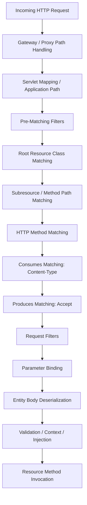

# Part 008 — JAX-RS Request Matching and Parameter Binding Lifecycle

> Fokus part ini: memahami bagaimana JAX-RS runtime memilih resource method dan mengisi parameter method sebelum business logic berjalan.

Di production, banyak bug API bukan berasal dari service layer, database, atau Kafka. Banyak bug terjadi lebih awal:

- request tidak match path,
- HTTP method salah,
- `Content-Type` tidak cocok,
- `Accept` tidak bisa dipenuhi,
- path param tidak terkonversi,
- query param kosong tapi dianggap valid,
- header hilang,
- gateway rewrite mengubah URI,
- ambiguity antar resource method,
- provider body tidak ditemukan.

Part ini membahas lifecycle detail dari:

```text
HTTP request arrives
  -> application path resolution
  -> resource path matching
  -> HTTP method matching
  -> consumes/produces negotiation
  -> parameter binding
  -> entity body deserialization
  -> resource method invocation
```

Tujuannya bukan menghafal annotation, tetapi mampu menjawab pertanyaan debugging:

```text
Why did this request not invoke the method I expected?
```

---

## 1. Request Matching Mental Model

Saat request datang, runtime harus menentukan method Java mana yang akan dipanggil.

Contoh request:

```http
GET /api/quotes/Q-1001?includeLines=true HTTP/1.1
Accept: application/json
X-Tenant-Id: tenant-a
```

Kemungkinan resource:

```java
@Path("/quotes")
public class QuoteResource {

  @GET
  @Path("/{quoteId}")
  @Produces(MediaType.APPLICATION_JSON)
  public QuoteDto getQuote(@PathParam("quoteId") String quoteId,
                           @QueryParam("includeLines") boolean includeLines) {
    ...
  }
}
```

JAX-RS runtime perlu menjawab:

1. Apakah request masuk ke JAX-RS application ini?
2. Apakah `/quotes/Q-1001` match resource path?
3. Apakah ada method `GET`?
4. Apakah `Accept: application/json` cocok dengan `@Produces`?
5. Apakah parameter `quoteId` dan `includeLines` bisa di-bind?
6. Apakah ada request body yang perlu dibaca?
7. Apakah resource instance dan dependencies bisa disediakan?
8. Baru kemudian method dipanggil.

Jika salah satu tahap gagal, method tidak akan dieksekusi.

---

## 2. Full Matching Pipeline



Important nuance: exact order and implementation details can vary by runtime and configuration, especially with filters, validation, and framework extensions. But conceptually, these are the concerns that must pass before resource method logic runs.

---

## 3. Application Path and External Path Are Not Always the Same

Resource annotation might say:

```java
@ApplicationPath("/api")
public class App extends Application {}

@Path("/quotes")
public class QuoteResource {}
```

Internal path might be:

```text
/api/quotes
```

But public path could be:

```text
/quote-order/api/v1/quotes
```

because of:

- Kubernetes ingress path prefix,
- API gateway route,
- reverse proxy rewrite,
- servlet context path,
- application path,
- version prefix,
- environment-specific routing.

Debugging `404` requires knowing all layers.

```text
public URL
  -> DNS
  -> load balancer
  -> API gateway / ingress
  -> service path rewrite
  -> servlet context path
  -> JAX-RS application path
  -> resource @Path
  -> method @Path
```

### Internal verification checklist

- Apakah path publik sama dengan path internal?
- Apakah gateway menambahkan `/api`, `/v1`, `/quote-order`, atau tenant prefix?
- Apakah ingress melakukan rewrite?
- Apakah service punya servlet context path?
- Apakah `@ApplicationPath` dipakai?
- Apakah Jersey `ResourceConfig` dipasang di servlet mapping tertentu?

---

## 4. `@Path` Matching Basics

Resource class path:

```java
@Path("/quotes")
public class QuoteResource {
}
```

Method path:

```java
@GET
@Path("/{quoteId}")
public QuoteDto getQuote(@PathParam("quoteId") String quoteId) {
  ...
}
```

Combined path:

```text
/quotes/{quoteId}
```

Path template variable:

```text
/quotes/Q-1001
        ^^^^^^ -> quoteId
```

JAX-RS path matching is not the same as Java method overload resolution. Runtime matches URI templates and annotations.

### Good path design

```java
@Path("/quotes")
public class QuoteResource {

  @GET
  public Page<QuoteSummaryDto> search(...) { ... }

  @POST
  public Response create(CreateQuoteRequest request) { ... }

  @GET
  @Path("/{quoteId}")
  public QuoteDto get(@PathParam("quoteId") String quoteId) { ... }

  @POST
  @Path("/{quoteId}/actions/submit")
  public Response submit(@PathParam("quoteId") String quoteId) { ... }
}
```

Avoid ambiguous paths:

```java
@GET
@Path("/{id}")
public QuoteDto getById(@PathParam("id") String id) { ... }

@GET
@Path("/{status}")
public List<QuoteDto> getByStatus(@PathParam("status") String status) { ... }
```

Both match `/quotes/draft`. This is ambiguous semantically even if runtime has tie-breaking rules.

Better:

```java
@GET
@Path("/{quoteId}")
public QuoteDto getById(@PathParam("quoteId") String quoteId) { ... }

@GET
public List<QuoteDto> search(@QueryParam("status") String status) { ... }
```

---

## 5. Path Templates and Regex Constraints

JAX-RS supports path parameters and can support regex constraints in templates.

Example:

```java
@GET
@Path("/{quoteId: Q-[0-9]+}")
public QuoteDto getQuote(@PathParam("quoteId") String quoteId) {
  ...
}
```

This can reduce ambiguity, but use carefully.

Pros:

- rejects invalid path earlier,
- clarifies expected format,
- helps route disambiguation.

Cons:

- complex regex makes API hard to read,
- validation becomes split between routing and validation layer,
- error shape may become `404` instead of validation error,
- client may get confusing response.

Senior rule:

```text
Use path regex for structural disambiguation, not full business validation.
```

For example, validating “quote must exist and be accessible to tenant” should not be path regex. That belongs to application/security/domain logic.

---

## 6. HTTP Method Matching

JAX-RS maps HTTP method with annotations:

```java
@GET
@POST
@PUT
@DELETE
@PATCH // if supported/defined by implementation or imported extension
@HEAD
@OPTIONS
```

If path matches but method does not, typical outcome is `405 Method Not Allowed`.

Example:

```java
@Path("/quotes/{quoteId}")
public class QuoteItemResource {

  @GET
  public QuoteDto get(...) { ... }
}
```

Request:

```http
POST /quotes/Q-1001
```

The path may exist, but POST method is not supported.

### Method semantics matter

- `GET`: retrieve representation, safe.
- `POST`: create/process command, not necessarily idempotent.
- `PUT`: replace/upsert known resource, idempotent by semantics.
- `PATCH`: partial update, idempotency depends on patch design.
- `DELETE`: delete/cancel/remove, idempotency needs careful response policy.

Do not choose method only because “frontend sends form”. Choose based on operation semantics.

---

## 7. `@Consumes`: Request Body Media Type Matching

`@Consumes` declares what media type the resource can read.

```java
@POST
@Consumes(MediaType.APPLICATION_JSON)
public Response createQuote(CreateQuoteRequest request) {
  ...
}
```

Request:

```http
POST /quotes
Content-Type: application/json
```

This should match.

But request:

```http
POST /quotes
Content-Type: text/plain
```

should not match this method. Typical response: `415 Unsupported Media Type`.

### Class-level vs method-level

```java
@Path("/quotes")
@Consumes(MediaType.APPLICATION_JSON)
@Produces(MediaType.APPLICATION_JSON)
public class QuoteResource {

  @POST
  public Response create(CreateQuoteRequest request) { ... }

  @POST
  @Path("/import")
  @Consumes(MediaType.MULTIPART_FORM_DATA)
  public Response importQuotes(...) { ... }
}
```

Method-level annotation overrides or narrows behavior depending usage. Be explicit when endpoint differs from class default.

### Common failure

Client sends:

```http
Content-Type: application/json;charset=UTF-8
```

Usually this should be compatible with `application/json`, but provider/runtime behavior should still be verified if mismatch occurs.

---

## 8. `@Produces`: Response Media Type Matching

`@Produces` declares what media type the resource can return.

```java
@GET
@Produces(MediaType.APPLICATION_JSON)
public QuoteDto getQuote(...) { ... }
```

Request:

```http
Accept: application/json
```

matches.

Request:

```http
Accept: application/xml
```

may produce `406 Not Acceptable` if no XML writer/producer is available.

### Practical enterprise rule

Most internal APIs standardize on JSON. But even then, be careful with:

- clients sending no `Accept`,
- clients sending `*/*`,
- browser clients with broad Accept headers,
- generated clients with default media type,
- gateway or test tools modifying headers,
- legacy XML support.

### Debug direction for 406

Check:

- method/class `@Produces`,
- client `Accept` header,
- registered `MessageBodyWriter`,
- response entity type,
- runtime object mapper/provider,
- fallback media type behavior.

---

## 9. Parameter Binding Categories

JAX-RS can bind values from different request locations.

| Annotation | Source |
|---|---|
| `@PathParam` | URI path template |
| `@QueryParam` | query string |
| `@HeaderParam` | HTTP header |
| `@CookieParam` | cookie |
| `@MatrixParam` | URI matrix parameter |
| `@FormParam` | form body |
| `@BeanParam` | aggregate multiple params into object |
| `@DefaultValue` | default if absent |
| `@Encoded` | prevent automatic decoding |
| `@Context` | runtime context object |

Example:

```java
@GET
@Path("/{quoteId}")
public QuoteDto getQuote(
    @PathParam("quoteId") String quoteId,
    @QueryParam("includeLines") @DefaultValue("false") boolean includeLines,
    @HeaderParam("X-Tenant-Id") String tenantId,
    @HeaderParam("X-Correlation-Id") String correlationId) {
  ...
}
```

Binding looks simple, but subtle bugs often happen around absence, defaulting, conversion, decoding, and validation.

---

## 10. `@PathParam`

Use `@PathParam` for identity or hierarchical resource identifiers.

```java
@GET
@Path("/{quoteId}/lines/{lineId}")
public QuoteLineDto getLine(@PathParam("quoteId") String quoteId,
                            @PathParam("lineId") String lineId) {
  ...
}
```

Good use:

```text
/quotes/Q-1001
/quotes/Q-1001/lines/L-10
/orders/O-9001
```

Poor use:

```text
/quotes/status/draft/customer/123/date/2026-01-01
```

Filtering/search belongs in query parameters unless it represents resource hierarchy.

### Typed path params

```java
@GET
@Path("/{quoteId}")
public QuoteDto getQuote(@PathParam("quoteId") UUID quoteId) {
  ...
}
```

If conversion fails, request may fail before method invocation.

For domain IDs, consider explicit value object conversion only if conversion behavior and error shape are standardized.

---

## 11. `@QueryParam`

Use `@QueryParam` for optional modifiers, filters, pagination, sorting, and projection.

```java
@GET
public Page<QuoteSummaryDto> search(
    @QueryParam("customerId") String customerId,
    @QueryParam("status") List<String> statuses,
    @QueryParam("pageSize") @DefaultValue("50") int pageSize,
    @QueryParam("pageToken") String pageToken) {
  ...
}
```

Important concerns:

- absence vs empty string,
- repeated parameter behavior,
- comma-separated vs repeated format,
- max page size,
- invalid filter name,
- invalid sort field,
- query cost and index alignment,
- backward-compatible addition of filters.

### Repeated query params

Client may send:

```text
?status=DRAFT&status=APPROVED
```

or:

```text
?status=DRAFT,APPROVED
```

Do not support both accidentally unless documented. Choose one standard.

---

## 12. `@HeaderParam`

Headers often carry cross-cutting metadata:

- correlation ID,
- tenant ID,
- authorization token,
- idempotency key,
- request source,
- feature flag/test marker,
- API version,
- locale,
- client identity.

Example:

```java
@POST
public Response createQuote(
    @HeaderParam("Idempotency-Key") String idempotencyKey,
    @HeaderParam("X-Tenant-Id") String tenantId,
    CreateQuoteRequest request) {
  ...
}
```

However, avoid scattering critical header parsing in every resource method. For cross-cutting concerns, prefer filter/context/resolver:

```text
Header -> filter/resolver -> request context / tenant context / security context -> service
```

### Header risk

- missing header,
- spoofed header from untrusted client,
- gateway overwrites header,
- case-insensitive matching confusion,
- multi-value header behavior,
- redaction in logs,
- propagation to downstream services.

Tenant and identity headers should not be trusted blindly unless gateway/security model guarantees them.

---

## 13. `@CookieParam`, `@MatrixParam`, and `@FormParam`

### `@CookieParam`

Common in browser-facing APIs but less common in service-to-service enterprise APIs.

Risk:

- CSRF,
- browser behavior,
- SameSite/Secure flags,
- auth/session semantics.

### `@MatrixParam`

Matrix params are part of URI path segment:

```text
/catalogs;region=apac/versions;effectiveDate=2026-01-01
```

Often uncommon. Verify platform/gateway support before relying on it.

### `@FormParam`

Used for `application/x-www-form-urlencoded` forms:

```java
@POST
@Consumes(MediaType.APPLICATION_FORM_URLENCODED)
public Response submit(@FormParam("username") String username) {
  ...
}
```

For JSON APIs, prefer request DTO body. For OAuth or legacy/browser forms, `@FormParam` may be appropriate.

---

## 14. `@BeanParam` for Parameter Aggregation

When parameter list grows, `@BeanParam` can group them.

```java
public class QuoteSearchParams {
  @QueryParam("customerId")
  public String customerId;

  @QueryParam("status")
  public List<String> statuses;

  @QueryParam("pageSize")
  @DefaultValue("50")
  public int pageSize;

  @QueryParam("pageToken")
  public String pageToken;
}
```

```java
@GET
public Page<QuoteSummaryDto> search(@BeanParam QuoteSearchParams params) {
  return service.search(params.toCommand());
}
```

Pros:

- resource method cleaner,
- reusable search parameter object,
- easier validation grouping,
- easier test fixture.

Cons:

- hidden binding behavior,
- public fields vs constructor concerns,
- mixing transport object with domain query,
- validation and defaulting may become unclear,
- lifecycle/injection behavior must be understood.

Senior rule:

```text
Use @BeanParam for transport-level parameter grouping, not as domain command object.
```

---

## 15. `@DefaultValue` and Absence Semantics

Example:

```java
@QueryParam("includeLines")
@DefaultValue("false")
boolean includeLines
```

This means absent parameter becomes `false`. But there are multiple cases:

```text
?includeLines=true      -> true
?includeLines=false     -> false
absent                  -> false
?includeLines=          -> conversion behavior must be verified
?includeLines=abc       -> conversion failure
```

Be careful with defaults for business behavior. A default can hide client bugs.

Good default candidates:

- page size with max cap,
- optional include flag,
- sort order with stable default,
- locale fallback if internal standard allows.

Risky default candidates:

- tenant ID,
- currency,
- effective date,
- identity,
- permission scope,
- catalog version,
- pricing rule set.

For quote/order systems, defaults around date, currency, tenant, and catalog version must be explicitly governed.

---

## 16. Parameter Conversion

JAX-RS can convert string values into Java types.

Common targets:

- `String`,
- primitive/wrapper types,
- `BigDecimal`,
- enum,
- date/time types depending provider/support,
- custom types via converter.

Example:

```java
@GET
public Page<QuoteDto> search(@QueryParam("limit") int limit) {
  ...
}
```

Invalid request:

```text
?limit=abc
```

Conversion fails before method execution.

### Enum risk

```java
public enum QuoteStatus {
  DRAFT,
  APPROVED,
  EXPIRED
}

@QueryParam("status") QuoteStatus status
```

Problems:

- case sensitivity,
- unknown values,
- future enum values,
- error message consistency,
- backwards compatibility.

Often better to parse in an explicit transport layer if error contract matters.

---

## 17. Custom ParamConverterProvider

For domain-like IDs, a custom converter can make signatures cleaner:

```java
@GET
@Path("/{quoteId}")
public QuoteDto get(@PathParam("quoteId") QuoteId quoteId) {
  ...
}
```

This requires converter registration:

```java
@Provider
public class QuoteIdParamConverterProvider implements ParamConverterProvider {
  @Override
  public <T> ParamConverter<T> getConverter(Class<T> rawType,
                                            Type genericType,
                                            Annotation[] annotations) {
    ...
  }
}
```

Use with care.

Pros:

- type-safe resource method,
- less repeated parsing,
- earlier invalid ID rejection.

Cons:

- hidden behavior,
- registration issue causes runtime failure,
- error shape may be inconsistent,
- converter may mix transport validation and domain validation,
- global converter can affect many endpoints.

Internal verification:

- Are custom converters used?
- Where are they registered?
- What error response do they produce?
- Are they tested?
- Are they Jersey-specific or standard provider?

---

## 18. Entity Body Deserialization

For body parameter:

```java
@POST
@Consumes(MediaType.APPLICATION_JSON)
public Response createQuote(CreateQuoteRequest request) {
  ...
}
```

Runtime uses `MessageBodyReader` to turn bytes into `CreateQuoteRequest`.

Potential failures:

- missing `Content-Type`,
- unsupported `Content-Type`,
- malformed JSON,
- unknown field policy,
- missing required constructor,
- invalid date format,
- enum mismatch,
- polymorphic type issue,
- large body limit,
- input stream already consumed by logging filter,
- provider not registered.

### Body parameter rule

Usually there is one main entity body parameter. Do not design methods with many unannotated complex parameters expecting JAX-RS to infer multiple bodies.

Good:

```java
@POST
public Response create(@Valid CreateQuoteRequest request) { ... }
```

Bad:

```java
@POST
public Response create(CreateQuoteRequest request, PricingContext context) { ... }
```

Use one request DTO and explicit context/header/query binding.

---

## 19. Matching with `@Consumes` and Multiple Methods

Consider:

```java
@POST
@Consumes(MediaType.APPLICATION_JSON)
public Response createJson(CreateQuoteRequest request) { ... }

@POST
@Consumes(MediaType.APPLICATION_FORM_URLENCODED)
public Response createForm(@FormParam("name") String name) { ... }
```

Same path and method, different content type.

Request `Content-Type` determines which method is selected.

This can be useful but can also confuse tests and clients.

Questions for review:

- Is supporting multiple media types intentional?
- Are both documented?
- Are both tested?
- Do they produce same behavior?
- Do they share validation and error mapping?

---

## 20. Matching with `@Produces` and Multiple Methods

Consider:

```java
@GET
@Produces(MediaType.APPLICATION_JSON)
public QuoteDto getJson() { ... }

@GET
@Produces(MediaType.APPLICATION_XML)
public QuoteXmlDto getXml() { ... }
```

`Accept` header determines method.

This is powerful but risky in internal enterprise services where generated clients expect JSON. If XML support exists for legacy integration, governance must be explicit.

---

## 21. Subresource Locators

JAX-RS supports subresource locators: methods with `@Path` but no HTTP method annotation.

Example:

```java
@Path("/quotes")
public class QuoteResource {

  @Path("/{quoteId}/lines")
  public QuoteLineResource lines(@PathParam("quoteId") String quoteId) {
    return new QuoteLineResource(quoteId, lineService);
  }
}
```

Then `QuoteLineResource` may define:

```java
public class QuoteLineResource {

  @GET
  @Path("/{lineId}")
  public QuoteLineDto getLine(@PathParam("lineId") String lineId) {
    ...
  }
}
```

Subresource locators can improve modularity for nested resources, but they introduce lifecycle and injection complexity.

Review questions:

- Is subresource object manually constructed?
- Does DI still apply?
- Is request context preserved?
- Are path params clear?
- Is this more readable than direct resource method?

---

## 22. `@Encoded` and Decoding Risk

By default, URI components may be decoded by runtime.

Example:

```text
/quotes/Q%2F1001
```

Could represent `Q/1001` after decoding.

`@Encoded` can affect decoding behavior:

```java
@GET
@Path("/{quoteId}")
public QuoteDto get(@Encoded @PathParam("quoteId") String rawQuoteId) {
  ...
}
```

Use only when you understand:

- encoded slash behavior,
- gateway normalization,
- path traversal risk,
- ID format rules,
- logging representation,
- signature verification implications.

Most enterprise APIs should avoid identifiers that require special path encoding.

---

## 23. Matrix of Common HTTP Errors Before Method Invocation

| HTTP status | Likely lifecycle stage | Example cause |
|---|---|---|
| 404 | Application/resource path matching | wrong base path, resource not registered, path template mismatch |
| 405 | HTTP method matching | path exists but no `@POST` |
| 406 | Produces/Accept negotiation | client asks XML but only JSON available |
| 415 | Consumes/Content-Type negotiation | client sends text/plain to JSON endpoint |
| 400 | Parameter/body conversion | invalid int/UUID/date, malformed JSON |
| 401 | Request filter/security | missing/invalid token |
| 403 | Authorization filter/policy | authenticated but not allowed |
| 500 | Runtime/provider/injection | mapper missing, injection failure, serialization bug |

Important: actual status code depends on runtime, mapper, and internal standard. Verify internal behavior.

---

## 24. Debugging 404

Ask:

1. Did request reach pod/process?
2. Is public path rewritten?
3. Is servlet context path correct?
4. Is `@ApplicationPath` or servlet mapping correct?
5. Is resource class registered/scanned?
6. Does class-level `@Path` match?
7. Does method-level `@Path` match?
8. Is trailing slash behavior relevant?
9. Are encoded path segments normalized?
10. Is tenant/version prefix part of route?

Typical evidence:

- access log,
- gateway log,
- application startup log,
- registered resource log if enabled,
- route table,
- ingress/gateway config,
- integration test path.

---

## 25. Debugging 405

Ask:

1. Does the path exist for another method?
2. Is client using wrong HTTP method?
3. Did gateway convert method?
4. Is CORS preflight involved?
5. Is `OPTIONS` handled by gateway/runtime?
6. Is method annotation imported from correct package?

Example mistake:

```java
import org.springframework.web.bind.annotation.GetMapping; // wrong in JAX-RS resource
```

instead of:

```java
import jakarta.ws.rs.GET;
```

This kind of wrong import can make code look correct but not be recognized by JAX-RS.

---

## 26. Debugging 406

Ask:

1. What is client `Accept` header?
2. What is class/method `@Produces`?
3. What response type is returned?
4. Is writer registered for that type and media type?
5. Is browser/test tool sending unexpected Accept?
6. Is XML accidentally requested?

Common tool issue:

```http
Accept: */*
```

Usually okay, but if multiple writers exist, selection may be surprising.

---

## 27. Debugging 415

Ask:

1. What is client `Content-Type`?
2. Is method/class `@Consumes` compatible?
3. Is body actually sent?
4. Is `Content-Type` missing?
5. Is multipart provider registered?
6. Is form endpoint receiving JSON or vice versa?
7. Is gateway changing content type?

Classic issue:

```http
POST /quotes
Content-Type: application/json

{ malformed json }
```

This might be `400`, not `415`, because media type is supported but body is malformed.

`415` is about unsupported media type, not invalid content syntax.

---

## 28. Parameter Binding and Validation Boundary

Parameter binding answers:

```text
Can raw HTTP input become Java values?
```

Validation answers:

```text
Are those values acceptable for the API/domain?
```

Do not mix them carelessly.

Example:

```java
@QueryParam("pageSize") int pageSize
```

Binding checks if `pageSize` is an integer.

Validation checks:

```text
1 <= pageSize <= 500
```

Example:

```java
@PathParam("quoteId") String quoteId
```

Binding checks if path segment exists.

Validation/application checks:

- quote ID format valid,
- quote exists,
- quote belongs to tenant,
- caller can access quote.

---

## 29. Designing Search Parameters

Search endpoints often become messy.

Poor design:

```java
@GET
public List<QuoteDto> search(@QueryParam("q") String q,
                             @QueryParam("f") String f,
                             @QueryParam("s") String s,
                             @QueryParam("x") String x) {
  ...
}
```

Better:

```java
public class QuoteSearchParams {
  @QueryParam("customerId")
  String customerId;

  @QueryParam("status")
  List<String> status;

  @QueryParam("createdFrom")
  String createdFrom;

  @QueryParam("createdTo")
  String createdTo;

  @QueryParam("sort")
  String sort;

  @QueryParam("pageToken")
  String pageToken;

  @QueryParam("pageSize")
  @DefaultValue("50")
  int pageSize;
}
```

Then normalize into an application query object:

```java
QuoteSearchQuery query = params.toQuery(clock, maxPageSize, allowedSortFields);
```

Keep transport parsing separate from database query generation.

---

## 30. API Gateway and JAX-RS Matching Interaction

In production, the request seen by JAX-RS may differ from the request sent by the client.

Gateway can:

- strip prefix,
- add prefix,
- normalize slash,
- decode path,
- reject headers,
- add correlation ID,
- terminate TLS,
- enforce auth,
- handle CORS preflight,
- compress/decompress,
- block large bodies,
- convert error response.

Therefore, when a local test passes but deployed endpoint fails, compare:

```text
local request path/header/body
vs
request arriving at service after gateway/ingress
```

Need observability at ingress/gateway and service boundary.

---

## 31. Testing Request Matching

Minimum tests for resource matching:

- valid path/method returns expected status,
- wrong method returns expected status,
- unsupported `Content-Type` fails consistently,
- unsupported `Accept` fails consistently,
- missing required header fails consistently,
- invalid path param fails consistently,
- invalid query param fails consistently,
- default values work as documented,
- trailing slash behavior known,
- pagination/filter params parse correctly.

For internal API governance, add contract test:

- OpenAPI path matches implementation,
- generated client can call endpoint,
- error shape is stable,
- breaking changes are detected.

---

## 32. PR Review Checklist

When reviewing JAX-RS resource matching and binding:

### Path and method

- Is class-level `@Path` clear?
- Is method-level `@Path` unambiguous?
- Are nouns/actions used consistently with API style?
- Is HTTP method semantically correct?
- Is trailing slash behavior considered?

### Media type

- Are `@Consumes` and `@Produces` explicit enough?
- Are JSON/XML/form/multipart differences documented?
- Is content negotiation tested?

### Parameter binding

- Are path/query/header names explicit and stable?
- Are required vs optional params clear?
- Are defaults safe?
- Are type conversions predictable?
- Are enum/date/currency parameters parsed safely?
- Is `@BeanParam` used only for transport grouping?

### Security and tenancy

- Are tenant/identity headers trusted only after gateway/auth validation?
- Is tenant propagated to service/data layer safely?
- Are sensitive headers redacted?

### Debuggability

- Are errors mapped consistently?
- Are route/matching failures observable enough?
- Are contract tests present?

---

## 33. Internal Verification Checklist

### Runtime behavior

- Which JAX-RS implementation is used?
- Does runtime log registered resources at startup?
- Is path matching case-sensitive?
- How are trailing slashes handled?
- Are subresource locators used?
- Are regex path templates used?
- Are custom HTTP methods used?

### Parameter behavior

- Are custom `ParamConverterProvider`s registered?
- How are invalid query/path/header params mapped?
- Is `@BeanParam` used?
- Is validation integrated with parameter objects?
- Are repeated query params standardized?
- Are dates/currency/BigDecimal parsed centrally?

### Media type behavior

- What JSON provider is active?
- Is XML supported?
- Is multipart supported?
- Are default `@Consumes`/`@Produces` set at class level?
- How does runtime handle missing `Content-Type`?
- How does runtime handle `Accept: */*`?

### Gateway/platform behavior

- Is path rewritten before reaching service?
- Are headers modified or stripped?
- Does gateway handle CORS preflight?
- Does gateway reject unsupported body size/content type?
- Are route errors from gateway distinguishable from JAX-RS 404?

### Governance

- Is OpenAPI generated from code or source of truth?
- Does CI check path/method/media type compatibility?
- Are generated clients used?
- Is API linting enforced?

---

## 34. Senior-Level Takeaways

1. JAX-RS method invocation only happens after path, method, media type, parameter, and entity matching pass.
2. `404`, `405`, `406`, and `415` usually point to routing or negotiation, not business logic.
3. Parameter binding is not domain validation.
4. Defaults are design decisions, not convenience only.
5. Headers used for tenant, identity, correlation, or idempotency should be centralized and governed.
6. Gateway/ingress path rewriting can make local and production behavior diverge.
7. `@BeanParam` is useful, but it can hide transport complexity if not tested.
8. Custom converters improve type safety but create global hidden behavior.
9. Media type annotations affect runtime selection, not just documentation.
10. Senior PR review should check routing ambiguity, media type behavior, parameter semantics, and debugging evidence.

---

## 35. Practical Exercises

1. Pick one existing endpoint and write its full matching path from public URL to method `@Path`.
2. Send request with wrong HTTP method and observe status/error shape.
3. Send request with unsupported `Content-Type` and observe status/error shape.
4. Send request with unsupported `Accept` and observe status/error shape.
5. Send invalid query param type and see whether method executes.
6. Find all `@PathParam`, `@QueryParam`, `@HeaderParam`, and `@BeanParam` usages.
7. Identify whether tenant/correlation/idempotency headers are parsed centrally or per resource.
8. Compare code annotations with OpenAPI contract if available.
9. Check whether gateway path differs from application path.
10. Write a route ambiguity test for two similar paths.

---

## 36. What Comes Next

Part berikutnya akan masuk ke **Resource Methods and JAX-RS Annotation Surface**:

- annotation utama resource,
- method return type,
- `Response` builder,
- `@Context`,
- class-level vs method-level annotation,
- annotation inheritance/visibility concerns,
- common annotation mistakes,
- implementation-oriented endpoint construction.
