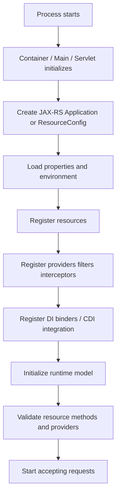

# Part 010 — Application, ResourceConfig, Properties, and Bootstrap

> Fokus part ini: memahami bagaimana JAX-RS application dihidupkan, bagaimana resource/provider terdaftar, dan bagaimana configuration memengaruhi runtime behavior.

Resource method tidak hidup sendiri. Agar endpoint bisa dipanggil, runtime harus tahu:

- application mana yang aktif,
- base path aplikasi,
- resource class apa saja yang didaftarkan,
- provider/filter/interceptor apa saja yang aktif,
- property/config apa yang memengaruhi behavior,
- dependency injection model apa yang digunakan,
- runtime container apa yang mem-bootstrap service.

Part ini membahas titik bootstrap JAX-RS. Di sinilah banyak perbedaan antara standar Jakarta/JAX-RS dan implementasi seperti Jersey muncul.

Kita harus memisahkan:

```text
Jakarta REST standard concept:
  Application, @ApplicationPath, resource/provider classes

Jersey-specific concept:
  ResourceConfig, Feature, package scanning helpers, Jersey properties

Container/runtime concept:
  Servlet mapping, web.xml, programmatic initializer, embedded server, application server
```

Untuk konteks CSG Quote & Order, jangan mengasumsikan runtime-nya. Materi ini memberi checklist untuk membuktikan runtime aktual dari codebase dan deployment artifact.

---

## 1. Why Bootstrap Matters

Ketika developer melihat resource class:

```java
@Path("/quotes")
public class QuoteResource {
  @GET
  public List<QuoteDto> list() { ... }
}
```

Mereka sering berasumsi endpoint otomatis aktif. Padahal resource hanya aktif jika runtime mendaftarkannya.

Endpoint bisa tidak tersedia karena:

- resource package tidak masuk scanning,
- resource tidak didaftarkan explicit,
- application class tidak ditemukan,
- servlet mapping berbeda,
- feature/provider dependency gagal dibuat,
- injection dependency missing,
- runtime profile tidak mengaktifkan module tersebut,
- deployment artifact tidak berisi class yang diharapkan,
- gateway route mengarah ke service yang salah.

Bootstrap adalah root dari banyak bug production:

```text
The code exists, but the runtime does not know it exists.
```

---

## 2. Standard JAX-RS `Application`

JAX-RS standard menyediakan class `Application` sebagai konfigurasi aplikasi.

```java
import jakarta.ws.rs.ApplicationPath;
import jakarta.ws.rs.core.Application;

@ApplicationPath("/api")
public class QuoteOrderApplication extends Application {
}
```

`@ApplicationPath("/api")` menunjukkan base URI untuk JAX-RS application di runtime tertentu.

Jika resource:

```java
@Path("/quotes")
public class QuoteResource {
}
```

Maka path internal biasanya:

```text
/api/quotes
```

Namun lagi-lagi, public URL bisa melewati context path, gateway, ingress, atau reverse proxy.

### Minimal Application

Class kosong dapat cukup jika runtime melakukan automatic discovery:

```java
@ApplicationPath("/api")
public class ApiApplication extends Application {
}
```

Tapi automatic discovery bergantung pada runtime dan packaging.

Di sistem enterprise, terlalu banyak magic discovery dapat membuat startup behavior sulit diprediksi.

---

## 3. Overriding `getClasses()`

JAX-RS `Application` dapat mendaftarkan resource/provider secara explicit:

```java
@ApplicationPath("/api")
public class ApiApplication extends Application {

  @Override
  public Set<Class<?>> getClasses() {
    return Set.of(
        QuoteResource.class,
        OrderResource.class,
        GlobalExceptionMapper.class,
        CorrelationIdFilter.class
    );
  }
}
```

Ini adalah standar JAX-RS.

### Pros

- explicit,
- mudah direview,
- startup surface jelas,
- tidak bergantung pada package scanning,
- mengurangi accidental exposure.

### Cons

- manual maintenance,
- lupa register resource baru,
- list bisa panjang,
- conditional registration lebih verbose.

### Production Use

Explicit registration cocok jika:

- security mengharuskan endpoint surface diketahui,
- codebase besar,
- module banyak,
- generated classes ada,
- scanning mahal atau tidak predictable,
- startup harus fail-fast jika dependency hilang.

---

## 4. Overriding `getSingletons()`

`Application` juga bisa menyediakan singleton instance:

```java
@ApplicationPath("/api")
public class ApiApplication extends Application {

  @Override
  public Set<Object> getSingletons() {
    return Set.of(
        new HealthResource(),
        new GlobalExceptionMapper()
    );
  }
}
```

Hati-hati. Singleton instance berarti lifecycle dan state harus dipahami.

Risk:

- manually created instance bypasses DI,
- mutable state shared across requests,
- resource may not receive injection,
- difficult testing if dependencies constructed inline,
- shutdown/cleanup unclear.

Dalam enterprise service, lebih baik hindari manual singleton resource kecuali benar-benar stateless dan alasannya jelas.

---

## 5. Jersey `ResourceConfig`

Jersey menyediakan `ResourceConfig`, subclass/extension konfigurasi yang lebih kaya dibanding `Application` biasa.

```java
import org.glassfish.jersey.server.ResourceConfig;

public class QuoteOrderResourceConfig extends ResourceConfig {

  public QuoteOrderResourceConfig() {
    register(QuoteResource.class);
    register(OrderResource.class);
    register(GlobalExceptionMapper.class);
    register(CorrelationIdFilter.class);
  }
}
```

`ResourceConfig` adalah Jersey-specific, bukan konsep murni JAX-RS standard.

Jika codebase memakai `ResourceConfig`, berarti ada dependency dan behavior Jersey yang perlu dipahami.

### Typical Jersey Registration

```java
public class ApiResourceConfig extends ResourceConfig {

  public ApiResourceConfig() {
    packages("com.example.quoteorder.api");
    register(new DependencyBinder());
    register(JacksonFeature.class);
    property("jersey.config.server.tracing.type", "ON_DEMAND");
  }
}
```

Di sini ada beberapa konsep:

- `packages(...)`: Jersey scanning helper,
- `register(...)`: register resource/provider/feature/binder,
- `property(...)`: Jersey runtime property,
- `Feature`: extension point,
- binder: often HK2 binding.

---

## 6. Standard vs Jersey-Specific Boundary

| Concern | Standard Jakarta/JAX-RS | Jersey-Specific |
|---|---|---|
| Application config | `Application` | `ResourceConfig` extends/implements richer config |
| Base path | `@ApplicationPath` | also works with Jersey setup |
| Register classes | `getClasses()` | `register(...)` |
| Register instances | `getSingletons()` | `register(instance)` |
| Package scanning | implementation-dependent | `packages(...)` helper |
| Feature system | standard has providers/extensions | Jersey `Feature` and properties |
| DI binding | not defined fully by JAX-RS | HK2 binder, CDI bridge, custom integration |
| Runtime properties | not fully standardized | many `jersey.config.*` properties |

Senior engineer rule:

```text
When reading bootstrap code, identify whether each line is standard JAX-RS, Jersey-specific, or container-specific.
```

This matters for:

- portability,
- upgrade risk,
- debugging,
- documentation,
- onboarding,
- migration from Jersey to other implementation,
- integration with CDI/HK2.

---

## 7. Package Scanning vs Explicit Registration

### Package Scanning

```java
public ApiResourceConfig() {
  packages("com.example.quoteorder.api");
}
```

The runtime scans package for resource/provider classes.

Pros:

- low maintenance,
- new resource auto-discovered,
- simple for small apps.

Cons:

- hidden registration,
- accidental exposure,
- startup cost,
- harder to know active resources,
- scanning behavior can change with packaging/classpath,
- conditional registration less obvious.

### Explicit Registration

```java
public ApiResourceConfig() {
  register(QuoteResource.class);
  register(OrderResource.class);
  register(HealthResource.class);
  register(GlobalExceptionMapper.class);
}
```

Pros:

- clear active surface,
- reviewable,
- less magic,
- easier to secure.

Cons:

- must update manually,
- risk of missing registration,
- long config class.

### Hybrid

Many enterprise systems use hybrid:

```java
packages("com.example.quoteorder.api.resources");
register(GlobalExceptionMapper.class);
register(SecurityFilter.class);
register(new DependencyBinder());
```

This is practical, but review must know which things are scanned and which are explicit.

---

## 8. Registration Categories

Bootstrap usually registers multiple categories.

### Resource Classes

```java
register(QuoteResource.class);
register(OrderResource.class);
```

Expose endpoints.

### Providers

```java
register(GlobalExceptionMapper.class);
register(JsonMappingExceptionMapper.class);
```

Control mapping, serialization, errors.

### Filters

```java
register(CorrelationIdFilter.class);
register(AuthenticationFilter.class);
register(TenantContextFilter.class);
```

Run before/after resource method.

### Interceptors

```java
register(CompressionInterceptor.class);
```

Wrap entity read/write.

### Features

```java
register(JacksonFeature.class);
```

Enable grouped behavior.

### DI Binders

```java
register(new ApplicationBinder(config));
```

Bind services/repositories/clients to injection container.

### Health/Admin Resources

```java
register(HealthResource.class);
register(MetricsResource.class);
```

Expose operational endpoints. In production, these often have different auth/network exposure requirements.

---

## 9. Bootstrap Lifecycle

A simplified lifecycle:



Failure can happen at any step.

Examples:

- config file missing,
- property invalid,
- resource duplicate path conflict,
- provider dependency missing,
- binder cannot construct service,
- JSON provider absent,
- unsupported runtime property,
- class not found in deployment artifact.

Production implication:

```text
Startup must fail fast for broken configuration, not partially start with hidden missing capabilities.
```

---

## 10. Properties and Configuration in ResourceConfig

Jersey `ResourceConfig` can set properties:

```java
property("some.property", "some-value");
```

Some properties are Jersey-specific. Some application properties may be custom.

Example pattern:

```java
public ApiResourceConfig(AppConfig appConfig) {
  property("app.environment", appConfig.environment());
  property("app.serviceName", appConfig.serviceName());

  register(new ApplicationBinder(appConfig));
  register(QuoteResource.class);
}
```

### Senior Concern

Do not let `ResourceConfig` become a dumping ground for all configuration logic.

Bad:

```java
public ApiResourceConfig() {
  String dbUrl = System.getenv("DB_URL");
  DataSource ds = createDataSource(dbUrl);
  KafkaProducer producer = createProducer(System.getenv("KAFKA_BOOTSTRAP"));
  SomeClient client = new SomeClient(System.getenv("DOWNSTREAM_URL"));
  register(new Binder(ds, producer, client));
}
```

Problems:

- config loading hidden,
- hard to test,
- no validation,
- no precedence model,
- secrets may leak,
- startup dependency creation may be uncontrolled.

Better:

```java
AppConfig config = AppConfigLoader.loadAndValidate();
Infrastructure infrastructure = InfrastructureFactory.create(config);
ResourceConfig resourceConfig = new ApiResourceConfig(config, infrastructure);
```

The exact shape depends on runtime, but the principle holds:

```text
Load and validate config explicitly before wiring application behavior.
```

---

## 11. Feature Registration

Jersey supports `Feature` to conditionally register components.

Conceptual example:

```java
public class ObservabilityFeature implements Feature {

  @Override
  public boolean configure(FeatureContext context) {
    context.register(CorrelationIdFilter.class);
    context.register(TracingFilter.class);
    context.register(MetricsFilter.class);
    return true;
  }
}
```

Then:

```java
register(new ObservabilityFeature());
```

Features are useful for grouping related registration:

- observability,
- security,
- JSON mapping,
- validation,
- multipart,
- compression,
- tenant context,
- admin endpoints.

### Feature Risks

Features hide registration behind an abstraction.

Review questions:

- What does this feature actually register?
- Does it depend on environment?
- Does it have ordering requirements?
- Does it register global filters?
- Does it alter serialization?
- Does it expose endpoints?
- Is it enabled in all environments?

---

## 12. Provider Priority and Ordering

Some providers/filters have ordering concerns.

Example concerns:

```text
Correlation filter should run before logging filter.
Authentication should run before authorization.
Tenant resolution should run before data access.
Request logging should include auth/tenant outcome.
Exception mapper should not swallow security error incorrectly.
```

JAX-RS provides priority mechanisms for filters/interceptors, and implementations may add behavior.

Bad production symptom:

```text
Logs do not contain correlation ID for rejected auth requests.
```

Possible cause:

```text
Auth filter runs before correlation filter and rejects request early.
```

Another symptom:

```text
Tenant missing in audit log for validation errors.
```

Possible cause:

```text
Validation happens before tenant context is established, or mapper does not read context correctly.
```

Bootstrap review must include ordering, not only presence.

---

## 13. DI Binding in Bootstrap

In Jersey/HK2 setups, bootstrap often registers binders.

Conceptual example:

```java
public class ApplicationBinder extends AbstractBinder {

  private final AppConfig config;

  public ApplicationBinder(AppConfig config) {
    this.config = config;
  }

  @Override
  protected void configure() {
    bind(config).to(AppConfig.class);
    bind(QuoteApplicationService.class).to(QuoteApplicationService.class);
    bind(PostgresQuoteRepository.class).to(QuoteRepository.class);
  }
}
```

Then:

```java
register(new ApplicationBinder(config));
```

This is not standard JAX-RS. It is Jersey/HK2-specific style.

If CDI is used, bootstrap may instead rely on CDI bean discovery and producers.

Internal verification must answer:

```text
Who constructs QuoteResource?
Who injects QuoteApplicationService?
Is it HK2, CDI, manual construction, or another container?
```

Why this matters:

- scope behavior,
- singleton/request lifecycle,
- startup validation,
- mocking in tests,
- circular dependency behavior,
- resource cleanup.

---

## 14. Servlet-Based Bootstrap

In Servlet container deployment, JAX-RS may be bootstrapped through:

- `web.xml`,
- Servlet initializer,
- application server discovery,
- framework-specific servlet registration.

Conceptual `web.xml` style:

```xml
<servlet>
  <servlet-name>Jersey</servlet-name>
  <servlet-class>org.glassfish.jersey.servlet.ServletContainer</servlet-class>
  <init-param>
    <param-name>jakarta.ws.rs.Application</param-name>
    <param-value>com.example.ApiResourceConfig</param-value>
  </init-param>
</servlet>

<servlet-mapping>
  <servlet-name>Jersey</servlet-name>
  <url-pattern>/api/*</url-pattern>
</servlet-mapping>
```

Conceptual programmatic registration:

```java
public class AppInitializer implements ServletContainerInitializer {
  ...
}
```

Or framework-specific bootstrapping.

### Debugging Servlet Path Issues

You may have:

```text
context path: /quote-order
servlet mapping: /api/*
application path: /v1
resource path: /quotes
```

Public/internal path can become:

```text
/quote-order/api/v1/quotes
```

But exact behavior depends on runtime setup. Verify, do not infer.

---

## 15. Embedded/Standalone Bootstrap

Some Jersey services run embedded with Grizzly or another HTTP server.

Conceptual example:

```java
public class Main {
  public static void main(String[] args) {
    ResourceConfig config = new ApiResourceConfig();
    HttpServer server = GrizzlyHttpServerFactory.createHttpServer(
        URI.create("http://0.0.0.0:8080/api/"),
        config
    );
  }
}
```

This differs from Servlet deployment:

- application owns HTTP server lifecycle,
- main method controls startup/shutdown,
- no external servlet container,
- thread model may differ,
- packaging is usually runnable jar/container,
- health/readiness must be integrated directly.

Internal verification:

- Is there a `main` class?
- Is Grizzly used?
- Is service deployed as WAR or executable JAR?
- What starts the HTTP listener?
- How is graceful shutdown handled?

---

## 16. Startup Fail-Fast Strategy

A production service should fail early if required wiring/config is invalid.

Fail fast examples:

- missing DB URL,
- invalid Kafka bootstrap config,
- unknown tenant config mode,
- missing JSON provider,
- missing required secret,
- invalid feature flag client config,
- unsupported environment profile,
- duplicate route mapping,
- incompatible schema/config version.

Bad behavior:

```text
Service starts successfully but first request fails because critical provider is missing.
```

Better behavior:

```text
Service refuses to start and emits clear startup error.
```

Startup validation can include:

- config validation,
- dependency construction,
- route/resource model validation,
- database migration state check,
- required topic/config presence check,
- cloud credential check if safe and appropriate,
- feature flag config validation.

But do not overdo startup checks if they create fragile dependency coupling. For example, forcing every downstream service to be available at startup can reduce resilience.

Balance:

```text
Validate local configuration strongly.
Validate external dependencies deliberately.
Do not make startup depend on optional downstream availability unless required.
```

---

## 17. Environment Profiles

Enterprise services usually run in multiple environments:

```text
local
unit-test
integration-test
dev
qa
staging
prod
prod-dr
```

Bootstrap often changes behavior by profile:

- mock vs real client,
- local vs cloud secret source,
- debug logging vs production logging,
- test provider vs production provider,
- disabled auth for local dev,
- fake clock for tests,
- in-memory store vs PostgreSQL,
- embedded Kafka vs real Kafka.

Risk:

```text
Environment profile silently changes runtime behavior in ways production does not match.
```

Review questions:

- Where is profile selected?
- What is default if profile missing?
- Are unsafe defaults possible?
- Can local-only bypass leak into prod?
- Are profile differences documented?
- Are tests run against prod-like profile?

Safe default principle:

```text
If environment is unknown, fail startup.
Do not default to local/dev mode.
```

---

## 18. Configuration Source Precedence

Even if deeper config is covered later, bootstrap must know where properties come from.

Possible sources:

- hardcoded defaults,
- property files,
- environment variables,
- JVM system properties,
- Kubernetes ConfigMap/Secret,
- cloud config service,
- command line args,
- internal platform config,
- tenant-specific config store.

A real service needs a precedence model:

```text
default config
  < environment config file
  < environment variables
  < secret store
  < runtime override
```

Or any organization-defined equivalent.

Without precedence clarity, debugging config drift becomes painful:

```text
Why is timeout 2s in staging but 10s in prod?
Which config source won?
```

Bootstrap should log safe, redacted config summary:

```text
service=quote-order
profile=prod
http.port=8080
jaxrs.basePath=/api
json.provider=jackson
kafka.enabled=true
db.pool.max=30
secret.db.password=<redacted>
```

Never log secret values.

---

## 19. ResourceConfig as Composition Root

In many Jersey services, `ResourceConfig` becomes the composition root.

Composition root means:

```text
The place where application object graph is assembled.
```

This is a valid pattern if controlled.

Good composition root:

- centralizes wiring,
- validates config,
- registers resources/providers,
- binds interfaces to implementations,
- keeps runtime specifics at boundary.

Bad composition root:

- creates random clients inline,
- reads environment variables everywhere,
- hides secret access,
- mixes business rules into bootstrap,
- conditionally registers endpoints unpredictably,
- becomes 1000-line god config.

A cleaner layout:

```text
Bootstrap/Main
  -> load config
  -> initialize infrastructure
  -> create ResourceConfig
  -> register API + providers + binders
  -> start server/container
```

Possible package structure:

```text
com.company.quoteorder
  bootstrap/
    Main.java
    ApiResourceConfig.java
    ApplicationBinder.java
    AppConfigLoader.java
  api/
    QuoteResource.java
    OrderResource.java
    GlobalExceptionMapper.java
  application/
    QuoteApplicationService.java
  domain/
    Quote.java
    QuoteId.java
  infrastructure/
    postgres/
    kafka/
    httpclient/
```

---

## 20. Observability During Bootstrap

Startup logs are critical.

A good startup log should answer:

- service name,
- version/build hash,
- environment/profile,
- runtime/container,
- Java version,
- active base path,
- registered major features,
- important config summary,
- observability exporter status,
- health endpoint path,
- readiness state.

Avoid logging:

- raw secrets,
- tokens,
- full DB password URL,
- customer/tenant sensitive config,
- private keys.

Example safe startup log:

```text
INFO service=quote-order version=1.17.4 build=abc123 profile=prod runtime=jersey-grizzly basePath=/api
INFO feature=json provider=jackson unknownFields=reject
INFO feature=observability tracing=enabled metrics=enabled correlationHeader=X-Correlation-Id
INFO db=postgres pool.max=30 url.host=postgres.internal url.database=quote_order password=<redacted>
INFO kafka=enabled bootstrap.servers.count=3 security.protocol=SASL_SSL
INFO startup=ready port=8080 readiness=/health/ready
```

This makes incident triage easier.

---

## 21. Health and Readiness Registration

Bootstrap often registers health endpoints.

```java
register(HealthResource.class);
```

But health endpoints are not all the same:

- liveness: process is alive,
- readiness: service can receive traffic,
- startup: service finished initialization,
- dependency health: DB/Kafka/downstream status,
- admin health: richer internal diagnostics.

Do not mix them casually.

Example:

```text
GET /health/live
  returns 200 if process is alive

GET /health/ready
  returns 200 if service should receive traffic

GET /health/dependencies
  internal/admin only
```

Bootstrap must ensure these endpoints are available early enough for Kubernetes/platform probes, but not expose sensitive information publicly.

---

## 22. Admin and Internal Endpoints

Enterprise services often have non-business endpoints:

- health,
- metrics,
- build info,
- config info,
- feature flag status,
- diagnostic endpoints,
- cache flush,
- replay trigger,
- job trigger.

Be careful: admin endpoints can be dangerous.

Questions:

- Are they registered in production?
- Are they behind internal network only?
- Are they authenticated/authorized?
- Are dangerous operations audited?
- Are they excluded from public OpenAPI?
- Are they disabled by default?

Never expose operational mutation endpoints casually.

---

## 23. Conditional Registration

Sometimes bootstrap registers features conditionally:

```java
if (config.kafka().enabled()) {
  register(new KafkaDiagnosticsResource(...));
}

if (config.features().enableDebugEndpoints()) {
  register(DebugResource.class);
}
```

Conditional registration can be useful, but dangerous.

Risks:

- endpoint exists in staging but not prod,
- OpenAPI differs by environment,
- tests pass with a feature disabled,
- security endpoints accidentally enabled,
- consumers depend on environment-specific behavior.

Rule:

```text
Business API surface should not vary unpredictably by environment.
Operational/internal API surface may vary, but must be documented and secured.
```

---

## 24. OpenAPI and Bootstrap Drift

If OpenAPI is generated from registered resources, registration directly affects contract output.

If OpenAPI is written separately, registration can drift from contract.

Drift examples:

```text
OpenAPI says /quotes exists, but resource not registered.
Resource exists, but OpenAPI omitted it.
Resource produces XML, OpenAPI says JSON only.
Resource returns 201, OpenAPI says 200.
```

CI should ideally detect drift:

- generate OpenAPI from runtime model,
- compare with committed contract,
- lint contract,
- run endpoint smoke tests,
- verify resource registration.

---

## 25. Common Startup Failure Modes

### 25.1 Resource Not Registered

Symptom:

```text
404 for endpoint that exists in code
```

Possible causes:

- package not scanned,
- explicit registration missing,
- module not on classpath,
- profile disables resource,
- wrong application class deployed.

Debug:

- inspect `ResourceConfig`/`Application`,
- check built artifact contents,
- check startup logs,
- list registered resources if supported,
- test with internal path.

### 25.2 Provider Not Registered

Symptom:

```text
415 Unsupported Media Type
500 serialization error
custom error mapper not invoked
```

Possible causes:

- JSON provider missing,
- custom provider package not scanned,
- feature not registered,
- provider priority conflict,
- dependency injection failed.

Debug:

- inspect provider registration,
- inspect dependencies,
- check runtime logs,
- add integration test for serialization/error mapping.

### 25.3 Wrong Base Path

Symptom:

```text
Endpoint works locally but not through gateway
```

Possible causes:

- servlet mapping mismatch,
- `@ApplicationPath` mismatch,
- ingress rewrite mismatch,
- context path mismatch,
- API gateway stage prefix.

Debug:

- map each path layer,
- compare local vs deployed routes,
- inspect access logs at gateway and service.

### 25.4 DI Binding Failure

Symptom:

```text
Startup fails with unsatisfied dependency
or first request fails when resource is constructed
```

Possible causes:

- missing binder,
- wrong implementation binding,
- CDI not active,
- HK2/CDI bridge missing,
- scope mismatch,
- circular dependency.

Debug:

- identify DI mechanism,
- inspect binder/producer,
- check resource construction lifecycle,
- add startup wiring test.

### 25.5 Environment Config Drift

Symptom:

```text
Same artifact behaves differently across environments
```

Possible causes:

- different property source,
- missing environment variable,
- profile defaulting,
- ConfigMap drift,
- secret version mismatch,
- feature flag difference.

Debug:

- compare redacted config summaries,
- inspect deployment manifests,
- inspect config source precedence,
- verify runtime profile.

---

## 26. Production Bootstrap Review Checklist

### Application and Routing

- Is application base path explicit?
- Is servlet mapping understood?
- Is public path mapped to internal path?
- Is resource registration explicit or scanned?
- Are there accidental public endpoints?

### Resource and Provider Registration

- Are resources registered predictably?
- Are exception mappers registered?
- Are filters/interceptors registered in correct order?
- Is JSON/XML/multipart provider registered as needed?
- Are admin endpoints separated and protected?

### Configuration

- Is config loaded from known sources?
- Is precedence documented?
- Are required properties validated at startup?
- Are unsafe defaults avoided?
- Are secrets redacted?
- Is profile selection explicit?

### Dependency Injection

- Which DI system constructs resources?
- Are binders/producers explicit?
- Are scopes correct?
- Are singleton dependencies immutable/thread-safe?
- Is startup wiring tested?

### Observability

- Are startup logs useful and safe?
- Is service version/build logged?
- Are active features logged?
- Are health/readiness endpoints registered?
- Are metrics/tracing filters registered early enough?

### Security

- Are security filters active in all non-local environments?
- Are auth bypasses impossible in prod?
- Are admin endpoints protected?
- Are tenant filters registered before business logic?
- Are dangerous debug endpoints disabled?

### Deployment

- Is packaged artifact correct?
- Does Docker image include required classes/config?
- Does Kubernetes route match application path?
- Are environment variables/config maps aligned?
- Is readiness tied to actual startup completion?

---

## 27. Internal Verification Checklist

For CSG Quote & Order, verify the following from actual artifacts and team knowledge.

### Runtime Identification

- Is the service using Jersey?
- Is `ResourceConfig` present?
- Is the runtime Servlet-based, GlassFish, Grizzly, Tomcat, Jetty, or something else?
- Is deployment packaged as WAR, executable JAR, or container image with embedded server?
- What class starts the application?

### Registration Model

- Are resources registered by package scanning?
- Are resources explicitly registered?
- Are providers/filters registered manually or auto-discovered?
- Are features used to group registration?
- Is registration environment-dependent?

### Dependency Injection

- Is HK2 used?
- Is CDI used?
- Is there a bridge between Jersey and CDI?
- Are resources constructor-injected, field-injected, or manually constructed?
- Where are repositories, clients, Kafka producers, and config objects bound?

### Configuration

- Where is `@ApplicationPath` or servlet mapping defined?
- Where are Jersey properties defined?
- Which config source wins on conflict?
- How are secrets provided?
- How is tenant-specific config loaded?
- Is runtime reload supported?

### Observability and Operations

- What startup logs exist?
- Is build version logged?
- Are registered endpoints visible?
- Are health/readiness endpoints registered in the same JAX-RS app or separate server?
- Are metrics/tracing filters registered through JAX-RS or platform agent?

### Security

- Where is auth filter registered?
- Where is tenant context filter registered?
- Is security disabled in local only?
- How is local bypass prevented in prod?
- Are admin resources exposed in production?

---

## 28. Recommended Internal Code Reading Order

When joining a JAX-RS codebase, read bootstrap in this order:

```text
1. pom.xml / build.gradle
2. Dockerfile / image entrypoint
3. main class or servlet descriptor
4. Application / ResourceConfig class
5. registered resources
6. registered filters/interceptors/providers
7. DI binder / CDI producers
8. config loader
9. health/readiness resources
10. deployment manifests / ingress route
```

This order answers:

```text
How does the process start?
How does HTTP enter the app?
Which JAX-RS app handles it?
Which resources/providers are active?
Which dependencies are wired?
How does it differ by environment?
```

Do not start only from a resource method. Resource method tells you what the code wants to expose. Bootstrap tells you what the runtime actually exposes.

---

## 29. Minimal Bootstrap Example: Standard JAX-RS Style

```java
@ApplicationPath("/api")
public class ApiApplication extends Application {

  @Override
  public Set<Class<?>> getClasses() {
    return Set.of(
        QuoteResource.class,
        OrderResource.class,
        GlobalExceptionMapper.class,
        CorrelationIdFilter.class,
        AuthenticationFilter.class
    );
  }
}
```

Characteristics:

- standard JAX-RS,
- explicit registration,
- low Jersey coupling,
- limited advanced config.

Good for understanding baseline.

---

## 30. Minimal Bootstrap Example: Jersey ResourceConfig Style

```java
public class ApiResourceConfig extends ResourceConfig {

  public ApiResourceConfig(AppConfig config, Infrastructure infra) {
    property("app.serviceName", config.serviceName());
    property("app.environment", config.environment());

    register(new ApplicationBinder(config, infra));

    register(QuoteResource.class);
    register(OrderResource.class);

    register(GlobalExceptionMapper.class);
    register(ValidationExceptionMapper.class);

    register(CorrelationIdFilter.class);
    register(AuthenticationFilter.class);
    register(TenantContextFilter.class);

    register(JacksonFeature.class);
  }
}
```

Characteristics:

- Jersey-specific,
- explicit resource/provider registration,
- binder-driven dependency injection,
- properties and features centralized.

This style is common in Jersey-based production systems, but verify actual codebase.

---

## 31. What Not to Put in ResourceConfig

Avoid putting core business rules in bootstrap.

Bad:

```java
if (config.customer().equals("tenant-a")) {
  register(SpecialTenantQuoteResource.class);
}
```

This can make API surface tenant-specific in surprising ways.

Better:

```text
Same API surface.
Tenant-specific behavior inside tenant-aware application service/config/rules engine.
```

Avoid complex imperative logic:

```java
if (env.equals("prod") && region.equals("eu") && featureX && !tenantY) {
  register(...);
}
```

If registration logic is complex, model it explicitly and test it.

---

## 32. Bootstrap Testing

Bootstrap deserves tests.

Useful test types:

### Resource Registration Test

Assert known endpoint exists in test runtime.

```text
Start lightweight Jersey test container
GET /quotes
expect not 404 due to missing registration
```

### Provider Registration Test

Assert exception mapper works.

```text
Trigger known validation/domain exception
expect standard error envelope
```

### Serialization Provider Test

Assert JSON behavior.

```text
Unknown field rejected/ignored according to policy
Date serialized according to standard
BigDecimal precision preserved
```

### Config Validation Test

Assert missing required config fails startup.

```text
Remove DB URL
expect startup failure with clear message
```

### Security Filter Test

Assert unauthenticated request is rejected before resource method.

```text
GET /quotes without token
expect 401/403 based on policy
```

---

## 33. Bootstrap and Kubernetes Readiness

When deployed in Kubernetes, bootstrap interacts with probes:

```text
container starts
  -> JVM starts
  -> app loads config
  -> JAX-RS runtime initializes
  -> resources/providers registered
  -> infrastructure initialized
  -> readiness endpoint returns OK
  -> pod receives traffic
```

If readiness returns OK too early, traffic can hit partially initialized app.

If readiness depends on too many external dependencies, pod can flap.

Good readiness checks should reflect:

- app initialized,
- critical local resources ready,
- required config valid,
- service can handle basic traffic.

Dependency readiness is context-specific. A service may still be ready even if optional downstream is temporarily down, if it has fallback/degradation.

---

## 34. Mental Model Summary

Bootstrap defines actual runtime surface.

```text
Resource annotations describe potential endpoints.
Application/ResourceConfig decides what is active.
Container/runtime decides how HTTP reaches it.
Properties/features/providers decide how it behaves.
DI decides how objects are constructed.
```

When debugging a JAX-RS service, always connect:

```text
Code annotation
  -> registration
  -> runtime container
  -> deployment route
  -> public traffic path
```

A senior engineer does not stop at:

```text
The class has @Path, so it should work.
```

A senior engineer asks:

```text
Is this resource registered?
By whom?
In which environment?
With which providers?
Under which path?
With which filters and DI model?
```

---

## 35. Part 010 Learning Outcome Checklist

After this part, you should be able to:

- explain standard JAX-RS `Application`,
- explain Jersey-specific `ResourceConfig`,
- distinguish standard vs implementation-specific bootstrap concepts,
- compare package scanning and explicit registration,
- identify resource/provider/filter/interceptor registration,
- understand how properties/features affect runtime behavior,
- trace servlet or embedded runtime bootstrap,
- reason about startup fail-fast and config validation,
- review bootstrap code for security, observability, and operability,
- verify actual CSG runtime from codebase and deployment evidence.
