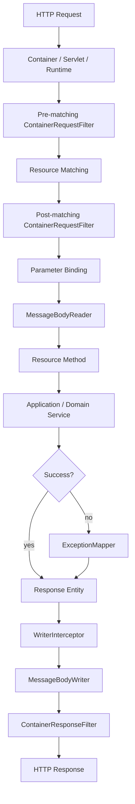

# Part 011 — Providers, Filters, Interceptors, and ExceptionMapper

> Fokus part ini: memahami extension point utama JAX-RS yang membentuk behavior lintas endpoint: provider, filter, interceptor, dan exception mapper.

Resource method hanya satu titik di dalam request lifecycle. Dalam service enterprise, banyak behavior penting justru terjadi **sebelum** dan **sesudah** resource method dipanggil:

- authentication,
- authorization,
- request normalization,
- correlation ID,
- logging,
- metrics,
- tracing,
- input/output decoration,
- error translation,
- security header,
- audit hook,
- compression/encryption hook tertentu,
- response shaping,
- compatibility behavior.

JAX-RS menyediakan extension points agar behavior tersebut tidak ditulis ulang di setiap resource method.

Namun extension point ini juga bisa menjadi sumber bug yang sulit dicari karena behavior-nya tersembunyi dari resource method.

```text
Resource code looks simple.
Runtime behavior is not simple.
```

Part ini membangun mental model pipeline agar kamu bisa membaca service JAX-RS dengan cara senior engineer: bukan hanya melihat endpoint, tetapi melihat seluruh request path.

---

## 1. The Real Request Pipeline

Secara sederhana, request JAX-RS tidak langsung masuk ke method seperti ini:

```text
HTTP request -> resource method -> HTTP response
```

Lebih realistis:

```text
HTTP request
  -> container/proxy preprocessing
  -> JAX-RS request filters
  -> request matching
  -> parameter binding
  -> entity provider / MessageBodyReader
  -> resource method
  -> domain/application service
  -> response object
  -> exception mapper if failure
  -> entity provider / MessageBodyWriter
  -> response filters
  -> container/proxy postprocessing
  -> HTTP response
```

Mermaid view:



Dalam code review, kamu harus bertanya:

```text
What happens outside the resource method?
```

Karena bug authorization, logging, serialization, tracing, dan error handling sering berada di luar resource class.

---

## 2. Standard vs Implementation-Specific Boundary

Sebelum membahas detail, pisahkan tiga lapisan:

```text
Jakarta REST / JAX-RS standard:
  @Provider
  ContainerRequestFilter
  ContainerResponseFilter
  ReaderInterceptor
  WriterInterceptor
  ExceptionMapper
  DynamicFeature
  NameBinding
  @Priority

Jersey-specific implementation:
  Jersey ResourceConfig registration behavior
  Jersey Feature
  Jersey-specific properties
  HK2 binding and injection behavior
  Jersey auto-discovery behavior
  Jersey logging/tracing features

Internal CSG-specific behavior:
  actual auth filter
  correlation strategy
  error envelope
  audit logger
  provider registration style
  OpenAPI generation strategy
  deployment/runtime-specific behavior
```

Jangan menganggap semua service JAX-RS memakai Jersey feature tertentu. Jangan juga menganggap semua provider otomatis ditemukan. Harus dibuktikan dari dependency, bootstrap class, runtime log, dan deployment artifact.

---

## 3. What Is a Provider?

Dalam JAX-RS, istilah **provider** adalah umbrella term untuk komponen yang memperluas runtime behavior.

Contoh provider:

- `ContainerRequestFilter`,
- `ContainerResponseFilter`,
- `ReaderInterceptor`,
- `WriterInterceptor`,
- `ExceptionMapper`,
- `MessageBodyReader`,
- `MessageBodyWriter`,
- custom parameter converter provider,
- context resolver.

Provider biasanya ditandai dengan annotation:

```java
import jakarta.ws.rs.ext.Provider;

@Provider
public class CorrelationIdFilter implements ContainerRequestFilter {
  @Override
  public void filter(ContainerRequestContext requestContext) {
    // request preprocessing
  }
}
```

Tetapi `@Provider` saja belum selalu berarti provider aktif.

Provider bisa aktif karena:

1. automatic discovery oleh runtime,
2. package scanning,
3. explicit registration di `Application` atau `ResourceConfig`,
4. registration melalui `Feature`,
5. registration melalui container integration,
6. registration via dependency injection module/binder.

Production lesson:

```text
A provider class existing in source code is not evidence that it runs.
```

Evidence-nya harus berupa registration path dan startup behavior.

---

## 4. Provider Discovery and Registration

### 4.1 Automatic Discovery

Beberapa runtime dapat menemukan provider otomatis jika class diberi `@Provider` dan berada dalam scanning scope.

Risikonya:

- provider tidak ditemukan karena package tidak discan,
- provider ditemukan di environment lokal tapi tidak di production artifact,
- provider duplicate karena auto-discovery plus explicit registration,
- ordering berubah karena registration tidak eksplisit,
- test runtime berbeda dari production runtime.

### 4.2 Explicit Registration

Explicit registration biasanya lebih reviewable:

```java
public class ApiApplication extends ResourceConfig {
  public ApiApplication() {
    register(CorrelationIdFilter.class);
    register(SecurityFilter.class);
    register(GlobalExceptionMapper.class);
  }
}
```

Keuntungannya:

- runtime behavior lebih mudah ditemukan,
- PR diff lebih jelas,
- startup failure lebih cepat terlihat,
- accidental provider lebih kecil,
- governance lebih kuat.

Trade-off:

- perlu maintenance manual,
- module baru bisa lupa didaftarkan,
- dynamic/plugin architecture lebih sulit.

### 4.3 Registration Through Feature

Untuk grouping behavior, Jersey atau JAX-RS feature dapat dipakai.

Contoh konseptual:

```java
public class ObservabilityFeature implements Feature {
  @Override
  public boolean configure(FeatureContext context) {
    context.register(CorrelationIdFilter.class);
    context.register(TracingFilter.class);
    context.register(MetricsFilter.class);
    return true;
  }
}
```

Pola ini berguna untuk cross-cutting module, tetapi bisa menyembunyikan provider aktif jika tidak terdokumentasi.

Senior review question:

```text
Can a new engineer discover all active providers in less than five minutes?
```

Jika jawabannya tidak, bootstrap/registration perlu dirapikan.

---

## 5. ContainerRequestFilter

`ContainerRequestFilter` berjalan saat request masuk ke JAX-RS pipeline.

Typical use cases:

- authentication,
- authorization pre-check,
- correlation ID extraction,
- tenant resolution,
- request logging,
- request normalization,
- feature flag context setup,
- security context setup,
- request rejection before resource method.

Example:

```java
import jakarta.annotation.Priority;
import jakarta.ws.rs.Priorities;
import jakarta.ws.rs.container.ContainerRequestContext;
import jakarta.ws.rs.container.ContainerRequestFilter;
import jakarta.ws.rs.core.Response;
import jakarta.ws.rs.ext.Provider;

@Provider
@Priority(Priorities.AUTHENTICATION)
public class AuthenticationFilter implements ContainerRequestFilter {
  @Override
  public void filter(ContainerRequestContext ctx) {
    String authorization = ctx.getHeaderString("Authorization");

    if (authorization == null || authorization.isBlank()) {
      ctx.abortWith(Response.status(Response.Status.UNAUTHORIZED).build());
      return;
    }

    // Validate token, build security context, attach identity.
  }
}
```

`abortWith` menghentikan pipeline normal dan mengembalikan response langsung.

### Production risk

Request filter terlalu mudah menjadi tempat semua logic.

Anti-pattern:

```text
Filter does authentication, authorization, tenant lookup, DB query,
feature flag loading, audit logging, DTO validation, and business routing.
```

Filter harus fokus pada cross-cutting concern. Business logic tetap di application/domain layer.

---

## 6. Pre-Matching vs Post-Matching Filters

JAX-RS mengenal filter yang berjalan sebelum resource matching melalui `@PreMatching`.

```java
import jakarta.ws.rs.container.PreMatching;

@Provider
@PreMatching
public class MethodOverrideFilter implements ContainerRequestFilter {
  @Override
  public void filter(ContainerRequestContext ctx) {
    // Can modify method or URI before resource matching.
  }
}
```

Pre-matching filter bisa mengubah:

- HTTP method,
- request URI,
- headers,
- routing-related data.

Gunakan sangat hati-hati.

Risiko:

- route yang terlihat di log berbeda dari route aktual,
- OpenAPI contract tidak sesuai runtime behavior,
- security filter bisa berjalan setelah rewrite yang tidak jelas,
- debugging 404/405 menjadi sulit,
- behavior berbeda antara local dan gateway.

Rule of thumb:

```text
Avoid request rewriting inside application unless there is a clear platform standard.
Prefer doing routing normalization at gateway or explicit resource paths.
```

Internal verification:

- apakah ada `@PreMatching` filter,
- apakah filter mengubah method/path,
- apakah behavior itu terdokumentasi,
- apakah API contract mencerminkan behavior tersebut.

---

## 7. ContainerResponseFilter

`ContainerResponseFilter` berjalan setelah resource method atau exception mapper menghasilkan response.

Typical use cases:

- add security headers,
- add correlation ID header,
- response logging,
- metrics finalization,
- cache header enforcement,
- deprecation header,
- CORS headers jika tidak ditangani gateway,
- response normalization.

Example:

```java
@Provider
public class SecurityHeaderFilter implements ContainerResponseFilter {
  @Override
  public void filter(ContainerRequestContext request, ContainerResponseContext response) {
    response.getHeaders().putSingle("X-Content-Type-Options", "nosniff");
    response.getHeaders().putSingle("X-Frame-Options", "DENY");
  }
}
```

Response filter sebaiknya tidak:

- mengubah domain payload secara besar-besaran,
- menelan error,
- mengganti status code tanpa alasan kuat,
- melakukan blocking I/O mahal,
- melakukan audit final tanpa idempotency.

Response filter harus predictable. Jika filter mengubah response body/status, resource method menjadi tidak lagi source of truth.

---

## 8. ReaderInterceptor and WriterInterceptor

Filter bekerja di level request/response metadata. Interceptor bekerja lebih dekat ke entity stream.

### ReaderInterceptor

Reader interceptor berjalan sebelum/sekitar entity dibaca oleh `MessageBodyReader`.

Possible use cases:

- decrypt request body,
- verify payload signature,
- decompress custom payload,
- wrap input stream,
- collect body metrics,
- enforce read limits jika platform tidak menangani.

Example skeleton:

```java
@Provider
public class PayloadReaderInterceptor implements ReaderInterceptor {
  @Override
  public Object aroundReadFrom(ReaderInterceptorContext context)
      throws IOException, WebApplicationException {
    // inspect headers, wrap input stream if needed
    return context.proceed();
  }
}
```

### WriterInterceptor

Writer interceptor berjalan sebelum/sekitar entity ditulis oleh `MessageBodyWriter`.

Possible use cases:

- sign response payload,
- encrypt response body,
- compress custom body,
- wrap output stream,
- collect serialization metrics.

```java
@Provider
public class PayloadWriterInterceptor implements WriterInterceptor {
  @Override
  public void aroundWriteTo(WriterInterceptorContext context)
      throws IOException, WebApplicationException {
    context.proceed();
  }
}
```

### Why interceptors are dangerous

Interceptor menyentuh stream. Kesalahan kecil bisa menyebabkan:

- body kosong,
- stream tertutup terlalu awal,
- response corrupt,
- memory buffering tidak sengaja,
- signature mismatch,
- latency tinggi,
- error 500 setelah header sudah terkirim,
- sulit direproduce di test.

Rule:

```text
Do not use interceptors for normal business transformation.
Use them only for transport-level entity concerns.
```

---

## 9. ExceptionMapper

`ExceptionMapper<T extends Throwable>` mengubah exception menjadi HTTP response.

Example:

```java
@Provider
public class NotFoundExceptionMapper implements ExceptionMapper<EntityNotFoundException> {
  @Override
  public Response toResponse(EntityNotFoundException ex) {
    ErrorResponse body = new ErrorResponse(
        "ENTITY_NOT_FOUND",
        ex.getMessage()
    );

    return Response.status(Response.Status.NOT_FOUND)
        .entity(body)
        .type(MediaType.APPLICATION_JSON)
        .build();
  }
}
```

Exception mapper menjawab pertanyaan:

```text
If this Java failure happens, what HTTP contract should the client see?
```

Bukan hanya:

```text
How do we hide stack traces?
```

---

## 10. Exception Taxonomy

Untuk sistem enterprise, exception mapper harus didukung taxonomy.

Contoh taxonomy:

```text
ValidationException
  -> 400 Bad Request

AuthenticationException
  -> 401 Unauthorized

AuthorizationException
  -> 403 Forbidden

EntityNotFoundException
  -> 404 Not Found

ConflictException
  -> 409 Conflict

OptimisticLockException
  -> 409 Conflict or 412 Precondition Failed

RateLimitException
  -> 429 Too Many Requests

DownstreamTimeoutException
  -> 504 Gateway Timeout or 503 Service Unavailable

DownstreamUnavailableException
  -> 503 Service Unavailable

UnexpectedException
  -> 500 Internal Server Error
```

Hal yang harus distabilkan:

- HTTP status,
- internal error code,
- human-readable message,
- machine-readable details,
- correlation ID,
- retryability indicator,
- field-level validation error,
- localization strategy jika ada,
- sensitive data redaction.

Bad pattern:

```java
catch (Exception e) {
  return Response.status(500).entity(e.getMessage()).build();
}
```

Masalah:

- bocor implementation detail,
- error contract tidak stabil,
- client tidak bisa branch berdasarkan error code,
- security risk,
- observability miskin,
- stack trace bisa bocor.

---

## 11. Mapper Specificity and Precedence

Jika ada beberapa mapper:

```java
ExceptionMapper<Throwable>
ExceptionMapper<RuntimeException>
ExceptionMapper<DomainException>
ExceptionMapper<QuoteNotFoundException>
```

Runtime biasanya memilih mapper paling spesifik untuk exception aktual.

Risiko:

- generic mapper menelan exception khusus,
- mapper tidak registered,
- exception dibungkus sehingga mapper spesifik tidak match,
- checked vs runtime exception berbeda path,
- framework exception seperti validation atau JSON parse tidak dimap.

Senior debugging checklist:

1. Exception aktual class apa?
2. Apakah exception dibungkus?
3. Mapper mana yang registered?
4. Mapper mana yang paling spesifik?
5. Apakah mapper menghasilkan media type yang sesuai?
6. Apakah mapper sendiri throw exception?
7. Apakah response filter mengubah hasil mapper?

---

## 12. `WebApplicationException`

JAX-RS memiliki `WebApplicationException` yang membawa HTTP response.

Contoh:

```java
throw new WebApplicationException(
    "Invalid state",
    Response.Status.CONFLICT
);
```

Kapan boleh?

- boundary transport-level,
- simple resource-level rejection,
- prototype/internal endpoint,
- framework integration.

Kapan sebaiknya dihindari?

- domain service murni,
- reusable application logic,
- deep repository layer,
- logic yang juga dipakai non-HTTP consumer.

Alasannya: domain layer tidak seharusnya tahu HTTP.

Better pattern:

```text
Domain/application throws domain exception.
JAX-RS boundary maps it to HTTP response.
```

---

## 13. Name Binding

Name binding memungkinkan filter/interceptor hanya berlaku pada resource tertentu.

Example:

```java
@NameBinding
@Retention(RetentionPolicy.RUNTIME)
@Target({ElementType.TYPE, ElementType.METHOD})
public @interface Audited {
}
```

Filter:

```java
@Audited
@Provider
public class AuditFilter implements ContainerRequestFilter {
  @Override
  public void filter(ContainerRequestContext ctx) {
    // audit setup
  }
}
```

Resource:

```java
@Audited
@Path("/quotes")
public class QuoteResource {
}
```

Use cases:

- audit only on mutation endpoints,
- special authorization on selected resources,
- special logging on sensitive APIs,
- feature flag on specific endpoints.

Risks:

- annotation missing on new endpoint,
- annotation inherited unexpectedly or not inherited,
- policy fragmented across annotations,
- difficult to audit coverage.

Internal verification:

- apakah ada custom name binding,
- apakah coverage diuji,
- apakah endpoint baru punya checklist annotation wajib,
- apakah ada static analysis/API lint untuk policy.

---

## 14. DynamicFeature

`DynamicFeature` memungkinkan runtime mendaftarkan filter/interceptor berdasarkan resource method/class.

Conceptual example:

```java
@Provider
public class AuditDynamicFeature implements DynamicFeature {
  @Override
  public void configure(ResourceInfo resourceInfo, FeatureContext context) {
    if (resourceInfo.getResourceMethod().isAnnotationPresent(Audited.class)) {
      context.register(AuditFilter.class);
    }
  }
}
```

Dynamic feature berguna saat policy perlu membaca metadata resource.

Risiko:

- behavior lebih sulit ditemukan,
- bug registration hanya muncul untuk endpoint tertentu,
- test harus mencakup resource metadata,
- annotation/reflection behavior bisa berubah saat refactor.

Gunakan jika memang perlu dynamic binding. Untuk policy sederhana, explicit registration atau name binding sering lebih jelas.

---

## 15. Ordering with `@Priority`

Provider ordering penting.

Contoh urutan yang masuk akal:

```text
1. Correlation ID extraction
2. Request logging context setup
3. Authentication
4. Tenant resolution
5. Authorization
6. Rate limiting
7. Resource method
8. Exception mapping
9. Response headers
10. Metrics/log finalization
```

JAX-RS mendukung `@Priority`.

```java
@Provider
@Priority(Priorities.AUTHENTICATION)
public class AuthenticationFilter implements ContainerRequestFilter {
}
```

Risk jika ordering salah:

- authorization berjalan sebelum identity ada,
- tenant resolution gagal karena token belum divalidasi,
- log tidak punya correlation ID,
- metrics tidak mencatat aborted request,
- response filter tidak melihat final status,
- audit kehilangan actor.

PR review question:

```text
What ordering contract does this provider rely on?
```

Jika jawabannya tidak jelas, provider rawan rusak saat provider lain ditambah.

---

## 16. Auth Filter Design

Authentication filter harus melakukan:

- extract credential,
- validate credential,
- reject invalid credential,
- build principal/identity,
- attach security context,
- propagate correlation-safe context.

Authentication filter sebaiknya tidak:

- memuat seluruh permission graph mahal,
- memanggil banyak downstream service per request tanpa cache/bulkhead,
- melakukan business authorization spesifik endpoint,
- menulis audit final sebelum outcome diketahui,
- mencetak token ke log.

Example responsibilities:

```text
AuthenticationFilter:
  - validate JWT
  - check issuer/audience
  - check expiry/clock skew
  - load minimal identity context
  - set SecurityContext

AuthorizationFilter / resource guard:
  - check permission for action/resource
  - enforce tenant boundary
```

Authentication dan authorization harus dipisah agar failure semantics jelas:

```text
401 -> caller identity invalid/missing
403 -> caller identity valid but not allowed
```

---

## 17. Correlation and Observability Filters

Correlation filter biasanya berjalan sangat awal.

Responsibilities:

- read incoming correlation/request ID,
- generate if missing,
- validate format/length,
- put into MDC/log context,
- add to response header,
- propagate to outbound calls.

Example concept:

```java
@Provider
@Priority(Priorities.HEADER_DECORATOR)
public class CorrelationIdFilter implements ContainerRequestFilter, ContainerResponseFilter {
  @Override
  public void filter(ContainerRequestContext request) {
    String id = request.getHeaderString("X-Correlation-ID");
    if (id == null || id.isBlank()) {
      id = UUID.randomUUID().toString();
    }
    MDC.put("correlationId", id);
    request.setProperty("correlationId", id);
  }

  @Override
  public void filter(ContainerRequestContext request, ContainerResponseContext response) {
    Object id = request.getProperty("correlationId");
    if (id != null) {
      response.getHeaders().putSingle("X-Correlation-ID", id.toString());
    }
    MDC.clear();
  }
}
```

Caution:

- `MDC.clear()` can remove context from nested framework logic if ordering is wrong,
- ThreadLocal context can leak across reused threads,
- async executor needs explicit propagation,
- generated IDs must not explode cardinality in metrics labels,
- user-provided IDs must be length-limited and sanitized.

---

## 18. Audit Hooks

Audit is not the same as request logging.

Request log answers:

```text
What HTTP request happened?
```

Audit log answers:

```text
Who attempted or performed what action on which business object, with what outcome?
```

Audit logic often needs:

- actor,
- tenant,
- action,
- target object,
- before/after state or summary,
- outcome,
- timestamp,
- correlation ID,
- immutable retention.

A filter can help capture request metadata, but final audit often needs resource/application outcome.

Anti-pattern:

```text
AuditFilter logs "quote approved" before application service commits the approval.
```

Better:

```text
Filter provides context.
Application service emits audit event after successful state transition.
Exception path emits failed attempt if required.
```

---

## 19. Validation and JSON Parse Error Mapping

Not all errors come from resource method.

Examples:

- invalid JSON,
- unsupported media type,
- unreadable entity,
- validation failure,
- missing parameter,
- type conversion failure,
- malformed path param,
- no matching resource.

These can occur before resource method is called.

Therefore, global error behavior must cover framework-level exceptions too.

Checklist:

- invalid JSON returns stable 400 response,
- unsupported `Content-Type` returns 415,
- unacceptable `Accept` returns 406,
- validation error returns field-level errors,
- missing required query param returns stable error shape,
- unknown endpoint returns consistent 404 if platform allows,
- error response itself serializes safely.

---

## 20. Security Failure Modes

Provider/filter/interceptor layer can introduce severe vulnerabilities.

Common failure modes:

| Failure | Example | Impact |
|---|---|---|
| Missing registration | Auth filter not active | Unprotected endpoint |
| Wrong ordering | Authorization before tenant resolution | Wrong access decision |
| Broad bypass | Health path bypass matches too much | Auth bypass |
| Header trust | Trusting `X-User-ID` from caller | Spoofing |
| Token leak | Logging Authorization header | Credential exposure |
| Tenant leak | Tenant context not cleared | Cross-tenant data exposure |
| Generic mapper leak | Returns exception message | Sensitive data leak |
| Interceptor corruption | Body signature bypass | Integrity failure |

Senior engineer stance:

```text
Security-critical providers must be explicit, ordered, tested, and observable.
```

---

## 21. Performance Failure Modes

Providers run for many or all requests. A small inefficiency can become platform-wide cost.

Examples:

- DB lookup in every auth filter call,
- blocking remote call inside correlation filter,
- expensive regex for every request,
- logging full request/response body,
- buffering large streams,
- synchronous audit write on hot endpoint,
- high-cardinality metric labels,
- excessive exception stack creation,
- per-request object mapper construction.

Rule:

```text
Global filters must have global performance discipline.
```

If a filter applies to every request, review it like infrastructure code.

---

## 22. Debugging Provider Behavior

When behavior is surprising, debug from outside to inside.

### Step 1 — Confirm request reaches service

- ingress/gateway log,
- service access log,
- correlation ID,
- container access log.

### Step 2 — Confirm provider registration

- startup log,
- `ResourceConfig` registration,
- feature registration,
- package scanning,
- runtime debug endpoint if available.

### Step 3 — Confirm order

- `@Priority`,
- registration order,
- runtime documentation,
- test instrumentation.

### Step 4 — Confirm abort path

- did a request filter call `abortWith`?
- what status was produced?
- did response filters still run?
- did metrics/logging record it?

### Step 5 — Confirm exception mapping

- actual exception class,
- mapper selected,
- mapper failure,
- serialization failure after mapping.

### Step 6 — Confirm response mutation

- response filter changed status/header/body,
- gateway added/removed headers,
- proxy transformed response.

---

## 23. Testing Providers

Provider testing should include:

- direct unit tests for logic,
- JAX-RS integration tests for registration,
- ordering tests for critical providers,
- negative security tests,
- error mapping tests,
- serialization failure tests,
- async/context propagation tests,
- gateway-like header tests,
- large body tests if stream is touched.

Example test intent:

```text
Given no Authorization header
When POST /quotes is called
Then response is 401
And resource method is not invoked
And response includes correlation ID
And no token/sensitive data is logged
```

A test that only instantiates the filter class directly is not enough for production confidence. It proves logic, not runtime registration.

---

## 24. PR Review Checklist

When reviewing provider/filter/interceptor/mapper changes, check:

### Registration

- Is the provider actually registered?
- Is registration explicit or scanning-based?
- Is it active in all expected profiles?
- Could it be registered twice?
- Is test runtime equivalent to production runtime?

### Scope and applicability

- Does it apply globally or only to selected resources?
- Is name binding correct?
- Is dynamic feature logic tested?
- Are bypass paths narrow and explicit?

### Ordering

- What must run before it?
- What must run after it?
- Is `@Priority` used where needed?
- Could ordering change across implementation/runtime?

### Failure behavior

- What happens if this provider throws?
- What status code is returned?
- Is the error mapped?
- Are metrics/logging/audit still correct?

### Security

- Does it trust caller-controlled headers?
- Does it log sensitive data?
- Does it enforce tenant isolation?
- Does it fail closed?

### Performance

- Does it perform blocking I/O?
- Does it call database/downstream service?
- Does it buffer body?
- Does it add high-cardinality metrics?

### Compatibility

- Does it change response headers/status/body?
- Does it affect all endpoints?
- Does it break generated clients or OpenAPI contract?

### Observability

- Can we tell it ran?
- Can we tell it aborted?
- Are failures visible?
- Is correlation preserved?

---

## 25. Internal Verification Checklist

For CSG Quote & Order or any internal enterprise codebase, verify:

### Runtime and implementation

- Is JAX-RS implementation Jersey, RESTEasy, CXF, or something else?
- Is runtime Servlet container, GlassFish, Grizzly, Tomcat, Jetty, or embedded?
- Is provider discovery automatic or explicit?
- Are Jersey `Feature`s used?
- Are HK2 binders involved?
- Is CDI involved?

### Provider inventory

- List all `@Provider` classes.
- List all `ContainerRequestFilter` implementations.
- List all `ContainerResponseFilter` implementations.
- List all `ReaderInterceptor`/`WriterInterceptor` implementations.
- List all `ExceptionMapper` implementations.
- List all `MessageBodyReader`/`MessageBodyWriter` implementations.
- List all `DynamicFeature` implementations.
- List all custom name-binding annotations.

### Security-critical behavior

- Where is authentication enforced?
- Where is authorization enforced?
- Where is tenant context resolved?
- Which endpoints bypass auth?
- How are health/readiness endpoints protected or exposed?
- Is bypass path matching safe?

### Error behavior

- What is the standard error envelope?
- Which exceptions are mapped?
- What is the fallback mapper?
- Are validation/JSON parse errors mapped consistently?
- Are stack traces ever returned?

### Observability

- Where is correlation ID extracted/generated?
- Is MDC cleared safely?
- Are trace/span IDs propagated?
- Are filter failures visible in metrics/logs?
- Are aborted requests counted?

### Performance

- Do global filters call DB/downstream services?
- Do interceptors buffer request/response body?
- Are logs sampling or redaction applied?
- Are high-cardinality labels avoided?

### Tests

- Is provider registration tested?
- Are security negative tests present?
- Are error mapper tests present?
- Are ordering assumptions tested?
- Are large body/stream cases tested if interceptors are used?

---

## 26. Senior Mental Model

Think of providers/filters/interceptors/mappers as the **operating system layer** of a JAX-RS service.

Resource methods express endpoint-specific behavior.

Providers define application-wide runtime behavior.

A senior engineer must be able to answer:

```text
Before resource method:
  Who authenticated the request?
  Who resolved tenant?
  Who attached correlation context?
  Who rejected invalid input?

During entity conversion:
  Who read JSON/XML/binary?
  Which provider selected media type?
  What happens on malformed body?

After resource method:
  Who maps exceptions?
  Who adds headers?
  Who logs/audits outcome?
  Who records metrics/traces?

Across all of it:
  What is standard JAX-RS?
  What is Jersey-specific?
  What is internal platform behavior?
```

The goal is not to memorize every extension API. The goal is to know where hidden behavior lives and how to prove it.

---

## 27. Key Takeaways

- Provider is a broad JAX-RS extension concept.
- Filters operate around request/response metadata.
- Interceptors operate around entity stream processing.
- ExceptionMapper turns Java failure into HTTP contract.
- Registration path matters as much as provider code.
- Ordering is a production-critical concern.
- Global filters are infrastructure code and must be reviewed accordingly.
- Security-critical providers must fail closed and be tested through runtime registration.
- Error mapping must cover framework-level failures, not only domain exceptions.
- Observability behavior often lives in filters, not resource methods.
- In internal CSG codebase, verify actual runtime/provider registration before assuming behavior.

