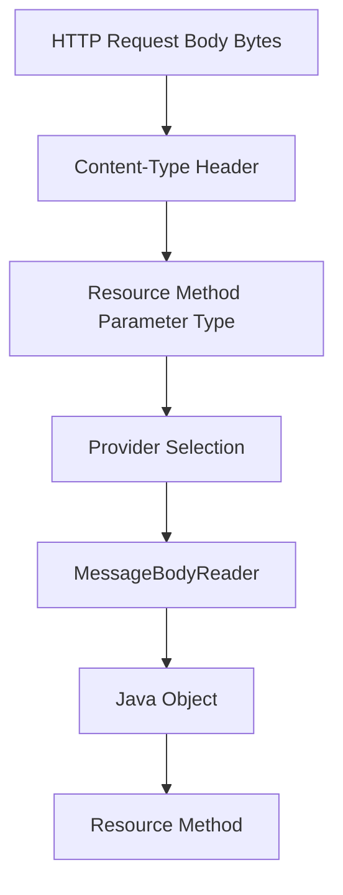
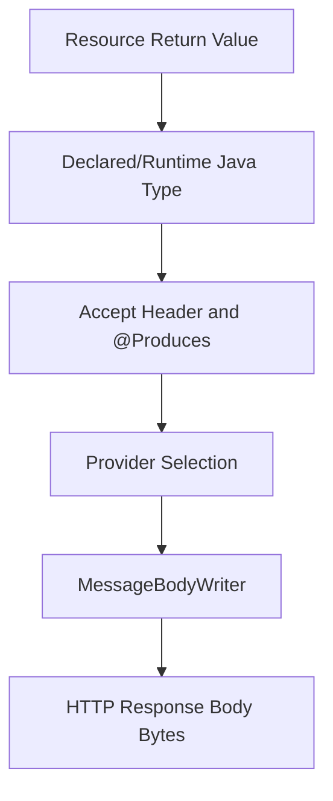

# Part 012 — Entity Providers and MessageBodyReader/Writer

> Fokus part ini: memahami bagaimana JAX-RS mengubah HTTP request body menjadi object Java, dan bagaimana object Java diubah kembali menjadi HTTP response body.

Resource method sering terlihat sederhana:

```java
@POST
@Consumes(MediaType.APPLICATION_JSON)
@Produces(MediaType.APPLICATION_JSON)
public QuoteResponse createQuote(CreateQuoteRequest request) {
  return quoteService.create(request);
}
```

Tetapi ada proses besar yang tersembunyi:

```text
HTTP JSON body -> byte stream -> MessageBodyReader -> CreateQuoteRequest
CreateQuoteResponse -> MessageBodyWriter -> byte stream -> HTTP JSON body
```

Jika proses ini gagal, resource method mungkin **tidak pernah dipanggil**.

Karena itu, senior engineer harus memahami entity provider, media type selection, serialization/deserialization behavior, dan failure mode-nya.

---

## 1. Why Entity Providers Exist

HTTP body adalah bytes.

Java method bekerja dengan objects.

JAX-RS butuh mekanisme untuk menjembatani keduanya:

```text
Inbound:
  bytes + Content-Type + target Java type
  -> Java object

Outbound:
  Java object + Accept / @Produces + selected media type
  -> bytes
```

Entity provider menjawab pertanyaan:

```text
Who knows how to read or write this representation?
```

Contoh:

| HTTP body | Java type | Provider |
|---|---|---|
| JSON | DTO object | Jackson/JSON-B provider |
| XML | JAXB object | JAXB provider |
| text/plain | `String` | String provider |
| application/octet-stream | `byte[]` / stream | binary provider |
| multipart/form-data | multipart object/parts | multipart provider |
| custom media type | custom type | custom MessageBodyReader/Writer |

---

## 2. The Entity Conversion Pipeline

Inbound request:



Outbound response:



Important consequence:

```text
Serialization/deserialization is part of the API contract.
It is not an implementation detail.
```

Changing serializer config can break clients even if resource method code does not change.

---

## 3. Standard vs Implementation-Specific Boundary

Separate the layers:

```text
Jakarta REST / JAX-RS standard:
  MessageBodyReader
  MessageBodyWriter
  @Consumes
  @Produces
  MediaType
  GenericType
  ContextResolver
  @Provider

Implementation / library-specific:
  Jackson provider
  JSON-B provider
  JAXB provider behavior
  Jersey media module
  Jersey multipart module
  object mapper customization
  JSON-B configuration

Internal CSG-specific:
  standard JSON provider
  DTO serialization convention
  date/time format
  BigDecimal format
  enum strategy
  error envelope serialization
  binary/multipart support
  backward compatibility rules
```

Do not assume Jackson unless dependency/config proves it. Do not assume JSON-B unless dependency/config proves it. Do not assume XML support exists just because JAX-RS can support XML.

---

## 4. `@Consumes` and `Content-Type`

`@Consumes` declares what request media types a resource method can consume.

```java
@POST
@Consumes(MediaType.APPLICATION_JSON)
public Response create(CreateQuoteRequest request) {
  ...
}
```

If request has:

```http
Content-Type: application/json
```

runtime tries to find a reader for:

```text
media type = application/json
target Java type = CreateQuoteRequest
```

If client sends:

```http
Content-Type: text/plain
```

and no method/provider supports it, expected failure is usually:

```text
415 Unsupported Media Type
```

### Common mistakes

- missing `Content-Type` on POST/PUT/PATCH,
- wrong `Content-Type`,
- using `application/json;charset=UTF-8` with strict/custom provider bug,
- resource method consumes JSON but client sends form data,
- multipart endpoint missing multipart provider,
- custom vendor media type not registered.

### PR review question

```text
Does @Consumes match what real clients send?
```

---

## 5. `@Produces` and `Accept`

`@Produces` declares what response media types a resource method can produce.

```java
@GET
@Produces(MediaType.APPLICATION_JSON)
public QuoteDto getQuote() {
  ...
}
```

Client can send:

```http
Accept: application/json
```

runtime tries to find a writer for:

```text
media type = application/json
Java type = QuoteDto
```

If no acceptable representation exists, expected failure is usually:

```text
406 Not Acceptable
```

### Common mistakes

- endpoint only produces JSON but client asks XML,
- `Accept: */*` hides negotiation issue in tests,
- resource method returns type that writer cannot serialize,
- provider exists locally but missing in production artifact,
- runtime chooses unexpected provider because multiple providers match.

### Senior rule

```text
Do not leave media type behavior accidental.
Declare @Consumes and @Produces explicitly on public APIs.
```

---

## 6. MessageBodyReader

`MessageBodyReader<T>` reads inbound entity bytes into Java object.

Skeleton:

```java
@Provider
@Consumes("application/vnd.example.quote+json")
public class QuoteRequestReader implements MessageBodyReader<CreateQuoteRequest> {

  @Override
  public boolean isReadable(
      Class<?> type,
      Type genericType,
      Annotation[] annotations,
      MediaType mediaType) {
    return type == CreateQuoteRequest.class;
  }

  @Override
  public CreateQuoteRequest readFrom(
      Class<CreateQuoteRequest> type,
      Type genericType,
      Annotation[] annotations,
      MediaType mediaType,
      MultivaluedMap<String, String> httpHeaders,
      InputStream entityStream) throws IOException {

    // parse entityStream into CreateQuoteRequest
    return parse(entityStream);
  }
}
```

Most services do not write custom readers for normal JSON DTOs. They rely on Jackson/JSON-B provider.

Custom reader is justified when:

- custom media type,
- legacy wire format,
- special validation/parsing required at transport boundary,
- streaming parse,
- signed/encrypted payload integration,
- non-standard binary format.

Custom reader is not justified for normal business mapping. Use DTO + service layer mapping instead.

---

## 7. MessageBodyWriter

`MessageBodyWriter<T>` writes Java object into outbound entity bytes.

Skeleton:

```java
@Provider
@Produces("application/vnd.example.quote+json")
public class QuoteResponseWriter implements MessageBodyWriter<QuoteResponse> {

  @Override
  public boolean isWriteable(
      Class<?> type,
      Type genericType,
      Annotation[] annotations,
      MediaType mediaType) {
    return type == QuoteResponse.class;
  }

  @Override
  public void writeTo(
      QuoteResponse value,
      Class<?> type,
      Type genericType,
      Annotation[] annotations,
      MediaType mediaType,
      MultivaluedMap<String, Object> httpHeaders,
      OutputStream entityStream) throws IOException {

    // serialize value into entityStream
  }
}
```

Use cases:

- custom media format,
- streaming output,
- vendor-specific representation,
- generated binary format,
- compatibility wrapper for legacy clients.

Risks:

- corrupted response,
- wrong content length,
- memory buffering,
- missing charset/encoding,
- inconsistent error serialization,
- custom behavior bypassing global ObjectMapper policy.

---

## 8. Provider Selection Mental Model

Provider selection considers roughly:

- Java type,
- generic type,
- annotations,
- media type,
- provider priority,
- runtime-specific ordering,
- registered providers,
- default providers.

Conceptually:

```text
Can this provider read/write this Java type for this media type?
```

If multiple providers match, priority/order matters.

Failure examples:

```text
No MessageBodyReader found for media type application/json and type CreateQuoteRequest
No MessageBodyWriter found for media type application/json and type QuoteResponse
```

In production, this often means:

- JSON provider missing,
- DTO not serializable,
- media type mismatch,
- generic type erased/ambiguous,
- provider not registered,
- custom provider accidentally overrides default provider,
- dependency excluded by build packaging.

---

## 9. Generic Types and Collections

This is simple:

```java
@GET
public List<QuoteDto> listQuotes() { ... }
```

But generic type matters.

At runtime, Java type erasure can make provider selection and serialization metadata tricky.

JAX-RS APIs sometimes need `GenericEntity` to preserve generic type:

```java
List<QuoteDto> quotes = service.listQuotes();
GenericEntity<List<QuoteDto>> entity = new GenericEntity<List<QuoteDto>>(quotes) {};

return Response.ok(entity).build();
```

Use this when runtime cannot infer generic response type correctly, especially with manual `Response` construction.

Bad pattern:

```java
return Response.ok(rawList).build();
```

Potential issue:

- generic element type lost,
- JSON provider serializes unexpectedly,
- OpenAPI generation loses schema,
- test passes with simple data but fails for polymorphic/nested data.

---

## 10. JSON Provider: Jackson vs JSON-B

JAX-RS can integrate with multiple JSON providers.

Common options:

- Jackson,
- JSON-B,
- MOXy in some Jersey/Jakarta contexts,
- custom provider.

Important behavior differences:

- field vs getter visibility,
- constructor requirements,
- record support,
- Java time support,
- unknown property handling,
- enum serialization,
- null inclusion,
- polymorphism,
- annotation support,
- date/time format,
- BigDecimal formatting,
- property naming strategy.

Production rule:

```text
The JSON provider is part of the API contract.
```

Changing ObjectMapper config can be a breaking change.

Examples:

```text
Enum changed from "IN_PROGRESS" to "inProgress".
Date changed from ISO-8601 string to epoch millis.
Null fields disappeared.
Unknown fields started failing.
BigDecimal started using scientific notation.
```

These can break clients without any endpoint signature change.

---

## 11. ObjectMapper / JSON Config Governance

If Jackson is used, ObjectMapper configuration matters.

Questions to verify:

- Is JavaTimeModule registered?
- Are unknown properties ignored or rejected?
- Are null fields included?
- Are dates timestamps or ISO strings?
- Are enums strings or objects?
- Is property naming snake_case or camelCase?
- Is polymorphic typing disabled or tightly controlled?
- Are sensitive fields excluded?
- Is config global or per endpoint?
- Is test ObjectMapper same as runtime ObjectMapper?

Bad pattern:

```java
ObjectMapper mapper = new ObjectMapper();
```

inside random code.

Why bad:

- bypasses platform config,
- inconsistent date/enum/null behavior,
- security modules may be missing,
- tests may not reflect production.

Better:

```text
One governed JSON configuration path.
Explicit exceptions only when justified.
```

---

## 12. XML Provider and JAXB

Some enterprise integrations still require XML.

XML concerns:

- namespaces,
- schema compatibility,
- element ordering,
- attributes vs elements,
- optional/required fields,
- JAXB annotations,
- XML security,
- large XML parsing,
- backward compatibility with legacy clients.

Security must include:

- XXE protection,
- external entity disabled,
- entity expansion protection,
- large document limits,
- schema validation strategy if used.

Do not assume XML is supported because DTO has JAXB annotations. Verify:

- provider dependency,
- `@Produces`/`@Consumes`,
- runtime registration,
- tests,
- actual client contract.

---

## 13. Binary and Stream Entities

Common Java types:

- `byte[]`,
- `InputStream`,
- `File`,
- `StreamingOutput`,
- custom stream wrapper.

Binary endpoint must control:

- `Content-Type`,
- `Content-Length` if known,
- `Content-Disposition`,
- cache headers,
- checksum,
- range request support if needed,
- timeout,
- stream closing,
- memory buffering,
- proxy/gateway limits.

Bad pattern:

```java
byte[] data = Files.readAllBytes(path);
return Response.ok(data).build();
```

This may be acceptable for tiny files but dangerous for large payloads.

Better for large files:

```java
return Response.ok((StreamingOutput) output -> {
  try (InputStream input = storage.open(objectKey)) {
    input.transferTo(output);
  }
}).type("application/octet-stream").build();
```

Streaming has its own pitfalls and will be covered more deeply in later parts, but the entity provider model starts here.

---

## 14. Form and Multipart Bodies

Simple form input:

```java
@POST
@Consumes(MediaType.APPLICATION_FORM_URLENCODED)
public Response submit(@FormParam("name") String name) {
  ...
}
```

Multipart usually requires implementation-specific support or additional module.

For Jersey, multipart support commonly involves Jersey multipart modules and provider registration.

Internal verification required:

- is multipart dependency present?
- is multipart feature registered?
- max part size?
- temp file handling?
- streaming or buffering?
- virus scanning?
- content type validation?
- filename sanitization?

Do not assume multipart works from JAX-RS core alone.

---

## 15. Error Semantics During Entity Reading

If request body cannot be read, resource method may not run.

Common inbound failure mapping:

| Failure | Likely HTTP status | Example |
|---|---:|---|
| unsupported `Content-Type` | 415 | client sends XML to JSON-only endpoint |
| malformed JSON | 400 | invalid JSON syntax |
| unreadable body | 400 | DTO cannot be constructed |
| invalid field type | 400 | string where number expected |
| body too large | 413 | payload exceeds limit |
| missing required field | 400 | validation failure after read |
| no matching resource consumes type | 415 | no method/provider match |

The exact exception class can be implementation-specific.

Senior requirement:

```text
Framework-level parse errors must map to the same stable error envelope as domain/API errors.
```

Clients should not receive random provider exception details.

---

## 16. Error Semantics During Entity Writing

Outbound serialization can fail after resource method succeeds.

Examples:

- DTO contains unserializable type,
- circular reference,
- lazy-loaded entity accessed outside session,
- date/time type unsupported,
- custom serializer throws,
- stream fails mid-response,
- client disconnects,
- output stream closed,
- writer not found.

This is dangerous because business operation may already be committed.

Example:

```text
POST /quotes
  -> resource method creates quote successfully
  -> DB transaction commits
  -> response serialization fails
  -> client receives 500 or connection reset
  -> client retries
  -> duplicate quote risk
```

Mitigation:

- idempotency key for mutation,
- serialize response DTO from stable data,
- avoid lazy entities as response body,
- test serialization path,
- explicit transaction boundary,
- structured error logging,
- duplicate-safe command handling.

---

## 17. DTO Serialization Boundary

Do not return persistence entities directly.

Bad:

```java
@GET
public QuoteEntity getQuote() {
  return repository.find(...);
}
```

Why bad:

- leaks database schema,
- lazy loading surprises,
- circular references,
- sensitive fields leak,
- persistence annotation affects API contract,
- backward compatibility becomes hard,
- entity change becomes API change.

Better:

```java
@GET
public QuoteDto getQuote() {
  Quote quote = service.getQuote(...);
  return mapper.toDto(quote);
}
```

Boundary discipline:

```text
HTTP representation != domain model != persistence entity
```

The entity provider should serialize DTOs designed for wire compatibility.

---

## 18. Backward-Compatible Serialization

Serialization compatibility rules:

Usually safe:

- adding optional response field,
- accepting unknown request field if policy allows,
- adding optional request field with default,
- adding enum value only if clients tolerate unknown enum,
- adding nullable metadata field.

Usually risky/breaking:

- renaming field,
- changing field type,
- changing date format,
- changing number precision,
- removing field,
- making optional field required,
- changing enum casing,
- changing null inclusion policy,
- changing array/object shape,
- changing error envelope.

Contract governance should catch serialization changes, not only path/method changes.

---

## 19. Date, Time, Currency, and Precision in Serialization

Enterprise CPQ/order systems are sensitive to date and money.

Serialization must define:

- timezone policy,
- `Instant` vs `OffsetDateTime` vs `LocalDate`,
- ISO-8601 format,
- effective date representation,
- validity window representation,
- currency code,
- `BigDecimal` precision,
- rounding policy,
- tax boundary representation,
- null vs absent semantics.

Example risk:

```text
price = 10.00 serialized as 10
```

Usually fine for numeric value, but may matter if client expects scale for display.

Example risk:

```text
2026-07-10T00:00:00 serialized without timezone
```

This can shift meaning across tenants/regions.

These topics get a dedicated later part, but provider/serializer config is one place where bugs originate.

---

## 20. Entity Provider and Validation Boundary

Entity provider parses representation into DTO.

Bean Validation validates DTO constraints.

Domain validation validates business invariants.

Do not mix them blindly.

```text
MessageBodyReader:
  Can the body be parsed into DTO?

Bean Validation:
  Does DTO satisfy API-level constraints?

Domain Validation:
  Is the requested business operation valid?
```

Example:

```text
"quantity": "abc"
  -> parse/type error, 400

"quantity": -5
  -> DTO validation error, 400

"quantity": 5 but product discontinued
  -> domain/business error, maybe 409/422 depending API standard
```

Do not put business rule into JSON deserializer unless absolutely required.

---

## 21. ContextResolver

JAX-RS supports `ContextResolver<T>` for providing contextual objects, often used for serializer configuration.

Conceptual example:

```java
@Provider
public class ObjectMapperResolver implements ContextResolver<ObjectMapper> {
  private final ObjectMapper mapper;

  public ObjectMapperResolver() {
    this.mapper = new ObjectMapper();
    // register modules, configure policy
  }

  @Override
  public ObjectMapper getContext(Class<?> type) {
    return mapper;
  }
}
```

This can centralize JSON behavior.

Risks:

- multiple resolvers,
- resolver not registered,
- resolver differs between test and production,
- resolver only applies to some classes/media types,
- service code creates separate mapper manually,
- dependency injection not applied to resolver as expected.

Internal verification:

- where is object mapper configured?
- is it provider-specific?
- does Jersey/Jackson module use it?
- do tests use same resolver?
- are manual mappers prohibited?

---

## 22. Provider Priority and Override Risk

Custom providers can override default providers.

This is powerful and dangerous.

Example risks:

- custom JSON writer handles too broad type,
- custom `String` writer changes text output globally,
- custom error writer affects non-error DTO,
- provider priority causes unexpected provider selection,
- multiple JSON providers compete.

Checklist:

```text
Is custom provider narrow enough?
Does isReadable/isWriteable check both type and media type?
Is @Consumes/@Produces specific?
Is @Priority intentional?
Are conflicts tested?
```

Bad provider:

```java
@Override
public boolean isWriteable(Class<?> type, Type genericType, Annotation[] annotations, MediaType mediaType) {
  return true;
}
```

This can hijack all response serialization.

---

## 23. Memory and Stream Safety

Entity providers can accidentally buffer large payloads.

Danger signs:

- `readAllBytes()` on request body,
- `ByteArrayOutputStream` for large response,
- logging full body,
- converting stream to string for metrics,
- parsing huge JSON array into memory,
- multipart buffering to heap,
- no payload size limit,
- no streaming test.

Production rule:

```text
Know where bytes are buffered.
```

Body size limits can be enforced at multiple layers:

- gateway,
- ingress,
- servlet container,
- JAX-RS filter/provider,
- application validation,
- storage service.

The limit that matters is the effective smallest/first enforced limit in the real traffic path.

---

## 24. Security Concerns in Entity Providers

Serialization/deserialization is security-sensitive.

Risks:

- polymorphic deserialization gadget risk,
- unknown field abuse,
- mass assignment,
- sensitive field output,
- XML external entity,
- path traversal in multipart filename,
- decompression bomb,
- deeply nested JSON,
- huge array/object payload,
- log injection from string fields,
- deserializer accepting alternate field names unexpectedly.

Controls:

- DTO allowlist,
- disable unsafe polymorphic typing,
- explicit field annotations where needed,
- input size/depth limits,
- XML secure parser config,
- redaction rules,
- validation after parsing,
- contract tests,
- fuzz/negative tests for public APIs.

---

## 25. Debugging 400, 406, 415, and 500 Serialization Issues

### 400 Bad Request

Ask:

- is JSON malformed?
- field type mismatch?
- required constructor missing?
- unknown field rejected?
- date format invalid?
- enum value unknown?
- validation error after parse?

### 406 Not Acceptable

Ask:

- what is `Accept` header?
- what does resource `@Produces` declare?
- is writer registered for selected media type?
- does gateway modify `Accept`?

### 415 Unsupported Media Type

Ask:

- what is `Content-Type`?
- what does resource `@Consumes` declare?
- is reader registered?
- is multipart provider active?
- is vendor media type supported?

### 500 Internal Server Error

Ask:

- did resource method return unserializable object?
- did writer throw?
- did response DTO contain circular reference?
- did lazy entity load fail?
- did mapper fail while mapping error response?
- did client disconnect mid-stream?

---

## 26. Testing Entity Conversion

Minimum tests:

- valid request body deserializes,
- malformed JSON returns standard error envelope,
- wrong `Content-Type` returns 415,
- unacceptable `Accept` returns 406,
- response DTO serializes as expected,
- date/time/currency formats are stable,
- unknown field policy is tested,
- enum compatibility is tested,
- validation errors use standard shape,
- binary/stream endpoints do not buffer unexpectedly if applicable,
- custom provider selection is tested.

For contract-critical DTOs, snapshot/golden tests can help, but do not overuse them. Prefer semantic assertions for fields, types, and compatibility rules.

---

## 27. PR Review Checklist

### Media type contract

- Are `@Consumes` and `@Produces` explicit?
- Are vendor media types intentional?
- Does OpenAPI match runtime behavior?
- Are 406/415 cases tested?

### DTO boundary

- Are persistence entities avoided?
- Is response DTO stable?
- Are sensitive fields excluded?
- Is backward compatibility preserved?

### JSON/XML behavior

- Which provider is active?
- Is ObjectMapper/JSON-B config governed?
- Are date/time/enum/null conventions followed?
- Is XML secure if XML is enabled?

### Custom provider

- Is custom provider necessary?
- Is matching narrow?
- Is priority intentional?
- Are conflicts tested?
- Does it avoid buffering large payloads?

### Error behavior

- Are parse errors mapped consistently?
- Are serialization errors observable?
- Is error response itself serializable?
- Are sensitive exception details hidden?

### Performance and memory

- Does code call `readAllBytes()`?
- Are large arrays streamed or paginated?
- Are multipart/temp files controlled?
- Are body logs disabled/redacted/sampled?

### Security

- Is polymorphic deserialization safe?
- Are unknown fields handled according to policy?
- Are XML attacks mitigated?
- Are file names sanitized?
- Are payload size/depth limits enforced?

---

## 28. Internal Verification Checklist

For internal CSG Quote & Order codebase, verify:

### Provider stack

- Is JSON handled by Jackson, JSON-B, MOXy, or another provider?
- Is XML supported?
- Is multipart supported?
- Are custom `MessageBodyReader`/`MessageBodyWriter` implementations present?
- Are `ContextResolver` implementations present?
- Are provider registrations explicit or scanning-based?

### JSON configuration

- Where is ObjectMapper/JSON-B config defined?
- Is Java time configured?
- What is enum strategy?
- What is null inclusion policy?
- What is unknown field policy?
- Is property naming camelCase/snake_case/custom?
- Are manual object mappers allowed?

### Contract governance

- Does OpenAPI reflect DTO serialization?
- Are generated clients based on current contract?
- Is compatibility checked in CI?
- Are error DTOs part of the contract?
- Are date/time/currency formats documented?

### Error behavior

- What happens on malformed JSON?
- What happens on wrong `Content-Type`?
- What happens on unsupported `Accept`?
- What happens when response serialization fails?
- Are framework parse errors mapped to standard envelope?

### Binary/multipart

- Are file upload/download endpoints present?
- What max body size applies at gateway/container/app?
- Are streams buffered?
- Where are temp files stored?
- Is scanning required?
- Are filenames sanitized?

### Security

- Is unsafe polymorphic deserialization disabled?
- Is XML parser hardened?
- Are sensitive fields redacted/excluded?
- Are payload limits enforced?
- Are DTOs protected from mass assignment?

### Observability

- Are serialization failures logged with correlation ID?
- Are 400/406/415 metrics separated?
- Are large payload failures visible?
- Are client disconnects distinguishable from server serialization errors?

---

## 29. Senior Mental Model

Entity providers are the translation layer between wire contract and Java object model.

A senior engineer should be able to answer:

```text
Inbound:
  What Content-Type did the client send?
  Which resource method matched?
  Which Java type is expected?
  Which MessageBodyReader read the body?
  What happens if parsing fails?

Outbound:
  What Java type is returned?
  What media type is selected?
  Which MessageBodyWriter writes it?
  What happens if serialization fails?

Governance:
  Which JSON/XML config is active?
  Is this behavior standard JAX-RS, Jersey-specific, or internal?
  Does OpenAPI/contract match runtime behavior?
  Is the DTO boundary stable?
```

The hidden danger is that serialization behavior often changes indirectly through dependency upgrades, provider registration, DTO refactor, mapper config, or build packaging.

Therefore, treat entity conversion as production-critical API infrastructure.

---

## 30. Key Takeaways

- HTTP body is bytes; resource methods need Java objects.
- `MessageBodyReader` handles inbound conversion.
- `MessageBodyWriter` handles outbound conversion.
- `@Consumes` and `Content-Type` drive inbound media type selection.
- `@Produces` and `Accept` drive outbound media type selection.
- JSON provider configuration is part of the public API contract.
- DTO/domain/entity boundaries protect compatibility and security.
- Serialization can fail after business state has changed.
- Custom providers must be narrow, tested, and justified.
- Large bodies require memory/stream discipline.
- In internal CSG codebase, verify the actual provider stack before assuming Jackson, JSON-B, XML, or multipart behavior.

