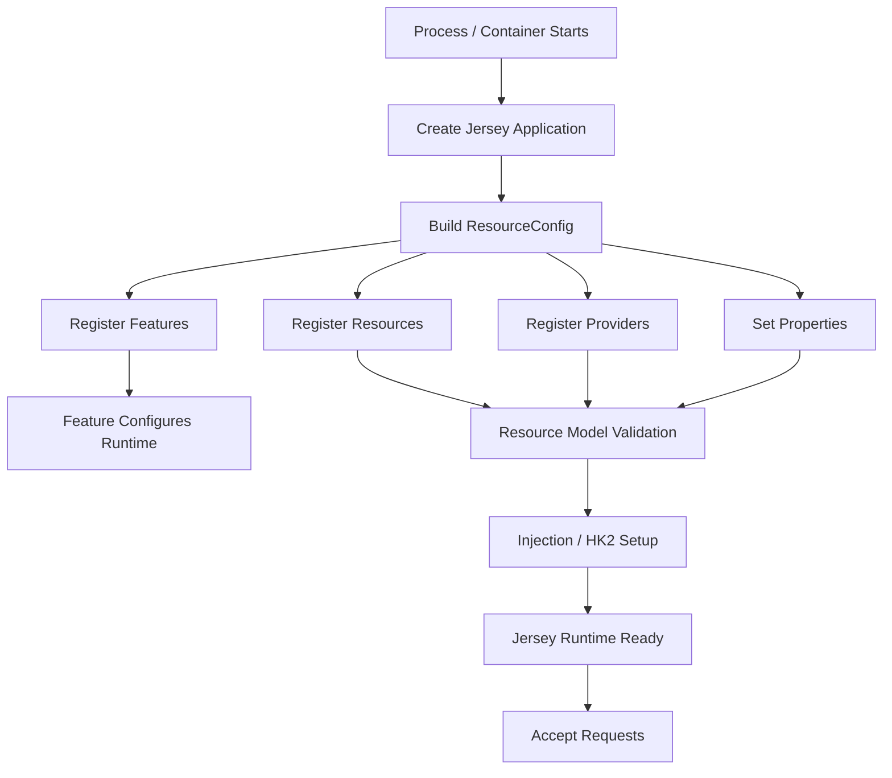
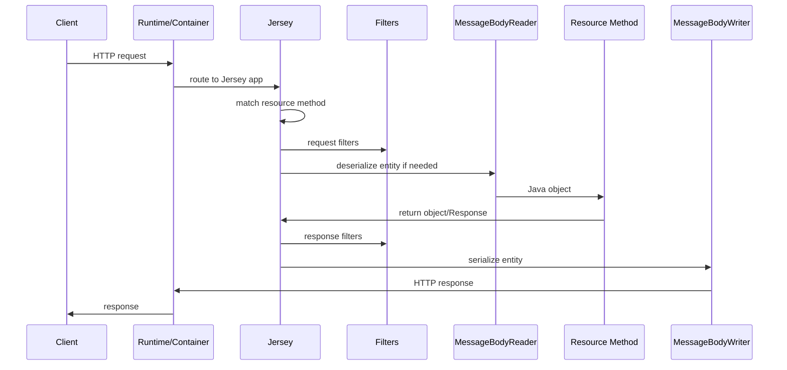
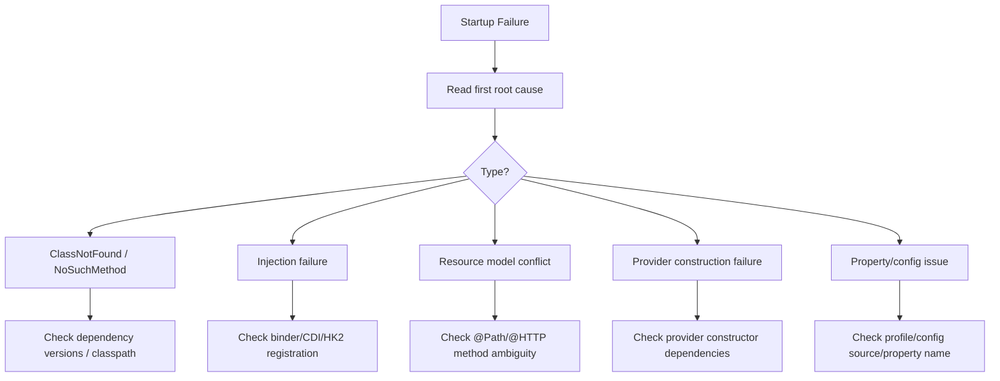

# Part 014 — Jersey Lifecycle, Features, and Properties

> Fokus part ini: memahami bagaimana Jersey membangun runtime JAX-RS dari konfigurasi, resource, provider, feature, binder, dan properties sampai service siap menerima request.

Part sebelumnya membedakan **Jakarta REST standard** dari **Jersey-specific implementation**.

Part ini masuk lebih dalam ke Jersey sebagai runtime:

```text
How does Jersey start?
How does it discover resources and providers?
How does ResourceConfig affect runtime behavior?
How do features and properties change the pipeline?
Why do some failures happen at startup, not request time?
```

Jersey sering terlihat sederhana karena resource class hanya memakai annotation standar:

```java
@Path("/quotes")
public class QuoteResource {
  @GET
  public Response list() {
    return Response.ok().build();
  }
}
```

Tetapi resource itu hanya aktif jika Jersey runtime berhasil membangun application model yang benar.

---

## 1. Jersey Runtime Mental Model

Jersey startup dapat dipahami sebagai proses membangun model aplikasi.



The key idea:

```text
Jersey turns code + configuration + classpath into a runtime resource model.
```

A resource method is not “live” just because the class exists.

It must be:

- discoverable,
- registered,
- valid,
- injectable,
- compatible with providers,
- reachable from container path/context,
- not blocked by startup errors.

---

## 2. Startup vs Request-Time Failure

Some failures happen before the service accepts traffic.

Examples:

```text
Startup-time failures:
  invalid resource model
  duplicate conflicting resource methods
  missing injection binding
  broken provider construction
  invalid feature registration
  classpath conflict

Request-time failures:
  no matching endpoint
  unsupported media type
  serialization failure
  auth rejection
  exception mapper behavior
  downstream timeout
```

Why this matters:

```text
If a bug is startup-time, adding request logging will not help.
If a bug is request-time, staring at bootstrap code may not help.
```

Senior debugging starts by classifying failure timing.

---

## 3. `ResourceConfig` as Jersey Application Assembly

`ResourceConfig` is Jersey-specific and commonly used to assemble the application.

Example:

```java
import org.glassfish.jersey.server.ResourceConfig;

public class QuoteApplication extends ResourceConfig {
  public QuoteApplication() {
    packages("com.example.quote.api");
    register(QuoteExceptionMapper.class);
    register(CorrelationIdFilter.class);
    property("jersey.config.server.tracing", "OFF");
  }
}
```

This class answers:

```text
Which resources exist?
Which providers exist?
Which features are enabled?
Which runtime properties are set?
Which packages are scanned?
Which binders provide dependencies?
```

In a production codebase, `ResourceConfig` is one of the first files to find.

It is often the actual application composition root for the HTTP layer.

---

## 4. Common Jersey Bootstrap Patterns

### Pattern 1: ResourceConfig subclass

```java
public class ApiApplication extends ResourceConfig {
  public ApiApplication() {
    packages("com.company.api");
    register(ApiExceptionMapper.class);
  }
}
```

Good when:

- HTTP layer composition is explicit,
- features/providers are visible,
- startup behavior is easy to audit.

Risk:

- too much hidden package scanning,
- multiple config classes,
- environment-specific branches inside constructor.

### Pattern 2: Standard `Application` with Jersey underneath

```java
@ApplicationPath("/api")
public class ApiApplication extends Application {
}
```

Good when:

- runtime/container handles discovery clearly,
- application is simple,
- portability matters.

Risk:

- provider/resource discovery becomes implicit,
- Jersey-specific behavior may be configured elsewhere.

### Pattern 3: Servlet registration

```java
public class ApiInitializer extends ServletContainerInitializerLikeThing {
  // platform-specific or servlet-specific registration
}
```

Actual code varies by runtime.

Good when:

- deployment is servlet-container oriented,
- integration with existing servlet filters is needed.

Risk:

- context path and servlet mapping bugs,
- split configuration between servlet layer and Jersey layer.

### Pattern 4: Embedded server bootstrap

```java
public final class Main {
  public static void main(String[] args) {
    ResourceConfig config = new ResourceConfig()
        .packages("com.company.api")
        .register(ApiExceptionMapper.class);

    // start embedded HTTP server with config
  }
}
```

Good when:

- service owns the process lifecycle,
- executable jar/container model is desired.

Risk:

- app must own shutdown, thread pools, ports, health, metrics, TLS/gateway assumptions.

---

## 5. Resource Registration

Jersey needs resources to be registered.

Common registration mechanisms:

```java
packages("com.example.quote.api");
```

```java
register(QuoteResource.class);
```

```java
register(new QuoteResource(...)); // less common, lifecycle implications
```

Registration style trade-off:

| Style | Benefit | Risk |
|---|---|---|
| Package scanning | less boilerplate | hidden registration, accidental inclusion |
| Explicit class registration | auditability | more boilerplate |
| Instance registration | full manual control | lifecycle/injection bypass risk |
| Mixed style | flexible | harder to reason about |

Senior preference:

```text
Critical resources and providers should be discoverable by reading a small number of composition files.
```

If onboarding requires grep archaeology to know which resource is active, runtime assembly is too implicit.

---

## 6. Provider Registration

Providers include:

- exception mappers,
- filters,
- interceptors,
- message body readers/writers,
- context resolvers,
- parameter converters,
- dynamic features.

Example:

```java
register(GlobalExceptionMapper.class);
register(ValidationExceptionMapper.class);
register(CorrelationIdRequestFilter.class);
register(SecurityRequestFilter.class);
register(ObjectMapperProvider.class);
```

Provider registration is dangerous when unclear because providers affect every endpoint.

A new provider can change:

- authentication behavior,
- error envelope,
- JSON serialization,
- logging volume,
- tracing behavior,
- CORS/security headers,
- response status mapping,
- request cancellation behavior.

PR review question:

```text
Is this provider local, global, ordered, and tested against representative endpoints?
```

---

## 7. Feature Registration

A feature configures the runtime by registering more components or setting properties.

Standard interface:

```java
import jakarta.ws.rs.core.Feature;
import jakarta.ws.rs.core.FeatureContext;

public class ObservabilityFeature implements Feature {
  @Override
  public boolean configure(FeatureContext context) {
    context.register(CorrelationIdRequestFilter.class);
    context.register(CorrelationIdResponseFilter.class);
    return true;
  }
}
```

Registration:

```java
register(ObservabilityFeature.class);
```

Jersey/library features might include JSON, multipart, logging, or other modules.

Example:

```java
register(JacksonFeature.class);
register(MultiPartFeature.class);
register(LoggingFeature.class);
```

A feature is useful because it bundles a coherent capability:

```text
Capability: JSON support
  -> register provider(s)
  -> configure mapper(s)
  -> expose property hooks

Capability: observability
  -> register filters
  -> configure MDC/tracing
  -> configure request/response metadata

Capability: validation
  -> register validation support
  -> register exception mapper
```

But features can also hide behavior.

Senior rule:

```text
Feature names must reveal operational consequence.
```

Bad:

```java
register(CommonFeature.class);
```

Better:

```java
register(StructuredLoggingFeature.class);
register(ApiErrorMappingFeature.class);
register(JsonSerializationFeature.class);
```

---

## 8. Jersey Properties

Jersey behavior can be changed with properties.

Example style:

```java
property("jersey.config.server.tracing", "OFF");
property("jersey.config.disableAutoDiscovery", true);
```

Some properties are Jersey-defined. Some may be standard-ish configuration concepts exposed through Jersey. Some may be internal application properties accidentally mixed into `ResourceConfig`.

Do not rely on property names from memory. Verify against the actual Jersey version in the codebase.

Property concerns:

- resource scanning,
- provider discovery,
- tracing/debugging,
- bean validation integration,
- WADL/OpenAPI-related behavior if present,
- response error behavior,
- entity buffering,
- JSON/media provider behavior,
- server/client common behavior.

A property can change behavior globally.

Example risk:

```text
Disabling auto-discovery may remove JSON provider registration.
Changing tracing property may leak sensitive data in logs.
Changing validation behavior may change error response shape.
Changing response error behavior may alter gateway/client interpretation.
```

PR review question:

```text
Is this property scoped, documented, version-compatible, tested, and safe for production?
```

---

## 9. Auto-Discovery

Jersey can discover some components automatically depending on classpath and configuration.

Auto-discovery can be convenient.

It can also be dangerous because runtime behavior changes when dependencies change.

Example:

```text
Add dependency -> new provider discovered -> response serialization changes
Remove dependency -> provider disappears -> 415/500 at runtime
Disable auto-discovery -> feature no longer active -> endpoint breaks
```

Senior stance:

```text
Auto-discovery is acceptable only when the team understands and tests it.
```

For critical behavior, prefer explicitness:

```java
register(JacksonFeature.class);
register(GlobalExceptionMapper.class);
register(SecurityFilter.class);
```

Critical behavior should not depend on accidental classpath presence.

---

## 10. Package Scanning Boundaries

Package scanning is common:

```java
packages("com.company.quote.api");
```

Potential issues:

- scans too little: resource/provider not active,
- scans too much: test/debug/internal resource exposed,
- scans wrong package after refactor,
- scans multiple package roots with conflicting providers,
- scanning behavior differs between test and production.

Good package scanning has explicit boundaries:

```text
com.company.quote.api.resources
com.company.quote.api.providers
com.company.quote.api.filters
```

Avoid scanning large roots unless intentional:

```text
com.company
```

Why:

```text
Large root scanning converts package structure into runtime behavior.
```

That makes refactor risky.

---

## 11. Provider Ordering and Priority

JAX-RS supports priority concepts for filters/interceptors/providers.

When multiple providers can apply, order matters.

Examples:

```java
@Priority(Priorities.AUTHENTICATION)
public class AuthenticationFilter implements ContainerRequestFilter {
  ...
}
```

```java
@Priority(Priorities.AUTHORIZATION)
public class AuthorizationFilter implements ContainerRequestFilter {
  ...
}
```

Ordering concerns:

```text
Correlation ID should exist before logging.
Authentication should run before authorization.
Tenant resolution may need identity and headers.
Request body logging must not consume stream before entity provider.
Exception mapping should not hide security failures.
```

If ordering is implicit, bugs are subtle.

PR review question:

```text
What must run before this provider, and what must run after it?
```

---

## 12. HK2 Binding During Jersey Startup

Jersey commonly uses HK2 for injection.

Binding example:

```java
public class QuoteBinder extends AbstractBinder {
  @Override
  protected void configure() {
    bind(QuoteServiceImpl.class).to(QuoteService.class);
    bind(PricingClientImpl.class).to(PricingClient.class);
  }
}
```

Registered in `ResourceConfig`:

```java
register(new QuoteBinder());
```

Startup may fail if:

- dependency is not bound,
- multiple bindings conflict,
- constructor dependencies cannot be resolved,
- scope is invalid,
- provider/resource requires dependency too early,
- CDI/HK2 integration is incomplete.

Key question:

```text
Is the dependency graph validated at startup or does it fail on first request?
```

Fail-fast startup is generally preferable.

Late injection failure in production request path is harder to diagnose.

---

## 13. Resource Model Validation

During startup, Jersey builds a resource model from annotated classes.

It validates things like:

- invalid method signature,
- conflicting paths,
- ambiguous HTTP methods,
- invalid parameter annotations,
- unsupported entity parameter patterns,
- duplicate provider conflicts,
- missing dependencies for some managed objects.

Example conflict:

```java
@Path("/quotes")
public class QuoteResource {
  @GET
  @Path("/{id}")
  public Response getById(@PathParam("id") String id) { ... }

  @GET
  @Path("/{quoteId}")
  public Response getByQuoteId(@PathParam("quoteId") String quoteId) { ... }
}
```

These two may be ambiguous because both match the same path shape.

Better:

```java
@GET
@Path("/{quoteId}")
public Response getByQuoteId(@PathParam("quoteId") String quoteId) { ... }
```

Single canonical route, one semantic name.

---

## 14. Startup Logging

A production-grade Jersey service should make startup understandable.

Useful startup information:

- application class,
- runtime/container type,
- base URI/path,
- registered feature list,
- registered critical providers,
- active profiles/config sources,
- sanitized important properties,
- JSON provider selected,
- validation enabled/disabled,
- health/metrics endpoints,
- version/build metadata.

Avoid logging:

- secrets,
- tokens,
- database passwords,
- private keys,
- full environment dumps,
- tenant/customer sensitive config.

A good startup log answers:

```text
What runtime did we build?
What configuration did we intend?
What critical components are active?
```

It should not require remote debugging.

---

## 15. Jersey Lifecycle During Request Handling

After startup, a request passes through a runtime model roughly like this:



But this runtime path exists only after startup successfully built:

- resource model,
- provider registry,
- injection graph,
- configuration set,
- container mapping.

That is why bootstrap matters.

---

## 16. Configuration Smells

Watch for these smells in `ResourceConfig` or bootstrap code.

### Smell 1: Environment-specific branching everywhere

```java
if (env.equals("prod")) {
  register(ProdFeature.class);
} else {
  register(LocalDebugFeature.class);
}
```

Sometimes necessary, but risky.

Better:

```text
Environment chooses configuration values.
Application composition stays structurally similar.
```

### Smell 2: Scanning huge package roots

```java
packages("com.company");
```

Risk:

```text
Unexpected resources/providers become active.
```

### Smell 3: Critical provider hidden in generic feature

```java
register(CommonFeature.class);
```

Risk:

```text
Auth/logging/error mapping behavior not visible from composition root.
```

### Smell 4: Object mapper configured in multiple places

```text
JacksonFeature + ContextResolver + custom provider + test mapper
```

Risk:

```text
Serialization differs across endpoint/test/runtime.
```

### Smell 5: Test runtime config differs from production

```text
Production uses package scanning.
Test registers resource manually.
Production uses HK2.
Test constructs resource with mocks manually.
```

Risk:

```text
Tests pass while production injection/provider behavior fails.
```

---

## 17. Debugging Startup Failures

When Jersey startup fails, use a disciplined flow.



Rules:

1. Read the first meaningful cause, not the last wrapper exception.
2. Check what changed in dependency graph.
3. Check new/modified resource annotations.
4. Check provider/feature/binder registration.
5. Compare test and production bootstrap.
6. Check whether classpath changed due to transitive dependency.

---

## 18. Debugging Missing Endpoint

Symptom:

```text
Expected endpoint returns 404.
```

Check by layer:

### Container/platform

- Did request reach the process/pod?
- Is gateway path rewriting correctly?
- Is context path correct?
- Is servlet mapping correct?
- Is base URI correct?

### Jersey bootstrap

- Is resource package scanned?
- Is resource class registered?
- Is application class loaded?
- Did startup log show the expected app?

### Resource model

- Does class have `@Path`?
- Does method have HTTP method annotation?
- Do class and method paths combine as expected?
- Are regex/path variables too broad or too narrow?

### Media/method

- Is client using correct HTTP method?
- Does `Accept` cause 406 instead of 404?
- Does `Content-Type` cause 415 before method invocation?

Senior habit:

```text
Do not change the resource path until you know which layer failed.
```

---

## 19. Debugging Provider Not Applied

Symptom examples:

```text
Exception mapper not used.
Correlation ID missing.
JSON date format wrong.
Security filter not executing.
CORS header absent.
```

Check:

- provider has `@Provider` if scanning-based,
- provider is explicitly registered if explicit config is used,
- package scanning includes provider package,
- provider priority/order,
- provider type matches expected exception/entity/filter stage,
- feature that should register provider is active,
- auto-discovery is enabled/disabled as expected,
- tests use same registration path.

Common issue:

```text
Provider class exists in source tree but is not part of runtime registry.
```

Code existence does not equal runtime registration.

---

## 20. Debugging Serialization Provider Choice

Symptoms:

- JSON fields missing,
- date format changed,
- enum serialized differently,
- `BigDecimal` precision issue,
- unknown fields rejected/accepted unexpectedly,
- XML provider used unexpectedly,
- 500 on response serialization,
- 415 on request body.

Check:

- active media dependency,
- feature registration,
- custom `ContextResolver`,
- object mapper bean/provider,
- provider priority,
- `@Consumes`/`@Produces`,
- client `Accept`/`Content-Type`,
- test runtime config.

In enterprise APIs, serializer config is contract config.

Changing it requires compatibility review.

---

## 21. Production Properties Discipline

Jersey properties should be treated like production behavior controls.

Recommended internal discipline:

| Property type | Review required? | Why |
|---|---:|---|
| tracing/debug | yes | may leak data or increase cost |
| provider discovery | yes | changes active runtime components |
| validation | yes | changes error response behavior |
| serialization | yes | changes API contract |
| buffering/entity size | yes | memory and latency impact |
| response error behavior | yes | gateway/client compatibility |

For every non-obvious Jersey property, document:

```text
property name
expected value per environment
reason
runtime impact
failure mode
owner
how to test
```

---

## 22. Internal Verification Checklist

### Application assembly

- Where is `ResourceConfig` defined?
- Is there more than one application class?
- Is there a standard `Application` subclass?
- Is application path defined by annotation, servlet mapping, config, gateway, or combination?
- Are resources registered explicitly or by scanning?
- Are providers registered explicitly or by scanning?
- Are features registered explicitly?

### Jersey version and modules

- Which Jersey version is used?
- Is version inherited from parent/BOM?
- Which Jersey container module is used?
- Which JSON/media modules are present?
- Is `jersey-hk2` present?
- Is CDI integration present?
- Are multiple conflicting media providers present?

### Properties

- Which Jersey properties are set?
- Where are they set?
- Are property names valid for the Jersey version?
- Are environment overrides possible?
- Are production and test properties aligned?
- Are dangerous debug/tracing properties disabled in production?

### Discovery

- Is auto-discovery enabled?
- Is package scanning used?
- What package roots are scanned?
- Are critical providers explicitly registered?
- Could transitive dependencies alter discovered providers?

### DI and lifecycle

- Are HK2 binders registered?
- Are CDI beans active?
- Is injection fail-fast?
- Are resource/provider scopes clear?
- Are singleton providers stateless/thread-safe?

### Observability

- Do startup logs show application class and runtime?
- Do logs show critical provider/feature activation?
- Is there a way to confirm routes/resources in non-prod?
- Are startup failures alerted?
- Are config values logged safely?

---

## 23. PR Review Checklist

When reviewing Jersey lifecycle/config changes, ask:

### Scope

- Is this standard JAX-RS, Jersey-specific, container-specific, or internal platform-specific?
- Is Jersey-specific usage intentional and documented?

### Registration

- What new resources/providers/features are registered?
- Is registration explicit or scanning-based?
- Could this accidentally expose internal/test endpoints?
- Could it change all endpoints globally?

### Properties

- What properties changed?
- Are they valid for the runtime version?
- What is the production impact?
- Could this change serialization, validation, or provider discovery?

### DI

- Are new dependencies bound correctly?
- Does startup fail fast if binding is wrong?
- Are scopes safe?
- Do tests use production-like injection?

### Testing

- Is there a startup/integration test that boots real Jersey config?
- Are endpoint tests using real provider/filter config?
- Is serialization tested with the actual runtime provider?
- Is failure behavior tested?

### Operations

- If startup fails, will logs identify the cause?
- If provider behavior changes, will dashboard/logs reveal it?
- Is rollback safe?

---

## 24. Example Production-Grade ResourceConfig Skeleton

This is illustrative, not a claim about any internal CSG codebase.

```java
public final class QuoteApiApplication extends ResourceConfig {

  public QuoteApiApplication(AppConfig config) {
    // Resource boundary
    packages("com.example.quote.api.resources");

    // Explicit critical providers
    register(ApiExceptionMapper.class);
    register(ValidationExceptionMapper.class);
    register(CorrelationIdFilter.class);
    register(SecurityContextFilter.class);

    // Serialization and media support
    register(JsonFeature.class);

    // Dependency injection
    register(new QuoteApiBinder(config));

    // Properties
    property("jersey.config.disableAutoDiscovery", Boolean.TRUE);
  }
}
```

Design intent:

```text
Critical behavior is visible.
Scanning boundary is narrow.
Configuration is injected once.
Properties are explicit.
DI binding is centralized.
```

Real code may differ, but the review principles stay useful.

---

## 25. Senior Mental Model

Jersey lifecycle is about building and validating the runtime graph.

```text
Source code is not the runtime.
Classpath is not the runtime.
ResourceConfig is not the whole runtime.
Deployment config is not the whole runtime.

Runtime behavior emerges from all of them together.
```

The senior engineer’s job is to make that emergence understandable, testable, and observable.

---

## 26. Key Takeaways

- Jersey builds a runtime resource model at startup.
- `ResourceConfig` is a Jersey-specific application composition mechanism.
- Resource/provider existence in source code does not mean it is active at runtime.
- Feature registration can add hidden global behavior.
- Jersey properties can change production behavior significantly.
- Auto-discovery and package scanning are convenient but can obscure runtime assembly.
- Provider ordering matters for auth, logging, tracing, validation, and error handling.
- HK2/CDI injection failures often appear during startup or first request depending on configuration.
- Startup logs should reveal critical runtime components without leaking secrets.
- Always verify actual runtime behavior from code, config, dependency tree, deployment artifact, and logs.

