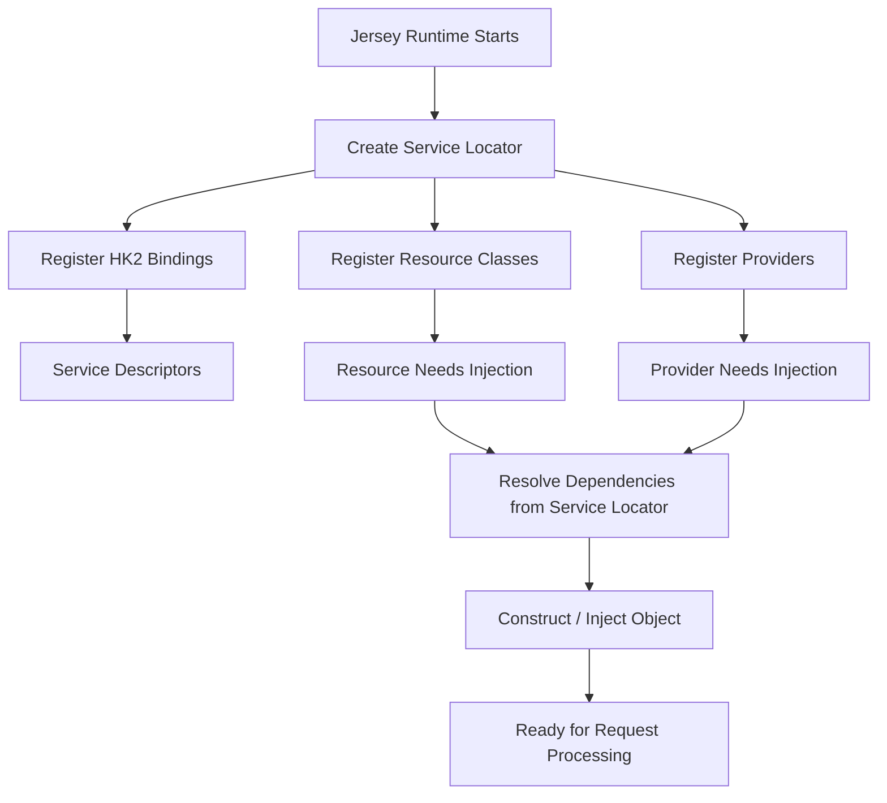
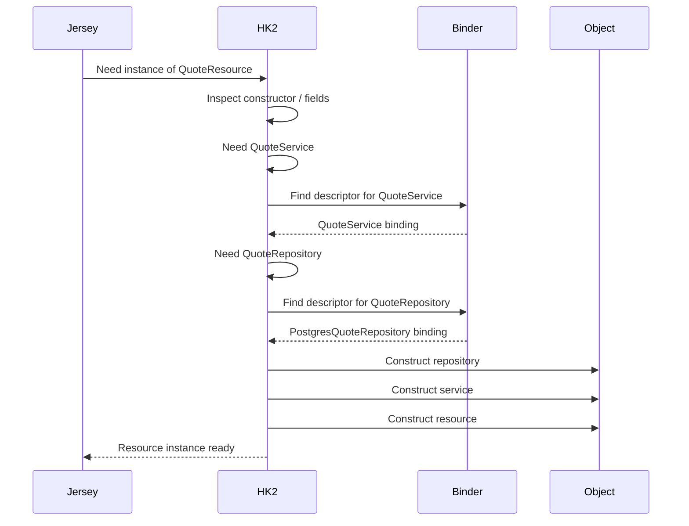

# Part 015 — HK2 Service Locator and Injection Model

> Fokus part ini: memahami **HK2** sebagai dependency injection mechanism yang sering muncul di ekosistem Jersey, terutama saat aplikasi JAX-RS tidak memakai full CDI container.

Part sebelumnya membahas lifecycle Jersey: bagaimana `ResourceConfig`, resources, providers, features, binders, dan properties membentuk runtime JAX-RS.

Part ini masuk ke dependency injection layer yang sering tersembunyi di bawah Jersey.

Pertanyaan utamanya:

```text
Who creates resource objects?
Who injects dependencies into resources/providers?
Where are services registered?
Why does injection fail at startup or request time?
What is HK2, and how is it different from CDI?
```

Catatan penting:

```text
HK2 is implementation-specific.
It is not the Jakarta REST standard.
It is commonly associated with Jersey.
```

Untuk konteks CSG Quote & Order, jangan berasumsi HK2 pasti dipakai. Verifikasi dari dependency, imports, binders, dan runtime startup logs.

---

## 1. Mental Model: DI as Runtime Object Graph Assembly

Di Java murni, dependency biasanya dibuat manual:

```java
QuoteRepository repository = new QuoteRepository(dataSource);
QuoteService service = new QuoteService(repository);
QuoteResource resource = new QuoteResource(service);
```

Dalam JAX-RS runtime, resource class sering tidak dibuat manual oleh developer.

Contoh:

```java
@Path("/quotes")
public class QuoteResource {
  private final QuoteService quoteService;

  @Inject
  public QuoteResource(QuoteService quoteService) {
    this.quoteService = quoteService;
  }
}
```

Pertanyaannya:

```text
Who calls the constructor?
Who knows what QuoteService is?
Who knows whether QuoteService is singleton or per-request?
Who validates that dependencies are available?
```

Jawabannya bergantung pada DI container.

Dalam Jersey/HK2 world:

```text
HK2 maintains a service registry and resolves dependencies from that registry.
```

Diagram sederhana:



The key idea:

```text
DI converts a set of class definitions into a runtime object graph.
```

The object graph has lifecycle, scope, ownership, and failure modes.

---

## 2. What HK2 Is in Practical Terms

HK2 is a dependency injection and service locator framework used by Jersey internally and often exposed through Jersey integration points.

From a practical codebase-reading perspective, HK2 usually appears through imports like:

```java
org.glassfish.hk2.utilities.binding.AbstractBinder
org.glassfish.hk2.api.Factory
org.glassfish.hk2.api.ServiceLocator
org.jvnet.hk2.annotations.Service
```

Common Jersey/HK2 registration shape:

```java
public class ApiApplication extends ResourceConfig {
  public ApiApplication() {
    register(new AbstractBinder() {
      @Override
      protected void configure() {
        bind(QuoteService.class).to(QuoteService.class);
        bind(PostgresQuoteRepository.class).to(QuoteRepository.class);
      }
    });
  }
}
```

This says:

```text
When runtime needs QuoteRepository, provide PostgresQuoteRepository.
When runtime needs QuoteService, provide QuoteService.
```

HK2 can resolve concrete types, interfaces, factories, named bindings, and scopes depending on how the binding is defined.

---

## 3. Service Locator vs Dependency Injection

The phrase **service locator** can mean two things.

### 3.1 Service locator as runtime infrastructure

HK2 internally uses a service locator to find descriptors and create objects.

That is normal for HK2.

```text
Jersey asks the HK2 service locator to resolve dependency X.
```

### 3.2 Service locator as application anti-pattern

Application code can also manually ask a locator for services:

```java
QuoteService service = serviceLocator.getService(QuoteService.class);
```

This is usually worse than constructor injection because dependencies become hidden.

Bad consequence:

```text
The class looks dependency-free from its constructor,
but it secretly pulls runtime dependencies from a global registry.
```

Senior review rule:

```text
Using a service locator internally is fine for a DI framework.
Using it directly in business code should be treated as a design smell unless strongly justified.
```

---

## 4. HK2 Binding Model

HK2 bindings describe how contracts map to implementations.

### 4.1 Bind concrete class to itself

```java
bind(QuoteService.class).to(QuoteService.class);
```

Meaning:

```text
QuoteService can be injected as QuoteService.
```

Useful when no interface is needed.

Risk:

```text
Test replacement and alternate implementation become harder if everything injects concrete classes.
```

### 4.2 Bind implementation to interface

```java
bind(PostgresQuoteRepository.class).to(QuoteRepository.class);
```

Meaning:

```text
When code asks for QuoteRepository, provide PostgresQuoteRepository.
```

This is common for repository, external client, policy engine, pricing adapter, catalog adapter, and event publisher boundaries.

### 4.3 Bind instance

```java
bind(existingDataSource).to(DataSource.class);
```

Meaning:

```text
Use this already-created object.
```

Good for externally created runtime objects.

Risk:

```text
Who owns lifecycle and shutdown?
```

If a `DataSource`, Kafka producer, HTTP client, or scheduler is bound as an instance, verify who closes it.

### 4.4 Bind factory

```java
bindFactory(DataSourceFactory.class).to(DataSource.class);
```

Meaning:

```text
Use a factory to create the object.
```

Useful when creation needs configuration, secrets, cloud credentials, or lifecycle hooks.

Risk:

```text
Factories can hide expensive startup work or unstable network calls.
```

---

## 5. Factory Pattern in HK2

A factory separates object construction from object usage.

Simplified example:

```java
public class QuoteServiceFactory implements Factory<QuoteService> {
  @Inject
  private QuoteRepository repository;

  @Override
  public QuoteService provide() {
    return new QuoteService(repository);
  }

  @Override
  public void dispose(QuoteService instance) {
    // cleanup if needed
  }
}
```

Binding:

```java
bindFactory(QuoteServiceFactory.class)
    .to(QuoteService.class);
```

Use a factory when:

- object creation is non-trivial,
- configuration is required,
- lifecycle must be controlled,
- expensive resources need explicit creation,
- test replacement matters.

Do not use a factory to hide arbitrary business branching.

Factory code should answer:

```text
What is created?
From which config?
With which lifecycle?
What happens on failure?
Who disposes it?
```

---

## 6. Constructor Injection vs Field Injection

Constructor injection:

```java
public class QuoteResource {
  private final QuoteService service;

  @Inject
  public QuoteResource(QuoteService service) {
    this.service = service;
  }
}
```

Benefits:

- dependencies are explicit,
- fields can be `final`,
- object cannot be half-initialized,
- tests are simpler,
- missing dependency is easier to see.

Field injection:

```java
public class QuoteResource {
  @Inject
  private QuoteService service;
}
```

Risks:

- dependencies are less visible,
- object can look constructible without container,
- tests need reflection/container or setter workaround,
- mutable field cannot be `final`.

Production-oriented rule:

```text
Prefer constructor injection for application code.
Accept field injection mostly for framework-managed legacy code or where the runtime pattern requires it.
```

Internal verification:

```text
Search for @Inject fields.
Search for constructors with @Inject.
Search for no-arg resources with injected mutable fields.
```

---

## 7. Scope Model

Scope controls object lifetime.

Common conceptual scopes:

```text
Singleton scope:
  one instance shared across many requests

Request scope:
  one instance per HTTP request

Per-lookup / default-like scope:
  new or resolved instance per injection/lookup depending on binding behavior
```

The exact default behavior depends on HK2/Jersey configuration and binding style, so verify in code/runtime.

### Singleton danger

A singleton is safe when it is:

- stateless,
- immutable after construction,
- thread-safe,
- managing a thread-safe dependency.

A singleton is dangerous when it stores request state:

```java
public class QuoteService {
  private String currentTenantId; // dangerous if singleton
}
```

This can cause cross-request and cross-tenant data leaks.

### Request scope danger

Request scope is useful for request-specific objects.

But request scope is dangerous when leaked outside the request:

```text
Request-scoped object captured by async task
Request-scoped security context used after request completion
Request-scoped entity manager stored in singleton
```

Senior rule:

```text
Scope is not just performance configuration.
Scope is a correctness boundary.
```

---

## 8. Injection Resolution Lifecycle

When Jersey/HK2 needs to create a resource/provider, resolution roughly follows this shape:



Failures can occur at each step:

```text
No descriptor found
Multiple descriptors found
Constructor throws exception
Factory throws exception
Scope not active
Circular dependency
Class cannot load
Dependency has invalid lifecycle
```

---

## 9. Common HK2 Failure Modes

### 9.1 Missing binding

Symptom:

```text
Unsatisfied dependency
No object available for injection
Resource/provider cannot be constructed
```

Typical causes:

- binder not registered,
- wrong interface type,
- package scanning does not include service,
- dependency only registered in another runtime/profile,
- CDI expected but HK2 actually active.

Debug path:

```text
Find injection point.
Find required type.
Find HK2 binder.
Verify binder is registered in ResourceConfig.
Verify runtime profile includes binder.
Verify startup logs.
```

### 9.2 Duplicate or ambiguous binding

Symptom:

```text
Multiple candidates for same contract
Wrong implementation injected
Environment-specific implementation accidentally active
```

Typical causes:

- multiple binders register same interface,
- test binder leaks into production runtime,
- package scanning discovers unexpected service,
- named binding/qualifier not used when needed.

Debug path:

```text
Search all bind(...).to(SameContract.class).
Search Feature registration.
Search test/prod config split.
Check whether named bindings are used.
```

### 9.3 Scope mismatch

Symptom:

```text
Request state appears in another request
Security context missing in async code
Intermittent tenant leak
Mutable data shared across users
```

Typical causes:

- request-scoped object injected into singleton,
- singleton stores request values,
- ThreadLocal not cleared,
- async task captures request-scoped dependency.

Debug path:

```text
Identify scope of each object in the path.
Check mutable fields.
Check executor boundary.
Check MDC/security/tenant context propagation.
```

### 9.4 Constructor side effect

Symptom:

```text
Service fails during startup
Startup is slow
Application starts only when downstream services are reachable
```

Typical causes:

- constructor opens network connection,
- constructor calls database,
- constructor loads large cache,
- factory validates external dependency synchronously.

Senior rule:

```text
Constructors should wire objects, not perform unstable business or network work.
```

Initialization can be explicit, observable, timeout-controlled, and fail-fast only where appropriate.

---

## 10. HK2 and JAX-RS Resources

JAX-RS resources are framework-created objects.

Example:

```java
@Path("/quotes")
public class QuoteResource {
  private final QuoteService service;

  @Inject
  public QuoteResource(QuoteService service) {
    this.service = service;
  }

  @GET
  public Response listQuotes() {
    return Response.ok(service.listQuotes()).build();
  }
}
```

Review questions:

```text
Is QuoteResource itself singleton or per-request?
Is QuoteService thread-safe?
Does QuoteService depend on tenant/security context?
Where does that context come from?
Can this endpoint be tested without HK2?
```

Good resource design:

```text
Resource class is thin.
Dependency list is explicit.
No hidden static lookup.
No mutable request state stored on singleton.
No heavy construction in resource constructor.
```

---

## 11. HK2 and Providers/Filters

Filters and providers are often singletons or long-lived objects depending on registration.

Example:

```java
@Provider
public class CorrelationIdFilter implements ContainerRequestFilter {
  private final CorrelationIdPolicy policy;

  @Inject
  public CorrelationIdFilter(CorrelationIdPolicy policy) {
    this.policy = policy;
  }

  @Override
  public void filter(ContainerRequestContext requestContext) {
    // derive or validate correlation id
  }
}
```

Risks:

```text
Filters run for many requests.
If they store request data in fields, they can corrupt requests.
If they fail, all endpoints can fail.
If they depend on complex services, bootstrap can become fragile.
```

Provider/filter review checklist:

- Does it have mutable fields?
- Does it access tenant/security context safely?
- Does it use ThreadLocal/MDC correctly?
- Does it fail closed or fail open?
- Is it registered globally or selectively?
- Does it run before/after auth?

---

## 12. HK2 vs CDI: Do Not Confuse the Containers

HK2 and CDI are different DI systems.

At a high level:

```text
HK2:
  Jersey-oriented service locator/injection mechanism
  often configured through ResourceConfig and AbstractBinder
  implementation-specific

CDI:
  Jakarta EE dependency injection/context model
  uses beans, scopes, qualifiers, producers, interceptors, events
  specification-oriented
```

The danger is assuming that annotation similarity means runtime equivalence.

Example:

```java
@Inject
private QuoteService quoteService;
```

This annotation may look the same, but the actual resolver can differ depending on runtime integration.

Questions to verify:

```text
Is @Inject resolved by HK2, CDI, or integration bridge?
Are CDI scopes active?
Are HK2 binders still required?
Can CDI beans be injected into Jersey resources?
Can HK2 services be injected into CDI beans?
```

Never infer this from syntax alone.

---

## 13. Production Design Rules for HK2 Usage

### Rule 1: Keep the composition root explicit

Prefer clear registration:

```java
register(new QuoteApiBinder(config));
register(QuoteResource.class);
register(QuoteExceptionMapper.class);
```

Avoid mysterious classpath scanning that makes behavior depend on what happens to be present.

### Rule 2: Separate transport, domain, and infrastructure bindings

Good binder organization:

```text
ApiBinder:
  resources
  filters
  exception mappers

DomainBinder:
  services
  policies
  domain validators

InfrastructureBinder:
  repositories
  HTTP clients
  Kafka publishers
  Redis clients
  cloud SDK clients
```

### Rule 3: Treat dependency scope as a correctness issue

Before binding as singleton, ask:

```text
Is it immutable?
Is it thread-safe?
Does it store request/tenant/user state?
Does it own closeable resources?
```

### Rule 4: Make infrastructure lifecycle explicit

For closeable dependencies:

```text
DataSource
HTTP client
Kafka producer
Redis client
Scheduler
ExecutorService
Cloud SDK client
```

Verify:

```text
Who creates it?
Who owns it?
Who closes it?
What happens during graceful shutdown?
```

### Rule 5: Avoid DI container as business logic engine

Binders should wire dependencies.

They should not contain complex branching like:

```text
if customer is A use pricing engine X
if tenant is B use catalog adapter Y
if request header has Z use repository W
```

That belongs in explicit policy/router code that can be tested and reviewed.

---

## 14. Example: Clean HK2 Binder Structure

```java
public class QuoteApiBinder extends AbstractBinder {
  private final QuoteConfig config;

  public QuoteApiBinder(QuoteConfig config) {
    this.config = config;
  }

  @Override
  protected void configure() {
    bind(config).to(QuoteConfig.class);

    bind(PostgresQuoteRepository.class)
        .to(QuoteRepository.class);

    bind(DefaultQuoteService.class)
        .to(QuoteService.class);

    bind(DefaultCorrelationIdPolicy.class)
        .to(CorrelationIdPolicy.class);
  }
}
```

Registration:

```java
public class QuoteApplication extends ResourceConfig {
  public QuoteApplication() {
    QuoteConfig config = QuoteConfig.load();

    register(new QuoteApiBinder(config));
    register(QuoteResource.class);
    register(ApiExceptionMapper.class);
    register(CorrelationIdFilter.class);
  }
}
```

This is reviewable because:

- dependencies are visible,
- config is explicit,
- resources/providers are explicit,
- implementation choices are centralized,
- tests can replace binder.

---

## 15. Example: Risky HK2 Usage

```java
public class QuoteResource {
  @Inject
  private ServiceLocator serviceLocator;

  @GET
  public Response get(@QueryParam("tenant") String tenant) {
    QuoteService service = serviceLocator.getService(QuoteService.class);
    return Response.ok(service.getQuotes(tenant)).build();
  }
}
```

Problems:

```text
Dependency is hidden.
Resource depends on DI internals.
Testing becomes harder.
Runtime behavior depends on locator state.
Business code can start selecting dependencies dynamically without clear policy.
```

Better:

```java
public class QuoteResource {
  private final QuoteService service;

  @Inject
  public QuoteResource(QuoteService service) {
    this.service = service;
  }
}
```

If tenant-specific behavior is needed, use explicit domain policy:

```java
public class TenantAwareQuoteService {
  private final TenantPricingPolicyResolver resolver;
}
```

Not arbitrary service locator lookup in endpoint code.

---

## 16. Debugging HK2 Injection Issues

Use this sequence:

```text
1. Identify the exact class that failed construction.
2. Identify the injection point type.
3. Search for binding of that type.
4. Verify binder registration in ResourceConfig/Application.
5. Verify active runtime profile/environment.
6. Check whether the dependency is CDI-managed instead of HK2-managed.
7. Check duplicate bindings.
8. Check constructor exceptions.
9. Check startup logs before request logs.
10. Add a narrow integration test that boots the application config.
```

Useful searches:

```bash
rg "AbstractBinder|bind\(|bindFactory|ServiceLocator|Factory<" src
rg "@Inject" src/main/java
rg "register\(new .*Binder|register\(.*Binder" src
rg "org.glassfish.hk2|org.jvnet.hk2" pom.xml src
```

Look for:

```text
binding not registered
binder registered only in test
wrong interface imported
implementation constructor throws
scope mismatch
CDI/HK2 bridge missing
multiple implementations
```

---

## 17. Internal Verification Checklist

For CSG Quote & Order or any internal enterprise codebase, verify instead of assuming.

### Dependency evidence

Check:

```text
pom.xml / build files
Jersey dependency versions
HK2 dependency versions
transitive dependency tree
internal platform BOM
```

Questions:

```text
Is HK2 directly declared or only pulled transitively by Jersey?
Is the application expected to use HK2 APIs directly?
Is there an internal DI wrapper?
```

### Code evidence

Search for:

```text
AbstractBinder
Factory<T>
ServiceLocator
@HK2-specific annotations
bind(...).to(...)
bindFactory(...)
```

Questions:

```text
Where is the main binder?
Are bindings grouped by module?
Are test binders separate from production binders?
Are mocks accidentally reachable in production packages?
```

### Runtime evidence

Check:

```text
startup logs
resource registration logs
provider registration logs
injection failure logs
container boot sequence
```

Questions:

```text
Does injection fail at startup or request time?
Is classpath scanning enabled?
Are all binders registered under the active profile?
```

### Lifecycle evidence

Check:

```text
DataSource lifecycle
HTTP client lifecycle
Kafka producer lifecycle
Redis client lifecycle
ExecutorService lifecycle
shutdown hooks
```

Questions:

```text
Who closes closeable dependencies?
What happens during pod termination?
Are background tasks stopped before resources close?
```

### Scope evidence

Check:

```text
singleton bindings
request-scoped bindings
mutable fields
ThreadLocal usage
MDC usage
security/tenant context storage
```

Questions:

```text
Can one request affect another?
Can one tenant affect another?
Can async code use expired request context?
```

---

## 18. PR Review Checklist

When reviewing HK2/Jersey DI changes, ask:

```text
Is the new dependency explicitly registered?
Is the binding in the right module/binder?
Is interface-to-implementation mapping clear?
Is the scope correct?
Does the dependency hold mutable state?
Does it hold request/tenant/user state?
Does it own a closeable resource?
Is shutdown handled?
Does construction call network/database/cloud services?
Can it be tested without full production runtime?
Can test bindings accidentally leak into production?
Does this mix HK2 and CDI safely?
```

Red flags:

```text
ServiceLocator used inside business code
field injection everywhere
static singleton plus mutable state
network call in constructor
duplicate binding for same interface
request context captured by singleton
runtime profile branch inside binder with unclear behavior
```

---

## 19. Senior-Level Mental Model

HK2 is not just a convenience for avoiding `new`.

It defines:

```text
how the HTTP layer is assembled,
which implementations are active,
how lifecycle is controlled,
how scopes affect correctness,
how startup can fail,
how tests override dependencies,
how production resources are owned.
```

For senior engineering work, the important question is not:

```text
Can I inject this class?
```

The better question is:

```text
Should this dependency exist at this lifecycle, with this scope, this ownership, and this failure behavior?
```

That is the difference between using DI as syntax and using DI as production architecture.

