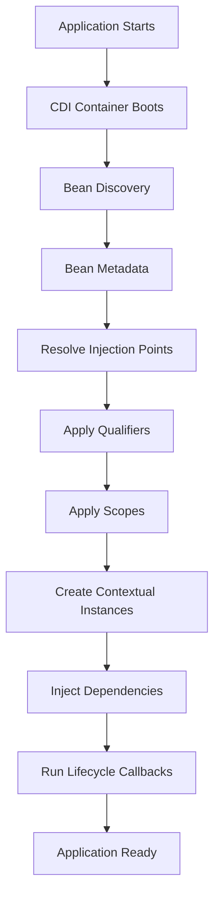

# Part 016 — CDI, Jakarta Inject, and Jersey Integration

> Fokus part ini: memahami **CDI**, **Jakarta Inject**, dan bagaimana keduanya dapat berinteraksi dengan Jersey/JAX-RS tanpa mencampuradukkan standard Jakarta, CDI runtime, dan HK2.

Part sebelumnya membahas HK2 sebagai service locator/injection model yang sering muncul bersama Jersey.

Part ini membahas sisi lain: CDI dan Jakarta Inject.

Pertanyaan utamanya:

```text
What is @Inject actually doing?
Is the object managed by CDI, HK2, Jersey, or manually created code?
What does scope mean in CDI?
How are qualifiers and producers used?
How do CDI beans interact with JAX-RS resources?
What must be verified before assuming CDI is active?
```

Peringatan penting:

```text
Seeing @Inject does not prove CDI is active.
Seeing a JAX-RS resource does not prove the resource is CDI-managed.
Seeing Jersey does not prove HK2 and CDI are bridged correctly.
```

Untuk konteks CSG Quote & Order, semua detail runtime CDI harus diverifikasi dari codebase, dependency, deployment runtime, dan startup logs.

---

## 1. Jakarta Inject vs CDI

`jakarta.inject.Inject` is an annotation API.

CDI is a dependency injection and contextual lifecycle specification/runtime.

This distinction matters.

```text
Jakarta Inject gives annotations such as @Inject and @Qualifier.
CDI gives a bean model, scopes, producers, interceptors, decorators, events, and contextual lifecycle.
```

Example:

```java
import jakarta.inject.Inject;

public class QuoteResource {
  private final QuoteService quoteService;

  @Inject
  public QuoteResource(QuoteService quoteService) {
    this.quoteService = quoteService;
  }
}
```

The annotation alone does not answer:

```text
Who creates QuoteResource?
Who resolves QuoteService?
Is QuoteService a CDI bean?
Is QuoteService an HK2 service?
Is there a bridge between the two?
```

Senior rule:

```text
Annotations are evidence, not proof of runtime ownership.
```

---

## 2. CDI Mental Model

CDI can be understood as a contextual object graph manager.



CDI does not only inject objects.

It answers:

```text
Which classes are beans?
Which implementation matches an injection point?
How long does the instance live?
What context owns it?
What producer creates it?
What interceptor/decorator applies?
How is ambiguity resolved?
```

---

## 3. Bean Discovery

A class can only be injected by CDI if CDI discovers it as a bean.

Simplified examples of CDI bean candidates:

```java
@ApplicationScoped
public class DefaultQuoteService implements QuoteService {
}
```

```java
@RequestScoped
public class RequestTenantContext {
}
```

```java
@Dependent
public class QuoteMapper {
}
```

Discovery depends on runtime, configuration, archive structure, and bean discovery mode.

Things to verify:

```text
Is CDI runtime present?
Is beans.xml present or required?
What bean discovery mode is used?
Are classes in a bean archive?
Are resources/providers CDI-managed?
```

In modern Jakarta environments, discovery behavior can vary based on container and configuration.

Do not assume.

---

## 4. CDI Scopes

Scope controls lifecycle and contextual visibility.

Common CDI scopes:

```text
@ApplicationScoped
  one contextual instance for the application

@RequestScoped
  one contextual instance for an active request

@Dependent
  lifecycle depends on the injection target

@SessionScoped
  session-based lifecycle, usually more relevant to web applications than stateless APIs
```

In backend API services, the most common useful scopes are:

```text
ApplicationScoped:
  stateless services, adapters, policies, mappers, clients if thread-safe

RequestScoped:
  request metadata, identity context, tenant context, per-request accumulator

Dependent:
  lightweight helper tied to the owner lifecycle
```

Scope is not only about object reuse.

It is about correctness.

```text
A tenant context in @ApplicationScoped can leak between tenants.
A non-thread-safe client in @ApplicationScoped can corrupt concurrent requests.
A request-scoped object used after request completion can fail or use stale data.
```

---

## 5. ApplicationScoped: Useful but Dangerous

Example:

```java
@ApplicationScoped
public class DefaultQuoteService implements QuoteService {
  private final QuoteRepository repository;

  @Inject
  public DefaultQuoteService(QuoteRepository repository) {
    this.repository = repository;
  }
}
```

Good when:

- service is stateless,
- dependencies are thread-safe,
- no request-specific data is stored in fields,
- initialization is controlled.

Dangerous when:

```java
@ApplicationScoped
public class DefaultQuoteService {
  private String currentTenantId; // dangerous
}
```

This can cause:

```text
cross-request data leak
cross-tenant data leak
race condition
intermittent authorization bug
hard-to-reproduce production incident
```

Senior review heuristic:

```text
Every @ApplicationScoped bean should be inspected for mutable fields.
```

Mutable fields are not always wrong, but they require thread-safety and lifecycle justification.

---

## 6. RequestScoped: Powerful but Easy to Leak

Example:

```java
@RequestScoped
public class RequestContext {
  private String tenantId;
  private String correlationId;
  private String userId;
}
```

Useful for:

- tenant identity,
- authenticated principal,
- correlation metadata,
- request-scoped cache,
- audit context.

Risk appears when request context crosses async boundary.

Example problem:

```java
public void handleRequest() {
  executor.submit(() -> {
    auditService.record(requestContext.getTenantId());
  });
}
```

If `requestContext` is request-scoped, the async task may run after the request context is gone.

Better pattern:

```java
String tenantId = requestContext.getTenantId();
String correlationId = requestContext.getCorrelationId();

executor.submit(() -> {
  auditService.record(tenantId, correlationId);
});
```

Even better in production:

```text
Use explicit context propagation strategy for executor, HTTP clients, Kafka headers, and MDC.
```

---

## 7. Qualifiers

Qualifiers disambiguate multiple implementations of the same type.

Without qualifier:

```java
@Inject
QuoteRepository repository;
```

If there are multiple implementations:

```java
@ApplicationScoped
public class PostgresQuoteRepository implements QuoteRepository {}

@ApplicationScoped
public class CachedQuoteRepository implements QuoteRepository {}
```

CDI may fail because the dependency is ambiguous.

Define qualifier:

```java
@Qualifier
@Retention(RUNTIME)
@Target({FIELD, PARAMETER, METHOD, TYPE})
public @interface PrimaryRepository {
}
```

Use it:

```java
@PrimaryRepository
@ApplicationScoped
public class PostgresQuoteRepository implements QuoteRepository {
}
```

Injection:

```java
@Inject
public QuoteService(@PrimaryRepository QuoteRepository repository) {
  this.repository = repository;
}
```

Senior review question:

```text
Is this implementation selection static runtime wiring, or should it be dynamic domain policy?
```

Qualifier is good for infrastructure selection.

It is usually bad for per-tenant/per-request product behavior if that behavior should be explicit domain logic.

---

## 8. Producers

CDI producers create beans when construction requires logic.

Example:

```java
@ApplicationScoped
public class DataSourceProducer {
  @Inject
  DbConfig config;

  @Produces
  @ApplicationScoped
  public DataSource produceDataSource() {
    return DataSourceBuilder.create()
        .url(config.url())
        .username(config.username())
        .password(config.password())
        .build();
  }
}
```

Use producers for:

- `DataSource`,
- HTTP client,
- Kafka producer,
- Redis client,
- cloud SDK client,
- configuration-derived objects.

Producer review questions:

```text
Does creation call network services?
Does it read secrets safely?
Does it define scope explicitly?
Who closes the produced object?
Does it validate config fail-fast?
Does it hide environment-specific behavior?
```

Producer methods are powerful composition tools.

They can also become hidden infrastructure factories with unclear lifecycle.

---

## 9. Disposal and Resource Cleanup

If CDI produces a closeable resource, lifecycle needs explicit cleanup.

Conceptual example:

```java
@Produces
@ApplicationScoped
public Client produceHttpClient() {
  return ClientBuilder.newClient();
}

public void closeHttpClient(@Disposes Client client) {
  client.close();
}
```

For production services, verify cleanup for:

```text
DataSource
HTTP client
Kafka producer
Kafka consumer runner
Redis client
ExecutorService
Scheduler
Cloud SDK clients if closeable
File watchers
Background workers
```

Shutdown order matters:

```text
Stop accepting new requests.
Stop background workers.
Drain in-flight work.
Flush producers/logs/telemetry.
Close clients/pools.
Exit process.
```

If resources are closed too early, in-flight work fails.

If resources are never closed, pod termination can hang or lose data.

---

## 10. CDI and JAX-RS Resource Classes

In some Jakarta runtimes, JAX-RS resources can be CDI-managed.

Example:

```java
@Path("/quotes")
@RequestScoped
public class QuoteResource {
  private final QuoteService quoteService;

  @Inject
  public QuoteResource(QuoteService quoteService) {
    this.quoteService = quoteService;
  }
}
```

But in Jersey-specific runtimes, resource creation may involve Jersey/HK2, CDI, or an integration bridge.

Do not assume.

Verification questions:

```text
Is QuoteResource discovered by JAX-RS, CDI, or both?
Can CDI interceptors apply to resource methods?
Are CDI scopes active for resources?
Can a CDI bean inject @Context objects?
Can a Jersey provider inject CDI beans?
Can an HK2 binder override CDI resolution?
```

This matters for bugs like:

```text
@Inject works in service but not resource
@ApplicationScoped service is created twice
CDI interceptor does not run on resource method
request scope not active in provider
HK2 binding shadows CDI bean
```

---

## 11. Jersey-CDI Integration Boundary

Jersey can be integrated with CDI depending on runtime and modules.

Possible configurations:

```text
Jersey with HK2 only
Jersey with CDI bridge/integration
JAX-RS inside Jakarta EE server with CDI support
Custom internal platform wrapper
Hybrid legacy system with both HK2 and CDI
```

Each has different behavior.

The dangerous state is hybrid uncertainty:

```text
Some classes are HK2-managed.
Some classes are CDI-managed.
Some are manually created.
Some are created by Servlet container.
Some are static singletons.
```

Senior engineer goal:

```text
Build an ownership map for object creation.
```

Example map:

```text
Resource classes: Jersey/HK2
Filters/providers: Jersey/HK2
Domain services: CDI
Repositories: CDI producers
HTTP clients: CDI producers
Kafka consumers: manual bootstrap
Configuration: internal config module
```

Or:

```text
Resource classes: CDI-managed JAX-RS resources
Services: CDI
Repositories: CDI
Filters/providers: JAX-RS providers with CDI injection
Configuration: MicroProfile Config or internal config abstraction
```

The exact map must come from internal evidence.

---

## 12. Ambiguous Dependency and Unsatisfied Dependency

CDI has two classic injection failures.

### Unsatisfied dependency

Meaning:

```text
No bean matches the injection point.
```

Causes:

- class not discovered,
- missing scope/bean-defining annotation,
- wrong package/archive,
- dependency excluded,
- producer not active,
- qualifier mismatch,
- profile/environment disabled bean.

Debug path:

```text
Find injection point.
Find required type and qualifiers.
Search bean implementation.
Verify bean discovery.
Verify active profile.
Verify producer methods.
```

### Ambiguous dependency

Meaning:

```text
More than one bean matches the injection point.
```

Causes:

- multiple implementations,
- producer and class both produce same type,
- test bean included in production,
- missing qualifier,
- alternative enabled unexpectedly.

Debug path:

```text
List all beans implementing the type.
Check qualifiers.
Check alternatives/specialization.
Check test/prod classpath split.
```

---

## 13. Alternatives and Environment-Specific Beans

CDI can support alternatives or environment-specific selection depending on runtime and configuration style.

This can be useful for:

```text
test fake vs production adapter
cloud provider A vs provider B
stub external service in local development
legacy integration vs new integration
```

Risk:

```text
Wrong bean active in production.
Test implementation included in runtime image.
Environment branch not visible in PR.
Behavior changes without code change because config changed.
```

Senior rule:

```text
Environment-specific wiring must be visible, testable, and observable at startup.
```

At startup, logs should make active implementations clear enough for debugging:

```text
QuoteRepository = PostgresQuoteRepository
PricingClient = RemotePricingClient
CatalogClient = CatalogServiceClient
FeatureFlagProvider = InternalPlatformFeatureFlagProvider
```

Do not log secrets.

---

## 14. CDI Interceptors and Cross-Cutting Behavior

CDI supports interceptors in many runtimes.

Interceptors can implement cross-cutting behavior such as:

- metrics,
- tracing,
- transaction boundaries,
- security checks,
- retry,
- logging,
- audit.

Example conceptual annotation:

```java
@Timed
public QuoteResult createQuote(CreateQuoteCommand command) {
  return quoteEngine.create(command);
}
```

Risks:

```text
Behavior is not visible in method body.
Ordering matters.
Interceptors may not apply to self-invocation.
Interceptors may not apply if object is not CDI-managed.
Exception mapping can become confusing.
```

Review questions:

```text
Is this class CDI-managed?
Does the interceptor actually run?
What is the ordering?
What happens on exception?
Does it interact with JAX-RS filters or OpenTelemetry instrumentation?
```

Cross-cutting behavior should be documented because it affects runtime semantics.

---

## 15. CDI Events: Use Carefully

CDI events can decouple producers and observers inside a process.

Conceptual example:

```java
@Inject
Event<QuoteCreatedInternalEvent> quoteCreated;

public void createQuote(...) {
  quoteCreated.fire(new QuoteCreatedInternalEvent(...));
}
```

Useful for local in-process extension.

But dangerous if confused with distributed messaging.

```text
CDI event is not Kafka.
CDI event is not durable.
CDI event does not survive process crash.
CDI event does not cross service boundary.
```

Senior rule:

```text
Use CDI events only for in-process lifecycle/extension concerns, not for enterprise integration contracts.
```

For quote/order lifecycle events that other services depend on, use explicit messaging contracts such as Kafka/RabbitMQ/outbox as appropriate.

---

## 16. CDI, Transactions, and Database Boundaries

Depending on runtime, CDI may interact with transaction management.

But in a JAX-RS/Jersey service, transaction management may be:

```text
manual JDBC transaction
MyBatis transaction/session management
Jakarta Transactions/JTA
Spring-like internal platform abstraction
custom transaction wrapper
container-managed transaction
```

Do not infer transaction behavior from CDI alone.

Questions:

```text
Where does transaction begin?
Where does it commit?
Where does it rollback?
Does exception type affect rollback?
Can transaction cross HTTP call? It should not.
Can transaction cross Kafka publish? Usually use outbox instead.
```

A CDI-managed service method is not automatically transactional unless the platform provides and configures that behavior.

Internal verification is mandatory.

---

## 17. CDI and Multi-Tenancy

CDI can provide tenant-aware components, but tenant state must be handled carefully.

Possible design:

```java
@RequestScoped
public class TenantContext {
  private String tenantId;
}
```

Application service:

```java
@ApplicationScoped
public class QuoteService {
  private final TenantContext tenantContext;
}
```

This may or may not be safe depending on how the CDI runtime proxies request-scoped dependencies into application-scoped beans.

Even when technically supported, review carefully:

```text
Is tenant context always active?
What happens in background job?
What happens in Kafka consumer?
What happens in scheduled reconciliation?
What happens in async executor?
```

For background processing, tenant context often must be explicit in the command/message/job payload.

```text
Do not rely on HTTP request context outside HTTP request processing.
```

---

## 18. CDI and Testing

CDI can make tests clean or painful depending on structure.

Good design:

```text
Application services use constructor injection.
Infrastructure adapters are behind interfaces.
Producers are small and replaceable.
Test profile uses explicit fake/stub beans.
Endpoint integration test boots realistic runtime.
```

Bad design:

```text
Field injection everywhere.
Static global access.
Container required for every unit test.
Producer does network calls during test startup.
Ambiguous test beans.
```

Test strategy:

```text
Unit test business class without CDI when possible.
Integration test CDI wiring separately.
Endpoint test JAX-RS + CDI integration explicitly.
Production startup test verifies dependency graph.
```

A senior engineer should separate:

```text
Does the business logic work?
Does the DI graph boot?
Does the endpoint runtime wire correctly?
```

Those are different tests.

---

## 19. CDI vs HK2 Decision Map

When reading a codebase, build this map:

```text
Class Type                 Owner to Verify
--------------------------------------------------
JAX-RS Resource            Jersey/HK2/CDI?
JAX-RS Provider            Jersey/HK2/CDI?
Container Filter           Servlet container/Jersey?
Domain Service             CDI/HK2/manual?
Repository                 CDI/HK2/manual?
HTTP Client                CDI producer/HK2 factory/manual?
Kafka Producer             CDI producer/HK2 factory/manual?
Kafka Consumer Runner      manual bootstrap/container job?
Redis Client               CDI producer/HK2 factory/manual?
Config Object              internal config/CDI producer/HK2 binding?
Tenant Context             request scope/ThreadLocal/explicit object?
```

This ownership map is more useful than arguing abstractly about CDI vs HK2.

The production question is:

```text
Who creates it, who injects it, who owns its lifecycle, and who closes it?
```

---

## 20. Common CDI/Jersey Failure Modes

### 20.1 `@Inject` works in one class but not another

Likely causes:

```text
one class is CDI-managed, another is HK2-managed
resource/provider not CDI-integrated
bean discovery excludes class
wrong injection annotation/import
qualifier mismatch
```

### 20.2 CDI interceptor does not run

Likely causes:

```text
class not CDI-managed
method self-invocation
interceptor not enabled
annotation applied to wrong method/class
runtime integration missing
```

### 20.3 Two instances of a supposedly singleton service

Likely causes:

```text
one instance created by CDI
one instance created by HK2
manual new in application code
producer plus class bean conflict
multiple deployment units/classloaders
```

### 20.4 Request context unavailable

Likely causes:

```text
background thread
Kafka consumer
scheduled job
async executor
request scope accessed after request completion
```

### 20.5 Wrong implementation injected

Likely causes:

```text
ambiguous beans
wrong qualifier
alternative active
test bean on production classpath
profile-specific producer selected
```

---

## 21. Debugging CDI/Jersey Integration

Use this debugging flow:

```text
1. Identify the failing injection point.
2. Identify annotation imports: jakarta.inject, jakarta.enterprise, HK2-specific, etc.
3. Identify who owns the class: CDI, HK2, Jersey, Servlet, manual.
4. Search for scope annotations.
5. Search for producer methods.
6. Search for qualifiers.
7. Search for alternatives/test beans.
8. Check runtime startup logs.
9. Check whether Jersey-CDI bridge/integration is configured.
10. Create a minimal integration test that boots the actual runtime config.
```

Useful searches:

```bash
rg "jakarta.inject.Inject|javax.inject.Inject" src
rg "jakarta.enterprise|javax.enterprise" src
rg "@ApplicationScoped|@RequestScoped|@Dependent|@Produces|@Disposes|@Qualifier" src
rg "beans.xml" .
rg "jersey.*cdi|cdi.*jersey|hk2" pom.xml src
```

Look for mixed imports:

```text
javax.inject.Inject
jakarta.inject.Inject
org.jvnet.hk2.annotations.Service
jakarta.enterprise.context.ApplicationScoped
```

Mixed imports can signal migration state or dependency inconsistency.

---

## 22. Internal Verification Checklist

### Runtime evidence

Check:

```text
deployment runtime
Jersey version
CDI implementation/runtime
Jersey-CDI integration dependency
Jakarta EE server or standalone runtime
startup logs
```

Questions:

```text
Is CDI active?
Is CDI integrated with JAX-RS resources?
Is Jersey using HK2 only?
Is there a custom internal platform integration?
```

### Code evidence

Search:

```text
@ApplicationScoped
@RequestScoped
@Dependent
@Produces
@Disposes
@Qualifier
@Alternative
beans.xml
AbstractBinder
ServiceLocator
```

Questions:

```text
Which classes are CDI beans?
Which classes are HK2 services?
Are there duplicate object graphs?
Are scopes explicit?
```

### Configuration evidence

Check:

```text
bean discovery mode
runtime profile
test vs production classpath
feature flags for implementation selection
config-driven producers
```

Questions:

```text
Can a config change activate a different implementation?
Is active wiring logged?
Can production accidentally load test beans?
```

### Lifecycle evidence

Check:

```text
producer methods
close/dispose methods
shutdown hooks
executor shutdown
client/pool closing
```

Questions:

```text
Who closes produced resources?
Does shutdown order protect in-flight requests?
Can background workers outlive dependencies?
```

### Tenant/context evidence

Check:

```text
tenant context storage
request-scoped context
ThreadLocal usage
MDC propagation
Kafka header propagation
scheduled job tenant handling
```

Questions:

```text
Does tenant context exist outside HTTP request?
Is tenant explicit in events/jobs?
Can tenant-specific config leak across requests?
```

---

## 23. PR Review Checklist

When reviewing CDI/Jakarta Inject/Jersey integration changes, ask:

```text
Is the class CDI-managed, HK2-managed, or manually created?
Is the injection annotation import correct?
Is scope explicit and correct?
Does @ApplicationScoped bean contain mutable state?
Does @RequestScoped object cross async boundary?
Are qualifiers needed to avoid ambiguity?
Does producer hide network/cloud/database calls?
Who disposes closeable produced resources?
Can test beans leak into production?
Does this change create duplicate CDI/HK2 instances?
Will interceptors actually apply?
Is tenant/security context safe in this lifecycle?
Is the runtime integration covered by an integration test?
```

Red flags:

```text
@Inject field in business class without reason
@ApplicationScoped bean with request fields
manual new of CDI-managed class
same implementation registered in HK2 and CDI
producer method with unstable side effects
request-scoped bean used from Kafka consumer or scheduler
qualifier added to patch ambiguity without design explanation
```

---

## 24. Senior-Level Mental Model

CDI is not just an annotation system.

It is a contextual runtime model for object ownership.

For enterprise JAX-RS services, the core question is:

```text
Who owns this object at runtime?
```

That breaks down into:

```text
Who discovers it?
Who creates it?
Who injects it?
Which scope controls it?
Which context must be active?
Which interceptor/decorator affects it?
Who closes it?
Can it be replaced in tests?
Can it be duplicated by another container?
```

In a Jersey-based system, the hardest bugs often appear at the boundary between:

```text
JAX-RS lifecycle
Jersey/HK2 lifecycle
CDI lifecycle
Servlet/container lifecycle
manual bootstrap lifecycle
```

A senior engineer does not rely on annotation appearance.

A senior engineer builds the runtime ownership map from evidence.

