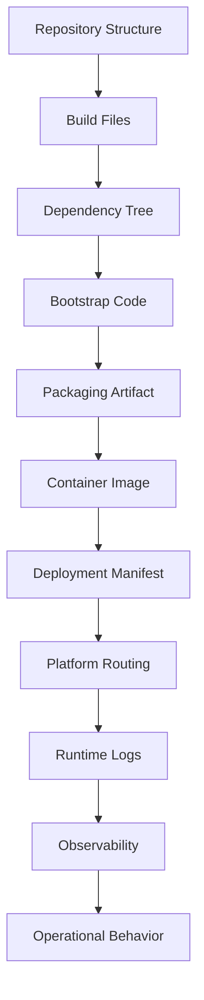
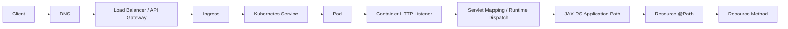

# Part 019 — Internal Runtime Verification Map

> Fokus part ini: membangun cara kerja sistematis untuk **membuktikan runtime aktual** sebuah service JAX-RS/Jersey dari evidence nyata, bukan dari asumsi nama dependency, package, atau rumor onboarding.

Part sebelumnya membahas beberapa kemungkinan runtime:

```text
Servlet container: Tomcat / Jetty / equivalent
Full Jakarta EE server: GlassFish / Payara-like / equivalent
Embedded HTTP runtime: Grizzly / Jetty / Tomcat embedded / equivalent
Standalone service launcher: executable JAR with custom bootstrap
```

Di enterprise codebase, terutama sistem besar seperti Quote & Order, yang paling berbahaya adalah menyimpulkan terlalu cepat:

```text
Ada org.glassfish.jersey.*  -> pasti GlassFish server
Ada jakarta.ws.rs.*         -> pasti Jakarta EE full server
Ada ServletContainer        -> pasti Tomcat
Ada Dockerfile              -> pasti standalone JAR
Ada Kubernetes              -> pasti runtime sama di semua environment
```

Semua kesimpulan itu bisa salah.

Tujuan part ini adalah membuat **runtime verification map**: checklist evidence yang dapat dipakai saat onboarding, debugging incident, membaca PR, atau menilai architecture decision.

---

## 1. Core Principle: Verify Runtime from Evidence

Runtime aktual adalah kombinasi dari beberapa layer:

```text
Source code
  ↓
Build dependency
  ↓
Bootstrap / entrypoint
  ↓
Packaging artifact
  ↓
Container image
  ↓
Deployment manifest
  ↓
Platform routing
  ↓
Runtime logs
  ↓
Observability signals
  ↓
Operational behavior
```

Jangan hanya melihat satu layer.

Satu dependency bisa muncul karena:

```text
- direct runtime dependency
- transitive dependency
- test dependency
- compile-only dependency
- annotation/API dependency
- legacy unused dependency
- dependency inherited dari parent POM
- dependency dibawa oleh internal platform library
```

Satu annotation juga tidak cukup untuk membuktikan runtime.

Contoh:

```java
@Path("/quotes")
public class QuoteResource {
    @GET
    public Response listQuotes() {
        return Response.ok().build();
    }
}
```

Kode ini hanya membuktikan bahwa code memakai JAX-RS API surface.

Kode ini **belum** membuktikan:

```text
- apakah implementasinya Jersey, RESTEasy, CXF, atau lainnya
- apakah berjalan di Tomcat, Jetty, GlassFish, Grizzly, atau embedded server lain
- apakah DI dikelola HK2, CDI, Spring, atau custom factory
- apakah deployment artifact WAR atau executable JAR
- apakah request masuk lewat ingress, service mesh, API gateway, atau load balancer langsung
```

Senior engineer harus bisa mengatakan:

```text
I do not know yet. Here is the evidence I need to verify it.
```

Itu bukan kelemahan. Itu engineering discipline.

---

## 2. What Exactly Are You Trying to Prove?

Runtime verification bukan sekadar mencari nama server.

Yang harus dibuktikan adalah:

```text
1. HTTP listener owner
2. Request dispatch owner
3. JAX-RS implementation
4. Resource/provider registration mechanism
5. Dependency injection owner
6. Configuration owner
7. Thread pool owner
8. Transaction owner
9. Shutdown owner
10. Deployment artifact shape
11. Platform routing path
12. Observability instrumentation point
```

Tanpa jawaban ini, PR review sering dangkal.

Misalnya:

```text
Question:
Can I create a new ExecutorService inside a resource class?

Depends on:
- Who owns lifecycle?
- Is there managed executor?
- Is request context propagated?
- Is graceful shutdown handled?
- Is tracing/MDC propagated?
- Is thread count bounded by container policy?
```

Atau:

```text
Question:
Can I rely on @RequestScoped?

Depends on:
- Is CDI active?
- Is HK2 active?
- Which scope annotation is used?
- Is resource instantiated per request or singleton?
- Is request executed synchronously or asynchronously?
```

Runtime map membuat pertanyaan seperti ini bisa dijawab dengan evidence.

---

## 3. Runtime Evidence Layers

Gunakan model berikut.



Setiap layer memberi clue berbeda.

| Layer | Evidence | Yang bisa dibuktikan | Risiko salah baca |
|---|---|---|---|
| Repository | package, module, naming | struktur aplikasi | package lama belum tentu aktif |
| Build | `pom.xml`, parent POM | dependency declared | transitive/test dependency misleading |
| Dependency tree | resolved dependency | implementation candidates | dependency ada belum tentu dipakai |
| Bootstrap | `main`, `Application`, `ResourceConfig`, `web.xml` | siapa start runtime | bootstrap bisa tersebar |
| Artifact | JAR/WAR/classes | deployment shape | artifact bisa repackaged oleh pipeline |
| Image | Dockerfile/entrypoint | process command | base image bisa hide server |
| Manifest | Deployment/Service/Ingress | port, probes, config | overlay environment bisa override |
| Logs | startup banner, port binding | runtime actual | logs bisa dikurangi/diubah |
| Observability | traces, metrics, labels | runtime path actual | instrumentation bisa incomplete |
| Behavior | error shape, timeout, thread names | operational truth | behavior bisa dipengaruhi proxy |

---

## 4. Repository Structure Forensics

Mulai dari struktur repository.

Cari:

```text
src/main/java
src/main/resources
src/test/java
pom.xml
Dockerfile
helm/
k8s/
deploy/
charts/
config/
scripts/
```

Pertanyaan awal:

```text
Is this a single service repository?
Is this a multi-module Maven repository?
Is this a shared platform library?
Is this an application service or library consumed by another runtime?
Is there more than one deployable artifact?
```

Contoh indikasi multi-module:

```text
root/pom.xml
  service-api/
  service-impl/
  service-web/
  service-db/
  service-contract/
  service-test/
```

Jangan langsung menganggap module `api` adalah HTTP API.

Dalam enterprise Java, `api` bisa berarti:

```text
- public Java interface
- DTO contract
- OpenAPI contract
- JAX-RS resource interface
- generated client
- internal shared module
```

### Useful search patterns

```bash
grep -R "jakarta.ws.rs" -n src/main/java
grep -R "javax.ws.rs" -n src/main/java
grep -R "org.glassfish.jersey" -n .
grep -R "ResourceConfig" -n .
grep -R "ServletContainer" -n .
grep -R "ApplicationPath" -n .
grep -R "extends Application" -n src/main/java
grep -R "extends ResourceConfig" -n src/main/java
```

### What to capture

Create a small note:

```md
## Runtime verification notes

- JAX-RS API imports:
- Jersey-specific imports:
- Application subclass:
- ResourceConfig subclass:
- web.xml / initializer:
- main class:
- deployment artifact:
- container image entrypoint:
- runtime observed from logs:
```

This note becomes the seed of your internal runtime map.

---

## 5. Build and Dependency Forensics

Maven dependency tells you candidates, not final truth.

Run:

```bash
mvn -q dependency:tree
mvn -q dependency:tree -Dincludes=jakarta.ws.rs
mvn -q dependency:tree -Dincludes=javax.ws.rs
mvn -q dependency:tree -Dincludes=org.glassfish.jersey
mvn -q dependency:tree -Dincludes=org.glassfish.hk2
mvn -q dependency:tree -Dincludes=org.glassfish.grizzly
mvn -q dependency:tree -Dincludes=org.apache.tomcat
mvn -q dependency:tree -Dincludes=org.eclipse.jetty
mvn -q dependency:tree -Dincludes=jakarta.enterprise
```

If the build is large:

```bash
mvn -pl <module-name> -am dependency:tree
```

Look for scopes:

```xml
<scope>provided</scope>
<scope>runtime</scope>
<scope>test</scope>
```

### Dependency clues

| Dependency clue | Possible meaning | Not enough to prove |
|---|---|---|
| `jakarta.ws.rs-api` | JAX-RS API used | implementation/runtime |
| `jersey-server` | Jersey server implementation candidate | container type |
| `jersey-container-servlet-core` | Jersey integrated with Servlet | Tomcat vs Jetty vs other |
| `jersey-container-grizzly2-http` | Jersey can run on Grizzly | active runtime |
| `jersey-hk2` | HK2 injection available | whether app uses HK2 intentionally |
| `jakarta.enterprise.cdi-api` | CDI API available | CDI container active |
| `weld-*` | CDI implementation candidate | integrated runtime behavior |
| `servlet-api` provided | Servlet runtime likely external | which container |
| `tomcat-embed-*` | embedded Tomcat candidate | whether entrypoint starts it |
| `jetty-server` | embedded Jetty candidate | whether active |
| `grizzly-http-server` | embedded Grizzly candidate | whether active |

### Common false conclusions

```text
Wrong:
org.glassfish.jersey means GlassFish server.

Better:
org.glassfish.jersey means Jersey libraries are present. Runtime still needs verification.
```

```text
Wrong:
jakarta.enterprise.cdi-api means CDI works.

Better:
CDI API alone does not create a CDI container. Need implementation/runtime/bootstrap evidence.
```

```text
Wrong:
servlet-api dependency means app runs in Tomcat.

Better:
Servlet API means Servlet programming model is available. Container must be verified separately.
```

---

## 6. Bootstrap Code Forensics

Bootstrap is stronger evidence than dependency.

Search for:

```bash
grep -R "public static void main" -n src/main/java
grep -R "new ResourceConfig" -n src/main/java
grep -R "new ServletContainer" -n src/main/java
grep -R "GrizzlyHttpServerFactory" -n src/main/java
grep -R "ServerFactory" -n src/main/java
grep -R "Tomcat" -n src/main/java
grep -R "Jetty" -n src/main/java
grep -R "ApplicationPath" -n src/main/java
grep -R "WebApplicationInitializer" -n src/main/java
```

### Pattern: JAX-RS `Application`

```java
@ApplicationPath("/api")
public class QuoteOrderApplication extends Application {
}
```

This proves:

```text
- JAX-RS application class exists
- base application path may be /api
```

It does not prove:

```text
- implementation
- container
- DI model
- deployment artifact
```

### Pattern: Jersey `ResourceConfig`

```java
public class QuoteOrderResourceConfig extends ResourceConfig {
    public QuoteOrderResourceConfig() {
        packages("com.example.quoteorder.api");
        register(GlobalExceptionMapper.class);
        register(AuthenticationFilter.class);
    }
}
```

This strongly suggests Jersey.

It proves:

```text
- Jersey-specific bootstrap class exists
- resources/providers may be registered through Jersey ResourceConfig
```

Still verify:

```text
- how ResourceConfig is connected to container
- whether all environments use this class
- whether additional providers are auto-discovered
- whether internal platform library mutates registration
```

### Pattern: Servlet `web.xml`

```xml
<servlet>
  <servlet-name>Jersey Web Application</servlet-name>
  <servlet-class>org.glassfish.jersey.servlet.ServletContainer</servlet-class>
  <init-param>
    <param-name>jakarta.ws.rs.Application</param-name>
    <param-value>com.example.QuoteOrderResourceConfig</param-value>
  </init-param>
</servlet>

<servlet-mapping>
  <servlet-name>Jersey Web Application</servlet-name>
  <url-pattern>/api/*</url-pattern>
</servlet-mapping>
```

This proves:

```text
- Jersey ServletContainer is configured
- app likely runs in a Servlet container
- URL mapping likely /api/*
```

Still verify:

```text
- actual container
- context path
- deployment descriptor overrides
- environment-specific packaging
```

### Pattern: Embedded Grizzly

```java
public final class Main {
    public static void main(String[] args) {
        ResourceConfig config = new ResourceConfig()
            .packages("com.example.quoteorder.api");

        GrizzlyHttpServerFactory.createHttpServer(
            URI.create("http://0.0.0.0:8080/"),
            config
        );
    }
}
```

This proves:

```text
- standalone Java main starts HTTP server
- Grizzly likely owns listener/threading
- app probably packaged as executable JAR
```

Still verify:

```text
- port source
- shutdown hook
- TLS/proxy boundary
- thread pool config
- readiness/liveness path
```

---

## 7. Packaging Artifact Forensics

Artifact shape matters.

Check build output:

```bash
ls -lh target/
find target -maxdepth 1 -type f
```

Look for:

```text
*.war
*.jar
*-runner.jar
*-all.jar
*-shaded.jar
```

### WAR artifact

A WAR usually suggests:

```text
- deployed into Servlet container or Jakarta EE server
- container owns HTTP listener
- app may not have public static void main
- Servlet mapping matters
```

But in modern tooling, WAR can also be executable or repackaged. Verify.

### Executable JAR

An executable JAR usually suggests:

```text
- app owns server lifecycle or framework owns it
- main class matters
- Docker CMD likely runs `java -jar`
```

Verify:

```bash
jar tf target/app.jar | head
jar xf target/app.jar META-INF/MANIFEST.MF
cat META-INF/MANIFEST.MF
```

Look for:

```text
Main-Class:
Start-Class:
Class-Path:
```

### Shaded/Fat JAR

A shaded/fat JAR suggests dependencies are bundled.

Risk:

```text
- dependency conflicts hidden inside artifact
- duplicate service provider files
- wrong provider auto-discovery
- signature files causing runtime issue
```

Check:

```bash
jar tf target/app.jar | grep -E "jersey|hk2|grizzly|tomcat|jetty" | head -50
jar tf target/app.jar | grep "META-INF/services" | head -50
```

---

## 8. Container Image Forensics

Dockerfile is often more honest than README.

Open:

```bash
cat Dockerfile
cat docker/Dockerfile
find . -iname '*Dockerfile*' -maxdepth 4
```

Look for:

```Dockerfile
FROM eclipse-temurin:17-jre
COPY target/app.jar /app/app.jar
ENTRYPOINT ["java", "-jar", "/app/app.jar"]
```

This suggests executable JAR.

Another pattern:

```Dockerfile
FROM tomcat:10-jre17
COPY target/app.war /usr/local/tomcat/webapps/ROOT.war
```

This suggests WAR deployed to Tomcat image.

Another pattern:

```Dockerfile
FROM payara/server-full
COPY target/app.war $DEPLOY_DIR
```

This suggests application server image.

### What to verify in image

```text
- base image
- Java version inside image
- entrypoint
- exposed port
- user/non-root
- JVM options
- environment variables
- mounted config paths
- healthcheck
- timezone
- CA certificates
- truststore/keystore
```

### Useful commands

If you can build locally:

```bash
docker build -t runtime-check .
docker inspect runtime-check
docker run --rm runtime-check java -version
docker run --rm runtime-check env
docker run --rm -p 8080:8080 runtime-check
```

If image is already published:

```bash
docker pull <image>
docker inspect <image>
```

Do not assume the Dockerfile in the repo is what production uses. CI/CD may build from a different Dockerfile or internal builder.

---

## 9. Kubernetes Manifest Forensics

Kubernetes manifest shows how the process is run.

Look for:

```text
Deployment
StatefulSet
Job
CronJob
Service
Ingress
ConfigMap
Secret
ServiceAccount
HorizontalPodAutoscaler
PodDisruptionBudget
```

Commands:

```bash
find . -iname '*.yaml' -o -iname '*.yml' | grep -E 'k8s|helm|chart|deploy|manifest'
grep -R "kind: Deployment" -n .
grep -R "containerPort" -n .
grep -R "readinessProbe" -n .
grep -R "livenessProbe" -n .
grep -R "JAVA_TOOL_OPTIONS" -n .
```

### Deployment clues

```yaml
containers:
  - name: quote-order-service
    image: registry.example.com/quote-order-service:1.2.3
    ports:
      - containerPort: 8080
    env:
      - name: JAVA_TOOL_OPTIONS
        value: "-XX:MaxRAMPercentage=70"
    readinessProbe:
      httpGet:
        path: /health/ready
        port: 8080
```

This helps verify:

```text
- container port
- health endpoint path
- JVM flags
- environment variable config
- resource limits
- lifecycle hooks
```

But it still may not prove JAX-RS path mapping.

You still need to map:

```text
Ingress path
  -> Service port
  -> Pod containerPort
  -> Runtime listener port
  -> Servlet context path
  -> JAX-RS application path
  -> Resource @Path
```

---

## 10. Full Request Path Verification

For a JAX-RS API, verify the complete path.



A common production bug happens when each layer is correct alone, but wrong in composition.

Example:

```text
Ingress path: /quote-order/api
Servlet mapping: /api/*
Application path: /api
Resource path: /quotes
```

Potential final path:

```text
/quote-order/api/api/quotes
```

Or if rewrite strips `/quote-order`:

```text
/api/api/quotes
```

Or if Servlet mapping already includes `/api` and Application path is ignored differently:

```text
/api/quotes
```

Do not guess. Verify with actual request logs and routing config.

### Verification command pattern

```bash
curl -v https://<host>/<path>
curl -v https://<host>/<path>/health
curl -v -H 'Accept: application/json' https://<host>/<path>
```

In Kubernetes:

```bash
kubectl get ingress
kubectl describe ingress <name>
kubectl get svc
kubectl describe svc <name>
kubectl get pods -l app=<app>
kubectl logs deploy/<deployment> --tail=200
kubectl port-forward deploy/<deployment> 8080:8080
curl -v http://localhost:8080/<local-path>
```

Port-forward is useful because it bypasses ingress/gateway. If local pod path works but gateway path fails, the issue is probably routing/proxy, not resource method.

---

## 11. Runtime Logs as Evidence

Startup logs often reveal the actual runtime.

Look for:

```text
- server banner
- Java version
- listening port
- context path
- Servlet initialization
- Jersey application initialization
- registered resources/providers
- DI startup
- warnings about provider discovery
- health endpoint startup
```

Example useful signals:

```text
Started server on port 8080
Initializing Jersey application
Registering application class com.example.QuoteOrderResourceConfig
Root resource classes found:
  com.example.api.QuoteResource
Registered providers:
  com.example.api.GlobalExceptionMapper
  com.example.api.AuthenticationFilter
```

Be careful with logs generated by framework wrappers. A log line may say “Jersey started” but not identify the container.

### Thread names as clue

Thread names sometimes reveal runtime:

```text
http-nio-8080-exec-10        -> Tomcat-like
qtp123456-45                 -> Jetty-like
grizzly-http-server-1        -> Grizzly-like
ForkJoinPool.commonPool      -> async code using common pool
pool-7-thread-3              -> custom executor, unclear owner
```

Thread names are clues, not final proof.

They are especially useful in thread dumps.

```bash
jcmd <pid> Thread.print
jstack <pid>
```

In Kubernetes, if tooling allows:

```bash
kubectl exec -it <pod> -- jcmd 1 Thread.print
```

---

## 12. Observability Evidence

Runtime can also be inferred from metrics and traces.

Look for dimensions like:

```text
service.name
service.version
deployment.environment
http.route
http.method
http.status_code
server.address
server.port
container.name
k8s.pod.name
k8s.namespace.name
thread.name
exception.type
```

Questions:

```text
Do traces show servlet span?
Do traces show JAX-RS resource span?
Is route templated or raw path?
Are 404/405 generated by gateway, container, or JAX-RS?
Are errors mapped by ExceptionMapper or thrown before JAX-RS?
```

If an error does not contain your application error envelope, it may have failed before resource method:

```text
DNS / TLS / gateway / ingress / service / container / servlet / filter / request matching
```

If error envelope appears, request probably reached application-level error handling.

---

## 13. Runtime Classification Matrix

Use this matrix after collecting evidence.

| Evidence | Servlet container deployment | GlassFish/Jakarta EE server | Embedded Grizzly | Other standalone |
|---|---:|---:|---:|---:|
| WAR artifact | strong | strong | weak | weak |
| `web.xml` maps Jersey ServletContainer | strong | possible | weak | weak |
| `tomcat` base image | strong | weak | weak | weak |
| `jetty` base image | strong | weak | weak | possible |
| `payara`/`glassfish` image | weak | strong | weak | weak |
| `GrizzlyHttpServerFactory` in main | weak | weak | strong | possible |
| `java -jar app.jar` | possible | weak | strong if bootstrap matches | strong |
| `jersey-container-servlet` | strong candidate | possible | weak | possible |
| `jersey-container-grizzly2-http` | weak | weak | strong candidate | possible |
| server banner in logs | strong | strong | strong | strong |
| thread names | useful clue | useful clue | useful clue | useful clue |

A senior-level runtime conclusion should look like this:

```md
## Runtime conclusion

Based on:
- artifact: WAR
- Docker base image: tomcat:10-jre17
- web.xml: Jersey ServletContainer mapped to /api/*
- dependency: jersey-container-servlet-core
- startup logs: Apache Tomcat banner and Jersey application initialization

Conclusion:
The service appears to run as a Jersey/JAX-RS application inside a Servlet container runtime, likely Tomcat for this environment.

Open questions:
- whether all environments use the same runtime image
- whether production adds API gateway path rewrite
- whether CDI is active or only HK2 is used
- whether ResourceConfig is mutated by internal platform libraries
```

Notice the phrase “appears to” unless production evidence is complete.

---

## 14. DI Runtime Verification

DI is often misread.

You need to answer:

```text
Who constructs resource classes?
Who constructs service classes?
Who owns singleton lifecycle?
Who owns request scope?
Who injects config?
Who runs producer/factory methods?
```

### HK2 evidence

Search:

```bash
grep -R "AbstractBinder" -n src/main/java
grep -R "Factory<" -n src/main/java
grep -R "org.glassfish.hk2" -n src/main/java pom.xml
grep -R "@Service" -n src/main/java
```

Evidence patterns:

```java
register(new AbstractBinder() {
    @Override
    protected void configure() {
        bind(QuoteService.class).to(QuoteService.class).in(Singleton.class);
    }
});
```

### CDI evidence

Search:

```bash
find . -name beans.xml -print
grep -R "jakarta.enterprise" -n src/main/java pom.xml
grep -R "@ApplicationScoped" -n src/main/java
grep -R "@RequestScoped" -n src/main/java
grep -R "@Produces" -n src/main/java
grep -R "@Inject" -n src/main/java
```

CDI API imports are not enough. Verify CDI container/implementation and integration.

### Manual construction evidence

Search:

```bash
grep -R "new .*Service" -n src/main/java
grep -R "static .*INSTANCE" -n src/main/java
grep -R "getInstance()" -n src/main/java
```

Manual construction may be fine in small isolated objects, but it undermines DI lifecycle if used for infrastructure clients or stateful services.

---

## 15. Configuration Runtime Verification

Configuration may come from multiple layers.

```text
application.properties
YAML files
system properties
JVM flags
environment variables
Kubernetes ConfigMap
Kubernetes Secret
mounted files
cloud config service
internal platform config
feature flag service
command-line arguments
```

You need to know precedence.

Example verification matrix:

| Config key | Default | Environment override | Secret? | Runtime reload? | Owner |
|---|---|---|---|---|---|
| `server.port` | 8080 | env var | no | no | platform/service |
| `db.url` | none | secret/config | yes-ish | no | platform |
| `kafka.bootstrap.servers` | none | config | no | no | platform |
| `feature.quote.v2.enabled` | false | flag service | no | yes | product/platform |

Questions:

```text
Where is the value read?
When is it read?
Can it change at runtime?
What happens if it is missing?
What happens if it is malformed?
Is it logged?
Is it secret?
Is it tenant-specific?
```

A production-ready service should fail fast on invalid required config.

---

## 16. Health and Management Endpoint Verification

Health endpoint behavior depends on runtime and platform.

Verify:

```text
- health path
- readiness vs liveness semantics
- startup probe if slow startup
- dependency checks
- whether DB/Kafka/downstream checks are included
- whether health endpoint is JAX-RS resource or platform endpoint
- whether it requires auth
- whether it is exposed externally
```

Common mistake:

```text
Liveness checks DB.
DB has transient issue.
Kubernetes restarts all pods.
System enters cascading failure.
```

Better mental model:

```text
liveness  -> is process alive or irrecoverably stuck?
readiness -> should this pod receive traffic?
startup   -> has app completed slow initialization?
```

Runtime verification should record which endpoint is used for each.

---

## 17. Shutdown and Graceful Termination Verification

Senior engineers must know what happens during shutdown.

Questions:

```text
When pod receives SIGTERM, who handles it?
Does runtime stop accepting new requests?
Are in-flight requests allowed to complete?
Are Kafka consumers paused/stopped?
Are HTTP clients closed?
Are DB pools closed?
Are custom executors shut down?
Is there preStop hook?
Is terminationGracePeriodSeconds enough?
```

Search:

```bash
grep -R "shutdown" -n src/main/java
grep -R "close()" -n src/main/java
grep -R "Runtime.getRuntime().addShutdownHook" -n src/main/java
grep -R "ExecutorService" -n src/main/java
grep -R "KafkaConsumer" -n src/main/java
grep -R "DataSource" -n src/main/java
```

In Kubernetes:

```bash
grep -R "terminationGracePeriodSeconds" -n .
grep -R "preStop" -n .
```

A service can pass all unit tests and still lose data during shutdown if lifecycle is not verified.

---

## 18. Failure Mode: Wrong Runtime Assumption

### Scenario

A developer assumes the service runs in a full Jakarta EE server and uses CDI request scope heavily.

But actual runtime is Jersey + HK2 inside embedded Grizzly.

### Possible symptoms

```text
- injection fails at startup
- request scope object not available
- provider constructed twice
- singleton unexpectedly shared
- config injection missing
- tests pass with one runtime but production differs
```

### Debug path

```text
1. Check dependency tree.
2. Find Application/ResourceConfig bootstrap.
3. Identify container integration.
4. Check CDI implementation and integration.
5. Check startup logs for CDI initialization.
6. Verify object lifecycle with logs/breakpoints.
```

### Preventive PR review

```text
Any new scope annotation must be reviewed against actual DI runtime.
Any new provider/resource lifecycle assumption must cite runtime evidence.
Any new custom executor must show context propagation and shutdown behavior.
```

---

## 19. Failure Mode: Endpoint Path Works Locally but Not in Environment

### Possible causes

```text
- local path bypasses ingress rewrite
- context path differs
- servlet mapping differs
- application path duplicated
- service mesh strips prefix
- API gateway requires trailing slash differently
- CORS/preflight blocked before app
- auth gateway rejects before JAX-RS
```

### Debug path

```text
1. Test through external gateway.
2. Test through ingress host.
3. Test with kubectl port-forward.
4. Test inside pod using localhost.
5. Compare response headers and error body.
6. Check access logs at each layer.
```

If port-forward works but gateway fails, the resource method is probably not the bug.

---

## 20. Failure Mode: Runtime Differs by Environment

Enterprise systems often differ by environment.

Examples:

```text
local: embedded runtime
CI: test container runtime
staging: Kubernetes image v1
production: Kubernetes image v2 with platform sidecar
customer on-prem: different base image or reverse proxy
```

This can cause:

```text
- different timeout behavior
- different compression behavior
- different max header/body size
- different TLS/truststore behavior
- different path rewrite
- different thread pool
- different logging format
```

Runtime map should include environment dimension:

| Environment | Artifact | Image | Runtime | Gateway | Notes |
|---|---|---|---|---|---|
| local | JAR | local | embedded? | none | verify |
| CI | JAR/WAR | test image | verify | none | verify |
| dev | image | k8s | verify | ingress | verify |
| staging | image | k8s | verify | gateway | verify |
| prod | image | k8s | verify | gateway/APIM | verify |
| on-prem | customer-specific | verify | verify | customer LB | verify |

---

## 21. Internal Verification Checklist

Use this as a practical onboarding checklist.

### Repository and build

```text
[ ] Identify root POM and active deployable module.
[ ] Identify Java version and Jakarta/javax namespace usage.
[ ] Generate dependency tree for JAX-RS, Jersey, HK2, CDI, Servlet, Grizzly, Tomcat, Jetty.
[ ] Distinguish direct, transitive, provided, runtime, and test dependencies.
[ ] Identify parent POM/internal platform dependencies.
```

### Bootstrap and runtime

```text
[ ] Find Application subclass.
[ ] Find ResourceConfig subclass.
[ ] Find web.xml or servlet initializer.
[ ] Find public static void main.
[ ] Find embedded server factory usage.
[ ] Determine whether runtime is Servlet container, app server, embedded server, or custom standalone.
[ ] Verify runtime in startup logs.
```

### Packaging and deployment

```text
[ ] Determine artifact type: WAR, thin JAR, fat JAR, shaded JAR.
[ ] Inspect manifest and main class.
[ ] Inspect Dockerfile/base image/entrypoint.
[ ] Inspect Kubernetes Deployment/Service/Ingress.
[ ] Verify container port and runtime listener port.
[ ] Verify readiness/liveness/startup probes.
```

### Routing

```text
[ ] Map external DNS to gateway/load balancer.
[ ] Map gateway path rewrite.
[ ] Map ingress path.
[ ] Map service port to container port.
[ ] Map servlet/context/application/resource path.
[ ] Verify with curl through gateway and port-forward.
```

### DI and lifecycle

```text
[ ] Identify DI owner: HK2, CDI, both, custom, framework.
[ ] Identify singleton/request scope behavior.
[ ] Identify config injection mechanism.
[ ] Identify resource/provider lifecycle.
[ ] Identify custom executor and shutdown behavior.
```

### Observability

```text
[ ] Verify access logs.
[ ] Verify application logs.
[ ] Verify correlation/trace propagation.
[ ] Verify metrics for HTTP server, JVM, DB, Kafka, outbound clients.
[ ] Verify traces show route/resource method where possible.
```

### Operations

```text
[ ] Verify graceful shutdown.
[ ] Verify timeout hierarchy.
[ ] Verify max request body/header limits.
[ ] Verify thread pool and connection pool settings.
[ ] Verify health endpoint semantics.
[ ] Verify runtime differences between local/dev/staging/prod/on-prem.
```

---

## 22. PR Review Checklist

When reviewing a PR that touches runtime/bootstrap/deployment:

```text
[ ] Does this PR change startup order?
[ ] Does it register new resources/providers/filters/interceptors?
[ ] Does it introduce Jersey-specific APIs?
[ ] Does it introduce CDI/HK2 scope assumptions?
[ ] Does it create custom executors or background threads?
[ ] Does it add config keys? Are defaults safe?
[ ] Does it add secrets? Are they redacted and sourced correctly?
[ ] Does it change Docker image, JVM flags, or entrypoint?
[ ] Does it change Kubernetes port/probe/resource limits?
[ ] Does it change external path or routing assumptions?
[ ] Does it affect graceful shutdown?
[ ] Does it preserve observability and context propagation?
```

A PR that changes runtime behavior deserves architecture-level review even if code diff looks small.

---

## 23. Senior Engineer Heuristics

Use these heuristics:

```text
1. Dependency is not runtime proof.
2. Annotation is not lifecycle proof.
3. Local behavior is not production proof.
4. Startup log is stronger than README.
5. Container entrypoint is stronger than naming convention.
6. Kubernetes manifest is stronger than local script.
7. Production trace/log is stronger than assumption.
8. Path bugs are usually composition bugs across layers.
9. DI bugs are usually lifecycle ownership bugs.
10. Shutdown bugs are usually invisible until deploy/incident.
```

The best runtime documentation is not a diagram alone. It is a diagram backed by commands, files, and logs.

---

## 24. Recommended Runtime Map Artifact

Create a small internal document per service:

```md
# Runtime Map: <service-name>

## Summary
- JAX-RS implementation:
- Runtime/container:
- Deployment artifact:
- Container image:
- Kubernetes workload:
- External route:

## Evidence
- Dependency tree:
- Bootstrap class:
- ResourceConfig/Application:
- Dockerfile:
- Manifest:
- Startup logs:
- Observability links:

## Request path
Client -> DNS -> Gateway -> Ingress -> Service -> Pod -> Runtime -> JAX-RS -> Resource

## DI model
- HK2:
- CDI:
- Manual construction:
- Scope policy:

## Config model
- Config sources:
- Precedence:
- Secret source:
- Runtime reload:

## Operations
- Health endpoints:
- Timeouts:
- Graceful shutdown:
- Metrics/traces/logs:

## Open questions
- ...
```

This document is extremely useful during onboarding and incident response.

---

## 25. CSG Quote & Order Context

For CSG Quote & Order context, treat runtime as an internal fact to verify.

Do not write or say:

```text
CSG uses GlassFish.
CSG uses Grizzly.
CSG uses Tomcat.
CSG uses HK2 only.
CSG uses CDI.
```

Unless you have internal evidence.

Safer phrasing:

```text
The codebase appears to use Jersey-specific APIs because ResourceConfig and org.glassfish.jersey packages are present.
The deployment runtime still needs verification from Dockerfile, manifest, startup logs, and internal platform documentation.
```

For Quote & Order systems, runtime verification matters because these systems often have:

```text
- many integrations
- multiple deployment models
- cloud and on-prem variants
- customer-specific configuration
- tenant-specific behavior
- long compatibility windows
- high operational cost of runtime drift
```

A wrong runtime assumption can become a production incident.

---

## 26. Practical Exercise

Pick one service repository and produce this table.

| Question | Answer | Evidence | Confidence |
|---|---|---|---|
| JAX-RS standard namespace? |  |  | low/medium/high |
| JAX-RS implementation? |  |  | low/medium/high |
| Runtime/container? |  |  | low/medium/high |
| Artifact type? |  |  | low/medium/high |
| DI owner? |  |  | low/medium/high |
| Config source? |  |  | low/medium/high |
| External route? |  |  | low/medium/high |
| Health endpoints? |  |  | low/medium/high |
| Shutdown behavior? |  |  | low/medium/high |
| Observability path? |  |  | low/medium/high |

Any answer with low confidence becomes onboarding follow-up.

---

## 27. Key Takeaways

```text
Runtime verification is evidence collection.
```

```text
JAX-RS API usage does not prove implementation or container.
```

```text
Jersey dependency does not prove GlassFish server.
```

```text
Docker/Kubernetes artifacts often reveal more than source code alone.
```

```text
For senior engineers, runtime knowledge is not trivia. It determines lifecycle, DI, threading, configuration, observability, and production failure modes.
```

After this part, you should be able to walk into an unfamiliar JAX-RS enterprise service and build a defensible runtime map without guessing.
