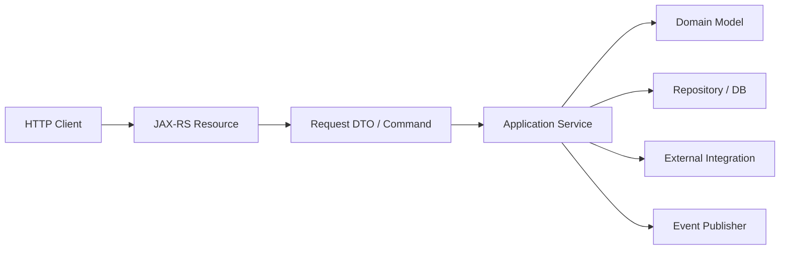
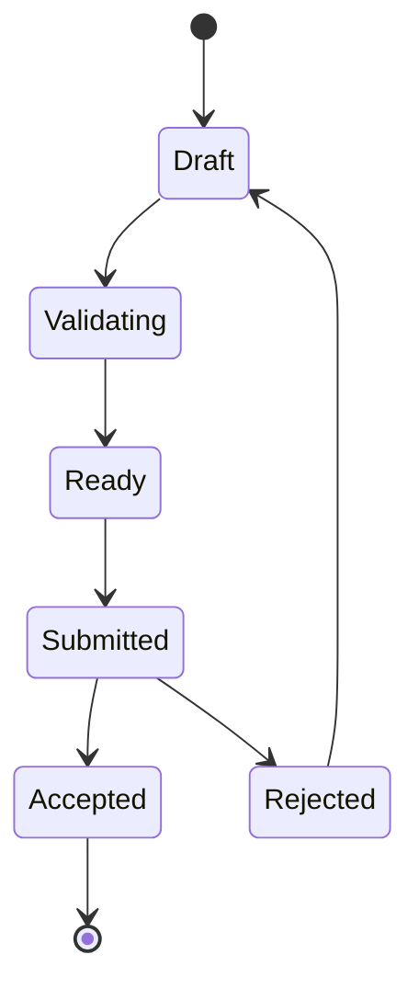

# Part 020 — Enterprise API Resource Modeling

> Fokus part ini: mendesain API HTTP/JAX-RS sebagai **kontrak enterprise** yang stabil, bisa dioperasikan, bisa berevolusi, dan bisa direview oleh senior engineer.

Di part sebelumnya, kita membangun cara memverifikasi runtime aktual.

Mulai part ini, kita masuk ke **HTTP endpoint engineering** dan **API governance**.

Resource modeling adalah fondasi. Jika model resource salah, masalah berikutnya akan ikut salah:

```text
- HTTP method semantics
- status code
- authorization boundary
- validation boundary
- pagination/filtering
- idempotency
- caching
- versioning
- backward compatibility
- observability
- test strategy
- client integration
```

Untuk konteks Quote & Order, endpoint biasanya tidak hanya CRUD sederhana. Ia mewakili proses enterprise:

```text
quote creation
quote validation
pricing calculation
product catalog eligibility
order submission
order status tracking
workflow/human approval
integration with downstream BSS/OSS systems
```

Tetapi kita tidak boleh mengarang detail internal CSG. Kita gunakan konteks CPQ/order management sebagai mental model enterprise, lalu semua detail spesifik masuk `Internal verification checklist`.

---

## 1. Resource Modeling Is Not URL Naming

Resource modeling bukan hanya memilih path.

Bad mental model:

```text
I have a Java method, so I expose it as an endpoint.
```

Better mental model:

```text
I have a stable business/resource concept.
Clients need to observe or request state transitions.
HTTP should expose that concept through consistent resource semantics.
```

A resource model answers:

```text
What is the resource?
Who owns it?
How is it identified?
What lifecycle states does it have?
Which operations are safe?
Which operations mutate state?
Which operations are idempotent?
Which operations are long-running?
Which operations require authorization?
Which fields are stable contract?
Which fields are internal implementation detail?
```

In Java terms, resource modeling is not equivalent to class modeling.

```text
Java class       -> implementation unit
JAX-RS resource  -> HTTP contract boundary
Domain aggregate -> consistency boundary
Database table   -> persistence structure
Event            -> integration fact
```

These should not be blindly mapped one-to-one.

---

## 2. API Contract Boundary

A JAX-RS resource method is a boundary between external client and internal implementation.



The resource should not leak:

```text
- database table shape
- internal enum that changes frequently
- downstream vendor payload directly
- stack trace or exception class
- persistence entity identity if not public
- internal workflow engine state if unstable
```

The resource should expose:

```text
- stable public identifier
- stable operation semantics
- stable request shape
- stable response shape
- stable error model
- stable authorization boundary
```

---

## 3. Resource vs Command vs Query

Enterprise APIs often need both resource-oriented and command-oriented endpoints.

### Query endpoint

A query endpoint retrieves state or projections.

```http
GET /quotes/{quoteId}
GET /quotes?accountId=...&status=...
GET /orders/{orderId}/status
```

Properties:

```text
- should be safe
- should not mutate business state
- may be cacheable depending on data sensitivity/freshness
- should have clear pagination/filtering if collection
- should be observable as read path
```

### Command endpoint

A command endpoint requests a state transition.

```http
POST /quotes
POST /quotes/{quoteId}/submit
POST /orders/{orderId}/cancel
POST /quotes/{quoteId}/price-calculations
```

Properties:

```text
- mutates or requests mutation
- may be synchronous or asynchronous
- must define idempotency behavior
- must define validation and error behavior
- often produces domain events
```

### Important distinction

Not all commands are CRUD.

In enterprise systems, commands often represent workflow transitions:

```text
submit quote
approve quote
reject quote
convert quote to order
cancel order
retry failed integration
recalculate price
validate eligibility
```

If you force all of these into generic CRUD, you lose semantics.

---

## 4. CRUD Is a Starting Point, Not a Design Strategy

CRUD-style endpoints are useful when resource lifecycle is simple.

```http
POST /quotes
GET /quotes/{quoteId}
PATCH /quotes/{quoteId}
DELETE /quotes/{quoteId}
```

But complex enterprise resources often have controlled transitions.

Instead of:

```http
PATCH /quotes/{quoteId}
{
  "status": "SUBMITTED"
}
```

Prefer an explicit command when transition has business meaning:

```http
POST /quotes/{quoteId}/submit
```

Why?

Because submit may involve:

```text
- validation
- authorization
- pricing check
- catalog eligibility
- event emission
- workflow start
- integration call
- audit trail
- state transition guard
```

A generic PATCH hides too much.

### Senior review heuristic

If changing a field triggers business process, it is probably not a plain field update.

---

## 5. Aggregate-Oriented API Design

An aggregate is a consistency boundary.

In a quote/order system, possible aggregate-like concepts may include:

```text
Quote
Quote Line
Order
Order Item
Customer Account
Product Offering
Pricing Result
Validation Result
```

Do not assume actual internal aggregate names. Verify internally.

API resource modeling should consider aggregate boundary:

```text
Can this object be modified independently?
Does it require parent identity?
Does it have its own lifecycle?
Does it have its own authorization policy?
Does it have its own audit trail?
Does it need direct lookup by clients?
```

Example:

```http
GET /quotes/{quoteId}/lines/{lineId}
```

This suggests line belongs to quote.

But if line has independent lifecycle or external identity, maybe:

```http
GET /quote-lines/{lineId}
```

Neither is universally correct. The aggregate boundary decides.

---

## 6. URI Design Principles

Good URI design is boring.

Prefer:

```http
/quotes
/quotes/{quoteId}
/quotes/{quoteId}/lines
/quotes/{quoteId}/lines/{lineId}
/orders
/orders/{orderId}
/orders/{orderId}/status
```

Avoid:

```http
/doCreateQuote
/getQuoteById
/quoteService/create
/api/v1/quote/submitQuoteAction
/processOrderCancellationAndNotifyBilling
```

### URI rules

```text
Use nouns for resources.
Use plural collection names.
Use stable public identifiers.
Use hierarchy only when relationship is real.
Avoid leaking Java method names.
Avoid leaking DB table names.
Avoid ambiguous action names.
Avoid over-nesting.
```

### Over-nesting smell

```http
/accounts/{accountId}/sites/{siteId}/subscriptions/{subscriptionId}/quotes/{quoteId}/lines/{lineId}/prices/{priceId}
```

This path may encode too much context.

Ask:

```text
Is every parent required for identity?
Is authorization derived from all parents?
Will clients always know all parent IDs?
Can this path remain stable?
Is this query better represented by filters?
```

Possible alternative:

```http
GET /quotes/{quoteId}/lines/{lineId}/prices
```

or:

```http
GET /prices?quoteId=...&lineId=...
```

The right choice depends on identity and access pattern.

---

## 7. Resource Identity

Use stable identifiers.

Questions:

```text
Is the ID globally unique?
Is it tenant-scoped?
Is it meaningful or opaque?
Can it be exposed to clients?
Can it change?
Is it generated before persistence?
Is it reused across systems?
```

Prefer opaque stable IDs for public APIs.

Avoid exposing internal technical IDs if they are not contractually stable.

Risky examples:

```text
database sequence ID exposed as permanent public ID
composite DB primary key encoded in URL
vendor system ID used as only public identifier
mutable business number used as unique resource ID
```

Sometimes business IDs are required, but they must be modeled intentionally.

Example:

```http
GET /quotes/{quoteId}
GET /quotes/by-number/{quoteNumber}
```

This separates opaque technical/public resource ID from business lookup.

---

## 8. Tenant-Aware Resource Modeling

In multi-tenant enterprise systems, tenant boundary is not decoration.

Possible tenant models:

```text
Tenant from token claim
Tenant from subdomain
Tenant from header
Tenant from path
Tenant from account/customer relationship
Tenant from deployment/environment
```

Do not assume. Verify internally.

### Path-based tenant example

```http
GET /tenants/{tenantId}/quotes/{quoteId}
```

Pros:

```text
- explicit tenant context
- easy for logs and routing
- clear for admin APIs
```

Cons:

```text
- risk of trusting path tenant over identity claim
- more verbose URLs
- can confuse ownership if user spans tenants
```

### Token-derived tenant example

```http
GET /quotes/{quoteId}
```

Tenant resolved from identity context.

Pros:

```text
- simpler client contract
- less tenant spoofing through URL
- natural for tenant-scoped applications
```

Cons:

```text
- harder for support/admin cross-tenant operations
- logs must include tenant explicitly
- debugging requires identity context
```

### Senior rule

Never rely on client-provided tenant value unless it is checked against authenticated identity and authorization policy.

---

## 9. Command Modeling

Some operations are not resources in the classic sense, but command endpoints still need structure.

Example command patterns:

```http
POST /quotes/{quoteId}/submit
POST /quotes/{quoteId}/approve
POST /quotes/{quoteId}/reject
POST /orders/{orderId}/cancel
POST /orders/{orderId}/retry-fulfillment
```

These are acceptable when they represent business transitions.

But avoid turning every service method into an action endpoint.

Bad:

```http
POST /quotes/{quoteId}/calculateTaxesAndUpdateLineItemsAndNotify
```

Better split by domain semantics:

```http
POST /quotes/{quoteId}/price-calculations
POST /quotes/{quoteId}/tax-calculations
POST /quotes/{quoteId}/submit
```

or if calculation is pure query:

```http
POST /quote-pricing-estimates
```

Use POST for calculation when input is complex or not safe to encode in URL, even if it does not persist state. But document whether it mutates state.

---

## 10. Synchronous vs Asynchronous Operation Modeling

Not every command should return final result immediately.

For expensive operations:

```text
- quote pricing
- eligibility validation
- order submission
- downstream orchestration
- file generation
- bulk import
```

Consider asynchronous model.

### Synchronous command

```http
POST /quotes/{quoteId}/submit
HTTP/1.1 200 OK
{
  "quoteId": "q-123",
  "status": "SUBMITTED"
}
```

Good when:

```text
- operation is fast
- failure is immediate
- state transition completes within request timeout
- downstream dependencies are reliable enough
```

### Accepted async command

```http
POST /quotes/{quoteId}/submit
HTTP/1.1 202 Accepted
Location: /operations/op-789

{
  "operationId": "op-789",
  "status": "ACCEPTED"
}
```

Then:

```http
GET /operations/op-789
```

Good when:

```text
- operation may take longer than request timeout
- involves downstream orchestration
- needs retry/recovery
- user can poll or receive notification
```

### Failure mode

A common anti-pattern:

```text
Client gets timeout.
Server continues processing.
Client retries.
Server submits twice.
```

This is a resource modeling problem, not only a retry problem.

Use idempotency keys or operation resources.

---

## 11. Operation Resource Pattern

For long-running actions, model an operation resource.

```http
POST /orders/{orderId}/submission-operations
Idempotency-Key: abc-123
```

Response:

```http
202 Accepted
Location: /operations/op-123
```

Operation resource:

```json
{
  "operationId": "op-123",
  "type": "ORDER_SUBMISSION",
  "status": "RUNNING",
  "createdAt": "2026-07-10T00:00:00Z",
  "links": {
    "self": "/operations/op-123",
    "target": "/orders/o-456"
  }
}
```

Possible statuses:

```text
ACCEPTED
RUNNING
SUCCEEDED
FAILED
CANCELLED
EXPIRED
```

Design questions:

```text
How long is operation retained?
Can client retry using same idempotency key?
Can operation be cancelled?
Does operation expose partial progress?
What errors are stable in operation result?
Does operation map to workflow/process/job internally?
```

Do not expose internal workflow engine IDs unless they are intended as public contract.

---

## 12. State Transition Modeling

Enterprise resources have lifecycle states.

Example generic state model:



This is not a CSG internal state model. It is an example.

For real codebase, verify actual states and transitions.

API design should make transitions explicit.

Avoid:

```http
PATCH /quotes/{quoteId}
{
  "status": "Submitted"
}
```

Prefer:

```http
POST /quotes/{quoteId}/submit
```

Because transition has rules.

### Transition endpoint checklist

```text
[ ] What source states are allowed?
[ ] What target state is produced?
[ ] Is transition idempotent?
[ ] What validation runs?
[ ] What authorization is required?
[ ] What audit event is produced?
[ ] What domain event is produced?
[ ] What downstream side effects happen?
[ ] What happens on partial failure?
[ ] Can client safely retry?
```

---

## 13. Query Resource Modeling

Query APIs are often underestimated.

A list endpoint needs governance:

```http
GET /quotes?accountId=a-123&status=DRAFT&pageSize=50&pageToken=...
```

Decisions:

```text
pagination model
filter grammar
sort keys
default sort
max page size
field projection
authorization filtering
tenant filtering
index support
staleness tolerance
```

Bad query endpoint:

```http
GET /quotes/search?query=anything
```

This hides:

```text
- supported filters
- performance cost
- index requirement
- authorization behavior
- compatibility of query grammar
```

Better:

```http
GET /quotes?accountId=...&status=...&createdAfter=...&sort=-createdAt&pageSize=50
```

Or, for complex search:

```http
POST /quote-searches
```

But document whether `POST /quote-searches` creates a persisted search resource or only executes a query.

---

## 14. DTO Shape and Resource Modeling

A resource model is also expressed through DTOs.

Example read DTO:

```json
{
  "quoteId": "q-123",
  "quoteNumber": "Q-2026-0001",
  "status": "DRAFT",
  "currency": "USD",
  "totalAmount": "123.45",
  "createdAt": "2026-07-10T00:00:00Z",
  "links": {
    "self": "/quotes/q-123",
    "submit": "/quotes/q-123/submit"
  }
}
```

Avoid leaking:

```json
{
  "dbId": 9918273,
  "hibernateVersion": 4,
  "internalWorkflowExecutionId": "...",
  "rawDownstreamPayload": "..."
}
```

DTOs should be consumer-oriented.

Questions:

```text
Is this field stable?
Can it be null?
Is null different from absent?
Can clients sort/filter by it?
Is it tenant-sensitive?
Is it PII?
Is it derived or stored?
Can it change meaning over time?
```

---

## 15. Subresources

JAX-RS supports subresource locators, but do not use them just because they exist.

Example path:

```http
/quotes/{quoteId}/lines/{lineId}/price
```

This can be implemented via direct `@Path` methods or subresource classes.

Conceptually, use subresources when:

```text
- child resource belongs to parent
- parent context is required
- authorization depends on parent
- lifecycle is nested
```

Avoid subresource overuse when it hides routing complexity.

Senior review questions:

```text
Does this nested path express real ownership?
Can child be accessed independently?
Does parent ID need to be checked against child ID?
What is the error if parent exists but child does not?
What is the error if child exists under another parent?
```

Correctness matters:

```text
GET /quotes/q-1/lines/l-9
```

If `l-9` belongs to `q-2`, return not found or forbidden according to security policy. Do not accidentally leak existence.

---

## 16. Authorization Boundary in Resource Design

Resource shape influences authorization.

Endpoint:

```http
GET /quotes/{quoteId}
```

Authorization can be object-level:

```text
Can current principal access quote q-123?
```

Endpoint:

```http
GET /accounts/{accountId}/quotes
```

Authorization can be account-scoped:

```text
Can current principal list quotes for account a-123?
```

Endpoint:

```http
POST /quotes/{quoteId}/approve
```

Authorization may require permission on transition:

```text
Can current principal approve this quote in its current state?
```

Do not rely only on endpoint-level role checks when object-level access matters.

```java
@POST
@Path("/quotes/{quoteId}/approve")
public Response approve(@PathParam("quoteId") String quoteId) {
    // Role check alone is usually insufficient.
    // Must also check object/tenant/state permission.
}
```

---

## 17. Idempotency in Resource Modeling

Idempotency is easier when modeled early.

Examples:

```http
PUT /quotes/{quoteId}
```

Can be idempotent if client supplies full replacement and stable ID.

```http
POST /quotes
```

Usually not idempotent unless idempotency key or client-generated ID is used.

```http
POST /quotes/{quoteId}/submit
```

Can be designed as idempotent:

```text
If already submitted, return current submitted state.
If same idempotency key, return same operation/result.
If conflicting command, return conflict.
```

Resource modeling question:

```text
What should happen if client repeats the same command after timeout?
```

This question should be answered in API design, not after incident.

---

## 18. Error Semantics and Resource Model

Resource model drives error semantics.

Example:

```http
POST /quotes/{quoteId}/submit
```

Possible responses:

```text
404 quote not found
403 principal cannot submit this quote
409 quote state does not allow submit
422 quote is structurally valid JSON but business validation fails
202 submission accepted asynchronously
200 already submitted / submitted successfully, depending idempotency semantics
```

The exact status code strategy will be handled in dedicated parts, but resource modeling must identify error classes early.

Questions:

```text
Is this error about syntax?
Is it about validation?
Is it about state conflict?
Is it about authorization?
Is it about missing resource?
Is it about downstream temporary failure?
Is it retryable?
```

---

## 19. Resource Modeling and Events

Mutating endpoint often produces events.

Example:

```http
POST /quotes/{quoteId}/submit
```

Possible internal event:

```text
QuoteSubmitted
```

But API command and event are not the same contract.

```text
HTTP command: client intent
Database state: durable source of truth
Event: published fact after state change
```

Do not expose event internals directly in response unless intended.

Bad:

```json
{
  "kafkaTopic": "quote.events.v3",
  "partition": 12,
  "offset": 883919
}
```

Usually better:

```json
{
  "quoteId": "q-123",
  "status": "SUBMITTED"
}
```

or:

```json
{
  "operationId": "op-789",
  "status": "ACCEPTED"
}
```

Kafka metadata may be useful internally, but rarely belongs in public API response.

---

## 20. Resource Modeling and Database Design

Do not map endpoint directly to table.

Bad smell:

```http
GET /quote_header/{id}
GET /quote_line_tbl/{id}
POST /quote_status_history_tbl
```

This leaks database implementation.

Better:

```http
GET /quotes/{quoteId}
GET /quotes/{quoteId}/lines/{lineId}
GET /quotes/{quoteId}/status-history
```

Database schema may change independently.

API contract should survive:

```text
table split
table merge
denormalization
index addition
JSONB migration
outbox adoption
workflow engine adoption
```

If API mirrors database too closely, schema migration becomes API breaking change.

---

## 21. Resource Modeling and Workflow

Workflow-backed systems need careful boundaries.

An internal BPMN process may have:

```text
process instance ID
job ID
task ID
incident ID
worker type
retry count
```

These should not automatically become API resources.

Public API may expose:

```http
GET /orders/{orderId}/fulfillment-status
GET /operations/{operationId}
POST /orders/{orderId}/cancel
```

Internal workflow API may expose separately for operators:

```http
GET /internal/workflows/{processInstanceId}
POST /internal/workflows/{processInstanceId}/retry
```

Keep customer/client contract separate from operational/internal control plane.

---

## 22. Public API vs Internal API vs Admin API

Enterprise services often have multiple API surfaces.

```text
Public/external API
Internal service-to-service API
Admin/operator API
Health/management API
Callback/webhook API
```

Do not mix them accidentally.

| API type | Audience | Security | Stability | Example |
|---|---|---|---|---|
| Public | external clients/tenants | strong external auth | high | `/quotes/{id}` |
| Internal | internal services | service identity | medium/high | `/internal/quotes/{id}/pricing-input` |
| Admin | operators/support | privileged | controlled | `/admin/reconciliation/jobs` |
| Management | platform | restricted | stable operational | `/health/ready` |
| Callback | external provider | signature/mTLS | high | `/callbacks/order-status` |

Each surface should have distinct governance.

Internal APIs still need compatibility if many services consume them.

---

## 23. Naming Commands Carefully

Command names should be domain meaningful and stable.

Prefer:

```http
POST /quotes/{quoteId}/submit
POST /quotes/{quoteId}/approve
POST /orders/{orderId}/cancel
POST /orders/{orderId}/resubmission-operations
```

Avoid vague verbs:

```http
/process
/execute
/handle
/doAction
/updateStatus
/trigger
/sync
```

Unless terms are part of an explicit domain concept.

A vague endpoint name makes observability worse:

```text
High latency in POST /process
```

This tells an operator almost nothing.

Better:

```text
High latency in POST /orders/{orderId}/cancel
```

Now failure has business meaning.

---

## 24. Backward Compatibility Starts Here

Backward compatibility is not only versioning.

It starts with choosing a resource model that does not need constant breaking changes.

Stable API design avoids exposing volatile details:

```text
internal state names
internal workflow task names
vendor payloads
DB table keys
temporary fields
experiment flags
implementation-specific error classes
```

Additive changes are easier when response shape has room to grow.

Example:

```json
{
  "quoteId": "q-123",
  "status": "DRAFT",
  "total": {
    "amount": "100.00",
    "currency": "USD"
  },
  "links": {
    "self": "/quotes/q-123"
  }
}
```

This is more extensible than flattening every field without structure.

But overengineering response shape also has cost. Senior design means choosing stable structure without making clients suffer unnecessary abstraction.

---

## 25. Resource Modeling Anti-Patterns

### Anti-pattern 1: Java method API

```http
POST /quoteService/createQuote
POST /quoteService/validateQuote
POST /quoteService/submitQuote
```

Problem:

```text
Leakes service class/method model.
Harder to govern as HTTP resources.
Poor compatibility story.
```

### Anti-pattern 2: Database table API

```http
GET /quote_hdr_tbl/{id}
```

Problem:

```text
Leakes storage implementation.
Schema migration becomes API change.
```

### Anti-pattern 3: Generic action endpoint

```http
POST /actions
{
  "action": "SUBMIT_QUOTE",
  "payload": { ... }
}
```

Problem:

```text
Bypasses HTTP semantics.
Hard to authorize per operation.
Hard to observe.
Hard to document.
Hard to version.
```

Sometimes command bus APIs exist internally, but they need strong governance.

### Anti-pattern 4: Unbounded search endpoint

```http
GET /quotes?filter=<free-form-expression>
```

Problem:

```text
Performance unpredictable.
Indexing unclear.
Compatibility of filter grammar becomes hidden contract.
```

### Anti-pattern 5: Status mutation through generic PATCH

```http
PATCH /orders/{orderId}
{
  "status": "CANCELLED"
}
```

Problem:

```text
Bypasses transition rules.
Hides domain intent.
Makes audit less meaningful.
```

---

## 26. JAX-RS Implementation Shape

A clean JAX-RS resource should be thin but not meaningless.

Example:

```java
@Path("/quotes")
@Produces(MediaType.APPLICATION_JSON)
@Consumes(MediaType.APPLICATION_JSON)
public class QuoteResource {
    private final QuoteApplicationService service;

    @Inject
    public QuoteResource(QuoteApplicationService service) {
        this.service = service;
    }

    @GET
    @Path("/{quoteId}")
    public Response getQuote(@PathParam("quoteId") String quoteId) {
        QuoteView view = service.getQuote(QuoteId.from(quoteId));
        return Response.ok(view).build();
    }

    @POST
    @Path("/{quoteId}/submit")
    public Response submitQuote(
            @PathParam("quoteId") String quoteId,
            SubmitQuoteRequest request,
            @HeaderParam("Idempotency-Key") String idempotencyKey) {

        SubmitQuoteResult result = service.submitQuote(
            QuoteId.from(quoteId),
            request,
            IdempotencyKey.ofNullable(idempotencyKey)
        );

        return Response.accepted(result).build();
    }
}
```

Good properties:

```text
- resource owns HTTP mapping
- service owns use case
- DTO/command boundary explicit
- idempotency visible
- domain ID conversion explicit
- response construction explicit
```

Review carefully if resource method contains:

```text
- SQL
- Kafka producer logic
- raw HTTP client call
- complex domain transition logic
- direct workflow engine manipulation
- tenant resolution scattered everywhere
- manual transaction management without policy
```

Not always wrong, but high-risk.

---

## 27. Internal Verification Checklist

For CSG/internal codebase, verify:

### API style and governance

```text
[ ] Is there an internal API style guide?
[ ] Is OpenAPI required?
[ ] Are endpoint names reviewed centrally?
[ ] Are versioning and deprecation policies documented?
[ ] Is there an API linting gate?
[ ] Are generated clients used?
```

### Resource model

```text
[ ] What are the main resource concepts?
[ ] Are quote/order/catalog/pricing concepts exposed directly or through internal abstractions?
[ ] Which IDs are public contract vs internal DB IDs?
[ ] Are command endpoints explicitly modeled?
[ ] Are long-running operations represented as operation resources?
```

### Tenancy and security

```text
[ ] How is tenant resolved?
[ ] Is tenant in path, token, header, account relation, or deployment?
[ ] Are object-level authorization checks required?
[ ] Are admin/internal/public APIs separated?
```

### Compatibility

```text
[ ] Which consumers use each endpoint?
[ ] Are response fields backward-compatible?
[ ] Are enum values treated as extensible?
[ ] Are state names public contract?
[ ] Is there a deprecation process?
```

### Operations

```text
[ ] Are endpoints observable by route template?
[ ] Are command endpoints idempotent or retry-safe?
[ ] Are long-running endpoints async?
[ ] Are errors mapped consistently?
[ ] Are audit events produced for business transitions?
```

---

## 28. PR Review Checklist

When reviewing a new or changed endpoint:

```text
[ ] Does the URI represent a stable resource or business transition?
[ ] Is the method semantically correct?
[ ] Is the operation safe/idempotent where claimed?
[ ] Is command/query boundary clear?
[ ] Does the endpoint leak Java method, DB table, workflow engine, or vendor payload?
[ ] Is resource identity stable and public-safe?
[ ] Is tenant handling explicit and safe?
[ ] Is authorization object-level where needed?
[ ] Is request DTO separated from domain/entity model?
[ ] Is response DTO backward-compatible?
[ ] Are status/error semantics clear?
[ ] Is long-running work modeled asynchronously if needed?
[ ] Is idempotency defined for retryable commands?
[ ] Are pagination/filter/sort rules defined for collections?
[ ] Is OpenAPI updated?
[ ] Are tests covering negative cases and compatibility?
[ ] Are logs/metrics/traces route-aware?
```

A senior PR review should challenge weak API modeling before implementation becomes sticky.

---

## 29. Decision Framework

Use this simplified decision flow.

```mermaid
flowchart TD
    A[Need new endpoint] --> B{Read or mutate?}
    B -->|Read| C{Single resource or collection?}
    C -->|Single| D[GET /resources/{id}]
    C -->|Collection| E[GET /resources with pagination/filter/sort]
    B -->|Mutate| F{Simple replace/update?}
    F -->|Full replace| G[PUT if idempotent]
    F -->|Partial field update| H[PATCH if patch semantics clear]
    F -->|Business transition| I[POST /resources/{id}/transition]
    I --> J{Long running?}
    J -->|No| K[Return final state/result]
    J -->|Yes| L[Return 202 + operation resource]
```

This is not a rigid law. It is a thinking tool.

---

## 30. Key Takeaways

```text
Resource modeling is contract design, not URL decoration.
```

```text
Do not expose Java methods, DB tables, workflow internals, or downstream payloads as API shape by accident.
```

```text
Commands are valid when they represent explicit business transitions.
```

```text
Long-running operations need operation resources, idempotency, and recovery semantics.
```

```text
Tenant, authorization, compatibility, observability, and retry behavior must be considered during API modeling, not after implementation.
```

After this part, you should be able to review a proposed endpoint and ask the right architecture questions before code is written.
