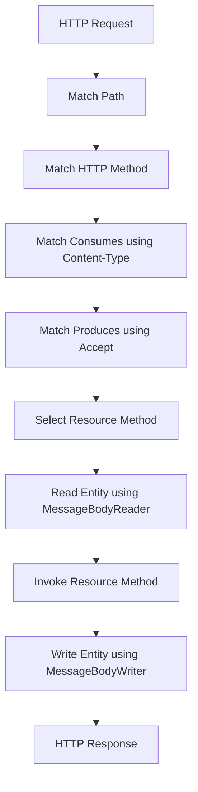

# Part 022 — Content Negotiation, CORS, Compression, Cache-Control, and ETag

> Fokus part ini: memahami metadata HTTP yang mengontrol **representation**, **browser access**, **compression**, **caching**, dan **conditional request** pada API production.

Part sebelumnya membahas status code dan header strategy.

Sekarang kita fokus pada header yang sering tampak “sekunder”, tetapi di production bisa menjadi sumber bug besar:

```text
- Content-Type
- Accept
- Accept-Encoding
- Content-Encoding
- Origin
- Access-Control-*
- Cache-Control
- ETag
- If-Match
- If-None-Match
- Vary
```

Dalam API JAX-RS, sebagian behavior ini terlihat dari annotation seperti:

```java
@Consumes(MediaType.APPLICATION_JSON)
@Produces(MediaType.APPLICATION_JSON)
```

Tetapi behavior production sebenarnya bisa dipengaruhi banyak layer:

```text
client
API gateway / APIM
load balancer
ingress
service mesh
Servlet container
JAX-RS runtime
filters/interceptors
MessageBodyReader/Writer
CDN/proxy/cache
```

Karena itu, senior engineer tidak cukup tahu annotation. Senior engineer harus tahu jalur lifecycle-nya.

---

## 1. Representation Is Not the Resource

Resource adalah konsep.

Representation adalah bentuk data yang dikirim melalui HTTP.

Example:

```text
Resource: Quote Q-1001
Representation 1: application/json
Representation 2: application/xml
Representation 3: application/pdf
Representation 4: text/csv
```

JAX-RS resource method mengembalikan Java object, tetapi HTTP response mengirim representation.

```java
@GET
@Path("/{quoteId}")
@Produces(MediaType.APPLICATION_JSON)
public QuoteResponse getQuote(@PathParam("quoteId") String quoteId) {
    return quoteService.getQuote(quoteId);
}
```

Pipeline:

```text
QuoteResponse Java object
-> MessageBodyWriter
-> JSON bytes
-> HTTP response body
-> Content-Type: application/json
```

Bug sering terjadi karena engineer menganggap Java object adalah contract. Yang menjadi contract bagi client adalah representation.

---

## 2. Content-Type vs Accept

`Content-Type` menjelaskan body yang dikirim.

```http
Content-Type: application/json
```

`Accept` menjelaskan response yang diminta client.

```http
Accept: application/json
```

For request with body:

```http
POST /quotes HTTP/1.1
Content-Type: application/json
Accept: application/json
```

Meaning:

```text
I am sending JSON.
I want JSON back.
```

Common confusion:

```text
Content-Type is not the same as Accept.
```

If request body is JSON but `Content-Type` missing, JAX-RS may not select the expected `MessageBodyReader`.

If `Accept` asks for XML but endpoint only produces JSON, runtime may return `406 Not Acceptable`.

If `Content-Type` is XML but endpoint only consumes JSON, runtime may return `415 Unsupported Media Type`.

---

## 3. JAX-RS Content Negotiation Lifecycle

Simplified lifecycle:



Important:

```text
Path/method may match, but media type matching can still fail.
```

Typical failures:

```text
404 -> path mismatch
405 -> method mismatch
415 -> request Content-Type unsupported
406 -> response Accept unsupported
500 -> provider selected but serialization fails
```

---

## 4. `@Consumes` Strategy

`@Consumes` declares what request body media types resource can consume.

Example:

```java
@POST
@Consumes(MediaType.APPLICATION_JSON)
@Produces(MediaType.APPLICATION_JSON)
public Response createQuote(CreateQuoteRequest request) {
    ...
}
```

Good practice:

```text
Declare @Consumes for methods with request body.
Avoid accepting everything unless there is a reason.
```

Bad:

```java
@POST
public Response createQuote(String rawBody) {
    ...
}
```

Why risky:

```text
- weak contract
- validation harder
- provider selection less clear
- generated contract weaker
- client integration more error-prone
```

When multiple content types are supported:

```java
@Consumes({ MediaType.APPLICATION_JSON, MediaType.APPLICATION_XML })
```

Senior review question:

```text
Does this endpoint truly support multiple media types, or is this accidental flexibility?
```

---

## 5. `@Produces` Strategy

`@Produces` declares what response media types endpoint can produce.

Example:

```java
@GET
@Path("/{quoteId}")
@Produces(MediaType.APPLICATION_JSON)
public QuoteResponse getQuote(@PathParam("quoteId") String quoteId) {
    return quoteService.getQuote(quoteId);
}
```

If supporting export:

```java
@GET
@Path("/{quoteId}/documents/proposal")
@Produces("application/pdf")
public Response downloadProposal(@PathParam("quoteId") String quoteId) {
    StreamingOutput pdf = quoteDocumentService.streamProposal(quoteId);
    return Response.ok(pdf)
        .type("application/pdf")
        .header("Content-Disposition", "attachment; filename=quote-proposal.pdf")
        .build();
}
```

Do not rely only on body shape.

Client needs `Content-Type` to decode correctly.

---

## 6. Vendor Media Types and Versioning

Some enterprise APIs use vendor media types:

```http
Accept: application/vnd.company.quote.v1+json
```

Potential benefit:

```text
- versioning via media type
- explicit representation contract
```

Potential cost:

```text
- harder client setup
- harder testing
- more provider configuration
- less friendly to generic tooling
```

Most teams choose one of:

```text
URI versioning: /v1/quotes
Header versioning: API-Version: 1
Media type versioning: application/vnd.x.v1+json
```

Internal verification:

```text
- Which versioning strategy is official?
- Is media type versioning used anywhere?
- Does OpenAPI represent it accurately?
```

---

## 7. Default Media Type Risk

Some frameworks infer default media type.

This can hide bugs.

Example:

```text
Client forgets Accept header.
Server returns JSON due to default.
Everything seems fine.
Later another client sends Accept: */* and receives unexpected representation.
```

Senior guidance:

```text
Be explicit in public/enterprise endpoints.
Use defaults intentionally, not accidentally.
```

Internal verification:

```text
- Does internal platform enforce JSON-only APIs?
- Are @Produces/@Consumes mandatory in code review?
- Does API linting require content types?
```

---

## 8. CORS Mental Model

CORS is a browser security mechanism.

It is not a general service-to-service security model.

CORS answers:

```text
May browser JavaScript from Origin A call resource at Origin B?
```

Example browser request:

```http
Origin: https://portal.example.com
```

Server response:

```http
Access-Control-Allow-Origin: https://portal.example.com
```

If browser does not accept CORS policy, it blocks response from JavaScript.

Important:

```text
CORS does not stop non-browser clients like curl, backend services, or Postman.
```

Authentication and authorization are still required.

---

## 9. Simple Request vs Preflight Request

Some cross-origin requests trigger preflight.

Browser sends:

```http
OPTIONS /quotes HTTP/1.1
Origin: https://portal.example.com
Access-Control-Request-Method: POST
Access-Control-Request-Headers: authorization,content-type
```

Server should respond:

```http
HTTP/1.1 204 No Content
Access-Control-Allow-Origin: https://portal.example.com
Access-Control-Allow-Methods: GET,POST,PUT,DELETE,OPTIONS
Access-Control-Allow-Headers: authorization,content-type,x-correlation-id
Access-Control-Max-Age: 600
```

Failure mode:

```text
POST endpoint is correct, but browser never sends POST because preflight fails.
```

Debugging clue:

```text
Backend logs may show only OPTIONS, not POST.
```

---

## 10. CORS Placement: Service vs Gateway

CORS can be handled at:

```text
- application filter
- Servlet filter
- API gateway/APIM
- ingress
- reverse proxy
```

Do not implement duplicate CORS logic in multiple layers without clear ownership.

Failure mode:

```text
Service allows origin, gateway strips header.
Gateway allows origin, service rejects OPTIONS.
Two layers emit conflicting Access-Control-Allow-Origin.
```

Internal verification checklist:

```text
- Is CORS service-owned or gateway-owned?
- Are allowed origins environment-specific?
- Are credentials allowed?
- Are wildcard origins prohibited for authenticated APIs?
- Are OPTIONS requests authenticated or bypassed?
```

---

## 11. CORS and Credentials

Credentialed browser requests require careful policy.

Example:

```http
Access-Control-Allow-Credentials: true
```

If credentials are allowed, wildcard origin is unsafe and generally invalid for browser enforcement.

Bad:

```http
Access-Control-Allow-Origin: *
Access-Control-Allow-Credentials: true
```

Better:

```http
Access-Control-Allow-Origin: https://trusted-portal.example.com
Access-Control-Allow-Credentials: true
```

Senior review:

```text
If API is authenticated and browser-accessible, CORS must be strict and environment-aware.
```

---

## 12. Compression Mental Model

Compression reduces payload size but adds CPU cost and can affect streaming.

Client request:

```http
Accept-Encoding: gzip, br
```

Server response:

```http
Content-Encoding: gzip
Vary: Accept-Encoding
```

Compression can be handled by:

```text
- application
- Servlet container
- ingress/gateway
- CDN/proxy
```

Do not assume JAX-RS itself is the compression layer.

---

## 13. Compression Trade-Offs

Benefits:

```text
- lower bandwidth
- faster large JSON transfer
- lower egress cost
```

Costs:

```text
- CPU overhead
- latency for small payloads
- complexity with streaming
- harder raw packet debugging
- possible security concern for secret-reflecting responses
```

Common rule:

```text
Compress large text responses.
Do not compress already-compressed binaries such as PDF/image/zip.
Be cautious with tiny payloads.
```

Internal verification:

```text
- Which layer performs compression?
- What minimum response size triggers compression?
- Are streaming responses compressed?
- Are binary responses excluded?
```

---

## 14. Compression and Streaming

Streaming response plus compression can behave unexpectedly.

Possible issue:

```text
Application flushes chunks.
Compression layer buffers chunks.
Client does not receive data until buffer fills.
```

This can break:

```text
- SSE
- long-running progress stream
- chunked export
- heartbeat response
```

Senior review:

```text
For streaming endpoint, verify compression behavior explicitly.
```

For SSE, often use:

```http
Cache-Control: no-cache
Content-Type: text/event-stream
```

and ensure proxy buffering/compression does not break event delivery.

---

## 15. Cache-Control Mental Model

Caching is not just performance. Caching is correctness.

`Cache-Control` tells clients/proxies how to store and reuse response.

Examples:

```http
Cache-Control: no-store
Cache-Control: no-cache
Cache-Control: private, max-age=60
Cache-Control: public, max-age=3600
```

Common misunderstanding:

```text
no-cache does not mean do not store.
no-cache means store may revalidate before reuse.
no-store means do not store.
```

For sensitive enterprise data:

```http
Cache-Control: no-store
```

is often safer.

---

## 16. Cacheability by API Type

### Sensitive quote/order detail

Likely:

```http
Cache-Control: no-store
```

because it may contain:

```text
- customer data
- pricing
- discount
- contract term
- PII/commercially sensitive data
```

### Public/static metadata

Possibly:

```http
Cache-Control: public, max-age=3600
```

for non-sensitive static reference data.

### Catalog-like data

Catalog data is tricky.

It may be cacheable but must respect:

```text
- tenant
- customer segment
- eligibility
- effective date
- catalog version
- pricing rules
```

Bad cache key can leak tenant/customer-specific catalog result.

Internal verification:

```text
- Is catalog response tenant-specific?
- Is pricing included?
- Does cache key include tenant/effective date/catalog version?
```

---

## 17. Private vs Public Cache

`private` means response is for one user/client and should not be stored by shared caches.

```http
Cache-Control: private, max-age=60
```

`public` means shared caches may store it.

```http
Cache-Control: public, max-age=3600
```

For multi-tenant enterprise APIs, defaulting to public cache can be dangerous.

Senior rule:

```text
If response depends on Authorization, tenant, user, customer, account, permission, or contract terms, do not use public shared cache unless design proves safety.
```

---

## 18. Vary Header

`Vary` tells caches which request headers influence response.

Example:

```http
Vary: Accept-Encoding
```

If response varies by media type:

```http
Vary: Accept
```

If response varies by tenant header:

```http
Vary: X-Tenant-ID
```

But using high-cardinality headers in `Vary` can reduce cache effectiveness.

Failure mode:

```text
Cache stores JSON response for one Accept/tenant combination and reuses it incorrectly for another.
```

Internal verification:

```text
- Are there shared caches?
- Which headers affect representation?
- Does gateway/CDN respect Vary?
```

---

## 19. ETag Mental Model

ETag is an entity tag: a version identifier for a representation.

Example response:

```http
HTTP/1.1 200 OK
ETag: "quote-v7"
Content-Type: application/json
```

Client can revalidate:

```http
GET /quotes/Q-1001 HTTP/1.1
If-None-Match: "quote-v7"
```

If unchanged:

```http
HTTP/1.1 304 Not Modified
```

ETag can be used for:

```text
- cache validation
- optimistic concurrency
- lost update prevention
```

But representation matters.

If JSON response changes because field ordering or derived metadata changes, ETag strategy must be clear.

---

## 20. Strong vs Weak ETag

Strong ETag:

```http
ETag: "abc123"
```

Means representation is byte-for-byte equivalent for strong comparison.

Weak ETag:

```http
ETag: W/"abc123"
```

Means semantically equivalent but not byte-identical.

For APIs, many teams use version-based ETag:

```text
ETag = hash(resourceVersion + representationVersion)
```

Potential issue:

```text
If ETag is only DB row version, but response includes computed pricing, permission-sensitive fields, or tenant-specific projection, ETag may be wrong.
```

Internal verification:

```text
- Is ETag used?
- Is it strong or weak?
- Is it based on DB version, updatedAt, hash, or representation version?
```

---

## 21. Conditional GET with If-None-Match

Flow:

```text
1. Client GETs resource.
2. Server returns ETag.
3. Client sends If-None-Match on later GET.
4. Server returns 304 if unchanged.
```

Example:

```http
GET /catalogs/current HTTP/1.1
If-None-Match: "catalog-v42"
```

Response if unchanged:

```http
HTTP/1.1 304 Not Modified
ETag: "catalog-v42"
```

Benefit:

```text
Reduce payload transfer for large stable resources.
```

Risk:

```text
Wrong ETag can return stale catalog/pricing data.
```

---

## 22. Conditional Update with If-Match

Flow:

```text
1. Client GETs resource with ETag.
2. Client updates using If-Match.
3. Server updates only if current ETag matches.
4. If mismatch, server returns 412.
```

Example:

```http
PUT /quotes/Q-1001 HTTP/1.1
If-Match: "quote-v7"
Content-Type: application/json
```

If current version is v8:

```http
HTTP/1.1 412 Precondition Failed
```

This prevents lost updates.

Alternative:

```json
{
  "quoteId": "Q-1001",
  "version": 7,
  "changes": {
    "requestedTermMonths": 24
  }
}
```

Both models are valid if standardized.

Senior review:

```text
For mutable resources, what prevents stale client overwriting newer state?
```

---

## 23. ETag, Authorization, and Tenant Isolation

ETag must not leak cross-tenant information.

Bad design:

```text
Global sequential version appears in ETag and lets caller infer other tenants' updates.
```

Bad cache design:

```text
Shared cache keys only by path, ignoring Authorization/Tenant.
```

For tenant-sensitive resource, cache and ETag strategy must include tenant/security boundary.

Internal verification:

```text
- Are tenant-specific responses cacheable?
- Does cache key include tenant/security context?
- Can ETag leak internal versioning or activity?
```

---

## 24. Cache-Control for Error Responses

Error responses can also be cached accidentally.

Example risk:

```text
404 for resource not yet created gets cached.
Later resource is created.
Client still sees cached 404.
```

For dynamic APIs, consider explicit:

```http
Cache-Control: no-store
```

on error responses unless there is a deliberate policy.

Rate limit response may use:

```http
HTTP/1.1 429 Too Many Requests
Retry-After: 30
Cache-Control: no-store
```

Internal verification:

```text
- Are errors cacheable by gateway/proxy?
- Are 404/403 responses cached?
- Does API gateway apply default cache rules?
```

---

## 25. Caching and POST

GET is naturally cache-friendly. POST usually is not cached by default in typical API usage.

But some command-like endpoints are expensive and deterministic.

Example:

```text
POST /pricing/preview
```

It might be tempting to cache.

Danger:

```text
Pricing depends on tenant, customer, agreement, catalog version, effective date, discount permission, currency, tax boundary.
```

If caching is used, key must include all correctness dimensions.

Often safer:

```text
- explicit idempotency key
- explicit quote/pricing run resource
- server-side result persistence
- cache only internal pure calculation with robust key
```

Senior review:

```text
Is this really cache, or should it be a materialized resource/result?
```

---

## 26. JAX-RS Implementation Patterns

### Explicit media types

```java
@Path("/quotes")
@Produces(MediaType.APPLICATION_JSON)
@Consumes(MediaType.APPLICATION_JSON)
public class QuoteResource {
    ...
}
```

Class-level annotation sets default for methods.

Method-level annotation can override:

```java
@GET
@Path("/{quoteId}/proposal.pdf")
@Produces("application/pdf")
public Response proposalPdf(@PathParam("quoteId") String quoteId) {
    ...
}
```

Review question:

```text
Is the override obvious and documented?
```

---

### Cache-Control in response

```java
CacheControl cache = new CacheControl();
cache.setNoStore(true);

return Response
    .ok(response)
    .cacheControl(cache)
    .build();
```

For public cache:

```java
CacheControl cache = new CacheControl();
cache.setMaxAge(3600);
cache.setPrivate(false);

return Response
    .ok(response)
    .cacheControl(cache)
    .tag(etag)
    .build();
```

---

### Conditional request handling

```java
@GET
@Path("/{quoteId}")
public Response getQuote(
        @PathParam("quoteId") String quoteId,
        @Context Request request
) {
    QuoteResponse quote = quoteService.getQuote(quoteId);
    EntityTag etag = new EntityTag(quote.versionTag());

    Response.ResponseBuilder preconditions = request.evaluatePreconditions(etag);
    if (preconditions != null) {
        return preconditions
            .cacheControl(noStoreOrPolicy())
            .build();
    }

    return Response
        .ok(quote)
        .tag(etag)
        .cacheControl(noStoreOrPolicy())
        .build();
}
```

Note:

```text
This is a pattern. Actual implementation depends on internal framework conventions.
```

---

### If-Match for update

```java
@PUT
@Path("/{quoteId}")
public Response updateQuote(
        @PathParam("quoteId") String quoteId,
        @HeaderParam("If-Match") String ifMatch,
        UpdateQuoteRequest request
) {
    if (ifMatch == null || ifMatch.isBlank()) {
        return Response.status(428).build(); // if internal policy uses 428
    }

    QuoteResponse updated = quoteService.updateIfVersionMatches(
        quoteId,
        request,
        parseEtag(ifMatch)
    );

    return Response.ok(updated)
        .tag(new EntityTag(updated.versionTag()))
        .build();
}
```

`428 Precondition Required` can be used if policy requires conditional update. Verify internal standard before using.

---

## 27. Gateway and Proxy Interaction

Application code is not the only actor.

Gateway may:

```text
- terminate TLS
- compress response
- add security headers
- enforce CORS
- cache GET responses
- strip hop-by-hop headers
- add request ID
- normalize status code
- handle OPTIONS
- enforce max body size
```

Therefore:

```text
A behavior observed in curl against service port may differ from behavior through gateway.
```

Testing should include both:

```text
- service-level tests
- gateway/integration environment tests
```

---

## 28. Hop-by-Hop vs End-to-End Headers

Some headers are hop-by-hop and should not be forwarded blindly.

Examples:

```text
Connection
Keep-Alive
Transfer-Encoding
Upgrade
Proxy-Authenticate
Proxy-Authorization
TE
Trailer
```

End-to-end headers describe the message/resource across intermediaries.

Examples:

```text
Content-Type
Cache-Control
ETag
Authorization
traceparent
```

Senior concern:

```text
Do not build business logic on headers that may be removed or changed by intermediaries.
```

---

## 29. Failure Modes

| Failure mode | Symptom | Likely cause | Detection |
|---|---|---|---|
| 415 Unsupported Media Type | POST fails before method invoked | missing/wrong Content-Type | access log, JAX-RS logs |
| 406 Not Acceptable | client cannot get response | Accept mismatch | raw HTTP test |
| Browser CORS error | UI call blocked, backend may look fine | preflight/header policy | browser devtools, OPTIONS logs |
| Compression breaks stream | delayed SSE/chunks | proxy buffering/compression | packet timing, client trace |
| Stale quote/catalog | client sees old data | wrong Cache-Control/ETag | cache logs, response headers |
| Cross-tenant data leak | severe security incident | cache key ignores tenant/auth | audit/security investigation |
| Lost update | user overwrites newer state | missing If-Match/version check | DB version conflict analysis |
| 304 when data changed | stale cache | wrong ETag generation | conditional GET tests |
| Huge payload latency | slow response | no compression/pagination | payload metrics |

---

## 30. Debugging Workflow

When content negotiation/caching behavior is wrong:

```text
1. Capture raw request and response headers.
2. Confirm path/method matched expected endpoint.
3. Check Content-Type and Accept.
4. Check @Consumes/@Produces.
5. Check MessageBodyReader/Writer registration.
6. Check filters/interceptors.
7. Check gateway/ingress CORS/compression/cache policy.
8. Check client library default headers.
9. Check OpenAPI contract.
10. Reproduce with curl using explicit headers.
```

Useful curl commands:

```bash
curl -i \
  -H 'Accept: application/json' \
  https://example.internal/quotes/Q-1001
```

```bash
curl -i \
  -X POST \
  -H 'Content-Type: application/json' \
  -H 'Accept: application/json' \
  --data '{"customerId":"C-100"}' \
  https://example.internal/quotes
```

Preflight simulation:

```bash
curl -i \
  -X OPTIONS \
  -H 'Origin: https://portal.example.com' \
  -H 'Access-Control-Request-Method: POST' \
  -H 'Access-Control-Request-Headers: authorization,content-type,x-correlation-id' \
  https://example.internal/quotes
```

Conditional request:

```bash
curl -i \
  -H 'If-None-Match: "quote-v7"' \
  https://example.internal/quotes/Q-1001
```

---

## 31. Testing Strategy

Tests should cover protocol behavior, not only Java object behavior.

Minimum endpoint tests:

```text
- correct Content-Type response
- unsupported request Content-Type -> 415
- unsupported Accept -> 406, if runtime policy supports it
- required CORS behavior, if service-owned
- Cache-Control for sensitive response
- ETag presence/absence according to policy
- If-Match stale update -> 412 or internal equivalent
- no-store for error response, if required
```

Contract tests:

```text
- OpenAPI documents media types
- OpenAPI documents headers
- generated client can call endpoint
- status/header behavior matches contract
```

Integration environment tests:

```text
- gateway does not strip required headers
- compression behavior matches policy
- CORS works through real entrypoint
- cache headers survive ingress/APIM
```

---

## 32. PR Review Checklist

Review these questions:

```text
Content negotiation
- Are @Consumes/@Produces explicit?
- Are supported media types intentional?
- Does OpenAPI match implementation?
- Are 406/415 cases understood?

CORS
- Is this endpoint browser-accessible?
- Is CORS handled by service or gateway?
- Are allowed origins strict?
- Are credentials handled safely?
- Does preflight work?

Compression
- Is payload large enough to benefit?
- Is compression done by gateway/platform?
- Could compression break streaming/SSE?
- Are binaries excluded?

Caching
- Is response sensitive to user/tenant/customer/authorization?
- Should it be no-store, private, or public?
- Is Vary correct?
- Are error responses cache-safe?

ETag/conditional request
- Is ETag needed?
- Is ETag based on correct representation/version?
- Is If-Match needed to prevent lost update?
- Is stale update handled deterministically?

Operations
- Can headers be observed in logs/traces?
- Are gateway/platform policies documented?
- Are integration tests hitting the real ingress path?
```

---

## 33. Internal Verification Checklist

Verify internally:

```text
API governance
- Are @Consumes/@Produces required by style guide?
- Is JSON the only standard representation?
- Are XML/PDF/CSV endpoints allowed and governed?
- Is media type versioning used?

CORS
- Which layer owns CORS?
- Are origins configured per environment?
- Are authenticated browser APIs allowed?
- Are OPTIONS requests routed to service or gateway?

Compression
- Which layer compresses responses?
- What payload threshold is used?
- Are streaming endpoints excluded?
- Are binary payloads excluded?

Caching
- Are any APIs cacheable?
- Are quote/order/customer/pricing responses forced no-store?
- Are catalog responses cacheable?
- Is tenant included in cache key?
- Does gateway/APIM cache anything by default?

ETag/conditional request
- Is ETag used in existing APIs?
- Is optimistic concurrency exposed through If-Match or body version?
- Are 304/412/428 part of internal status code policy?
- Are ETags representation-specific?

Testing/observability
- Are raw HTTP headers tested?
- Are response headers visible in logs/traces?
- Are gateway header mutations documented?
```

---

## 34. Senior Engineer Heuristics

Use these rules:

```text
If request has body, Content-Type matters.
If response body has format, Content-Type matters.
If client asks for unsupported Accept, expect 406 or governed fallback.
If endpoint is browser-accessible, CORS must be explicitly owned.
If response is sensitive, default to no-store.
If response varies by tenant/user/auth, shared cache is dangerous.
If resource is mutable, consider lost update prevention.
If using ETag, define what representation/version it represents.
If using streaming, verify compression/proxy buffering.
If gateway manages a behavior, test through gateway, not only service port.
```

---

## 35. Key Takeaways

Content negotiation, CORS, compression, caching, and ETag are not optional HTTP trivia.

They control:

```text
- whether request reaches resource method
- whether response can be decoded
- whether browser can call API
- whether large payloads are efficient
- whether stale data can appear
- whether tenant data can leak through cache
- whether lost updates are prevented
```

A senior engineer should not just ask:

```text
Does the endpoint return the expected JSON?
```

Ask:

```text
Does the endpoint behave correctly as an HTTP contract across clients, gateways, caches, browsers, retries, and concurrent updates?
```
