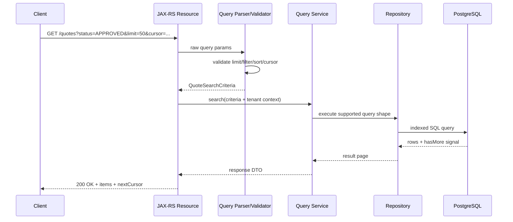

# Part 023 — Pagination, Filtering, Sorting, and Partial Response

> Fokus part ini: mendesain endpoint list/search yang tetap **benar**, **stabil**, **efisien**, dan **backward-compatible** ketika jumlah data tumbuh besar.

Di sistem enterprise seperti quote/order management, banyak endpoint bukan sekadar mengambil satu resource.
Sering kali API harus mendukung:

```text
- list quote
- search order
- filter catalog item
- list customer subscriptions
- export candidate rows
- show paginated work queue
- retrieve audit event history
- retrieve workflow task list
```

Endpoint seperti ini terlihat sederhana, tetapi failure mode-nya banyak:

```text
- query makin lambat saat data membesar
- pagination menghasilkan duplikasi atau data hilang
- sorting tidak stabil
- filter grammar tidak jelas
- client meminta terlalu banyak field
- API sulit berevolusi karena query contract tidak dirancang
- database index tidak cocok dengan API filter/sort
- endpoint menjadi accidental reporting engine
```

Senior engineer harus melihat query API sebagai kontrak antara:

```text
client need
HTTP API contract
JAX-RS resource method
query parser
service rule
repository/database query
indexing strategy
observability and rate control
```

Bukan hanya `GET /items?page=1`.

---

## 1. Mental Model: Query API Is a Read Contract with Cost

Endpoint query biasanya safe secara HTTP, tetapi bukan berarti murah.

```http
GET /quotes?status=APPROVED&page=1&pageSize=50
```

Secara semantic, request ini tidak mengubah state. Tetapi secara operational, ia bisa mahal:

```text
- scan banyak row
- join banyak table
- sort besar
- aggregate
- deserialize response besar
- consume DB connection lama
- consume CPU API service
- menghasilkan payload besar
```

Jadi ada dua dimensi yang harus dipisahkan:

```text
HTTP semantic: safe/read-only
Operational cost: bisa murah, sedang, mahal, atau berbahaya
```

Senior-level rule:

```text
Every query API must have a bounded cost model.
```

Bounded berarti:

```text
- ada limit maksimum
- ada filter yang jelas
- ada sorting yang stabil
- ada index strategy
- ada timeout
- ada observability
- ada policy untuk expensive query
```

---

## 2. Pagination Is Not Just page and size

Pagination adalah mekanisme membatasi result set agar API tidak mengembalikan seluruh data sekaligus.

Naive pattern:

```http
GET /quotes?page=1&size=50
```

Masalahnya bukan syntax. Masalahnya adalah semantic.

Pertanyaan yang harus dijawab:

```text
- page dimulai dari 0 atau 1?
- size maksimum berapa?
- sorting default apa?
- data berubah saat client membaca page berikutnya, apa yang terjadi?
- apakah total count wajib dikembalikan?
- apakah pagination stabil untuk data besar?
- apakah filter/sort didukung index?
```

Tanpa jawaban jelas, pagination menjadi sumber bug yang sulit direproduksi.

---

## 3. Offset Pagination

Offset pagination memakai konsep offset dan limit.

Example:

```http
GET /quotes?offset=100&limit=50
```

SQL mental model:

```sql
SELECT *
FROM quote
WHERE status = 'APPROVED'
ORDER BY created_at DESC, id DESC
LIMIT 50 OFFSET 100;
```

Atau page-based:

```text
page = 3
size = 50
offset = (page - 1) * size
```

### Kelebihan

```text
- mudah dipahami client
- mudah implementasi
- cocok untuk UI sederhana
- bisa langsung lompat ke halaman tertentu
```

### Kelemahan

```text
- semakin besar offset, query biasanya semakin mahal
- data bisa bergeser saat ada insert/delete
- page berikutnya bisa duplicate atau skip row
- total count bisa mahal
```

Offset pagination cocok untuk:

```text
- dataset kecil/sedang
- admin page internal dengan filter ketat
- report sederhana
- data yang tidak terlalu sering berubah
```

Tidak ideal untuk:

```text
- high-volume event/audit log
- work queue aktif
- infinite scroll besar
- dataset dengan insert/delete intensif
```

---

## 4. Cursor Pagination

Cursor pagination memakai token/anchor dari row terakhir yang dibaca.

Example:

```http
GET /quotes?limit=50&cursor=eyJjcmVhdGVkQXQiOiIyMDI2LTA3LTEwVDA5OjAwOjAwWiIsImlkIjoiUTEyMyJ9
```

Response:

```json
{
  "items": [
    { "id": "Q-123", "status": "APPROVED" }
  ],
  "nextCursor": "eyJjcmVhdGVkQXQiOiIyMDI2LTA3LTEwVDA4OjU5OjAwWiIsImlkIjoiUTEyMiJ9",
  "hasMore": true
}
```

SQL mental model:

```sql
SELECT *
FROM quote
WHERE status = 'APPROVED'
  AND (created_at, id) < (:lastCreatedAt, :lastId)
ORDER BY created_at DESC, id DESC
LIMIT 50;
```

### Kelebihan

```text
- lebih stabil untuk data besar
- lebih efisien daripada OFFSET besar
- cocok untuk infinite scroll dan feed
- mengurangi duplicate/skip jika sort key stabil
```

### Kelemahan

```text
- client tidak bisa lompat bebas ke halaman N
- token harus dirancang dan divalidasi
- sorting harus dibatasi
- perubahan filter/sort harus invalidate cursor
```

Cursor pagination cocok untuk:

```text
- audit event
- activity feed
- search result besar
- background processing list
- high-volume quote/order history
```

---

## 5. Cursor Must Encode Query Shape

Cursor yang baik bukan hanya `lastId`.

Cursor harus mengikat:

```text
- sort field
- sort direction
- last seen value
- stable tie-breaker
- filter fingerprint
- maybe tenant/context
- maybe expiry
```

Bad cursor:

```text
cursor=Q-123
```

Masalah:

```text
- tidak tahu sorting apa
- tidak tahu filter apa
- bisa dipakai ulang untuk query berbeda
- berisiko cross-tenant jika tidak divalidasi
```

Better conceptual cursor payload:

```json
{
  "sort": ["createdAt:desc", "id:desc"],
  "last": {
    "createdAt": "2026-07-10T09:00:00Z",
    "id": "Q-123"
  },
  "filterHash": "abc123",
  "tenantId": "tenant-a",
  "expiresAt": "2026-07-10T10:00:00Z"
}
```

Cursor sebaiknya opaque bagi client.

```text
Client should store and send cursor, not interpret it.
```

---

## 6. Sorting Must Be Stable

Pagination tanpa stable sorting adalah bug tersembunyi.

Unstable sorting:

```sql
ORDER BY created_at DESC
```

Jika banyak row punya `created_at` sama, database boleh mengembalikan urutan berbeda antar request.

Stable sorting:

```sql
ORDER BY created_at DESC, id DESC
```

Tie-breaker harus:

```text
- unique
- deterministic
- available in index
- included in cursor if cursor pagination
```

Common tie-breaker:

```text
- primary key
- monotonically increasing id
- created_at + id
- version + id
```

PR review question:

```text
If two rows have the same primary sort value, is the result order deterministic?
```

---

## 7. Sorting API Design

Common API style:

```http
GET /quotes?sort=-createdAt,id
```

Meaning:

```text
-createdAt => descending
id         => ascending
```

Alternative:

```http
GET /quotes?sortBy=createdAt&sortDirection=desc
```

For enterprise APIs, prefer clarity over cleverness.

Good sort contract must define:

```text
- allowed sort fields
- default sort
- tie-breaker
- invalid sort behavior
- stable field names independent from DB column names
- whether multi-sort is supported
```

Avoid exposing raw DB column names:

```text
Bad:
  sort=q.created_at desc

Better:
  sort=-createdAt
```

API field names should be contract names, not schema internals.

---

## 8. Filtering API Design

Filtering looks simple until it becomes a language.

Simple pattern:

```http
GET /quotes?status=APPROVED&customerId=C-123
```

Good for common exact filters.

But enterprise systems often need:

```text
- equality
- range
- contains
- startsWith
- enum set
- date window
- tenant/customer boundary
- full-text search
- lifecycle status
- effective date
```

Possible patterns:

### 8.1 Simple Query Params

```http
GET /quotes?status=APPROVED&createdFrom=2026-01-01&createdTo=2026-02-01
```

Good for stable, curated filters.

### 8.2 Repeated Params

```http
GET /quotes?status=APPROVED&status=PENDING
```

Meaning must be defined:

```text
status IN (APPROVED, PENDING)
```

### 8.3 Comma-Separated Values

```http
GET /quotes?status=APPROVED,PENDING
```

Simpler URL, but escaping and parsing rules must be explicit.

### 8.4 Filter Expression

```http
GET /quotes?filter=status:APPROVED AND createdAt>=2026-01-01
```

Powerful, but risky.

Risks:

```text
- turns API into query language
- hard to lint
- hard to index
- injection risk
- hard to preserve backward compatibility
- client-specific queries become hidden dependencies
```

Senior-level bias:

```text
Prefer curated filters unless there is a strong product need for expression filtering.
```

---

## 9. Filtering Must Align with Indexes

API filter is not just HTTP design. It creates database obligations.

Example API:

```http
GET /quotes?tenantId=T1&status=APPROVED&createdFrom=2026-01-01&sort=-createdAt
```

Likely index need:

```sql
CREATE INDEX idx_quote_tenant_status_created_id
ON quote (tenant_id, status, created_at DESC, id DESC);
```

But index design depends on query cardinality and workload.

The point is not to blindly create this exact index. The point is:

```text
Every public filter/sort combination should be reviewed against database access path.
```

Bad API governance:

```text
Let client filter on anything, then hope database survives.
```

Better API governance:

```text
Expose only supported filter/sort combinations with known performance envelopes.
```

---

## 10. Partial Response and Field Selection

Partial response allows client to request subset of fields.

Example:

```http
GET /quotes/Q-123?fields=id,status,totalPrice,currency
```

Benefits:

```text
- smaller payload
- faster client rendering
- less network cost
- useful for list views
```

Risks:

```text
- field grammar becomes contract
- security leak if fields bypass authorization
- partial mapping complexity
- caching becomes harder
- tests multiply
```

Partial response is not always necessary. Sometimes better pattern is separate summary DTO:

```text
GET /quotes             -> QuoteSummaryResponse
GET /quotes/{quoteId}   -> QuoteDetailResponse
```

For enterprise systems, curated DTOs are usually easier to govern than arbitrary field selection.

Use partial response when:

```text
- clients are numerous and field needs vary significantly
- payloads are very large
- contract governance is mature
- field-level authorization is clear
```

Avoid when:

```text
- domain model is unstable
- security model is complex
- generated clients are strict
- observability cannot show requested field combinations
```

---

## 11. Count Strategy

Many paginated APIs return total count:

```json
{
  "items": [],
  "page": 1,
  "size": 50,
  "totalItems": 123456,
  "totalPages": 2470
}
```

This looks nice for UI, but `COUNT(*)` can be expensive depending on filter and table size.

Alternatives:

```text
- return hasMore only
- return approximate count
- return count only for small/filtered result
- return count from materialized view/cache
- make count optional: includeTotal=true
```

Example:

```http
GET /quotes?status=APPROVED&limit=50&includeTotal=false
```

Senior-level question:

```text
Does the UI truly need exact total count, or only needs next/previous?
```

---

## 12. Query Cost Control

Every list/search endpoint should enforce:

```text
- max page size
- default page size
- allowed sort fields
- allowed filter fields
- timeout
- max date range if applicable
- tenant boundary
- rate limit if expensive
- observability for slow queries
```

Example policy:

```text
Default limit: 50
Max limit: 200
Max date range: 90 days unless privileged
Allowed sort: createdAt, updatedAt, status
Default sort: createdAt DESC, id DESC
```

Do not allow:

```http
GET /quotes?limit=1000000
```

Do not allow unbounded date windows for high-volume history:

```http
GET /audit-events?from=2000-01-01&to=2026-07-10
```

Unless it is an explicit export/reporting path with async processing.

---

## 13. Query API vs Export API

Interactive query API and export API are different workloads.

Interactive query:

```text
- low latency
- small page
- immediate response
- synchronous
- user-facing
```

Export:

```text
- large result set
- background job
- async status
- file output
- retry/recovery
- audit trail
```

Bad pattern:

```http
GET /quotes?limit=1000000
```

Better pattern:

```http
POST /quote-exports
GET /quote-exports/{exportId}
GET /quote-exports/{exportId}/file
```

This preserves API health and gives operations a better model.

---

## 14. JAX-RS Implementation Pattern

Simple query params:

```java
@GET
@Path("/quotes")
@Produces(MediaType.APPLICATION_JSON)
public QuotePageResponse listQuotes(
        @QueryParam("status") List<String> statuses,
        @QueryParam("createdFrom") String createdFrom,
        @QueryParam("createdTo") String createdTo,
        @QueryParam("limit") @DefaultValue("50") int limit,
        @QueryParam("cursor") String cursor,
        @QueryParam("sort") @DefaultValue("-createdAt") String sort
) {
    QuoteQuery query = QuoteQueryParser.parse(
            statuses,
            createdFrom,
            createdTo,
            limit,
            cursor,
            sort
    );

    return quoteQueryService.search(query);
}
```

But production code should avoid putting all parsing and validation inside resource method.

Better shape:

```text
Resource method
-> query input object
-> parser/validator
-> service query object
-> repository query
-> response mapper
```

Example boundary:

```java
public final class QuoteQueryRequest {
    public List<String> status;
    public String createdFrom;
    public String createdTo;
    public Integer limit;
    public String cursor;
    public String sort;
}
```

Then parse into internal immutable object:

```java
public record QuoteSearchCriteria(
        Set<QuoteStatus> statuses,
        Instant createdFrom,
        Instant createdTo,
        PageLimit limit,
        Optional<Cursor> cursor,
        SortSpec sort
) {}
```

Why?

```text
- resource layer handles transport
- parser handles API syntax
- service handles business rules
- repository handles DB access
```

---

## 15. Query Grammar Should Be Explicit

Document grammar like code.

Bad docs:

```text
Use filter to filter quotes.
```

Better docs:

```text
Supported filters:
- status: exact enum match, repeatable
- customerId: exact match
- createdFrom: inclusive ISO-8601 timestamp
- createdTo: exclusive ISO-8601 timestamp

Supported sorting:
- createdAt asc/desc
- updatedAt asc/desc
- quoteNumber asc/desc

Default:
- sort=-createdAt,-id
- limit=50
- max limit=200
```

Ambiguity creates consumer-specific assumptions.

---

## 16. Inclusive vs Exclusive Date Range

Date range must define boundaries.

Bad:

```http
GET /quotes?from=2026-01-01&to=2026-01-31
```

Ambiguous:

```text
Is to inclusive?
Does it mean 2026-01-31T00:00 or end of day?
Which timezone?
```

Better:

```http
GET /quotes?createdFrom=2026-01-01T00:00:00Z&createdTo=2026-02-01T00:00:00Z
```

Policy:

```text
from: inclusive
to: exclusive
format: ISO-8601 instant
storage: UTC
```

This avoids off-by-one-day bugs and DST bugs.

---

## 17. Tenant Boundary in Query APIs

For multi-tenant systems, tenant filtering must not be optional client input unless the API is explicitly administrative.

Risky:

```http
GET /quotes?tenantId=T1
```

If client can alter tenantId, tenant isolation depends on trust in input.

Safer model:

```text
Authentication token / request context
-> tenant resolver
-> tenant-aware query criteria
-> repository always includes tenant predicate
```

JAX-RS conceptual flow:

```text
ContainerRequestFilter authenticates request
-> SecurityContext / TenantContext established
-> resource method receives query params
-> service combines query criteria with tenant context
-> repository enforces tenant predicate
```

PR review question:

```text
Can a caller influence tenant scope by changing query params?
```

---

## 18. Security and Authorization in List APIs

List endpoint often leaks more than detail endpoint.

Example:

```http
GET /quotes?customerId=C-123
```

Even if response hides details, existence itself can be sensitive:

```text
- quote exists
- customer has product
- order status changed
- account has billing issue
```

Authorization must apply to:

```text
- row visibility
- field visibility
- filter permission
- sort permission if it exposes sensitive fields
- export permission
```

Field-level partial response must not bypass authorization.

---

## 19. API Response Shape for Pagination

Offset response example:

```json
{
  "items": [
    {
      "id": "Q-123",
      "status": "APPROVED"
    }
  ],
  "page": {
    "offset": 0,
    "limit": 50,
    "hasMore": true
  }
}
```

Cursor response example:

```json
{
  "items": [
    {
      "id": "Q-123",
      "status": "APPROVED"
    }
  ],
  "page": {
    "limit": 50,
    "nextCursor": "opaque-token",
    "hasMore": true
  }
}
```

Avoid exposing implementation details:

```json
{
  "sqlOffset": 100,
  "tableName": "quote"
}
```

Response contract should be stable even if implementation changes.

---

## 20. Error Strategy for Query APIs

Invalid query should usually return `400 Bad Request`.

Examples:

```text
- unsupported sort field
- invalid enum value
- invalid date format
- limit above maximum
- cursor malformed
- cursor expired
- filter not allowed
```

Use specific error code:

```json
{
  "errorCode": "INVALID_SORT_FIELD",
  "message": "Sort field 'priceInternalCode' is not supported.",
  "details": {
    "allowedSortFields": ["createdAt", "updatedAt", "quoteNumber"]
  }
}
```

Do not silently ignore invalid filters.

Bad:

```text
Client sends status=APPROVEDD
Server ignores it and returns all quotes
```

This can create serious data exposure.

---

## 21. Observability for Query APIs

Log and metrics should capture query shape without leaking sensitive data.

Useful attributes:

```text
- endpoint
- tenant category, not raw tenant ID if high-cardinality policy forbids it
- page size
- pagination type
- sort field
- filter count
- date range bucket
- result count
- DB duration
- total duration
- timeout/error code
```

Avoid high-cardinality labels:

```text
- raw customerId
- raw quoteId
- raw search text
- raw cursor
```

Structured log example:

```json
{
  "event": "quote.search.completed",
  "limit": 50,
  "paginationType": "cursor",
  "sort": "createdAt.desc,id.desc",
  "filterCount": 3,
  "resultCount": 50,
  "durationMs": 82,
  "dbDurationMs": 61
}
```

---

## 22. Mermaid: Query API Lifecycle



---

## 23. Common Failure Modes

### 23.1 Duplicate Rows Across Pages

Cause:

```text
- unstable sort
- offset pagination while data changes
- missing tie-breaker
```

Fix:

```text
- add deterministic secondary sort
- use cursor pagination for high-change data
- encode tie-breaker in cursor
```

### 23.2 Missing Rows Across Pages

Cause:

```text
- insert/delete shifts offset
- inconsistent filter between requests
- cursor not tied to filter
```

Fix:

```text
- use cursor
- bind cursor to filter hash
- define snapshot semantics if required
```

### 23.3 Slow Search Endpoint

Cause:

```text
- unbounded limit
- unsupported filter combination
- missing index
- expensive count
- broad date range
```

Fix:

```text
- bound query cost
- add or adjust index
- remove exact count from hot path
- add async export path
```

### 23.4 Data Leak Through Filter

Cause:

```text
- tenantId accepted as plain query param
- row-level authorization not enforced
- filter allows probing existence
```

Fix:

```text
- tenant from trusted context
- enforce row visibility in repository/service
- audit sensitive search access
```

### 23.5 Breaking Client with Sort/Filter Change

Cause:

```text
- undocumented filter grammar
- changing default sort
- removing enum value
- changing field name
```

Fix:

```text
- treat query params as contract
- version/deprecate breaking changes
- add compatibility tests
```

---

## 24. Debugging Workflow

When a query API is slow or wrong, debug in this order:

```text
1. Capture exact request path and query params.
2. Identify tenant/security context.
3. Identify parsed query criteria.
4. Verify default limit/sort/filter.
5. Verify SQL generated/executed.
6. Check query plan and index usage.
7. Check DB duration vs service duration.
8. Check result count and page metadata.
9. Check cursor content if possible internally.
10. Check gateway/proxy timeout and response size.
```

Useful questions:

```text
- Did the service execute the query shape we think it executed?
- Did defaults apply unexpectedly?
- Did invalid filters get ignored?
- Did repository include tenant predicate?
- Did query use index or scan?
- Is exact count dominating latency?
```

---

## 25. PR Review Checklist

For a new list/search endpoint, review:

```text
API contract:
- Is pagination mandatory?
- Is default limit defined?
- Is max limit enforced?
- Is sort stable?
- Are filter fields documented?
- Are invalid filters rejected?
- Are date boundaries clear?
- Is total count necessary?

Compatibility:
- Are query param names stable?
- Is default sort safe to change later?
- Are response metadata fields additive?
- Is cursor opaque?

Security:
- Is tenant resolved from trusted context?
- Is row-level authorization enforced?
- Are sensitive fields protected?
- Can filters be used for enumeration/probing?

Performance:
- Are filter/sort combinations indexable?
- Is exact count expensive?
- Is there timeout/backpressure?
- Is export separated from interactive query?

Observability:
- Are query shape metrics/logs available?
- Are slow queries traceable?
- Are high-cardinality labels avoided?
```

---

## 26. Internal Verification Checklist

Untuk codebase internal CSG, jangan berasumsi. Verifikasi:

```text
API convention:
- Apakah pagination memakai page/size, offset/limit, atau cursor?
- Apakah ada standard response envelope?
- Apakah total count wajib atau optional?
- Apakah ada API style guide untuk filter/sort?

JAX-RS implementation:
- Bagaimana query params dibind?
- Apakah ada custom ParamConverter?
- Apakah ada common query parser?
- Apakah validation dilakukan di resource, service, atau shared library?

Database alignment:
- Filter/sort umum apakah punya index?
- Apakah query generated oleh MyBatis/JDBC?
- Apakah ada slow query dashboard?
- Apakah exact count dipakai di endpoint besar?

Security/tenancy:
- Tenant berasal dari token/header/context atau query param?
- Apakah repository selalu enforce tenant predicate?
- Apakah list endpoint punya authorization test?

Observability:
- Apakah query API mencatat duration, result size, limit, sort?
- Apakah cursor error bisa dilacak?
- Apakah slow query correlated dengan trace ID?

Operational policy:
- Apakah ada max page size standard?
- Apakah expensive query diarahkan ke async export?
- Apakah API gateway punya limit body/response size?
```

---

## 27. Senior-Level Heuristics

Gunakan heuristik berikut:

```text
1. Any unbounded query is a production incident waiting to happen.
2. Any paginated endpoint without stable sort is probably wrong.
3. Any public filter creates an indexing and compatibility obligation.
4. Any exact total count on large data must be justified.
5. Any cursor must be opaque and bound to query shape.
6. Any tenant-aware query must derive tenant from trusted context.
7. Any export-sized workload should not be a normal GET list endpoint.
8. Any undocumented filter grammar becomes accidental public API.
```

---

## 28. What Good Looks Like

A good enterprise query API has:

```text
- bounded page size
- documented filters
- documented sort fields
- stable default sort
- tenant-safe query boundary
- index-aware query shapes
- explicit error for invalid query
- cursor or offset chosen intentionally
- observability for query cost
- compatibility policy
- async export path for large result
```

Example contract summary:

```text
GET /quotes

Pagination:
- cursor-based
- default limit 50
- max limit 200

Sort:
- default: createdAt desc, id desc
- supported: createdAt, updatedAt, quoteNumber

Filters:
- status: repeatable enum
- customerId: exact match
- createdFrom: inclusive ISO-8601 instant
- createdTo: exclusive ISO-8601 instant

Security:
- tenant is resolved from authenticated context
- caller only sees authorized quotes

Response:
- items
- page.limit
- page.nextCursor
- page.hasMore
```

---

## 29. Key Takeaways

Query API design is production engineering.

The hard part is not adding `@QueryParam`.

The hard part is controlling:

```text
- cost
- stability
- compatibility
- security
- index alignment
- operational visibility
```

For JAX-RS enterprise services, the senior engineer's job is to make query endpoints boring under load, safe under multi-tenancy, predictable for clients, and debuggable during incidents.
