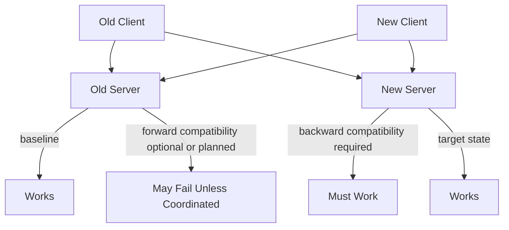
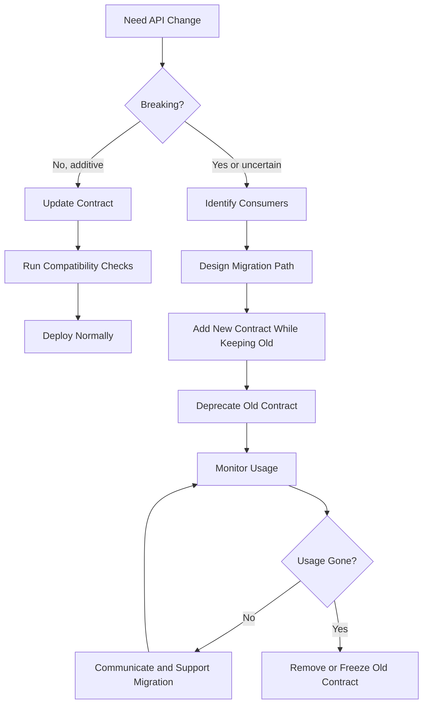

# Part 024 — API Versioning, Backward Compatibility, and Deprecation Policy

> Fokus part ini: memahami bagaimana API JAX-RS enterprise harus berevolusi tanpa merusak consumer, integrasi, workflow, dan release train.

Di sistem enterprise, API jarang hanya punya satu consumer.

Satu endpoint bisa dipakai oleh:

```text
- frontend internal
- portal customer
- workflow engine
- batch job
- reporting tool
- downstream service
- partner integration
- test automation
- generated client
- legacy integration
```

Karena itu perubahan kecil di response field, status code, enum, pagination, atau error shape bisa menjadi breaking change.

Versioning bukan hanya menaruh `/v2` di path. Versioning adalah governance terhadap perubahan kontrak.

---

## 1. Mental Model: API Is a Long-Lived Contract

JAX-RS resource method adalah implementation.

HTTP API adalah contract.

```java
@GET
@Path("/quotes/{quoteId}")
@Produces(MediaType.APPLICATION_JSON)
public QuoteResponse getQuote(@PathParam("quoteId") String quoteId) {
    return quoteService.getQuote(quoteId);
}
```

Yang bergantung pada client bukan method Java-nya, tetapi:

```text
- path
- method
- request params
- headers
- status codes
- response schema
- error schema
- enum values
- field meaning
- nullability
- ordering
- pagination metadata
- security behavior
- timeout/retry semantics
```

Senior-level principle:

```text
Once an API is consumed, every observable behavior may become a dependency.
```

---

## 2. Compatibility Is About Consumer Expectations

Backward compatibility berarti versi baru server tetap bisa melayani client lama dengan benar.

Forward compatibility berarti client baru atau tolerant client bisa menghadapi server/field yang lebih baru tanpa gagal fatal.

Dalam internal enterprise, backward compatibility biasanya lebih penting karena server sering dideploy sebelum semua consumer berubah.

Deployment reality:

```text
service A v1 and service B v1 running
service A upgraded to v2
service B still calls old contract
```

If API change breaks B, deployment fails.

Compatibility is release safety.

---

## 3. What Counts as a Breaking Change?

Breaking change bukan hanya menghapus endpoint.

Breaking changes include:

```text
- removing endpoint
- changing HTTP method
- changing path semantics
- requiring a previously optional field
- removing response field used by clients
- changing field type
- changing enum value names
- removing enum value
- changing status code expected by client
- changing error envelope
- changing pagination format
- changing default sort in a way that affects behavior
- changing date/time format
- changing numeric precision/rounding
- changing authorization behavior without migration
- reducing max page size below client usage
- changing idempotency behavior
- changing content type
```

Potentially breaking changes:

```text
- adding required request header
- adding validation that rejects previously accepted data
- making response field nullable
- changing field meaning without changing name
- changing duplicate handling
- changing retry semantics
```

Usually non-breaking changes:

```text
- adding optional response field
- adding optional request filter
- adding new endpoint
- adding new enum value if clients are tolerant
- adding new error detail field
- adding new link metadata
```

But even “usually non-breaking” depends on consumer tolerance.

Example:

```text
Adding enum value is breaking for clients that deserialize enum strictly and fail on unknown value.
```

---

## 4. Compatibility Matrix

Every API change should be evaluated against a compatibility matrix.

```text
Old client -> old server: must work
Old client -> new server: must work for backward compatibility
New client -> old server: may or may not work, depending rollout plan
New client -> new server: must work
```

Mermaid view:



For distributed systems, the dangerous cell is:

```text
Old client -> new server
```

That is what breaks during server rollout.

---

## 5. Versioning Strategies

There are several versioning strategies. None is perfect.

### 5.1 URI Path Versioning

```http
GET /api/v1/quotes/Q-123
GET /api/v2/quotes/Q-123
```

Pros:

```text
- obvious
- easy to route
- easy for gateway
- easy documentation separation
```

Cons:

```text
- encourages large version jumps
- can duplicate API surface
- unclear whether version applies to whole API or resource
- expensive to maintain many versions
```

Good when:

```text
- public/partner API
- gateway needs routing by version
- major incompatible redesign
```

### 5.2 Header Versioning

```http
GET /quotes/Q-123
API-Version: 2026-07-10
```

Pros:

```text
- clean URI
- can version behavior independent of path
- useful for platform-wide versioning
```

Cons:

```text
- less visible
- harder to test manually
- gateway/client tooling may be less obvious
```

### 5.3 Media Type Versioning

```http
Accept: application/vnd.company.quote.v2+json
```

Pros:

```text
- aligns with representation versioning
- supports same resource with different representations
```

Cons:

```text
- more complex
- not always supported well by generated clients
- can confuse teams unfamiliar with content negotiation
```

### 5.4 No Explicit Version, Compatibility by Evolution

```http
GET /quotes/Q-123
```

Only additive changes are allowed.
Breaking changes require new endpoint or migration.

Pros:

```text
- simple
- avoids version explosion
- encourages backward compatibility discipline
```

Cons:

```text
- requires strong governance
- breaking changes harder to introduce
- hidden behavior changes can slip in
```

This is often appropriate for internal APIs if contract discipline is mature.

---

## 6. Versioning Policy Should Be Explicit

A good policy states:

```text
- what versioning style is allowed
- when a new version is required
- what changes are additive
- what changes are breaking
- how long old versions are supported
- how deprecation is communicated
- how consumers are discovered
- how generated clients are updated
- how compatibility tests are enforced
```

Without policy, every team invents its own versioning.

Result:

```text
/api/v1
/v2
/quotes?version=2
Accept: application/vnd...
X-Api-Version: 2
```

That is governance debt.

---

## 7. Additive Change Rules

Generally safe additive changes:

```text
- add optional response field
- add optional request parameter
- add new endpoint
- add new response header
- add new error detail field
- add new link relation
```

But additive only works if clients are tolerant:

```text
- JSON parsers ignore unknown fields
- generated clients do not fail on unknown properties
- enum deserialization handles unknown values
- schema validation allows additional fields where expected
```

Internal verification:

```text
Check generated client settings before assuming additive response fields are safe.
```

---

## 8. Field Evolution

### 8.1 Adding Field

Usually OK:

```json
{
  "id": "Q-123",
  "status": "APPROVED",
  "validUntil": "2026-12-31T00:00:00Z"
}
```

But check:

```text
- does client reject unknown fields?
- does OpenAPI generated model allow it?
- does frontend assume exact object shape?
```

### 8.2 Removing Field

Usually breaking.

Safer path:

```text
1. mark field deprecated in docs/schema
2. stop new consumers from using it
3. monitor usage
4. notify owners
5. wait deprecation window
6. remove in new major version or coordinated release
```

### 8.3 Renaming Field

Renaming is remove + add.

Bad:

```json
{ "quoteTotal": 100.00 }
```

Changed to:

```json
{ "totalAmount": 100.00 }
```

Better migration:

```json
{
  "quoteTotal": 100.00,
  "totalAmount": 100.00
}
```

Then deprecate `quoteTotal`.

### 8.4 Changing Type

Breaking:

```json
{ "totalAmount": "100.00" }
```

Changed to:

```json
{ "totalAmount": 100.00 }
```

Even if semantically similar, JSON type changed.

---

## 9. Enum Evolution

Enum is dangerous.

Example:

```json
{ "status": "APPROVED" }
```

Adding new value:

```json
{ "status": "PENDING_REVIEW" }
```

This may break clients with strict enum mapping.

Better consumer design:

```java
public enum QuoteStatus {
    DRAFT,
    APPROVED,
    REJECTED,
    UNKNOWN
}
```

Better API documentation:

```text
Clients must tolerate unknown enum values.
```

But documentation alone is weak. Contract tests or generated client policy should enforce it.

---

## 10. Nullability Evolution

Changing nullability can break clients.

Previously always present:

```json
{ "approvedAt": "2026-07-10T09:00:00Z" }
```

Now nullable:

```json
{ "approvedAt": null }
```

Potential break:

```text
- Kotlin non-null model fails
- TypeScript assumes string
- Java code calls parse without null check
```

Rule:

```text
Changing required -> nullable is potentially breaking.
Changing nullable -> required is usually safe for response, but check semantics.
Changing optional request field -> required is breaking.
```

---

## 11. Status Code Evolution

Changing status code may be breaking.

Example:

Old behavior:

```text
GET /quotes/Q-404 -> 404 Not Found
```

New behavior:

```text
GET /quotes/Q-404 -> 200 OK { "exists": false }
```

This breaks clients that rely on 404.

Another example:

Old behavior:

```text
POST /quotes -> 200 OK
```

New behavior:

```text
POST /quotes -> 202 Accepted
```

This can be correct if operation became async, but it is a contract change.

Status code must be versioned or coordinated if consumers rely on it.

---

## 12. Error Contract Evolution

Error shape is part of API contract.

Example:

```json
{
  "errorCode": "QUOTE_NOT_FOUND",
  "message": "Quote was not found."
}
```

If changed to:

```json
{
  "code": "QUOTE_NOT_FOUND",
  "detail": "Quote was not found."
}
```

That is breaking.

Safer evolution:

```json
{
  "errorCode": "QUOTE_NOT_FOUND",
  "code": "QUOTE_NOT_FOUND",
  "message": "Quote was not found.",
  "detail": "Quote was not found."
}
```

Then deprecate old fields with policy.

---

## 13. Pagination Contract Evolution

Pagination changes are often breaking.

Old:

```json
{
  "items": [],
  "page": 1,
  "size": 50,
  "totalItems": 1000
}
```

New:

```json
{
  "items": [],
  "nextCursor": "abc"
}
```

This is a breaking response shape change.

Migration approach:

```text
- add cursor endpoint separately
- or support both old and new metadata temporarily
- or version endpoint
- or introduce new query param mode explicitly
```

Example:

```http
GET /quotes?page=1&size=50
GET /quotes?cursor=abc&limit=50
```

But mixed modes must be carefully defined.

---

## 14. Request Validation Evolution

Adding validation can be breaking if old clients send values previously accepted.

Example:

Old behavior:

```text
POST /quotes accepts referenceName length 500
```

New behavior:

```text
referenceName max length 100
```

Even if new rule is “more correct”, old clients may fail.

Safer migration:

```text
1. log warnings for invalid-but-currently-accepted input
2. notify owners
3. add soft validation metric
4. introduce new validation in future version/date
5. reject only after deprecation window
```

---

## 15. Semantic Changes Are Breaking Even If Schema Does Not Change

Same schema, different meaning can be worse than obvious breaking change.

Example:

```json
{ "price": 100.00 }
```

Old meaning:

```text
price before tax
```

New meaning:

```text
price after tax
```

Schema did not change. Contract did.

For CPQ/order systems, semantic changes can affect:

```text
- price
- discount
- tax
- effective date
- product eligibility
- order state
- customer visibility
- entitlement
```

Semantic changes need explicit versioning, field rename, or contract note.

---

## 16. JAX-RS Versioning Implementation Patterns

### 16.1 Path Versioning

```java
@Path("/api/v1/quotes")
public class QuoteResourceV1 {
    @GET
    @Path("/{quoteId}")
    public QuoteV1Response getQuote(@PathParam("quoteId") String quoteId) {
        return service.getQuoteV1(quoteId);
    }
}
```

```java
@Path("/api/v2/quotes")
public class QuoteResourceV2 {
    @GET
    @Path("/{quoteId}")
    public QuoteV2Response getQuote(@PathParam("quoteId") String quoteId) {
        return service.getQuoteV2(quoteId);
    }
}
```

Risk:

```text
- duplicated logic
- drift between versions
- unclear shared validation
```

Better:

```text
- share domain service
- separate transport DTO mapper per version
- keep version-specific behavior explicit
```

### 16.2 Header Versioning

```java
@GET
@Path("/quotes/{quoteId}")
@Produces(MediaType.APPLICATION_JSON)
public Response getQuote(
        @PathParam("quoteId") String quoteId,
        @HeaderParam("API-Version") String apiVersion
) {
    return switch (apiVersion) {
        case "2026-07-10" -> Response.ok(mapper.toV2(service.getQuote(quoteId))).build();
        default -> Response.ok(mapper.toV1(service.getQuote(quoteId))).build();
    };
}
```

This can become messy if not centralized.

Prefer:

```text
- version resolver filter
- version context object
- mapper strategy
- explicit tests per version
```

---

## 17. Versioning Should Not Leak into Domain Model Unnecessarily

Bad pattern:

```java
public class Quote {
    private String v1Status;
    private String v2Status;
    private boolean useNewPriceCalculation;
}
```

This pollutes domain model with API evolution concerns.

Better:

```text
Domain model has domain truth.
API mapper adapts domain truth into v1/v2 representation.
```

```text
Quote domain object
-> QuoteV1Mapper
-> QuoteV1Response

Quote domain object
-> QuoteV2Mapper
-> QuoteV2Response
```

Versioning belongs mostly at boundary unless business semantics truly changed.

---

## 18. Deprecation Policy

Deprecation means:

```text
This contract still works, but consumers should stop using it before a defined removal/change point.
```

Good deprecation policy includes:

```text
- what is deprecated
- why it is deprecated
- replacement contract
- first deprecation date
- planned removal date or support window
- owner/contact
- telemetry to identify consumers
- communication mechanism
```

Example response headers:

```http
Deprecation: true
Sunset: Wed, 31 Dec 2026 23:59:59 GMT
Link: </api/v2/quotes/Q-123>; rel="successor-version"
```

Header support depends on platform/gateway policy, so verify internally before standardizing.

---

## 19. Deprecation Is Not Removal

A common mistake:

```text
We deprecated it in docs last sprint, so now we can remove it.
```

In enterprise systems, deprecation without consumer migration is only documentation.

Good process:

```text
1. identify consumers
2. publish replacement
3. add deprecation docs/header/logs
4. monitor usage
5. notify owners
6. support migration
7. set deadline
8. remove only when usage is gone or exception approved
```

---

## 20. Consumer Discovery

Before breaking an API, find consumers.

Sources:

```text
- API gateway logs
- service logs
- OpenAPI registry
- generated client artifact usage
- repository code search
- consumer-driven contract tests
- service mesh telemetry
- onboarding docs
- Slack/team ownership notes
```

If consumer discovery is weak, breaking change risk is high.

Senior-level rule:

```text
Unknown consumers mean you do not own the blast radius.
```

---

## 21. OpenAPI and Compatibility Checks

OpenAPI can help detect structural breaking changes.

Examples:

```text
- removed path
- removed method
- removed response field
- changed field type
- added required request property
- changed enum set
```

But OpenAPI cannot fully detect:

```text
- semantic field meaning changes
- performance behavior changes
- authorization behavior changes
- status code behavior if underspecified
- domain rule changes
- default sort changes unless documented
```

Therefore compatibility governance needs both:

```text
machine checks + engineering review
```

---

## 22. Generated Client/Server Concerns

Generated clients make contract drift visible, but also make changes stricter.

Risks:

```text
- unknown fields may fail depending config
- enum additions may break generated enum
- nullable changes may break compile/runtime
- required field change impacts constructors/builders
- package/class rename breaks consumers
```

Internal verification:

```text
- Which generator is used?
- Are generated clients committed or built dynamically?
- Do clients ignore unknown JSON fields?
- How are enum unknown values handled?
- Is OpenAPI spec source of truth or generated from code?
```

---

## 23. Compatibility Testing

Types of compatibility tests:

```text
- OpenAPI diff check
- schema compatibility check
- consumer-driven contract test
- golden response snapshot
- old client against new server test
- new client against old server test for rollout
```

The most important for server rollout:

```text
old client -> new server
```

Example pipeline gate:

```text
1. generate OpenAPI from branch
2. compare with main/released contract
3. fail build on breaking change unless override approved
4. run consumer contract tests
5. publish new contract artifact
```

---

## 24. Backward-Compatible Deployment and Database Migration

API compatibility is tied to database compatibility.

Dangerous deployment:

```text
1. remove DB column
2. deploy new service
3. old service pod still running
4. old pod crashes because column missing
```

Better expand-contract:

```text
Release A:
- add new nullable column
- service writes both old and new fields
- service reads old with fallback

Release B:
- consumers migrated
- service reads new field
- old field no longer used

Release C:
- remove old field after verification
```

This applies to API fields too.

```text
Add new field -> dual support -> migrate consumers -> remove old field later
```

---

## 25. Versioning and Feature Flags

Feature flags can help rollout, but they are not a substitute for compatibility.

Bad:

```text
Break API shape behind flag and hope only new clients call it.
```

Better:

```text
- keep old contract working
- use flag to enable new optional behavior
- target tenant/client safely
- monitor errors
- provide kill switch
```

Feature flags are useful for:

```text
- dark launch new field calculation
- enable new validation warning
- progressive rollout new behavior
- tenant-specific migration
```

But flags create matrix complexity.

```text
API version x flag state x tenant x client version
```

Review carefully.

---

## 26. Versioning and Event Contracts

HTTP API and event contracts often represent the same domain changes.

Example:

```text
POST /quotes/{id}/approve
-> database status APPROVED
-> QuoteApproved event emitted
-> GET /quotes/{id} returns status APPROVED
```

If HTTP response evolves but event does not, consumers may diverge.

Contract governance should coordinate:

```text
- OpenAPI
- AsyncAPI
- Kafka schema
- protobuf/gRPC schema
- domain event catalog
```

This will be expanded in later event governance parts, but the key idea appears here:

```text
API compatibility and event compatibility are one product/system concern.
```

---

## 27. Mermaid: API Evolution Lifecycle



---

## 28. Common Failure Modes

### 28.1 “Small” Response Field Rename Breaks Client

Cause:

```text
- field treated as internal detail by API team
- generated client expects old name
- no OpenAPI diff gate
```

Fix:

```text
- add new field without removing old
- deprecate old field
- run compatibility checks
```

### 28.2 Enum Addition Breaks Strict Client

Cause:

```text
- client generated enum cannot parse unknown value
- no UNKNOWN fallback
```

Fix:

```text
- define unknown enum handling
- test consumer tolerance
- coordinate enum expansion
```

### 28.3 Validation Tightening Breaks Existing Integration

Cause:

```text
- server starts rejecting previously accepted payloads
- no telemetry for old invalid data
```

Fix:

```text
- soft validation first
- warn and monitor
- deprecate invalid pattern
- reject after migration window
```

### 28.4 Version Explosion

Cause:

```text
- every small change creates v2/v3/v4
- no additive evolution discipline
```

Fix:

```text
- define additive compatibility rules
- use boundary mappers
- reserve major version for true breaking redesign
```

### 28.5 Deprecated Endpoint Never Dies

Cause:

```text
- no consumer telemetry
- no owner notification
- no sunset date
```

Fix:

```text
- add usage dashboard
- assign migration owner
- communicate deadline
- escalate exceptions
```

---

## 29. Debugging Workflow for Compatibility Incidents

When a client breaks after API deployment:

```text
1. Identify failing client version.
2. Identify server version deployed.
3. Capture exact request/response before and after change.
4. Diff status code, headers, body shape, enum, nullability, error shape.
5. Check OpenAPI diff or generated model diff.
6. Check gateway/header changes.
7. Check feature flag state.
8. Check validation changes.
9. Check database migration changes.
10. Roll back or enable compatibility mode if needed.
```

Key question:

```text
What observable behavior changed from the client's perspective?
```

---

## 30. PR Review Checklist

For any API change, review:

```text
Contract:
- Is path/method unchanged?
- Are request fields/params backward-compatible?
- Are response fields additive only?
- Are enum changes tolerant?
- Is nullability unchanged or safely evolved?
- Is error envelope compatible?
- Are status codes compatible?

Versioning:
- Does this require new version?
- Is versioning style consistent with platform standard?
- Are old and new contracts both supported during migration?

Deprecation:
- Is old behavior documented as deprecated?
- Is replacement clear?
- Is sunset/removal policy defined?
- Are consumers identified?
- Is usage observable?

Generated clients:
- Will generated clients compile?
- Will old clients parse new response?
- Are unknown fields/enums handled?

Deployment:
- Can old client call new server?
- Can old server coexist with new client if needed?
- Does DB migration follow expand-contract?
- Is rollback safe?

Testing:
- Is OpenAPI diff checked?
- Are contract tests updated?
- Are golden responses updated intentionally?
```

---

## 31. Internal Verification Checklist

Untuk codebase/internal CSG, verifikasi:

```text
API governance:
- Apakah ada API style guide?
- Apakah versioning memakai path, header, media type, atau additive-only?
- Apakah OpenAPI adalah source of truth atau generated artifact?
- Apakah ada API review gate?

Compatibility:
- Apakah CI menjalankan OpenAPI diff?
- Apakah breaking change bisa override? Siapa approver?
- Apakah consumer-driven contract test dipakai?
- Apakah generated client dipakai oleh service/frontend lain?

Deprecation:
- Apakah ada deprecation policy?
- Apakah ada sunset header/policy?
- Bagaimana consumer usage dilacak?
- Apakah ada katalog endpoint deprecated?

Runtime/platform:
- Apakah gateway/APIM melakukan version routing?
- Apakah header version diteruskan sampai service?
- Apakah content negotiation dipakai nyata?

Release:
- Apakah rollout mendukung backward-compatible deployment?
- Apakah database migration memakai expand-contract?
- Apakah rollback/roll-forward policy jelas?

Domain-specific:
- Apakah perubahan quote/order status dianggap contract change?
- Apakah perubahan pricing/tax/effective date punya approval khusus?
- Apakah partner/customer-facing API punya aturan lebih ketat?
```

---

## 32. Senior-Level Heuristics

Gunakan heuristik berikut:

```text
1. If a client can observe it, treat it as contract.
2. Additive changes are safer than replacement changes.
3. Rename is remove plus add; treat it as breaking.
4. Enum additions are only safe if clients tolerate unknown values.
5. Error response shape is contract, not logging detail.
6. Deprecation without consumer telemetry is wishful thinking.
7. Feature flag does not excuse breaking old clients.
8. API versioning should be rare enough to maintain and explicit enough to trust.
9. Database expand-contract and API compatibility must be planned together.
10. Unknown consumers increase blast radius.
```

---

## 33. What Good Looks Like

A good API evolution process has:

```text
- clear versioning style
- clear breaking-change definition
- OpenAPI/contract source of truth
- compatibility diff in CI
- consumer inventory
- generated client policy
- deprecation/sunset process
- telemetry for deprecated usage
- expand-contract release strategy
- rollback/roll-forward plan
- senior review for semantic changes
```

For a JAX-RS enterprise service, the implementation may be just a resource method and DTO mapper.

But the real engineering challenge is keeping the contract stable while the product, domain, schema, workflow, and platform evolve.

---

## 34. Key Takeaways

API versioning is not decoration.

It is a production safety mechanism.

The main goal is not to create many versions. The goal is to let systems evolve without surprising consumers.

For senior engineers, the key skill is recognizing when a change is observable, when observable means contract, and when contract change requires compatibility, migration, or versioning discipline.
