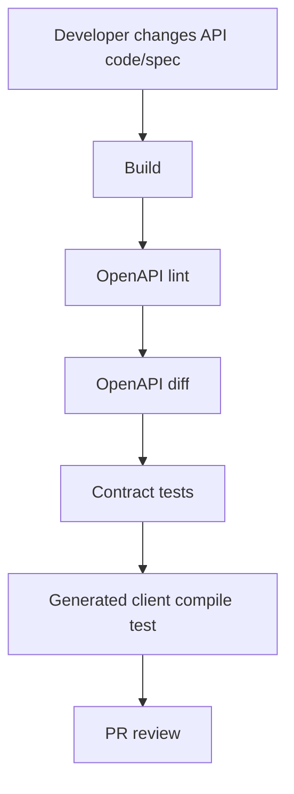

# Part 025 — OpenAPI, API Linting, and Generated Client/Server

> Fokus part ini: memperlakukan HTTP API contract sebagai engineering artifact yang bisa direview, divalidasi, di-lint, di-diff, dan dijadikan dasar generated client/server.

Di service JAX-RS, annotation terlihat seperti contract:

```java
@GET
@Path("/quotes/{quoteId}")
@Produces(MediaType.APPLICATION_JSON)
public QuoteResponse getQuote(@PathParam("quoteId") String quoteId) {
    return quoteService.getQuote(quoteId);
}
```

Tapi untuk consumer, kontrak sebenarnya adalah sesuatu yang observable:

```text
GET /quotes/{quoteId}
request headers
query parameters
status codes
response JSON schema
error schema
security requirement
pagination convention
compatibility rule
```

OpenAPI membantu membuat kontrak tersebut eksplisit.

Namun OpenAPI yang hanya dibuat sebagai dokumentasi statis cepat busuk. Dalam sistem enterprise, OpenAPI harus menjadi bagian dari governance pipeline.

---

## 1. Mental Model: API Contract Is Not the Implementation

JAX-RS resource method adalah implementation boundary.

OpenAPI adalah consumer contract boundary.

```text
JAX-RS resource method
  -> implementation detail for server team

OpenAPI document
  -> contract detail for consumers, test, gateway, SDK, and governance
```

A senior engineer harus bisa membedakan:

```text
- what the code currently does
- what the contract promises
- what the consumer depends on
- what the platform validates
- what the generated client assumes
```

Masalah besar muncul ketika code dan contract drift.

Example drift:

```text
OpenAPI says:
  404 returns ErrorResponse

Code returns:
  200 with null body
```

Atau:

```text
OpenAPI says field is optional
Code validation rejects request if field is missing
```

Atau:

```text
OpenAPI says enum values are NEW, ACTIVE, CANCELLED
Code also emits EXPIRED
Client generated from spec crashes on EXPIRED
```

---

## 2. Source of Truth Options

Ada beberapa model source of truth.

### 2.1 Code-first

Contract dihasilkan dari annotation/code.

```text
JAX-RS code -> scanner/plugin -> OpenAPI document
```

Typical mechanisms:

```text
- MicroProfile OpenAPI
- Swagger/OpenAPI annotations
- build plugin scanning classpath
- runtime endpoint exposing /openapi
```

Pros:

```text
- dekat dengan implementation
- mudah untuk developer
- lebih kecil risiko lupa update spec sederhana
```

Cons:

```text
- mudah membawa implementation smell ke contract
- generated spec sering kurang ekspresif
- compatibility review bisa terlambat
- docs berubah setelah code berubah
- annotation bisa membuat resource class terlalu ramai
```

### 2.2 Contract-first

OpenAPI ditulis dulu, lalu server/client di-generate atau implementation mengikuti spec.

```text
OpenAPI document -> generated interfaces/models/client -> implementation
```

Pros:

```text
- contract menjadi desain eksplisit
- cocok untuk consumer review sebelum implementation
- easier diff and governance
- generated clients lebih stabil
```

Cons:

```text
- developer perlu disiplin menjaga spec
- generated server bisa terasa kaku
- mismatch tetap bisa terjadi jika implementation tidak dites terhadap spec
```

### 2.3 Hybrid

Tim menulis contract eksplisit, tetapi code juga di-scan untuk verification.

```text
OpenAPI source of truth
  + implementation test
  + generated client
  + diff gate
```

Untuk enterprise production system, hybrid sering paling realistis.

---

## 3. What Should Be in OpenAPI

OpenAPI tidak cukup hanya path dan schema response.

Minimum useful contract:

```text
- operationId
- summary/description
- path
- method
- request headers
- query params
- path params
- request body schema
- response status codes
- response body schema per status
- error schema
- security scheme
- content types
- examples
- pagination convention
- deprecation marker
- compatibility notes where needed
```

Example simplified OpenAPI fragment:

```yaml
paths:
  /quotes/{quoteId}:
    get:
      operationId: getQuote
      summary: Get quote by ID
      parameters:
        - name: quoteId
          in: path
          required: true
          schema:
            type: string
        - name: X-Correlation-ID
          in: header
          required: false
          schema:
            type: string
      responses:
        "200":
          description: Quote found
          content:
            application/json:
              schema:
                $ref: "#/components/schemas/QuoteResponse"
        "404":
          description: Quote not found
          content:
            application/json:
              schema:
                $ref: "#/components/schemas/ErrorResponse"
        "500":
          description: Unexpected technical failure
          content:
            application/json:
              schema:
                $ref: "#/components/schemas/ErrorResponse"
```

Important: every non-2xx response should be intentionally specified.

If not specified, client teams infer behavior from reality, logs, or trial and error.

That becomes undocumented contract.

---

## 4. Operation ID Governance

`operationId` is not cosmetic.

It is often used by:

```text
- generated clients
- generated SDK method names
- documentation anchors
- contract tests
- gateway rules
- monitoring dashboards
```

Bad operation IDs:

```yaml
operationId: getUsingGET
operationId: quote
operationId: get1
operationId: getQuoteEndpoint
```

Better:

```yaml
operationId: getQuoteById
operationId: searchQuotes
operationId: submitQuoteForApproval
operationId: cancelOrder
```

Rule of thumb:

```text
operationId should describe business/API operation, not Java implementation detail.
```

For CPQ/order systems, prefer names that reflect API action precisely:

```text
createQuote
getQuoteById
priceQuote
submitQuote
convertQuoteToOrder
getOrderById
cancelOrder
```

Do not assume CSG uses these names internally. Treat this as naming guidance only.

---

## 5. Schema Design: API DTOs Are Contracts

OpenAPI schema should reflect API DTOs, not persistence entities.

Bad boundary:

```text
Database table -> JPA/MyBatis entity -> OpenAPI schema directly
```

Better boundary:

```text
Database row/entity
  -> domain/application model
  -> API response DTO
  -> OpenAPI schema
```

Why?

Because persistence model changes more often than public API contract should.

Example:

```yaml
QuoteResponse:
  type: object
  required:
    - quoteId
    - status
    - currency
    - totalAmount
  properties:
    quoteId:
      type: string
    status:
      type: string
      enum: [DRAFT, PRICED, SUBMITTED, APPROVED, REJECTED, CANCELLED]
    currency:
      type: string
      example: USD
    totalAmount:
      type: string
      description: Decimal monetary amount serialized as string to preserve precision.
```

For money, be careful with OpenAPI numeric types.

A JSON number can lose precision depending on client language. Many enterprise APIs serialize money as string or structured amount.

Example structured monetary value:

```yaml
Money:
  type: object
  required: [currency, amount]
  properties:
    currency:
      type: string
      example: USD
    amount:
      type: string
      example: "1234.56"
```

This becomes important later in Part 051.

---

## 6. Required vs Optional Fields

Required fields are compatibility-sensitive.

Adding a required request field is usually breaking.

Removing a required response field is usually breaking.

Making a response field nullable can be breaking if clients assume non-null.

OpenAPI should encode this clearly:

```yaml
CreateQuoteRequest:
  type: object
  required:
    - customerId
    - productCatalogId
  properties:
    customerId:
      type: string
    productCatalogId:
      type: string
    requestedEffectiveDate:
      type: string
      format: date
      nullable: true
```

Senior-level check:

```text
Every required field is a deployment commitment.
```

When unsure, prefer additive optional fields plus server-side safe defaults.

But safe defaults must be documented.

---

## 7. Error Contract in OpenAPI

Error response must be specified, not left to framework defaults.

Example:

```yaml
ErrorResponse:
  type: object
  required:
    - errorCode
    - message
    - correlationId
  properties:
    errorCode:
      type: string
      example: QUOTE_NOT_FOUND
    message:
      type: string
    correlationId:
      type: string
    details:
      type: array
      items:
        $ref: "#/components/schemas/ErrorDetail"
```

JAX-RS implementation might use `ExceptionMapper`:

```java
@Provider
public class NotFoundExceptionMapper implements ExceptionMapper<QuoteNotFoundException> {
    @Override
    public Response toResponse(QuoteNotFoundException exception) {
        ErrorResponse body = ErrorResponse.of(
            "QUOTE_NOT_FOUND",
            exception.getMessage(),
            Correlation.currentId()
        );

        return Response.status(Response.Status.NOT_FOUND)
            .type(MediaType.APPLICATION_JSON)
            .entity(body)
            .build();
    }
}
```

Governance rule:

```text
ExceptionMapper output must match OpenAPI error schema.
```

---

## 8. Security Scheme in OpenAPI

OpenAPI should document security requirements.

Example bearer JWT:

```yaml
components:
  securitySchemes:
    bearerAuth:
      type: http
      scheme: bearer
      bearerFormat: JWT

security:
  - bearerAuth: []
```

Per-operation override:

```yaml
paths:
  /health:
    get:
      security: []
      responses:
        "200":
          description: OK
```

For enterprise APIs, security docs should not expose secrets or internal trust assumptions.

They should clarify:

```text
- authentication scheme
- required scopes/permissions if public to consumers
- common 401/403 error behavior
- token audience expectations if relevant
- service-to-service auth if relevant
```

Internal verification checklist should confirm actual enforcement in filters/gateway, not only in OpenAPI.

---

## 9. API Linting

API linting prevents style drift.

Linting can validate:

```text
- every operation has operationId
- operationId naming convention
- every endpoint has tags
- every response has description
- every error response uses standard ErrorResponse
- no undocumented 500 response
- no path segment with verb unless approved
- no request body on GET
- pagination params follow convention
- deprecation marker includes sunset policy
- header names follow standard
- schema names follow convention
```

Example conceptual lint rules:

```yaml
rules:
  operation-operationId: error
  operation-tags: error
  operation-description: warn
  no-request-body-on-get: error
  standard-error-response: error
  path-kebab-case: warn
  pagination-param-standard: error
```

Linting is not bureaucracy. It reduces review fatigue.

Without linting, every PR repeats the same style discussion.

---

## 10. Generated Client

Generated clients can be useful when contract is stable and governance is strong.

Flow:

```text
OpenAPI spec
  -> generator
  -> Java/TypeScript/Python client
  -> consumer service/frontend
```

Benefits:

```text
- fewer handwritten HTTP bugs
- consistent serialization
- typed request/response models
- easier discoverability
- faster consumer onboarding
```

Risks:

```text
- generated client can hide HTTP semantics
- strict enum deserialization may break on new values
- generated models may leak poor schema design
- client version upgrades become dependency management problem
- retry/timeout defaults may be unsafe
```

Senior-level rule:

```text
Generated client is not a substitute for compatibility discipline.
```

Generated client should still expose or configure:

```text
- timeout
- retry policy
- base URL
- auth provider
- correlation header propagation
- error handling
- observability hooks
```

---

## 11. Generated Server

Generated server stubs can help contract-first development.

Flow:

```text
OpenAPI spec
  -> generated interface/stub
  -> business implementation
```

Potential JAX-RS-like shape:

```java
@Path("/quotes")
public interface QuotesApi {
    @GET
    @Path("/{quoteId}")
    @Produces(MediaType.APPLICATION_JSON)
    QuoteResponse getQuoteById(@PathParam("quoteId") String quoteId);
}
```

Implementation:

```java
public class QuotesResource implements QuotesApi {
    private final QuoteService quoteService;

    public QuotesResource(QuoteService quoteService) {
        this.quoteService = quoteService;
    }

    @Override
    public QuoteResponse getQuoteById(String quoteId) {
        return quoteService.getQuoteById(quoteId);
    }
}
```

Risks:

```text
- generated annotation compatibility with Jersey/Jakarta version
- generated model style may not match internal standards
- server stub may create awkward layering
- regeneration can create noisy diffs
- custom behavior still needs filters/providers/exception mappers
```

Generated server works best when code ownership and generation policy are clear.

---

## 12. Drift Detection

Drift happens when OpenAPI and implementation diverge.

Types of drift:

```text
Spec says endpoint exists, code does not
Code endpoint exists, spec does not
Spec request field optional, code requires it
Spec response status documented, code never emits it
Code emits status not documented
Spec schema says number, code emits string
Spec enum incomplete
Spec content type different from code
```

Possible controls:

```text
- generate spec from code and diff against committed spec
- contract tests against running service
- response schema validation in integration tests
- OpenAPI diff in PR
- consumer-driven contract tests
- gateway import validation
```

A useful CI flow:



---

## 13. OpenAPI Diff and Breaking Change Detection

OpenAPI diff tools can classify changes.

Examples of breaking changes:

```text
- remove path
- remove operation
- remove response field
- change field type
- make optional request field required
- remove enum value
- change response status code
- remove media type
- tighten validation constraints
```

Examples of usually non-breaking changes:

```text
- add optional response field
- add new endpoint
- add optional query parameter
- add new response status if clients tolerate it
```

But automated tools cannot know all semantic breakages.

Example semantic breaking change not always caught:

```text
Field remains string, but meaning changes from gross amount to net amount.
```

That requires human review.

---

## 14. Contract Compatibility Matrix

Every API change should answer:

```text
Old client -> old server: works?
Old client -> new server: works?
New client -> old server: works?
New client -> new server: works?
```

For server rollout, the critical path is:

```text
Old client -> new server must continue working.
```

For generated clients, also check:

```text
Old generated client -> new server
New generated client -> old server
```

Matrix:

```text
                  Old Server      New Server
Old Client        baseline        must work
New Client        planned?         target
```

If `New Client -> Old Server` does not work, deployment order must be explicit.

---

## 15. API Linting vs Compatibility Testing

Linting checks style and static rules.

Compatibility testing checks change safety.

Contract testing checks actual behavior.

```text
Linting:
  Is the spec written according to rules?

Diff:
  Did the contract change in a breaking way?

Contract test:
  Does the implementation behave according to the contract?
```

All three are needed.

---

## 16. Where OpenAPI Fits in JAX-RS Development

A practical JAX-RS workflow:

```text
1. Design endpoint contract.
2. Update OpenAPI.
3. Run API lint.
4. Review compatibility diff.
5. Implement resource method.
6. Implement DTO mapping.
7. Implement validation.
8. Implement exception mapper behavior.
9. Add endpoint/contract tests.
10. Generate/compile clients if used.
```

Resource method should not be the first design artifact for important APIs.

For simple internal endpoint, code-first may be acceptable.

For shared enterprise contract, contract-first or hybrid is safer.

---

## 17. JAX-RS Annotation and OpenAPI Annotation Risk

OpenAPI annotations can make resource class noisy:

```java
@GET
@Path("/{quoteId}")
@Operation(summary = "Get quote by ID")
@ApiResponses({
    @ApiResponse(responseCode = "200", description = "Quote found"),
    @ApiResponse(responseCode = "404", description = "Quote not found")
})
public QuoteResponse getQuote(@PathParam("quoteId") String quoteId) {
    return quoteService.getQuote(quoteId);
}
```

This can be okay, but watch for:

```text
- business logic hidden among documentation annotations
- duplicate definitions between YAML and annotations
- stale annotations
- incomplete error responses
- schema inferred incorrectly
```

If contract is complex, external YAML may be clearer.

If contract is simple and code-first is standard internally, annotation-based generation may be fine.

Internal verification matters.

---

## 18. Generated Model Risk

Generated models can be convenient but dangerous if used everywhere.

Bad pattern:

```text
Generated OpenAPI model used as:
- API DTO
- domain model
- database entity
- Kafka event model
```

This creates contract coupling across unrelated boundaries.

Better:

```text
Generated API model
  -> mapper
  -> domain command/model
  -> mapper
  -> persistence/event model
```

Even if it feels verbose, it protects future change.

A generated client model is a consumer-facing artifact. It should not dictate internal domain shape.

---

## 19. API Governance in PR Review

A senior PR review should ask:

```text
- Is OpenAPI updated?
- Is the operationId stable and meaningful?
- Are status codes documented?
- Are headers documented?
- Is request schema explicit?
- Is response schema explicit?
- Is error shape standard?
- Is security requirement documented?
- Is pagination/filtering/sorting consistent?
- Is this change backward-compatible?
- Did API diff detect breaking changes?
- Are generated clients affected?
- Are consumers identified?
- Is deprecation needed?
- Are examples accurate?
```

Do not approve API changes based only on Java compilation.

---

## 20. Failure Modes

### 20.1 Spec exists but implementation differs

Symptoms:

```text
- generated client fails at runtime
- consumer complains about undocumented status
- integration test passes locally but fails with real service
```

Detection:

```text
- contract tests
- schema validation
- response snapshot against OpenAPI
- generated client smoke test
```

### 20.2 Generated client has unsafe defaults

Symptoms:

```text
- no timeout
- infinite retry
- missing correlation header
- connection leak
- poor error mapping
```

Detection:

```text
- client wrapper review
- integration tests with slow/failing server
- dependency review
```

### 20.3 Lint rules are too weak

Symptoms:

```text
- inconsistent naming
- missing error responses
- inconsistent pagination
- consumer confusion
```

Detection:

```text
- recurring PR comments
- API style drift
- documentation inconsistency
```

### 20.4 Lint rules are too strict

Symptoms:

```text
- developers bypass governance
- exceptions become normal
- small changes blocked without value
```

Detection:

```text
- high override rate
- slow PR cycle
- frequent manual approvals
```

Governance should be strict on compatibility and safety, pragmatic on cosmetics.

---

## 21. Debugging Checklist

When API behavior does not match expectation:

```text
1. Check OpenAPI spec for documented behavior.
2. Check generated client version.
3. Check server deployed version.
4. Check resource method annotation.
5. Check filters/interceptors that mutate headers/status/body.
6. Check ExceptionMapper output.
7. Check serialization provider.
8. Check gateway/proxy transformations.
9. Check API diff between versions.
10. Check consumer assumptions.
```

For generated client failure:

```text
1. Inspect raw HTTP request/response.
2. Confirm content type.
3. Confirm schema shape.
4. Confirm enum/nullability handling.
5. Confirm timeout/retry/client config.
6. Confirm generated client version matches contract version.
```

---

## 22. Internal Verification Checklist

For CSG/internal codebase, verify, do not assume:

```text
OpenAPI governance:
- Is OpenAPI used at all?
- Is the source contract YAML/JSON or generated from code?
- Is there a contract-first or code-first policy?
- Where are OpenAPI files stored?
- Is OpenAPI published to an internal portal/catalog?
- Is OpenAPI used by API gateway/APIM?

Linting:
- Is API linting configured in CI?
- What tool is used?
- What rules are enforced?
- Are breaking changes blocked or only warned?
- Is there an exception/waiver process?

Generated client/server:
- Are clients generated from OpenAPI?
- Which languages are generated?
- Are generated clients committed or published as artifacts?
- Are generated server stubs used?
- Who owns generated code changes?
- How are generated clients versioned?

Compatibility:
- Is OpenAPI diff run in PR?
- Is there a compatibility matrix?
- Is consumer inventory maintained?
- Are deprecations tracked?
- Are old clients tested against new server?

Implementation alignment:
- Are JAX-RS annotations scanned into OpenAPI?
- Are ExceptionMapper responses documented?
- Are validation errors documented?
- Are auth requirements documented?
- Are headers documented?
```

---

## 23. PR Review Checklist

Before approving API contract changes:

```text
Contract:
- OpenAPI updated.
- operationId stable and meaningful.
- Request/response schema explicit.
- Error schema standard.
- Security scheme correct.
- Header behavior documented.
- Examples accurate.

Compatibility:
- Breaking change analysis included.
- Old client -> new server compatibility considered.
- Generated client impact considered.
- Deprecation needed? If yes, policy followed.
- Consumer owners notified if required.

Implementation:
- JAX-RS resource matches contract.
- Validation matches schema.
- ExceptionMapper matches error contract.
- Serialization config matches schema.
- Endpoint tests cover documented statuses.

Governance:
- API lint passes.
- OpenAPI diff reviewed.
- Contract tests updated.
- Documentation publishing path confirmed.
```

---

## 24. Anti-Patterns

```text
- OpenAPI exists only for documentation, not CI validation.
- Generated client has no timeout.
- Generated model used as database entity.
- Error responses undocumented.
- OpenAPI says optional but validation requires field.
- Enum values change without compatibility review.
- API diff warnings ignored.
- operationId changes casually.
- Security requirement exists in code but not in contract.
- Contract is updated after implementation, not before review.
```

---

## 25. Key Takeaways

```text
- JAX-RS code is implementation; OpenAPI is consumer contract.
- Contract drift is a production risk.
- API linting reduces repeated style debate.
- OpenAPI diff helps detect breaking changes, but cannot catch all semantic changes.
- Generated clients are useful only when compatibility and runtime defaults are governed.
- Generated server stubs can enforce contract-first development but need discipline.
- Error, security, headers, and status codes must be part of the contract.
- Senior engineers review API changes as release-risk changes, not just Java changes.
```

Next part: request input handling in JAX-RS, including path/query/header/cookie/form parameters, optionality, default values, conversion, and canonicalization.
