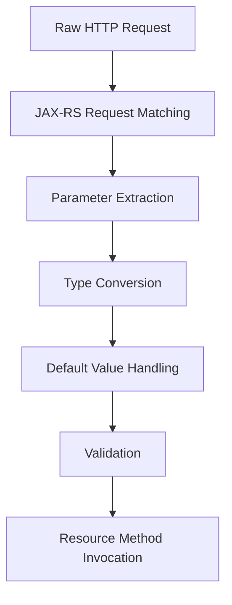
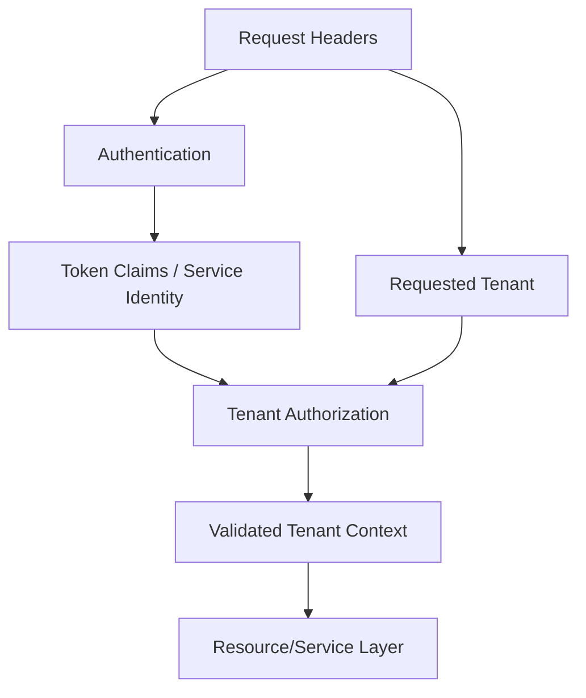

# Part 026 — Request Input Handling: Params, Headers, Forms

> Fokus part ini: memahami bagaimana input HTTP masuk ke resource method JAX-RS, bagaimana binding terjadi, apa failure mode-nya, dan bagaimana mendesain input contract yang eksplisit, aman, dan mudah direview.

Di JAX-RS, input bisa datang dari banyak tempat:

```text
- path parameter
- query parameter
- header
- cookie
- form field
- request body JSON/XML
- multipart part
- context object
```

Part ini fokus pada params, headers, cookies, dan forms. Request body JSON/XML akan tersambung ke part validation, serialization, dan DTO mapping.

Senior-level principle:

```text
Input handling is contract enforcement at the system boundary.
```

Jika boundary longgar, ambiguity masuk ke domain/service layer.

---

## 1. Mental Model: HTTP Request to Java Arguments

Request HTTP mentah:

```http
GET /quotes/Q-123/items?includePricing=true&limit=50 HTTP/1.1
Host: quote-api.example.internal
Accept: application/json
X-Correlation-ID: c-abc-123
Authorization: Bearer eyJ...
Cookie: sessionId=s-123
```

JAX-RS resource method:

```java
@GET
@Path("/quotes/{quoteId}/items")
@Produces(MediaType.APPLICATION_JSON)
public QuoteItemsResponse getQuoteItems(
    @PathParam("quoteId") String quoteId,
    @QueryParam("includePricing") @DefaultValue("false") boolean includePricing,
    @QueryParam("limit") @DefaultValue("50") int limit,
    @HeaderParam("X-Correlation-ID") String correlationId
) {
    return quoteItemService.getItems(quoteId, includePricing, limit, correlationId);
}
```

Binding flow:



Failure can happen at every step.

---

## 2. Path Parameters

Path params identify resource location.

Example:

```java
@GET
@Path("/quotes/{quoteId}")
public QuoteResponse getQuote(@PathParam("quoteId") String quoteId) {
    return quoteService.getQuote(quoteId);
}
```

Path params should usually represent:

```text
- resource identity
- parent-child hierarchy
- stable addressable entity
```

Examples:

```text
/quotes/{quoteId}
/quotes/{quoteId}/items/{itemId}
/orders/{orderId}
/customers/{customerId}/quotes
```

Avoid using path params for arbitrary filters:

```text
Bad:
/orders/status/ACTIVE/date/2026-07-10

Better:
/orders?status=ACTIVE&createdDate=2026-07-10
```

Path parameter is part of resource identity. Query parameter modifies retrieval.

---

## 3. Path Param Type Conversion

JAX-RS can convert simple types.

Example:

```java
@GET
@Path("/catalogs/{catalogVersion}")
public CatalogResponse getCatalog(@PathParam("catalogVersion") int catalogVersion) {
    return catalogService.getCatalog(catalogVersion);
}
```

But be careful.

If conversion fails, request usually fails before business logic runs.

Example request:

```http
GET /catalogs/current
```

If method expects `int`, conversion fails.

For enterprise APIs, prefer explicit identity types as string unless numeric semantics are truly part of the contract.

```java
@GET
@Path("/catalogs/{catalogVersion}")
public CatalogResponse getCatalog(@PathParam("catalogVersion") String catalogVersion) {
    return catalogService.getCatalog(catalogVersion);
}
```

Then validate intentionally.

---

## 4. Path Param Ambiguity

Ambiguous paths create routing surprises.

Example:

```java
@GET
@Path("/quotes/{quoteId}")
public QuoteResponse getQuote(...) { ... }

@GET
@Path("/quotes/search")
public QuoteSearchResponse searchQuotes(...) { ... }
```

Depending on matching rules and implementation, `/quotes/search` might be interpreted as `quoteId = search` if routes are poorly structured.

Better:

```text
GET /quotes/{quoteId}
GET /quotes?filter=...
```

Or if explicit search resource is needed:

```text
POST /quote-searches
GET /quote-searches/{searchId}
```

Review path design before coding resource methods.

---

## 5. Query Parameters

Query params modify retrieval, filtering, sorting, pagination, or optional response expansion.

Example:

```java
@GET
@Path("/quotes")
public QuoteSearchResponse searchQuotes(
    @QueryParam("customerId") String customerId,
    @QueryParam("status") List<String> statuses,
    @QueryParam("limit") @DefaultValue("50") int limit,
    @QueryParam("cursor") String cursor
) {
    return quoteQueryService.search(customerId, statuses, limit, cursor);
}
```

Common query param categories:

```text
- filter: status, customerId, effectiveDate
- pagination: limit, offset, cursor, pageToken
- sorting: sort, orderBy
- expansion: includePricing, includeItems
- projection: fields
```

Part 023 covers pagination/filtering/sorting in depth. This part focuses on binding mechanics and boundary rules.

---

## 6. Repeated Query Parameters

HTTP allows repeated query params:

```http
GET /quotes?status=DRAFT&status=SUBMITTED&status=APPROVED
```

JAX-RS can bind to list-like types:

```java
@QueryParam("status") List<String> statuses
```

Alternative comma-separated style:

```http
GET /quotes?status=DRAFT,SUBMITTED,APPROVED
```

Both are possible, but choose one convention.

Repeated params are more naturally HTTP-native. Comma-separated params are compact but need custom parsing and escaping rules.

Internal verification:

```text
- Does internal API convention prefer repeated params or comma-separated values?
- Are generated clients compatible with the convention?
- Does API gateway preserve repeated query params?
```

---

## 7. Optionality and Defaults

Optionality should be explicit.

Example:

```java
@QueryParam("includePricing") @DefaultValue("false") boolean includePricing
```

Without `@DefaultValue`, primitive types can be risky because missing input maps to primitive default in some cases or conversion behavior depends on provider/version.

Safer patterns:

```java
@QueryParam("limit") @DefaultValue("50") int limit
```

Or:

```java
@QueryParam("cursor") String cursor
```

Or with optional wrapper if supported by project convention:

```java
@QueryParam("cursor") Optional<String> cursor
```

But do not assume `Optional<T>` binding is supported identically across all JAX-RS implementations and versions. Verify internally.

Senior-level rule:

```text
A default value is part of the API contract.
```

Changing default sort, limit, include flag, or effective date behavior can be breaking.

---

## 8. Header Parameters

Headers carry metadata, not primary business identity.

Example:

```java
@GET
@Path("/quotes/{quoteId}")
public QuoteResponse getQuote(
    @PathParam("quoteId") String quoteId,
    @HeaderParam("X-Correlation-ID") String correlationId,
    @HeaderParam("X-Tenant-ID") String tenantId
) {
    return quoteService.getQuote(tenantId, quoteId, correlationId);
}
```

Common enterprise headers:

```text
- Authorization
- X-Correlation-ID
- X-Request-ID
- X-Tenant-ID
- X-Idempotency-Key
- If-Match
- If-None-Match
- Accept-Language
- User-Agent
```

But direct header injection in every resource method can become noisy.

Often better:

```text
request filter extracts headers
  -> validates/normalizes
  -> puts into request context/security context/MDC
  -> resource method receives business inputs only
```

Example conceptual filter:

```java
@Provider
public class CorrelationFilter implements ContainerRequestFilter {
    @Override
    public void filter(ContainerRequestContext requestContext) {
        String correlationId = requestContext.getHeaderString("X-Correlation-ID");
        CorrelationContext.set(normalizeOrGenerate(correlationId));
    }
}
```

Remember to clear ThreadLocal/MDC correctly. This connects to Part 033 and Part 055.

---

## 9. Authorization Header

Avoid injecting `Authorization` header directly into business methods unless implementing low-level auth infrastructure.

Bad pattern:

```java
public QuoteResponse getQuote(
    @HeaderParam("Authorization") String authorization,
    @PathParam("quoteId") String quoteId
) {
    String userId = tokenParser.parse(authorization).userId();
    return quoteService.getQuote(userId, quoteId);
}
```

Better pattern:

```text
Auth filter validates token
  -> creates principal/security context
  -> resource/service uses authenticated identity abstraction
```

JAX-RS has `SecurityContext`:

```java
@GET
@Path("/quotes/{quoteId}")
public QuoteResponse getQuote(
    @Context SecurityContext securityContext,
    @PathParam("quoteId") String quoteId
) {
    Principal principal = securityContext.getUserPrincipal();
    return quoteService.getQuote(principal.getName(), quoteId);
}
```

Actual internal pattern may differ. Verify security framework and gateway responsibilities.

---

## 10. Tenant Header Risk

Tenant ID is dangerous if treated as just another untrusted header.

Bad assumption:

```text
X-Tenant-ID header says tenant A, so request belongs to tenant A.
```

Safer model:

```text
Authenticated identity/service credential
  + allowed tenant claims/permissions
  + requested tenant context
  -> validated tenant context
```

Tenant-aware input flow:



Part 040 and Part 060 cover tenancy and security in more depth.

For this part, the key is simple:

```text
Do not let raw tenant input flow into data access without validation.
```

---

## 11. Cookie Parameters

JAX-RS supports cookie binding:

```java
@GET
@Path("/session")
public SessionResponse getSession(@CookieParam("sessionId") String sessionId) {
    return sessionService.getSession(sessionId);
}
```

Cookies are common for browser-facing APIs, less common for service-to-service APIs.

Risks:

```text
- CSRF exposure if browser credential automatically sent
- SameSite/Secure/HttpOnly misconfiguration
- session fixation
- accidental statefulness
- hidden dependency on browser behavior
```

For backend service APIs, bearer token/service identity is usually clearer.

Internal verification:

```text
- Are cookies used at all?
- Are APIs browser-facing or service-to-service?
- Is CSRF protection required?
- Are cookie flags enforced by app or gateway?
```

---

## 12. Form Parameters

JAX-RS can bind form fields:

```java
@POST
@Path("/login")
@Consumes(MediaType.APPLICATION_FORM_URLENCODED)
public LoginResponse login(
    @FormParam("username") String username,
    @FormParam("password") String password
) {
    return authService.login(username, password);
}
```

Form params are encoded in request body with content type:

```http
Content-Type: application/x-www-form-urlencoded

username=alice&password=secret
```

For modern internal APIs, JSON request bodies are usually clearer for structured commands.

Forms may still appear in:

```text
- OAuth2 token endpoints
- legacy integrations
- browser form submissions
- simple admin endpoints
```

Avoid mixing JSON body and form params in the same operation unless framework behavior is explicitly understood.

---

## 13. BeanParam for Grouped Inputs

JAX-RS supports grouping parameters into a bean using `@BeanParam`.

Example:

```java
public class QuoteSearchParams {
    @QueryParam("customerId")
    private String customerId;

    @QueryParam("status")
    private List<String> statuses;

    @QueryParam("limit")
    @DefaultValue("50")
    private int limit;

    @QueryParam("cursor")
    private String cursor;

    // getters/setters
}
```

Resource:

```java
@GET
@Path("/quotes")
public QuoteSearchResponse searchQuotes(@BeanParam QuoteSearchParams params) {
    return quoteQueryService.search(params);
}
```

Pros:

```text
- avoids long method signatures
- groups related input
- reusable across endpoints if appropriate
- easier validation composition
```

Risks:

```text
- hides which params endpoint accepts
- reused bean can accidentally widen API surface
- defaults scattered across fields
- validation becomes less visible
```

Use `@BeanParam` for cohesive input groups, not as dumping ground.

---

## 14. MatrixParam: Usually Avoid Unless Standard Internally

JAX-RS supports matrix params in URI path segments:

```text
/catalogs;version=2026-01/products;status=active
```

Example:

```java
@Path("/catalogs")
public class CatalogResource {
    @GET
    @Path("{catalogId}")
    public CatalogResponse getCatalog(
        @PathParam("catalogId") String catalogId,
        @MatrixParam("version") String version
    ) { ... }
}
```

Most enterprise HTTP APIs do not use matrix params because:

```text
- many developers are unfamiliar with them
- proxies/gateways may normalize semicolons
- generated clients may not support them cleanly
- API docs become less intuitive
```

Recommendation:

```text
Avoid matrix params unless existing internal API standard explicitly uses them.
```

---

## 15. ParamConverter and Custom Conversion

JAX-RS supports custom conversion via `ParamConverterProvider`.

Use case:

```text
- custom ID type
- domain enum parsing
- date/effective date parsing
- comma-separated value parsing
```

Example conceptual converter:

```java
@Provider
public class QuoteIdParamConverterProvider implements ParamConverterProvider {
    @Override
    public <T> ParamConverter<T> getConverter(
        Class<T> rawType,
        Type genericType,
        Annotation[] annotations
    ) {
        if (rawType.equals(QuoteId.class)) {
            return (ParamConverter<T>) new QuoteIdConverter();
        }
        return null;
    }
}
```

Risks:

```text
- conversion failure becomes framework-level error
- error response may be generic unless mapped
- hidden parsing logic makes endpoint behavior less obvious
- converter applies broadly if not scoped carefully
```

Senior review question:

```text
Is custom conversion improving clarity, or hiding input rules?
```

---

## 16. Enum Binding

Enum query/path params are convenient:

```java
@QueryParam("status") QuoteStatus status
```

But strict enum parsing can create bad client experience:

```text
GET /quotes?status=draft
```

might fail if enum requires `DRAFT`.

Options:

```text
- require exact enum string and document it
- normalize case in custom converter
- accept string and validate manually
```

For public/enterprise APIs, explicit validation often gives better error messages.

```java
@QueryParam("status") String status
```

Then:

```java
QuoteStatus parsed = QuoteStatusParser.parse(status)
    .orElseThrow(() -> new InvalidRequestException("INVALID_QUOTE_STATUS"));
```

This allows controlled error response.

---

## 17. Date/Time Input

Date/time input must be explicit.

Bad:

```text
?date=07/10/26
```

Better:

```text
?effectiveDate=2026-07-10
?createdAfter=2026-07-10T00:00:00Z
```

Use distinct types:

```text
LocalDate for date without time
Instant/OffsetDateTime for timestamp
```

But direct binding depends on provider and version.

Safer approach for critical APIs:

```java
@QueryParam("effectiveDate") String effectiveDateRaw
```

Then parse explicitly:

```java
LocalDate effectiveDate = LocalDate.parse(effectiveDateRaw, DateTimeFormatter.ISO_LOCAL_DATE);
```

Part 051 covers temporal correctness in depth.

---

## 18. Canonicalization

Input canonicalization means converting semantically equivalent inputs to one internal representation.

Examples:

```text
trim whitespace
normalize case for case-insensitive IDs if allowed
normalize Unicode if relevant
canonicalize currency code to uppercase ISO form
parse date to LocalDate/Instant
sort/deduplicate repeated filters
```

Do not over-canonicalize identifiers if case sensitivity matters.

Example risk:

```text
Product code "abc" and "ABC" may be different in legacy catalog.
```

Internal verification:

```text
- Are IDs case-sensitive?
- Are product/catalog codes normalized?
- Are tenant/customer identifiers canonicalized?
- Who owns normalization rules?
```

---

## 19. Validation Placement

Input validation has layers.

```text
Transport validation:
  Is param syntactically valid?

API validation:
  Is request shape allowed?

Domain validation:
  Is operation valid under business rules?

Authorization validation:
  Is caller allowed to perform action?
```

Example:

```text
quoteId format invalid
  -> 400 Bad Request

quoteId valid format but not found
  -> 404 Not Found

quote exists but caller cannot access it
  -> 403 Forbidden or 404 depending security policy

quote exists but cannot be submitted in current status
  -> 409 Conflict or domain-specific error
```

Do not collapse all failures into 400 or 500.

---

## 20. Input DTO vs Parameter List

For simple GET:

```java
public QuoteResponse getQuote(@PathParam("quoteId") String quoteId)
```

For complex query:

```java
public QuoteSearchResponse searchQuotes(@BeanParam QuoteSearchParams params)
```

For command POST:

```java
public QuoteResponse createQuote(CreateQuoteRequest request)
```

Rule of thumb:

```text
Path/query/header params are good for addressing and retrieval modifiers.
Request body DTO is better for complex command payload.
```

Bad:

```http
POST /quotes?customerId=C-1&productId=P-1&price=100&currency=USD&effectiveDate=2026-07-10
```

Better:

```http
POST /quotes
Content-Type: application/json

{
  "customerId": "C-1",
  "items": [
    { "productId": "P-1", "quantity": 1 }
  ],
  "effectiveDate": "2026-07-10"
}
```

---

## 21. Request Context Objects

JAX-RS supports context injection:

```java
@Context UriInfo uriInfo
@Context HttpHeaders headers
@Context Request request
@Context SecurityContext securityContext
```

Example:

```java
@GET
@Path("/quotes")
public QuoteSearchResponse searchQuotes(@Context UriInfo uriInfo) {
    MultivaluedMap<String, String> query = uriInfo.getQueryParameters();
    return quoteSearchService.search(query);
}
```

This is flexible but can weaken contract visibility.

Prefer explicit parameters for stable API inputs.

Use context objects for:

```text
- generic infrastructure behavior
- dynamic query parsing
- links/base URI construction
- conditional request handling
- security context
```

Do not pass raw `UriInfo` deep into domain logic.

---

## 22. Header Strategy and Context Propagation

Some headers should be propagated downstream.

Examples:

```text
- traceparent
- tracestate
- X-Correlation-ID
- X-Request-ID
- X-Tenant-ID after validation
- baggage if policy allows
```

But not all inbound headers should be blindly propagated.

Dangerous headers:

```text
- Authorization from external caller to internal service without token exchange policy
- spoofed identity headers
- user-controlled tenant headers
- hop-by-hop headers
- oversized/custom headers
```

Senior-level rule:

```text
Normalize and whitelist propagation. Never forward arbitrary inbound headers blindly.
```

---

## 23. Size Limits

Input is not only semantic. It consumes resources.

Check limits for:

```text
- max URL length
- max header size
- max query param count
- max body size
- max form size
- max multipart size
- max array length
- max page size
```

These limits may exist in:

```text
- browser/client
- API gateway
- load balancer
- servlet container
- Jersey/runtime
- application validation
```

If limits differ, failure can happen before JAX-RS code sees the request.

---

## 24. Failure Modes

### 24.1 Missing required param

Symptoms:

```text
- null value passed to service
- unexpected 500 NullPointerException
- generic 400 from framework
```

Prevention:

```text
- explicit validation
- Bean Validation
- clear error mapper
- endpoint tests for missing param
```

### 24.2 Invalid type conversion

Symptoms:

```text
- 400 with poor message
- 404 if path no longer matches
- generic server error if converter throws incorrectly
```

Prevention:

```text
- parse manually for critical inputs
- custom error handling
- documented format
```

### 24.3 Header spoofing

Symptoms:

```text
- tenant leak
- incorrect audit identity
- wrong correlation chain
- unauthorized access if trusted header accepted
```

Prevention:

```text
- trust boundary at gateway/auth layer
- signed tokens/claims
- strip untrusted headers
- validate tenant against identity
```

### 24.4 Query explosion

Symptoms:

```text
- slow DB query
- high CPU from parsing/filtering
- large memory usage
- timeout
```

Prevention:

```text
- max limit
- filter whitelist
- index-aligned filters
- query complexity limits
```

### 24.5 Default value change

Symptoms:

```text
- client sees different result without changing request
- paging behavior changes
- pricing/catalog effective date changes
```

Prevention:

```text
- treat default values as contract
- document defaults in OpenAPI
- compatibility review before changing defaults
```

---

## 25. Debugging Checklist

When input binding behaves unexpectedly:

```text
1. Capture raw HTTP request.
2. Confirm path after gateway/proxy rewrite.
3. Confirm query string exactly.
4. Confirm headers after gateway normalization.
5. Confirm content type.
6. Confirm JAX-RS resource path and method annotations.
7. Confirm `@PathParam`, `@QueryParam`, `@HeaderParam` names match exactly.
8. Confirm default values.
9. Confirm type conversion behavior.
10. Confirm filters/interceptors mutate request or context.
11. Confirm validation layer and exception mapper.
12. Confirm OpenAPI contract matches implementation.
```

For production debugging, compare:

```text
client raw request
  vs gateway access log
  vs service access log
  vs resource-level debug log
```

Differences reveal where the request changed.

---

## 26. JAX-RS Examples

### 26.1 Simple resource lookup

```java
@GET
@Path("/quotes/{quoteId}")
@Produces(MediaType.APPLICATION_JSON)
public QuoteResponse getQuote(@PathParam("quoteId") String quoteId) {
    QuoteId id = QuoteId.parse(quoteId)
        .orElseThrow(() -> InvalidRequestException.of("INVALID_QUOTE_ID"));

    return quoteApplicationService.getQuote(id);
}
```

### 26.2 Search endpoint with query params

```java
@GET
@Path("/quotes")
@Produces(MediaType.APPLICATION_JSON)
public QuoteSearchResponse searchQuotes(
    @QueryParam("customerId") String customerId,
    @QueryParam("status") List<String> statuses,
    @QueryParam("limit") @DefaultValue("50") int limit,
    @QueryParam("cursor") String cursor
) {
    QuoteSearchCriteria criteria = QuoteSearchCriteria.builder()
        .customerId(customerId)
        .statuses(QuoteStatusParser.parseAll(statuses))
        .limit(limit)
        .cursor(cursor)
        .build();

    return quoteQueryService.search(criteria);
}
```

### 26.3 Header through context/filter instead of method pollution

```java
@Provider
public class TenantContextFilter implements ContainerRequestFilter {
    @Override
    public void filter(ContainerRequestContext requestContext) {
        String requestedTenant = requestContext.getHeaderString("X-Tenant-ID");
        TenantContext tenantContext = tenantResolver.resolveAndAuthorize(requestedTenant);
        requestContext.setProperty("tenantContext", tenantContext);
    }
}
```

Resource:

```java
@GET
@Path("/quotes/{quoteId}")
public QuoteResponse getQuote(
    @PathParam("quoteId") String quoteId,
    @Context ContainerRequestContext requestContext
) {
    TenantContext tenant = (TenantContext) requestContext.getProperty("tenantContext");
    return quoteService.getQuote(tenant, quoteId);
}
```

This is conceptual. Actual internal code may use CDI, HK2, request-scoped context, ThreadLocal, or security context. Verify.

---

## 27. Internal Verification Checklist

For CSG/internal codebase, verify:

```text
JAX-RS binding:
- Are params mostly injected directly or grouped with @BeanParam?
- Are custom ParamConverterProvider classes used?
- Are Optional<T> params supported and used?
- Are enums bound directly or parsed manually?
- How are conversion errors mapped?

Headers:
- What correlation/request headers are standard?
- Is tenant ID passed via header, token claim, path, or derived context?
- Which headers are trusted from gateway?
- Which headers are stripped/replaced by gateway?
- Is Authorization handled in app, gateway, or both?

Forms/cookies:
- Are form params used anywhere?
- Are cookies used for browser-facing APIs?
- Is CSRF relevant?

Validation:
- Are missing params validated manually or by Bean Validation?
- Are error codes standardized?
- Are default values documented in OpenAPI?

Limits:
- Max URL length?
- Max header size?
- Max query param count?
- Max body/form size?
- Gateway and container limits aligned?

Tenancy:
- How is tenant context resolved?
- Is tenant context validated against identity?
- Is tenant context propagated to DB/log/Kafka?
```

---

## 28. PR Review Checklist

Before approving request input changes:

```text
Contract:
- Input location is appropriate: path vs query vs header vs body.
- Param names follow standard.
- Required/optional/default behavior is explicit.
- OpenAPI is updated.
- Examples are updated.

Correctness:
- Type conversion is safe.
- Invalid input returns controlled error.
- Defaults are intentional.
- Date/time/currency parsing is explicit if relevant.
- Tenant/security inputs are not trusted blindly.

Performance:
- Query params cannot create unbounded DB queries.
- Limit/page size enforced.
- Large headers/forms are bounded.

Security:
- Authorization header handled by security layer.
- Identity/tenant headers validated.
- Sensitive input is not logged.
- Header propagation is whitelisted.

Testing:
- Missing param test exists.
- Invalid type/enum test exists.
- Boundary limit test exists.
- Default behavior test exists.
- Negative security/tenant test exists where relevant.
```

---

## 29. Anti-Patterns

```text
- Passing raw query map into domain logic.
- Using GET query params for complex command payload.
- Trusting tenant header without identity validation.
- Parsing Authorization inside every resource method.
- Changing default values without compatibility review.
- Binding enum directly and returning generic framework error.
- Allowing unbounded `limit`.
- Accepting arbitrary sort/filter fields.
- Blindly propagating all inbound headers downstream.
- Logging raw headers with secrets/PII.
- Reusing @BeanParam across unrelated endpoints until API surface becomes unclear.
```

---

## 30. Key Takeaways

```text
- Request input handling is a boundary design problem, not just annotation usage.
- Path params identify resources; query params modify retrieval.
- Headers carry metadata and must respect trust boundaries.
- Tenant/security headers are dangerous if accepted raw.
- Defaults are part of the API contract.
- Type conversion failure should produce controlled, documented errors.
- Complex command input usually belongs in request body DTO, not query params.
- Context propagation should be normalized and whitelisted.
- Senior PR review must evaluate correctness, security, performance, and compatibility of input changes.
```

Next part: response model, including body shape, metadata, pagination response, links, empty response, and backward-compatible response evolution.
