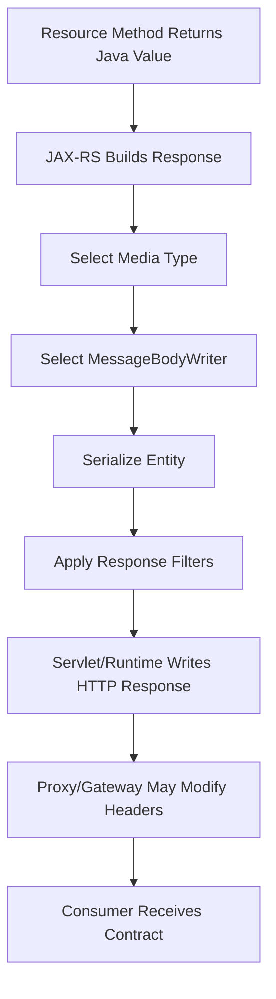
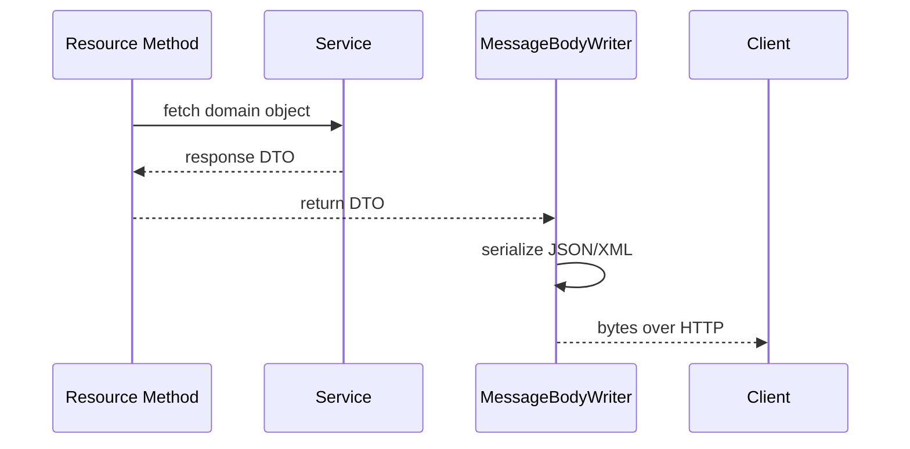

# Part 027 — Response Model: Body, Metadata, and Compatibility

> Fokus part ini: memahami response sebagai kontrak publik antara service dan consumer. Di JAX-RS, return value dari resource method bukan sekadar object Java; ia adalah representasi HTTP yang memiliki status, headers, body, metadata, compatibility rules, dan operational consequences.

Response yang buruk biasanya tidak langsung terlihat sebagai bug lokal. Ia muncul sebagai:

```text
- consumer parsing failure
- generated client rusak
- retry salah
- cache salah
- pagination inconsistent
- breaking change yang tidak disadari
- observability sulit karena metadata hilang
- data leak karena DTO terlalu dekat ke entity/domain object
```

Senior-level principle:

```text
A response is not what your service knows.
A response is what your consumers are allowed to depend on.
```

---

## 1. Mental Model: Java Return Value vs HTTP Response

Resource method JAX-RS bisa mengembalikan beberapa bentuk:

```java
@GET
@Path("/{quoteId}")
@Produces(MediaType.APPLICATION_JSON)
public QuoteResponse getQuote(@PathParam("quoteId") String quoteId) {
    return quoteService.getQuote(quoteId);
}
```

Atau eksplisit menggunakan `Response`:

```java
@POST
@Consumes(MediaType.APPLICATION_JSON)
@Produces(MediaType.APPLICATION_JSON)
public Response createQuote(CreateQuoteRequest request) {
    QuoteResponse response = quoteService.createQuote(request);

    return Response
        .status(Response.Status.CREATED)
        .header("Location", "/quotes/" + response.id())
        .entity(response)
        .build();
}
```

Keduanya akan melewati pipeline yang kira-kira seperti ini:



Yang perlu dibedakan:

| Layer | Concern |
|---|---|
| Java method return | convenience for implementation |
| JAX-RS `Response` | explicit HTTP response construction |
| MessageBodyWriter | serialization to wire format |
| Proxy/gateway | header mutation, compression, caching, auth enforcement |
| Consumer | actual dependency contract |

Jika response contract tidak eksplisit, implementation detail mudah bocor ke consumer.

---

## 2. Response Body Is a Boundary DTO, Not Your Domain Model

Anti-pattern umum:

```java
@GET
@Path("/{quoteId}")
public QuoteEntity getQuote(@PathParam("quoteId") String quoteId) {
    return quoteRepository.findById(quoteId);
}
```

Masalah:

```text
- persistence field bocor ke API
- lazy field bisa trigger query saat serialization
- internal enum bocor ke consumer
- field rename di database menjadi breaking API change
- cyclic reference bisa membuat serialization failure
- sensitive data bisa ikut keluar
```

Lebih aman:

```java
public record QuoteResponse(
    String id,
    String status,
    String customerId,
    String currency,
    BigDecimal totalAmount,
    Instant createdAt,
    Instant updatedAt
) {}
```

Resource:

```java
@GET
@Path("/{quoteId}")
@Produces(MediaType.APPLICATION_JSON)
public QuoteResponse getQuote(@PathParam("quoteId") String quoteId) {
    Quote quote = quoteService.getQuote(quoteId);
    return quoteMapper.toResponse(quote);
}
```

Senior review question:

```text
Can this response shape remain stable even if database/domain implementation changes?
```

Jika jawabannya tidak, boundary DTO belum cukup kuat.

---

## 3. Response Shape Categories

Tidak semua endpoint harus memiliki bentuk response yang sama. Tapi setiap kategori harus konsisten.

### 3.1 Single resource response

```json
{
  "id": "Q-1001",
  "status": "DRAFT",
  "customerId": "C-901",
  "currency": "USD",
  "totalAmount": "120.50",
  "createdAt": "2026-07-10T01:30:00Z",
  "updatedAt": "2026-07-10T01:45:00Z"
}
```

Cocok untuk:

```text
GET /quotes/{quoteId}
GET /orders/{orderId}
GET /catalogs/{catalogId}
```

### 3.2 Command response

Untuk command yang menciptakan atau mengubah state:

```json
{
  "id": "Q-1001",
  "status": "DRAFT",
  "revision": 3
}
```

Atau async command:

```json
{
  "operationId": "op-789",
  "status": "ACCEPTED",
  "statusUrl": "/operations/op-789"
}
```

Cocok untuk:

```text
POST /quotes
POST /quotes/{quoteId}/submit
POST /orders/{orderId}/cancel
```

### 3.3 Collection response

```json
{
  "items": [
    {
      "id": "Q-1001",
      "status": "DRAFT"
    },
    {
      "id": "Q-1002",
      "status": "SUBMITTED"
    }
  ],
  "page": {
    "limit": 50,
    "nextCursor": "eyJpZCI6IlEtMTAwMiJ9",
    "hasMore": true
  }
}
```

Cocok untuk list/search endpoint.

### 3.4 Empty success response

Be explicit:

```text
204 No Content  -> operation succeeded, no representation returned
200 []          -> query succeeded and result set is empty
200 {items: []} -> query succeeded with collection envelope
```

Jangan campur:

```text
GET /quotes?status=UNKNOWN -> 204
GET /quotes?status=UNKNOWN -> []
```

Untuk query/list, response kosong biasanya tetap `200` dengan empty collection karena request menghasilkan representasi collection yang kosong.

### 3.5 Error response

Dibahas lebih detail di Part 028. Di sini cukup pegang prinsip:

```text
Success response shape and error response shape should be intentionally separate.
```

---

## 4. Raw Entity Return vs `Response`

### 4.1 Return entity directly

```java
@GET
@Path("/{id}")
public QuoteResponse getQuote(@PathParam("id") String id) {
    return service.getQuote(id);
}
```

Kelebihan:

```text
- simple
- readable
- cocok untuk 200 OK default
```

Kekurangan:

```text
- kurang eksplisit untuk status/header
- tidak cocok untuk created/accepted/no-content
- header metadata perlu filter/global logic
```

### 4.2 Return `Response`

```java
@DELETE
@Path("/{id}")
public Response deleteQuote(@PathParam("id") String id) {
    service.deleteQuote(id);
    return Response.noContent().build();
}
```

Kelebihan:

```text
- eksplisit status/header/body
- cocok untuk command, file, async, cache, conditional request
- mudah menambahkan Location, ETag, Retry-After, Deprecation
```

Kekurangan:

```text
- bisa membuat resource method verbose
- mudah inconsistent jika tidak ada helper/convention
```

Guideline:

| Scenario | Prefer |
|---|---|
| Simple `GET` returning resource | entity DTO direct return boleh |
| `POST` create | `Response.created(...).entity(...)` |
| `DELETE` no representation | `Response.noContent()` |
| Async accepted | `Response.accepted(...)` |
| Conditional/cache response | `Response` explicit |
| File/streaming response | `Response` explicit |

---

## 5. Response Metadata

Metadata adalah informasi yang membantu consumer memahami response tanpa parsing seluruh body.

Contoh metadata di header:

```http
HTTP/1.1 200 OK
Content-Type: application/json
X-Correlation-ID: c-123
ETag: "quote-1001-r3"
Cache-Control: no-store
```

Contoh metadata di body:

```json
{
  "items": [],
  "page": {
    "limit": 50,
    "nextCursor": null,
    "hasMore": false
  },
  "meta": {
    "requestId": "r-123",
    "generatedAt": "2026-07-10T01:45:00Z"
  }
}
```

Header vs body metadata:

| Metadata | Better in header | Better in body |
|---|---:|---:|
| Content type | yes | no |
| Cache control | yes | no |
| ETag | yes | sometimes duplicate okay |
| Pagination cursor | sometimes | yes |
| Request/correlation ID | yes | sometimes |
| Business status | no | yes |
| Deprecation info | yes | sometimes |
| Links | both possible | yes for rich APIs |

Rule of thumb:

```text
Protocol metadata belongs in headers.
Application/domain metadata belongs in body.
```

---

## 6. Pagination Metadata Response

A production list endpoint should not return a naked array unless the API is intentionally tiny and stable.

Weak shape:

```json
[
  { "id": "Q-1001" },
  { "id": "Q-1002" }
]
```

Better shape:

```json
{
  "items": [
    { "id": "Q-1001" },
    { "id": "Q-1002" }
  ],
  "page": {
    "limit": 50,
    "nextCursor": "cursor-abc",
    "hasMore": true
  }
}
```

Why envelope matters:

```text
- can add page metadata later
- can add links later
- can add warnings later
- can support partial response metadata
- can avoid breaking generated clients
```

Possible page metadata:

```java
public record PageMetadata(
    Integer limit,
    String nextCursor,
    Boolean hasMore
) {}

public record PageResponse<T>(
    List<T> items,
    PageMetadata page
) {}
```

JAX-RS caveat for generic collections:

```java
@GET
@Produces(MediaType.APPLICATION_JSON)
public PageResponse<QuoteSummaryResponse> listQuotes() {
    return quoteService.listQuotes();
}
```

If returning raw `List<T>` directly with some providers, generic type information can become relevant. For explicit generic entity response:

```java
List<QuoteSummaryResponse> items = quoteService.listQuotes();
GenericEntity<List<QuoteSummaryResponse>> entity =
    new GenericEntity<List<QuoteSummaryResponse>>(items) {};

return Response.ok(entity).build();
```

But for enterprise APIs, a typed envelope is usually clearer than returning raw list.

---

## 7. Links and Operation Metadata

For long-running operations:

```json
{
  "operationId": "op-123",
  "status": "ACCEPTED",
  "links": {
    "self": "/operations/op-123",
    "quote": "/quotes/Q-1001"
  }
}
```

For resource response:

```json
{
  "id": "Q-1001",
  "status": "DRAFT",
  "links": {
    "self": "/quotes/Q-1001",
    "submit": "/quotes/Q-1001/submission"
  }
}
```

Be careful: links can become contract too.

Questions before adding links:

```text
- Are links stable across gateway/path changes?
- Are links tenant-aware?
- Are links version-aware?
- Are links absolute or relative?
- Are links authorized per user?
```

For many enterprise systems, links are useful but must be governed. Do not add them casually if routing and API versioning are not stable.

---

## 8. Compatibility Rules for Response Evolution

Response compatibility is about what existing consumers can continue to parse and reason about.

### 8.1 Usually compatible changes

```text
- add optional field
- add nullable field if consumers tolerate unknown fields
- add new enum value only if consumers are designed to tolerate it
- add metadata inside envelope
- add new link relation if ignored by old clients
```

Important caveat:

```text
Adding a field is only compatible if consumers ignore unknown fields.
```

Generated clients may fail or drop data depending on generator/language/config.

### 8.2 Usually breaking changes

```text
- rename field
- remove field
- change field type
- change date format
- change number format
- change enum string
- change nullability expectation
- change array to object or object to array
- change semantic meaning of an existing field
- change pagination cursor format without compatibility
```

### 8.3 Dangerous “looks compatible but is not” changes

```text
- add enum value consumed by switch/case without default
- change ordering semantics in list endpoint
- change default filter behavior
- change precision of money field
- change timezone serialization
- add field that leaks sensitive data
- return empty string instead of null or absent field
```

Senior-level compatibility question:

```text
What could a strict generated client, dashboard job, ETL process, or downstream validator assume about this response?
```

---

## 9. Null, Missing, Empty, and Default Values

These are not the same:

```json
{ "discount": null }
```

```json
{}
```

```json
{ "discount": "0.00" }
```

```json
{ "items": [] }
```

A mature API defines semantics:

| Shape | Possible meaning |
|---|---|
| missing field | not part of this representation or not requested |
| `null` | known absence / not applicable |
| empty string | value exists but blank; usually avoid |
| empty array | valid collection with zero items |
| zero | numeric value, not absence |

For enterprise CPQ/order contexts, ambiguity can be expensive:

```text
price = null       -> not priced yet?
price = 0          -> free item?
discount = null    -> not evaluated?
discount = 0       -> evaluated, no discount?
effectiveDate null -> always effective? invalid? unknown?
```

Recommendation:

```text
Do not rely on implicit null semantics for business-critical fields.
```

Use explicit status or reason fields when needed:

```json
{
  "pricingStatus": "NOT_CALCULATED",
  "totalAmount": null,
  "currency": "USD"
}
```

---

## 10. Monetary, Temporal, and Identifier Fields

Detailed temporal and monetary correctness is covered later, but response design must already avoid common mistakes.

### 10.1 Money

Avoid binary floating point:

```java
public record QuoteResponse(
    String currency,
    BigDecimal totalAmount
) {}
```

On the wire, choose a stable representation:

```json
{
  "currency": "USD",
  "totalAmount": "120.50"
}
```

or numeric JSON if contract explicitly supports it:

```json
{
  "currency": "USD",
  "totalAmount": 120.50
}
```

String representation avoids some cross-language precision issues, but generated clients may need custom typing. Pick one convention and enforce it.

### 10.2 Time

Prefer explicit timezone/offset:

```json
{
  "createdAt": "2026-07-10T01:45:00Z"
}
```

Avoid ambiguous local timestamps:

```json
{
  "createdAt": "2026-07-10 08:45:00"
}
```

### 10.3 Identifiers

Do not expose database surrogate keys unless intentionally part of public contract.

```json
{
  "id": "Q-1001"
}
```

Instead of:

```json
{
  "quoteTablePk": 918273645
}
```

---

## 11. Response DTO Design Checklist

A response DTO should answer:

```text
- Is this DTO transport-specific?
- Does it leak persistence model?
- Does it leak internal enum?
- Does it expose sensitive data?
- Are monetary fields precise?
- Are temporal fields timezone-explicit?
- Are optional fields documented?
- Are enum evolution risks handled?
- Can unknown fields be ignored by consumers?
- Is the shape friendly to generated clients?
```

Example:

```java
public record QuoteSummaryResponse(
    String id,
    String status,
    String customerId,
    String currency,
    BigDecimal totalAmount,
    Instant createdAt,
    Instant updatedAt
) {}
```

Potential improvement for status:

```java
public enum QuoteApiStatus {
    DRAFT,
    SUBMITTED,
    APPROVED,
    REJECTED,
    CANCELLED,
    UNKNOWN
}
```

But be careful: adding `UNKNOWN` is useful only if mapping is intentional.

---

## 12. Response Envelope: Use Deliberately

Some teams use a global response envelope:

```json
{
  "data": {
    "id": "Q-1001"
  },
  "meta": {
    "requestId": "r-123"
  }
}
```

Potential benefits:

```text
- consistent metadata placement
- easier pagination/warnings
- easier generated client modeling
```

Potential costs:

```text
- extra nesting everywhere
- awkward for file/stream responses
- not natural for 204 responses
- can conflict with standard error formats
```

Recommendation:

```text
Use envelopes for collections and metadata-rich responses.
Do not force one envelope shape for every endpoint unless platform standard requires it.
```

Internal verification matters here. Do not invent a new envelope if the codebase already has a platform convention.

---

## 13. Response Filters and Metadata Injection

Some metadata should not be repeated in every resource method.

Example response filter:

```java
@Provider
public class CorrelationResponseFilter implements ContainerResponseFilter {

    @Override
    public void filter(ContainerRequestContext requestContext,
                       ContainerResponseContext responseContext) {
        String correlationId = (String) requestContext.getProperty("correlationId");
        if (correlationId != null) {
            responseContext.getHeaders().putSingle("X-Correlation-ID", correlationId);
        }
    }
}
```

Good candidates for filters:

```text
- correlation ID header
- security headers
- deprecation headers
- server timing headers if standardized
- cache-control defaults if consistent
```

Poor candidates for filters:

```text
- business-specific metadata
- endpoint-specific pagination
- domain status
- resource-specific ETag unless filter has correct domain data
```

Response filters are powerful, but hidden behavior must be discoverable.

---

## 14. Serialization Boundary and Failure Modes

The resource method can succeed, but response writing can still fail.

Flow:



Possible failure after service logic succeeds:

```text
- Jackson cannot serialize field
- cyclic reference
- lazy-loaded entity access fails
- date/time serializer missing
- BigDecimal format inconsistent
- stream write fails after partial response
- client disconnects
```

This is why returning persistence entity is risky. Serialization becomes a hidden execution phase.

Debugging clues:

```text
- service logs say success, client gets 500
- exception stacktrace mentions MessageBodyWriter/ObjectMapper
- response filter logs status 200, but wire response fails
- client receives truncated body
```

---

## 15. JAX-RS Examples

### 15.1 Create response with `Location`

```java
@POST
@Consumes(MediaType.APPLICATION_JSON)
@Produces(MediaType.APPLICATION_JSON)
public Response createQuote(CreateQuoteRequest request,
                            @Context UriInfo uriInfo) {
    QuoteResponse created = quoteService.createQuote(request);

    URI location = uriInfo.getAbsolutePathBuilder()
        .path(created.id())
        .build();

    return Response.created(location)
        .entity(created)
        .build();
}
```

### 15.2 No-content response

```java
@DELETE
@Path("/{quoteId}")
public Response deleteQuote(@PathParam("quoteId") String quoteId) {
    quoteService.deleteQuote(quoteId);
    return Response.noContent().build();
}
```

### 15.3 Accepted async response

```java
@POST
@Path("/{quoteId}/price-calculation")
@Produces(MediaType.APPLICATION_JSON)
public Response calculatePrice(@PathParam("quoteId") String quoteId) {
    OperationResponse operation = pricingService.startCalculation(quoteId);

    return Response.accepted(operation)
        .header("Location", "/operations/" + operation.operationId())
        .build();
}
```

### 15.4 Conditional-style ETag response

```java
@GET
@Path("/{quoteId}")
@Produces(MediaType.APPLICATION_JSON)
public Response getQuote(@PathParam("quoteId") String quoteId,
                         @Context Request request) {
    QuoteResponse quote = quoteService.getQuote(quoteId);
    EntityTag tag = new EntityTag("quote-" + quote.id() + "-r" + quote.revision());

    Response.ResponseBuilder preconditions = request.evaluatePreconditions(tag);
    if (preconditions != null) {
        return preconditions.tag(tag).build();
    }

    return Response.ok(quote)
        .tag(tag)
        .cacheControl(noStore())
        .build();
}

private CacheControl noStore() {
    CacheControl cc = new CacheControl();
    cc.setNoStore(true);
    return cc;
}
```

Actual use of ETag/conditional request must align with gateway, cache, and domain revision semantics.

---

## 16. Gateway and Platform Interference

Your JAX-RS response is not always the final wire response.

A gateway/proxy may:

```text
- add/remove headers
- terminate TLS
- compress response
- enforce max body size
- rewrite Location header
- convert upstream 5xx to platform error shape
- add CORS headers
- strip internal headers
- timeout before service completes
```

Senior debugging habit:

```text
Compare application logs, service-level response, gateway logs, and client-observed response.
```

Do not assume the response seen by the resource method is the response seen by the consumer.

---

## 17. Response Testing Strategy

Test response contract directly.

### 17.1 Unit/resource test

```java
@Test
void getQuoteReturnsStableResponseShape() {
    Response response = target("/quotes/Q-1001")
        .request(MediaType.APPLICATION_JSON)
        .get();

    assertEquals(200, response.getStatus());

    JsonNode body = objectMapper.readTree(response.readEntity(String.class));
    assertEquals("Q-1001", body.get("id").asText());
    assertTrue(body.has("status"));
    assertFalse(body.has("internalCostBasis"));
}
```

### 17.2 Compatibility test

```text
- compare OpenAPI diff
- run generated client against endpoint
- verify unknown-field tolerance
- verify enum evolution handling
- verify date/time format
- verify null/missing semantics
```

### 17.3 Golden response snapshots

Useful for stable APIs, but risky if abused.

Good snapshot checks:

```text
- response field names
- nested structure
- date/time format
- error envelope shape
```

Bad snapshot checks:

```text
- volatile IDs
- exact timestamp generated at runtime
- unordered object/map field order
```

---

## 18. Failure Modes

| Failure mode | Symptom | Likely cause | Detection |
|---|---|---|---|
| Consumer breaks after field rename | client parse error | breaking response change | contract test, OpenAPI diff |
| 500 after resource method success | serialization failure | DTO/entity issue | logs, stacktrace, resource test |
| Empty list returned as 204 | client logic breaks | inconsistent query semantics | API test |
| Money rounding mismatch | pricing dispute | numeric precision/serialization | contract + domain tests |
| Unknown enum breaks client | consumer switch/case failure | enum evolution not governed | consumer contract test |
| Sensitive data leaked | compliance incident | entity returned directly | security review, response test |
| Pagination misses/duplicates | inconsistent user experience | unstable ordering/cursor | integration test, data test |
| ETag cache stale | old data shown | incorrect validator semantics | conditional request test |
| Metadata missing | hard debugging | filter not registered/header stripped | gateway + app logs |

---

## 19. Debugging Playbook

When a response looks wrong:

```text
1. Confirm the raw response as seen by the client.
2. Confirm status, headers, and body separately.
3. Check resource method return path.
4. Check mapper from domain/entity to DTO.
5. Check MessageBodyWriter/ObjectMapper/JSON-B config.
6. Check response filters.
7. Check gateway/proxy mutation.
8. Check generated OpenAPI/client expectation.
9. Check whether recent change was additive or breaking.
10. Check consumer logs for parse/semantic failure.
```

Useful questions:

```text
- Is the response wrong at service boundary or after gateway?
- Did serialization alter field names or date format?
- Is a null field intentionally null or accidentally missing data?
- Did a DTO change bypass contract review?
- Did pagination require stable sort but query does not enforce it?
```

---

## 20. PR Review Checklist

For every response change, review:

```text
- Is the status code correct?
- Is the response body shape intentional?
- Is the DTO separate from domain/entity/persistence model?
- Are sensitive fields excluded?
- Are monetary and temporal fields represented safely?
- Are null/missing/empty semantics clear?
- Is pagination metadata present for collection endpoints?
- Is the change backward-compatible?
- Are enum changes consumer-safe?
- Is OpenAPI updated?
- Are generated clients impacted?
- Are response filters relied on implicitly?
- Are gateway/proxy headers considered?
- Are tests verifying status, headers, and body?
```

Red flags:

```text
- returning JPA/MyBatis persistence entity directly
- adding internal debug field to response
- changing field name without version/deprecation
- changing list ordering without documenting it
- using `double` for money
- returning local date-time without timezone for instant-like fields
- using 204 for empty search result inconsistently
```

---

## 21. Internal Verification Checklist

For CSG Quote & Order or any enterprise codebase, verify from actual evidence:

```text
- What is the standard response envelope, if any?
- Are resource methods expected to return DTO directly or `Response`?
- Is there a common response builder/helper?
- Is there a common pagination response model?
- Are response DTOs generated from OpenAPI or hand-written?
- Are generated clients used by internal teams?
- What JSON provider is active: Jackson, JSON-B, Jersey default, custom?
- Are ObjectMapper/JSON-B settings centralized?
- What is the date/time serialization convention?
- What is the monetary serialization convention?
- Are unknown fields tolerated by consumers?
- How are enum changes governed?
- Is there an API compatibility matrix?
- Is OpenAPI diff checked in CI?
- Does gateway mutate response headers/body?
- Are correlation/security/deprecation headers injected by filters or gateway?
- Is ETag/cache-control used anywhere?
- Are response snapshots or contract tests used?
- What fields are classified as sensitive/PII?
```

Do not infer these from technology choice alone. Jersey/JAX-RS does not define enterprise response governance for you.

---

## 22. Key Takeaways

```text
- Response model is a public contract, not an internal object dump.
- DTO boundary protects consumers from implementation churn.
- Metadata must be deliberate: headers for protocol, body for application/domain.
- Empty, null, missing, and zero have different meanings.
- Compatibility is about consumer assumptions, not only schema syntax.
- Serialization is part of runtime behavior and can fail after service logic succeeds.
- Gateway/proxy behavior can change the final response.
- Senior PR review must treat response changes as contract changes.
```
