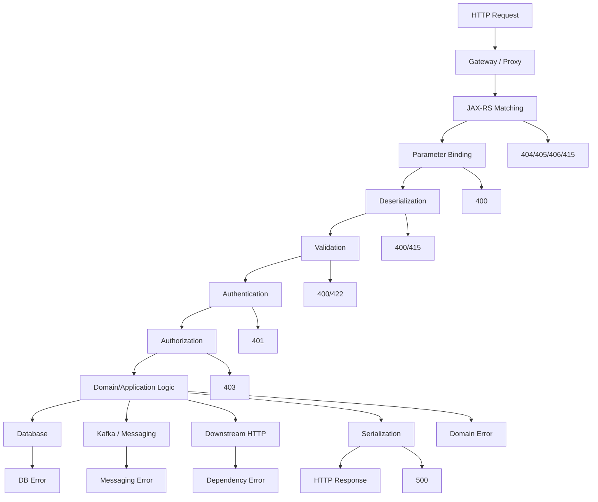
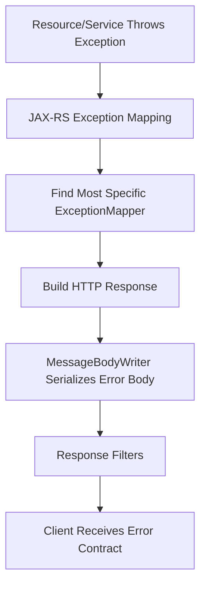

# Part 028 — Error Handling and Problem Taxonomy

> Fokus part ini: membangun taxonomy error yang bisa dipakai oleh API consumer, operator, SRE, security reviewer, dan engineer yang sedang debugging production. Error handling bukan sekadar `try/catch`; error adalah kontrak, sinyal operasional, dan mekanisme kontrol risiko.

Error handling yang buruk biasanya terlihat sebagai:

```text
- semua error menjadi 500
- semua error menjadi 400
- stacktrace bocor ke response
- error code tidak stabil
- consumer tidak tahu boleh retry atau tidak
- operator tidak bisa membedakan bug, bad request, dependency outage, dan authorization failure
- alert terlalu noisy karena domain error dianggap incident
- incident sulit dianalisis karena correlation ID tidak ada
```

Senior-level principle:

```text
An error response should tell the client what happened at the contract boundary,
while logs and telemetry tell operators what happened inside the system.
```

Jangan membocorkan internal detail ke client hanya karena operator butuh detail. Itu dua audience berbeda.

---

## 1. Mental Model: Error as a Classified Outcome

Request processing bisa gagal di banyak titik:



A mature taxonomy makes each class explicit.

---

## 2. Error Classes

### 2.1 Protocol and request matching errors

Examples:

```text
- path not found
- method not allowed
- unsupported media type
- unacceptable response media type
```

Typical HTTP mapping:

| Error | Typical status |
|---|---:|
| no matching resource | 404 |
| method not allowed | 405 |
| unsupported request content type | 415 |
| cannot produce acceptable media type | 406 |

These are often produced by JAX-RS runtime before your resource method runs.

### 2.2 Binding and deserialization errors

Examples:

```text
- query param expected int but got string
- invalid enum value
- malformed JSON
- invalid date format
- body cannot be deserialized
```

Typical mapping:

```text
400 Bad Request
```

Sometimes `415` if media type is unsupported. Sometimes `400` if media type is supported but body is malformed.

### 2.3 Validation errors

Examples:

```text
- required field missing
- field too long
- invalid currency code
- start date after end date
- quantity below minimum
```

Typical mapping:

```text
400 Bad Request
```

Some organizations use `422 Unprocessable Entity` for semantic validation. Pick one standard and apply consistently.

### 2.4 Authentication errors

Examples:

```text
- missing token
- expired token
- invalid signature
- invalid issuer
- invalid audience
```

Typical mapping:

```text
401 Unauthorized
```

The response must not expose sensitive validation internals.

### 2.5 Authorization errors

Examples:

```text
- authenticated user lacks permission
- service identity not allowed
- tenant boundary violation
- object-level access denied
```

Typical mapping:

```text
403 Forbidden
```

Be careful with resource existence leakage. Sometimes systems intentionally return `404` when the caller must not know the resource exists.

### 2.6 Domain/business errors

Examples:

```text
- quote cannot be submitted from current state
- catalog version is not active
- pricing rule is not applicable
- order cannot be cancelled after fulfillment starts
- duplicate quote reference exists
```

Typical mapping depends on meaning:

| Domain situation | Possible status |
|---|---:|
| invalid command for current state | 409 |
| duplicate unique business key | 409 |
| business rule violation in request | 400 or 422 |
| resource not found | 404 |
| precondition not met | 412 |

The key is not the exact status alone. The key is a stable domain error code.

### 2.7 Technical/infrastructure errors

Examples:

```text
- database unavailable
- connection pool exhausted
- Kafka broker unavailable
- downstream timeout
- serialization bug
- unexpected null pointer
```

Typical mapping:

```text
500 Internal Server Error
503 Service Unavailable
504 Gateway Timeout
```

Internal details belong in logs/traces, not response body.

### 2.8 Rate limiting and overload errors

Examples:

```text
- tenant request quota exceeded
- gateway limit exceeded
- service overloaded
- bulkhead full
- load shedding triggered
```

Typical mapping:

```text
429 Too Many Requests
503 Service Unavailable
```

Use `Retry-After` only when it is meaningful.

---

## 3. Error Response Contract

A minimal but useful error response:

```json
{
  "errorCode": "QUOTE_INVALID_STATE",
  "message": "Quote cannot be submitted from its current state.",
  "details": [
    {
      "field": "status",
      "reason": "Expected DRAFT or READY_FOR_SUBMISSION."
    }
  ],
  "correlationId": "c-123"
}
```

Potential fields:

| Field | Purpose | Stability |
|---|---|---|
| `errorCode` | machine-readable classification | must be stable |
| `message` | human-readable summary | can evolve carefully |
| `details` | field-level or cause details | structure should be stable |
| `correlationId` | support/debug reference | should be propagated |
| `retryable` | client retry hint | use carefully |
| `documentationUrl` | support/self-service | optional |

Avoid exposing:

```text
- stacktrace
- SQL query
- table/column names unless intentionally public
- internal hostnames
- token contents
- secret names/values
- customer data unrelated to caller
- internal class names as primary error contract
```

Bad response:

```json
{
  "error": "java.lang.NullPointerException at com.company.quote.PricingService line 183"
}
```

Better response:

```json
{
  "errorCode": "INTERNAL_ERROR",
  "message": "The request could not be processed.",
  "correlationId": "c-123"
}
```

Logs/traces should contain the internal exception with the same correlation/trace ID.

---

## 4. Error Code Design

Error code should be stable and machine-readable.

Examples:

```text
QUOTE_NOT_FOUND
QUOTE_INVALID_STATE
QUOTE_ALREADY_SUBMITTED
CATALOG_VERSION_NOT_ACTIVE
PRICE_CALCULATION_FAILED
VALIDATION_FAILED
AUTHENTICATION_REQUIRED
ACCESS_DENIED
TENANT_MISMATCH
DEPENDENCY_TIMEOUT
INTERNAL_ERROR
```

Avoid codes that are too implementation-specific:

```text
NULL_POINTER_AT_PRICING_SERVICE
POSTGRES_ERROR_23505_FROM_QUOTE_TABLE
JACKSON_MAPPING_EXCEPTION
```

Those are useful internally but not as public API contract.

A good error code:

```text
- is stable
- is documented
- maps to a category
- maps to support playbook if needed
- does not expose implementation
- can be used by generated clients and UI logic
```

---

## 5. HTTP Status vs Error Code

HTTP status is a coarse protocol signal. Error code is precise application signal.

```json
{
  "errorCode": "QUOTE_INVALID_STATE",
  "message": "Quote cannot be submitted from its current state.",
  "correlationId": "c-123"
}
```

Status:

```http
409 Conflict
```

Meaning:

```text
HTTP status: the request conflicts with current resource state.
errorCode: specifically quote state transition is invalid.
```

Do not encode all meaning into status code. Also do not ignore status code and put everything into body.

Bad:

```http
200 OK
Content-Type: application/json

{
  "success": false,
  "errorCode": "QUOTE_NOT_FOUND"
}
```

This breaks intermediaries, clients, monitoring, and retry behavior.

---

## 6. Retryability Classification

Not every failure should be retried.

| Error class | Retry? | Notes |
|---|---:|---|
| malformed request | no | client must fix input |
| validation failure | no | retry repeats same failure |
| authentication failure | no/after refresh | token refresh may help |
| authorization failure | no | permission change required |
| not found | usually no | unless eventual consistency expected |
| conflict | maybe | depends on optimistic concurrency/idempotency |
| timeout | maybe | must respect idempotency and retry budget |
| rate limited | later | respect `Retry-After`/policy |
| dependency unavailable | maybe | bounded retry, circuit breaker |
| internal bug | no immediate blind retry | may amplify load |

Response field `retryable` can help, but it is dangerous if computed casually.

```json
{
  "errorCode": "DEPENDENCY_TIMEOUT",
  "message": "A downstream dependency did not respond in time.",
  "retryable": true,
  "correlationId": "c-123"
}
```

Only expose `retryable` if the team has clear policy.

Internal systems also need retry classification for resilience libraries, Kafka consumers, batch jobs, and outbox publishers.

---

## 7. JAX-RS ExceptionMapper Mental Model

JAX-RS `ExceptionMapper<T>` converts Java exceptions into HTTP responses.

```java
@Provider
public class QuoteNotFoundExceptionMapper
        implements ExceptionMapper<QuoteNotFoundException> {

    @Override
    public Response toResponse(QuoteNotFoundException exception) {
        ErrorResponse error = new ErrorResponse(
            "QUOTE_NOT_FOUND",
            "Quote was not found.",
            List.of(),
            Correlation.currentId()
        );

        return Response.status(Response.Status.NOT_FOUND)
            .type(MediaType.APPLICATION_JSON)
            .entity(error)
            .build();
    }
}
```

Pipeline:



Important:

```text
ExceptionMapper itself can fail.
```

Keep mapper logic simple. Do not call complex dependencies from error mappers unless unavoidable.

---

## 8. Exception Hierarchy Strategy

A useful hierarchy separates expected application failures from unexpected technical failures.

Example:

```java
public abstract class ApplicationException extends RuntimeException {
    private final String errorCode;
    private final boolean retryable;

    protected ApplicationException(String errorCode, String message, boolean retryable) {
        super(message);
        this.errorCode = errorCode;
        this.retryable = retryable;
    }

    public String errorCode() {
        return errorCode;
    }

    public boolean retryable() {
        return retryable;
    }
}
```

Domain exception:

```java
public final class QuoteInvalidStateException extends ApplicationException {
    public QuoteInvalidStateException(String quoteId, String currentState) {
        super(
            "QUOTE_INVALID_STATE",
            "Quote cannot be submitted from its current state.",
            false
        );
    }
}
```

Technical exception wrapper:

```java
public final class DependencyTimeoutException extends ApplicationException {
    public DependencyTimeoutException(String dependencyName, Throwable cause) {
        super(
            "DEPENDENCY_TIMEOUT",
            "A downstream dependency did not respond in time.",
            true
        );
        initCause(cause);
    }
}
```

Be careful not to create a giant hierarchy where every small condition is a separate class with no added value.

---

## 9. Generic Application Exception Mapper

```java
@Provider
public class ApplicationExceptionMapper
        implements ExceptionMapper<ApplicationException> {

    @Override
    public Response toResponse(ApplicationException exception) {
        ErrorResponse body = ErrorResponse.from(exception, Correlation.currentId());

        Response.Status status = switch (exception.errorCode()) {
            case "QUOTE_NOT_FOUND" -> Response.Status.NOT_FOUND;
            case "QUOTE_INVALID_STATE" -> Response.Status.CONFLICT;
            case "ACCESS_DENIED" -> Response.Status.FORBIDDEN;
            default -> Response.Status.BAD_REQUEST;
        };

        return Response.status(status)
            .type(MediaType.APPLICATION_JSON_TYPE)
            .entity(body)
            .build();
    }
}
```

Potential issue:

```text
Mapping by string errorCode can become messy.
```

Alternative: error descriptor:

```java
public record ErrorDescriptor(
    String code,
    int httpStatus,
    boolean retryable
) {}
```

Or enum catalog:

```java
public enum ApiError {
    QUOTE_NOT_FOUND("QUOTE_NOT_FOUND", 404, false),
    QUOTE_INVALID_STATE("QUOTE_INVALID_STATE", 409, false),
    DEPENDENCY_TIMEOUT("DEPENDENCY_TIMEOUT", 503, true);

    public final String code;
    public final int status;
    public final boolean retryable;

    ApiError(String code, int status, boolean retryable) {
        this.code = code;
        this.status = status;
        this.retryable = retryable;
    }
}
```

---

## 10. Validation Error Mapping

Bean Validation often produces field/path-level violations.

Example response:

```json
{
  "errorCode": "VALIDATION_FAILED",
  "message": "Request validation failed.",
  "details": [
    {
      "field": "customerId",
      "reason": "must not be blank"
    },
    {
      "field": "items[0].quantity",
      "reason": "must be greater than or equal to 1"
    }
  ],
  "correlationId": "c-123"
}
```

Mapper:

```java
@Provider
public class ConstraintViolationExceptionMapper
        implements ExceptionMapper<ConstraintViolationException> {

    @Override
    public Response toResponse(ConstraintViolationException exception) {
        List<ErrorDetail> details = exception.getConstraintViolations().stream()
            .map(v -> new ErrorDetail(
                normalizePath(v.getPropertyPath().toString()),
                v.getMessage()
            ))
            .toList();

        ErrorResponse body = new ErrorResponse(
            "VALIDATION_FAILED",
            "Request validation failed.",
            details,
            Correlation.currentId()
        );

        return Response.status(Response.Status.BAD_REQUEST)
            .type(MediaType.APPLICATION_JSON)
            .entity(body)
            .build();
    }

    private String normalizePath(String path) {
        return path;
    }
}
```

Review concern:

```text
Validation messages may be localized, unstable, or leak internal field paths.
```

Stable clients should depend on error code/detail code, not free-form message.

---

## 11. Deserialization and Message Body Errors

Malformed JSON and mapping errors often happen before service logic.

Example malformed request:

```json
{
  "customerId": "C-123",
  "items": [
```

Potential response:

```json
{
  "errorCode": "MALFORMED_REQUEST_BODY",
  "message": "Request body is not valid JSON.",
  "correlationId": "c-123"
}
```

Potential causes:

```text
- malformed JSON
- invalid date format
- invalid enum
- numeric value out of range
- unknown property if configured as fail-on-unknown
```

Internal logs can include parser exception. Client response should stay stable and safe.

---

## 12. Authentication and Authorization Error Handling

Authentication failure:

```json
{
  "errorCode": "AUTHENTICATION_REQUIRED",
  "message": "Authentication is required.",
  "correlationId": "c-123"
}
```

Authorization failure:

```json
{
  "errorCode": "ACCESS_DENIED",
  "message": "Access denied.",
  "correlationId": "c-123"
}
```

Avoid:

```json
{
  "errorCode": "ACCESS_DENIED",
  "message": "User does not have QUOTE_APPROVE permission for tenant T-900 in region EU."
}
```

That may leak tenant, permission model, or resource existence. Put details in security logs if allowed by policy.

Questions:

```text
- Should unauthorized resource access return 403 or 404?
- Should missing token and invalid token have same public message?
- Are auth failures logged as security events?
- Are token validation details redacted?
```

---

## 13. Domain Error Mapping

Domain errors should express business invariant failure without exposing implementation.

Example domain exception:

```java
public final class InvalidQuoteTransitionException extends RuntimeException {
    private final String quoteId;
    private final String fromState;
    private final String attemptedAction;

    public InvalidQuoteTransitionException(String quoteId, String fromState, String attemptedAction) {
        super("Invalid quote transition");
        this.quoteId = quoteId;
        this.fromState = fromState;
        this.attemptedAction = attemptedAction;
    }
}
```

Mapper:

```java
@Provider
public class InvalidQuoteTransitionExceptionMapper
        implements ExceptionMapper<InvalidQuoteTransitionException> {

    @Override
    public Response toResponse(InvalidQuoteTransitionException exception) {
        ErrorResponse body = new ErrorResponse(
            "QUOTE_INVALID_STATE",
            "Quote cannot perform the requested action from its current state.",
            List.of(),
            Correlation.currentId()
        );

        return Response.status(Response.Status.CONFLICT)
            .type(MediaType.APPLICATION_JSON)
            .entity(body)
            .build();
    }
}
```

Internal log can include quote ID, state, action, and user if policy allows.

---

## 14. Technical Error Mapping

A fallback mapper is useful:

```java
@Provider
public class UnhandledExceptionMapper implements ExceptionMapper<Throwable> {

    private static final Logger log = LoggerFactory.getLogger(UnhandledExceptionMapper.class);

    @Override
    public Response toResponse(Throwable exception) {
        String correlationId = Correlation.currentId();

        log.error("Unhandled exception. correlationId={}", correlationId, exception);

        ErrorResponse body = new ErrorResponse(
            "INTERNAL_ERROR",
            "The request could not be processed.",
            List.of(),
            correlationId
        );

        return Response.status(Response.Status.INTERNAL_SERVER_ERROR)
            .type(MediaType.APPLICATION_JSON)
            .entity(body)
            .build();
    }
}
```

Caution:

```text
Mapping Throwable catches a lot. Make sure platform/runtime-specific exceptions are not accidentally hidden from container behavior in a harmful way.
```

Also avoid alerting on every expected domain exception. Alert on technical failures, elevated error rates, saturation, dependency outage, and security anomalies.

---

## 15. Downstream Error Mapping

When calling another service, do not blindly pass through its error response.

Bad:

```text
Service A calls Pricing Service.
Pricing Service returns internal error body.
Service A returns exact same body to API client.
```

Problems:

```text
- leaks downstream implementation
- changes your public contract based on dependency
- exposes internal service names/details
- creates inconsistent error shape
```

Better:

```java
try {
    return pricingClient.calculatePrice(request);
} catch (PricingTimeoutException ex) {
    throw new DependencyTimeoutException("pricing", ex);
} catch (PricingRejectedException ex) {
    throw new PriceCalculationRejectedException(ex.reasonCode(), ex);
}
```

Public response:

```json
{
  "errorCode": "PRICE_CALCULATION_UNAVAILABLE",
  "message": "Price calculation is temporarily unavailable.",
  "retryable": true,
  "correlationId": "c-123"
}
```

Internal logs:

```text
- downstream service name
- downstream status
- downstream error code
- timeout duration
- retry attempts
- trace/span ID
```

---

## 16. Kafka/Event Consumer Error Taxonomy

Even though this part focuses on HTTP/JAX-RS, the taxonomy should align with async processing.

Consumer failures:

```text
- malformed event
- incompatible schema
- unknown event type
- duplicate event
- out-of-order event
- missing referenced entity
- transient DB failure
- poison message
```

Classification:

| Event failure | Handling |
|---|---|
| malformed event | DLQ / quarantine |
| incompatible schema | stop/alert/DLQ depending policy |
| duplicate event | ignore idempotently |
| out-of-order event | buffer/retry/reconcile |
| transient DB failure | retry with budget |
| domain impossible state | DLQ or saga compensation |

The same concepts appear:

```text
- stable error code
- retryable classification
- correlation/causation ID
- safe logging
- operational visibility
```

HTTP error taxonomy and event failure taxonomy should not contradict each other.

---

## 17. Logging and Telemetry for Errors

Client response should be stable and safe. Logs/traces should be diagnostic.

For every non-trivial error, capture:

```text
- correlation ID
- trace ID/span ID
- endpoint/resource method
- tenant ID if allowed and redacted policy permits
- authenticated subject/service identity if allowed
- error code
- exception class
- retryable flag
- dependency name if relevant
- latency
- request size/category, not sensitive body
```

Do not log:

```text
- tokens
- passwords/secrets
- full request body with PII
- payment/tax sensitive data unless policy allows
- raw customer data in generic technical logs
```

Metric labels should be low-cardinality:

Good:

```text
http_server_errors_total{endpoint="POST /quotes", error_code="QUOTE_INVALID_STATE"}
```

Bad:

```text
http_server_errors_total{quote_id="Q-1001", customer_id="C-999999"}
```

---

## 18. Error Handling and Alerting

Not every error deserves an alert.

| Error type | Alert? |
|---|---|
| validation failure | usually no |
| not found | no, unless rate spike indicates abuse/bug |
| auth failure | security monitoring, not generic outage alert |
| domain conflict | no, unless unexpected spike |
| dependency timeout | yes if rate/SLO impacted |
| internal error | yes if rate/SLO impacted |
| serialization failure | yes, often deploy bug |
| DB pool exhaustion | yes |
| rate limiting | maybe, if customer impact high |

Alert on symptoms and risk:

```text
- error rate
- latency SLO burn
- saturation
- dependency outage
- DLQ growth
- failed job count
- customer impact
```

Not on individual expected exceptions.

---

## 19. Testing Error Handling

### 19.1 Validation error test

```java
@Test
void createQuoteReturnsValidationErrorForMissingCustomerId() {
    Response response = target("/quotes")
        .request(MediaType.APPLICATION_JSON)
        .post(Entity.json("{\"items\": []}"));

    assertEquals(400, response.getStatus());

    ErrorResponse error = response.readEntity(ErrorResponse.class);
    assertEquals("VALIDATION_FAILED", error.errorCode());
    assertNotNull(error.correlationId());
}
```

### 19.2 Domain error test

```java
@Test
void submitQuoteReturnsConflictWhenStateInvalid() {
    Response response = target("/quotes/Q-1001/submission")
        .request(MediaType.APPLICATION_JSON)
        .post(Entity.json("{}"));

    assertEquals(409, response.getStatus());

    ErrorResponse error = response.readEntity(ErrorResponse.class);
    assertEquals("QUOTE_INVALID_STATE", error.errorCode());
}
```

### 19.3 Technical error test

```java
@Test
void unexpectedErrorDoesNotExposeStackTrace() {
    Response response = target("/test/force-unhandled-error")
        .request(MediaType.APPLICATION_JSON)
        .get();

    assertEquals(500, response.getStatus());

    String body = response.readEntity(String.class);
    assertFalse(body.contains("NullPointerException"));
    assertFalse(body.contains("com.company"));
    assertTrue(body.contains("INTERNAL_ERROR"));
}
```

### 19.4 Contract tests

```text
- all documented error codes appear in OpenAPI/examples
- all expected validation errors use standard shape
- unknown/unexpected exception maps to safe internal error
- sensitive fields are not present
- correlation ID appears in error response and logs
```

---

## 20. Failure Modes

| Failure mode | Symptom | Root cause | Detection |
|---|---|---|---|
| All exceptions map to 500 | clients cannot correct input | no taxonomy | API tests, logs |
| Domain error maps to 400 randomly | client behavior inconsistent | no error catalog | contract review |
| Stacktrace leaks to client | security exposure | fallback mapper/default dev mode | security test |
| Consumer retries validation error | load amplification | retryability unclear | client logs, traffic spike |
| Retry storm on dependency outage | cascading failure | retry without budget | metrics/traces |
| Alerts noisy on expected 4xx | alert fatigue | wrong alert criteria | alert review |
| Missing correlation ID | hard debugging | context not propagated | log/tracing check |
| Error mapper throws exception | generic 500/unmapped response | mapper too complex | integration test |
| Downstream error leaks | contract instability | pass-through mapping | response contract test |
| Sensitive field in validation detail | PII/security risk | raw object/path logging | security review |

---

## 21. Debugging Playbook

When an error happens:

```text
1. Capture status code, errorCode, correlationId, and timestamp.
2. Find application logs by correlationId/traceId.
3. Determine error class: validation, auth, domain, dependency, technical.
4. Check whether resource method was reached.
5. Check mapper selected for exception.
6. Check whether response body was serialized successfully.
7. Check gateway/proxy logs for status rewriting or timeout.
8. Check downstream dependency logs/traces if dependency error.
9. Check whether retry/circuit breaker/load shedding was involved.
10. Decide whether this is expected client error, product/domain issue, or production incident.
```

Useful questions:

```text
- Did the failure happen before resource method, inside domain logic, or after return during serialization?
- Is the client allowed to retry?
- Did we expose too much or too little information?
- Is this alert-worthy or expected behavior?
- Is this error code documented and tested?
```

---

## 22. PR Review Checklist

For error handling changes, review:

```text
- Is there a clear error class?
- Is HTTP status appropriate?
- Is errorCode stable and documented?
- Is response shape consistent with platform standard?
- Is message safe for external/internal consumer?
- Are sensitive details redacted?
- Is retryability classified correctly?
- Is the exception mapped by a specific mapper?
- Is there a safe fallback mapper?
- Does logging include correlation/trace ID?
- Does telemetry use low-cardinality labels?
- Are validation details useful but not leaky?
- Are auth errors non-enumerating where needed?
- Are downstream errors translated instead of passed through?
- Are tests covering expected and unexpected failures?
```

Red flags:

```text
- `catch (Exception e) { return 400; }`
- returning `200` with `success=false`
- exposing exception messages directly
- exposing stacktrace/class/package names
- adding new error code without documentation/test
- changing existing error code meaning
- mapping DB unique violation directly to SQL error response
- retrying non-idempotent operation after ambiguous failure
```

---

## 23. Internal Verification Checklist

For CSG Quote & Order or any enterprise codebase, verify from actual evidence:

```text
- What is the standard error response shape?
- Is there a central error code catalog?
- Are error codes documented in OpenAPI?
- Are errors based on RFC-style problem detail, custom envelope, or platform standard?
- Which ExceptionMappers are registered?
- Is there a fallback mapper for unexpected exceptions?
- How are validation exceptions mapped?
- How are JSON parse/deserialization errors mapped?
- How are authentication and authorization errors produced: JAX-RS filter, gateway, platform, security library?
- Are domain exceptions distinct from technical exceptions?
- Is retryability represented anywhere?
- Are downstream service errors translated or passed through?
- Does gateway rewrite 4xx/5xx error bodies?
- Are correlation ID and trace ID present in error logs?
- Are auth/security failures sent to security logs/audit trail?
- Are sensitive fields redacted from error response and logs?
- What alert rules exist for 4xx, 5xx, dependency errors, and validation spikes?
- Are known error scenarios covered by tests?
- Are incident runbooks linked to major technical error categories?
```

Do not assume the error model from Jersey/JAX-RS alone. JAX-RS provides mechanisms such as `ExceptionMapper`; it does not define your enterprise error taxonomy.

---

## 24. Key Takeaways

```text
- Error handling is contract design plus operational signal design.
- HTTP status is coarse; errorCode is precise.
- Domain, validation, auth, dependency, and technical failures must be separated.
- Client response should be safe and stable; logs/traces should be diagnostic.
- Retryability must be explicit and conservative.
- ExceptionMapper is the key JAX-RS mechanism, but taxonomy is an architecture decision.
- Do not pass through downstream errors blindly.
- Error handling tests are contract tests, not just exception tests.
- Senior review must protect consumers, operators, and security posture at the same time.
```
