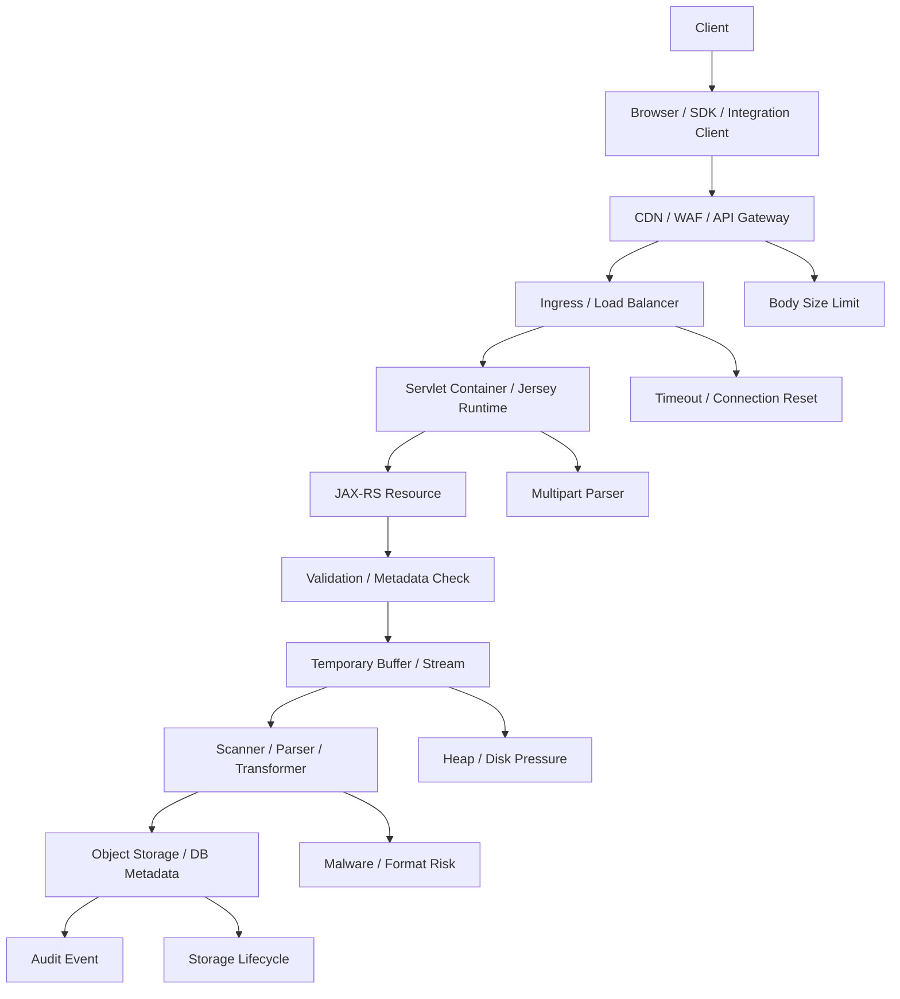
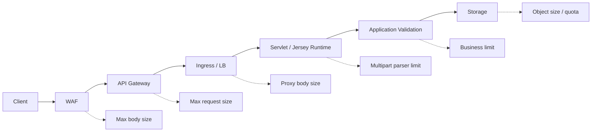
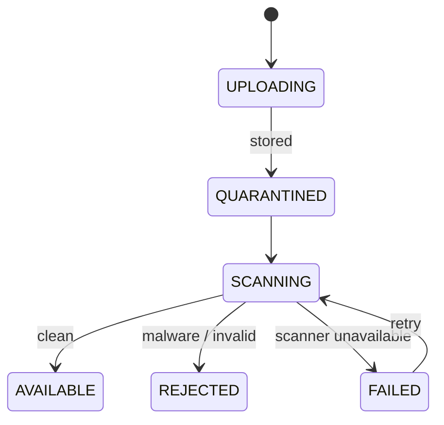
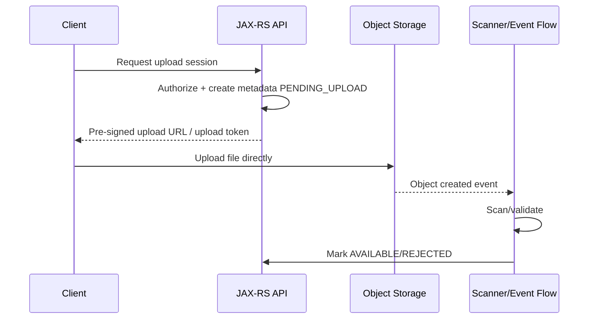

# Part 029 — File, Binary, and Multipart Handling

> Fokus part ini: memahami file dan binary payload sebagai resource-risk, bukan sekadar `byte[]` di endpoint. Di production, upload/download adalah titik rawan untuk OOM, disk penuh, request smuggling, malware, data leak, timeout, dan biaya storage/network yang tidak terlihat.

Dalam sistem enterprise seperti CPQ, quote management, atau order management, file/binary sering muncul sebagai:

```text
- attachment quote
- signed document
- generated PDF
- catalog import/export
- pricing sheet
- contract document
- customer evidence
- bulk order spreadsheet
- integration payload archive
```

Senior-level principle:

```text
A file endpoint is not just an API endpoint.
It is a memory, disk, network, storage, security, audit, and lifecycle boundary.
```

Jangan memperlakukan file upload seperti JSON biasa.

---

## 1. Mental Model: Binary Payload Lifecycle

Sebuah upload/download melewati banyak komponen sebelum mencapai resource method:



Failure can happen at every boundary.

Important consequence:

```text
Your endpoint may never run if a gateway rejects the body.
Your endpoint may run after the runtime has already buffered the full file.
Your endpoint may succeed while storage/audit/scanning fails afterward.
```

So PR review must include the entire path, not only the resource method.

---

## 2. Binary Is Not JSON

JSON APIs are usually small, structured, validated early, and cheap to log as metadata.

Binary APIs are different:

| Concern | JSON request | Binary/file request |
|---|---|---|
| Typical size | KB | KB to GB |
| Validation | schema/field validation | metadata + content inspection |
| Memory risk | moderate | high |
| Logging | safe if redacted | never log content |
| Retry cost | usually low | potentially expensive |
| Security risk | injection/deserialization | malware, decompression bomb, content spoofing |
| Lifecycle | request-bound | storage/audit/retention-bound |

Bad pattern:

```java
@POST
@Path("/attachments")
@Consumes(MediaType.APPLICATION_OCTET_STREAM)
public Response upload(byte[] file) {
    storage.save(file);
    return Response.ok().build();
}
```

Why it is dangerous:

```text
- full payload is materialized in heap
- no size guard inside application
- no content type verification
- no checksum
- no metadata model
- no audit trail
- no streaming handoff
- hard to cancel safely
```

Better direction:

```java
@POST
@Path("/attachments")
@Consumes(MediaType.APPLICATION_OCTET_STREAM)
public Response upload(InputStream body,
                       @HeaderParam("Content-Type") String contentType,
                       @HeaderParam("Content-Length") Long contentLength,
                       @HeaderParam("X-Checksum-SHA256") String checksum) {
    // validate metadata first
    // stream to storage/scanner
    // persist metadata transactionally where appropriate
    // return stable attachment id
    return Response.accepted().build();
}
```

This still needs careful implementation, but the shape avoids unconditional heap materialization.

---

## 3. JAX-RS Binary Input Options

Common resource method shapes:

```java
@POST
@Consumes(MediaType.APPLICATION_OCTET_STREAM)
public Response upload(InputStream input) { ... }
```

```java
@POST
@Consumes("application/pdf")
public Response uploadPdf(InputStream input) { ... }
```

```java
@POST
@Consumes(MediaType.APPLICATION_OCTET_STREAM)
public Response upload(byte[] bytes) { ... }
```

Use `InputStream` for large or unknown-size payloads.

Use `byte[]` only when:

```text
- maximum size is very small
- body is guaranteed bounded by gateway/runtime/application
- memory impact is acceptable under concurrency
- tests explicitly cover size limit
```

Never use `String` for arbitrary binary.

---

## 4. JAX-RS Binary Output Options

Common download shapes:

```java
@GET
@Path("/{id}/content")
@Produces(MediaType.APPLICATION_OCTET_STREAM)
public Response download(@PathParam("id") String id) {
    InputStream stream = storage.open(id);

    return Response.ok(stream)
        .header("Content-Disposition", "attachment; filename=\"quote.pdf\"")
        .build();
}
```

For more control, use `StreamingOutput`:

```java
@GET
@Path("/{id}/content")
public Response download(@PathParam("id") String id) {
    StreamingOutput output = os -> {
        try (InputStream in = storage.open(id)) {
            in.transferTo(os);
        }
    };

    return Response.ok(output)
        .type("application/pdf")
        .header("Content-Disposition", "attachment; filename=\"quote.pdf\"")
        .build();
}
```

Important:

```text
Returning an InputStream does not automatically mean end-to-end streaming.
Filters, interceptors, runtime config, proxies, compression, or gateways may buffer.
```

This is why Part 030 goes deeper into streaming.

---

## 5. Media Type Strategy

Do not accept everything by default.

Bad:

```java
@Consumes(MediaType.WILDCARD)
```

Better:

```java
@Consumes({"application/pdf", "image/png", "image/jpeg"})
```

For generic binary upload:

```java
@Consumes(MediaType.APPLICATION_OCTET_STREAM)
```

But then require explicit metadata:

```text
- declared content type
- file extension if relevant
- checksum
- business document type
- upload purpose
- tenant / account / quote / order reference
```

Media type is client-declared. It is not proof.

Production systems should distinguish:

| Signal | Trust level |
|---|---|
| `Content-Type` header | weak, client-controlled |
| filename extension | weak, client-controlled |
| magic bytes | stronger, still imperfect |
| parser validation | stronger |
| malware scanner | separate security control |
| business validation | domain-specific |

---

## 6. Multipart Mental Model

Multipart is not a single body. It is a container of parts.

Typical multipart request:

```text
Content-Type: multipart/form-data; boundary=----abc

------abc
Content-Disposition: form-data; name="metadata"
Content-Type: application/json

{"documentType":"QUOTE_ATTACHMENT"}
------abc
Content-Disposition: form-data; name="file"; filename="quote.pdf"
Content-Type: application/pdf

<binary>
------abc--
```

Multipart is useful when file and metadata must be submitted together.

But it introduces complexity:

```text
- parser implementation is runtime/provider-specific
- parts may be buffered to memory or temp disk
- per-part size limit is separate from total body limit
- filename is untrusted
- nested multipart may exist
- malformed boundary can trigger parser errors
```

---

## 7. Multipart in Jersey/JAX-RS

JAX-RS standard does not define one universal multipart API. Multipart support is usually implementation/library-specific.

In Jersey, multipart support commonly involves Jersey multipart modules and classes such as `FormDataMultiPart` or `FormDataBodyPart`, depending on version and namespace.

Illustrative Jersey-style shape:

```java
@POST
@Path("/attachments")
@Consumes(MediaType.MULTIPART_FORM_DATA)
public Response upload(FormDataMultiPart multipart) {
    // extract metadata part
    // extract file part
    // validate sizes and content
    // stream/store safely
    return Response.ok().build();
}
```

Do not assume this is available in the internal codebase.

Internal verification checklist must confirm:

```text
- whether multipart is supported
- which Jersey multipart dependency/version is used
- whether namespace is javax.* or jakarta.*
- how temporary files are handled
- where size limits are configured
- whether multipart provider is registered explicitly or auto-discovered
```

---

## 8. Size Limits Must Exist at Multiple Layers

A safe file upload path has limits at multiple layers:



Application-only limit is not enough.

Why:

```text
- runtime may buffer before application checks size
- gateway may reject request before app sees it
- inconsistent limits cause confusing behavior
- attackers target the weakest layer
```

A mature system defines:

```text
- maximum total request size
- maximum file size
- maximum number of parts
- maximum metadata size
- maximum filename length
- maximum decompressed size if archives are allowed
- tenant/account quota
```

---

## 9. Memory Pressure Model

A common production mistake is assuming one upload equals one memory allocation.

In reality:

```text
effective memory pressure = payload buffering * concurrency * copies * parser overhead
```

Possible copies:

```text
- network buffer
- servlet container buffer
- multipart parser buffer
- application byte[]
- scanner buffer
- storage SDK buffer
- logging/diagnostic accidental copy
```

If 50 concurrent users upload 100 MB files and the application materializes each as `byte[]`, the service is effectively dead.

Prefer streaming and bounded buffers.

But remember:

```text
Streaming reduces heap pressure.
It does not eliminate disk, network, timeout, or downstream pressure.
```

---

## 10. Temporary Disk Pressure

Multipart parsers often spill large parts to temporary disk.

This creates another failure mode:

```text
- pod ephemeral storage full
- node disk pressure
- temp directory permission issue
- cleanup failure
- slow disk causing request latency
- unbounded temp files after aborted upload
```

In Kubernetes, ephemeral storage is a real resource. A pod can be evicted because temp files filled its ephemeral storage.

Internal verification checklist:

```text
- where temp upload files are stored
- whether ephemeral storage requests/limits are set
- whether temp files are cleaned on abort/failure
- whether uploads use memory threshold before disk spill
- whether node/pod disk pressure is monitored
```

---

## 11. Filename Is Untrusted Input

Never trust uploaded filenames.

Risks:

```text
- path traversal: ../../etc/passwd
- control characters
- Unicode confusables
- excessive length
- misleading extension
- shell injection if passed to external process
- log injection
```

Bad:

```java
Path target = uploadDir.resolve(clientFilename);
```

Better:

```java
String storageKey = generatedAttachmentId + ".bin";
String displayName = sanitizeForDisplay(clientFilename);
```

Separate:

```text
storage key != display filename
```

The storage key should be generated by the system. The original filename is metadata only.

---

## 12. Content-Disposition for Downloads

For downloads, `Content-Disposition` controls browser behavior.

Common patterns:

```text
Content-Disposition: attachment; filename="quote.pdf"
Content-Disposition: inline; filename="quote.pdf"
```

Guidance:

```text
- use attachment for untrusted user uploads
- use inline only when rendering in browser is intentionally allowed
- sanitize filename
- consider RFC 5987 filename* for UTF-8 names
- do not allow header injection through filename
```

Bad:

```java
.header("Content-Disposition", "attachment; filename=" + userFilename)
```

Better:

```java
.header("Content-Disposition", contentDispositionForSafeFilename(displayName))
```

---

## 13. Checksum and Integrity

For critical file flows, use checksum.

Possible headers:

```text
X-Checksum-SHA256: <hex>
Digest: sha-256=<base64>
```

Checksum can help detect:

```text
- corrupted upload
- partial write
- mismatch between metadata and content
- duplicate file
- storage transfer corruption
```

But checksum does not prove trust. A malicious client can provide checksum for malicious content.

Checksum is integrity, not safety.

---

## 14. Malware and Content Scanning Boundary

Enterprise systems often need scanning for uploaded files.

Possible models:

```text
1. synchronous scan before accepting upload
2. asynchronous scan after storing in quarantine
3. direct-to-object-storage upload, then scan event
4. reject unsafe content before making it visible
```

A safer lifecycle:



Avoid making uploaded content visible before security checks pass, unless business explicitly accepts the risk.

Internal verification checklist:

```text
- is scanning required?
- synchronous or asynchronous?
- quarantine storage?
- scanner timeout and failure behavior?
- who can download unscanned files?
- how are rejected files audited?
```

---

## 15. Database vs Object Storage

Do not put large files in PostgreSQL by default just because metadata is relational.

Common architecture:

```text
PostgreSQL:
- attachment id
- owner entity id
- tenant id
- document type
- content type
- original filename
- storage key
- checksum
- size
- scan status
- retention metadata
- audit fields

Object storage:
- actual binary content
```

Trade-off:

| Option | Strength | Risk |
|---|---|---|
| DB BLOB | transactional with metadata | DB bloat, backup cost, query pressure |
| object storage | scalable, cheap, lifecycle policies | consistency boundary with DB |
| filesystem | simple locally | poor for distributed/cloud runtime |

For Kubernetes/cloud systems, object storage is usually the safer default for large binaries.

---

## 16. Metadata Transaction Boundary

A common consistency problem:

```text
- file stored successfully
- DB metadata insert fails
- orphan object remains
```

Or:

```text
- DB metadata inserted
- file storage fails
- metadata points to missing object
```

Possible patterns:

```text
1. store file first, then insert metadata, with orphan cleanup job
2. insert metadata as PENDING, upload file, then mark AVAILABLE
3. upload to quarantine, process asynchronously, publish event
4. use outbox/reconciliation for consistency
```

For critical systems, model file status explicitly.

Example status:

```text
PENDING_UPLOAD
UPLOADED
SCANNING
AVAILABLE
REJECTED
FAILED
DELETED
EXPIRED
```

---

## 17. Authorization and Tenant Boundary

File endpoints need object-level authorization.

Do not only check:

```text
user has ATTACHMENT_READ role
```

Also check:

```text
- file belongs to tenant/account accessible to caller
- file belongs to quote/order visible to caller
- file status allows download
- file classification allows this caller
- service-to-service caller is allowed for this document type
```

For downloads, resource existence leakage matters.

Options:

```text
- return 403 if caller knows resource exists but lacks permission
- return 404 if caller must not know it exists
```

Pick a standard.

---

## 18. Audit Requirements

File access is often audit-sensitive.

Audit events may include:

```text
- file uploaded
- metadata changed
- file scanned
- file downloaded
- file rejected
- file deleted
- file retention expired
```

Audit event should include:

```text
- actor identity
- service identity if service-to-service
- tenant/account
- owning entity id
- attachment id
- action
- timestamp
- outcome
- reason/error code
- correlation ID
```

Never include raw file content in logs or audit.

---

## 19. File Download Caching

Download caching depends on content mutability and security.

For immutable generated artifacts:

```text
Cache-Control: private, max-age=...
ETag: "sha256-or-version"
```

For sensitive or permission-dependent content:

```text
Cache-Control: no-store
```

For object storage signed URLs:

```text
- keep expiration short
- scope to exact object
- avoid broad permissions
- audit URL generation separately
```

Do not blindly cache tenant-sensitive files through shared proxies.

---

## 20. Direct Upload to Object Storage

For large files, direct upload may be better:



Benefits:

```text
- API service does not proxy large bytes
- reduces JVM heap/network pressure
- object storage handles upload scaling
```

Risks:

```text
- harder end-to-end transaction
- requires reconciliation
- signed URL leakage risk
- client must support upload protocol
- object event ordering/latency
```

---

## 21. Error Mapping for File APIs

Common mappings:

| Situation | Status |
|---|---:|
| unsupported content type | 415 |
| malformed multipart | 400 |
| file too large | 413 |
| missing required part | 400 |
| unauthorized | 401 |
| forbidden | 403 or 404 |
| file not found | 404 |
| upload conflict / duplicate | 409 |
| checksum mismatch | 400 or 422 |
| scanner unavailable | 503 or async pending |
| storage unavailable | 503 |
| timeout | 504/503 depending boundary |

Include stable error code:

```json
{
  "errorCode": "ATTACHMENT_FILE_TOO_LARGE",
  "message": "Uploaded file exceeds the allowed size.",
  "correlationId": "..."
}
```

Do not expose internal storage bucket/key unless it is part of contract and safe.

---

## 22. Observability for File Endpoints

Minimum metrics:

```text
- upload request count by outcome
- download request count by outcome
- upload size histogram
- download size histogram
- upload duration histogram
- storage write/read latency
- scanner latency
- scanner failure count
- rejected file count
- timeout count
- aborted upload count
```

Avoid high-cardinality labels:

```text
Bad labels:
- filename
- attachment id
- quote id
- customer id

Better labels:
- document type
- endpoint
- outcome
- tenant tier if allowed
- size bucket
```

Logs should include metadata, not content.

---

## 23. Cancellation and Partial Upload

Clients disconnect. Proxies timeout. Pods restart.

Design for partial upload:

```text
- temporary file cleanup
- incomplete object cleanup
- metadata status remains PENDING/FAILED
- reconciliation job detects stuck upload
- idempotent retry can continue or replace safely
```

Never assume `finally` always completes all cleanup during container termination.

Use lifecycle jobs to clean up stuck states.

---

## 24. PR Review Checklist

For file upload/download endpoint, review:

```text
Contract
- Is media type explicit?
- Is max file size documented?
- Are metadata fields explicit?
- Is response stable and backward-compatible?

Memory/resource safety
- Is payload streamed rather than loaded into heap?
- Are size limits enforced at all layers?
- Is temp disk usage bounded?
- Are streams closed?
- Is cancellation handled?

Security
- Is filename sanitized?
- Is content type verified beyond header?
- Is malware scanning required?
- Is tenant/object-level authorization enforced?
- Is raw content excluded from logs?

Storage lifecycle
- Where is binary content stored?
- Is metadata consistent with storage?
- Are orphan objects cleaned?
- Is retention/deletion defined?

Observability
- Are size/duration/outcome metrics available?
- Are storage/scanner failures visible?
- Is correlation ID propagated?

Testing
- oversized file
- unsupported media type
- malformed multipart
- missing part
- checksum mismatch
- unauthorized download
- aborted upload
- storage failure
```

---

## 25. Internal Verification Checklist

Verify in internal CSG/codebase context:

```text
Runtime/provider
- Is multipart support enabled?
- Is it Jersey-specific, Servlet-specific, or another library?
- Is namespace javax.* or jakarta.*?
- Are providers registered explicitly or discovered?

Limits
- Gateway max body size
- Ingress/proxy body size
- Servlet/Jersey multipart limit
- application business limit
- object storage limit/quota

Storage
- DB vs object storage
- storage key convention
- metadata table
- status lifecycle
- retention policy
- orphan cleanup job

Security
- scanner requirement
- quarantine model
- content type verification
- filename sanitization
- tenant/object-level authorization
- audit event requirements

Operations
- upload/download dashboards
- scanner dashboard
- storage error alerts
- temp disk monitoring
- failed upload reconciliation
```

---

## 26. Senior Engineer Heuristics

Use these heuristics during design and review:

```text
1. Never accept unbounded file input.
2. Never trust filename or Content-Type alone.
3. Never put large payloads in heap by default.
4. Never make uploaded content visible before required checks pass.
5. Never let file metadata and storage drift without reconciliation.
6. Never log raw file content.
7. Always define retention, deletion, and audit behavior.
8. Always test oversized, malformed, unauthorized, and aborted flows.
```

---

## 27. Summary

File/binary handling in JAX-RS is a production engineering problem.

The important boundaries are:

```text
- media type boundary
- size limit boundary
- memory/disk boundary
- parser/provider boundary
- security/scanning boundary
- object-level authorization boundary
- metadata/storage consistency boundary
- audit/retention boundary
- observability boundary
```

A senior engineer should not only ask, “does the upload work?”

Ask:

```text
What happens when the file is too large, malicious, slow, partially uploaded,
unauthorized, duplicated, unscanned, orphaned, or requested across tenant boundary?
```

That is the production-level question.
