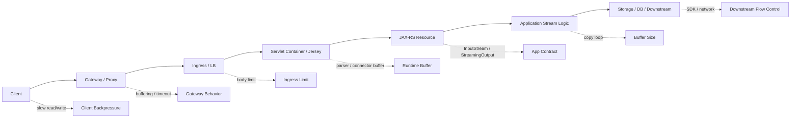

# Part 030 — Streaming Request and Response

> Fokus part ini: memahami streaming sebagai lifecycle end-to-end, bukan hanya penggunaan `InputStream` atau `StreamingOutput`. Streaming yang benar harus mempertimbangkan buffering tersembunyi, timeout, cancellation, client disconnect, proxy behavior, backpressure, storage SDK, dan observability.

Streaming digunakan saat payload terlalu besar, terlalu lambat, atau terlalu incremental untuk diproses sebagai object kecil di memory.

Contoh use case enterprise:

```text
- download generated PDF besar
- export quote/order/report
- upload/import catalog file
- stream attachment ke object storage
- proxy download dari downstream service
- bulk data import/export
- long-running generated artifact
```

Senior-level principle:

```text
Using InputStream is not the same as having a streaming architecture.
```

Streaming hanya benar jika seluruh path tidak melakukan buffering berbahaya.

---

## 1. Mental Model: End-to-End Streaming Path



The application is only one segment of the stream.

A stream can still be broken by:

```text
- gateway buffering entire response
- proxy timeout before first byte
- servlet container buffering
- compression layer buffering
- storage SDK buffering
- client reading too slowly
- downstream producing too slowly
- application not closing streams
```

---

## 2. Streaming vs Buffering

Buffering means accumulating bytes before forwarding them.

Streaming means processing/forwarding bytes incrementally.

| Pattern | Memory behavior | Latency behavior | Risk |
|---|---|---|---|
| `byte[]` request | full body in heap | waits for complete body | OOM under concurrency |
| `String` body | full body + encoding | waits for complete body | corrupts binary |
| `InputStream` | incremental if runtime allows | can process as data arrives | may still be pre-buffered upstream |
| `StreamingOutput` | incremental write | first byte can be early | client disconnect handling needed |
| temp-file buffering | heap-safe but disk-heavy | waits/spills depending parser | pod/node disk pressure |

The key review question:

```text
Where are the bytes accumulated, and what is the maximum accumulation under concurrency?
```

---

## 3. Streaming Request with InputStream

Basic JAX-RS shape:

```java
@POST
@Path("/imports/catalog")
@Consumes(MediaType.APPLICATION_OCTET_STREAM)
public Response importCatalog(InputStream input,
                              @HeaderParam("Content-Length") Long contentLength,
                              @HeaderParam("Content-Type") String contentType) {
    // validate metadata
    // stream to parser/storage
    // return accepted/result
    return Response.accepted().build();
}
```

Important points:

```text
- validate headers before reading large body where possible
- enforce max size while reading
- use bounded buffer
- close downstream resources
- account for partial reads and client disconnect
- do not read into byte[] unless bounded and small
```

---

## 4. Enforcing Size While Streaming

Do not rely only on `Content-Length`.

Why:

```text
- header may be absent for chunked transfer
- client may lie
- gateway may transform request
- multipart has per-part sizes
```

Use counting logic while reading.

Illustrative pattern:

```java
long maxBytes = 50L * 1024 * 1024;
long total = 0L;
byte[] buffer = new byte[8192];

int read;
while ((read = input.read(buffer)) != -1) {
    total += read;
    if (total > maxBytes) {
        throw new PayloadTooLargeException("File exceeds limit");
    }
    sink.write(buffer, 0, read);
}
```

This protects application logic even if upstream size checks are misconfigured.

Still, it does not protect runtime/gateway if they buffer before your code runs.

---

## 5. Streaming Response with StreamingOutput

Basic JAX-RS response streaming:

```java
@GET
@Path("/exports/{id}")
@Produces(MediaType.APPLICATION_OCTET_STREAM)
public Response downloadExport(@PathParam("id") String id) {
    StreamingOutput output = os -> {
        try (InputStream in = exportStorage.open(id)) {
            in.transferTo(os);
        }
    };

    return Response.ok(output)
        .header("Content-Disposition", "attachment; filename=\"export.csv\"")
        .build();
}
```

Benefits:

```text
- avoids building full response in heap
- can stream from storage to client
- useful for large downloads
```

Risks:

```text
- exceptions may happen after headers are committed
- error mapping may no longer work normally
- client disconnect appears as write failure
- downstream storage read failure creates partial response
- metrics must record partial failures
```

---

## 6. Headers Commit Problem

Once response headers and part of body are sent, you cannot cleanly return a JSON error response.

Example:

```text
1. server sends 200 OK
2. server writes first 2 MB
3. storage read fails
4. server cannot change status to 503
5. client sees broken/partial download
```

Therefore, before starting stream, validate what can be validated:

```text
- authorization
- resource existence
- file status
- metadata
- content length if known
- storage object availability if cheaply checkable
```

But do not pre-read the entire file just to avoid partial failure. That defeats streaming.

---

## 7. Content-Length vs Chunked Transfer

If total size is known, include `Content-Length`.

Benefits:

```text
- client can show progress
- client can detect incomplete download
- some proxies behave better
```

If size is unknown or generated dynamically, response may use chunked transfer.

Trade-off:

| Mode | Benefit | Risk |
|---|---|---|
| known `Content-Length` | progress, integrity check | must know size before response |
| chunked | good for dynamic stream | harder progress/integrity, proxy timeout risk |

For generated exports, consider asynchronous generation:

```text
request export -> return job id -> generate file -> download immutable artifact
```

This is often safer than streaming long-running generation synchronously.

---

## 8. Long-Running Export: Sync Streaming vs Async Artifact

Synchronous streaming:

```text
client waits while server generates and streams
```

Good when:

```text
- generation is fast
- payload is moderate
- client can keep connection open
- failure cost is low
```

Async artifact pattern:

```text
POST /exports -> 202 Accepted + exportId
GET /exports/{id} -> status
GET /exports/{id}/content -> download when ready
```

Better when:

```text
- generation is slow
- output is large
- retries are expected
- audit/status is needed
- client/network may disconnect
- downstream dependencies are unstable
```

For enterprise systems, async artifact is usually more operable.

---

## 9. Backpressure

Backpressure means a downstream component cannot consume data as fast as upstream produces it.

In blocking Java I/O, backpressure appears as slow `read()` or slow `write()`.

Examples:

```text
- client downloads slowly -> OutputStream.write blocks
- object storage reads slowly -> InputStream.read blocks
- downstream HTTP stream stalls -> copy loop stalls
- network throttles container -> latency increases
```

If request thread is blocked for a long time, it reduces concurrency capacity.

Questions to ask:

```text
- How many concurrent streams can the service tolerate?
- What thread pool handles streams?
- Are streaming endpoints isolated from normal API endpoints?
- Are timeouts configured for slow clients and slow downstreams?
```

---

## 10. Thread Occupancy Risk

Traditional Servlet/JAX-RS blocking streaming usually occupies a request thread for the duration of the stream.

If downloads take 2 minutes and max request threads are 200, enough slow clients can starve the service.

Mitigations:

```text
- limit concurrent streaming requests
- separate large transfer endpoints/services
- use direct object storage signed URLs
- tune request thread pool carefully
- enforce read/write timeouts
- use gateway rate limits
- prefer async artifact model for heavy exports
```

Do not allow large stream traffic to starve critical command APIs.

---

## 11. Client Disconnect and Cancellation

Clients disconnect frequently:

```text
- browser tab closed
- mobile network changed
- gateway timeout
- client retry starts a new request
- user cancels download
```

In server code, this may appear as:

```text
- IOException during write
- broken pipe
- connection reset by peer
- EOF while reading upload
```

Handling rule:

```text
Client disconnect is not always an application error.
```

Log it at appropriate level. Do not page someone for every broken pipe.

But track metrics because high disconnect rate may indicate timeout, performance, or UX problem.

---

## 12. Timeout Model for Streaming

Streaming needs multiple timeouts:

```text
- client timeout
- gateway idle timeout
- ingress timeout
- servlet connector timeout
- application operation timeout
- storage SDK read timeout
- downstream HTTP timeout
```

Misalignment causes confusing failures.

Example:

```text
Gateway idle timeout: 60s
Export generation before first byte: 90s
```

Result:

```text
Gateway closes connection before app writes anything.
```

Possible fixes:

```text
- async export job
- write heartbeat/chunk only if protocol allows and meaningful
- reduce generation time before first byte
- increase timeout intentionally
- move large download to object storage signed URL
```

Do not increase timeout blindly. Longer timeout increases resource occupancy.

---

## 13. Compression Interaction

Compression can help text exports, but it can also introduce buffering and CPU pressure.

Consider:

```text
- CSV/JSON exports compress well
- PDFs/images/zips usually do not
- compression may delay first byte
- compression uses CPU
- compression can make Content-Length unknown
- compression may be handled by gateway rather than app
```

For already-compressed content, disable or avoid redundant compression.

Internal verification:

```text
- where compression is enabled
- whether gateway compresses responses
- whether application also compresses
- whether streaming response is buffered for compression
```

---

## 14. Streaming Through Proxies and Gateways

Proxies may buffer by default.

Potential behaviors:

```text
- buffer full request before forwarding
- buffer full response before sending
- enforce body size limits
- close idle connection
- transform transfer encoding
- compress response
- strip headers
```

Therefore, streaming must be tested through the real path:

```text
client -> gateway -> ingress -> service -> storage
```

Local tests against embedded server are not enough.

---

## 15. Range Requests and Resume

For large downloads, HTTP range support can improve reliability.

Range request:

```text
Range: bytes=1000-1999
```

Response:

```text
206 Partial Content
Content-Range: bytes 1000-1999/10000
```

Useful for:

```text
- resumable downloads
- media/files
- unstable networks
- large generated artifacts
```

But implementing range correctly is non-trivial.

Checklist:

```text
- immutable content
- known content length
- stable ETag
- storage supports range read
- authorization checked for each request
- range validation
```

For many systems, object storage/CDN is better at range delivery than application code.

---

## 16. Upload Resume and Chunked Upload

Large uploads may need resumability.

Patterns:

```text
- direct object storage multipart upload
- upload session with parts
- client sends chunk index + checksum
- server assembles after all chunks
- background cleanup for abandoned sessions
```

Risks:

```text
- duplicate chunks
- missing chunks
- out-of-order chunks
- session hijack
- storage leak
- checksum mismatch
```

For enterprise systems, prefer platform/object-storage multipart upload when possible.

Do not invent custom chunk protocol unless required.

---

## 17. Streaming Parser vs Full Parse

For imports, parsing strategy matters.

Full parse:

```text
read entire file -> parse into object graph -> validate -> persist
```

Streaming parse:

```text
read row/event at a time -> validate incrementally -> persist/batch
```

Streaming parse helps with memory, but complicates transaction/error model.

Questions:

```text
- Should one bad row reject the entire file?
- Can valid rows be partially accepted?
- How is progress reported?
- How are row-level errors returned?
- Is import idempotent?
- Is there a reconciliation path?
```

For large business imports, async import job with status is often better than synchronous streaming response.

---

## 18. Streaming and Transactions

Never keep a database transaction open while streaming a large response if avoidable.

Bad pattern:

```text
open DB transaction
query rows lazily
stream response for minutes
commit after stream finishes
```

Risks:

```text
- long-running transaction
- lock retention
- MVCC bloat
- connection pool exhaustion
- transaction timeout
- partial response after DB failure
```

Better patterns:

```text
- materialize export to storage asynchronously
- page through data without long transaction
- use read-only cursor carefully with explicit limits
- separate metadata transaction from streaming content
```

---

## 19. Streaming from Downstream HTTP

Proxying downstream streams is risky:

```java
@GET
@Path("/proxy/{id}")
public Response proxy(@PathParam("id") String id) {
    InputStream downstream = downstreamClient.openStream(id);
    return Response.ok((StreamingOutput) os -> downstream.transferTo(os)).build();
}
```

Problems:

```text
- downstream response must be closed
- client disconnect should cancel downstream
- timeout must apply to downstream read
- headers/status mapping must be explicit
- partial downstream failure becomes partial client response
- retries after partial write are unsafe
```

If proxying is necessary, treat it as a coupled stream lifecycle.

---

## 20. Error Handling During Streaming

Before streaming starts, normal error mapping works.

After streaming starts, error handling changes.

Before first byte:

```text
- can return 401/403/404/409/503 with JSON error body
```

After first byte:

```text
- cannot reliably change HTTP status
- can only close/break stream
- client must detect partial response
- server logs/metrics must record failure
```

For critical downloads, include checksum/ETag/Content-Length so client can detect corruption or partial content.

---

## 21. Observability for Streaming

Minimum metrics:

```text
- stream started count
- stream completed count
- stream failed count
- stream cancelled/client disconnect count
- bytes read/written histogram
- stream duration histogram
- time to first byte
- downstream read latency
- write stall duration if measurable
- active stream gauge
```

Logs should include:

```text
- correlation ID
- stream id/export id/attachment id if allowed
- document type
- size if known
- outcome
- failure class
- duration
```

Avoid logging:

```text
- raw bytes
- full filenames if sensitive
- customer data
- high-cardinality unbounded labels in metrics
```

---

## 22. Testing Streaming

Unit tests are not enough.

Test cases:

```text
- large upload does not OOM
- upload exceeding limit is rejected
- client disconnect during upload
- client disconnect during download
- storage read failure after partial response
- slow client download
- slow storage source
- gateway timeout before first byte
- compression enabled/disabled
- known Content-Length vs chunked
- concurrent streams under load
```

Use integration/performance tests where possible.

Important test question:

```text
Does the test go through the same gateway/proxy settings as production?
```

If not, it proves only application behavior, not real streaming behavior.

---

## 23. When Not to Stream Through the API Service

Avoid API-service streaming when:

```text
- files are very large
- downloads are frequent
- clients are slow/unreliable
- response generation is long-running
- service has limited request threads
- object storage can serve directly
- range/resume support is needed
```

Prefer:

```text
- async generation + object storage
- short-lived signed URL
- CDN/object storage delivery
- background import/export job
```

The API service should often orchestrate access, not move every byte itself.

---

## 24. JAX-RS/Jersey-Specific Verification

Streaming behavior depends on runtime and provider configuration.

Verify:

```text
- Jersey version and runtime
- Servlet container connector settings
- response buffering settings
- request entity buffering behavior
- filters/interceptors that read entity stream
- logging filters that buffer body
- compression filters
- exception mapper behavior after response commit
- multipart provider buffering thresholds
```

Dangerous cross-cutting components:

```text
- request/response logging filter that reads full body
- security scanner that buffers full body
- metrics filter that wraps stream incorrectly
- retry wrapper around non-repeatable stream
- HTTP client that auto-buffers response
```

---

## 25. Internal Verification Checklist

For internal CSG/codebase verification:

```text
Runtime path
- What container/runtime handles streaming?
- Does gateway buffer request/response?
- What are idle/read/write timeouts?
- Are streaming endpoints behind different ingress rules?

Application behavior
- Are InputStream/StreamingOutput used?
- Are streams copied with bounded buffers?
- Are streams closed correctly?
- Are there body-logging filters?
- Is cancellation detected and classified?

Resource limits
- Max concurrent streams
- max upload/download size
- pod memory and ephemeral storage
- request thread pool size
- storage SDK pool/timeout

Security
- authorization before streaming
- tenant boundary checked
- signed URL policy if used
- no raw content logging

Observability
- active stream count
- bytes transferred
- duration and time-to-first-byte
- failure/cancellation metrics
- dashboard and alert policy
```

---

## 26. PR Review Checklist

When reviewing streaming code, ask:

```text
Contract
- Is response type explicit?
- Is Content-Length known or intentionally chunked?
- Are headers safe and correct?
- Is async artifact better than synchronous streaming?

Resource safety
- Is anything reading full stream into memory?
- Are buffers bounded?
- Are streams closed on success/failure?
- Are thread occupancy and concurrent stream limits considered?

Failure behavior
- What happens if client disconnects?
- What happens if downstream fails mid-stream?
- What happens after headers are committed?
- Is partial response detectable?

Timeout/backpressure
- Are timeouts aligned across gateway, container, app, storage?
- Can slow clients starve request threads?
- Is load shedding/rate limiting needed?

Security
- Is authorization completed before streaming starts?
- Is tenant/object-level access enforced?
- Is sensitive content excluded from logs?

Testing
- Are large payloads tested?
- Are disconnects tested?
- Are slow streams tested?
- Is production-like proxy path tested?
```

---

## 27. Senior Engineer Heuristics

```text
1. If generation is slow, prefer async artifact over long synchronous stream.
2. If file is large, prefer object storage delivery over API byte proxy.
3. If streaming through app, isolate and limit concurrency.
4. Never assume InputStream means no buffering.
5. Never keep DB transaction open for long streaming response.
6. Validate authorization and metadata before first byte.
7. Expect errors after headers are committed.
8. Track completed, failed, and cancelled streams separately.
```

---

## 28. Summary

Streaming is a production behavior across the full request path.

The core questions are:

```text
- Where are bytes buffered?
- Who owns timeout and cancellation?
- What happens after headers are committed?
- Can slow clients exhaust threads?
- Can downstream failure create partial output?
- Is object storage/CDN a better byte path?
- Are metrics and logs sufficient to debug partial streams?
```

A senior engineer should treat streaming as a resource-control design decision, not an implementation detail.
