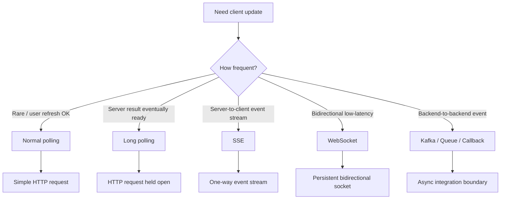
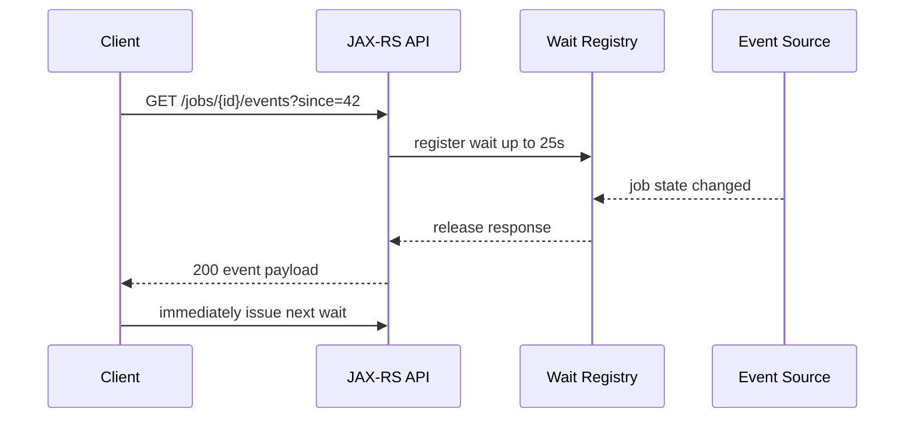
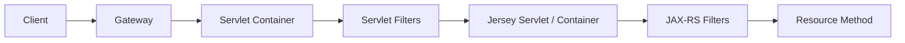

# Part 031 — SSE, Long Polling, WebSocket, and Servlet Integration

> Fokus part ini: memahami pola komunikasi yang hidup lebih lama dari request-response biasa. SSE, long polling, dan WebSocket bukan sekadar API style; ketiganya mengubah lifecycle connection, timeout, scaling, observability, load balancer behavior, memory profile, dan failure mode service.

Di backend enterprise, realtime-ish communication sering muncul untuk:

```text
- status long-running quote calculation
- progress import/export catalog
- notification order status
- background job progress
- async validation result
- workflow task update
- user-facing dashboard refresh
- operational event feed
```

Namun senior engineer harus mulai dari prinsip ini:

```text
Do not introduce long-lived connections before proving that polling, eventing, or async callback cannot satisfy the requirement.
```

Long-lived connection meningkatkan complexity pada runtime, gateway, security, capacity planning, dan deployment.

---

## 1. Communication Pattern Map



Pattern selection depends on:

```text
- one-way vs bidirectional communication
- browser vs service client
- connection duration
- event volume
- latency expectation
- network intermediaries
- retry/resume requirement
- tenant isolation
- authentication model
- gateway/proxy capability
- operational maturity
```

---

## 2. Polling, Long Polling, SSE, and WebSocket Compared

| Pattern | Direction | Connection duration | Complexity | Good for | Avoid when |
|---|---:|---:|---:|---|---|
| Normal polling | Client → Server | Short | Low | Status refresh, low frequency update | Need low latency or high frequency |
| Long polling | Client → Server, delayed response | Medium | Medium | Waiting for result/event without continuous stream | Many clients, long waits, aggressive proxy timeout |
| SSE | Server → Client | Long | Medium | Notifications, progress feed, event stream to browser | Need client-to-server realtime messages |
| WebSocket | Bidirectional | Long | High | Interactive bidirectional communication | Simple status update or one-way notification |
| Kafka/Queue | Service-to-service async | N/A to browser | Medium/High | Backend event propagation | Direct browser update without bridge |

Senior-level heuristic:

```text
Prefer the simplest pattern that satisfies latency and interaction requirements.
```

For many enterprise systems, especially quote/order workflows, the practical order is often:

```text
1. normal polling with sane cache/status endpoint
2. long polling for wait-until-change semantics
3. SSE for one-way UI event feed
4. WebSocket only for true bidirectional realtime interaction
```

---

## 3. Normal Polling Baseline

Before using long-lived connections, design a clean polling endpoint.

Example:

```http
GET /quotes/{quoteId}/calculation-status
Accept: application/json
```

Response:

```json
{
  "quoteId": "q-123",
  "status": "IN_PROGRESS",
  "progressPercent": 70,
  "lastUpdatedAt": "2026-07-10T02:00:00Z",
  "nextRecommendedPollAfterMs": 3000
}
```

Why this matters:

```text
- easy to cache or throttle
- easy to secure
- easy to observe
- easy to retry
- easy to load test
- compatible with API gateway
- no sticky connection requirement
```

Polling becomes dangerous when clients poll too frequently.

Mitigations:

```text
- server-suggested polling interval
- ETag / conditional request
- rate limiting
- exponential backoff on unchanged response
- status resource with lightweight DB/cache query
- avoid recalculating expensive state per poll
```

---

## 4. Long Polling Mental Model

Long polling means the client sends a normal HTTP request, but the server holds the response until:

```text
- a change is available
- timeout expires
- client disconnects
- server cancels the wait
- service is shutting down
```



Long polling is still HTTP. It does not require WebSocket.

Common response when no change occurs:

```http
204 No Content
Retry-After: 3
```

Or:

```http
200 OK
Content-Type: application/json

{
  "events": [],
  "nextCursor": "42",
  "retryAfterMs": 3000
}
```

Pick one convention and keep it consistent.

---

## 5. Long Polling Design Rules

A long polling endpoint needs explicit limits.

```text
- max wait duration
- max concurrent waits per user/tenant
- max global open waits
- max events returned per request
- cursor/offset semantics
- client retry interval
- timeout response semantics
- cancellation behavior
- shutdown behavior
```

Bad long polling design:

```java
@GET
@Path("/jobs/{id}/wait")
public Response waitForever(@PathParam("id") String id) throws InterruptedException {
    while (!jobDone(id)) {
        Thread.sleep(1000);
    }
    return Response.ok(loadResult(id)).build();
}
```

Problems:

```text
- blocks request thread
- unclear max wait
- no cancellation check
- no client disconnect awareness
- no concurrency cap
- no tenant-level fairness
- polling DB repeatedly
- painful shutdown
```

Better mental model:

```text
Long polling is a bounded wait on a notification mechanism, not a while-loop inside resource method.
```

---

## 6. Long Polling Implementation Considerations in JAX-RS

JAX-RS supports asynchronous server responses through `AsyncResponse`.

Conceptual example:

```java
@GET
@Path("/jobs/{jobId}/events")
@Produces(MediaType.APPLICATION_JSON)
public void waitForJobEvent(
        @PathParam("jobId") String jobId,
        @QueryParam("since") String cursor,
        @Suspended AsyncResponse asyncResponse) {

    asyncResponse.setTimeout(25, TimeUnit.SECONDS);
    asyncResponse.setTimeoutHandler(ar ->
        ar.resume(Response.status(Response.Status.NO_CONTENT)
            .header("Retry-After", "3")
            .build())
    );

    waitRegistry.register(jobId, cursor, new WaitCallback() {
        @Override
        public void onEvent(JobEventBatch events) {
            asyncResponse.resume(Response.ok(events).build());
        }

        @Override
        public void onFailure(Throwable error) {
            asyncResponse.resume(error);
        }
    });
}
```

Key production concerns:

```text
- who owns waitRegistry memory?
- how is wait removed on timeout?
- how is wait removed on client disconnect?
- how is tenant quota enforced?
- what happens on service shutdown?
- does context propagate into callback?
- does callback run on a safe executor?
```

---

## 7. SSE Mental Model

SSE stands for Server-Sent Events.

It is:

```text
- server-to-client only
- text/event-stream content type
- usually browser-friendly
- built on HTTP
- reconnectable by client
- simpler than WebSocket for one-way events
```

SSE event format:

```text
id: 1001
event: quote-calculation-progress
data: {"quoteId":"q-123","progress":70}

```

A stream is a sequence of events separated by blank lines.

Browser client:

```js
const source = new EventSource('/api/quotes/q-123/events');

source.addEventListener('quote-calculation-progress', event => {
  const payload = JSON.parse(event.data);
  console.log(payload.progress);
});

source.onerror = error => {
  console.error('SSE disconnected', error);
};
```

---

## 8. SSE in JAX-RS / Jersey Context

SSE is standardized in JAX-RS 2.1+ through APIs such as `Sse` and `SseEventSink`.

Conceptual example:

```java
@GET
@Path("/quotes/{quoteId}/events")
@Produces(MediaType.SERVER_SENT_EVENTS)
public void streamQuoteEvents(
        @PathParam("quoteId") String quoteId,
        @Context Sse sse,
        @Context SseEventSink sink) {

    eventSubscriptionService.subscribe(quoteId, event -> {
        OutboundSseEvent sseEvent = sse.newEventBuilder()
            .id(event.sequence())
            .name("quote-calculation-progress")
            .mediaType(MediaType.APPLICATION_JSON_TYPE)
            .data(event.payload())
            .build();

        sink.send(sseEvent);
    });
}
```

This is simplified. Production implementation must handle:

```text
- sink lifecycle
- sink.close()
- error callback
- client disconnect
- heartbeat event
- subscription cleanup
- authentication expiry
- tenant quota
- event replay/resume
- backpressure / slow consumer
```

Jersey may provide additional SSE support/utilities depending on version. Treat those as implementation-specific and verify internally.

---

## 9. SSE Resume and Event ID

SSE can resume with `Last-Event-ID`.

Client reconnect flow:

```text
1. server sends events with monotonically increasing id
2. connection drops
3. browser reconnects and sends Last-Event-ID
4. server resumes after last delivered id if event history is available
```

Important design question:

```text
Is the SSE stream ephemeral or replayable?
```

Ephemeral stream:

```text
- simpler
- events lost on disconnect
- acceptable for low-value UI hints
- not acceptable for critical state transitions
```

Replayable stream:

```text
- needs event store, cursor, or durable source
- more operationally complex
- required when client must not miss transitions
```

For quote/order systems, avoid making critical business state depend solely on ephemeral SSE delivery. The source of truth should remain API/database/event log.

---

## 10. SSE Heartbeat

Long-lived connections are often closed by proxies if idle.

Heartbeat events keep the connection active:

```text
: heartbeat

```

Or named event:

```text
event: heartbeat
data: {}

```

Heartbeat interval must be lower than the shortest relevant idle timeout in the path:

```text
client <-> gateway <-> ingress <-> service <-> runtime
```

Internal verification checklist must find:

```text
- API gateway idle timeout
- ingress idle timeout
- load balancer idle timeout
- servlet connector timeout
- application stream timeout
```

Do not guess these values.

---

## 11. SSE Failure Modes

Common SSE production failures:

```text
- gateway buffers text/event-stream and events arrive late
- proxy closes idle connection
- no heartbeat
- sink not closed after disconnect
- subscription leak
- user opens many browser tabs
- tenant-level fanout overload
- slow client blocks event delivery
- auth token expires mid-stream
- event ID not monotonic
- replay cursor not durable
- deployment kills active streams
```

Symptoms:

```text
- increasing open connection count
- heap growth from subscription objects
- stale user session subscriptions
- high thread count
- client reconnect storm
- duplicate events after reconnect
- missing events after reconnect
- noisy error logs during deployment
```

Detection signals:

```text
- active SSE connections
- SSE connections per tenant/user
- event send latency
- send failure count
- reconnect count
- subscription cleanup count
- heartbeat sent count
- stream duration histogram
- dropped event count
```

---

## 12. WebSocket Mental Model

WebSocket upgrades an HTTP connection into a persistent bidirectional channel.

```mermaid
sequenceDiagram
    participant Client
    participant Gateway
    participant Server

    Client->>Gateway: HTTP Upgrade: websocket
    Gateway->>Server: Forward upgrade
    Server-->>Gateway: 101 Switching Protocols
    Gateway-->>Client: 101 Switching Protocols
    Client<->>Server: bidirectional frames
```

WebSocket is useful when:

```text
- server and client both send messages frequently
- latency matters
- message exchange is interactive
- one request/one response is not enough
```

Examples:

```text
- collaborative editing
- bidirectional control channel
- interactive operational console
- chat-like interface
- live negotiation session
```

For normal quote status updates, WebSocket is often overkill.

---

## 13. WebSocket and Jakarta Ecosystem

WebSocket is not the same as JAX-RS.

JAX-RS handles RESTful HTTP resources. WebSocket is usually handled through Jakarta WebSocket API or runtime-specific support.

Conceptual Jakarta WebSocket endpoint:

```java
@ServerEndpoint("/ws/quotes/{quoteId}")
public class QuoteWebSocketEndpoint {

    @OnOpen
    public void onOpen(Session session, @PathParam("quoteId") String quoteId) {
        // authenticate, authorize, register session
    }

    @OnMessage
    public void onMessage(String message, Session session) {
        // parse command, validate, dispatch
    }

    @OnClose
    public void onClose(Session session) {
        // unregister, cleanup
    }

    @OnError
    public void onError(Session session, Throwable error) {
        // log, cleanup, metrics
    }
}
```

Important boundary:

```text
Do not assume JAX-RS filters, exception mappers, or resource lifecycle apply automatically to WebSocket endpoints.
```

Authentication, authorization, logging, tracing, tenant resolution, and metrics may need separate integration.

---

## 14. WebSocket Production Complexity

WebSocket changes your operational model:

```text
- long-lived sessions
- stateful connection registry
- heartbeat/ping-pong
- message framing
- backpressure per session
- horizontal scaling complexity
- sticky session or external pub/sub
- load balancer WebSocket support
- deployment drain behavior
- auth/session renewal
```

Scaling options:

| Option | Description | Trade-off |
|---|---|---|
| Sticky session | Keep client connected to same pod | Simpler, but reduces load balancing flexibility |
| External pub/sub | Broadcast through Redis/Kafka/etc. | More moving parts, better horizontal scaling |
| Gateway-managed WebSocket | Offload connection layer to platform | Less app burden, platform dependency |
| Poll/SSE fallback | Degrade when WebSocket unavailable | More client complexity |

Avoid storing critical business state only in WebSocket session memory.

---

## 15. Servlet Integration and Filter Chain

For JAX-RS running inside a Servlet container, inbound request may pass through:



Servlet filters and JAX-RS filters are different layers.

Servlet filter examples:

```text
- container-level auth
- compression
- CORS
- request size limit
- raw access logging
- security headers
```

JAX-RS filter examples:

```text
- resource-level auth
- correlation ID
- API logging
- tenant resolution
- request/response mutation
```

For SSE/long polling:

```text
- servlet filter must not buffer stream unexpectedly
- compression filter may buffer or delay events
- timeout at connector may kill stream
- async-supported setting may matter
```

Internal verification should identify whether streaming endpoints pass through custom Servlet filters.

---

## 16. Threading Model: Blocking vs Async

Long-lived connection patterns can exhaust request threads if implemented naively.

Bad pattern:

```text
one open connection = one blocked request thread for minutes
```

Better pattern:

```text
one open connection = registered async continuation + bounded event callback
```

But async does not remove capacity concerns. It moves them.

You still need capacity for:

```text
- connection objects
- subscriptions
- buffers
- event queues
- callback executor
- authentication/session state
- metrics/tracing context
```

Senior review question:

```text
What resource grows linearly with number of connected clients?
```

If nobody can answer, the design is not production-ready.

---

## 17. Backpressure and Slow Consumers

Long-lived streams must handle slow clients.

Problems:

```text
- server produces events faster than client reads
- buffer grows per connection
- event delivery blocks callback thread
- one tenant/user consumes unfair resources
- reconnect storm amplifies backlog
```

Mitigation patterns:

```text
- bounded per-connection queue
- drop non-critical events
- coalesce progress updates
- disconnect slow consumer
- send latest state instead of every state transition
- require cursor-based catch-up through normal API
- tenant/user quota
```

For progress events, coalescing is often better than guaranteed delivery of every intermediate update.

Example:

```text
Do not send progress 1%, 2%, 3%, ... if only latest progress matters.
```

---

## 18. Authentication and Authorization for Long-Lived Connections

Long-lived connections complicate auth.

Questions:

```text
- When is token validated?
- What happens when token expires while stream is open?
- Is authorization checked only on connect or per event?
- Can user permission change while connection is active?
- How is tenant resolved?
- Is tenant/user included in log and metric labels safely?
```

Risk examples:

```text
- user loses permission but stream remains open
- token expires but socket continues
- connection registered under wrong tenant
- event fanout leaks cross-tenant data
- WebSocket endpoint bypasses JAX-RS auth filter
```

Safer defaults:

```text
- validate at connection/open request
- bind connection to user + tenant + permission snapshot
- periodically revalidate for long sessions if required
- close stream on auth/session expiry
- never route event by client-supplied tenant alone
- include authorization in subscription registration
```

---

## 19. Observability for SSE, Long Polling, and WebSocket

Minimum metrics:

```text
- active connections by endpoint
- active connections by tenant tier, not raw tenant ID if high-cardinality risk
- connection duration histogram
- connect/disconnect count
- abnormal close count
- timeout count
- send error count
- dropped/coalesced event count
- reconnect rate
- slow consumer disconnect count
```

Useful logs:

```text
- stream opened
- stream closed with reason
- auth/authorization failure
- subscription cleanup failure
- unexpected send failure
- quota rejection
```

Avoid logging:

```text
- every heartbeat
- every high-frequency event payload
- raw PII
- tenant/customer ID as unbounded metric label
```

Tracing caution:

```text
Long-lived streams do not map cleanly to one trace span per connection if duration is huge.
```

Often better:

```text
- short span for connection setup
- metrics for connection lifetime
- sampled logs for abnormal events
- separate spans for backend event production
```

---

## 20. Deployment and Draining

Long-lived connections interact badly with deployment.

During rollout:

```text
- pod receives SIGTERM
- Kubernetes removes pod from endpoints after readiness fails
- existing connections may continue until termination grace period
- active SSE/WebSocket clients disconnect
- clients reconnect to other pod
```

Design requirements:

```text
- readiness should fail before shutdown work starts
- connection registry should stop accepting new streams
- existing streams should be closed gracefully
- clients should reconnect safely
- event cursor should support resume when needed
- shutdown should not wait forever
```

Client guidance matters. For example:

```text
- reconnect with backoff
- use last event ID or cursor
- handle duplicate events
- handle 401/403 by re-authentication
- handle 503 by retrying later
```

---

## 21. Gateway, Proxy, and Load Balancer Compatibility

Long-lived communication depends heavily on intermediaries.

Verify:

```text
- Does API gateway support SSE?
- Does API gateway buffer streaming response?
- Does ingress support WebSocket upgrade?
- What is idle timeout?
- What is max connection duration?
- Are keepalive/heartbeat frames passed through?
- Is compression enabled, and does it buffer?
- Is sticky session required?
- Does WAF inspect or block upgrade/streaming?
```

Failure often appears as application bug even when root cause is platform behavior.

Symptoms:

```text
- events arrive in batch, not real-time
- connection closes exactly after N seconds
- WebSocket handshake fails at gateway
- SSE works locally but fails in cluster
- browser reconnects continuously
- stream endpoint works with curl but not behind APIM/API Gateway
```

---

## 22. Pattern Selection Matrix

| Requirement | Recommended starting point |
|---|---|
| User checks quote calculation status every few seconds | Polling with ETag/Retry-After |
| User waits for a single background job result | Long polling |
| UI needs one-way progress updates | SSE |
| UI needs bidirectional realtime commands | WebSocket |
| Service needs reliable backend event propagation | Kafka/RabbitMQ |
| Critical state must not be missed | Durable event/store + cursor |
| High fanout notification to many users | Dedicated notification architecture |
| Tenant-specific UI progress | Polling/SSE with tenant quota |
| Need offline recovery | API/event store, not WebSocket session |

---

## 23. Failure Mode Table

| Failure | Likely cause | Detection | Mitigation |
|---|---|---|---|
| Connection closes after fixed duration | Gateway/LB idle timeout | Disconnect timing pattern | Heartbeat below timeout, configure gateway |
| Events delayed and flushed together | Proxy/compression buffering | Client receives batches | Disable buffering/compression for stream |
| Heap grows with active streams | Subscription leak or unbounded queue | Heap/connection correlation | Cleanup hooks, bounded queues |
| Reconnect storm | Deployment or gateway flap | Reconnect metrics spike | Backoff, jitter, graceful drain |
| Duplicate events | Reconnect replay | Duplicate event IDs | Idempotent client, event IDs, cursor semantics |
| Missing events | Ephemeral stream | User reports gap | Durable cursor or status catch-up API |
| Thread exhaustion | Blocking long polling | Thread dump | Async response, bounded executor |
| Cross-tenant leak | Bad subscription routing | Audit/security incident | Tenant-bound subscription and tests |
| WebSocket auth bypass | Separate stack from JAX-RS filters | Security review | Explicit WebSocket auth handshake |

---

## 24. Internal Verification Checklist

Use this checklist before approving SSE, long polling, or WebSocket usage internally.

### Runtime capability

```text
- Is the service running in Servlet container, Jersey standalone, GlassFish, Grizzly, Tomcat, Jetty, or another runtime?
- Does the runtime support async JAX-RS properly?
- Does the runtime support SSE API used by the code?
- Is WebSocket handled by Jakarta WebSocket, container-specific API, or separate gateway/platform?
- Are streaming endpoints covered by the same filters as normal REST endpoints?
```

### Gateway/load balancer

```text
- Does API gateway support SSE?
- Does it buffer streaming response?
- Does it support WebSocket upgrade?
- What are idle timeout and max connection duration?
- Are timeout values documented in platform standards?
- Is sticky session enabled or required?
- Is compression disabled for SSE if needed?
```

### Security and tenancy

```text
- How is user identity resolved?
- How is tenant resolved?
- Is authorization checked at subscription time?
- What happens when token expires?
- Can permissions change while stream is open?
- Are WebSocket endpoints covered by equivalent auth logic?
- Are tenant/customer IDs safely handled in logs and metrics?
```

### Capacity and resource limits

```text
- Max active connections per pod?
- Max active connections per tenant/user?
- Memory per connection estimate?
- Queue size per connection?
- Callback executor size?
- Slow consumer policy?
- Shutdown drain policy?
```

### Observability

```text
- Active connection metrics?
- Reconnect rate?
- Abnormal close count?
- Event send latency?
- Dropped/coalesced events?
- Subscription cleanup failure?
- Heartbeat count?
- Dashboards and alerts?
```

### Delivery semantics

```text
- Are events ephemeral or replayable?
- Is there a cursor or event ID?
- What is duplicate handling policy?
- What is missing event recovery path?
- Is critical business state available through normal API/database/event log?
```

---

## 25. PR Review Checklist

When reviewing a PR introducing long polling, SSE, or WebSocket, ask:

```text
[ ] Why is normal polling insufficient?
[ ] Is the selected pattern the simplest one that satisfies the requirement?
[ ] Is max connection duration explicit?
[ ] Is timeout behavior explicit?
[ ] Is client retry/backoff behavior documented?
[ ] Is authentication handled?
[ ] Is authorization handled?
[ ] Is tenant isolation handled?
[ ] Is per-user/per-tenant quota enforced?
[ ] Are connection resources bounded?
[ ] Are queues bounded?
[ ] Is slow consumer behavior defined?
[ ] Is cleanup guaranteed on close/error/timeout?
[ ] Is deployment drain behavior safe?
[ ] Are gateway/LB timeout assumptions verified?
[ ] Are metrics/logs added?
[ ] Is high-cardinality metric risk avoided?
[ ] Are duplicate/missing events handled?
[ ] Are tests covering timeout, disconnect, and authorization failure?
```

Senior-level red flags:

```text
- while loop inside resource method waiting for state
- no timeout
- no cleanup callback
- no quota
- no gateway verification
- no reconnect/backoff design
- no tenant isolation test
- WebSocket used for simple status polling
- business correctness depends on ephemeral connection delivery
```

---

## 26. Practical Design Recommendation for Enterprise Quote/Order Systems

For CPQ/order-management style systems, prefer this model unless requirements prove otherwise:

```text
- Use normal REST endpoint as source of truth for status/result.
- Use polling or long polling for simple waiting.
- Use SSE for UI progress/notification when one-way updates materially improve UX.
- Use Kafka/RabbitMQ for backend event propagation.
- Use WebSocket only for true bidirectional realtime interaction.
```

The core business state should remain durable and queryable:

```text
quote/order status -> database / domain state
progress events -> optional stream/feed
backend integration -> durable event bus
UI convenience -> polling/SSE/WebSocket
```

Do not confuse UI notification channel with system-of-record.

---

## 27. Key Takeaways

```text
- Long-lived communication changes runtime and operational assumptions.
- Long polling is bounded waiting, not sleeping request threads.
- SSE is good for one-way event streams, especially browser clients.
- WebSocket is powerful but operationally expensive.
- Gateway, proxy, and load balancer behavior can make or break streaming patterns.
- Every long-lived connection requires explicit timeout, cleanup, quota, auth, and observability.
- Critical business state must not depend only on ephemeral connection delivery.
```

---

## 28. Quick Self-Test

1. Why is WebSocket often overkill for quote calculation progress?
2. What is the difference between ephemeral SSE and replayable SSE?
3. Why can compression break perceived SSE realtime behavior?
4. What resource grows linearly with active SSE clients?
5. Why might WebSocket bypass JAX-RS auth filters?
6. What should happen when a token expires during a long-lived connection?
7. How do you detect reconnect storm?
8. Why should long polling avoid blocking request threads?
9. What is the role of heartbeat?
10. Why should critical state remain available through normal API?

