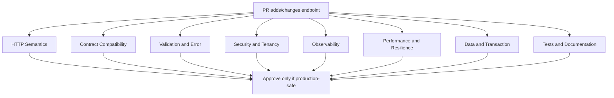

# Part 032 — Endpoint PR Review and API Compatibility Checklist

> Fokus part ini: membangun cara review endpoint JAX-RS seperti senior engineer. Review endpoint bukan hanya membaca apakah code compile. Review harus membuktikan bahwa API benar secara HTTP, aman, kompatibel, observable, testable, dan tidak memperkenalkan risiko production yang tidak terlihat.

Endpoint adalah kontrak. Setelah dipakai consumer, ia menjadi bagian dari sistem yang lebih besar.

Senior-level principle:

```text
A JAX-RS resource method is not just Java code; it is a public operational contract.
```

Review endpoint harus melihat empat layer sekaligus:

```text
1. API contract
2. application behavior
3. runtime/operational behavior
4. consumer compatibility
```

---

## 1. Review Mental Model



A good reviewer asks:

```text
- Is this API semantically correct?
- Is this change backward-compatible?
- Can consumers understand and handle all outcomes?
- Can operators debug it at 03:00?
- Can this endpoint survive retries, duplicates, timeouts, and partial failure?
- Does it enforce identity, authorization, and tenant isolation?
- Does it hide internal implementation details from public contract?
```

---

## 2. Types of Endpoint Changes

Not all endpoint PRs have the same risk.

| Change type | Risk | Review intensity |
|---|---:|---|
| New internal endpoint | Medium | Contract, auth, observability, tests |
| New public/customer-facing endpoint | High | Full API governance review |
| Add optional response field | Low/Medium | Compatibility and serialization review |
| Remove response field | High | Breaking-change review |
| Change field type | High | Breaking-change review |
| Add required request field | High | Breaking-change review |
| Add optional request field | Medium | Validation/defaulting review |
| Change status code | Medium/High | Consumer behavior review |
| Change error shape/code | High | Client compatibility review |
| Add async behavior | High | Idempotency, status endpoint, event model review |
| Add file/stream endpoint | High | Memory, gateway, security, timeout review |
| Add tenant-aware behavior | High | Data isolation and authorization review |

Senior review starts by classifying the change.

---

## 3. HTTP Method Review

Check whether the method matches consequence.

```text
GET     -> read only, safe, no mutation
POST    -> create, command, non-idempotent operation unless explicitly designed
PUT     -> replace/upsert resource, idempotent by design
PATCH   -> partial update, semantics must be documented
DELETE  -> delete/cancel/remove, should be idempotent where possible
```

Questions:

```text
[ ] Does GET avoid mutation and side effects?
[ ] Is POST used for command-like operation?
[ ] Is PUT idempotent?
[ ] Is PATCH patch format clear?
[ ] Is DELETE behavior clear when resource already absent?
[ ] Does retry behavior match method semantics?
```

Red flags:

```text
- GET triggers calculation, workflow transition, or database mutation
- POST used for simple read because query is complex
- DELETE returns random errors when resource already deleted
- PUT behaves like partial update but is undocumented
- endpoint requires client to know internal workflow state
```

---

## 4. URI and Resource Modeling Review

URI should expose stable resource concepts, not implementation details.

Good signs:

```text
- nouns not verbs for stable resources
- command endpoints are explicit when needed
- hierarchy represents ownership only when real
- IDs are opaque
- internal table names are not exposed
- URI does not leak implementation module names
```

Questions:

```text
[ ] Is the resource name stable from business/API perspective?
[ ] Does URI avoid internal class/table/process names?
[ ] Are path parameters meaningful and bounded?
[ ] Is nested path justified by ownership or scoping?
[ ] Is command/action modeled clearly?
[ ] Is versioning approach consistent?
```

Examples:

```http
GET /quotes/{quoteId}
POST /quotes/{quoteId}/submit
GET /orders/{orderId}/status
GET /catalog-items?effectiveDate=2026-07-10
```

Risky examples:

```http
POST /quoteService/calculateQuoteImpl
GET /db/quote_header/{id}
POST /workflow/task/completeInternalNode42
```

---

## 5. Request Contract Review

Review body, params, headers, and defaults.

Checklist:

```text
[ ] Are required fields truly required?
[ ] Are optional fields defaulted safely?
[ ] Are unknown fields handled intentionally?
[ ] Are field names stable and consistent?
[ ] Are enum values backward-compatible?
[ ] Are date/time fields timezone-explicit?
[ ] Are monetary values represented with decimal precision?
[ ] Are arrays bounded?
[ ] Are strings length-limited?
[ ] Are IDs opaque and validated?
[ ] Are headers documented?
[ ] Are query parameters bounded and indexed if they hit DB?
```

Request DTO should not leak persistence entity.

Bad smell:

```java
public Response createQuote(QuoteEntity entity) { ... }
```

Better:

```java
public Response createQuote(CreateQuoteRequest request) { ... }
```

The request DTO is part of API contract. The entity is persistence implementation.

---

## 6. Response Contract Review

Response shape must be stable and predictable.

Checklist:

```text
[ ] Is success response shape documented?
[ ] Is empty response intentional?
[ ] Is metadata included where needed?
[ ] Are IDs opaque?
[ ] Are timestamps serialized consistently?
[ ] Are monetary values precise?
[ ] Are enum values stable?
[ ] Are nulls handled consistently?
[ ] Are internal fields hidden?
[ ] Is pagination metadata present for list responses?
[ ] Are links/cursors stable if used?
```

Common response compatibility rules:

```text
Usually compatible:
- adding optional response field
- adding optional enum only if consumers are tolerant
- adding new endpoint
- adding optional query parameter

Usually breaking:
- removing field
- renaming field
- changing type
- changing nullability from nullable to required or reverse depending contract
- changing status code expected by clients
- changing error code/shape
- changing enum behavior without consumer tolerance
```

---

## 7. Status Code Review

Status codes are part of contract and operational semantics.

Checklist:

```text
[ ] Does success status match operation?
[ ] Does create return 201 when appropriate?
[ ] Does async command return 202 when result is not ready?
[ ] Does validation failure return 400 or agreed equivalent?
[ ] Does auth failure distinguish 401 vs 403 correctly?
[ ] Does not-found avoid leaking unauthorized resource existence?
[ ] Does conflict use 409 where state conflict exists?
[ ] Does rate limiting use 429 if platform standard allows?
[ ] Does retryable failure include proper retry guidance?
```

Useful baseline:

| Scenario | Candidate status |
|---|---:|
| Successful read | 200 |
| Successful create | 201 |
| Accepted async work | 202 |
| Successful command with no body | 204 |
| Bad request shape | 400 |
| Authentication missing/invalid | 401 |
| Authenticated but forbidden | 403 |
| Resource not found | 404 |
| Method not allowed | 405 |
| Conflict with current state | 409 |
| Unsupported media type | 415 |
| Validation semantic error | 400 or 422 depending internal standard |
| Rate limit | 429 |
| Downstream unavailable | 502/503 depending gateway/service standard |

The exact convention must follow internal API standards.

---

## 8. Header Review

Headers often carry operational contract.

Checklist:

```text
[ ] Is Content-Type explicit for request/response with body?
[ ] Is Accept behavior defined?
[ ] Is Location returned for created resource if convention requires?
[ ] Is Retry-After returned for throttling or long polling timeout?
[ ] Is ETag used for cache/conditional update where appropriate?
[ ] Are correlation/request IDs propagated?
[ ] Are deprecation/sunset headers used if API is being retired?
[ ] Are security headers handled by app or gateway?
[ ] Are sensitive headers excluded from logs?
```

Avoid custom headers unless they solve a real problem and are governed.

---

## 9. Validation Review

Validation must protect the domain and provide useful client feedback.

Checklist:

```text
[ ] Are DTO constraints explicit?
[ ] Are nested objects validated?
[ ] Are cross-field rules handled?
[ ] Are collection sizes bounded?
[ ] Are string lengths bounded?
[ ] Are dates checked for valid windows?
[ ] Are monetary values checked for scale/precision?
[ ] Are tenant/customer IDs validated against auth context?
[ ] Are validation errors mapped to stable error codes?
[ ] Are validation messages safe and not leaking internals?
```

Distinguish:

```text
API validation      -> request shape and basic constraints
Domain validation   -> business invariants
Persistence guard   -> database constraints as final protection
```

Do not rely only on database constraint errors for API validation.

---

## 10. Error Contract Review

Error contract must be consistent across endpoints.

Checklist:

```text
[ ] Is error shape standard?
[ ] Is error code stable?
[ ] Is user-facing message safe?
[ ] Is developer/debug detail gated or omitted?
[ ] Is correlation ID included or retrievable?
[ ] Are validation field errors structured?
[ ] Is retryability clear?
[ ] Is downstream failure mapped intentionally?
[ ] Are domain conflicts distinguishable from technical failures?
```

Example stable shape:

```json
{
  "errorCode": "QUOTE_STATE_CONFLICT",
  "message": "Quote cannot be submitted from the current state.",
  "correlationId": "req-abc-123",
  "details": [
    {
      "field": "quoteId",
      "reason": "invalid_state"
    }
  ]
}
```

Avoid:

```json
{
  "error": "java.lang.NullPointerException at QuoteService.java:42"
}
```

---

## 11. Security Review

Every endpoint must answer:

```text
Who is calling? What are they allowed to do? Which tenant/data scope applies?
```

Checklist:

```text
[ ] Is authentication required?
[ ] Is anonymous access intentional?
[ ] Is authorization checked at resource/object level?
[ ] Is tenant context derived from trusted identity, not raw request input?
[ ] Are service-to-service calls authenticated?
[ ] Are scopes/roles/permissions sufficient and minimal?
[ ] Are sensitive fields masked in response?
[ ] Are secrets never returned or logged?
[ ] Are file uploads scanned/limited if applicable?
[ ] Are audit events emitted for sensitive actions?
```

Red flags:

```text
- only checking user is logged in, not permission
- trusting tenantId from path without comparing auth context
- admin-only endpoint hidden by URL naming but not protected
- WebSocket/SSE endpoint bypasses normal security filters
- error response leaks existence of unauthorized resource
```

---

## 12. Multi-Tenancy Review

Tenant isolation failures are high-severity enterprise bugs.

Checklist:

```text
[ ] Is tenant resolved from trusted context?
[ ] Is tenant applied to every data access path?
[ ] Is tenant included in downstream requests/events where required?
[ ] Is tenant-specific config/catalog/pricing/rule applied?
[ ] Are logs tenant-aware but not high-cardinality in metrics?
[ ] Are caches keyed by tenant where needed?
[ ] Are idempotency keys tenant-scoped?
[ ] Are tests covering cross-tenant denial?
```

Cache red flag:

```text
cache key = quoteId
```

Safer:

```text
cache key = tenantId + quoteId
```

But avoid raw tenant ID as metric label unless platform cardinality policy allows it.

---

## 13. Idempotency and Retry Review

Production clients retry. Gateways retry. Users double-click. Networks timeout.

Checklist:

```text
[ ] Is operation safe to retry?
[ ] If not naturally idempotent, is idempotency key required?
[ ] Is idempotency key scoped by tenant/user/operation?
[ ] Is duplicate request behavior documented?
[ ] Is conflict response stable?
[ ] Are downstream calls protected from duplicate effects?
[ ] Are database writes transactionally safe?
[ ] Are events published exactly once or at least safely duplicated?
```

Critical review question:

```text
What happens if the server succeeds but the client times out before receiving the response?
```

If the answer is unclear, idempotency design is incomplete.

---

## 14. Transaction and Data Consistency Review

Endpoint PR often hides data consistency risk.

Checklist:

```text
[ ] Is transaction boundary explicit?
[ ] Are multiple writes atomic where required?
[ ] Are external calls inside DB transaction avoided or justified?
[ ] Are locks used safely?
[ ] Is isolation level sufficient?
[ ] Is optimistic locking needed?
[ ] Is duplicate command guarded?
[ ] Is outbox/inbox needed for event consistency?
[ ] Is migration compatible with old and new app versions?
```

Red flag:

```text
DB transaction open while calling downstream HTTP service.
```

Possible impact:

```text
- long lock hold
- pool exhaustion
- deadlocks
- poor failure recovery
- unknown partial side effects
```

---

## 15. Performance and Query Review

Endpoint performance is not only CPU time.

Checklist:

```text
[ ] Is database query indexed?
[ ] Are pagination limits enforced?
[ ] Is N+1 query avoided?
[ ] Is response payload bounded?
[ ] Is file/streaming endpoint avoiding full memory buffering?
[ ] Are expensive operations asynchronous or cached where appropriate?
[ ] Are downstream calls bounded by timeout?
[ ] Is connection pool impact understood?
[ ] Is p95/p99 latency expectation clear?
```

For list/search endpoints:

```text
[ ] Is sorting field indexed or restricted?
[ ] Is filtering grammar bounded?
[ ] Is max page size enforced?
[ ] Is cursor stable under concurrent writes?
[ ] Is total count query avoided or optimized?
```

---

## 16. Resilience Review

Endpoint must survive dependency failure.

Checklist:

```text
[ ] Are inbound and outbound timeouts defined?
[ ] Is retry policy explicit and bounded?
[ ] Is retry budget respected?
[ ] Is circuit breaker needed?
[ ] Is bulkhead needed?
[ ] Is fallback safe and honest?
[ ] Is graceful degradation possible?
[ ] Is rate limiting enforced at gateway or app layer?
[ ] Is load shedding behavior defined?
[ ] Are retry storm and thundering herd risks considered?
```

Fallback caution:

```text
A fallback that returns stale or partial data must be explicit in contract or internal semantics.
```

Never hide critical failure as successful business result.

---

## 17. Observability Review

Endpoint must be debuggable in production.

Checklist:

```text
[ ] Is request logged at appropriate level?
[ ] Is correlation ID present and propagated?
[ ] Is causation ID/event ID captured where relevant?
[ ] Are metrics emitted for count, latency, error, saturation?
[ ] Is tracing instrumented across DB/HTTP/Kafka boundaries?
[ ] Are important domain transitions auditable?
[ ] Are high-cardinality labels avoided?
[ ] Are sensitive fields redacted?
[ ] Is dashboard/alert impact considered for critical endpoint?
```

Minimum metrics per endpoint class:

```text
- request count
- latency histogram
- error count by stable category
- dependency latency/error where relevant
- saturation for queue/thread/connection pool where relevant
```

Avoid metric labels like:

```text
quoteId, orderId, userId, raw tenantId, customerName, email
```

Unless explicitly approved by observability governance.

---

## 18. File, Binary, and Streaming Review

Extra checklist for file/stream endpoint:

```text
[ ] Is max upload/download size enforced?
[ ] Is content type validated?
[ ] Is file name sanitized?
[ ] Is stream copied with bounded buffer?
[ ] Is payload not fully loaded into heap?
[ ] Is temp file behavior understood?
[ ] Is virus/malware scanning required?
[ ] Is checksum required?
[ ] Is partial failure handled?
[ ] Are gateway/proxy body limits verified?
[ ] Are timeout and cancellation handled?
```

Red flags:

```java
byte[] file = inputStream.readAllBytes();
```

For large files, this can become an OOM incident.

---

## 19. Async, Long-Running Operation, and Event Review

For operations that do not complete immediately:

```text
[ ] Does endpoint return 202 Accepted when appropriate?
[ ] Is status endpoint provided?
[ ] Is operation ID returned?
[ ] Is cancellation supported or explicitly not supported?
[ ] Is duplicate command handled?
[ ] Are background job failures visible?
[ ] Is event publication reliable?
[ ] Is reconciliation available for partial failure?
[ ] Is UI notification separate from source of truth?
```

A robust async pattern:

```http
POST /quotes/{quoteId}/calculation-jobs
→ 202 Accepted
Location: /quotes/{quoteId}/calculation-jobs/{jobId}
```

Then:

```http
GET /quotes/{quoteId}/calculation-jobs/{jobId}
```

Do not make clients infer async state from random timeout behavior.

---

## 20. OpenAPI and Contract Governance Review

Checklist:

```text
[ ] Is OpenAPI updated?
[ ] Does implementation match OpenAPI?
[ ] Are examples updated?
[ ] Are error responses documented?
[ ] Are auth requirements documented?
[ ] Are pagination/filtering/sorting documented?
[ ] Does API lint pass?
[ ] Does generated client still compile?
[ ] Does generated server stub or annotation mapping stay aligned?
[ ] Does compatibility diff show no unintended breaking change?
```

OpenAPI should not be stale documentation. It should be a contract artifact.

Governance failure examples:

```text
- endpoint exists but not documented
- OpenAPI documents field that code never returns
- generated client breaks after field rename
- API lint warnings ignored until consumers complain
```

---

## 21. Compatibility Matrix

Review every change against compatibility direction.

| Change | Request compatibility | Response compatibility | Notes |
|---|---:|---:|---|
| Add optional request field | Usually compatible | N/A | Server must default when absent |
| Add required request field | Breaking | N/A | Existing clients fail |
| Remove request field requirement | Compatible | N/A | Usually safe |
| Rename request field | Breaking | N/A | Unless alias supported |
| Add optional response field | N/A | Usually compatible | Consumers must tolerate unknown fields |
| Remove response field | N/A | Breaking | Consumers may depend on it |
| Rename response field | N/A | Breaking | Add new field first, deprecate old |
| Change field type | Breaking | Breaking | String to number is breaking |
| Add enum value | Risky | Risky | Consumers may fail exhaustive switch |
| Change status code | N/A | Risky/Breaking | Client control flow may depend on it |
| Change error code | N/A | Breaking | Clients may branch on error code |
| Add new endpoint | Compatible | Compatible | Unless route conflicts |
| Add stricter validation | Breaking risk | N/A | Existing requests may fail |
| Relax validation | Usually compatible | N/A | Domain correctness still required |

Internal compatibility policy should define exact rules.

---

## 22. Backward-Compatible Deployment Review

API compatibility must hold during rolling deployment.

During rollout, old and new pods may run simultaneously.

Questions:

```text
[ ] Can old client call new server?
[ ] Can new client call old server?
[ ] Can old server read data written by new server?
[ ] Can new server read data written by old server?
[ ] Can both versions publish/consume events safely?
[ ] Is database migration expand-contract?
[ ] Is feature flag needed to separate deploy from release?
```

Common safe sequence:

```text
1. expand database/schema/API to support both versions
2. deploy code that can read old and new shape
3. enable feature flag gradually
4. migrate/backfill data if needed
5. verify consumers
6. contract old field/path only after deprecation window
```

---

## 23. Test Review

Endpoint PR needs tests aligned to risk.

Checklist:

```text
[ ] Unit test for domain/service behavior
[ ] Resource/endpoint test for HTTP mapping
[ ] Validation failure test
[ ] Authorization negative test
[ ] Tenant isolation negative test
[ ] Error mapper test
[ ] Serialization/deserialization test
[ ] Contract/OpenAPI test
[ ] Integration test with DB if query/write involved
[ ] Kafka/event test if event published
[ ] Idempotency/duplicate test for commands
[ ] Timeout/failure test for downstream dependency
```

Avoid only testing happy path.

A senior reviewer should ask:

```text
Which production failure would this test suite catch?
```

---

## 24. Documentation and Developer Experience Review

Checklist:

```text
[ ] Is endpoint discoverable?
[ ] Are examples realistic?
[ ] Are error cases documented?
[ ] Are headers documented?
[ ] Are pagination/filter/sort examples included?
[ ] Are auth scopes/permissions documented?
[ ] Is deprecation notice clear if applicable?
[ ] Are operational notes included for async/streaming endpoints?
```

Documentation is not only for external users. Internal teams and future maintainers are also API consumers.

---

## 25. Internal Verification Checklist

Before approving endpoint/API changes in the CSG Quote & Order context, verify using internal evidence:

### API governance

```text
- Is there an internal API style guide?
- Is OpenAPI source-of-truth or generated artifact?
- Is API lint enforced in CI?
- Is breaking change detection automated?
- Is there an API review board/process?
- Are generated clients used by other services or teams?
```

### Runtime and framework

```text
- Is endpoint JAX-RS standard only or Jersey-specific?
- Are custom filters/interceptors involved?
- Which ExceptionMapper handles failures?
- Which JSON provider serializes DTOs?
- Are Servlet filters/gateway policies modifying request/response?
```

### Security and tenancy

```text
- What auth mechanism protects endpoint?
- Where is authorization enforced?
- How is tenant resolved?
- Is tenant applied to data access and cache keys?
- Is audit logging required?
```

### Production behavior

```text
- What is expected latency?
- What dependencies are called?
- Are timeout/retry/circuit breaker policies standard?
- Are metrics/logs/traces available?
- Does dashboard/alert need update?
```

### Compatibility

```text
- Who consumes this endpoint?
- Is there a compatibility matrix?
- Is deprecation policy followed?
- Does rolling deploy remain safe?
- Does database migration preserve old/new compatibility?
```

---

## 26. Senior Reviewer Decision Framework

A senior reviewer should not only say “looks good” or “needs changes”. They should classify risk.

```text
Approve:
- semantics correct
- compatible
- secure
- observable
- tested
- operationally bounded

Request changes:
- unclear contract
- missing auth/tenant check
- unbounded payload/query
- weak error mapping
- missing tests for core risk
- hidden breaking change

Block:
- data leak risk
- cross-tenant risk
- unsafe migration
- critical endpoint without rollback path
- retry/idempotency bug causing duplicate business action
- severe production failure mode ignored
```

Good review comments are specific:

```text
This POST command is not idempotent. What happens if the client times out after the DB commit but before receiving the response? Please add an idempotency key or document why duplicate command is impossible.
```

Weak review comments are vague:

```text
Maybe handle errors better.
```

---

## 27. Endpoint Review Cheat Sheet

Use this compressed checklist during day-to-day PR review:

```text
HTTP
[ ] method semantics correct
[ ] status codes consistent
[ ] headers intentional
[ ] content negotiation clear
[ ] pagination/filtering bounded

Contract
[ ] OpenAPI updated
[ ] no unintended breaking change
[ ] error shape stable
[ ] response shape stable
[ ] generated client/server impact checked

Validation
[ ] DTO validation present
[ ] domain invariants enforced
[ ] invalid input returns stable error
[ ] length/size/collection bounds enforced

Security
[ ] authentication required where needed
[ ] authorization object-level
[ ] tenant isolation enforced
[ ] sensitive data redacted
[ ] audit where required

Resilience
[ ] timeout defined
[ ] retry/idempotency safe
[ ] downstream failure mapped
[ ] rate/load protection considered
[ ] async/streaming bounded

Data
[ ] transaction boundary safe
[ ] DB query indexed/bounded
[ ] migration compatible
[ ] event/outbox consistency if needed

Observability
[ ] logs useful and safe
[ ] metrics added
[ ] trace propagation preserved
[ ] correlation ID propagated

Tests
[ ] happy path
[ ] validation failure
[ ] auth/tenant failure
[ ] dependency failure
[ ] compatibility/contract
```

---

## 28. Example Review Walkthrough

Suppose PR adds:

```http
POST /quotes/{quoteId}/submit
```

Review questions:

```text
- Is submit a command? Yes, POST is reasonable.
- Can submit be retried? Need idempotency or state conflict behavior.
- What if quote already submitted? 200/204 idempotent success or 409 conflict?
- Is user allowed to submit this quote?
- Is quote tenant checked against auth context?
- Is quote in valid state?
- Are pricing/catalog effective dates locked?
- Does submit publish event?
- Is event publication transactional via outbox?
- What does client receive on validation/domain conflict?
- Is audit log emitted?
- Is OpenAPI updated?
- Are tests covering duplicate submit, wrong tenant, invalid state, and event publication?
```

This is the level of review expected for enterprise command endpoints.

---

## 29. Common Anti-Patterns

```text
- resource method returns entity directly from database
- endpoint accepts persistence entity as request body
- GET mutates state
- POST command has no idempotency story
- endpoint has no authorization beyond authentication
- tenantId from path is trusted blindly
- list endpoint has no max limit
- filtering supports arbitrary unindexed fields
- error response leaks stack trace
- downstream timeout defaults are unknown
- OpenAPI is not updated
- no negative tests
- API change is compatible only when all services deploy at exactly the same time
```

These are not style issues. They are production risk indicators.

---

## 30. Key Takeaways

```text
- Endpoint review is contract review, not just Java code review.
- HTTP semantics affect retry, caching, compatibility, and operational behavior.
- Backward compatibility must be checked for clients, rolling deploys, DB, and events.
- Security review must include object-level authorization and tenant isolation.
- Observability must be designed before incident happens.
- Idempotency and timeout behavior are mandatory for command endpoints.
- A good PR review explains the production failure it prevents.
```

---

## 31. Quick Self-Test

1. Why is adding a required request field usually breaking?
2. Why can adding an enum value break some consumers?
3. What happens if a POST succeeds but the client times out before receiving response?
4. Why is object-level authorization different from authentication?
5. Why should tenant ID not be trusted blindly from path/query?
6. Why is arbitrary filtering dangerous for DB performance?
7. What must be checked when a response status code changes?
8. Why should OpenAPI be treated as a contract artifact?
9. What is the difference between deploy compatibility and API compatibility?
10. What review question would you ask for `POST /quotes/{id}/submit`?

