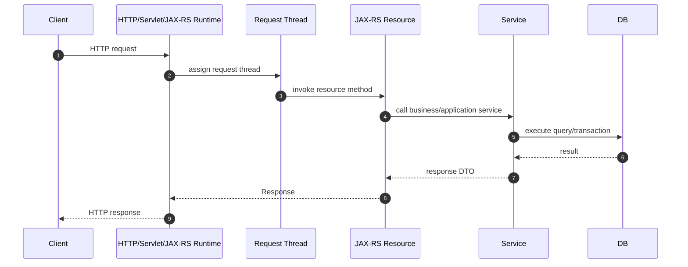
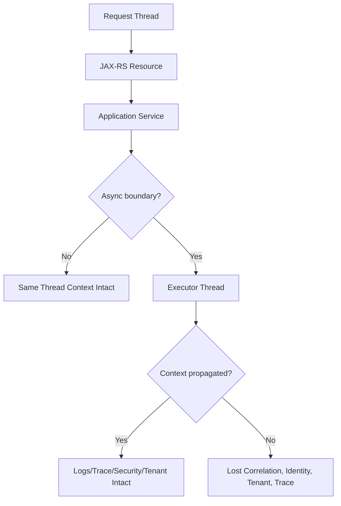
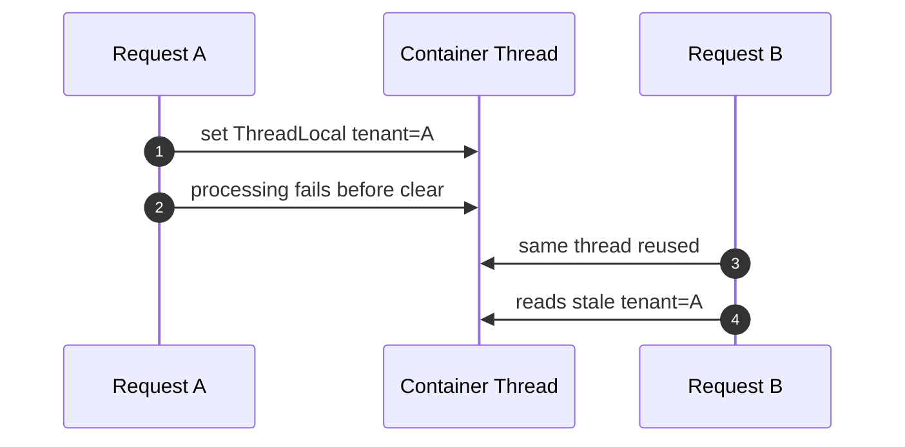

# Part 033 — Threading, Request Context, and Context Propagation

> Fokus part ini: memahami bagaimana request context hidup di dalam thread, apa yang terjadi ketika execution berpindah thread, dan mengapa context propagation adalah fondasi untuk logging, tracing, security, tenancy, audit, dan debugging production.

Di service JAX-RS enterprise, bug context propagation sering tidak terlihat sebagai compile error. Bug ini muncul sebagai:

```text
- log kehilangan correlation ID
- trace terputus di tengah request
- user identity hilang di async task
- tenant ID salah atau null
- audit event tidak bisa dikaitkan dengan command asal
- security check berjalan tanpa principal yang benar
- transaction/request-scoped object dipakai di thread yang salah
```

Senior engineer harus melihat request tidak hanya sebagai method call, tetapi sebagai **execution context** yang bergerak melewati banyak boundary.

```text
HTTP request -> container thread -> JAX-RS resource -> service layer
             -> database/client/cache/event publisher
             -> executor/Kafka callback/async worker
```

Jika context tidak dibawa dengan benar, sistem masih bisa terlihat bekerja, tetapi kehilangan auditability dan debuggability.

---

## 1. Core Mental Model

Request processing di Java backend biasanya dimulai dari satu thread container.



Pada alur sederhana, semua berjalan di thread yang sama. Context dapat diakses dari:

```text
- JAX-RS @Context
- SecurityContext
- HttpServletRequest, jika running on Servlet container
- MDC/logging context
- ThreadLocal yang dibuat framework atau aplikasi
- OpenTelemetry current Context
- transaction context, tergantung framework
```

Masalah muncul saat alur berpindah dari satu thread ke thread lain.



Principle:

```text
Context is not business data, but it controls whether business data can be trusted, traced, secured, and audited.
```

---

## 2. What Is Request Context?

Request context adalah kumpulan metadata runtime yang menjelaskan request yang sedang diproses.

Contoh:

| Context item | Fungsi |
|---|---|
| request ID | Identifier request lokal pada service |
| correlation ID | Mengaitkan request lintas service |
| causation ID | Menjelaskan event/command penyebab aksi berikutnya |
| trace ID | Distributed trace identifier |
| span ID | Unit kerja spesifik dalam trace |
| user principal | Identity user/service caller |
| tenant ID | Boundary data dan config tenant |
| locale/timezone | Formatting dan interpretation context |
| auth token claims | Subject, audience, scopes, roles |
| client metadata | channel, app version, source system |
| deadline/timeout | Batas waktu request |
| feature flag context | Flag targeting dan rollout context |
| audit context | Actor, action, origin, reason |

Tidak semua context harus diteruskan ke semua tempat. Tetapi context yang diperlukan untuk correctness harus jelas.

Bad smell:

```text
"Service ini butuh tenant ID, tapi tenant ID diambil dari ThreadLocal tersembunyi."
```

Lebih aman:

```text
- tenant ID eksplisit di command/application context
- logging/tracing context tetap bisa ada di MDC/OTel context
- security context tidak disalin sembarangan ke background job
```

---

## 3. JAX-RS @Context

JAX-RS menyediakan `@Context` untuk mengakses runtime context.

Contoh object umum:

```java
@Path("/quotes")
public class QuoteResource {

    @Context
    private UriInfo uriInfo;

    @Context
    private HttpHeaders headers;

    @Context
    private SecurityContext securityContext;

    @GET
    @Path("/{id}")
    public Response getQuote(@PathParam("id") String id) {
        String path = uriInfo.getPath();
        String user = securityContext.getUserPrincipal().getName();
        return Response.ok().build();
    }
}
```

Important distinction:

```text
@Context gives access to request/runtime metadata.
It is not a replacement for explicit application command data.
```

Avoid passing `UriInfo`, `HttpHeaders`, or `SecurityContext` deep into domain logic.

Better boundary:

```java
public record RequestContext(
    String correlationId,
    String causationId,
    String tenantId,
    String actorId,
    String sourceSystem
) {}
```

Resource layer extracts transport/runtime details, then passes explicit application context.

```java
@POST
public Response submitQuote(SubmitQuoteRequest request) {
    RequestContext ctx = contextFactory.fromCurrentRequest();
    QuoteResult result = quoteApplicationService.submit(ctx, request.toCommand());
    return Response.accepted(result).build();
}
```

Senior-level rule:

```text
JAX-RS context should be consumed at the edge and translated into explicit application context.
```

---

## 4. ThreadLocal: Useful, Dangerous, and Often Invisible

`ThreadLocal` stores data attached to the current thread.

```java
private static final ThreadLocal<String> TENANT = new ThreadLocal<>();
```

Common use cases:

```text
- logging MDC
- current user
- current tenant
- current transaction
- OpenTelemetry current span/context
- framework request scope internals
```

The danger: request threads are reused.



Critical rule:

```text
Every ThreadLocal set must have a guaranteed clear in finally block.
```

Example:

```java
public void filter(ContainerRequestContext requestContext) {
    try {
        TenantContext.set(resolveTenant(requestContext));
        // continue chain depending on filter model
    } finally {
        TenantContext.clear();
    }
}
```

In JAX-RS filters, the exact lifecycle depends on filter implementation and runtime. Verify carefully.

Preferred approach:

```text
- Use ThreadLocal for cross-cutting context only when framework-compatible.
- Never rely on ThreadLocal as the only source of business-critical data.
- Clear aggressively.
- Wrap executor tasks if context must cross threads.
```

---

## 5. MDC Propagation

MDC, or Mapped Diagnostic Context, lets logs automatically include request metadata.

Typical log fields:

```text
correlation_id
causation_id
trace_id
span_id
tenant_id
actor_id
request_path
http_method
source_system
```

Example conceptual filter:

```java
@Provider
@Priority(Priorities.AUTHENTICATION)
public class CorrelationFilter implements ContainerRequestFilter, ContainerResponseFilter {

    @Override
    public void filter(ContainerRequestContext request) {
        String correlationId = getOrCreateCorrelationId(request);
        MDC.put("correlation_id", correlationId);
    }

    @Override
    public void filter(ContainerRequestContext request, ContainerResponseContext response) {
        try {
            response.getHeaders().putSingle("X-Correlation-ID", MDC.get("correlation_id"));
        } finally {
            MDC.clear();
        }
    }
}
```

Risk:

```text
MDC is usually ThreadLocal-backed.
If execution moves to another thread, MDC may not follow.
If MDC is not cleared, next request may inherit stale values.
```

Executor example without propagation:

```java
executor.submit(() -> {
    log.info("publishing quote event"); // correlation_id may be missing
});
```

Executor example with explicit capture:

```java
Map<String, String> captured = MDC.getCopyOfContextMap();

executor.submit(() -> {
    Map<String, String> previous = MDC.getCopyOfContextMap();
    try {
        if (captured != null) {
            MDC.setContextMap(captured);
        }
        log.info("publishing quote event");
    } finally {
        MDC.clear();
        if (previous != null) {
            MDC.setContextMap(previous);
        }
    }
});
```

In production code, avoid hand-rolling this repeatedly. Prefer a standard executor wrapper or platform-approved context propagation library.

---

## 6. SecurityContext and Principal Propagation

JAX-RS `SecurityContext` represents caller identity and security state for the current request.

```java
@Context
SecurityContext securityContext;
```

Typical questions:

```text
- Who is the caller?
- Is the request secure?
- Does caller have role X?
- Is caller a user, service, or internal platform component?
```

Do not blindly propagate full security context to async/background work.

Why?

```text
- request token may expire
- user may no longer be authorized later
- background work may need service identity, not user identity
- replayed job should be auditable as system action caused by user command
```

Better model:

```text
actor_id       -> who initiated
subject_type   -> user/service/system
causation_id   -> command/event that caused the work
service_identity -> identity used for outbound service call
```

For async jobs and Kafka consumers, prefer explicit audit context over pretending the original HTTP security context is still alive.

---

## 7. Tenant Context Propagation

In enterprise systems, tenant context can affect:

```text
- routing
- authorization
- data access
- product catalog
- pricing rules
- feature flags
- logging
- audit
- metrics segmentation
```

Dangerous pattern:

```java
String tenantId = TenantThreadLocal.get();
quoteRepository.findById(quoteId); // repository implicitly filters by ThreadLocal tenant
```

Safer pattern:

```java
quoteRepository.findByTenantAndId(ctx.tenantId(), quoteId);
```

A balanced approach is often used:

```text
- explicit tenant in application/domain data access path
- MDC/telemetry tenant field for debugging
- validation guard that rejects missing tenant at boundary
```

Critical invariant:

```text
No tenant-sensitive operation should succeed without a known tenant boundary.
```

PR review questions:

```text
[ ] Where is tenant resolved?
[ ] Is tenant trusted from header, token claim, path, gateway, or config?
[ ] Is tenant validated against actor permission?
[ ] Does repository query enforce tenant boundary?
[ ] Does async/event processing preserve tenant context?
[ ] Are logs tenant-aware without leaking PII?
```

---

## 8. Async Boundary Types

Context can be lost at many boundaries.

| Boundary | Risk |
|---|---|
| `ExecutorService.submit` | MDC/ThreadLocal/OTel context lost |
| `CompletableFuture.supplyAsync` | Runs on another pool, context lost |
| scheduled job | No HTTP request context exists |
| Kafka consumer | New event context, not HTTP context |
| HTTP client callback | Different callback thread |
| reactive stream | context may require framework-specific propagation |
| servlet async | request lifecycle becomes more complex |
| Jersey async response | context availability must be verified |

Typical failure:

```java
CompletableFuture.supplyAsync(() -> service.loadSomething());
```

Problems:

```text
- Which executor is used?
- Does it propagate MDC?
- Does it propagate OpenTelemetry context?
- Does it have timeout/cancellation?
- Does it respect tenant/security context?
- Does it have bounded queue?
```

Senior-level rule:

```text
Never introduce async execution without defining context, timeout, cancellation, queue, error, and observability behavior.
```

---

## 9. Context Propagation Across Executors

A production-grade executor wrapper usually handles:

```text
- MDC capture/restore/clear
- OpenTelemetry context capture/restore
- correlation ID preservation
- tenant/audit context preservation, if allowed
- exception logging
- task duration metrics
- queue metrics
- rejection handling
```

Conceptual wrapper:

```java
public final class ContextAwareExecutor {
    private final ExecutorService delegate;

    public void submit(Runnable task) {
        Map<String, String> mdc = MDC.getCopyOfContextMap();
        RequestContext requestContext = RequestContextHolder.currentOrNull();

        delegate.submit(() -> {
            try {
                if (mdc != null) MDC.setContextMap(mdc);
                RequestContextHolder.set(requestContext);
                task.run();
            } finally {
                RequestContextHolder.clear();
                MDC.clear();
            }
        });
    }
}
```

This example is intentionally simplified. Real implementation must also account for:

```text
- previous context on worker thread
- rejected execution
- cancellation
- nested async tasks
- OTel Context
- task naming
- metrics
- security restrictions
```

---

## 10. Context Propagation Across HTTP

For outbound HTTP calls, propagate the minimum required context.

Common headers:

```text
traceparent
tracestate
X-Correlation-ID
X-Causation-ID
X-Request-ID
X-Tenant-ID, if allowed by platform standard
Authorization, if doing token forwarding or token exchange
```

Do not invent header propagation casually.

Governance questions:

```text
[ ] Which headers are official?
[ ] Which headers are gateway-owned?
[ ] Which headers are internal-only?
[ ] Which headers are user-controllable and must not be trusted?
[ ] Which headers must be stripped at boundary?
[ ] Which headers are propagated to external vendors?
```

Example Jersey client filter concept:

```java
public class OutboundContextFilter implements ClientRequestFilter {
    @Override
    public void filter(ClientRequestContext requestContext) {
        requestContext.getHeaders().putSingle("X-Correlation-ID", Current.correlationId());
        requestContext.getHeaders().putSingle("X-Causation-ID", Current.causationId());
    }
}
```

Security warning:

```text
Never trust inbound tenant/user headers unless they are asserted by a trusted gateway or validated against a token claim.
```

---

## 11. Context Propagation Across Kafka

Kafka has no HTTP headers, but records can carry headers.

Useful event headers:

```text
correlation_id
causation_id
traceparent
tenant_id
event_id
producer_service
schema_version
command_id
```

Conceptual producer:

```java
ProducerRecord<String, QuoteSubmittedEvent> record =
    new ProducerRecord<>("quote.submitted.v1", key, event);

record.headers().add("correlation_id", bytes(ctx.correlationId()));
record.headers().add("causation_id", bytes(ctx.causationId()));
record.headers().add("tenant_id", bytes(ctx.tenantId()));
```

Consumer should create a new processing context from event headers.

```text
HTTP request context and Kafka processing context are related, not identical.
```

Causation chain:

```text
HTTP command correlation_id = C1
HTTP command causation_id   = request-id-123
published event_id          = E1
consumer causation_id       = E1
consumer correlation_id     = C1
```

This lets you answer:

```text
- Which request caused this event?
- Which event caused this downstream mutation?
- Which tenant was affected?
- Which service produced the event?
```

---

## 12. OpenTelemetry Current Context

OpenTelemetry often stores the current context in a thread-local-like mechanism.

Conceptually:

```text
current span/context is associated with current execution thread
```

When execution crosses thread boundary, the current span may not follow unless instrumentation handles it.

Executor example concept:

```java
Context captured = Context.current();

executor.submit(() -> {
    try (Scope scope = captured.makeCurrent()) {
        doWork();
    }
});
```

You do not need to manually instrument everything if the platform uses Java agent/instrumentation. But you must verify:

```text
[ ] Does HTTP server instrumentation exist?
[ ] Does Jersey/JAX-RS instrumentation exist?
[ ] Does HTTP client instrumentation exist?
[ ] Does Kafka producer/consumer instrumentation exist?
[ ] Does executor instrumentation exist?
[ ] Does custom thread pool preserve context?
```

Part 054–056 will go deeper into OpenTelemetry, sampling, and high-cardinality risks.

---

## 13. Request Scope vs Application Scope

Request-scoped objects are valid only during a request.

Dangerous examples:

```java
public class QuoteService {
    @Inject
    private SomeRequestScopedContext context;

    public void startAsyncWork() {
        executor.submit(() -> {
            context.getTenantId(); // may fail or use invalid context
        });
    }
}
```

Problems:

```text
- request scope may be destroyed before async task runs
- proxy may throw context-not-active exception
- stale context may be used incorrectly
```

Safer approach:

```java
String tenantId = context.getTenantId();
String actorId = context.getActorId();
String correlationId = context.getCorrelationId();

executor.submit(() -> asyncProcessor.process(new AsyncContext(
    tenantId,
    actorId,
    correlationId
)));
```

Capture value objects, not request-scoped framework objects.

---

## 14. Cancellation and Context Cleanup

Context cleanup must happen even when:

```text
- resource method throws exception
- client disconnects
- timeout fires
- thread is interrupted
- downstream dependency fails
- async task is rejected
```

Pattern:

```java
try {
    setContext();
    return proceed();
} catch (Exception e) {
    recordFailure(e);
    throw e;
} finally {
    clearContext();
}
```

For async tasks:

```java
try {
    restoreContext();
    task.run();
} finally {
    clearContext();
}
```

If context cleanup is not deterministic, debugging becomes nondeterministic.

---

## 15. Failure Modes

| Failure mode | Symptom | Likely cause |
|---|---|---|
| Missing correlation ID | logs cannot be tied together | no inbound generation or async loss |
| Wrong tenant ID | cross-tenant data risk | stale ThreadLocal or untrusted header |
| Missing trace span | broken distributed trace | context not propagated across executor/client |
| Wrong actor in audit | compliance issue | user context reused or not captured |
| Random test failures | context leak between tests | ThreadLocal/MDC not cleared |
| Memory leak | thread local retains large object | ThreadLocal value not removed |
| Security bypass | principal missing/fallback | optional security context mishandled |
| Log contamination | request B logs request A ID | reused thread with stale MDC |
| Async NPE | request scope inactive | request-scoped proxy used later |

---

## 16. Debugging Workflow

When context propagation fails, debug by tracing the boundary.

```text
1. Identify the missing/wrong context field.
2. Find where it should be created.
3. Find where it should be attached to current execution.
4. Find every boundary where execution changes thread/protocol.
5. Verify capture/restore/clear behavior.
6. Check logs before and after each boundary.
7. Check tests for context leak across test cases.
```

Useful log probes:

```text
- thread name
- request ID
- correlation ID
- trace ID
- tenant ID
- actor ID
- operation name
- async task name
```

Temporary debugging log should not leak secrets or PII.

---

## 17. Testing Context Propagation

Minimum test cases:

```text
[ ] inbound request without correlation ID generates one
[ ] inbound request with valid correlation ID preserves it
[ ] response includes correlation ID
[ ] error response includes correlation ID
[ ] outbound HTTP call propagates approved headers
[ ] async task preserves MDC/trace if required
[ ] ThreadLocal/MDC cleared after request
[ ] two sequential requests on same thread do not leak context
[ ] Kafka event includes required context headers
[ ] Kafka consumer creates correct processing context
```

Test for leak explicitly:

```java
@Test
void clearsContextAfterFailure() {
    assertThrows(RuntimeException.class, () -> invokeFailingRequest());
    assertNull(MDC.get("correlation_id"));
}
```

Better integration test:

```text
Send request A with correlation_id=A.
Send request B with correlation_id=B.
Assert logs/outbound calls/events for B never contain A.
```

---

## 18. PR Review Checklist

```text
[ ] Does this code introduce a new async boundary?
[ ] Is the executor explicit and bounded?
[ ] Does context propagation happen deliberately?
[ ] Are MDC and ThreadLocal cleared in finally block?
[ ] Is tenant context explicit for business-critical operations?
[ ] Is SecurityContext used only within valid request lifecycle?
[ ] Are user/service identities modeled correctly?
[ ] Are correlation/causation IDs preserved across outbound calls?
[ ] Are Kafka headers populated/consumed consistently?
[ ] Are context propagation tests included?
[ ] Does code avoid passing JAX-RS framework context into domain logic?
[ ] Does logging include enough context without leaking PII?
```

---

## 19. Internal Verification Checklist

For CSG Quote & Order or any enterprise JAX-RS codebase, verify from actual evidence:

```text
Runtime and framework
[ ] Is the service running on Jersey, another JAX-RS implementation, Servlet container, or embedded server?
[ ] Which request filters create correlation/request/tenant context?
[ ] Which response filters clear context?
[ ] Are filters ordered explicitly?

Logging
[ ] Which logging framework is used?
[ ] Is MDC used?
[ ] Which MDC keys are standard?
[ ] Is MDC cleared on success and error paths?
[ ] Are logs structured JSON or plain text?

Tracing
[ ] Is OpenTelemetry Java agent used?
[ ] Is manual instrumentation used?
[ ] Are executor/Kafka/HTTP client instrumentations enabled?
[ ] How are trace ID and correlation ID related?

Security and tenancy
[ ] Where is tenant resolved?
[ ] Is tenant taken from token claim, header, path, config, or gateway?
[ ] Is tenant validated against identity/permission?
[ ] Is tenant passed explicitly to repository queries?
[ ] Are audit events tenant-aware?

Async and executors
[ ] Which executors exist?
[ ] Are they bounded?
[ ] Are they context-aware?
[ ] Do they propagate MDC/OTel/security/tenant context?
[ ] Do they clear context after task completion?

Kafka/events
[ ] Which context headers are required on events?
[ ] Are correlation and causation IDs populated?
[ ] Is tenant ID included in event header or payload?
[ ] Is event processing context reconstructed on consume?

Tests
[ ] Are there tests for context propagation?
[ ] Are there tests for context cleanup?
[ ] Are there tests for cross-tenant leakage prevention?
```

---

## 20. Senior-Level Heuristics

```text
If a value affects correctness, pass it explicitly.
If a value affects observability, propagate it consistently.
If a value affects security, validate it at the boundary.
If a value is stored in ThreadLocal, clear it deterministically.
If execution changes thread, assume context is lost until proven otherwise.
```

Context propagation should be boring. If every team invents its own propagation behavior, debugging production becomes archaeology.

---

## 21. Common Anti-Patterns

```text
Anti-pattern: storing full request object in ThreadLocal
Risk: memory leak, lifecycle confusion, hidden dependency

Anti-pattern: domain logic reads tenant from static context
Risk: impossible-to-test tenant behavior and hidden cross-tenant bugs

Anti-pattern: async task uses request-scoped bean
Risk: context inactive or stale context

Anti-pattern: blindly forwarding all inbound headers
Risk: spoofed identity, tenant injection, data leak

Anti-pattern: using correlation ID as authorization proof
Risk: correlation is not identity

Anti-pattern: one log line at start and no context after async boundary
Risk: traceability disappears during actual work
```

---

## 22. Minimal Production Standard

A production-ready JAX-RS service should have:

```text
[ ] standard inbound context creation
[ ] standard outbound context propagation
[ ] deterministic MDC/ThreadLocal cleanup
[ ] explicit tenant/security model
[ ] context-aware executor standard
[ ] Kafka/event context header standard
[ ] OpenTelemetry context propagation verified
[ ] tests for context propagation and cleanup
[ ] documented header/context contract
[ ] PR checklist for async boundary changes
```

---

## 23. Key Takeaways

```text
- Request context is part of the runtime contract.
- ThreadLocal is powerful but dangerous in pooled-thread environments.
- MDC helps logs, but it must be propagated and cleared.
- SecurityContext is request-lifecycle-bound; do not treat it as durable identity.
- Tenant context must be explicit where correctness depends on it.
- Async boundary is a context boundary.
- HTTP and Kafka context propagation require governance.
- Broken context propagation creates silent production failures.
```

The next part builds on this by examining timeout, cancellation, and backpressure: the mechanisms that prevent slow or abandoned work from consuming the whole system.
