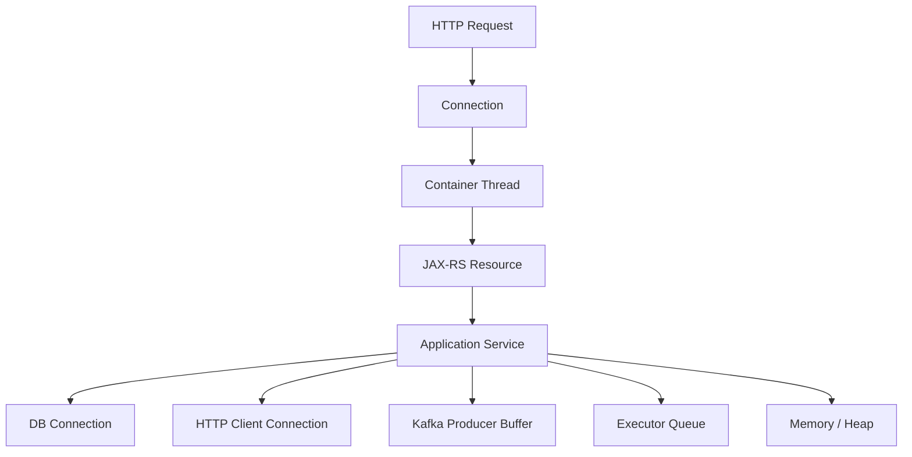
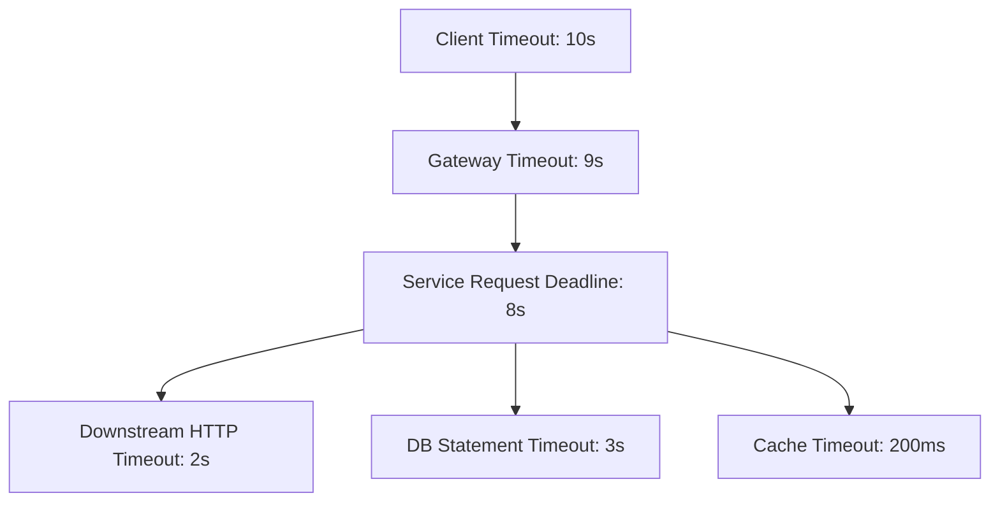
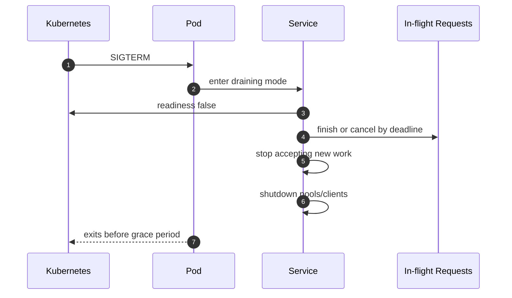

# Part 034 — Timeout, Cancellation, and Backpressure

> Fokus part ini: memahami bagaimana service JAX-RS mengontrol waktu, resource, dan overload. Endpoint yang benar secara functional masih bisa merusak production jika tidak punya timeout, cancellation, backpressure, dan queue discipline.

Production failure sering bukan karena logic salah, tetapi karena work yang terlalu lama dibiarkan hidup.

```text
slow dependency -> blocked thread -> queue grows -> memory rises -> latency rises
               -> retries increase -> downstream gets worse -> service collapses
```

Senior engineer harus mendesain endpoint dengan asumsi:

```text
- dependency bisa lambat
- client bisa disconnect
- request bisa duplicate
- thread pool bisa penuh
- queue bisa menumpuk
- Kubernetes bisa kill pod
- retry bisa memperbesar traffic
- timeout di satu layer bisa bertabrakan dengan timeout layer lain
```

---

## 1. Core Mental Model

Setiap request memakai resource terbatas.



Jika request tidak dibatasi oleh timeout dan cancellation, ia bisa menahan resource lebih lama dari nilai bisnisnya.

Principle:

```text
Every unit of work must have a deadline, a cancellation path, and a bounded resource footprint.
```

---

## 2. Timeout Is a Contract, Not Just a Number

Timeout menjawab:

```text
How long is this work still worth doing?
```

Bukan hanya:

```text
How long before the library throws exception?
```

Timeout harus konsisten dengan:

```text
- client expectation
- gateway timeout
- server/container timeout
- application deadline
- DB statement timeout
- HTTP client connect/read timeout
- Kafka send timeout
- executor queue wait timeout
- Kubernetes probe and termination settings
```

Timeout hierarchy:



Good hierarchy:

```text
client timeout > gateway timeout > service deadline > dependency timeout
```

Bad hierarchy:

```text
client timeout = 5s
service keeps working for 60s
DB query runs for 120s
```

That creates zombie work.

---

## 3. Timeout Types

| Timeout type | Meaning | Common failure if missing |
|---|---|---|
| connection timeout | time to establish connection | blocked connection attempt |
| read/socket timeout | time waiting for response data | stuck thread |
| request timeout | total time for request | request consumes resource too long |
| queue timeout | time waiting in queue | stale work starts too late |
| DB statement timeout | max query execution time | long-running queries block locks/pool |
| transaction timeout | max transaction lifetime | long locks, inconsistent release |
| Kafka delivery timeout | max time to send record | producer buffer pressure |
| circuit breaker wait/open timeout | recovery behavior | repeated calls to failing dependency |
| Kubernetes termination grace | time to shutdown cleanly | killed mid-request/job |

Senior-level question:

```text
Which timeout fires first, and what state is left behind?
```

---

## 4. Request Deadline

A request deadline is stronger than independent timeouts.

Independent timeout model:

```text
DB timeout: 5s
HTTP client timeout: 5s
Kafka timeout: 5s
Total request might take 15s+
```

Deadline model:

```text
Request deadline: now + 8s
Every dependency call consumes remaining budget.
```

Conceptual API:

```java
public record Deadline(Instant expiresAt) {
    public Duration remaining(Clock clock) {
        Duration remaining = Duration.between(clock.instant(), expiresAt);
        return remaining.isNegative() ? Duration.ZERO : remaining;
    }

    public boolean expired(Clock clock) {
        return !clock.instant().isBefore(expiresAt);
    }
}
```

Usage:

```java
Duration remaining = ctx.deadline().remaining(clock);
if (remaining.compareTo(Duration.ofMillis(200)) < 0) {
    throw new RequestDeadlineExceededException();
}
```

Not every codebase has explicit deadline objects. But senior engineers should look for the concept.

---

## 5. Cancellation

Timeout only detects that work took too long. Cancellation stops work that no longer matters.

Cancellation sources:

```text
- client disconnect
- gateway timeout
- service request deadline exceeded
- parent task cancelled
- pod shutdown
- circuit breaker open
- queue rejection
```

Cancellation is hard because not all operations are cancellable.

| Operation | Cancellation behavior |
|---|---|
| CPU loop | must check interruption/deadline manually |
| blocking JDBC query | may need statement timeout or cancel support |
| HTTP call | client library may close socket/request |
| Kafka send | may be difficult after record accepted to buffer |
| file upload/download | must close stream and cleanup partial file |
| database transaction | must rollback |
| async task | must respect Future cancellation/interruption |

Important distinction:

```text
Client no longer waiting does not automatically mean server stopped working.
```

---

## 6. Client Disconnect

When a client disconnects:

```text
- response write may fail
- server may still run business logic
- downstream calls may continue
- database transaction may continue
- logs may show success even though client saw failure
```

For non-mutating read endpoints, abandoned work should usually be stopped.

For mutating command endpoints, cancellation is more nuanced:

```text
- Did mutation already commit?
- Did event already publish?
- Can the command be safely retried?
- Is idempotency key used?
- Should server finish command even if client disconnects?
```

Senior-level rule:

```text
Cancellation policy must be operation-specific, especially for mutating commands.
```

---

## 7. Backpressure

Backpressure means the system refuses, slows, or sheds work when downstream capacity is insufficient.

Without backpressure:

```text
incoming rate > processing capacity
queue grows
latency grows
timeouts grow
retries grow
system collapses
```

With backpressure:

```text
incoming rate > capacity
system rejects early or slows intake
latency remains bounded
failure is explicit
```

Backpressure mechanisms:

```text
- bounded thread pools
- bounded queues
- connection pool limits
- rate limiting
- semaphore bulkhead
- circuit breaker
- load shedding
- max request body size
- streaming flow control
- Kafka consumer pause/resume
- DB statement timeout
```

Backpressure is not failure avoidance. It is controlled failure.

---

## 8. Queue Discipline

Queues hide overload until it is too late.

Bad pattern:

```java
Executors.newFixedThreadPool(50); // often backed by unbounded queue in common patterns
```

Danger:

```text
- memory grows
- stale tasks run long after caller timed out
- latency becomes unbounded
- shutdown takes too long
```

Better pattern:

```text
- bounded pool
- bounded queue
- named threads
- rejection policy
- metrics
- timeout/deadline before enqueue
- context propagation wrapper
```

Conceptual executor config:

```java
ThreadPoolExecutor executor = new ThreadPoolExecutor(
    20,
    20,
    0L,
    TimeUnit.MILLISECONDS,
    new ArrayBlockingQueue<>(500),
    namedThreadFactory("quote-worker"),
    new ThreadPoolExecutor.AbortPolicy()
);
```

Rejection should be handled deliberately:

```java
try {
    executor.execute(task);
} catch (RejectedExecutionException e) {
    throw new ServiceOverloadedException("quote-worker queue is full", e);
}
```

Map overload to a controlled HTTP response, commonly `503 Service Unavailable` or `429 Too Many Requests`, depending on ownership and semantics.

---

## 9. Thread Pool Exhaustion

Symptoms:

```text
- request latency spikes
- CPU not necessarily high
- threads stuck in WAITING/BLOCKED/TIMED_WAITING
- health checks fail
- queue length increases
- container still alive but unresponsive
```

Common causes:

```text
- slow DB query
- missing HTTP client timeout
- connection pool starvation
- blocking I/O on request threads
- large file buffering
- unbounded async queue
- lock contention
- retry storm
```

Debugging artifacts:

```text
- thread dump
- pool metrics
- DB pool metrics
- HTTP client pool metrics
- request latency histogram
- dependency latency
- garbage collection logs
- Kubernetes CPU throttling metrics
```

Thread dump questions:

```text
[ ] What are most request threads doing?
[ ] Are they waiting on DB connection?
[ ] Are they blocked on socket read?
[ ] Are they waiting on lock?
[ ] Are they doing CPU work?
[ ] Are they writing large response?
```

---

## 10. Connection Pool Backpressure

Database and HTTP connection pools are natural bulkheads.

If pool size is too large:

```text
- downstream is overloaded
- DB has too many active sessions
- latency increases globally
```

If pool size is too small:

```text
- service queues internally
- throughput limited
- request threads wait for connections
```

Pool acquisition timeout matters.

```text
No acquisition timeout -> thread can wait too long
Short acquisition timeout -> fail fast during saturation
```

PR review:

```text
[ ] Is connection pool size justified?
[ ] Is acquisition timeout configured?
[ ] Are pool metrics exported?
[ ] Are slow queries visible?
[ ] Does service fail fast when pool is exhausted?
```

---

## 11. Timeout and Retry Interaction

Retry without timeout is dangerous.

```text
attempt 1 hangs
attempt 2 never starts
request deadline exceeded
resources remain held
```

Retry with too-long timeout is also dangerous.

```text
3 attempts x 5s each = 15s
but caller timeout = 8s
```

Retry budget should fit within request deadline.

```text
Request deadline: 8s
Attempt 1: 1.5s
Backoff: 100ms
Attempt 2: 1.5s
Backoff: 200ms
Attempt 3: 1s
Remaining time for response handling
```

Retry rules:

```text
- retry only retryable failures
- retry only idempotent or idempotency-protected operations
- retry with bounded attempts
- retry with jittered backoff
- retry within deadline
- do not retry overload blindly
```

Part 035 will go deeper into retry budget, circuit breaker, and bulkhead.

---

## 12. HTTP Status for Timeout and Overload

Common mappings:

| Situation | Possible status | Notes |
|---|---:|---|
| client sent invalid timeout/deadline | 400 | if client deadline format invalid |
| request exceeded service deadline | 504 or 503 | depends whether service acts as gateway/dependency caller |
| downstream gateway timeout | 504 | when acting as gateway/proxy-like service |
| service overloaded | 503 | include `Retry-After` if useful |
| caller exceeded rate limit | 429 | rate limiting decision |
| client disconnected | often not visible to client | log as client abort/cancel |
| async command accepted | 202 | if work continues after request |

Do not expose internal dependency names in error body.

Good error shape should include:

```text
- stable error code
- human-readable message safe for client
- correlation ID
- retryability hint, if part of API standard
- no stack trace
- no secret/internal topology
```

---

## 13. Streaming Backpressure

Streaming endpoints must avoid hidden buffering.

Risks:

```text
- server reads faster than downstream can write
- client reads slowly
- proxy buffers full response
- heap fills with byte arrays
- timeout kills long stream
- partial file not cleaned up
```

Streaming checklist:

```text
[ ] Is data streamed or fully buffered?
[ ] Is response flush behavior understood?
[ ] Does proxy/gateway buffer response?
[ ] Is max duration configured?
[ ] Is client disconnect detected?
[ ] Are partial files cleaned up?
[ ] Are byte counts logged/metricized?
```

For file upload:

```text
[ ] max body size
[ ] streaming parser
[ ] temp file location
[ ] disk quota
[ ] virus/security scanning boundary
[ ] checksum
[ ] cleanup on failure
```

---

## 14. Database Timeout and Cancellation

Database-backed endpoints need multiple guards:

```text
- connection acquisition timeout
- statement timeout
- transaction timeout
- lock timeout
- idle-in-transaction timeout
- query plan/index review
```

Common production failure:

```text
HTTP request timeout fires at gateway after 30s.
DB query continues for 5 minutes.
Connection remains occupied.
Other requests wait for pool.
Service collapses gradually.
```

Mitigation:

```text
- configure DB statement timeout below request deadline
- avoid long transaction around remote calls
- log slow query with correlation ID
- export pool metrics
- use lock timeout for lock-heavy operations
```

---

## 15. Kafka Timeout and Backpressure

Kafka producer can apply backpressure through:

```text
- buffer memory
- max block time
- delivery timeout
- linger/batch settings
- acks
- retry config
```

Failure example:

```text
Kafka broker unavailable
producer buffer fills
send blocks
request threads block
HTTP latency spikes
```

Design questions:

```text
[ ] Is event publish part of request critical path?
[ ] Is outbox pattern used instead?
[ ] What happens if Kafka is down?
[ ] Does request fail, degrade, or persist command for later publish?
[ ] Are producer send failures observable?
```

For consumers:

```text
- pause/resume can apply backpressure
- max poll records controls batch size
- processing time must fit poll interval or use correct pattern
- DLQ/retry must not create infinite poison loop
```

---

## 16. Kubernetes and Timeout Alignment

Kubernetes adds another lifecycle layer.

Relevant settings:

```text
- readiness probe
- liveness probe
- startup probe
- terminationGracePeriodSeconds
- preStop hook
- resource requests/limits
- HPA signals
- ingress timeout annotations
```

If readiness probe stays green during overload, traffic continues.

Better readiness signal may include:

```text
- application started
- critical dependency optional/required status
- worker queue saturation
- shutdown/draining mode
```

But be careful: readiness should not flap due to minor dependency blips unless the service truly cannot serve.

Shutdown sequence:



---

## 17. Graceful Degradation

Graceful degradation means the system provides reduced functionality instead of total failure.

Examples:

```text
- return cached catalog when pricing service is slow, if allowed
- disable non-critical enrichment
- skip optional recommendation lookup
- queue background notification instead of synchronous send
- use read-only mode during partial outage
```

But degradation must be safe.

Unsafe degradation:

```text
- using stale pricing when quote requires exact current price
- skipping authorization check
- hiding failed order submission as success
- silently dropping event
```

Rule:

```text
Never degrade correctness, security, or auditability silently.
```

---

## 18. Load Shedding

Load shedding rejects work early to protect the system.

Possible triggers:

```text
- request queue too deep
- CPU throttling severe
- DB pool exhausted
- executor saturated
- memory pressure
- circuit breaker open
- dependency latency above threshold
```

Response should be explicit:

```text
503 Service Unavailable
Retry-After: <optional>
X-Correlation-ID: <id>
```

Load shedding should be measured:

```text
- shed request count
- reason
- endpoint
- tenant/class of traffic, if allowed
- dependency causing pressure
```

Avoid high-cardinality labels.

---

## 19. Practical Endpoint Design Patterns

### Pattern A — Fast read endpoint

```text
- short timeout
- no retry unless dependency call is safe
- cache allowed if data semantics permit
- fail fast on pool exhaustion
```

### Pattern B — Mutating command endpoint

```text
- idempotency key recommended
- transaction boundary explicit
- downstream call avoided inside transaction
- event publish via outbox if consistency needed
- response semantics clear: 200/201/202/409
```

### Pattern C — Long-running operation

```text
- avoid holding HTTP request open
- return 202 Accepted
- provide operation status endpoint
- persist operation state
- support idempotency and reconciliation
```

### Pattern D — File upload/download

```text
- stream payload
- apply size limits
- cleanup partial data
- monitor byte count and duration
- avoid request-thread starvation
```

---

## 20. Observability Requirements

Timeout/backpressure behavior must be visible.

Metrics:

```text
- request duration histogram
- dependency duration histogram
- timeout count by operation/dependency
- cancellation count
- rejected task count
- executor active/queued/completed
- DB pool active/idle/pending
- HTTP client pool metrics
- Kafka producer buffer/latency/error
- load shedding count
```

Logs:

```text
- timeout event with operation and remaining deadline
- cancellation reason
- rejected execution reason
- dependency failure classification
- correlation ID and trace ID
```

Traces:

```text
- span status/error for timeout
- dependency span duration
- queue wait span, if available
- cancellation attribute, if standard internally
```

---

## 21. Debugging Workflow

For latency/timeout incident:

```text
1. Check whether latency is endpoint-wide or dependency-specific.
2. Compare p50/p95/p99 latency.
3. Check timeout count and where timeout fires.
4. Check thread pool and request thread state.
5. Check DB/HTTP/Kafka pool saturation.
6. Check retry volume.
7. Check queue length and rejection count.
8. Check CPU throttling and memory pressure.
9. Check recent deployment/config change.
10. Identify whether work continues after caller timeout.
```

Useful commands/artifacts:

```text
- thread dump
- heap/native memory metrics
- application logs by correlation ID
- distributed trace
- DB slow query log
- connection pool metrics
- Kubernetes pod events
- ingress/gateway logs
```

---

## 22. Common Anti-Patterns

```text
Anti-pattern: no timeout on outbound HTTP client
Impact: stuck request threads

Anti-pattern: DB query timeout longer than gateway timeout
Impact: zombie DB work after client failure

Anti-pattern: unbounded executor queue
Impact: memory growth and stale work

Anti-pattern: retrying non-idempotent command
Impact: duplicate mutation

Anti-pattern: retrying overload response aggressively
Impact: retry storm

Anti-pattern: holding DB transaction while calling remote service
Impact: long locks and pool exhaustion

Anti-pattern: async work without cancellation/error handling
Impact: orphaned tasks and invisible failures

Anti-pattern: fallback that hides correctness failure
Impact: data corruption or false success
```

---

## 23. PR Review Checklist

```text
[ ] Does every outbound HTTP client have connect/read/request timeout?
[ ] Does DB access have statement/lock/acquisition timeout where appropriate?
[ ] Is request deadline defined or implied clearly?
[ ] Are dependency timeouts shorter than caller/gateway timeout?
[ ] Is retry bounded and within deadline?
[ ] Is retry limited to idempotent or idempotency-protected operations?
[ ] Is async queue bounded?
[ ] Is rejection handled explicitly?
[ ] Are thread pools named and metricized?
[ ] Does code handle cancellation/interruption where relevant?
[ ] Does mutating endpoint define behavior after client disconnect?
[ ] Does endpoint fail fast under saturation?
[ ] Are overload responses mapped consistently?
[ ] Are timeout and rejection metrics/logs available?
[ ] Is fallback safe and documented?
```

---

## 24. Internal Verification Checklist

For CSG Quote & Order or any enterprise codebase, verify from actual artifacts:

```text
HTTP/server runtime
[ ] What is inbound request timeout?
[ ] What timeout is configured at gateway/load balancer/ingress?
[ ] What timeout is configured in Servlet/Jersey/embedded runtime?
[ ] Are client disconnects detected/logged?

Outbound HTTP
[ ] Which HTTP client library is used?
[ ] Are connect/read/request timeouts configured centrally?
[ ] Are retries configured centrally?
[ ] Is there a standard resilience wrapper?

Resilience library/platform
[ ] Is Resilience4j or equivalent used internally?
[ ] Are circuit breaker, retry, bulkhead, rate limiter standards documented?
[ ] Are configs per dependency or global?
[ ] Are retry budgets enforced?

Thread pools/executors
[ ] Which executors exist?
[ ] Are queues bounded?
[ ] Are rejection policies explicit?
[ ] Are executor metrics exported?
[ ] Is context propagation integrated?

Database
[ ] What connection pool is used?
[ ] What are pool size and acquisition timeout?
[ ] Are statement timeout and lock timeout configured?
[ ] Are slow queries logged with correlation ID?

Kafka/eventing
[ ] Is event publishing synchronous or outbox-based?
[ ] What producer timeout/buffer settings exist?
[ ] What happens when Kafka is unavailable?
[ ] Are consumer retry/DLQ policies bounded?

Kubernetes/platform
[ ] What are pod CPU/memory limits?
[ ] Are pods CPU-throttled during load?
[ ] Are readiness/liveness/startup probes aligned with startup and overload?
[ ] Is termination graceful?
[ ] Are ingress timeout annotations configured?

Observability
[ ] Are timeout metrics emitted?
[ ] Are rejection/load-shedding metrics emitted?
[ ] Are dependency latency histograms available?
[ ] Are traces showing dependency duration and errors?
```

---

## 25. Minimal Production Standard

A production-grade JAX-RS service should have:

```text
[ ] inbound timeout understood
[ ] gateway timeout understood
[ ] outbound HTTP timeouts configured
[ ] DB statement/acquisition timeout configured
[ ] bounded executor queues
[ ] explicit rejection handling
[ ] retry budget and idempotency rules
[ ] cancellation behavior for long work
[ ] backpressure/load shedding strategy
[ ] graceful shutdown and draining
[ ] timeout/rejection/dependency metrics
[ ] runbook for latency and saturation incidents
```

---

## 26. Key Takeaways

```text
- Timeout is a business and operational contract.
- Cancellation stops work that no longer matters, but mutating commands need explicit policy.
- Backpressure is controlled failure that prevents collapse.
- Queues must be bounded and observable.
- Retry must fit inside deadline and idempotency rules.
- Client timeout does not automatically stop server-side work.
- DB, HTTP, Kafka, executor, gateway, and Kubernetes timeouts must be aligned.
- Senior engineers review resource control, not only functional correctness.
```

The next part continues resilience engineering with retry budget, circuit breaker, and bulkhead patterns.
