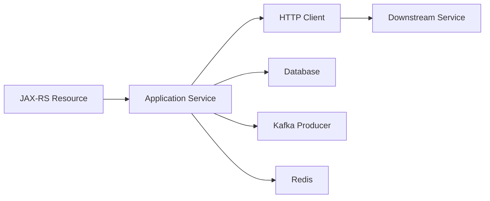
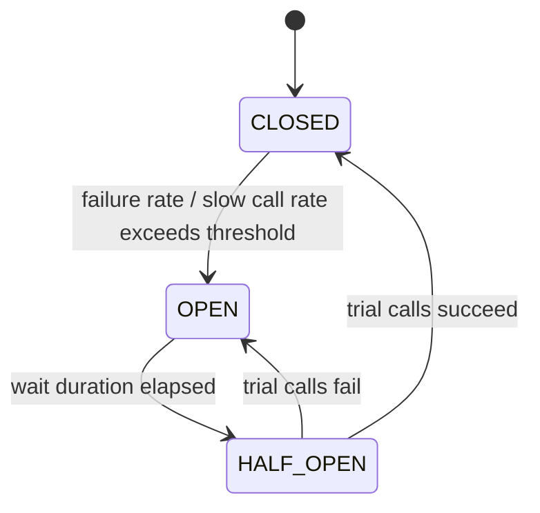
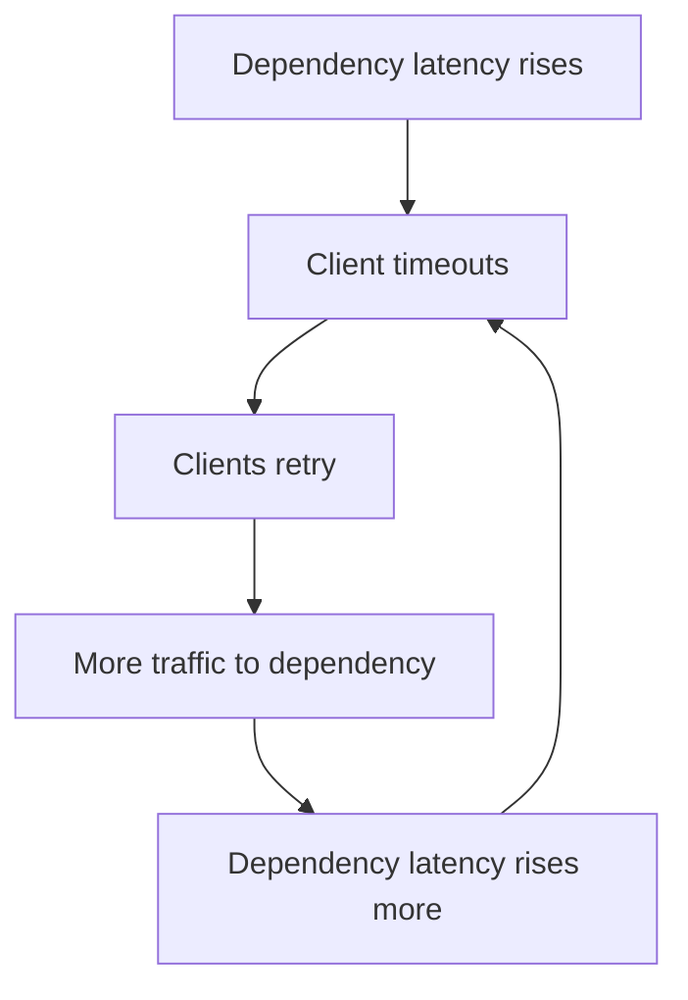

# Part 035 — Retry, Retry Budget, Circuit Breaker, and Bulkhead

> Fokus part ini: memahami retry, retry budget, circuit breaker, dan bulkhead sebagai mekanisme pengendalian failure. Tujuannya bukan membuat request “lebih sering dicoba”, tetapi mencegah satu dependency failure berubah menjadi cascading failure di sistem enterprise.

Retry sering terlihat seperti solusi sederhana:

```text
Call failed? Try again.
```

Di production, retry yang salah bisa menjadi amplifier:

```text
small downstream latency -> retry starts -> traffic doubles/triples
                       -> downstream overloads more
                       -> timeout increases
                       -> more retry
                       -> retry storm
```

Senior engineer tidak bertanya:

```text
Should we retry?
```

Tetapi:

```text
Is this operation safe to retry, within what budget, under which failure class,
and how do we stop retry from harming the system?
```

---

## 1. Core Mental Model

Resilience pattern bekerja pada boundary antar komponen.



Setiap boundary punya kemungkinan:

```text
- fast success
- fast failure
- slow success
- slow failure
- timeout
- partial side effect
- duplicate execution
- overload
```

Retry, circuit breaker, dan bulkhead bukan pengganti correctness.

Mereka adalah guardrail untuk:

```text
- membatasi blast radius
- menjaga resource tetap bounded
- memberi waktu dependency pulih
- melindungi service dari antrian kerja yang tidak lagi bernilai
- menjaga sebagian sistem tetap berjalan saat dependency tertentu rusak
```

---

## 2. Failure Classes Before Retry

Tidak semua failure layak retry.

| Failure class | Example | Retry? | Reason |
|---|---|---:|---|
| transient network failure | connection reset, temporary DNS glitch | maybe | bisa pulih cepat |
| timeout | downstream slow | maybe, but dangerous | retry bisa memperparah overload |
| 429 rate limited | dependency menolak karena quota | only if `Retry-After` respected | harus patuh budget |
| 503 unavailable | dependency overloaded/down | limited retry | jangan hammer dependency |
| 400 bad request | invalid input | no | request tetap salah |
| 401/403 | auth/authz failure | no | retry tidak mengubah permission |
| 404 | resource absent | usually no | kecuali eventual consistency jelas |
| 409 conflict | optimistic lock/idempotency conflict | depends | perlu domain-specific decision |
| DB deadlock | transaction deadlock | maybe | retry transaction bisa valid |
| unique constraint violation | duplicate key | usually no | sering signal idempotency/conflict |
| Kafka retriable exception | metadata/leader change | yes, client-level | Kafka client sudah punya retry semantics |

Decision rule:

```text
Retry only when:
1. failure is likely transient
2. operation is safe to repeat
3. retry stays inside request deadline
4. retry is bounded by budget
5. retry has backoff/jitter
6. system has observability for retry impact
```

---

## 3. Retry Safety and Idempotency

Retry aman hanya jika side effect bisa dikontrol.

Unsafe example:

```text
POST /orders
- creates order
- charges customer
- publishes event
- first response times out
- client retries
- second call creates duplicate order or duplicate charge
```

Safer design:

```text
POST /orders
Idempotency-Key: abc-123

Server stores:
- request identity
- semantic operation key
- processing state
- final response or conflict result
```

Retry safety depends on:

```text
- HTTP method semantics
- idempotency key
- database uniqueness guard
- deduplication table
- outbox/inbox pattern
- downstream idempotency support
- compensating transaction availability
```

For Java/JAX-RS service, retry safety is usually enforced below the resource method:

```text
Resource method
  -> application service
     -> idempotency guard
        -> transaction
           -> repository / downstream call / event outbox
```

Bad placement:

```java
@POST
@Path("/orders")
public Response createOrder(CreateOrderRequest request) {
    // Anti-pattern: blind retry around entire business operation
    for (int i = 0; i < 3; i++) {
        try {
            return Response.ok(orderService.create(request)).build();
        } catch (Exception e) {
            // retries everything, including partial side effects
        }
    }
    throw new RuntimeException("failed");
}
```

Better reasoning:

```text
- Retry small, well-understood operations.
- Do not blindly retry large business workflows.
- Prefer idempotent command boundary.
- Persist state before publishing events.
- Do not hide duplicate execution from domain model.
```

---

## 4. Retry Budget

Retry budget answers:

```text
How much extra traffic are we willing to generate because of failure?
```

Without budget:

```text
1000 original requests/sec
3 retry attempts
= up to 3000 additional attempts/sec
= 4000 total calls/sec under failure
```

Retry budget can be expressed as:

```text
- max attempts per call
- max total retry duration
- max retry traffic ratio
- max retries per endpoint/dependency/tenant
- max retries within request deadline
```

Simple budget model:

```text
Allowed retry traffic <= 10% of successful baseline traffic
```

Request-level budget:

```text
request deadline: 2 seconds
attempt 1 timeout: 500ms
backoff: 100ms
attempt 2 timeout: 500ms
backoff: 200ms
attempt 3 timeout: 300ms
remaining budget reserved for response/error mapping
```

Bad retry config:

```text
attempts = 5
read timeout = 5s
backoff = 1s
client timeout = 10s
```

This cannot possibly fit the client deadline.

Good retry design starts from deadline:

```text
request deadline -> dependency budget -> attempt timeout -> retry count -> backoff
```

---

## 5. Backoff and Jitter

Retry without delay often creates synchronized load.

Bad:

```text
attempt 1 fails at t=0
all clients retry immediately at t=0
all clients retry again at t=0
```

Better:

```text
attempt 1 fails
wait randomized delay
retry while still inside deadline
```

Backoff strategies:

| Strategy | Behavior | Use case |
|---|---|---|
| fixed delay | same wait every time | simple low-volume internal retry |
| exponential backoff | delay grows per attempt | overloaded dependency recovery |
| jitter | randomized delay | avoids synchronized retry storm |
| server-directed delay | obeys `Retry-After` | rate limit / maintenance window |

Conceptual policy:

```text
maxAttempts = 3
attemptTimeout = bounded by remaining deadline
backoff = exponential + jitter
retryOn = transient exceptions only
abortOn = validation/auth/domain errors
```

---

## 6. Circuit Breaker Mental Model

Circuit breaker prevents repeated calls to a dependency that is already failing.



States:

| State | Meaning | Behavior |
|---|---|---|
| closed | dependency considered healthy | calls allowed |
| open | dependency considered unhealthy | calls fail fast |
| half-open | testing recovery | limited trial calls |

Circuit breaker protects:

```text
- caller threads
- connection pools
- dependency itself
- upstream latency
- user experience through fast failure/fallback
```

Circuit breaker does not fix:

```text
- wrong timeout
- unsafe retry
- bad idempotency
- database lock contention
- poor capacity planning
```

---

## 7. Circuit Breaker Signals

A breaker may open based on:

```text
- failure rate
- slow call rate
- number of calls in sliding window
- timeout rate
- specific exception classes
- HTTP status classes
```

Important distinction:

```text
HTTP 500 from dependency may count as failure.
HTTP 404 may or may not count as failure.
HTTP 409 may be domain conflict, not dependency failure.
HTTP 429 should usually influence rate/retry policy.
```

Bad breaker configuration:

```text
- every exception opens breaker
- validation error counted as dependency failure
- window too small, breaker flaps
- half-open allows too many calls
- open duration too long, service never recovers quickly
```

Senior-level question:

```text
Which errors represent dependency health, and which errors represent normal business outcomes?
```

---

## 8. Bulkhead Mental Model

Bulkhead isolates resource pools so one failing dependency or workload cannot consume everything.

Ship analogy:

```text
If one compartment floods, the entire ship should not sink.
```

Service analogy:

```text
If pricing service is slow, catalog lookup should not consume all request threads.
If tenant A creates heavy traffic, tenant B should not starve.
If reporting query is slow, order submission should remain available.
```

Common bulkhead dimensions:

```text
- by dependency
- by endpoint type
- by tenant
- by priority
- by workload class: read/write/reporting/job
- by execution pool
- by connection pool
```

Bulkhead forms:

| Bulkhead type | Description | Risk |
|---|---|---|
| semaphore bulkhead | limits concurrent calls | caller thread still waits/blocks |
| thread-pool bulkhead | isolates execution threads/queue | context propagation and queue tuning needed |
| connection-pool bulkhead | separate pool per dependency | more config and capacity planning |
| tenant quota | isolates tenants | requires accurate tenant resolution |
| endpoint quota | protects critical endpoints | may reject non-critical traffic |

---

## 9. Retry + Circuit Breaker + Bulkhead Interaction

These patterns interact. Wrong order creates bad behavior.

Common conceptual chain:

```text
Caller
  -> deadline check
  -> bulkhead
  -> circuit breaker
  -> retry policy
  -> timeout-bound dependency call
```

But the exact order depends on library and use case.

What matters:

```text
- retry must not bypass circuit breaker
- retry must not exceed bulkhead capacity
- timeout must bound each attempt
- circuit breaker must see meaningful failures
- fallback must not hide data corruption
```

Example failure:

```text
bulkhead allows 100 concurrent calls
retry attempts = 3
real dependency concurrency becomes up to 300 attempts over time
```

Better design:

```text
bulkhead capacity and retry budget are designed together
```

---

## 10. Resilience4j or Equivalent Library

Many Java services use a resilience library such as Resilience4j, a platform wrapper, service mesh policy, API gateway policy, or internal framework.

Do not assume the library. Verify it.

Possible places resilience may be applied:

```text
- Java code using Resilience4j decorators
- annotations/aspects around service methods
- HTTP client wrapper
- generated client layer
- service mesh timeout/retry policy
- API gateway retry/rate limit policy
- Kubernetes ingress/controller annotations
- platform SDK used internally
```

Conceptual Java shape:

```java
public final class PricingClient {
    private final RemotePricingApi api;
    private final Retry retry;
    private final CircuitBreaker circuitBreaker;
    private final Bulkhead bulkhead;

    public PriceResult quotePrice(PricingRequest request, Deadline deadline) {
        Supplier<PriceResult> call = () -> api.quotePrice(request, deadline.remaining());

        Supplier<PriceResult> guarded = Decorators.ofSupplier(call)
            .withBulkhead(bulkhead)
            .withCircuitBreaker(circuitBreaker)
            .withRetry(retry)
            .decorate();

        return guarded.get();
    }
}
```

The exact API may differ. The important design is:

```text
- dependency-specific policy
- bounded retry
- breaker by dependency/operation
- metrics emitted
- fallback explicit
- no blanket retry around domain workflow
```

---

## 11. Where to Apply Resilience in JAX-RS Service

Avoid placing all resilience at resource method level.

Resource method should usually handle:

```text
- request parsing
- auth/security context availability
- validation trigger
- application service call
- response mapping
```

Resilience usually belongs at integration boundary:

```text
Application service
  -> PricingClient with timeout/retry/breaker/bulkhead
  -> CatalogClient with own policy
  -> OrderRepository with DB timeout/transaction policy
  -> EventPublisher with producer policy
```

Why boundary-specific?

```text
- pricing dependency may tolerate fallback
- order database write may not tolerate retry without transaction design
- catalog read may be cacheable
- event publish may require outbox instead of direct retry
```

Anti-pattern:

```text
One global retry policy for all outbound calls.
```

Better:

```text
Policy per dependency + operation + side-effect profile.
```

---

## 12. Fallback Boundary

Fallback is not “return anything so the endpoint succeeds.”

Fallback must preserve truthfulness.

Possible fallback types:

| Fallback | Example | Risk |
|---|---|---|
| cached read | return last known catalog | stale data |
| default value | use default feature config | wrong business behavior |
| partial response | omit non-critical enrichment | client must understand partiality |
| queue for later | accept command asynchronously | requires state tracking |
| fail fast | return explicit error | user sees failure but system protected |

Unsafe fallback:

```text
pricing service unavailable -> return price = 0
```

Safer fallback:

```text
pricing service unavailable -> return 503 with retryable error code
or return quote status = PRICING_PENDING if workflow supports async completion
```

Senior-level rule:

```text
A fallback must be a valid business state, not a technical lie.
```

---

## 13. Retry Storm

Retry storm occurs when many clients retry at the same time and overload a weak dependency.



Signals:

```text
- dependency QPS increases while success rate decreases
- retry count spikes
- timeout rate spikes
- p95/p99 latency increases
- circuit breaker opens across many instances
- downstream CPU/connection pool saturated
```

Controls:

```text
- retry budget
- exponential backoff + jitter
- circuit breaker
- rate limiting
- load shedding
- respecting Retry-After
- avoiding retry on overload signals
```

---

## 14. Circuit Breaker Flapping

Flapping means breaker repeatedly opens and closes.

Causes:

```text
- sliding window too small
- threshold too sensitive
- half-open trial count too high/low
- timeout too aggressive
- dependency latency naturally bursty
- all instances half-open at same time
```

Mitigation:

```text
- tune sliding window
- use slow-call threshold carefully
- apply jitter to recovery attempts if supported
- isolate by dependency operation
- observe breaker metrics before changing thresholds
```

Do not tune blindly.

```text
Breaker config is a production control surface.
```

---

## 15. Bulkhead Starvation

Bulkhead protects one area but can also starve legitimate work if badly sized.

Example:

```text
pricing bulkhead size = 5
normal traffic requires 20 concurrent calls
result: artificial bottleneck
```

Another example:

```text
single shared executor for:
- order submit
- report generation
- reconciliation job

report job fills queue -> order submit waits -> customer-facing API degrades
```

Better:

```text
- separate workload classes
- bounded queues
- priority or admission control
- metrics per pool
- rejection instead of unbounded waiting
```

---

## 16. Observability for Resilience

Minimum metrics:

```text
- retry attempts count
- retry exhausted count
- retry success after retry
- circuit breaker state
- circuit breaker open count
- slow call rate
- failure rate
- bulkhead available permits
- bulkhead rejected calls
- dependency latency by operation
- dependency error by class
```

Important labels:

```text
- dependency
- operation
- outcome
- exception class category
- retry attempt number bucket
```

Avoid high-cardinality labels:

```text
- user id
- tenant id if too many and uncontrolled
- order id
- quote id
- raw URL with IDs
- exception message
```

Logs should answer:

```text
- Was this original call or retry attempt?
- Which dependency operation failed?
- Was circuit breaker open?
- Was bulkhead full?
- Was fallback used?
- What correlation/trace ID connects it?
```

---

## 17. Example: Outbound Dependency Policy Matrix

| Dependency | Operation | Retry | Circuit breaker | Bulkhead | Fallback |
|---|---|---:|---:|---:|---|
| catalog service | read product catalog | yes, limited | yes | yes | cached catalog if allowed |
| pricing service | calculate price | maybe | yes | yes | fail/pending depending workflow |
| payment/charging | create charge | no blind retry | yes | strict | idempotency-key required |
| PostgreSQL | read query | maybe for transient | no typical app breaker | pool limit | fail fast |
| PostgreSQL | write transaction | only transaction-aware | no typical app breaker | pool limit | no silent fallback |
| Kafka publish | send event | client retry/outbox | producer metrics | buffer control | outbox replay |
| Redis cache | get value | maybe tiny | yes if critical | connection pool | cache miss path |

This matrix should be internalized per service.

---

## 18. JAX-RS Exception Mapping for Resilience Failures

Resilience failures should map to stable API errors.

Examples:

| Internal failure | HTTP response | Notes |
|---|---:|---|
| dependency timeout | 504 or 503 | depends whether service acts as gateway or processor |
| circuit breaker open | 503 | include retryability if policy allows |
| bulkhead full | 503 or 429 | overload/admission failure |
| retry exhausted | 503/504 | preserve root cause category |
| rate limited internally | 429 | include `Retry-After` if meaningful |
| fallback partial response | 200/206/domain-specific | must be explicit in contract |

Do not leak raw exception names as API contract.

Bad:

```json
{
  "error": "CallNotPermittedException"
}
```

Better:

```json
{
  "code": "DEPENDENCY_UNAVAILABLE",
  "message": "A required downstream service is temporarily unavailable.",
  "retryable": true,
  "correlationId": "..."
}
```

---

## 19. Internal Verification Checklist

Use this when joining or reviewing an internal service.

### Library / platform

- Is Resilience4j used directly?
- Is there an internal resilience wrapper library?
- Is resilience applied by service mesh, API gateway, or generated client?
- Are there annotation-based aspects?
- Are policies centralized or per dependency?
- Is there a platform standard for timeout/retry/circuit breaker?

### Retry

- Which exception/status codes are retried?
- Is retry allowed only for idempotent operations?
- Is there a retry budget?
- Is backoff configured?
- Is jitter configured?
- Is `Retry-After` respected?
- Are retries visible in metrics/logs/traces?

### Circuit breaker

- What is the breaker granularity: service, endpoint, operation, tenant?
- What counts as failure?
- What counts as slow call?
- What are sliding window and threshold values?
- How many half-open trial calls are allowed?
- Are breaker state changes logged/alerted?

### Bulkhead

- Are thread pools shared across unrelated workloads?
- Are queues bounded?
- Are dependency calls isolated?
- Are tenants isolated where required?
- Are rejections mapped to stable errors?
- Are bulkhead metrics visible?

### Fallback

- Which operations have fallback?
- Is fallback a valid business state?
- Is stale data allowed?
- Is partial response explicit?
- Is fallback usage observable?

---

## 20. PR Review Checklist

When reviewing a change that calls a dependency, ask:

```text
Correctness
- Is the operation safe to retry?
- Are side effects idempotent or guarded?
- Does retry interact safely with transaction boundaries?
- Is fallback semantically valid?

Timeout and budget
- Is there a request deadline?
- Do attempts fit inside the deadline?
- Are retries bounded?
- Is backoff + jitter configured?

Circuit breaker
- Is breaker scoped correctly?
- Are failure classes correct?
- Could breaker flap?
- Is open breaker mapped to stable API error?

Bulkhead
- Is dependency concurrency bounded?
- Are queues bounded?
- Could this workload starve critical traffic?
- Are rejections observable?

Observability
- Are retry/breaker/bulkhead metrics emitted?
- Are logs correlated with trace/correlation ID?
- Can on-call see retry storm quickly?

Internal standard
- Does this follow platform resilience standard?
- Is Resilience4j/equivalent used consistently?
- Are configs externalized and reviewed?
```

---

## 21. Common Anti-Patterns

```text
- Retrying every exception.
- Retrying non-idempotent writes without idempotency key.
- Retrying after client deadline expired.
- Same retry config for every dependency.
- Circuit breaker counting domain errors as dependency failure.
- Circuit breaker around local validation logic.
- Unbounded executor queue called a “bulkhead”.
- Fallback returning misleading business data.
- Retry hidden inside low-level library with no metrics.
- Gateway retry + application retry + client retry all enabled without budget.
```

The most dangerous pattern:

```text
Everyone retries because everyone assumes someone else controls the retry budget.
```

---

## 22. Senior Mental Model

A resilient service is not one that always succeeds.

A resilient service is one that:

```text
- fails quickly when continuing is harmful
- retries only when safe and useful
- protects critical resources
- isolates failure domains
- exposes accurate telemetry
- preserves domain correctness
- degrades explicitly, not silently
```

Retry is a scalpel, not a hammer.

Circuit breaker is a damage limiter, not a cure.

Bulkhead is a blast-radius boundary, not just a thread pool.

---

## 23. What This Enables Next

Setelah memahami retry, retry budget, circuit breaker, dan bulkhead, kita bisa masuk ke pattern proteksi overload yang lebih luas:

```text
- rate limiting
- load shedding
- fallback strategy
- hedged request
- thundering herd prevention
- cascading failure containment
- graceful degradation
```

Itu menjadi fokus part berikutnya.
