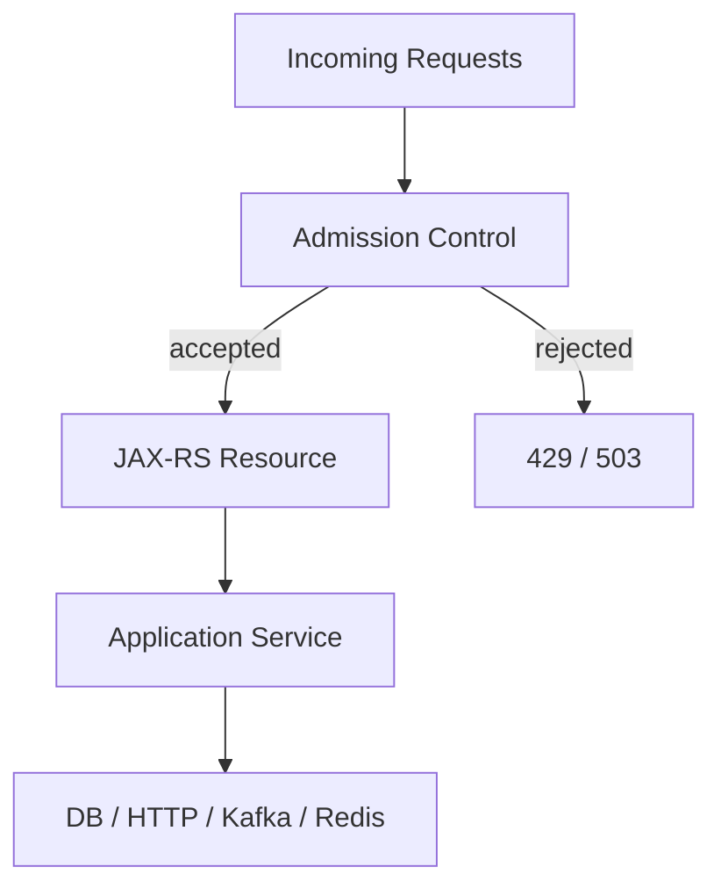
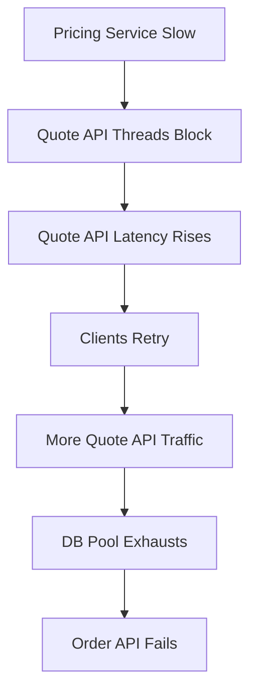

# Part 036 — Rate Limiting, Load Shedding, Fallback, and Hedged Request

> Fokus part ini: memahami pattern proteksi overload dan latency tail. Tujuannya menjaga service tetap predictable saat traffic naik, dependency melambat, atau sebagian sistem gagal.

Production system tidak cukup hanya punya retry dan circuit breaker.

Ketika tekanan naik, service perlu bisa berkata:

```text
- request ini boleh masuk
- request ini harus ditunda
- request ini harus ditolak
- request ini hanya boleh menerima degraded response
- request ini lebih baik gagal cepat daripada membuat sistem runtuh
```

Ini adalah admission control.

Tanpa admission control:

```text
traffic spike -> queue grows -> latency grows -> timeout grows
             -> retry grows -> dependency overloads -> cascading failure
```

---

## 1. Core Mental Model

Setiap service punya kapasitas terbatas.



Admission control harus terjadi sebelum kerja mahal dimulai.

```text
Reject early, before consuming scarce resources.
```

Scarce resources:

```text
- request threads
- executor threads
- DB connections
- HTTP client connections
- Kafka producer buffer
- Redis connections
- heap memory
- CPU quota
- downstream capacity
- tenant quota
```

---

## 2. Rate Limiting

Rate limiting membatasi jumlah request dalam periode tertentu.

Tujuannya:

```text
- melindungi service dari abuse/spike
- menjaga fairness antar client/tenant
- melindungi downstream dependency
- menjaga SLO endpoint kritis
- memberi sinyal eksplisit ke caller bahwa traffic harus dikurangi
```

Rate limiting bisa diterapkan di banyak layer:

| Layer | Example | Strength | Weakness |
|---|---|---|---|
| API gateway | per API key/tenant/IP | dekat edge | kurang tahu internal capacity |
| service filter | per endpoint/tenant/user | tahu context aplikasi | butuh implementasi konsisten |
| downstream client wrapper | per dependency operation | melindungi dependency | caller sudah masuk service |
| Redis/distributed limiter | global quota antar pod | konsisten lintas instance | butuh Redis reliability |
| service mesh | per service route | platform-level | domain context terbatas |

Senior-level view:

```text
Rate limit policy should match the resource being protected.
```

---

## 3. Rate Limiting Algorithms

Common algorithms:

| Algorithm | Mental model | Use case |
|---|---|---|
| fixed window | max N per time window | simple quota, can burst at boundary |
| sliding window | rolling time window | smoother control |
| token bucket | tokens refill over time | allows controlled burst |
| leaky bucket | constant drain rate | smooths traffic |
| concurrency limit | max in-flight requests | protects threads/dependency |
| adaptive limit | adjusts based on latency/failure | advanced overload control |

Token bucket example:

```text
capacity = 100 tokens
refill = 10 tokens/sec
request consumes 1 token
if token absent -> reject or delay
```

Concurrency limit example:

```text
max in-flight pricing requests = 50
request accepted only if active < 50
```

For JAX-RS APIs, concurrency limiting is often more directly tied to resource pressure than pure request-per-second limit.

---

## 4. What Should Be Rate Limited?

Possible dimensions:

```text
- endpoint
- tenant
- user
- client application
- API key
- IP / network source
- dependency operation
- workload type
- expensive query pattern
- file upload/download
- background jobs
```

Enterprise example:

```text
- quote creation: limited per tenant and per service capacity
- catalog lookup: higher limit, cacheable
- pricing calculation: strict dependency-aware limit
- reporting/export: low-priority bulkhead + queue
- file upload: size + concurrency limit
```

Avoid one global rate limit for everything.

```text
Critical write operation and bulk report export should not compete equally.
```

---

## 5. Rate Limit Response Contract

HTTP status:

```text
429 Too Many Requests
```

Useful headers:

```text
Retry-After: 30
X-RateLimit-Limit: 100
X-RateLimit-Remaining: 0
X-RateLimit-Reset: 1710000000
```

But only expose headers that are part of your API governance standard.

Stable error body:

```json
{
  "code": "RATE_LIMITED",
  "message": "Request rate exceeded for this operation.",
  "retryable": true,
  "correlationId": "..."
}
```

Do not expose sensitive quota internals if they reveal tenant capacity or platform topology.

---

## 6. Load Shedding

Load shedding means intentionally rejecting work to keep the system alive.

Rate limiting is usually policy-based.

Load shedding is usually health/capacity-based.

Examples:

```text
- reject low-priority requests when CPU is saturated
- reject new work when DB pool is exhausted
- reject expensive search when p99 latency breaches threshold
- stop accepting batch jobs during incident
- disable optional enrichment when downstream is slow
```

Good load shedding:

```text
small controlled failure now prevents total failure later
```

Bad load shedding:

```text
randomly failing requests without clear reason or observability
```

---

## 7. Load Shedding Signals

Possible signals:

```text
- in-flight request count
- request queue length
- thread pool saturation
- DB pool utilization
- CPU throttling
- heap pressure / GC pause
- p95/p99 latency
- dependency timeout rate
- circuit breaker open state
- Kafka producer buffer pressure
- Redis latency
```

Be careful with signals that react too late.

Late signals:

```text
- pod OOMKilled
- JVM full GC storm
- all DB connections exhausted
- all request threads blocked
```

Earlier signals:

```text
- queue depth rising
- latency rising before error rate
- dependency slow-call rate rising
- pool wait time rising
- rejected bulkhead calls rising
```

---

## 8. Load Shedding Policy

A useful policy distinguishes priority.

| Workload | Priority | Shedding behavior |
|---|---:|---|
| health check | critical | must remain cheap and available |
| order submission | high | protect capacity |
| quote creation | high | protect, maybe degrade enrichment |
| catalog browsing | medium | allow cache fallback |
| report export | low | reject/defer during overload |
| reconciliation job | background | pause/retry later |

Policy example:

```text
if DB pool wait p95 > threshold:
  - reject report/export endpoints
  - reduce pricing concurrency
  - preserve order submission capacity
  - pause non-urgent scheduled jobs
```

This is where architecture and operations meet.

---

## 9. Fallback

Fallback provides an alternate behavior when the primary path is unavailable.

Fallback should be:

```text
- explicit
- observable
- semantically valid
- bounded
- documented in contract if visible to client
```

Fallback types:

| Type | Example | Good for | Risk |
|---|---|---|---|
| cached fallback | return cached catalog | read-heavy data | stale data |
| partial response | omit optional enrichment | non-critical fields | client confusion |
| asynchronous acceptance | mark processing pending | long-running commands | state complexity |
| default config | use safe default | feature behavior | wrong tenant behavior |
| fail fast | return clear failure | correctness-critical flows | lower availability |

Fallback should not convert uncertainty into false certainty.

Unsafe:

```text
pricing unavailable -> assume discount = 0 or price = 0 silently
```

Safer:

```text
pricing unavailable -> quote status = PRICING_PENDING
pricing unavailable -> 503 DEPENDENCY_UNAVAILABLE
pricing unavailable -> use cached price only if business explicitly allows stale pricing
```

---

## 10. Graceful Degradation

Graceful degradation means preserving core capability while reducing optional capability.

Example for quote/order style system:

```text
Core:
- create quote intent
- persist command
- maintain audit trail
- return stable tracking status

Degradable:
- optional recommendation
- non-critical enrichment
- expensive preview
- secondary analytics event
- asynchronous notification
```

Degradation requires pre-defined modes.

```text
Normal mode
  -> all features enabled

Degraded mode
  -> optional enrichments disabled
  -> lower concurrency for expensive operations
  -> async workflow for long-running tasks
  -> stricter rate limits
```

Do not invent degradation during incident.

Design it before incident.

---

## 11. Hedged Request

Hedged request sends a duplicate request after a delay to reduce tail latency.

Concept:

```text
send request to replica A
if no response after threshold
send same request to replica B
use first successful response
cancel/ignore the slower one
```

Hedging can reduce p99 latency for read-only, idempotent operations.

It can also double load.

Use hedging only when:

```text
- operation is read-only or idempotent
- backend has replica capacity
- duplicate work is acceptable
- request cancellation is supported or harmless
- hedging threshold is based on latency distribution
- global budget prevents overload
```

Do not hedge:

```text
- payment/charge creation
- order creation without idempotency
- DB writes
- expensive CPU operations under overload
- dependency already saturated
```

---

## 12. Hedging vs Retry

| Pattern | When it starts | Goal | Risk |
|---|---|---|---|
| retry | after failure/timeout | recover from failure | retry storm |
| hedge | before original fails | reduce tail latency | extra load |

Retry says:

```text
The attempt failed; try another.
```

Hedging says:

```text
The attempt is slow; start another before it fails.
```

Hedging must be more carefully controlled than retry because it increases load even when the original call may still succeed.

---

## 13. Thundering Herd

Thundering herd occurs when many workers wake up or retry at the same time.

Common causes:

```text
- cache entry expires for all pods at once
- all clients retry immediately
- scheduled jobs run at exact same second
- all circuit breakers half-open together
- deployment restarts all pods and they warm cache simultaneously
- rate limit reset causes burst
```

Mitigations:

```text
- jitter TTL
- jitter retry backoff
- stagger scheduled jobs
- single-flight request coalescing
- background refresh before expiry
- distributed lock with fencing where appropriate
- cache warmup discipline
- progressive rollout
```

Example cache stampede:

```text
popular catalog key expires
1000 requests miss cache
1000 requests hit database
DB slows down
requests timeout
clients retry
DB collapses
```

Better:

```text
- one request refreshes key
- others serve stale-if-allowed or wait bounded time
- TTL has jitter
- refresh is observed
```

---

## 14. Cascading Failure

Cascading failure means one component failure causes dependent components to fail.



Common cascade path:

```text
slow dependency
-> caller threads blocked
-> caller queue grows
-> caller memory rises
-> caller timeout increases
-> upstream retries
-> shared DB/cache/pool exhausted
-> unrelated endpoints fail
```

Breaking cascade requires:

```text
- timeout
- circuit breaker
- bulkhead
- rate limiting
- load shedding
- fallback/degradation
- bounded queues
- observability
```

---

## 15. JAX-RS Placement Patterns

### Request filter for admission control

A JAX-RS request filter can reject before resource method executes.

Conceptual shape:

```java
@Provider
@Priority(Priorities.AUTHORIZATION)
public final class AdmissionControlFilter implements ContainerRequestFilter {
    @Override
    public void filter(ContainerRequestContext context) {
        String tenantId = resolveTenant(context);
        String route = resolveRoute(context);

        if (!admissionController.allow(tenantId, route)) {
            context.abortWith(Response.status(429)
                .entity(error("RATE_LIMITED"))
                .build());
        }
    }
}
```

Important:

```text
- tenant resolution must be trustworthy
- filter must be cheap
- avoid blocking remote calls in admission filter
- expose clear metrics for rejection
```

### Service-layer protection

Dependency-specific controls usually belong near the dependency client.

```text
Resource
  -> ApplicationService
     -> PricingClient with dependency limit
     -> CatalogClient with cache fallback
     -> Repository with DB pool/statement timeout
```

### Gateway-level policy

Gateway can apply:

```text
- API key quota
- IP-based throttling
- tenant quota
- request size limit
- WAF/security policy
```

But gateway does not always know:

```text
- DB pool pressure
- internal workflow state
- operation cost
- tenant-specific business priority
```

Use gateway and service-level protection together.

---

## 16. Response Strategy Under Overload

Overload should map to intentional responses.

| Situation | HTTP response | Notes |
|---|---:|---|
| tenant/user exceeded quota | 429 | include retry guidance if allowed |
| service overloaded | 503 | fail fast, maybe `Retry-After` |
| dependency unavailable | 503/504 | depends on service role |
| expensive optional field unavailable | 200 with explicit partial metadata | only if contract supports partial |
| async processing accepted | 202 | include status URL/tracking ID |
| file too large | 413 | protect memory/storage |
| request queue full | 503 | do not let request wait forever |

Bad response strategy:

```text
Everything becomes 500.
```

Better:

```text
Return the most honest status and stable error code.
```

---

## 17. Observability for Load Protection

Minimum metrics:

```text
- accepted requests
- rejected requests
- rejection reason
- rate limiter permits available
- limiter wait time if queueing is allowed
- load shedding activation
- fallback usage count
- degraded mode active
- hedge requests started
- hedge requests won/lost
- duplicate work caused by hedging
- thundering herd/stampede indicators
```

Useful labels:

```text
- endpoint/route template
- tenant tier, not raw tenant ID unless controlled
- dependency
- policy name
- rejection reason
- workload class
```

Avoid:

```text
- raw tenant/customer/order/quote IDs as metrics labels
- raw URL path with IDs
- exception message as label
```

Logs should say:

```text
- why request was rejected
- which policy made the decision
- whether fallback/degraded mode was used
- what correlation/trace ID to follow
```

---

## 18. Internal Verification Checklist

### Rate limiting

- Is rate limiting done at gateway, service, Redis, service mesh, or client library?
- What dimensions are limited: tenant, user, API key, endpoint, dependency?
- Is quota static or tenant-specific?
- Are rejected requests returned as 429 or 503?
- Is `Retry-After` used?
- Are rate limit metrics visible?

### Load shedding

- Does the service have explicit overload behavior?
- What signals trigger shedding?
- Are low-priority workloads rejected before high-priority workloads?
- Are queues bounded?
- Are batch jobs paused during overload?
- Are rejection reasons observable?

### Fallback and degradation

- Which flows have fallback?
- Which fallbacks are business-approved?
- Is stale data allowed?
- Are partial responses documented?
- Is degraded mode controlled by feature flag/config?
- Is fallback usage alerted or monitored?

### Hedged request

- Is hedging used anywhere?
- For which operations?
- Are operations idempotent/read-only?
- Is duplicate work measured?
- Is hedging disabled under overload?
- Is cancellation/cleanup handled?

### Thundering herd

- Are cache TTLs jittered?
- Are scheduled jobs staggered?
- Are retries jittered?
- Are half-open breaker attempts synchronized?
- Is cache warmup controlled?

---

## 19. PR Review Checklist

When reviewing overload protection:

```text
Admission control
- Is protection applied before expensive work?
- Is tenant/user/client identity reliable at that point?
- Are limits aligned with protected resource?

Rate limiting
- Is the limit dimension correct?
- Is response contract stable?
- Are limits configurable?
- Are tests covering rejection behavior?

Load shedding
- Is shedding signal meaningful and early enough?
- Is priority respected?
- Does shedding avoid total service collapse?
- Are operators able to see shedding state?

Fallback
- Is fallback semantically valid?
- Is stale/partial data allowed by business contract?
- Is fallback explicit to client if visible?
- Is fallback usage observable?

Hedging
- Is operation safe to duplicate?
- Is hedge delay justified by latency distribution?
- Is extra load bounded?
- Is hedging disabled during overload?

Cascading failure
- Could this change amplify traffic?
- Could this consume shared pools?
- Could background work starve user traffic?
- Could tenant A affect tenant B?
```

---

## 20. Failure Mode Table

| Pattern | Failure if misused | Detection |
|---|---|---|
| rate limiting | blocks critical traffic | rejected request spike by route |
| load shedding | random customer-visible failure | rejection reason logs/metrics |
| fallback | silent wrong business result | fallback counter + audit check |
| hedged request | doubles backend load | hedge attempt rate, backend QPS |
| jitterless retry | synchronized storm | retry spikes at same timestamp |
| cache TTL no jitter | cache stampede | cache miss spike + DB QPS spike |
| unbounded queue | memory growth and stale work | queue depth + latency + heap |
| global quota only | unfair tenant starvation | tenant-level success/reject split |

---

## 21. Design Heuristics

```text
1. Protect the narrowest scarce resource.
2. Reject before expensive work.
3. Prefer bounded rejection over unbounded waiting.
4. Rate limit by the dimension that causes cost.
5. Fallback only to valid business states.
6. Hedge only safe, read-only/idempotent operations.
7. Add jitter wherever many actors wake up together.
8. Preserve core flows before optional flows.
9. Make degradation visible to operators.
10. Never let overload protection hide data corruption.
```

---

## 22. Senior Mental Model

Availability is not achieved by accepting all work.

Availability is achieved by accepting the right work within bounded capacity.

A production-ready JAX-RS service should be able to answer:

```text
- What happens when traffic doubles?
- What happens when DB pool is 95% busy?
- What happens when pricing service p99 becomes 5 seconds?
- Which requests are rejected first?
- Which features degrade first?
- How does on-call see the system is protecting itself?
- How do we prevent tenant/customer blast radius?
```

If the answer is “everything waits,” the system is not resilient.

---

## 23. What This Enables Next

Dengan resilience dan load protection sebagai fondasi, kita bisa lanjut ke application composition layer:

```text
- dependency injection fundamentals
- scopes
- resource/provider lifecycle
- configuration profiles
- multi-tenancy configuration
- secret management
- feature flags and rollout controls
```

Itu menjadi jembatan dari runtime behavior ke struktur aplikasi enterprise yang maintainable.
