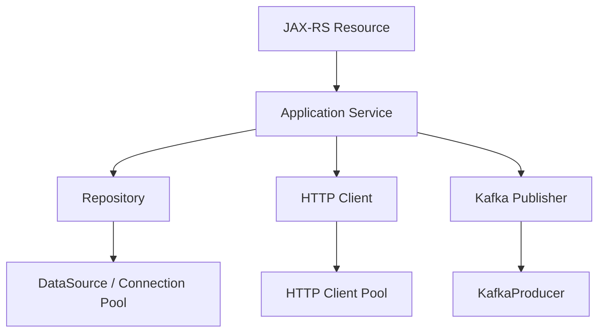
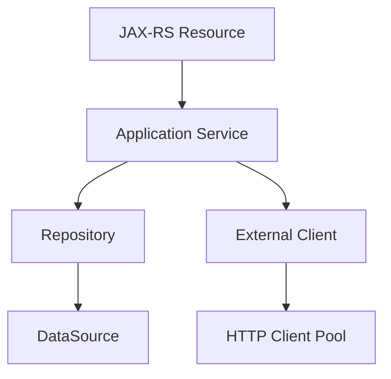

# Part 037 — Dependency Injection Fundamentals and Scopes

> Fokus part ini: memahami Dependency Injection sebagai mekanisme composition dan lifecycle management, bukan sekadar cara menghindari `new`. Dalam JAX-RS enterprise service, DI menentukan siapa yang membuat object, kapan object hidup, kapan object mati, dan apakah object aman dipakai lintas request.

Dependency Injection sering terlihat sederhana:

```java
public class QuoteResource {
    private final QuoteService quoteService;

    public QuoteResource(QuoteService quoteService) {
        this.quoteService = quoteService;
    }
}
```

Tetapi di production system, pertanyaannya bukan hanya "bagaimana object masuk ke constructor".

Pertanyaan senior engineer adalah:

```text
- siapa owner lifecycle object ini?
- apakah object ini singleton, request-scoped, atau transient?
- apakah object ini thread-safe?
- apakah object ini membawa tenant/user/request state?
- apakah dependency graph bisa dibangun saat startup?
- apakah dependency ini mudah diganti di test?
- apakah konfigurasi dan secret masuk dengan cara aman?
- apakah ada hidden global state?
```

DI adalah bagian dari architecture boundary.

---

## 1. Mental Model: Object Graph, Not Magic

Aplikasi Java enterprise adalah object graph.



DI container membantu membangun graph ini.

```text
Container responsibility:
- know which implementation satisfies which type
- create object in correct order
- inject dependencies
- manage lifecycle/scope
- fail startup if graph invalid
```

Tetapi DI container tidak otomatis membuat design menjadi baik.

Bad graph tetap bad graph, hanya saja dibuat otomatis.

```text
Dependency Injection solves construction.
It does not solve coupling, state ownership, or bad boundaries.
```

---

## 2. Why DI Exists in Backend Services

Tanpa DI, resource sering membuat dependency sendiri.

```java
@Path("/quotes")
public class QuoteResource {
    private final QuoteService quoteService = new QuoteService(
        new QuoteRepository(new DataSourceFactory().create()),
        new PricingClient()
    );
}
```

Masalahnya:

```text
- resource tahu terlalu banyak detail construction
- sulit mengganti implementation untuk test
- sulit mengatur lifecycle connection pool/client
- setiap resource bisa membuat dependency mahal berulang
- konfigurasi tersebar
- shutdown/cleanup tidak jelas
- observability wrapper sulit dipasang konsisten
```

Dengan DI:

```java
@Path("/quotes")
public class QuoteResource {
    private final QuoteService quoteService;

    @Inject
    public QuoteResource(QuoteService quoteService) {
        this.quoteService = quoteService;
    }
}
```

Resource hanya tahu behavior yang ia butuhkan.

Construction dipindahkan ke composition root.

---

## 3. Composition Root

Composition root adalah tempat dependency graph disusun.

Dalam Java/JAX-RS service, composition root bisa muncul sebagai:

```text
- Jersey ResourceConfig
- HK2 AbstractBinder
- CDI bean discovery
- manual application bootstrap
- Servlet initializer
- main method embedded server
- framework-specific module/configuration class
```

Contoh conceptual HK2-style binding:

```java
public class AppBinder extends AbstractBinder {
    @Override
    protected void configure() {
        bind(QuoteService.class).to(QuoteService.class).in(Singleton.class);
        bind(PostgresQuoteRepository.class).to(QuoteRepository.class).in(Singleton.class);
        bind(PricingHttpClient.class).to(PricingClient.class).in(Singleton.class);
    }
}
```

Contoh conceptual CDI-style bean discovery:

```java
@ApplicationScoped
public class QuoteService {
    private final QuoteRepository repository;

    @Inject
    public QuoteService(QuoteRepository repository) {
        this.repository = repository;
    }
}
```

Senior-level rule:

```text
Business code should not know how the whole application is assembled.
```

---

## 4. Manual Construction vs DI vs Service Locator

| Pattern | Example | Strength | Risk |
|---|---|---|---|
| manual construction | `new QuoteService(...)` | explicit, simple | repeated wiring, poor lifecycle |
| DI | constructor injection | testable, lifecycle-aware | container magic if uncontrolled |
| service locator | `locator.getService(...)` | dynamic lookup | hides dependency, harder to test |
| static global | `Global.get(...)` | convenient | worst for tests/lifecycle/concurrency |

DI is usually preferred for stable dependencies.

Service locator may be acceptable only near infrastructure boundary, for example:

```text
- Jersey/HK2 internal integration
- plugin lookup
- dynamic provider lookup
- framework bridge
```

Avoid service locator in business logic.

Bad:

```java
public Quote calculate(QuoteCommand command) {
    PricingClient client = ServiceLocator.current().get(PricingClient.class);
    return client.price(command);
}
```

Better:

```java
public class QuoteService {
    private final PricingClient pricingClient;

    public QuoteService(PricingClient pricingClient) {
        this.pricingClient = pricingClient;
    }
}
```

Hidden dependencies become hidden failure modes.

---

## 5. Constructor Injection

Constructor injection is the default choice for mandatory dependencies.

```java
public class QuoteService {
    private final QuoteRepository repository;
    private final PricingClient pricingClient;
    private final Clock clock;

    @Inject
    public QuoteService(
        QuoteRepository repository,
        PricingClient pricingClient,
        Clock clock
    ) {
        this.repository = repository;
        this.pricingClient = pricingClient;
        this.clock = clock;
    }
}
```

Why it is strong:

```text
- dependencies are explicit
- object can be immutable after construction
- no partially initialized state
- easy to test without container
- impossible to forget mandatory dependency
```

Test example:

```java
QuoteService service = new QuoteService(
    fakeRepository,
    fakePricingClient,
    fixedClock
);
```

PR review signal:

```text
If a class cannot be constructed in a unit test without the DI container,
its dependency boundary may be too framework-coupled.
```

---

## 6. Field Injection

Field injection is common in framework examples.

```java
@Inject
private QuoteService quoteService;
```

Problems:

```text
- dependency is hidden from constructor
- object can exist in invalid partially injected state
- hard to instantiate in unit tests
- encourages mutable non-final fields
- harder to reason about lifecycle
```

Field injection may be tolerable for framework-owned classes where constructor injection is not supported or where the codebase standard uses it consistently, but it should not be the default for core business logic.

Senior recommendation:

```text
Use constructor injection for application code.
Use field injection only when framework constraints or internal standard justify it.
```

Internal verification matters because legacy enterprise systems may already standardize field injection.
Do not refactor blindly without understanding container behavior.

---

## 7. Setter Injection

Setter injection is useful for optional or late-bound dependencies.

```java
public class QuoteService {
    private AuditPublisher auditPublisher = AuditPublisher.noop();

    @Inject
    public void setAuditPublisher(AuditPublisher auditPublisher) {
        this.auditPublisher = auditPublisher;
    }
}
```

Use carefully.

Good use cases:

```text
- optional dependency
- backward-compatible extension
- framework lifecycle callback
- test-only override
```

Bad use cases:

```text
- mandatory dependency
- security dependency
- repository/client dependency required for correct behavior
```

Mandatory dependencies should not be optional by accident.

---

## 8. Provider and Factory

Sometimes you do not want the dependency immediately.

You want a way to create or retrieve it when needed.

Conceptually:

```java
public class ExportService {
    private final Provider<ExportJobContext> jobContextProvider;

    @Inject
    public ExportService(Provider<ExportJobContext> jobContextProvider) {
        this.jobContextProvider = jobContextProvider;
    }

    public void runExport() {
        ExportJobContext ctx = jobContextProvider.get();
        // use ctx
    }
}
```

Use provider/factory when:

```text
- object is expensive and should be lazy
- object is request-scoped but injected into singleton
- object needs runtime parameter
- object lifecycle must be controlled explicitly
- object creation can fail and needs local handling
```

Do not use provider to hide poor design.

Bad smell:

```text
Provider<X> used everywhere because dependency graph is circular or scopes are wrong.
```

Factory example:

```java
public interface PricingRequestContextFactory {
    PricingRequestContext create(TenantId tenantId, CorrelationId correlationId);
}
```

Factory is often better than injecting a mutable context.

---

## 9. Scope Mental Model

Scope answers one question:

```text
How many instances exist, and how long do they live?
```

Common scopes:

| Scope | Lifetime | Typical use | Risk |
|---|---|---|---|
| singleton/application | whole app | stateless service, client, repository | mutable shared state |
| request | one HTTP request | request context, auth context | leaking outside request |
| per-lookup/transient | every injection/lookup | short-lived helper | expensive if overused |
| dependent | owned by injected target | CDI dependent object | lifecycle tied to owner |
| session | user/session | web app state | rarely appropriate for stateless APIs |

Enterprise JAX-RS services usually prefer:

```text
- stateless singleton services
- singleton repositories/clients backed by pools
- request-scoped context holders
- explicit factories for runtime-specific objects
```

---

## 10. Singleton Scope

Singleton means one instance per container/application context.

Good singleton candidates:

```text
- stateless application services
- repository objects that use DataSource
- HTTP client wrapper with connection pool
- Kafka producer wrapper
- configuration snapshot
- object mapper if immutable/configured once
- metric registry wrapper
```

Bad singleton candidates:

```text
- object storing current user
- object storing current tenant
- object storing current request body
- mutable workflow state
- non-thread-safe formatter/client
- per-request accumulator
```

Singleton rule:

```text
Singleton object must be thread-safe or effectively immutable.
```

Dangerous singleton:

```java
@Singleton
public class QuoteContext {
    private String currentTenantId;
    private String currentUserId;
}
```

This can leak tenant/user across concurrent requests.

Better:

```text
- pass tenant/user explicitly as method argument
- use request-scoped context if framework-supported
- use immutable command object
```

---

## 11. Request Scope

Request scope means one instance per HTTP request.

Useful for:

```text
- authenticated principal
- tenant context
- correlation context
- request metadata
- permission context
- request-local cache
```

Example conceptual request context:

```java
public class RequestContext {
    private final TenantId tenantId;
    private final UserId userId;
    private final CorrelationId correlationId;

    public RequestContext(TenantId tenantId, UserId userId, CorrelationId correlationId) {
        this.tenantId = tenantId;
        this.userId = userId;
        this.correlationId = correlationId;
    }
}
```

Risk:

```text
Request-scoped object is only valid during request lifecycle.
```

Do not store request-scoped object inside long-lived singleton.

Dangerous:

```java
@Singleton
public class QuoteService {
    @Inject
    private RequestContext requestContext;
}
```

Depending on container proxy behavior, this may work via proxy or may break badly.
But even if it works, it hides the request dependency.

Prefer explicit method argument for important request state:

```java
quoteService.createQuote(command, requestContext);
```

---

## 12. Scope Mismatch

Scope mismatch is a major source of subtle production bugs.

Example:

```text
Singleton service depends on request-scoped context.
```

Possible outcomes:

```text
- container injects proxy and it works only inside active request
- request context unavailable in background thread
- context leaks if ThreadLocal not cleared
- unit tests miss issue
- async tasks fail after response returned
```

Scope mismatch matrix:

| Long-lived object depends on short-lived object | Risk |
|---|---|
| singleton -> request context | context unavailable/leaked |
| singleton -> transaction object | invalid outside transaction |
| singleton -> entity manager/session | thread safety issue |
| async job -> request context | missing tenant/security data |
| Kafka consumer -> HTTP request context | no active HTTP request |

Senior pattern:

```text
Convert short-lived runtime context into immutable command/context value at boundary.
Pass it explicitly.
```

---

## 13. Jakarta Inject Basics

Jakarta Inject provides basic annotations such as:

```java
@Inject
@Named
@Qualifier
@Scope
@Singleton
```

Important distinction:

```text
Jakarta Inject defines common injection annotations.
It does not itself provide the full container runtime.
```

Actual behavior depends on DI implementation:

```text
- HK2 in Jersey environments
- CDI in Jakarta EE environments
- Spring if integrated separately
- custom/manual wiring
```

Do not assume `@Inject` means CDI.
It may be HK2-managed depending on runtime.

Internal verification checklist must identify:

```text
- which container processes @Inject
- which scopes are supported
- how resource classes are instantiated
- whether CDI integration is active
```

---

## 14. HK2 vs CDI: Practical Boundary

Conceptual comparison:

| Topic | HK2 | CDI |
|---|---|---|
| Common with | Jersey | Jakarta EE / CDI runtime |
| Core model | service locator + descriptors | contextual beans |
| Binding | `AbstractBinder`, factories | bean discovery, producers |
| Scope model | HK2 scopes | CDI scopes |
| Qualifiers | supported | rich qualifier model |
| Events/interceptors | limited compared to CDI | richer CDI ecosystem |
| Verification | Jersey config/dependency | CDI provider/beans.xml/runtime |

In a Jersey-based service, HK2 may be enough.
In a Jakarta EE server, CDI may be the primary DI system.
In mixed environments, integration must be verified carefully.

Risk areas:

```text
- object created by HK2 cannot see CDI bean
- object created manually cannot receive injection
- duplicate binding for same interface
- ambiguous injection with multiple implementations
- scope annotations interpreted differently
```

---

## 15. Binding Interfaces to Implementations

Application code should depend on interfaces at important boundaries.

```java
public interface QuoteRepository {
    QuoteRecord findById(QuoteId id);
    void save(QuoteRecord quote);
}
```

Implementation:

```java
public class PostgresQuoteRepository implements QuoteRepository {
    private final DataSource dataSource;

    @Inject
    public PostgresQuoteRepository(DataSource dataSource) {
        this.dataSource = dataSource;
    }
}
```

Binding:

```text
QuoteRepository -> PostgresQuoteRepository
```

Good interface boundaries:

```text
- database repository
- external HTTP client
- Kafka publisher
- clock/time provider
- feature flag provider
- secret/config provider
- audit publisher
```

Avoid interface inflation for trivial classes.

Bad:

```text
IQuoteService, QuoteServiceImpl, QuoteServiceFactory, QuoteServiceProvider
```

Use interfaces where substitution is real.

---

## 16. Qualifiers and Multiple Implementations

When there are multiple implementations, type alone is not enough.

```text
PricingClient can mean:
- internal pricing engine client
- mock pricing client
- legacy pricing client
- tenant-specific pricing client
```

A qualifier disambiguates.

Conceptual CDI example:

```java
@Qualifier
@Retention(RUNTIME)
@Target({ FIELD, PARAMETER, METHOD, TYPE })
public @interface LegacyPricing {}
```

Usage:

```java
@Inject
public QuoteService(@LegacyPricing PricingClient pricingClient) {
    this.pricingClient = pricingClient;
}
```

PR review question:

```text
Does the qualifier describe a stable architectural role,
or is it hiding environment-specific branching?
```

Qualifiers should not become random labels.

---

## 17. Configuration Injection

Configuration often enters the dependency graph.

Bad:

```java
String timeout = System.getenv("PRICING_TIMEOUT_MS");
```

Better:

```java
public class PricingClientConfig {
    private final Duration connectTimeout;
    private final Duration readTimeout;
    private final URI baseUri;
}
```

Then inject config object:

```java
public class PricingHttpClient {
    private final PricingClientConfig config;

    @Inject
    public PricingHttpClient(PricingClientConfig config) {
        this.config = config;
    }
}
```

Advantages:

```text
- config validated at startup
- defaults are explicit
- test can supply config
- no scattered env lookup
- config can be documented
```

Sensitive config should use secret handling rules, not normal property injection.

---

## 18. Startup Validation

A strong DI setup fails fast at startup when graph is invalid.

Good startup failures:

```text
- missing required binding
- invalid config value
- duplicate ambiguous binding
- secret unavailable
- malformed URI
- invalid timeout
```

Bad production behavior:

```text
Service starts successfully but first request fails because dependency is missing.
```

For critical dependencies, prefer startup validation.

But be careful with optional external systems.

```text
Not every dependency should be hard-required at startup.
```

Example:

| Dependency | Startup required? | Reason |
|---|---:|---|
| config schema | yes | invalid config means bad deployment |
| DataSource object creation | yes | app cannot function without DB config |
| DB connectivity | depends | strict for monolith-like app, risky for rolling deploy if DB transient |
| optional notification client | no | degraded mode may be acceptable |
| feature flag provider | depends | safe defaults may be enough |

---

## 19. Circular Dependencies

Circular dependency:

```text
QuoteService -> PricingService -> QuoteService
```

This is usually a design smell.

Possible causes:

```text
- service boundary too broad
- orchestration mixed with domain operation
- event publishing mixed with command handling
- helper class became god service
- bidirectional module dependency
```

Bad workaround:

```text
Use Provider everywhere to break cycle.
```

Better options:

```text
- extract shared domain policy
- split orchestration service
- introduce event boundary
- pass data instead of service
- invert dependency through interface owned by lower-level module
```

DI container error is often a design diagnostic.

---

## 20. Mutable Shared State

The most dangerous DI bug is accidentally shared mutable state.

Example:

```java
@Singleton
public class QuoteAccumulator {
    private final List<QuoteLine> lines = new ArrayList<>();

    public void add(QuoteLine line) {
        lines.add(line);
    }
}
```

In a concurrent JAX-RS service, this can corrupt data across requests.

Better:

```java
public class QuoteDraft {
    private final List<QuoteLine> lines;
}
```

or:

```text
Keep mutable aggregation as local variable within request method/service method.
```

Rule:

```text
Mutable request data should not live in singleton beans.
```

---

## 21. Thread Safety Review for Injected Objects

Injected singleton dependencies are shared across request threads.

Review each singleton:

```text
- Does it have mutable fields?
- Are mutable fields thread-safe?
- Does it use non-thread-safe Java types?
- Does it cache per-request data?
- Does it wrap a thread-safe client/pool?
- Does it mutate config after startup?
```

Common thread-safe singleton examples:

```text
- DataSource/connection pool wrapper
- immutable config object
- stateless service
- ObjectMapper if configured once before use
- HTTP client designed for concurrent use
```

Common unsafe examples:

```text
- SimpleDateFormat
- mutable ArrayList/HashMap without protection
- per-request context holder
- non-thread-safe SDK client if not documented as thread-safe
```

---

## 22. DI and Testing

Good DI makes tests simpler.

```java
class QuoteServiceTest {
    @Test
    void rejectsExpiredCatalogVersion() {
        QuoteRepository repo = new InMemoryQuoteRepository();
        PricingClient pricing = new FakePricingClient();
        Clock clock = Clock.fixed(...);

        QuoteService service = new QuoteService(repo, pricing, clock);

        // assert behavior
    }
}
```

Test seam candidates:

```text
- Clock
- UUID generator / ID generator
- repository interface
- external client interface
- feature flag provider
- event publisher
- audit publisher
```

Avoid requiring full DI container for every unit test.

Container test is useful for:

```text
- binding correctness
- resource wiring
- provider registration
- scope behavior
- integration with Jersey/CDI/HK2
```

But business behavior tests should usually instantiate classes directly.

---

## 23. DI and Observability Wrapping

DI is where cross-cutting wrappers can be attached consistently.

Example:

```text
PricingClient interface
  -> ObservedPricingClient
      -> ResilientPricingClient
          -> SigningPricingClient
              -> RawHttpPricingClient
```

This layering makes outbound behavior explicit:

```text
- metrics/tracing
- retry/circuit breaker
- request signing
- error mapping
- raw HTTP call
```

Bad pattern:

```text
Every call site manually adds retry/logging/signing.
```

Better:

```text
Compose decorated dependency once at application boundary.
```

PR review question:

```text
Is resilience/telemetry/security applied at the dependency boundary,
or scattered across business logic?
```

---

## 24. DI and Tenant-Aware Behavior

Tenant-aware systems often need tenant-specific configuration.

Bad:

```java
@Singleton
public class PricingRules {
    private TenantId currentTenant;
    private RuleSet currentRules;
}
```

Better:

```java
public interface PricingRuleProvider {
    RuleSet rulesFor(TenantId tenantId, Instant effectiveAt);
}
```

Usage:

```java
RuleSet rules = pricingRuleProvider.rulesFor(command.tenantId(), command.effectiveAt());
```

DI injects provider/service.
Runtime request supplies tenant.

Rule:

```text
DI supplies capabilities.
Request supplies context.
```

This prevents singleton tenant leaks.

---

## 25. DI and Configuration per Environment

Environment-specific behavior should not be hidden in arbitrary branches.

Bad:

```java
if (System.getenv("ENV").equals("prod")) {
    return new RealPricingClient();
} else {
    return new MockPricingClient();
}
```

Better:

```text
Binding layer chooses implementation based on validated profile/config.
Application code depends on PricingClient.
```

But environment branching should be minimized.

Production-like behavior should exist in lower environments whenever possible.

Internal verification:

```text
- How are profiles selected?
- Which bindings differ by environment?
- Are non-prod mocks accidentally deployable to prod?
- Are fail-safe defaults explicit?
```

---

## 26. Common Failure Modes

| Failure | Symptom | Likely cause |
|---|---|---|
| missing binding | startup failure or 500 | interface has no implementation registered |
| ambiguous binding | startup failure | multiple implementations no qualifier |
| null dependency | NPE | object manually constructed, field injection not run |
| tenant leak | wrong tenant data | mutable singleton/request context misuse |
| context unavailable | exception in async/job | request scope used outside request |
| circular dependency | startup failure | service boundary cycle |
| resource leak | connection/thread leak | lifecycle owner unclear |
| slow startup | long constructor work | expensive I/O during graph creation |
| test pain | requires container everywhere | poor constructor boundaries |

---

## 27. Debugging DI Problems

Start with questions:

```text
1. Who created this object?
2. Was it created manually or by container?
3. Which container owns it: HK2, CDI, Servlet, custom bootstrap?
4. What scope does it have?
5. Is the dependency mandatory or optional?
6. Is there more than one implementation?
7. Is there a qualifier/name involved?
8. Is this running in HTTP request, background job, Kafka consumer, or startup?
```

Evidence to inspect:

```text
- constructor annotations
- field/setter annotations
- HK2 binders
- CDI annotations
- ResourceConfig registration
- package scanning configuration
- startup logs
- dependency graph error
- test bootstrap
```

For production-only issues, inspect concurrency and scope first.

```text
A DI bug that appears only under load is often a scope/thread-safety bug.
```

---

## 28. PR Review Checklist

When reviewing DI changes:

```text
[ ] Does the class use constructor injection for mandatory dependencies?
[ ] Are dependencies explicit and minimal?
[ ] Is the scope correct?
[ ] Is every singleton thread-safe or immutable?
[ ] Is request/user/tenant state kept out of singleton objects?
[ ] Are multiple implementations disambiguated with stable qualifiers?
[ ] Are config objects validated at startup?
[ ] Are secrets handled through secure secret mechanism?
[ ] Are external clients wrapped consistently with timeout/resilience/telemetry/security?
[ ] Does business logic avoid service locator/static globals?
[ ] Can core behavior be unit-tested without DI container?
[ ] Are circular dependencies avoided?
[ ] Is shutdown/cleanup ownership clear?
```

---

## 29. Internal Verification Checklist

For CSG/internal codebase, verify rather than assume:

```text
[ ] Which DI mechanism is actually used: HK2, CDI, Spring, manual, or mixed?
[ ] Are JAX-RS resources constructed by Jersey/HK2, CDI, Servlet, or manually?
[ ] Is `@Inject` processed by HK2 or CDI?
[ ] Which scope annotations are valid in the runtime?
[ ] Are resources per-request or singleton?
[ ] Are providers singleton by default?
[ ] Where are HK2 binders registered?
[ ] Is CDI integration enabled?
[ ] Is `beans.xml` present and relevant?
[ ] Are there custom factories/producers?
[ ] Are config/secret objects injected or accessed directly?
[ ] Are tenant/user/request contexts request-scoped, ThreadLocal, explicit argument, or header-only?
[ ] Are there known patterns for mocking dependencies in tests?
[ ] Are external clients decorated with resilience/telemetry/security wrappers?
[ ] Are there internal architecture guidelines for dependency scope?
```

---

## 30. Senior Engineer Heuristics

Use these heuristics in real reviews:

```text
1. DI should make dependency graph clearer, not more mysterious.
2. Singleton is safe only when state is immutable or thread-safe.
3. Request context should be explicit at domain/integration boundary.
4. Configuration should be typed, validated, and owned.
5. Secret handling is not normal config handling.
6. Service locator belongs near framework boundary, not domain logic.
7. Provider/factory is for lifecycle/runtime variability, not hiding cycles.
8. Tests should not require container unless testing container behavior.
9. DI errors are often architecture signals.
10. The composition root is production-critical code.
```

---

## 31. Minimal Vocabulary

| Term | Meaning |
|---|---|
| dependency | object required by another object |
| injection | supplying dependency from outside |
| container | runtime that creates/injects/manages objects |
| scope | lifetime/instance rule of object |
| binding | mapping from abstraction to implementation |
| qualifier | label to disambiguate multiple implementations |
| provider | lazy accessor/creator for dependency |
| factory | object that creates another object, often with runtime parameter |
| composition root | place where dependency graph is assembled |
| service locator | object registry queried manually at runtime |

---

## 32. Practical Exercise

Pick one real resource class and answer:

```text
- Who constructs this resource?
- What dependencies does it use?
- Are they constructor, field, or setter injected?
- What scope does each dependency have?
- Which dependencies are singleton?
- Which carry request/tenant/user state?
- Can the resource logic be unit-tested without container?
- Where is the binding/producer/factory registered?
- What would fail at startup vs first request?
```

Then draw the dependency graph.



The goal is not to make the graph pretty.
The goal is to know whether it is true.
