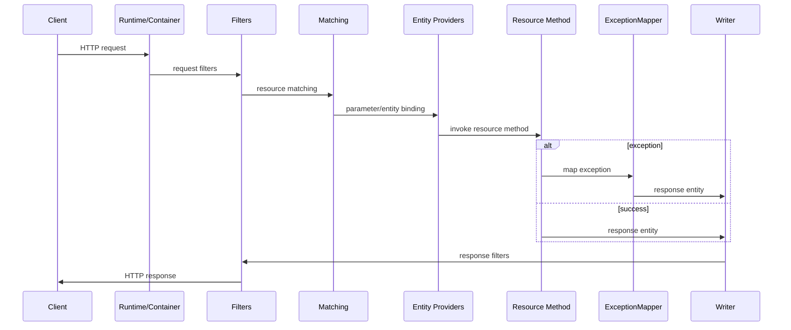
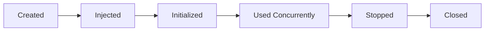

# Part 038 — Resource and Provider Lifecycle

> Fokus part ini: memahami kapan resource/provider dibuat, dipakai, dibagikan, dan dihancurkan. Banyak bug production bukan berasal dari annotation yang salah, tetapi dari asumsi lifecycle yang salah.

JAX-RS code terlihat seperti class Java biasa.

```java
@Path("/quotes")
public class QuoteResource {
    @GET
    @Path("/{id}")
    public QuoteResponse getQuote(@PathParam("id") String id) {
        // handle request
    }
}
```

Tetapi class ini tidak hidup seperti class biasa jika ia dikelola container.

Pertanyaan lifecycle:

```text
- siapa membuat instance resource?
- apakah satu instance dipakai semua request?
- apakah instance baru dibuat per request?
- kapan injection terjadi?
- apakah provider/filter/mapper singleton?
- apakah state di field aman?
- kapan resource mahal dibuat dan ditutup?
- apa yang terjadi saat shutdown/rolling deployment?
```

---

## 1. Lifecycle Is a Contract

Lifecycle menentukan safety.

```text
same class + different lifecycle = different correctness properties
```

Contoh:

```java
public class QuoteResource {
    private QuoteCommand lastCommand;
}
```

Jika resource per-request, field ini mungkin hanya buruk secara design.
Jika resource singleton, field ini bisa menjadi data race dan cross-request leak.

Senior rule:

```text
Never place mutable request state in a field unless you can prove lifecycle and thread-safety.
```

---

## 2. Main Object Categories in JAX-RS Service

| Object type | Example | Typical lifecycle concern |
|---|---|---|
| resource class | `QuoteResource` | per-request vs singleton, injected deps |
| provider | JSON provider, custom binder | singleton/shared behavior |
| filter | auth/logging/correlation filter | thread-safety, ordering, context |
| interceptor | reader/writer interceptor | stream handling, shared state |
| exception mapper | maps exception to response | stateless mapping, observability |
| application config | `Application`, `ResourceConfig` | startup registration |
| DI service | `QuoteService` | scope/thread-safety |
| external client | HTTP/Kafka/DB/Redis | pool lifecycle, shutdown |

Do not treat all of them as ordinary POJOs.

---

## 3. Request Lifecycle Overview

Simplified JAX-RS request lifecycle:



Lifecycle objects participate at different points.

```text
Resource method runs once per matched request.
Provider/filter/mapper may be reused across many requests.
```

---

## 4. Resource Class Lifecycle

JAX-RS implementations commonly support per-request resource instances, and may support singleton resources depending on registration/configuration.

Do not assume blindly.

Possible models:

| Model | Meaning | Consequence |
|---|---|---|
| per-request resource | new instance per request | field state request-local, but still avoid careless mutation |
| singleton resource | one instance shared | all fields must be thread-safe/immutable |
| DI-managed scoped resource | scope defined by HK2/CDI/container | behavior depends on runtime integration |
| manually registered instance | you pass object instance to runtime | usually singleton-like |

Conceptual per-request:

```text
request 1 -> QuoteResource instance A
request 2 -> QuoteResource instance B
```

Conceptual singleton:

```text
request 1 -> QuoteResource instance A
request 2 -> QuoteResource instance A
request 3 -> QuoteResource instance A
```

Internal verification is mandatory.

---

## 5. Resource Field State

Resource classes should usually be thin and stateless.

Good:

```java
@Path("/quotes")
public class QuoteResource {
    private final QuoteService quoteService;

    @Inject
    public QuoteResource(QuoteService quoteService) {
        this.quoteService = quoteService;
    }
}
```

Potentially bad:

```java
@Path("/quotes")
public class QuoteResource {
    private QuoteCommand currentCommand;
    private String currentTenantId;
}
```

Even if per-request works today, this pattern is fragile:

```text
- lifecycle may change
- async continuation may expose race
- tests may instantiate singleton
- future refactor may register instance manually
```

Rule:

```text
Keep request data in local variables, method arguments, immutable command objects, or verified request-scoped context.
```

---

## 6. Provider Lifecycle

Providers are extension objects.

Examples:

```text
- MessageBodyReader
- MessageBodyWriter
- ContainerRequestFilter
- ContainerResponseFilter
- ReaderInterceptor
- WriterInterceptor
- ExceptionMapper
```

Providers are commonly singleton/shared objects.
Implementation details vary, but a safe assumption for provider code is:

```text
Provider instances may be reused concurrently.
```

Therefore provider fields should be:

```text
- immutable configuration
- thread-safe dependencies
- stateless helpers
```

Unsafe provider:

```java
public class AuditFilter implements ContainerRequestFilter {
    private String currentUser;

    @Override
    public void filter(ContainerRequestContext ctx) {
        currentUser = ctx.getHeaderString("X-User");
    }
}
```

Safe provider:

```java
public class AuditFilter implements ContainerRequestFilter {
    private final AuditLogger auditLogger;

    @Override
    public void filter(ContainerRequestContext ctx) {
        String user = ctx.getHeaderString("X-User");
        auditLogger.logRequest(user, ctx.getUriInfo().getPath());
    }
}
```

---

## 7. ExceptionMapper Lifecycle

Exception mappers should be stateless translators.

```java
public class DomainExceptionMapper implements ExceptionMapper<DomainException> {
    @Override
    public Response toResponse(DomainException ex) {
        return Response.status(422)
            .entity(ErrorResponse.from(ex))
            .build();
    }
}
```

Good mapper responsibilities:

```text
- choose status code
- build error payload
- attach correlation ID if available
- log at correct level if mapper owns logging decision
- avoid leaking internal details
```

Bad mapper responsibilities:

```text
- perform DB lookup
- call external service
- mutate domain state
- store last exception in field
- implement business recovery
```

Mappers are part of error boundary, not domain workflow.

---

## 8. Filter Lifecycle

Filters often handle cross-cutting behavior:

```text
- authentication
- authorization
- correlation ID
- tenant resolution
- logging
- metrics/tracing
- CORS
- request normalization
```

Filter lifecycle risks:

```text
- shared mutable state
- incorrect ordering
- context not cleared
- request body consumed too early
- response modified after commit
- missing async propagation
```

Filter ordering should be explicit if multiple filters interact.

Example order dependency:

```text
correlation filter -> auth filter -> tenant filter -> request logging filter
```

If logging runs before correlation ID creation, logs may be untraceable.

---

## 9. Interceptor Lifecycle

Reader/writer interceptors sit near entity stream processing.

Common use cases:

```text
- compression/decompression
- encryption/decryption
- payload logging with limits
- signature verification
- stream wrapping
```

Risk:

```text
Interceptors can accidentally buffer huge payloads.
```

Bad:

```text
Read entire request body into memory for logging.
```

Better:

```text
- log size-limited preview
- log checksum/content length
- log metadata instead of full body
- avoid logging PII/secrets
```

Interceptors must be treated as production-critical I/O code.

---

## 10. Application and ResourceConfig Lifecycle

`Application`/`ResourceConfig` belongs to bootstrap lifecycle.

Typical responsibilities:

```text
- register resource classes
- register providers
- register filters/interceptors
- register features
- register DI binders
- set properties
- configure packages/scanning
```

Do not put request logic here.

Bad:

```text
ResourceConfig constructor performs expensive remote calls without timeout.
```

Better:

```text
- build config object
- validate critical settings
- register components
- defer optional dependency health to health checks/readiness
```

Startup should be deterministic and observable.

---

## 11. Initialization: Constructor vs PostConstruct vs Lazy

Initialization can happen in multiple places.

| Place | Use for | Avoid |
|---|---|---|
| constructor | assign dependencies, cheap validation | expensive I/O |
| post construct callback | container-aware initialization | long blocking work without timeout |
| lazy initialization | optional expensive dependency | race-prone lazy code |
| health/readiness check | dependency availability signal | mutating global state |

Constructor should not surprise operators.

Bad:

```java
public PricingClient(PricingConfig config) {
    this.client = buildClient(config);
    this.client.callHealthEndpoint(); // remote I/O during construction
}
```

Better:

```text
- validate URI/timeout config in constructor
- check remote availability in readiness or startup validation with explicit timeout/policy
```

---

## 12. Shutdown Lifecycle

Production services must stop cleanly.

Shutdown should:

```text
- stop accepting new work
- let in-flight requests finish within grace period
- stop scheduled jobs
- stop Kafka consumers cleanly
- flush producers if required
- close HTTP clients
- close DB pools
- release Redis clients
- stop custom executors
- flush telemetry/logs if supported
```

Common leak:

```text
Custom ExecutorService created in singleton but never shut down.
```

Example:

```java
public class ExportService implements AutoCloseable {
    private final ExecutorService executor;

    @Override
    public void close() {
        executor.shutdown();
    }
}
```

But implementing `AutoCloseable` is not enough.
The container/bootstrap must actually call it.

Internal verification required:

```text
Which lifecycle callback is honored by the actual runtime?
```

---

## 13. Resource Ownership

Every expensive resource needs a clear owner.

| Resource | Owner should be | Closed when |
|---|---|---|
| DB connection pool | application singleton | application shutdown |
| DB connection | request/transaction method | after operation/transaction |
| HTTP client pool | application singleton | application shutdown |
| Kafka producer | application singleton | application shutdown |
| Kafka consumer | worker lifecycle | worker shutdown |
| executor | owning service/component | application shutdown |
| file stream | method/request scope | after stream completion |
| temp file | upload/download component | after processing/failure |

Bad smell:

```text
Resource is created in random method and no one knows who closes it.
```

---

## 14. Request Context Lifecycle

Request context exists only while request is active.

Examples:

```text
- URI info
- headers
- security context
- request-scoped beans
- request properties
- MDC values
```

Lifecycle issue:

```java
executor.submit(() -> {
    // tries to read request context here
});
```

The background task may run after request context is gone.

Better:

```java
TenantId tenantId = requestContext.tenantId();
CorrelationId correlationId = requestContext.correlationId();

executor.submit(() -> {
    process(command, tenantId, correlationId);
});
```

Capture immutable values, not framework context object.

---

## 15. ThreadLocal and MDC Lifecycle

`ThreadLocal` can appear in:

```text
- logging MDC
- security context
- tenant context
- tracing context
- transaction context
```

Thread pools reuse threads.

Therefore every ThreadLocal set must be cleared.

```text
request A sets tenant = T1
thread returns to pool
request B reuses same thread
if not cleared -> request B may see T1
```

This is a severe tenant/security bug.

Safe filter pattern:

```java
try {
    setContext(ctx);
    proceed();
} finally {
    clearContext();
}
```

Async/executor propagation requires explicit wrapper or OpenTelemetry/context propagation support.

---

## 16. Lifecycle and Async Boundaries

Async boundaries include:

```text
- ExecutorService
- CompletableFuture
- reactive streams
- scheduled jobs
- Kafka consumers
- event listeners
- callbacks
```

Lifecycle changes at async boundary:

```text
HTTP request scope may not exist.
Servlet request may be completed.
Transaction may be closed.
MDC may be missing.
Security context may not propagate.
```

Rule:

```text
Async work must receive explicit immutable context.
```

Example context payload:

```java
public record WorkContext(
    TenantId tenantId,
    UserId initiatedBy,
    CorrelationId correlationId,
    Instant requestedAt
) {}
```

This is safer than relying on container request state.

---

## 17. Lifecycle and Transactions

Database transaction lifecycle must be shorter than or equal to the operation needing consistency.

Dangerous:

```text
Open transaction -> call slow external service -> continue transaction
```

Risks:

```text
- lock held too long
- connection held too long
- deadlock probability increases
- pool exhaustion
- timeout cascade
```

Better:

```text
- validate input
- load minimal state
- commit local state
- publish outbox/event
- call external system outside DB lock where possible
```

Lifecycle is not only object lifecycle; it is also resource/transaction lifecycle.

---

## 18. Lifecycle and External Clients

HTTP clients, Kafka producers, Redis clients, and SDK clients often manage pools/buffers.

They should usually be long-lived and reused.

Bad:

```java
public QuoteResponse getQuote(String id) {
    Client client = ClientBuilder.newClient();
    return client.target(...).request().get(QuoteResponse.class);
}
```

This can leak sockets and destroy performance.

Better:

```text
Create client once at application startup.
Reuse across requests.
Close at shutdown.
```

But validate thread-safety of the specific library.

Internal verification:

```text
- Is the client documented as thread-safe?
- Where is it created?
- Where is it closed?
- What pool settings exist?
```

---

## 19. Lifecycle and ObjectMapper/Serialization Providers

Serialization providers may use shared mapper/config objects.

Safe if:

```text
- mapper is fully configured before concurrent use
- modules are registered at startup
- date/time/currency rules are stable
- custom serializers are stateless/thread-safe
```

Dangerous:

```text
- mutating ObjectMapper config at request time
- serializer storing last processed object
- per-tenant serialization config stored in singleton mutable field
```

If tenant-specific serialization is needed, use explicit strategy/provider keyed by tenant/config.

---

## 20. Lifecycle and Feature Flags

Feature flag clients may be:

```text
- local config snapshot
- polling client
- streaming client
- remote evaluation client
```

Lifecycle questions:

```text
- when does flag data load?
- what is default if provider unavailable?
- does client spawn background threads?
- how is it closed?
- how are stale flags cleaned up?
```

Feature flag failure mode can be serious:

```text
flag provider unavailable -> all requests fail
```

For most flags, safe default/degraded mode is preferred.

---

## 21. Lifecycle and Multi-Tenancy

Tenant-aware lifecycle mistakes are expensive.

Bad:

```java
@Singleton
public class TenantConfigHolder {
    private TenantConfig currentTenantConfig;
}
```

Better:

```java
public interface TenantConfigProvider {
    TenantConfig get(TenantId tenantId);
}
```

Tenant state should be:

```text
- resolved per request/message/job
- passed explicitly
- cached safely by tenant key if needed
- never stored as current tenant in singleton mutable field
```

Review any field named:

```text
currentTenant
currentUser
currentRequest
lastRequest
activeQuote
```

These are often lifecycle bugs.

---

## 22. Provider Ordering Lifecycle

Providers can depend on execution order.

Example:

```text
1. correlation filter creates correlation ID
2. auth filter validates token
3. tenant filter resolves tenant
4. authorization filter checks permission
5. logging filter records request outcome
```

If order changes:

```text
- auth logs lack correlation ID
- tenant cannot be resolved from principal
- authorization runs before authentication
- error response lacks security/audit context
```

Use explicit priority/order where runtime supports it.

Internal verification:

```text
- Which ordering annotation/config is used?
- Are priorities documented?
- Are tests covering order-sensitive behavior?
```

---

## 23. Startup Failure vs First-Request Failure

Some lifecycle failures appear at startup.

```text
- missing provider binding
- invalid config
- classloading error
- ambiguous injection
- malformed ResourceConfig
```

Others appear only on first request.

```text
- lazy provider missing
- endpoint not registered
- media type provider missing
- request-scoped object unavailable
- external client not initialized
```

Senior goal:

```text
Critical misconfiguration should fail before traffic.
```

But not everything should block startup.

Balance:

```text
fail fast for invalid deployment
serve degraded for optional dependency outage
```

---

## 24. Graceful Shutdown in Kubernetes

Lifecycle must align with Kubernetes termination.

Simplified sequence:

```text
1. pod receives SIGTERM
2. readiness should become false
3. load balancer stops sending new traffic after propagation delay
4. in-flight requests continue until grace period
5. app stops workers/consumers
6. app closes pools/clients
7. process exits
```

If shutdown is wrong:

```text
- request terminated mid-flight
- Kafka message processed but offset not committed
- DB transaction aborted unexpectedly
- file stream interrupted
- duplicate processing after restart
```

JAX-RS runtime, Servlet container, embedded server, and Kubernetes settings must agree.

---

## 25. Lifecycle Diagrams for Review

For every significant component, draw this:



Then annotate:

```text
- who creates it?
- who injects it?
- is it shared?
- is it thread-safe?
- who stops it?
- what happens if stop fails?
```

This simple diagram catches many production bugs.

---

## 26. Common Failure Modes

| Failure | Symptom | Likely lifecycle mistake |
|---|---|---|
| cross-request data leak | wrong user/tenant in log/data | mutable singleton or ThreadLocal not cleared |
| random concurrency bug | intermittent incorrect result | shared non-thread-safe state |
| connection leak | pool exhaustion | client/stream/connection not closed |
| memory leak | heap grows over time | singleton cache/list/map unbounded |
| startup fail | service cannot boot | binding/config/provider registration error |
| first request fail | 500 after deploy | lazy missing dependency/provider |
| graceful shutdown fail | duplicate/lost work | consumers/jobs not stopped correctly |
| missing correlation ID | untraceable logs | filter order or context propagation issue |
| OOM during upload | pod killed | multipart/stream buffered in memory |
| stale tenant config | wrong behavior after config change | cache invalidation/lifecycle issue |

---

## 27. Debugging Lifecycle Issues

Ask in order:

```text
1. Is this object created by JAX-RS, Jersey/HK2, CDI, Servlet, or manually?
2. Is it singleton, request-scoped, per-lookup, or unknown?
3. Is it reused concurrently?
4. Does it have mutable fields?
5. Does it store request/user/tenant state?
6. Does it own external resources?
7. Where are those resources closed?
8. Does it cross async/thread boundary?
9. Does it depend on ThreadLocal/MDC/security context?
10. Does behavior change under load or only after deploy/shutdown?
```

Evidence:

```text
- ResourceConfig/Application registration
- DI binder/producers
- scope annotations
- provider registration
- logs at startup/shutdown
- thread dump
- heap dump
- connection pool metrics
- Kubernetes pod termination events
- load balancer/gateway logs
```

---

## 28. PR Review Checklist

```text
[ ] Is the resource/provider lifecycle known?
[ ] Are resource classes stateless or safely scoped?
[ ] Are provider/filter/mapper classes stateless or thread-safe?
[ ] Are mutable fields justified and protected?
[ ] Is request/user/tenant state kept out of singleton fields?
[ ] Are expensive resources created once and reused safely?
[ ] Are expensive resources closed during shutdown?
[ ] Are streams/files closed on success and failure?
[ ] Are custom executors shut down?
[ ] Are ThreadLocal/MDC values cleared in finally blocks?
[ ] Is async work given explicit immutable context?
[ ] Are provider/filter ordering requirements explicit?
[ ] Are startup validations clear and bounded by timeout?
[ ] Does graceful shutdown preserve in-flight work semantics?
```

---

## 29. Internal Verification Checklist

For CSG/internal codebase, verify:

```text
[ ] Are JAX-RS resources per-request, singleton, CDI-scoped, or manually registered?
[ ] Are providers singleton/shared by default in the runtime used?
[ ] How are filters/interceptors ordered?
[ ] Which lifecycle callbacks are honored: `@PostConstruct`, `@PreDestroy`, `AutoCloseable`, Servlet lifecycle, custom bootstrap?
[ ] Where are HTTP clients created and closed?
[ ] Where are DataSource/connection pools created and closed?
[ ] Are Kafka producers/consumers application-managed or framework-managed?
[ ] Are custom executors present?
[ ] Are request contexts ThreadLocal, request-scoped bean, explicit object, or header-only?
[ ] Are tenant/user/correlation contexts cleared reliably?
[ ] How does app respond to SIGTERM in container/Kubernetes?
[ ] Is readiness changed before shutdown?
[ ] Are in-flight requests allowed to complete?
[ ] Are scheduled jobs and consumers stopped before process exit?
[ ] Are lifecycle assumptions documented in engineering handbook/onboarding?
```

---

## 30. Senior Engineer Heuristics

```text
1. Lifecycle determines whether field state is safe.
2. Provider/filter/mapper code must assume concurrent reuse unless proven otherwise.
3. Framework context should not be carried into async work.
4. Expensive clients/pools should have one clear owner and one clear close path.
5. Startup should fail for invalid deployment, not optional transient dependency outage.
6. Graceful shutdown is part of correctness, especially for event/job processing.
7. ThreadLocal must be paired with reliable cleanup.
8. Tenant/user/request state should be explicit value, not ambient global state.
9. Registration style can change lifecycle semantics.
10. Verify lifecycle from runtime evidence, not from framework folklore.
```

---

## 31. Practical Exercise

Pick one resource, one filter, one exception mapper, and one external client wrapper.

For each, answer:

```text
- Who creates it?
- How many instances exist?
- Is it shared across requests?
- Does it have mutable fields?
- Does it own resource that must be closed?
- Does it use ThreadLocal/MDC/security context?
- What happens during shutdown?
- What metrics/logs prove lifecycle behavior?
```

Then classify each object:

| Object | Scope | Shared? | Mutable state? | Cleanup owner | Risk |
|---|---|---:|---:|---|---|
| QuoteResource | unknown until verified | ? | ? | runtime | ? |
| AuthFilter | unknown until verified | ? | ? | runtime | ? |
| DomainExceptionMapper | unknown until verified | ? | ? | runtime | ? |
| PricingHttpClient | app singleton expected | yes | config/pool | app bootstrap | connection leak |

The exercise is complete only when each `?` is replaced by evidence from codebase/runtime.
