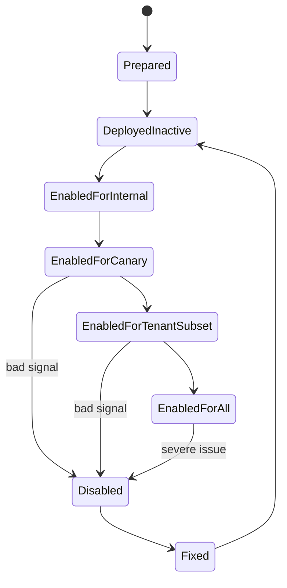

# Part 043 — Canary, Blue-Green, Progressive Delivery, and Rollback Strategy

> Fokus part ini: memahami release sebagai proses pengurangan risiko bertahap. Kita akan membahas canary, blue-green, progressive delivery, backward-compatible deployment, rollback, roll-forward, compatibility API/database/event/config, dan bagaimana strategi ini diterapkan pada service JAX-RS enterprise.

Safe rollout bukan sekadar “deploy pelan-pelan”.

Safe rollout adalah kemampuan untuk mengubah production behavior secara bertahap, mengukur dampaknya, menghentikannya saat sinyal buruk muncul, dan memulihkan sistem tanpa memperbesar kerusakan.

Dalam sistem enterprise seperti CPQ, quote management, order management, catalog-driven architecture, dan quote-to-cash workflow, release bisa mempengaruhi:

```text
- endpoint HTTP
- validation rule
- pricing calculation
- product catalog interpretation
- order state transition
- database schema
- Kafka event contract
- downstream integration
- tenant-specific behavior
- authentication/authorization behavior
- operational dashboard
```

Senior warning:

```text
Deployment strategy does not save an incompatible change.

Canary, blue-green, and progressive delivery only work when code, database, API, events, config, and clients remain compatible during the transition window.
```

---

## 1. Deployment, Release, Migration, and Rollback Are Different Things

A common mistake is mixing these concepts:

```text
Deployment = new artifact runs somewhere.
Release    = new behavior is exposed to traffic/users/tenants.
Migration  = persistent state shape or data is changed.
Rollback   = runtime or behavior is reverted.
Roll-forward = a new fix is deployed to restore correctness.
```

They are related, but not identical.

Example:

```text
Deploy code with new pricing engine:
  artifact is running

Release new pricing engine for tenant A:
  behavior is enabled

Migrate schema to store new price breakdown:
  persistent state changes

Rollback feature flag:
  behavior disabled, artifact may remain

Roll-forward hotfix:
  deploy corrected implementation
```

In a mature system, each dimension must have an explicit strategy.

---

## 2. Safe Rollout Mental Model

A rollout is a state machine.



The important point:

```text
A safe rollout has observable intermediate states.
```

Bad rollout:

```text
merge -> deploy -> everything changes for everyone
```

Safer rollout:

```text
merge -> deploy inactive -> enable internal -> enable small tenant/user/traffic subset -> observe -> expand
```

---

## 3. Preconditions for Safe Rollout

Before choosing canary or blue-green, check whether the change is compatible.

```text
Can old and new versions run at the same time?
Can old code read data written by new code?
Can new code read data written by old code?
Can old consumers ignore new event fields?
Can new consumers handle old event shape?
Can the gateway route traffic predictably?
Can the feature be disabled without data corruption?
```

If the answer is no, the rollout is not safe yet.

You need compatibility work before release strategy.

---

## 4. Compatibility During Deployment

Most production deployment windows have mixed versions.

```text
version N and version N+1 may run at the same time
```

This happens because of:

```text
- rolling update
- canary traffic split
- blue-green transition
- pod restart order
- node drain
- autoscaling
- failed rollout
- partial rollback
```

Therefore, every deployable change must be evaluated across dimensions.

### 4.1 API Compatibility

Safe API change:

```text
- add optional response field
- add optional request field with safe default
- add new endpoint
- add new enum only if clients tolerate unknown value
```

Dangerous API change:

```text
- remove field
- rename field
- make optional field required
- change type
- change status code semantics
- change error shape
- change pagination behavior
```

JAX-RS concern:

```java
@POST
@Path("/quotes")
@Consumes(MediaType.APPLICATION_JSON)
@Produces(MediaType.APPLICATION_JSON)
public Response createQuote(CreateQuoteRequest request) {
    // new field must not be required unless versioned or safely defaulted
}
```

If a new field is required immediately, old clients fail.

### 4.2 Database Compatibility

Safe schema rollout usually follows expand-contract:

```text
1. Expand schema in backward-compatible way.
2. Deploy app that can read/write both old and new shape.
3. Backfill data if needed.
4. Switch reads to new shape.
5. Stop writing old shape.
6. Contract old schema after all old code is gone.
```

Dangerous migration:

```sql
ALTER TABLE quote DROP COLUMN old_status;
```

If old pods still read `old_status`, they break during rolling update.

Safer pattern:

```text
release A: add new_status nullable
release B: dual-write old_status + new_status
release C: read new_status with fallback
release D: stop using old_status
release E: drop old_status after verification
```

### 4.3 Event Compatibility

Kafka/event changes also need compatibility.

Safe:

```text
- add optional field
- preserve event meaning
- keep event name semantics stable
- keep ordering key stable unless intentionally migrated
```

Dangerous:

```text
- remove field
- change event meaning
- reuse event name for different business fact
- change key and break ordering
- publish event before DB commit is durable
```

### 4.4 Config Compatibility

Config changes can break old or new version.

Risky config behavior:

```text
new version requires CONFIG_X
old deployment does not have CONFIG_X
rolling update starts
some pods crashloop
traffic capacity drops
retry storm begins
```

Safer config rule:

```text
- new config has safe default
- config is validated at startup
- required config is deployed before code that requires it
- removing config happens after old code is gone
```

### 4.5 Feature Flag Compatibility

Feature flags are powerful, but they can create split-brain behavior.

Example:

```text
pod A receives updated flag
pod B still has stale flag
same tenant gets two pricing behaviors
```

Mitigations:

```text
- define flag consistency requirement
- include flag evaluation result in logs/traces
- make critical behavior deterministic per tenant/request
- avoid random per-request switching for stateful flows
```

---

## 5. Rolling Deployment

Rolling deployment gradually replaces old pods with new pods.

```text
old pod count decreases
new pod count increases
traffic continues during transition
```

Advantages:

```text
- simple
- low infrastructure overhead
- common Kubernetes default
- no full duplicate environment required
```

Risks:

```text
- mixed-version compatibility required
- rollback may be partial
- database migration can break old pods
- consumers may see inconsistent behavior
```

JAX-RS readiness must be honest.

Bad readiness:

```java
@GET
@Path("/health/ready")
public Response ready() {
    return Response.ok().build();
}
```

Better readiness:

```text
ready only when:
- config loaded
- critical dependencies checked according to policy
- resource/provider bootstrap complete
- migration compatibility expectations satisfied
- service can accept traffic
```

Senior warning:

```text
A pod that is alive is not necessarily ready.
```

---

## 6. Canary Release

Canary release exposes new version to a small traffic subset.

```text
1% traffic -> observe -> 5% -> observe -> 25% -> observe -> 50% -> observe -> 100%
```

Canary dimensions:

```text
- percentage of traffic
- tenant subset
- internal users
- region
- product family
- API route
- low-risk operation type
```

For enterprise systems, tenant-based canary is often safer than random percentage.

Random percentage can split one tenant workflow across old and new behavior.

Tenant-based canary:

```text
tenant A -> new behavior
tenant B -> old behavior
```

This is easier to reason about for catalog, pricing, quote, and order flows.

### 6.1 Canary Metric Gates

Canary must be evaluated by signals.

Minimum signals:

```text
- HTTP 5xx rate
- HTTP 4xx anomaly
- latency p95/p99
- timeout rate
- downstream error rate
- DB error rate
- Kafka publish/consume error
- business invariant violation
- rollback/kill-switch trigger count
```

For CPQ/order-like systems, technical metrics are not enough.

Business signals may include:

```text
- quote creation failure rate
- pricing calculation error rate
- catalog resolution failure
- order submission failure
- validation rejection spike
- payment/tax/integration mismatch
```

### 6.2 Canary Failure Mode

Canary can fail silently when metrics are too broad.

Bad metric:

```text
service 5xx rate < 1%
```

Better metric:

```text
5xx rate for canary version, endpoint, tenant, and operation type
```

But avoid excessive cardinality.

Use controlled dimensions:

```text
- service
- version
- route template
- status class
- tenant tier, not tenant ID, unless allowed
- feature flag name, not dynamic value explosion
```

---

## 7. Blue-Green Deployment

Blue-green deployment maintains two environments:

```text
blue  = current production
green = new version
```

Traffic switch:

```text
blue receives traffic

green is deployed and verified

traffic switches to green
```

Advantages:

```text
- fast cutover
- easier full-environment validation
- fast traffic switch back if stateless and compatible
```

Risks:

```text
- duplicate infrastructure cost
- database remains shared unless carefully isolated
- background consumers/jobs may double-run
- cache/session/state can diverge
- rollback may not undo writes done by green
```

Senior warning:

```text
Blue-green is not automatically safe when database or external side effects are shared.
```

If green writes new data shape that blue cannot understand, switching back to blue breaks.

---

## 8. Progressive Delivery

Progressive delivery combines deployment automation, feature flags, metric gates, and traffic shaping.

```text
deploy new version
  -> enable small scope
  -> evaluate metrics
  -> automatically continue or pause
  -> expand scope
```

Common tools may include platform-specific rollout controllers, service mesh, ingress controller features, GitOps automation, or custom pipeline logic.

Do not assume which tool exists internally.

The engineering question is:

```text
Where is rollout controlled?
- CI/CD pipeline?
- GitOps controller?
- Kubernetes rollout controller?
- ingress/gateway?
- service mesh?
- feature flag platform?
- manual operations runbook?
```

---

## 9. Rollback vs Roll-Forward

Rollback means reverting to prior version or prior behavior.

Roll-forward means deploying a new corrected version.

Rollback is attractive because it sounds fast.

But rollback is unsafe when:

```text
- schema was contracted
- new code wrote data old code cannot read
- external side effects already happened
- event consumers observed new facts
- downstream state has changed
- caches contain new format
- workflow state advanced
```

Roll-forward is often safer when persistent state has moved forward.

Decision matrix:

| Situation | Usually safer |
|---|---|
| Pure stateless code bug | Rollback |
| Feature behind flag | Disable flag |
| Bad config | Revert config |
| New DB write shape already used | Roll-forward or compatibility patch |
| Bad event published externally | Compensating event/process |
| Security exposure | Disable path, rotate secret/key, patch forward |
| Pricing rule wrong for subset | Kill switch + correction/recalculation path |

---

## 10. Rollback Playbook

A rollback playbook should be written before production rollout.

Minimum content:

```text
- what signal triggers rollback
- who approves rollback
- what exactly is rolled back
- artifact version to restore
- config/flag change required
- database compatibility condition
- event compatibility condition
- cache invalidation need
- expected recovery time
- validation steps after rollback
- customer impact communication path
```

Bad rollback plan:

```text
"If anything goes wrong, rollback."
```

Better rollback plan:

```text
If canary p95 latency > baseline + 30% for 10 minutes
or quote creation 5xx > 0.5%
or pricing mismatch alert fires:
  1. disable feature flag `pricing-engine-v2`
  2. stop rollout at current percentage
  3. verify old path success rate
  4. inspect traces for failed requests
  5. decide rollback artifact vs roll-forward patch
```

---

## 11. JAX-RS-Specific Rollout Concerns

### 11.1 Endpoint Addition

Adding endpoint is usually safe.

```java
@POST
@Path("/quotes/{quoteId}/submit")
public Response submitQuote(@PathParam("quoteId") String quoteId) {
    return Response.accepted().build();
}
```

But still verify:

```text
- auth policy
- gateway route
- OpenAPI contract
- rate limit
- audit logging
- idempotency
- observability
```

### 11.2 Endpoint Behavior Change

Changing semantics is risky.

Example:

```text
POST /quotes used to create draft quote
POST /quotes now also submits quote downstream
```

This is a breaking semantic change even if JSON schema is unchanged.

### 11.3 Error Shape Change

If clients parse error fields, changing error shape can break integrations.

Unsafe:

```json
{
  "message": "Invalid request"
}
```

Changed to:

```json
{
  "error": {
    "code": "INVALID_REQUEST"
  }
}
```

Safer:

```json
{
  "code": "INVALID_REQUEST",
  "message": "Invalid request",
  "error": {
    "code": "INVALID_REQUEST"
  }
}
```

Then deprecate old fields later with policy.

### 11.4 Readiness and Startup

A rollout depends on readiness.

If readiness returns true before the service is actually ready, traffic arrives too early.

Startup must account for:

```text
- dependency injection complete
- provider/filter registration complete
- config loaded and validated
- DB pool initialized according to policy
- Kafka producer/consumer lifecycle understood
- cache client behavior defined
- migration compatibility checked
```

---

## 12. Database Migration Rollout Strategy

Database migration is often the hardest part of rollback.

A migration has two risks:

```text
schema risk = old/new code compatibility
execution risk = migration locks, duration, failure, blocking traffic
```

Safe migration checklist:

```text
- additive first
- nullable or defaulted fields
- no immediate destructive changes
- index creation strategy considered
- lock duration understood
- backfill bounded and observable
- old and new app versions compatible
- rollback/roll-forward documented
```

Dangerous migration pattern:

```text
single deployment does:
1. drop old column
2. add new required column
3. deploy code requiring new column
4. enable new behavior for all tenants
```

Safer:

```text
release 1: expand schema
release 2: deploy dual-compatible code
release 3: backfill
release 4: switch behavior gradually
release 5: contract old schema after verification
```

---

## 13. Event Rollout Strategy

Event rollout must preserve consumers.

Safe event release:

```text
- add optional fields
- keep old event name semantics
- document new fields
- validate schema compatibility
- test representative consumers
- support replay behavior
```

Dangerous event release:

```text
- change event meaning under same name
- change key and ordering policy
- remove field
- publish new event before consumers are ready
- backfill/replay without idempotency
```

For event changes, always ask:

```text
Can an old consumer safely consume this event?
Can a new consumer safely consume old events?
Can this event be replayed later?
Can duplicate events occur during rollback or retry?
```

---

## 14. Feature Flag + Deployment + Migration Combined Example

Scenario:

```text
Introduce new tax calculation behavior for quote pricing.
```

Unsafe rollout:

```text
- deploy new code
- immediately calculate tax differently for all tenants
- write new tax fields only
- publish changed QuotePriced event shape
```

Safer rollout:

```text
1. Add new nullable tax breakdown columns.
2. Add code that can calculate old and new tax behavior.
3. Keep old behavior default.
4. Add optional fields to response/event.
5. Enable dark launch to compute new tax but not expose it.
6. Compare old vs new result in logs/metrics.
7. Enable for internal tenant.
8. Enable for selected tenant.
9. Expand gradually.
10. Stop old behavior only after compatibility window.
11. Contract old fields later.
```

Key insight:

```text
Safe rollout is choreography across code, config, data, contract, and operation.
```

---

## 15. Failure Modes

### 15.1 Partial Deployment Failure

Symptoms:

```text
- some pods new, some old
- inconsistent response behavior
- inconsistent event shape
- intermittent errors
```

Detection:

```text
- log version/build hash
- metric by version
- trace service.version attribute
- deployment status
```

### 15.2 Schema Mismatch

Symptoms:

```text
- SQL column not found
- null constraint violation
- old pods fail after migration
- new pods crashloop before migration
```

Detection:

```text
- startup logs
- DB migration logs
- SQLState error
- readiness failure
```

### 15.3 Config Drift

Symptoms:

```text
- pod behavior differs by environment or replica
- feature enabled unexpectedly
- secret/config missing in one cluster
```

Detection:

```text
- config fingerprint in logs
- GitOps diff
- config validation at startup
- runtime config audit
```

### 15.4 Feature Flag Misfire

Symptoms:

```text
- wrong tenant receives feature
- flag stale across pods
- behavior changes mid-workflow
```

Detection:

```text
- log flag key, evaluated variant, reason
- trace attributes for controlled low-cardinality flags
- audit flag changes
```

### 15.5 Rollback Makes Things Worse

Symptoms:

```text
- old code cannot read new data
- consumers reject events after rollback
- duplicate side effects occur
```

Detection:

```text
- compatibility matrix
- replay/deduplication logs
- DB read fallback metrics
```

---

## 16. Internal Verification Checklist

Verify rollout strategy from internal evidence, not assumptions.

```text
Runtime/deployment:
- Is deployment rolling, canary, blue-green, or custom?
- Is rollout controlled by Kubernetes, GitOps, gateway, service mesh, CI/CD, or manual runbook?
- Are build/version/git SHA exposed in logs/metrics/health endpoint?
- Are readiness and startup probes meaningful?

Feature flags:
- Which feature flag platform/library is used?
- Are flags tenant-aware?
- Are flag changes audited?
- Is there a kill switch pattern?
- Are stale flags cleaned up?

Database:
- Is expand-contract migration required?
- Which tool is used: Liquibase, Flyway, custom, or platform managed?
- Can old and new versions run against the same schema?
- Are destructive migrations delayed?

API:
- Is OpenAPI used as source of truth?
- Is API diff checked in CI?
- Is deprecation policy documented?
- Are generated clients affected?

Events:
- Is there schema registry or event catalog?
- Is compatibility mode enforced?
- Are consumers inventoried?
- Is replay/deduplication policy documented?

Operations:
- Is rollback playbook written before rollout?
- Are canary metrics and thresholds defined?
- Is customer impact assessment path known?
- Is rollback tested in non-prod?
```

---

## 17. PR Review Checklist

When reviewing a rollout-sensitive PR, ask:

```text
Compatibility:
- Can old and new app versions run at the same time?
- Can old code read new data?
- Can new code read old data?
- Can old clients consume new API response?
- Can old consumers consume new events?

Release control:
- Is behavior behind a feature flag when appropriate?
- Is default behavior safe?
- Is there a kill switch?
- Is rollout scope defined?

Database:
- Is migration additive first?
- Are locks/backfills bounded?
- Is rollback or roll-forward plan defined?

Observability:
- Are metrics split by version/route/status where useful?
- Are logs/traces sufficient to diagnose canary impact?
- Are business metrics included for critical flows?

Operations:
- Is the rollout plan documented?
- Is rollback playbook actionable?
- Is customer impact clear?
- Are runbooks updated?
```

---

## 18. Senior Engineer Heuristics

Use these heuristics:

```text
A release is safe only if it is reversible or forward-correctable.
```

```text
Rollback is not a strategy unless persistent state compatibility is proven.
```

```text
Canary without targeted metrics is just slow failure.
```

```text
Blue-green is simple for stateless code and dangerous for shared mutable state.
```

```text
Feature flags need ownership, audit, defaults, and cleanup.
```

```text
Backward compatibility is cheaper than emergency rollback.
```

---

## 19. Practical Review Summary

For JAX-RS enterprise services, safe rollout requires alignment across:

```text
- HTTP contract
- JAX-RS implementation
- dependency injection/bootstrap
- config and secret
- feature flags
- database schema/data
- Kafka/event contracts
- client compatibility
- Kubernetes deployment behavior
- observability and runbook
```

The senior-level question is not:

```text
Can we deploy this?
```

The stronger question is:

```text
Can this change safely coexist with the previous system state while we observe, expand, stop, rollback, or roll forward?
```
