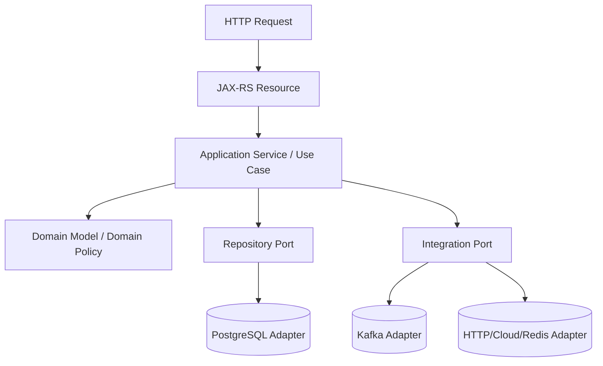

# Part 044 — Module Boundaries, Layering, and Hidden Global State

> Fokus part ini: memahami bagaimana service JAX-RS enterprise sebaiknya dibagi menjadi boundary yang jelas. Kita akan membahas resource-service-domain-repository-integration layering, dependency direction, DTO/domain/entity separation, hidden global state, static risk, mutable singleton, ThreadLocal leakage, service locator misuse, dan PR review untuk maintainability.

Sistem enterprise tidak rusak hanya karena bug algoritma.

Ia sering rusak karena boundary yang kabur.

Contoh boundary kabur:

```text
- JAX-RS resource langsung query database
- DTO API dipakai sebagai entity database
- mapper melakukan network call
- static utility membaca environment variable
- singleton menyimpan request-specific state
- ThreadLocal tidak dibersihkan
- feature flag dievaluasi di tempat acak
- transaction boundary tersebar di banyak layer
```

Senior warning:

```text
Architecture is not mainly about folders.
Architecture is about dependency direction, lifecycle ownership, state ownership, and failure boundaries.
```

---

## 1. Why Module Boundaries Matter

Module boundary membuat sistem lebih mudah:

```text
- dipahami
- dites
- diubah
- diobservasi
- diamankan
- direview
- dioperasikan
```

Tanpa boundary, perubahan kecil bisa memiliki blast radius besar.

Example symptom:

```text
Change one API response field
  -> breaks database mapping
  -> breaks Kafka event
  -> breaks UI client
  -> breaks integration test
```

This often means models are reused across boundaries.

---

## 2. A Practical Layering Model for JAX-RS Services

A pragmatic structure:

```text
Resource/API layer
  -> Application service / use case layer
      -> Domain layer
      -> Repository port
      -> Integration port
  -> Infrastructure adapters
      -> PostgreSQL/MyBatis/JDBC
      -> Kafka producer/consumer
      -> HTTP clients
      -> Redis
      -> Cloud SDK
```

Visual model:



Key idea:

```text
Outer layers know transport and infrastructure.
Inner layers know business meaning and invariants.
```

---

## 3. Resource Layer Boundary

JAX-RS resource should handle HTTP concerns.

It may do:

```text
- path/query/header/form extraction
- request DTO acceptance
- authentication context access
- basic API validation trigger
- call application service/use case
- map result to HTTP response
- map known errors via exception strategy
```

It should avoid:

```text
- direct SQL
- direct Kafka publishing
- complex domain decision
- manual transaction choreography
- hidden retry logic
- long-running blocking orchestration without explicit design
```

Example:

```java
@Path("/quotes")
@Consumes(MediaType.APPLICATION_JSON)
@Produces(MediaType.APPLICATION_JSON)
public class QuoteResource {
    private final CreateQuoteUseCase createQuote;

    public QuoteResource(CreateQuoteUseCase createQuote) {
        this.createQuote = createQuote;
    }

    @POST
    public Response create(CreateQuoteRequest request, @Context SecurityContext securityContext) {
        CreateQuoteCommand command = CreateQuoteCommand.from(request, securityContext);
        QuoteResult result = createQuote.execute(command);
        return Response.status(Response.Status.CREATED)
                .entity(QuoteResponse.from(result))
                .build();
    }
}
```

The resource maps HTTP to use case.
It should not become the use case.

---

## 4. Application Service / Use Case Boundary

Application service coordinates a business operation.

It may do:

```text
- transaction boundary orchestration
- call domain policy
- call repository port
- call integration port
- enforce workflow step
- produce domain/event intent
- apply idempotency policy
```

It should avoid:

```text
- JAX-RS annotations
- HTTP status codes
- servlet context access
- JSON serialization concerns
- database-specific SQL details
```

Example:

```java
public final class CreateQuoteUseCase {
    private final QuoteRepository quoteRepository;
    private final PricingPort pricingPort;
    private final QuoteEventPublisher eventPublisher;

    public QuoteResult execute(CreateQuoteCommand command) {
        Quote quote = Quote.createDraft(command);
        Price price = pricingPort.price(quote);
        quote.applyPrice(price);

        quoteRepository.save(quote);
        eventPublisher.publishQuoteCreated(quote);

        return QuoteResult.from(quote);
    }
}
```

This layer speaks in application terms, not HTTP transport terms.

---

## 5. Domain Layer Boundary

Domain layer owns business meaning.

In CPQ/order-like systems, domain concerns may include:

```text
- quote state transition
- quote validity
- product compatibility
- pricing invariant
- catalog effective date
- order submission precondition
- tenant-specific business rule boundary
```

But do not invent internal CSG domain architecture.
Treat these as examples of the kind of concerns an enterprise quote/order system may have.

Domain layer should avoid:

```text
- database connection
- JAX-RS annotations
- Kafka producer
- HTTP client
- cloud SDK
- environment variable lookup
```

Domain code should be testable without container/runtime.

---

## 6. Repository Boundary

Repository hides persistence details.

Good repository interface:

```java
public interface QuoteRepository {
    Optional<Quote> findById(QuoteId id);
    void save(Quote quote);
}
```

Infrastructure implementation can use JDBC/MyBatis/PostgreSQL.

```java
public final class MyBatisQuoteRepository implements QuoteRepository {
    private final QuoteMapper mapper;

    @Override
    public Optional<Quote> findById(QuoteId id) {
        return mapper.findById(id.value()).map(QuoteRowMapper::toDomain);
    }
}
```

Risky repository boundary:

```text
- returns database entity directly to resource
- exposes SQL details to application service
- performs HTTP calls
- publishes Kafka events implicitly
- starts hidden transaction
```

Repository should make persistence explicit, not magical.

---

## 7. Integration Adapter Boundary

External integrations include:

```text
- downstream HTTP service
- Kafka producer/consumer
- Redis
- cloud SDK
- file/object storage
- workflow engine
```

Adapter should isolate protocol details.

Example:

```java
public interface PricingPort {
    Price price(Quote quote);
}

public final class HttpPricingClient implements PricingPort {
    private final Client client;

    @Override
    public Price price(Quote quote) {
        // HTTP-specific code stays here
    }
}
```

Benefit:

```text
Application service does not care whether pricing comes from HTTP, local library, cache, or workflow task.
```

---

## 8. Dependency Direction

A healthy dependency direction:

```text
Resource -> Application -> Domain
Application -> Port interfaces
Infrastructure -> Port interfaces
```

Unhealthy dependency direction:

```text
Domain -> JAX-RS
Domain -> MyBatis
Domain -> Kafka
Domain -> Redis
Domain -> System.getenv
```

If domain imports infrastructure, it becomes hard to test and hard to change.

Check imports as architecture evidence.

```bash
grep -R "jakarta.ws.rs" src/main/java/com/example/domain
grep -R "org.apache.ibatis" src/main/java/com/example/domain
grep -R "org.apache.kafka" src/main/java/com/example/domain
```

If domain layer imports transport/infrastructure packages, investigate.

---

## 9. DTO vs Domain vs Entity

Do not collapse all models into one class.

Different model types have different reasons to change.

```text
API DTO changes because client contract changes.
Domain model changes because business rule changes.
Persistence entity/row changes because database schema changes.
Event DTO changes because event contract changes.
```

If one class is reused everywhere, any change becomes dangerous.

Bad pattern:

```java
public class Quote {
    @JsonProperty("quoteId")
    @Column(name = "quote_id")
    @NotNull
    private String quoteId;
}
```

This class mixes:

```text
- JSON serialization
- database mapping
- validation
- domain identity
```

Better separation:

```text
CreateQuoteRequest      -> API input
CreateQuoteCommand      -> application input
Quote                   -> domain model
QuoteRecord / QuoteRow  -> persistence representation
QuoteCreatedEvent       -> event contract
QuoteResponse           -> API output
```

This is more verbose, but safer.

Senior trade-off:

```text
For small/simple services, reuse can reduce boilerplate.
For enterprise systems with long-lived contracts, separation reduces blast radius.
```

---

## 10. Hidden Global State

Hidden global state is state that affects behavior but is not visible in method signatures or constructor dependencies.

Examples:

```text
- static mutable map
- static current tenant
- ThreadLocal user context
- System properties
- environment variable lookup inside business logic
- singleton cache with mutable values
- global service locator
- global ObjectMapper mutation
- clock accessed through Instant.now()
- random UUID generated in deep logic
- default timezone
- default locale
```

Hidden state makes behavior hard to reason about.

```text
Same input does not always produce same output.
```

---

## 11. Static Utility Risk

Static utility is not always bad.

Safe static utility:

```java
public final class MoneyFormat {
    public static String format(BigDecimal value, Currency currency) {
        return value.setScale(2, RoundingMode.HALF_UP) + " " + currency;
    }
}
```

Risky static utility:

```java
public final class TenantContextUtil {
    private static final ThreadLocal<String> CURRENT_TENANT = new ThreadLocal<>();

    public static String currentTenant() {
        return CURRENT_TENANT.get();
    }
}
```

This creates hidden dependency.

Any method can silently depend on tenant state.

Better:

```java
public record RequestContext(
        String correlationId,
        TenantId tenantId,
        UserId userId
) {}
```

Pass it explicitly where business behavior depends on it.

---

## 12. Mutable Singleton Risk

Singletons are common in DI containers.

Singleton is safe when it is stateless or internally thread-safe.

Safe:

```java
@Singleton
public final class QuoteMapper {
    public QuoteResponse toResponse(Quote quote) {
        return new QuoteResponse(...);
    }
}
```

Risky:

```java
@Singleton
public final class QuoteWorkflowState {
    private String currentQuoteId;

    public void setCurrentQuoteId(String id) {
        this.currentQuoteId = id;
    }
}
```

In a multi-threaded server, this leaks state between requests.

Rule:

```text
Singleton object must not hold request-specific mutable state.
```

---

## 13. ThreadLocal Risk

ThreadLocal can be useful for MDC/logging/security context.

But it is dangerous when:

```text
- not cleared after request
- used across executor boundary
- used in async task
- reused by container thread pool
- treated as domain dependency
```

Failure mode:

```text
request A sets tenantId = TENANT_A
thread returns to pool
request B handled by same thread
tenantId still TENANT_A
request B reads wrong tenant context
```

Mitigation:

```text
- set context at boundary
- clear context in finally block
- propagate context explicitly to executors
- avoid using ThreadLocal for domain decisions
```

---

## 14. Service Locator Misuse

Jersey/HK2 may involve service locator internally.

But application code should avoid using service locator as hidden dependency lookup.

Risky:

```java
public class QuoteService {
    public QuoteRepository repository() {
        return GlobalServiceLocator.get(QuoteRepository.class);
    }
}
```

Problems:

```text
- dependencies invisible
- tests harder
- startup failure delayed
- circular dependency hidden
- runtime behavior harder to analyze
```

Better:

```java
public class QuoteService {
    private final QuoteRepository repository;

    public QuoteService(QuoteRepository repository) {
        this.repository = repository;
    }
}
```

Constructor injection makes dependency graph visible.

---

## 15. Configuration Access Boundary

Configuration should be loaded and validated at the edge, then injected as typed config.

Risky:

```java
public BigDecimal calculatePrice(...) {
    String roundingMode = System.getenv("ROUNDING_MODE");
    ...
}
```

Better:

```java
public record PricingConfig(
        RoundingMode roundingMode,
        int scale,
        boolean enableNewTaxRule
) {}
```

Then inject:

```java
public final class PricingPolicy {
    private final PricingConfig config;

    public PricingPolicy(PricingConfig config) {
        this.config = config;
    }
}
```

This supports:

```text
- validation
- testing
- documentation
- config fingerprinting
- safe defaults
```

---

## 16. Feature Flag Boundary

Feature flag evaluation should not be scattered randomly.

Risky:

```text
resource checks flag
service checks same flag differently
repository checks another flag
mapper checks hidden flag
```

Better:

```text
- evaluate flag at clear decision boundary
- pass decision as explicit policy/input
- log/audit important decisions
- keep default safe
```

Example:

```java
public QuoteResult execute(CreateQuoteCommand command) {
    PricingMode mode = flagEvaluator.pricingMode(command.tenantId());
    return pricingWorkflow.createQuote(command, mode);
}
```

The decision is visible.

---

## 17. Transaction Boundary

Transaction boundary must be clear.

Possible locations:

```text
- application service method
- repository method
- framework annotation/interceptor
- database function/procedure
```

Hidden transaction boundary causes bugs.

Risk:

```text
application service believes save + publish are atomic
repository actually commits early
Kafka publish fails
DB state exists without event
```

Better:

```text
- define transaction owner
- use outbox for DB + event consistency
- avoid hidden commits inside repository
- document propagation rule
```

---

## 18. Package Structure Example

One possible structure:

```text
com.company.quote
  api
    QuoteResource.java
    request
    response
    mapper
  application
    CreateQuoteUseCase.java
    SubmitQuoteUseCase.java
    command
    result
  domain
    Quote.java
    QuoteStatus.java
    PricingPolicy.java
    TenantRule.java
  port
    QuoteRepository.java
    PricingPort.java
    EventPublisher.java
  infrastructure
    db
      mybatis
      jdbc
    kafka
    http
    redis
    cloud
  config
    QuoteServiceConfig.java
  observability
    LoggingFilter.java
    TraceConfig.java
```

This is not the only valid structure.

The real test is:

```text
Can dependencies be understood and controlled?
```

---

## 19. Testing Seams

Good boundaries create good test seams.

Resource test:

```text
HTTP request -> resource -> mocked use case -> HTTP response
```

Application service test:

```text
command -> use case -> fake repository/integration port -> result/state
```

Domain test:

```text
domain object/policy -> pure business behavior
```

Repository integration test:

```text
repository -> real PostgreSQL/Testcontainers -> SQL mapping
```

Kafka adapter test:

```text
publisher/consumer -> test Kafka -> event contract
```

If every test needs the full container, boundaries are probably unclear.

---

## 20. Observability Boundary

Observability should be consistent, not scattered.

Resource/filter layer:

```text
- request log
- status code
- route template
- latency
- correlation ID
```

Application layer:

```text
- use case started/completed
- business outcome
- important decision
```

Infrastructure layer:

```text
- DB query metrics
- downstream call latency
- Kafka publish/consume result
- retry/circuit breaker events
```

Avoid logging sensitive data deep in the domain layer.

---

## 21. Failure Modes from Poor Boundaries

### 21.1 API Model Reused as DB Model

Symptoms:

```text
- API field rename breaks persistence
- DB column addition appears in response unintentionally
- serialization annotation changes query mapping
```

Fix:

```text
Separate API DTO and persistence row/entity.
```

### 21.2 Domain Imports Infrastructure

Symptoms:

```text
- domain tests require database or Kafka
- business logic hard to run locally
- infrastructure outage affects pure policy test
```

Fix:

```text
Introduce ports/interfaces and adapters.
```

### 21.3 Static Tenant Context Leak

Symptoms:

```text
- cross-tenant data leak
- intermittent authorization failure
- logs show wrong tenant
```

Fix:

```text
Explicit request context, clear ThreadLocal, propagation wrapper, negative tenant tests.
```

### 21.4 Mutable Singleton Race

Symptoms:

```text
- data from request A appears in request B
- concurrency-only failures
- flaky integration tests
```

Fix:

```text
Make singleton stateless, immutable, or thread-safe. Move request state to request-scoped object.
```

### 21.5 Hidden Config Read

Symptoms:

```text
- test passes locally but fails in CI
- pod behavior differs by env
- runtime change invisible in dependency graph
```

Fix:

```text
Typed config loaded once, validated, injected, and logged as safe fingerprint.
```

### 21.6 Mapper with Side Effects

Symptoms:

```text
- mapping unexpectedly calls database/service
- response building becomes slow
- serialization triggers external call
```

Fix:

```text
Keep mappers pure. Fetch data explicitly before mapping.
```

---

## 22. Internal Verification Checklist

Verify architecture from code evidence.

```text
Package/layering:
- What are the top-level modules/packages?
- Is there a clear resource/application/domain/infrastructure boundary?
- Do domain packages import JAX-RS, MyBatis, Kafka, Redis, or cloud SDK?
- Are use cases explicit or is logic mostly inside resources/repositories?

Model separation:
- Are API DTOs separate from persistence entities/rows?
- Are event DTOs separate from API response DTOs?
- Is MapStruct or manual mapping used?
- Are serialization annotations leaking into domain models?

Dependency injection:
- Is constructor injection preferred?
- Are dependencies visible in constructors?
- Is service locator used directly in application code?
- Are singleton/request scopes documented?

State:
- Are there static mutable fields?
- Are ThreadLocals used?
- Are ThreadLocals cleared?
- Are singleton beans stateless/thread-safe?
- Are caches tenant-aware?

Configuration:
- Is config accessed through typed config objects?
- Are environment variables read deep inside business logic?
- Is config validated at startup?
- Are feature flags evaluated at clear boundaries?

Transactions:
- Where is transaction boundary defined?
- Do repositories commit internally?
- Is DB + event consistency handled by outbox or another pattern?

Testing:
- Can domain/application logic be tested without container?
- Are integration tests targeted to infrastructure adapters?
- Are resource tests separated from use case tests?
```

---

## 23. PR Review Checklist

When reviewing code structure, ask:

```text
Boundary:
- Is this logic in the right layer?
- Does resource code contain business orchestration?
- Does domain code depend on infrastructure?
- Does mapper perform side effects?

Dependency:
- Are dependencies explicit?
- Is constructor injection used?
- Is service locator/global lookup avoided?
- Are circular dependencies introduced?

State:
- Is any mutable state shared across requests?
- Is singleton state safe?
- Is ThreadLocal usage cleared and propagated correctly?
- Is tenant/user/request context explicit?

Models:
- Are API/domain/entity/event models separated where needed?
- Does this change accidentally break contract compatibility?
- Are mapping tests needed?

Config/flags:
- Is config typed and validated?
- Are feature flags evaluated in a controlled place?
- Are defaults safe?

Tests:
- Is there a unit test at the right layer?
- Is there an integration test for infrastructure behavior?
- Are negative and concurrency cases covered when relevant?
```

---

## 24. Senior Engineer Heuristics

Use these rules:

```text
A dependency not visible in constructor or method input is probably hidden coupling.
```

```text
A model reused across API, DB, domain, and event layers is a future compatibility trap.
```

```text
Static mutable state in a server should be assumed dangerous until proven otherwise.
```

```text
ThreadLocal is a boundary tool, not a business model.
```

```text
Mappers should not perform I/O.
```

```text
Repositories should not secretly publish events.
```

```text
A package structure is good only if dependency direction and lifecycle ownership are clear.
```

---

## 25. Practical Summary

Good boundaries make production systems understandable.

In a JAX-RS enterprise backend, you want:

```text
- resource layer for HTTP concerns
- application layer for use case orchestration
- domain layer for business invariants
- repository/integration ports for external boundaries
- infrastructure adapters for protocols and tools
- explicit dependency injection
- typed configuration
- controlled feature flag evaluation
- minimal hidden global state
- clear transaction ownership
- targeted tests per layer
```

The senior-level review question is:

```text
Can a future engineer change one concern without accidentally changing transport, persistence, events, tenant behavior, and runtime state at the same time?
```

If the answer is no, the boundary is too weak.
