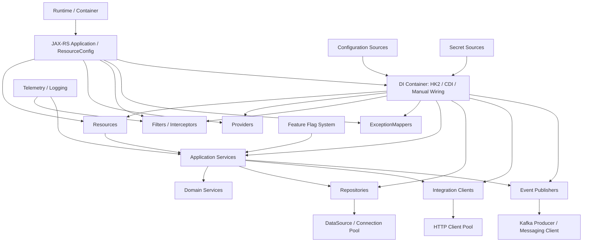

# Part 045 — Application Composition Review Checklist

> Fokus part ini: menyatukan beberapa part sebelumnya menjadi checklist review yang bisa dipakai saat membaca PR, onboarding codebase, atau mengevaluasi service JAX-RS enterprise. Ini bukan checklist kosmetik. Ini checklist untuk menemukan bug lifecycle, hidden dependency, unsafe scope, config drift, weak shutdown, missing observability, dan deployment-risk sebelum masuk production.

Application composition adalah cara sebuah service disusun saat runtime.

Bukan hanya struktur folder.

Bukan hanya dependency injection.

Bukan hanya `ResourceConfig`.

Application composition adalah jawaban atas pertanyaan:

```text
Ketika service start, object apa dibuat?
Siapa membuatnya?
Scope-nya apa?
Config dari mana?
Secret dari mana?
Lifecycle-nya kapan dimulai dan selesai?
Thread mana yang menjalankan logic-nya?
Context apa yang ikut terbawa?
Bagaimana object itu di-test?
Bagaimana object itu dimatikan saat shutdown?
Apa failure mode kalau dependency-nya tidak tersedia?
```

Senior engineer tidak cukup bertanya:

```text
Apakah code ini compile?
Apakah endpoint ini return 200?
```

Senior engineer harus bertanya:

```text
Apakah service ini tersusun dengan lifecycle yang benar?
Apakah wiring-nya eksplisit?
Apakah failure-nya bisa diobservasi?
Apakah rollback-nya aman?
Apakah perubahan ini memperbesar coupling tersembunyi?
```

---

## 1. Why Application Composition Review Exists

Bug application composition biasanya tidak muncul di unit test sederhana.

Ia muncul saat:

```text
- service baru start di environment tertentu
- config berbeda antara local/staging/prod
- injection gagal karena binding tidak terdaftar
- provider global berubah dan memengaruhi semua endpoint
- singleton menyimpan mutable/request-specific state
- thread pool tidak membawa MDC/security context
- shutdown tidak menutup HTTP client/Kafka producer/DB pool
- secret rotation tidak diambil ulang
- feature flag default salah
- tenant resolver tidak tersedia di background thread
```

Ini jenis bug yang mahal karena gejalanya sering terlihat seperti hal lain:

```text
- 500 random
- timeout sporadis
- memory leak
- connection leak
- missing trace ID
- audit log kosong
- tenant data leakage
- startup failure hanya di production-like environment
```

Application composition review bertujuan menemukan risiko itu sebelum deploy.

---

## 2. Composition Mental Model

Sebuah JAX-RS service enterprise biasanya memiliki komposisi seperti ini:



Review harus membaca graph ini dari atas ke bawah.

Jangan hanya membaca resource method.

Resource method hanyalah titik masuk.

Yang lebih penting adalah object graph yang terbentuk di belakangnya.

---

## 3. Review Order

Urutan review yang praktis:

```text
1. Bootstrap and runtime entrypoint
2. Resource/provider/filter/mapper registration
3. Dependency injection and object lifecycle
4. Configuration and secret resolution
5. Tenant, feature flag, and environment-specific behavior
6. Threading, executor, and context propagation
7. External resource ownership
8. Shutdown and cleanup
9. Error handling and observability wiring
10. Security and audit wiring
11. Test seams and local workflow
12. Rollout, rollback, and compatibility implications
```

Rule of thumb:

```text
Review composition from startup to shutdown, not only from request to response.
```

---

## 4. Bootstrap and Runtime Entrypoint Checklist

Cari titik start aplikasi.

Kemungkinan bentuk:

```text
- web.xml
- ServletContainerInitializer
- subclass Application
- Jersey ResourceConfig
- embedded Grizzly main class
- container-provided GlassFish deployment
- Tomcat/Jetty WAR deployment
- custom launcher
- Spring/Dropwizard/MicroProfile wrapper jika ada
```

Checklist:

```text
[ ] Runtime entrypoint jelas.
[ ] JAX-RS application class jelas.
[ ] Base path jelas.
[ ] Package scanning atau explicit registration dipahami.
[ ] Tidak ada duplicate registration yang silent.
[ ] Startup logs menunjukkan resource/provider aktif.
[ ] Startup failure fail-fast, bukan lazy failure saat request pertama.
[ ] Environment-specific bootstrap tidak berbeda secara liar.
```

Senior review question:

```text
Bisakah engineer baru menjawab: “apa yang membuat endpoint ini aktif di runtime?”
```

Kalau tidak bisa, composition terlalu implisit.

---

## 5. Resource, Provider, Filter, and Mapper Registration Checklist

Dalam JAX-RS/Jersey, banyak behavior penting datang dari extension point.

```text
- Resource class
- ContainerRequestFilter
- ContainerResponseFilter
- ReaderInterceptor
- WriterInterceptor
- MessageBodyReader
- MessageBodyWriter
- ExceptionMapper
- Feature
- Binder
```

Checklist:

```text
[ ] Semua global provider/filter/interceptor diketahui.
[ ] Auth filter order jelas.
[ ] Logging filter tidak membaca body besar secara berbahaya.
[ ] ExceptionMapper precedence jelas.
[ ] MessageBodyReader/Writer tidak overlap media type secara ambigu.
[ ] Provider yang security-sensitive tidak hanya bergantung pada package scanning tersembunyi.
[ ] Registration eksplisit untuk behavior kritikal.
[ ] Startup test membuktikan provider penting terdaftar.
```

Anti-pattern:

```java
// Anti-pattern: critical behavior hanya bergantung pada package scanning
@Provider
public class SecurityFilter implements ContainerRequestFilter {
    // jika package scanning berubah, security bisa hilang
}
```

Lebih aman untuk behavior kritikal:

```java
public class ApiApplication extends ResourceConfig {
    public ApiApplication() {
        register(SecurityFilter.class);
        register(ApiExceptionMapper.class);
        register(CorrelationIdFilter.class);
    }
}
```

Catatan:

```text
Ini bukan berarti package scanning selalu buruk.
Yang buruk adalah behavior security/observability kritikal yang tidak dapat diverifikasi secara eksplisit.
```

---

## 6. Dependency Injection Checklist

DI review bukan sekadar melihat `@Inject`.

Pertanyaan utama:

```text
Siapa owner object ini?
Scope-nya apa?
State-nya apa?
Apakah object ini thread-safe?
Apakah dependency-nya required atau optional?
Bagaimana object ini diganti di test?
```

Checklist:

```text
[ ] Constructor injection diprioritaskan untuk dependency mandatory.
[ ] Field injection tidak menyembunyikan dependency penting.
[ ] Scope eksplisit untuk singleton/request/application/session jika ada.
[ ] Tidak ada mutable request-specific state di singleton.
[ ] Tidak ada circular dependency.
[ ] Tidak ada service locator call tersebar di business logic.
[ ] Factory/provider digunakan hanya saat lifecycle memang dinamis.
[ ] Binding test dapat mengganti dependency eksternal.
[ ] Injection failure fail-fast saat startup bila memungkinkan.
```

Red flag:

```java
public class QuoteResource {
    @Inject
    private QuoteService quoteService;

    @Inject
    private TenantContext tenantContext;

    @Inject
    private FeatureFlagClient featureFlagClient;
}
```

Bukan karena field injection selalu salah.

Masalahnya: dependency penting tersembunyi dari constructor dan sulit dibaca saat review.

Lebih eksplisit:

```java
public class QuoteResource {
    private final QuoteService quoteService;
    private final TenantContext tenantContext;
    private final FeatureFlagClient featureFlagClient;

    @Inject
    public QuoteResource(
        QuoteService quoteService,
        TenantContext tenantContext,
        FeatureFlagClient featureFlagClient
    ) {
        this.quoteService = quoteService;
        this.tenantContext = tenantContext;
        this.featureFlagClient = featureFlagClient;
    }
}
```

---

## 7. Scope and Lifecycle Checklist

Scope bug sering sulit dilacak.

Contoh:

```text
- request-scoped object diinjeksi ke singleton tanpa proxy yang benar
- singleton menyimpan tenant ID terakhir
- provider global menyimpan user ID di field
- object mahal dibuat per request
- object yang harus ditutup tidak pernah ditutup
```

Checklist:

```text
[ ] Resource lifecycle diketahui: per-request atau singleton.
[ ] Provider lifecycle diketahui.
[ ] Singleton object thread-safe.
[ ] Request-scoped dependency tidak bocor ke background thread.
[ ] Expensive object tidak dibuat per request tanpa alasan.
[ ] Resource closeable memiliki shutdown hook.
[ ] Object lifecycle selaras dengan underlying resource lifecycle.
```

Senior heuristic:

```text
Mutable state + singleton + request data = incident candidate.
```

---

## 8. Configuration Composition Checklist

Konfigurasi adalah bagian dari composition.

Config menentukan object graph.

Contoh:

```text
- timeout outbound client
- DB pool size
- Kafka topic name
- feature flag default
- tenant routing mode
- auth issuer/audience
- serializer settings
- cache TTL
```

Checklist:

```text
[ ] Config source jelas.
[ ] Precedence jelas: default < file < env < secret store < runtime override.
[ ] Required config divalidasi saat startup.
[ ] Invalid config membuat service fail-fast.
[ ] Default aman untuk production.
[ ] Config sensitive tidak masuk log.
[ ] Config drift antar environment bisa dideteksi.
[ ] Runtime reload tidak menyebabkan partial update berbahaya.
[ ] Per-tenant config punya fallback aman.
```

Anti-pattern:

```java
int timeoutMs = Integer.parseInt(System.getenv("DOWNSTREAM_TIMEOUT"));
```

Masalah:

```text
- tidak ada default eksplisit
- tidak ada validation
- tidak ada config inventory
- sulit di-test
- sulit dilacak ownership-nya
```

Lebih baik:

```java
public record DownstreamClientConfig(
    Duration connectTimeout,
    Duration readTimeout,
    int maxConnections
) {
    public DownstreamClientConfig {
        if (connectTimeout.isNegative() || connectTimeout.isZero()) {
            throw new IllegalArgumentException("connectTimeout must be positive");
        }
        if (readTimeout.isNegative() || readTimeout.isZero()) {
            throw new IllegalArgumentException("readTimeout must be positive");
        }
        if (maxConnections <= 0) {
            throw new IllegalArgumentException("maxConnections must be positive");
        }
    }
}
```

---

## 9. Secret and Credential Checklist

Secret adalah runtime dependency.

Treat it like a dependency with lifecycle.

Checklist:

```text
[ ] Secret tidak ada di source code.
[ ] Secret tidak ada di plain config file yang masuk repo.
[ ] Secret tidak tercetak di startup log.
[ ] Secret source jelas: Kubernetes Secret, external secret, cloud secret manager, vault, etc.
[ ] Rotation behavior dipahami.
[ ] Client dapat recover dari rotated credential jika platform mendukung.
[ ] Secret access diaudit.
[ ] Least privilege diterapkan.
[ ] Local development punya mekanisme aman tanpa copy prod secret.
```

PR review question:

```text
Kalau secret ini dirotasi saat service berjalan, apa yang terjadi?
```

Jawaban yang buruk:

```text
Tidak tahu, seharusnya aman.
```

Jawaban yang lebih baik:

```text
Secret dibaca saat startup saja, jadi rotation butuh rolling restart. Ini sesuai runbook X.
```

Atau:

```text
Client mengambil credential dari provider yang support refresh. Ada test/integration check untuk expired token.
```

---

## 10. Tenant Composition Checklist

Di enterprise CPQ/order management, tenant sering bukan detail kecil.

Tenant bisa memengaruhi:

```text
- routing
- authorization
- product catalog
- pricing rule
- tax behavior
- data partition
- feature flag
- audit log
- reporting
- external integration endpoint
```

Checklist:

```text
[ ] Tenant resolution dilakukan di boundary yang jelas.
[ ] Tenant ID divalidasi dan tidak hanya dipercaya dari header mentah.
[ ] Tenant context dipropagasi ke service/repository/integration layer.
[ ] Tenant context tidak disimpan di mutable singleton.
[ ] Tenant-aware logging ada, tetapi tidak melanggar cardinality/PII policy.
[ ] Tenant-specific config punya fallback aman.
[ ] Tenant-specific catalog/pricing tidak bercampur.
[ ] Background job memiliki tenant scope eksplisit.
[ ] Test negative cross-tenant tersedia untuk operasi sensitif.
```

Failure mode serius:

```text
Tenant A melihat quote/order/customer/product catalog Tenant B.
```

Ini bukan bug biasa.

Ini security/compliance incident.

---

## 11. Feature Flag and Rollout Checklist

Feature flag adalah bagian composition karena menentukan path logic runtime.

Checklist:

```text
[ ] Flag punya owner.
[ ] Flag punya default aman.
[ ] Flag bisa dimatikan cepat jika risk tinggi.
[ ] Flag evaluation tidak tersebar tanpa abstraction.
[ ] Flag state tercatat di log/trace untuk debugging penting.
[ ] Flag tidak membuat API contract berubah secara tidak compatible.
[ ] Flag tidak membuat DB schema dependency yang belum tersedia.
[ ] Stale flag punya cleanup task.
[ ] Tenant-specific enablement diuji.
```

Bad pattern:

```java
if (featureFlags.isEnabled("new-pricing")) {
    return newPricingEngine.price(request);
}
return oldPricingEngine.price(request);
```

Ini kelihatan normal.

Yang harus direview:

```text
- apakah old/new engine punya output rounding yang sama?
- apakah audit log mencatat engine mana dipakai?
- apakah fallback bisa terjadi bila new engine timeout?
- apakah schema event berubah?
- apakah customer support bisa mengetahui path yang dipakai?
```

---

## 12. Threading, Executor, and Context Checklist

Threading composition menentukan apakah context hilang.

Checklist:

```text
[ ] Executor yang dipakai jelas dan bounded.
[ ] Tidak membuat thread pool ad hoc di business logic.
[ ] Queue size jelas.
[ ] Rejection policy jelas.
[ ] MDC/correlation context dipropagasi.
[ ] Security context dipropagasi hanya jika aman.
[ ] Tenant context dipropagasi eksplisit.
[ ] ThreadLocal dibersihkan.
[ ] Background task tidak memakai request-scoped object setelah request selesai.
```

Red flag:

```java
CompletableFuture.runAsync(() -> service.doWork(request));
```

Masalah:

```text
- pakai ForkJoinPool common pool
- context hilang
- cancellation tidak jelas
- error bisa tidak terobservasi
- request object bisa dipakai setelah lifecycle-nya selesai
```

Lebih aman:

```java
CompletionStage<Result> result = contextAwareExecutor.submit(
    RequestContext.capture(),
    () -> service.doWork(command)
);
```

Catatan:

```text
Nama API ini ilustratif. Verifikasi pattern internal yang dipakai di codebase.
```

---

## 13. External Resource Ownership Checklist

Object yang memiliki koneksi eksternal harus jelas owner-nya.

Contoh:

```text
- DataSource / connection pool
- HTTP client
- Kafka producer
- Kafka consumer
- Redis client
- cloud SDK client
- scheduler
- executor
- metrics exporter
```

Checklist:

```text
[ ] Object mahal dibuat sekali, bukan per request.
[ ] Pool config eksplisit.
[ ] Timeout config eksplisit.
[ ] Lifecycle close/shutdown jelas.
[ ] Health/readiness check mempertimbangkan dependency kritikal.
[ ] Metrics tersedia untuk pool/queue/latency/error.
[ ] Resource leak bisa dideteksi.
[ ] Test tidak memakai production endpoint/credential.
```

Common bug:

```java
public Response getQuote(String id) {
    Client client = ClientBuilder.newClient();
    Response response = client.target(url).request().get();
    return Response.ok(response.readEntity(String.class)).build();
}
```

Masalah:

```text
- client dibuat per request
- connection pool tidak dimanfaatkan
- response lifecycle rawan leak
- timeout mungkin default/tidak jelas
```

---

## 14. Shutdown and Graceful Termination Checklist

Production service tidak hanya harus bisa start.

Ia harus bisa stop dengan benar.

Checklist:

```text
[ ] HTTP server berhenti menerima request baru.
[ ] In-flight request diberi waktu selesai.
[ ] Kafka consumer berhenti poll dan commit dengan aman.
[ ] Kafka producer flush/close sesuai timeout.
[ ] DB pool ditutup.
[ ] HTTP client pool ditutup.
[ ] Executor shutdown graceful lalu forced jika perlu.
[ ] Background job diberi cancellation signal.
[ ] Metrics/log exporter flush jika diperlukan.
[ ] Kubernetes terminationGracePeriod cukup untuk cleanup.
```

Failure mode:

```text
- duplicate event karena shutdown saat commit belum selesai
- lost audit log karena exporter belum flush
- stuck pod karena executor non-daemon tidak shutdown
- 502 spike karena pod menerima traffic saat belum ready
```

---

## 15. Error Handling Composition Checklist

ExceptionMapper global bisa menjadi blessing atau disaster.

Checklist:

```text
[ ] Domain exception mapping jelas.
[ ] Validation exception mapping jelas.
[ ] Auth exception mapping jelas.
[ ] Technical exception mapping tidak membocorkan stack trace.
[ ] Error response punya stable code.
[ ] Retryable vs non-retryable error dibedakan.
[ ] Logging level sesuai severity.
[ ] Correlation ID masuk error response atau response header sesuai policy.
[ ] ExceptionMapper tidak menelan error yang harus alert.
```

Risk:

```java
@Provider
public class CatchAllExceptionMapper implements ExceptionMapper<Throwable> {
    public Response toResponse(Throwable ex) {
        return Response.status(500).entity("error").build();
    }
}
```

Masalah:

```text
- semua error terlihat sama
- operator kehilangan signal
- client tidak tahu retry/non-retry
- security incident bisa tersamar sebagai 500 biasa
```

---

## 16. Observability Composition Checklist

Observability bukan fitur tambahan.

Ia harus masuk composition sejak awal.

Checklist:

```text
[ ] Correlation ID filter aktif untuk semua request.
[ ] Request log tidak membocorkan PII/secret.
[ ] Error log memiliki endpoint, method, status, error code, correlation ID.
[ ] Metrics punya latency histogram per endpoint dengan cardinality terkendali.
[ ] Tracing span dibuat untuk inbound HTTP.
[ ] Downstream HTTP/DB/Kafka/Redis call terinstrumentasi.
[ ] Context propagation lintas executor/Kafka jelas.
[ ] Audit log terpisah dari application log jika dibutuhkan.
[ ] Dashboard dan alert merefleksikan path kritikal.
```

Review question:

```text
Jika endpoint ini lambat di production, signal apa yang akan membuktikan bottleneck-nya?
```

Kalau jawabannya “lihat log manual”, observability belum cukup.

---

## 17. Security Composition Checklist

Security sering tersebar di filter, annotation, service method, repository, dan gateway.

Checklist:

```text
[ ] Authentication terjadi di boundary yang jelas.
[ ] Authorization tidak hanya bergantung pada UI/gateway.
[ ] Object-level authorization ada untuk resource sensitif.
[ ] Tenant boundary diterapkan di semua data access path.
[ ] Secret tidak masuk log/error response.
[ ] Audit trail tersedia untuk operasi penting.
[ ] Token issuer/audience/expiry/clock skew divalidasi.
[ ] Service-to-service identity jelas.
[ ] Default deny untuk endpoint baru.
[ ] Negative security tests tersedia.
```

Anti-pattern:

```text
Endpoint internal tidak butuh auth karena hanya dipanggil service lain.
```

Senior response:

```text
Internal network is not a security model. Verify service identity, network policy, token audience, and least privilege.
```

---

## 18. Test Seam Checklist

Composition yang baik mudah dites.

Checklist:

```text
[ ] Dependency eksternal bisa diganti fake/test container.
[ ] Resource dapat dites tanpa full production runtime jika memungkinkan.
[ ] Provider/filter/mapper kritikal punya test.
[ ] Config validation punya test.
[ ] Tenant/feature flag path punya test.
[ ] Startup composition punya smoke test.
[ ] Integration test membuktikan wiring utama.
[ ] Test tidak bergantung pada ordering global yang rapuh.
```

Useful test categories:

```text
- unit test for pure domain/application service
- resource test for request/response/error shape
- provider/filter test for cross-cutting behavior
- startup smoke test for registration/injection/config
- integration test with PostgreSQL/Kafka/Redis/testcontainers
- contract test for API/event compatibility
```

---

## 19. Release and Rollback Composition Checklist

Composition changes dapat membuat rollback sulit.

Checklist:

```text
[ ] Perubahan API backward-compatible.
[ ] Perubahan DB mengikuti expand-contract.
[ ] Perubahan event schema compatible.
[ ] Feature flag default aman.
[ ] New dependency punya timeout/circuit breaker.
[ ] New config punya safe default dan validation.
[ ] Rollback tidak menyebabkan code lama membaca schema/event baru yang incompatible.
[ ] Deployment strategy jelas: rolling/canary/blue-green.
[ ] Observability signal cukup untuk decide continue/rollback.
```

Composition PR yang berisiko:

```text
- menambah provider/filter global
- mengganti ObjectMapper global
- mengganti ExceptionMapper catch-all
- mengganti auth filter order
- menambah async executor
- menambah cache global
- mengubah config precedence
- mengubah transaction boundary
- menambah feature flag pada path core
```

---

## 20. Internal Verification Checklist for CSG-like Enterprise Codebase

Karena detail internal tidak boleh diasumsikan, verifikasi dari evidence:

```text
Runtime and bootstrap
[ ] Runtime aktual: Jersey/GlassFish/Grizzly/Tomcat/Jetty/other.
[ ] Entrypoint aplikasi.
[ ] ResourceConfig/Application class.
[ ] Package scanning vs explicit registration.

DI and lifecycle
[ ] DI container: HK2/CDI/manual/other.
[ ] Scope annotation yang digunakan.
[ ] Singleton/provider lifecycle.
[ ] Shutdown hook atau lifecycle manager.

Configuration
[ ] Config source dan precedence.
[ ] Environment/profile model.
[ ] Tenant-specific config model.
[ ] Feature flag system.
[ ] Secret source dan rotation policy.

Cross-cutting
[ ] Auth filter.
[ ] Authorization layer.
[ ] ExceptionMapper hierarchy.
[ ] Logging/correlation filter.
[ ] OpenTelemetry/tracing integration.
[ ] Audit logging pattern.

External resources
[ ] DataSource/connection pool owner.
[ ] HTTP client owner.
[ ] Kafka producer/consumer owner.
[ ] Redis/cloud SDK client owner.
[ ] Executor/thread pool owner.

Testing and operations
[ ] Startup smoke test.
[ ] Integration test pattern.
[ ] Local development setup.
[ ] Runbook/shutdown behavior.
[ ] Deployment/rollback process.
```

---

## 21. PR Review Template

Gunakan template ini untuk PR yang mengubah composition:

```markdown
## Composition Review

### Bootstrap / registration
- [ ] Resource/provider/filter/mapper registration jelas
- [ ] Tidak bergantung pada scanning tersembunyi untuk behavior kritikal

### Dependency and lifecycle
- [ ] Dependency mandatory eksplisit
- [ ] Scope benar
- [ ] Tidak ada mutable request state di singleton
- [ ] External resource punya owner dan close lifecycle

### Configuration and secret
- [ ] Config source dan precedence jelas
- [ ] Required config divalidasi
- [ ] Secret tidak masuk code/log/error
- [ ] Default aman untuk production

### Context and threading
- [ ] Executor bounded
- [ ] MDC/trace/tenant/security context propagation jelas
- [ ] Cancellation/shutdown behavior jelas

### Observability and security
- [ ] Error/log/metric/trace cukup untuk debug
- [ ] Auth/authz/tenant boundary tidak dilemahkan
- [ ] Audit requirement dipenuhi

### Rollout and rollback
- [ ] Backward compatible
- [ ] Feature flag/kill switch jika risk tinggi
- [ ] Rollback/roll-forward aman
```

---

## 22. Common Composition Smells

Smell list:

```text
- “It works locally” tetapi tidak ada startup smoke test.
- Object dibuat dengan `new` di banyak tempat padahal punya config/secret/pool.
- `System.getenv()` tersebar di business logic.
- `ServiceLocator.getService()` dipanggil dari domain logic.
- Global ObjectMapper diubah tanpa contract test.
- Catch-all exception mapper menelan semua error.
- Static mutable cache tanpa invalidation.
- ThreadLocal tidak dibersihkan.
- Executor dibuat per request.
- Kafka producer dibuat per publish.
- HTTP client dibuat per request.
- Feature flag tanpa owner/cleanup.
- Tenant ID hanya string biasa yang mudah hilang.
- Startup berhasil walau config required kosong.
```

---

## 23. Senior Mental Model

Application composition review mencari tiga hal:

```text
1. Hidden coupling
2. Lifecycle mismatch
3. Unobservable failure
```

Kalau tiga hal itu terkendali, service biasanya lebih mudah dioperasikan.

Kalau tidak, service mungkin terlihat rapi di code review kecil tetapi rapuh di production.

Senior conclusion:

```text
Good application composition makes the runtime obvious.
Bad application composition makes production behavior surprising.
```

---

## 24. Final Cheat Sheet

```text
Review startup:
- entrypoint
- ResourceConfig/Application
- provider/filter/mapper registration
- fail-fast config validation

Review dependency graph:
- constructor injection
- scope
- state ownership
- external resource owner

Review runtime behavior:
- thread pool
- context propagation
- timeout/cancellation
- graceful shutdown

Review cross-cutting behavior:
- auth
- authorization
- tenant isolation
- exception mapping
- logging/tracing/metrics/audit

Review production safety:
- config/secret
- feature flag
- rollout/rollback
- compatibility
- tests
```

If you can explain the object graph, lifecycle graph, and failure graph, you understand the service.

If you cannot, the service is still partly a black box.
