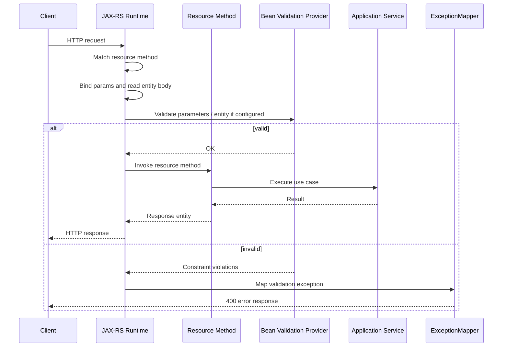

# Part 046 — Bean Validation and Hibernate Validator

> Fokus part ini: memahami Bean Validation sebagai boundary validation untuk request DTO dan parameter API JAX-RS. Kita akan membahas Jakarta Bean Validation, Hibernate Validator sebagai implementation, annotation constraint, nested validation, collection validation, validation groups, null semantics, error mapping, failure mode, dan PR review.

Validation adalah pagar pertama antara input eksternal dan sistem internal.

Di JAX-RS service, input datang dari:

```text
- path parameter
- query parameter
- header
- cookie
- form field
- JSON body
- XML body
- multipart metadata
```

Validation memastikan input memenuhi kontrak minimum sebelum masuk ke business logic.

Tapi senior engineer harus membedakan dua hal:

```text
API validation != domain validation
```

API validation menjawab:

```text
Apakah request ini valid sebagai request HTTP/API?
```

Domain validation menjawab:

```text
Apakah operasi ini valid terhadap business invariant dan state saat ini?
```

Contoh:

```text
API validation:
- quoteId tidak null
- quantity >= 1
- currency format ISO-like
- effectiveDate valid ISO date
- customerId panjangnya masuk akal

Domain validation:
- quote masih editable
- product tersedia untuk tenant ini
- price list berlaku pada effective date
- discount tidak melebihi policy
- order transition allowed dari state saat ini
```

Bean Validation sangat cocok untuk yang pertama.

Ia bisa membantu yang kedua, tapi jangan memaksa semua domain rule masuk annotation.

---

## 1. Standard vs Implementation

Pisahkan konsep:

```text
Jakarta Bean Validation
  Specification/API standar.
  Package modern: jakarta.validation.*

Hibernate Validator
  Salah satu implementation paling umum untuk Bean Validation.
  Menyediakan engine validasi dan beberapa extension.

JAX-RS integration
  Runtime JAX-RS/Jersey/container dapat mengintegrasikan Bean Validation
  untuk memvalidasi resource method parameter, entity body, dan return value.
```

Jangan otomatis menganggap codebase memakai Hibernate Validator hanya karena ada annotation validation.

Verifikasi dependency.

Common signs:

```text
jakarta.validation:jakarta.validation-api
org.hibernate.validator:hibernate-validator
org.glassfish.jersey.ext:jersey-bean-validation
```

Internal verification:

```text
[ ] Apakah Jakarta Bean Validation API dipakai?
[ ] Apakah Hibernate Validator implementation dipakai?
[ ] Apakah Jersey bean validation extension aktif?
[ ] Apakah validation error dimap oleh ExceptionMapper internal?
[ ] Apakah masih memakai javax.validation.* atau sudah jakarta.validation.*?
```

---

## 2. Where Validation Happens in JAX-RS Lifecycle

Simplified lifecycle:



Important:

```text
Validation happens after request matching and binding.
```

Artinya:

```text
- Jika path tidak match, validation tidak berjalan.
- Jika JSON tidak bisa di-deserialize, validation mungkin tidak berjalan.
- Jika type conversion gagal, error bisa terjadi sebelum Bean Validation.
- Jika annotation tidak dipasang atau extension tidak aktif, validation bisa tidak berjalan.
```

---

## 3. Basic DTO Validation

Example request DTO:

```java
public class CreateQuoteRequest {

    @NotBlank
    private String customerId;

    @NotNull
    private LocalDate effectiveDate;

    @NotEmpty
    @Valid
    private List<QuoteItemRequest> items;

    @NotBlank
    private String currency;

    // getters/setters
}
```

Nested DTO:

```java
public class QuoteItemRequest {

    @NotBlank
    private String productCode;

    @NotNull
    @Positive
    private BigDecimal quantity;

    @DecimalMin("0.00")
    private BigDecimal manualDiscount;

    // getters/setters
}
```

Resource method:

```java
@Path("/quotes")
@Consumes(MediaType.APPLICATION_JSON)
@Produces(MediaType.APPLICATION_JSON)
public class QuoteResource {

    private final QuoteApplicationService quoteService;

    @Inject
    public QuoteResource(QuoteApplicationService quoteService) {
        this.quoteService = quoteService;
    }

    @POST
    public Response createQuote(@Valid CreateQuoteRequest request) {
        CreateQuoteCommand command = CreateQuoteCommand.from(request);
        QuoteResult result = quoteService.createQuote(command);
        return Response.status(Response.Status.CREATED).entity(result).build();
    }
}
```

Key point:

```text
@Valid on the request body tells validation engine to cascade into the DTO object.
@Valid on nested collection field tells validation engine to cascade into items.
```

Without `@Valid`, nested object validation may not run.

---

## 4. Common Constraint Annotations

Useful annotations:

```text
@NotNull      value must not be null
@NotBlank     string must not be null and must contain non-whitespace
@NotEmpty     string/collection/map/array must not be null or empty
@Size         length/collection size constraint
@Min/@Max     integer-like numeric constraint
@DecimalMin/@DecimalMax decimal numeric constraint
@Positive/@PositiveOrZero numeric positivity
@Negative/@NegativeOrZero numeric negativity
@Pattern      regex constraint
@Email        email-like format
@Past/@Future temporal constraint
@PastOrPresent/@FutureOrPresent temporal constraint
@AssertTrue/@AssertFalse boolean constraint
@Valid        cascade validation
```

Senior warning:

```text
@NotNull, @NotEmpty, and @NotBlank are not interchangeable.
```

Example:

```java
@NotNull
private String name; // "" is valid

@NotEmpty
private String name; // "" invalid, "   " valid

@NotBlank
private String name; // "" and "   " invalid
```

For request text fields, `@NotBlank` is often closer to API intent.

---

## 5. Null Semantics

Many Bean Validation constraints ignore `null` unless combined with `@NotNull`.

Example:

```java
@Size(min = 3, max = 20)
private String code;
```

If `code == null`, this may pass `@Size`.

If null is not allowed:

```java
@NotBlank
@Size(min = 3, max = 20)
private String code;
```

For optional fields:

```java
@Size(max = 200)
private String note;
```

This means:

```text
- note may be null
- if present, max length is 200
```

That is often correct.

Senior review question:

```text
Is this field optional, nullable, absent, blank, or defaulted?
```

Those are different API contracts.

---

## 6. Validation on Path, Query, and Header Params

Example:

```java
@Path("/quotes/{quoteId}")
public class QuoteResource {

    @GET
    public Response getQuote(
        @PathParam("quoteId") @NotBlank String quoteId,
        @QueryParam("includeDetails") @DefaultValue("false") boolean includeDetails,
        @HeaderParam("X-Tenant-Id") @NotBlank String tenantId
    ) {
        // ...
    }
}
```

Caveat:

```text
Validation on method parameters depends on runtime integration.
```

In Jersey, you may need the relevant bean validation integration module/config.

Internal verification:

```text
[ ] Are method parameter constraints actually executed?
[ ] Is there a test that proves invalid path/query/header returns expected 400?
[ ] Does validation happen before custom auth/tenant logic or after?
```

Do not assume.

Prove it with tests.

---

## 7. Collection and Container Element Validation

Modern Bean Validation supports constraints on container elements.

Example:

```java
public class BulkQuoteRequest {

    @NotEmpty
    private List<@NotBlank String> quoteIds;

    @Valid
    private List<QuoteItemRequest> items;
}
```

Meaning:

```text
quoteIds list must not be empty.
each quoteId element must not be blank.
items elements must be cascade-validated.
```

Without element constraint:

```java
@NotEmpty
private List<String> quoteIds;
```

This only means the list has at least one element.

It does not necessarily mean every element is valid.

---

## 8. Validation Groups

Validation groups allow different constraints in different use cases.

Example:

```java
public interface Create {}
public interface Update {}

public class QuoteRequest {

    @Null(groups = Create.class)
    @NotNull(groups = Update.class)
    private String quoteId;

    @NotBlank(groups = {Create.class, Update.class})
    private String customerId;
}
```

Possible use:

```text
- create request must not contain ID
- update request must contain ID
```

But groups can become complex quickly.

Senior warning:

```text
Validation groups are powerful, but they can hide API contract differences inside one reused DTO.
```

Often better:

```text
CreateQuoteRequest
UpdateQuoteRequest
PatchQuoteRequest
```

instead of one mega DTO with many groups.

Use groups when they reduce duplication without hiding semantics.

---

## 9. Request DTO Design Rules

Good request DTO:

```text
- represents one API operation clearly
- does not reuse persistence entity
- does not expose internal domain structure accidentally
- has validation annotations for transport-level constraints
- uses explicit nullable/optional/default semantics
- avoids business logic
- avoids database/entity annotations unless deliberately shared and justified
```

Avoid:

```java
// Anti-pattern: persistence entity used directly as request body
public Response createQuote(@Valid QuoteEntity entity) {
    // ...
}
```

Problems:

```text
- API contract tied to DB schema
- internal fields may be writable by client
- validation becomes polluted by persistence concerns
- migration becomes risky
- security surface expands
```

Prefer:

```java
public Response createQuote(@Valid CreateQuoteRequest request) {
    CreateQuoteCommand command = mapper.toCommand(request);
    QuoteResult result = quoteService.createQuote(command);
    return Response.status(201).entity(result).build();
}
```

---

## 10. BigDecimal, Currency, and Precision Validation

Enterprise CPQ/order systems often carry monetary data.

Do not use `double` for money.

Example:

```java
public class PriceOverrideRequest {

    @NotNull
    @DecimalMin(value = "0.00", inclusive = true)
    private BigDecimal amount;

    @NotBlank
    @Pattern(regexp = "^[A-Z]{3}$")
    private String currency;
}
```

But annotation is not enough.

You still need domain/policy validation:

```text
- Is currency supported for tenant?
- What rounding policy applies?
- What tax boundary applies?
- Which price list effective date applies?
- Is amount scale allowed?
```

Possible custom annotation:

```java
@Target({ FIELD })
@Retention(RUNTIME)
@Constraint(validatedBy = MoneyScaleValidator.class)
public @interface ValidMoneyScale {
    String message() default "invalid monetary scale";
    Class<?>[] groups() default {};
    Class<? extends Payload>[] payload() default {};
}
```

Use carefully.

If validation needs database/catalog lookup, it may belong in application/domain service, not annotation.

---

## 11. Date and Time Validation

Temporal fields are dangerous.

Example:

```java
public class CreateQuoteRequest {

    @NotNull
    private LocalDate effectiveDate;

    @NotNull
    private OffsetDateTime requestedAt;
}
```

Review questions:

```text
- Is this date local to tenant/customer/country?
- Is this instant global UTC-like time?
- Is timezone required?
- Is effective date allowed in the past?
- Is clock abstraction used in tests?
- Does serializer preserve offset?
```

Annotation like `@FutureOrPresent` may be insufficient if “present” depends on tenant timezone.

Senior warning:

```text
Temporal validation that depends on business calendar should not be hidden as a generic annotation without clear Clock/Zone ownership.
```

---

## 12. Error Mapping for Constraint Violations

Validation failure should not leak implementation details.

Bad response:

```json
{
  "error": "ConstraintViolationException: createQuote.arg0.items[0].quantity must be greater than 0"
}
```

Better response:

```json
{
  "errorCode": "VALIDATION_ERROR",
  "message": "Request validation failed",
  "fields": [
    {
      "path": "items[0].quantity",
      "code": "POSITIVE_REQUIRED",
      "message": "quantity must be greater than zero"
    }
  ]
}
```

Possible mapper shape:

```java
@Provider
public class ConstraintViolationExceptionMapper
    implements ExceptionMapper<ConstraintViolationException> {

    @Override
    public Response toResponse(ConstraintViolationException exception) {
        ValidationErrorResponse body = ValidationErrorResponse.from(exception);
        return Response.status(Response.Status.BAD_REQUEST).entity(body).build();
    }
}
```

Review points:

```text
- Is HTTP status consistently 400 for request validation?
- Are field paths stable and client-friendly?
- Are messages safe to expose?
- Are error codes stable?
- Are logs detailed enough for debugging but redacted for PII?
```

---

## 13. Message Strategy

Validation messages serve two audiences:

```text
1. API consumer
2. Engineer/operator
```

Do not expose internal Java property paths if API field names differ.

Example problem:

```text
Java field: customerInternalIdentifier
JSON field: customerId
Validation path: customerInternalIdentifier
```

Client expects:

```text
customerId
```

If using Jackson naming strategy or `@JsonProperty`, verify whether validation error mapper converts internal property names to external API field names.

Internal verification:

```text
[ ] Are validation error paths API-facing or Java-internal?
[ ] Are messages localized or standardized?
[ ] Are error codes stable?
[ ] Does mapper handle nested lists/maps?
```

---

## 14. Hibernate Validator Specific Features

Hibernate Validator may provide useful features beyond the spec.

Examples:

```text
- additional constraints
- fail-fast mode
- custom parameter name provider
- custom clock provider
- value extractors
- message interpolation options
```

Use implementation-specific features consciously.

Mark them as Hibernate Validator-specific, not Jakarta standard.

Example concept:

```text
Fail-fast validation stops at first violation.
```

Trade-off:

```text
Pros:
- less validation work
- useful for internal commands sometimes

Cons:
- API clients get only one error at a time
- worse developer experience for request correction
```

For public/enterprise APIs, returning all relevant field errors is often more useful.

Internal verification:

```text
[ ] Is fail-fast enabled?
[ ] Are Hibernate-specific annotations used?
[ ] Is provider lock-in acceptable?
[ ] Are tests resilient if implementation changes?
```

---

## 15. Validation with PATCH and Partial Update

PATCH is tricky.

For create:

```text
missing required field = invalid
```

For patch:

```text
missing field may mean “no change”
null may mean “clear value” or may be invalid
```

Do not blindly reuse create DTO.

Example:

```java
public class PatchQuoteRequest {
    private Optional<String> customerReference;
    private Optional<LocalDate> requestedEffectiveDate;
}
```

But Java `Optional` in DTOs has serialization trade-offs.

Alternative:

```text
- Use JSON Merge Patch / JSON Patch deliberately.
- Use explicit patch operation DTO.
- Use field presence tracking.
```

Validation question:

```text
How do we distinguish absent, null, blank, and provided value?
```

Without a clear answer, PATCH endpoints become ambiguous.

---

## 16. Validation and Deserialization Boundary

Deserialization happens before Bean Validation.

Example invalid JSON:

```json
{
  "quantity": "not-a-number"
}
```

If `quantity` maps to `BigDecimal`, JSON parsing/deserialization may fail before validation.

This may produce a different exception type than validation failure.

Review checklist:

```text
[ ] Malformed JSON has consistent error response.
[ ] Type mismatch has consistent error response.
[ ] Bean validation failure has consistent error response.
[ ] Unknown property policy is deliberate.
[ ] Null handling is deliberate.
[ ] Date/time parse failure is tested.
```

Do not assume all bad input becomes `ConstraintViolationException`.

---

## 17. Validation and Security

Validation is not security by itself, but it reduces attack surface.

Checklist:

```text
[ ] String fields have max length.
[ ] Collection fields have max size.
[ ] Numeric fields have realistic bounds.
[ ] Regex constraints are not vulnerable to catastrophic backtracking.
[ ] File metadata is validated before processing.
[ ] Sort/filter fields are allowlisted.
[ ] Header values are bounded.
[ ] Error messages do not reveal internals.
```

A common missing constraint:

```java
@NotBlank
private String note;
```

Better:

```java
@NotBlank
@Size(max = 500)
private String note;
```

Unbounded input creates risk:

```text
- memory pressure
- log explosion
- database bloat
- slow regex
- indexing pressure
- UI rendering issues
```

---

## 18. Validation and Observability

Validation failures are usually client errors.

But they can still indicate system issues:

```text
- client contract drift
- generated client mismatch
- API documentation wrong
- release compatibility issue
- abusive traffic
- fraud/probing
```

Metrics to consider:

```text
- validation failure count per endpoint
- top validation error code
- malformed JSON count
- type mismatch count
- rejected request size
```

But control cardinality:

```text
Do not put raw field value, customer ID, tenant ID, or free-form message as metric label.
```

Better labels:

```text
endpoint="POST /quotes"
error_code="VALIDATION_ERROR"
field="items.quantity"
constraint="Positive"
```

Even field label can grow if paths include indexes. Normalize paths.

---

## 19. Testing Validation

Test validation as API contract.

Useful tests:

```text
[ ] Missing required field.
[ ] Blank string.
[ ] Null value.
[ ] Empty collection.
[ ] Invalid nested item.
[ ] Invalid collection element.
[ ] Too-long string.
[ ] Invalid enum/string format.
[ ] Invalid date/time format.
[ ] Invalid BigDecimal precision/scale if relevant.
[ ] Multiple violations in one request.
[ ] Malformed JSON vs validation error distinction.
[ ] Path/query/header parameter validation.
```

Example test intent:

```text
POST /quotes with items[0].quantity = 0
should return:
- HTTP 400
- errorCode VALIDATION_ERROR
- fields contains items[0].quantity
- no stack trace
- correlation ID present
```

Do not only test happy path.

Validation is mostly negative-path behavior.

---

## 20. PR Review Checklist

Use this checklist for request DTO and validation PRs:

```text
DTO boundary
[ ] Request DTO is not persistence entity.
[ ] DTO represents one operation clearly.
[ ] DTO does not expose internal-only fields.

Required/optional semantics
[ ] Required fields use correct constraint.
[ ] Optional fields have bounded constraints when present.
[ ] Null/blank/absent/default semantics are explicit.

Nested structures
[ ] Nested DTO uses @Valid.
[ ] Collection elements are validated if needed.
[ ] Collection size is bounded.

Format and precision
[ ] Date/time format is clear.
[ ] Currency format is clear.
[ ] BigDecimal precision/scale policy is addressed.
[ ] Enum/string expansion is backward-compatible.

Error contract
[ ] Validation error maps to stable response.
[ ] Field path is client-friendly.
[ ] Error message does not leak internals.
[ ] Error code is stable.

Runtime integration
[ ] Bean validation integration is active.
[ ] Method parameter validation is tested if used.
[ ] Deserialization errors are handled separately.

Security and operations
[ ] Length/size bounds prevent abuse.
[ ] Metrics/logging are useful but low-cardinality.
[ ] PII is not logged.
```

---

## 21. Internal Verification Checklist

For a CSG-like enterprise JAX-RS codebase, verify:

```text
Dependency and runtime
[ ] Is validation package jakarta.validation.* or javax.validation.*?
[ ] Is Hibernate Validator the implementation?
[ ] Is Jersey bean validation extension installed/enabled?
[ ] Is method parameter validation active?

Error mapping
[ ] Which ExceptionMapper handles validation failure?
[ ] What is the canonical validation error response shape?
[ ] Are field paths external API names or Java field names?
[ ] Are multiple violations returned or fail-fast?

DTO convention
[ ] Are DTOs separated from persistence entities?
[ ] Are create/update/patch DTOs separated?
[ ] Are validation groups used? If yes, where and why?
[ ] Are nested DTOs consistently annotated with @Valid?

Domain boundary
[ ] Which rules are API validation?
[ ] Which rules are domain validation?
[ ] Are pricing/catalog/effective-date rules outside DTO annotations?

Testing
[ ] Are validation negative-path tests required?
[ ] Are malformed JSON/type mismatch tests present?
[ ] Are path/query/header validation tests present?

Security and observability
[ ] Are size limits applied to strings/collections?
[ ] Are validation failures logged safely?
[ ] Are validation metrics low-cardinality?
```

---

## 22. Common Anti-Patterns

```text
- Reusing DB entity as request DTO.
- Adding @NotNull everywhere without thinking about PATCH/optional semantics.
- Forgetting @Valid on nested DTOs.
- Forgetting collection element validation.
- Assuming @Size means non-null.
- Returning raw ConstraintViolationException message to clients.
- Hiding domain rules inside annotation validators that call database.
- Using regex validation with catastrophic backtracking risk.
- Not bounding string/collection size.
- Having different validation behavior between local and deployed runtime.
- Relying on validation groups until DTO semantics become unreadable.
```

---

## 23. Senior Mental Model

Bean Validation is a contract guard.

It should protect the boundary between untrusted input and application logic.

It should not become a dumping ground for every business rule.

A good validation design makes these things obvious:

```text
- what the API accepts
- what the API rejects
- what error response clients receive
- which rules are transport-level
- which rules are domain-level
- how invalid input is observed in production
```

Senior conclusion:

```text
Validation is not about adding annotations.
Validation is about making the input contract executable, testable, and operationally visible.
```

---

## 24. Final Cheat Sheet

```text
Use Bean Validation for:
- required field
- size/length
- simple format
- simple numeric bounds
- nested DTO validity
- collection element validity
- transport-level request contract

Be careful with:
- PATCH semantics
- null vs blank vs absent
- date/time with timezone/business calendar
- money/currency/rounding
- validation groups
- Hibernate-specific features

Do not use Bean Validation alone for:
- tenant authorization
- catalog availability
- pricing policy
- quote/order state transition
- external system availability
- database-backed invariant unless deliberately designed

Always verify:
- runtime integration active
- ExceptionMapper behavior
- error response shape
- negative-path tests
- DTO/domain boundary
```
