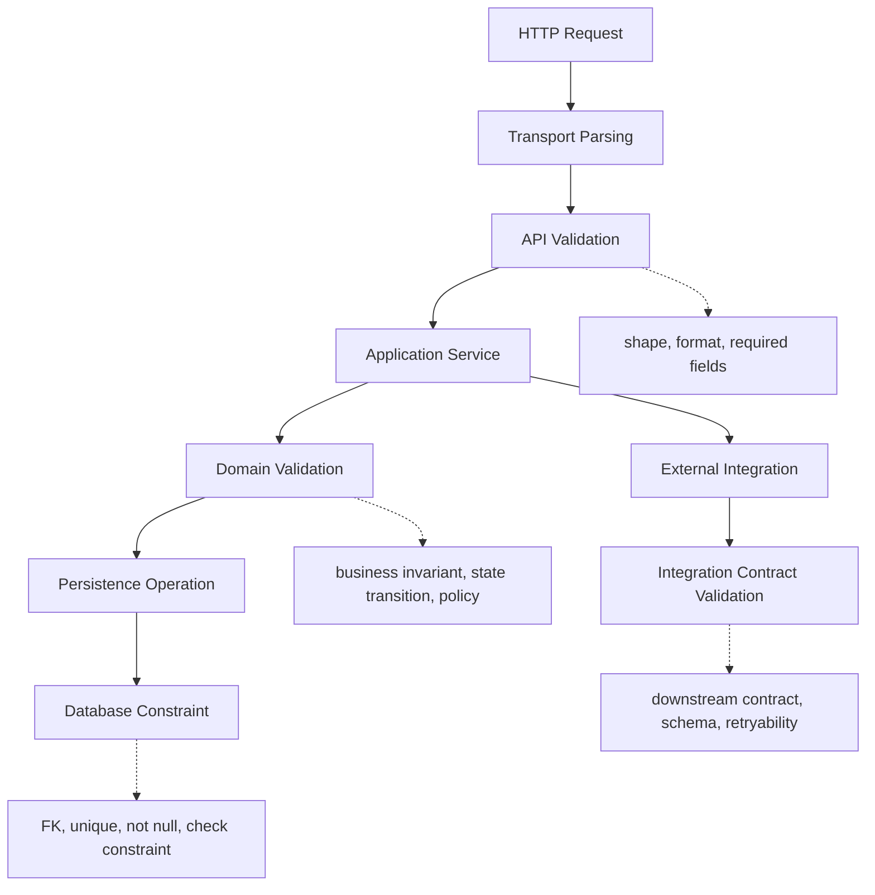
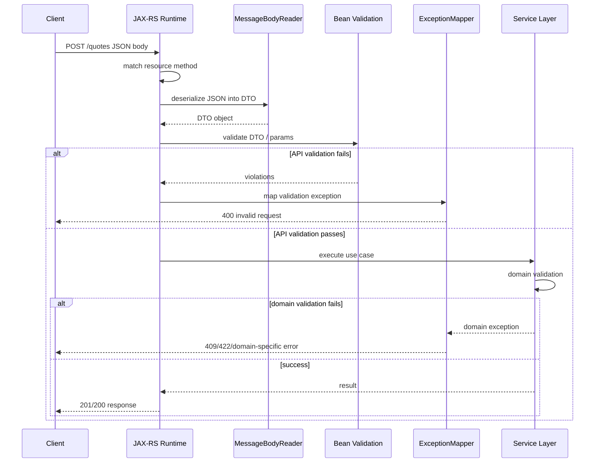

# Part 047 — Custom Validators and API vs Domain Validation

> Fokus part ini: memahami kapan memakai Bean Validation annotation, kapan membuat custom validator, dan kapan validation harus pindah ke domain/service layer. Kita akan membahas custom constraint, `ConstraintValidator`, class-level validation, cross-field validation, validation groups, dependency injection caveat, error mapping, testing, failure mode, debugging, dan PR review checklist.

Part sebelumnya membahas Bean Validation sebagai pagar input.

Part ini membahas batas yang lebih penting:

```text
Validation bukan hanya soal "field ini null atau tidak".
Validation adalah keputusan arsitektur tentang di layer mana suatu aturan harus hidup.
```

Di sistem enterprise seperti CPQ, quote management, order management, catalog-driven pricing, dan workflow order lifecycle, kesalahan boundary validation bisa menghasilkan bug yang mahal:

```text
- request valid secara JSON, tetapi tidak valid terhadap state quote
- field valid secara format, tetapi tidak valid untuk tenant tertentu
- price valid secara angka, tetapi salah rounding policy
- effective date valid secara tanggal, tetapi tidak valid terhadap catalog version
- transition valid secara API, tetapi tidak valid terhadap lifecycle order
```

Karena itu senior engineer harus membedakan:

```text
API validation
Domain validation
Persistence validation
Integration validation
Operational validation
```

---

## 1. Core Mental Model

Validation adalah boundary check.

Pertanyaannya bukan hanya:

```text
Apakah data ini benar?
```

Pertanyaan yang lebih tepat:

```text
Benar menurut kontrak layer yang mana?
```

Layer berbeda punya definisi benar yang berbeda.



Bean Validation cocok untuk API validation.

Domain validation harus hidup dekat domain model atau use case service.

Database constraint tetap dibutuhkan sebagai integrity backstop.

Integration validation dibutuhkan saat menerima event, file, webhook, atau downstream response.

---

## 2. API Validation vs Domain Validation

API validation menjawab:

```text
Apakah request ini memenuhi kontrak teknis endpoint?
```

Contoh:

```java
public record CreateQuoteRequest(
    @NotBlank String customerId,
    @NotBlank String currency,
    @NotNull @FutureOrPresent LocalDate effectiveDate,
    @NotEmpty List<QuoteLineRequest> lines
) {}
```

Domain validation menjawab:

```text
Apakah operasi ini boleh terjadi berdasarkan state, policy, tenant, catalog, pricing rule, dan workflow?
```

Contoh:

```java
public final class QuoteService {
    public Quote createQuote(CreateQuoteCommand command) {
        Tenant tenant = tenantResolver.currentTenant();
        ProductCatalog catalog = catalogService.catalogFor(tenant, command.effectiveDate());

        if (!catalog.supportsCurrency(command.currency())) {
            throw DomainErrors.currencyNotSupported(command.currency(), tenant.id());
        }

        if (!catalog.containsAll(command.productIds())) {
            throw DomainErrors.productNotAvailableForTenant(command.productIds(), tenant.id());
        }

        return quoteFactory.create(command, catalog);
    }
}
```

Perbedaan penting:

| Concern | Cocok di Bean Validation? | Cocok di Domain Service? |
|---|---:|---:|
| Required field | Ya | Tidak utama |
| String format | Ya | Kadang |
| Numeric range sederhana | Ya | Kadang |
| Cross-field shape | Ya, dengan class-level validator | Kadang |
| Tenant-specific catalog availability | Tidak ideal | Ya |
| Quote editable state | Tidak | Ya |
| Pricing policy | Tidak | Ya |
| Authorization decision | Tidak | Ya, bersama security layer |
| External service availability | Tidak | Tidak sebagai validation; ini runtime dependency |

Rule praktis:

```text
Jika validation membutuhkan database, tenant config, catalog service, pricing engine,
workflow state, atau external service, jangan default ke Bean Validation annotation.
```

Bisa saja custom validator melakukan injection dependency, tetapi itu sering membuat API DTO terlalu pintar dan lifecycle-nya sulit dipahami.

---

## 3. When to Create Custom Validator

Custom validator berguna saat aturan masih bagian dari kontrak input, tetapi terlalu spesifik untuk annotation standar.

Contoh yang layak:

```text
- field harus uppercase code dengan format internal tertentu
- string harus match product code syntax
- currency harus ISO-like 3-letter code
- date range request harus from <= to
- collection tidak boleh punya duplicate key
- request harus memiliki salah satu dari dua field
- mutually exclusive field tidak boleh muncul bersamaan
```

Contoh yang kurang layak:

```text
- product harus aktif di catalog tenant ini
- discount harus disetujui approval policy
- quote harus masih editable
- order transition harus allowed
- customer harus punya credit limit cukup
```

Yang kurang layak lebih tepat di application/domain layer.

---

## 4. Anatomy of a Custom Constraint

Custom constraint biasanya punya dua bagian:

```text
1. Annotation
2. ConstraintValidator implementation
```

Contoh field-level validator:

```java
import jakarta.validation.Constraint;
import jakarta.validation.Payload;
import java.lang.annotation.Documented;
import java.lang.annotation.Retention;
import java.lang.annotation.Target;

import static java.lang.annotation.ElementType.FIELD;
import static java.lang.annotation.ElementType.PARAMETER;
import static java.lang.annotation.RetentionPolicy.RUNTIME;

@Documented
@Constraint(validatedBy = CurrencyCodeValidator.class)
@Target({ FIELD, PARAMETER })
@Retention(RUNTIME)
public @interface CurrencyCode {
    String message() default "must be a 3-letter uppercase currency code";

    Class<?>[] groups() default {};

    Class<? extends Payload>[] payload() default {};
}
```

Validator:

```java
import jakarta.validation.ConstraintValidator;
import jakarta.validation.ConstraintValidatorContext;

public final class CurrencyCodeValidator implements ConstraintValidator<CurrencyCode, String> {
    @Override
    public boolean isValid(String value, ConstraintValidatorContext context) {
        if (value == null) {
            return true; // let @NotNull decide requiredness
        }
        return value.matches("[A-Z]{3}");
    }
}
```

Usage:

```java
public record CreateQuoteRequest(
    @NotBlank String customerId,
    @NotNull @CurrencyCode String currency
) {}
```

Important convention:

```text
Custom validator should usually treat null as valid.
Use @NotNull/@NotBlank separately for requiredness.
```

Kenapa?

Karena constraint composition menjadi lebih eksplisit:

```java
@CurrencyCode
String optionalCurrency;

@NotNull
@CurrencyCode
String requiredCurrency;
```

---

## 5. Validator Message Should Not Be Your Domain Error Contract

Annotation message sering dipakai langsung sebagai response error.

Ini praktis, tapi punya risiko.

Bad pattern:

```json
{
  "message": "must be a 3-letter uppercase currency code"
}
```

Better pattern:

```json
{
  "errorCode": "REQUEST_INVALID",
  "violations": [
    {
      "field": "currency",
      "constraint": "CurrencyCode",
      "message": "must be a 3-letter uppercase currency code"
    }
  ]
}
```

Untuk enterprise API, message bisa berubah.

Error code dan field path harus stabil.

Rule:

```text
Validator message boleh human-readable.
Error contract harus machine-readable.
```

---

## 6. Class-Level Validator for Cross-Field Rules

Field-level constraint tidak cukup untuk cross-field validation.

Contoh request pencarian:

```java
public record SearchQuoteRequest(
    LocalDate fromDate,
    LocalDate toDate,
    String quoteId,
    String customerId
) {}
```

Aturan:

```text
- if fromDate and toDate exist, fromDate <= toDate
- at least one search criterion must be provided
```

Class-level annotation:

```java
import jakarta.validation.Constraint;
import jakarta.validation.Payload;
import java.lang.annotation.Documented;
import java.lang.annotation.Retention;
import java.lang.annotation.Target;

import static java.lang.annotation.ElementType.TYPE;
import static java.lang.annotation.RetentionPolicy.RUNTIME;

@Documented
@Constraint(validatedBy = SearchQuoteRequestValidator.class)
@Target(TYPE)
@Retention(RUNTIME)
public @interface ValidSearchQuoteRequest {
    String message() default "invalid search quote request";

    Class<?>[] groups() default {};

    Class<? extends Payload>[] payload() default {};
}
```

Validator:

```java
import jakarta.validation.ConstraintValidator;
import jakarta.validation.ConstraintValidatorContext;

public final class SearchQuoteRequestValidator
        implements ConstraintValidator<ValidSearchQuoteRequest, SearchQuoteRequest> {

    @Override
    public boolean isValid(SearchQuoteRequest request, ConstraintValidatorContext context) {
        if (request == null) {
            return true;
        }

        boolean valid = true;

        if (request.fromDate() != null
                && request.toDate() != null
                && request.fromDate().isAfter(request.toDate())) {
            addViolation(context, "fromDate", "fromDate must be before or equal to toDate");
            valid = false;
        }

        boolean hasAnyCriterion = request.quoteId() != null
                || request.customerId() != null
                || request.fromDate() != null
                || request.toDate() != null;

        if (!hasAnyCriterion) {
            addViolation(context, "criteria", "at least one search criterion is required");
            valid = false;
        }

        return valid;
    }

    private static void addViolation(
            ConstraintValidatorContext context,
            String property,
            String message
    ) {
        context.disableDefaultConstraintViolation();
        context.buildConstraintViolationWithTemplate(message)
                .addPropertyNode(property)
                .addConstraintViolation();
    }
}
```

Usage:

```java
@ValidSearchQuoteRequest
public record SearchQuoteRequest(
    LocalDate fromDate,
    LocalDate toDate,
    String quoteId,
    String customerId
) {}
```

Caution:

```text
Class-level validator is good for request shape.
It is not good for domain state validation.
```

---

## 7. Cross-Field Validation: Good vs Dangerous

Good cross-field validation:

```text
- startDate <= endDate
- exactly one of fileId or fileContent is present
- either quoteId or customerId must exist
- page size <= allowed maximum
- sort field exists in allowed API field list
```

Dangerous cross-field validation:

```text
- product is sellable to this customer
- discount is allowed by approval matrix
- order can transition to submitted
- tenant has enabled this catalog rule
```

Dangerous means:

```text
The validation depends on business state outside the DTO.
```

Move it to application/domain layer.

---

## 8. Validation Groups: Useful but Easy to Abuse

Validation groups allow different rules for different operations.

Example:

```java
public interface Create {}
public interface Update {}

public record QuoteRequest(
    @Null(groups = Create.class)
    @NotNull(groups = Update.class)
    String quoteId,

    @NotBlank(groups = { Create.class, Update.class })
    String customerId
) {}
```

Potential usage:

```java
validator.validate(request, Create.class);
validator.validate(request, Update.class);
```

But in JAX-RS automatic validation, group selection depends on runtime integration and annotations.

Risk:

```text
- group behavior is invisible from endpoint signature
- same DTO becomes overloaded
- create/update contract becomes coupled
- tests miss group-specific behavior
```

Senior guideline:

```text
Prefer separate DTOs for materially different API contracts.
Use groups only when the contract is mostly identical and the difference is small.
```

Better:

```java
public record CreateQuoteRequest(
    @NotBlank String customerId,
    @NotEmpty List<QuoteLineRequest> lines
) {}

public record UpdateQuoteRequest(
    @NotBlank String quoteId,
    @NotEmpty List<QuoteLineRequest> lines
) {}
```

---

## 9. Custom Validator and Dependency Injection Caveat

A custom validator can sometimes inject dependencies.

Example idea:

```java
public final class ProductCodeValidator implements ConstraintValidator<ProductCode, String> {
    private final ProductCatalog catalog;

    public ProductCodeValidator(ProductCatalog catalog) {
        this.catalog = catalog;
    }
}
```

This may work only if validation provider integrates with DI container.

But it creates problems:

```text
- Validator lifecycle becomes container-dependent.
- Validation can trigger database/network calls.
- Request DTO validation becomes slow and failure-prone.
- Error becomes ambiguous: invalid input or dependency failure?
- Test setup becomes heavier.
- Validator can accidentally require tenant/security context.
```

For enterprise services, avoid custom validators that perform I/O.

Bad:

```java
@ExistingProductCode
String productCode;
```

If this checks database or catalog service, it is domain/application validation.

Better:

```java
@ProductCodeFormat
String productCode;
```

Then later:

```java
catalogPolicy.ensureProductAvailableForTenant(productCode, tenantId, effectiveDate);
```

---

## 10. Temporal and Monetary Validation Boundary

For CPQ/order systems, temporal and monetary fields are dangerous.

API validation can check:

```text
- date is syntactically valid
- date is not null
- date range order is valid
- amount scale is within allowed maximum
- currency code format is valid
```

Domain validation should check:

```text
- effective date is valid for catalog version
- pricing date is valid for price book
- promotion window applies
- tax date boundary is correct
- rounding policy for tenant/product/country applies
```

Example API-level amount validator:

```java
public record MoneyRequest(
    @NotNull @CurrencyCode String currency,
    @NotNull @Digits(integer = 18, fraction = 4) BigDecimal amount
) {}
```

But rounding rule should not be hidden inside annotation if it depends on tenant/product/tax jurisdiction.

---

## 11. Validation Lifecycle in JAX-RS

Typical request lifecycle:



Important distinction:

```text
Invalid JSON/body shape -> usually 400
Bean validation violation -> usually 400
Domain invariant violation -> often 409 or 422 depending API policy
Authorization violation -> 403
Missing/invalid auth -> 401
Technical dependency failure -> 5xx or mapped retryable error
```

Actual mapping must follow internal API governance.

---

## 12. Error Mapping for Custom Validators

A validation failure should preserve useful detail:

```text
- field path
- rejected value policy, usually not raw sensitive value
- constraint type
- message
- error code
- correlation ID
```

Example normalized error:

```json
{
  "errorCode": "REQUEST_VALIDATION_FAILED",
  "message": "Request validation failed",
  "violations": [
    {
      "field": "currency",
      "constraint": "CurrencyCode",
      "message": "must be a 3-letter uppercase currency code"
    },
    {
      "field": "fromDate",
      "constraint": "ValidSearchQuoteRequest",
      "message": "fromDate must be before or equal to toDate"
    }
  ],
  "correlationId": "01HY..."
}
```

Avoid returning:

```text
- stack trace
- Java exception class
- internal package names
- raw token/secret/PII
- entire request body
```

---

## 13. Validation and Security

Validation is not security by itself.

Validation helps reject malformed input, but it does not replace:

```text
- authentication
- authorization
- tenant isolation
- SQL injection protection
- output encoding
- rate limiting
- schema compatibility
- audit logging
```

Example:

```java
@NotBlank String tenantId
```

This only proves tenantId is present.

It does not prove:

```text
- caller belongs to tenant
- caller can act on tenant
- tenantId matches security context
- data access is tenant-filtered
```

Tenant validation belongs in security/application boundary.

---

## 14. Anti-Patterns

### Anti-pattern 1 — Business Policy Hidden in Annotation

```java
@DiscountAllowed
BigDecimal discount;
```

If `@DiscountAllowed` queries tenant policy or approval matrix, the annotation hides business dependency.

Better:

```java
@Digits(integer = 5, fraction = 2)
BigDecimal discount;
```

Then:

```java
pricingPolicy.validateDiscount(command, tenant, user);
```

### Anti-pattern 2 — One DTO for Every Operation

```java
public record QuoteRequest(
    String quoteId,
    String customerId,
    String status,
    List<QuoteLineRequest> lines,
    String approvalReason,
    String cancellationReason
) {}
```

This often creates annotation soup.

Better:

```text
CreateQuoteRequest
UpdateQuoteRequest
SubmitQuoteRequest
ApproveQuoteRequest
CancelQuoteRequest
```

Each operation has a clear contract.

### Anti-pattern 3 — Regex as Domain Model

Regex is good for syntax.

Regex is bad for policy.

```java
@Pattern(regexp = "...")
String productCode;
```

This can validate format.

It cannot validate product availability, catalog lifecycle, or tenant entitlement.

### Anti-pattern 4 — Returning Raw ConstraintViolation.toString()

Bad:

```java
return violations.toString();
```

This leaks implementation detail and produces unstable error contract.

### Anti-pattern 5 — Validation that Calls Downstream Service

Validation should be deterministic and fast.

If validation calls downstream, a dependency outage can look like invalid request.

---

## 15. Testing Custom Validators

Test custom validators directly.

Example:

```java
class CurrencyCodeValidatorTest {
    private final Validator validator = Validation.buildDefaultValidatorFactory().getValidator();

    @Test
    void rejectsLowercaseCurrencyCode() {
        var request = new CreateQuoteRequest("customer-1", "usd");

        Set<ConstraintViolation<CreateQuoteRequest>> violations = validator.validate(request);

        assertThat(violations)
            .anyMatch(v -> v.getPropertyPath().toString().equals("currency"));
    }
}
```

Also test through JAX-RS endpoint if automatic validation is expected:

```text
- invalid request returns expected HTTP status
- response error shape is stable
- field path is correct
- no stack trace leaks
- correlation ID is present
```

For class-level validator, test multiple fields:

```text
[ ] valid range passes
[ ] from > to fails
[ ] missing all criteria fails
[ ] null object behavior is known
[ ] violation path points to useful field
```

---

## 16. Failure Modes

Common failure modes:

| Failure | Symptom | Likely Cause |
|---|---|---|
| Validator not triggered | Invalid request reaches service | Missing `@Valid`, missing provider, disabled integration |
| Nested object not validated | Child DTO invalid but accepted | Missing `@Valid` on nested field/list |
| Null accepted unexpectedly | Missing `@NotNull`/`@NotBlank` | Custom validator returns true for null by convention |
| Wrong HTTP status | 500 instead of 400 | Missing validation exception mapper |
| Field path confusing | Error says object-level only | Class-level validator not adding property node |
| Slow validation | Request latency high | Validator doing DB/network calls |
| Validation depends on tenant context | Random failure in tests/async | Hidden ThreadLocal/security dependency |
| Different behavior local vs prod | Provider/config mismatch | Different validation implementation or Jersey extension |

---

## 17. Debugging Checklist

When validation does not behave as expected:

```text
[ ] Is the DTO parameter annotated with @Valid where needed?
[ ] Is nested collection annotated correctly?
[ ] Is Bean Validation provider on classpath?
[ ] Is JAX-RS/Jersey validation integration enabled?
[ ] Are annotations from jakarta.validation.* or javax.validation.* mixed?
[ ] Is the exception mapper catching the actual exception type?
[ ] Is validation group selection correct?
[ ] Is custom validator registered through annotation validatedBy?
[ ] Does custom validator treat null as expected?
[ ] Does class-level validator attach property nodes?
[ ] Is validation executed before service logic?
[ ] Does test environment load the same provider/config as runtime?
```

---

## 18. PR Review Checklist

For custom validator PRs:

```text
[ ] Is this rule truly API/input validation?
[ ] Does it avoid database/network calls?
[ ] Does it handle null intentionally?
[ ] Is requiredness expressed separately with @NotNull/@NotBlank?
[ ] Is the error message stable enough?
[ ] Is machine-readable error mapping preserved?
[ ] Are nested objects validated with @Valid?
[ ] Are validation groups necessary, or would separate DTOs be clearer?
[ ] Is class-level validation path useful to clients?
[ ] Are tests covering valid, invalid, null, boundary, and error response cases?
[ ] Does it avoid tenant/security/domain dependency inside annotation?
[ ] Does it avoid leaking PII/secrets in validation message?
```

For endpoint PRs:

```text
[ ] Request DTO captures transport contract only.
[ ] Domain rules are enforced in application/domain layer.
[ ] Domain errors are mapped separately from validation errors.
[ ] Validation does not hide side effects.
[ ] Validation failure is observable but not noisy.
[ ] API docs mention constraints that clients must follow.
```

---

## 19. Internal Verification Checklist

For CSG/internal codebase verification:

```text
[ ] Which Bean Validation API namespace is used: javax.validation.* or jakarta.validation.*?
[ ] Which implementation is used: Hibernate Validator or something else?
[ ] Is Jersey bean validation extension enabled?
[ ] Where is validation exception mapped?
[ ] What is the standard validation error response shape?
[ ] Are custom validators already present? Where?
[ ] Do custom validators inject services?
[ ] Do validators call DB/cache/catalog/downstream services?
[ ] Are validation groups used? For what operations?
[ ] Are DTOs separated per operation or shared widely?
[ ] Are tenant-specific rules enforced in validators or domain services?
[ ] Is there a central error code catalog for validation errors?
[ ] Are validation messages localized or static?
[ ] Are validation errors included in audit/security logs?
[ ] Are invalid requests visible in metrics/tracing?
```

---

## 20. Senior-Level Rule of Thumb

Use Bean Validation for:

```text
- requiredness
- shape
- type-level constraints
- syntax
- local cross-field consistency
- cheap deterministic checks
```

Use domain/application validation for:

```text
- lifecycle state
- tenant-specific behavior
- catalog availability
- pricing policy
- authorization-adjacent rules
- data-dependent invariants
- workflow transition
```

Use database constraints for:

```text
- final integrity guard
- uniqueness
- referential integrity
- non-null invariant
- check constraints that must never be violated
```

Use integration contract validation for:

```text
- event schema
- downstream response contract
- webhook payload
- file import format
```

Final mental model:

```text
Bean Validation protects the API boundary.
Domain validation protects business correctness.
Database constraints protect persistent integrity.
Observability protects your ability to explain failures.
```

---

## 21. What You Should Be Able to Do After This Part

After this part, you should be able to:

```text
[ ] Decide whether a rule belongs in annotation, service, domain, database, or integration layer.
[ ] Build custom Bean Validation annotations safely.
[ ] Implement class-level cross-field validation.
[ ] Avoid validators that hide I/O or domain dependency.
[ ] Map validation errors into stable API error contracts.
[ ] Review validation PRs with senior-level boundary discipline.
[ ] Verify how validation is wired in an unknown JAX-RS/Jersey codebase.
```

---

# Summary

Custom validators are powerful, but they are easy to misuse.

The key discipline is boundary clarity.

```text
Do not turn DTO annotation into hidden business logic.
```

Good API validation is fast, deterministic, local, explicit, and easy to explain.

Good domain validation is state-aware, policy-aware, tenant-aware, and located where the business decision actually belongs.

In enterprise systems, validation bugs are not small bugs. They become compatibility bugs, pricing bugs, tenant isolation bugs, incident bugs, and audit bugs.

