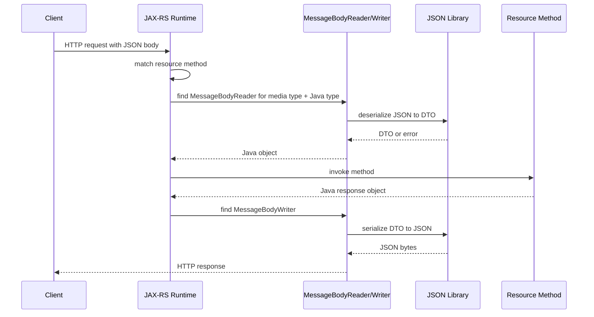

# Part 048 — JSON Processing: Jackson and JSON-B

> Fokus part ini: memahami bagaimana JSON request body menjadi object Java dan bagaimana object Java menjadi JSON response di JAX-RS/Jakarta REST. Kita akan membahas Jackson, JSON-B, entity provider, `ObjectMapper`, date/time, enum, null handling, unknown field, immutable DTO, polymorphism, security risk, compatibility, failure mode, debugging, dan PR review.

JSON terlihat sederhana.

Tapi di production, JSON adalah kontrak.

Kesalahan kecil dalam serialization/deserialization bisa menjadi:

```text
- breaking API change
- silent data loss
- wrong enum handling
- timezone bug
- monetary precision bug
- backward compatibility bug
- security vulnerability
- incident karena client lama tidak bisa parse response baru
```

Senior engineer harus melihat JSON bukan hanya sebagai format data, tapi sebagai compatibility boundary.

---

## 1. Core Mental Model

Di JAX-RS, JSON processing terjadi melalui entity provider.

Simplified flow:



JAX-RS does not magically understand JSON.

It delegates JSON processing to a provider.

Common providers:

```text
- Jackson-based provider
- JSON-B provider
- MOXy provider in some Jakarta/Jersey environments
- custom MessageBodyReader/Writer
```

Internal runtime determines which provider wins.

---

## 2. Standard vs Implementation

Separate the layers:

```text
JAX-RS / Jakarta REST
  Defines entity provider concept.
  Uses MessageBodyReader and MessageBodyWriter.

JSON-B
  Jakarta standard binding API for JSON <-> Java objects.
  Package: jakarta.json.bind.*

Jackson
  Popular non-Jakarta JSON library.
  Package: com.fasterxml.jackson.*
  Very common in enterprise Java services.

Jersey JSON integration
  Jersey modules can integrate Jackson, JSON-B, MOXy, etc.
```

Do not assume a service uses Jackson just because DTOs serialize to JSON.

Look for dependencies:

```text
com.fasterxml.jackson.core:jackson-databind
com.fasterxml.jackson.datatype:jackson-datatype-jsr310
org.glassfish.jersey.media:jersey-media-json-jackson
org.glassfish.jersey.media:jersey-media-json-binding
jakarta.json.bind:jakarta.json.bind-api
org.eclipse:yasson
```

Internal verification:

```text
[ ] Which JSON provider is registered?
[ ] Is Jackson active, JSON-B active, MOXy active, or custom provider active?
[ ] Is provider registered explicitly or auto-discovered?
[ ] Is there a central ObjectMapper/Jsonb configuration?
[ ] Are request and response using the same provider?
```

---

## 3. Why JSON Configuration Is Architecture

JSON settings affect public contract.

Examples:

```text
- field naming: customerId vs customer_id
- null inclusion: present null vs omitted field
- unknown field policy: fail vs ignore
- enum representation: name vs custom code
- date format: ISO string vs timestamp
- BigDecimal format: number vs string
- empty collection: [] vs null vs omitted
- polymorphic type metadata: enabled vs disabled
```

These are not formatting details.

They determine whether clients can safely upgrade independently.

---

## 4. Jackson Basics

Jackson usually centers around `ObjectMapper`.

Example:

```java
ObjectMapper mapper = new ObjectMapper();
mapper.registerModule(new JavaTimeModule());
mapper.disable(SerializationFeature.WRITE_DATES_AS_TIMESTAMPS);
mapper.disable(DeserializationFeature.FAIL_ON_UNKNOWN_PROPERTIES);
```

In Jersey, Jackson provider may be configured through a `ContextResolver<ObjectMapper>`:

```java
import com.fasterxml.jackson.databind.ObjectMapper;
import jakarta.ws.rs.ext.ContextResolver;
import jakarta.ws.rs.ext.Provider;

@Provider
public final class ObjectMapperProvider implements ContextResolver<ObjectMapper> {
    private final ObjectMapper mapper;

    public ObjectMapperProvider() {
        this.mapper = new ObjectMapper()
                .registerModule(new JavaTimeModule())
                .disable(SerializationFeature.WRITE_DATES_AS_TIMESTAMPS)
                .disable(DeserializationFeature.FAIL_ON_UNKNOWN_PROPERTIES);
    }

    @Override
    public ObjectMapper getContext(Class<?> type) {
        return mapper;
    }
}
```

Important:

```text
One codebase can have more than one ObjectMapper.
```

Common hidden bug:

```text
- API ObjectMapper differs from Kafka ObjectMapper
- test ObjectMapper differs from runtime ObjectMapper
- internal client ObjectMapper differs from server ObjectMapper
- custom mapper is created ad hoc with new ObjectMapper()
```

Senior rule:

```text
ObjectMapper configuration is a platform concern.
Ad hoc mapper creation should be rare and justified.
```

---

## 5. JSON-B Basics

JSON-B is Jakarta's JSON binding standard.

Example:

```java
JsonbConfig config = new JsonbConfig()
        .withNullValues(false)
        .withDateFormat("yyyy-MM-dd'T'HH:mm:ssXXX", Locale.ROOT);

Jsonb jsonb = JsonbBuilder.create(config);
```

JSON-B annotations include:

```java
@JsonbProperty("customer_id")
@JsonbTransient
@JsonbDateFormat("yyyy-MM-dd")
```

Jackson annotations include:

```java
@JsonProperty("customer_id")
@JsonIgnore
@JsonFormat(pattern = "yyyy-MM-dd")
```

Do not mix annotation families casually.

If JSON-B provider is active, Jackson annotation may be ignored.

If Jackson provider is active, JSON-B annotation may be ignored.

Internal verification:

```text
[ ] Are DTOs using Jackson annotations, JSON-B annotations, or both?
[ ] Does runtime provider honor those annotations?
[ ] Are there tests proving the actual JSON shape?
```

---

## 6. DTO Shape and Java Records

Java records are good DTO candidates:

```java
public record QuoteResponse(
    String quoteId,
    String customerId,
    String status,
    List<QuoteLineResponse> lines
) {}
```

Benefits:

```text
- immutable by default
- concise
- constructor defines required shape
- easier reasoning
```

But verify provider support.

Potential issues:

```text
- older Jackson version may need specific support
- older JSON-B implementation may behave differently
- no default constructor may break some provider/config
- reflection/module constraints can matter in advanced runtimes
```

For mutable DTOs:

```java
public final class QuoteResponse {
    private String quoteId;
    private String customerId;

    public String getQuoteId() { return quoteId; }
    public void setQuoteId(String quoteId) { this.quoteId = quoteId; }
}
```

This is broadly compatible but easier to mutate accidentally.

Senior review asks:

```text
Is this DTO an API contract or an internal mutable data bag?
```

---

## 7. Unknown Field Policy

When a client sends unknown fields:

```json
{
  "customerId": "C-123",
  "currency": "USD",
  "unexpectedField": "value"
}
```

Options:

```text
Fail request:
  strict contract, catches typos, less forward-compatible

Ignore unknown:
  more tolerant, better forward compatibility, can hide client mistakes
```

Jackson setting:

```java
mapper.configure(DeserializationFeature.FAIL_ON_UNKNOWN_PROPERTIES, false);
```

DTO-level override:

```java
@JsonIgnoreProperties(ignoreUnknown = true)
public record CreateQuoteRequest(...) {}
```

Enterprise guideline:

```text
Use a deliberate policy.
Do not let default library behavior become API governance by accident.
```

Possible policy:

```text
- External public API: often tolerant to unknown fields for forward compatibility.
- Internal strict API: may fail unknown fields to catch contract drift.
- Security-sensitive API: be careful with ignored fields that imply behavior.
```

---

## 8. Null Handling and Field Absence

JSON has a critical difference:

```json
{ "discount": null }
```

vs

```json
{}
```

They can mean different things.

For create request:

```text
missing field -> use default
null field -> explicit null, maybe invalid
```

For patch request:

```text
missing field -> do not change
null field -> clear value
```

If API does not define this, bugs appear.

Jackson serialization inclusion:

```java
mapper.setSerializationInclusion(JsonInclude.Include.NON_NULL);
```

But be careful:

```text
Omitting null fields in response can be a breaking change if clients expect field presence.
```

Patch DTO often needs explicit presence tracking.

Example:

```java
public record PatchQuoteRequest(
    OptionalField<String> description,
    OptionalField<BigDecimal> discount
) {}
```

Where `OptionalField` distinguishes:

```text
- absent
- present null
- present value
```

Do not assume `Optional<T>` solves JSON merge semantics cleanly without verifying provider behavior.

---

## 9. Enum Serialization

Default enum serialization often uses enum name:

```java
public enum QuoteStatus {
    DRAFT,
    SUBMITTED,
    APPROVED,
    REJECTED
}
```

JSON:

```json
{ "status": "SUBMITTED" }
```

Risk:

```text
Renaming Java enum constant becomes breaking API change.
```

For stable API, consider explicit code:

```java
public enum QuoteStatus {
    DRAFT("draft"),
    SUBMITTED("submitted"),
    APPROVED("approved"),
    REJECTED("rejected");

    private final String code;

    QuoteStatus(String code) {
        this.code = code;
    }

    @JsonValue
    public String code() {
        return code;
    }
}
```

Deserialization can use creator:

```java
@JsonCreator
public static QuoteStatus fromCode(String code) {
    return Arrays.stream(values())
            .filter(status -> status.code.equals(code))
            .findFirst()
            .orElseThrow(() -> new IllegalArgumentException("Unknown quote status: " + code));
}
```

But decide error mapping carefully.

Unknown enum should usually become `400 invalid request`, not `500 internal server error`.

Forward compatibility concern:

```text
When server returns a new enum value, older clients may fail.
```

For responses consumed by external clients, enum evolution needs policy.

---

## 10. Date and Time Serialization

Date/time is a frequent source of production bugs.

Common Java types:

```text
LocalDate
LocalDateTime
OffsetDateTime
Instant
ZonedDateTime
```

General guidance:

```text
Use LocalDate for date-only business concepts.
Use Instant or OffsetDateTime for exact moments.
Avoid LocalDateTime for cross-system timestamps unless timezone is defined elsewhere.
```

Jackson Java Time support usually needs:

```java
mapper.registerModule(new JavaTimeModule());
mapper.disable(SerializationFeature.WRITE_DATES_AS_TIMESTAMPS);
```

Example JSON:

```json
{
  "effectiveDate": "2026-07-10",
  "submittedAt": "2026-07-10T03:15:30Z"
}
```

Do not serialize date/time as numeric timestamp accidentally unless the contract says so.

This part only covers JSON serialization.

Temporal business correctness is covered in the dedicated date/time/currency/precision part.

---

## 11. BigDecimal and Numeric Precision

JSON number has no explicit decimal type.

Example:

```json
{ "price": 123.45 }
```

Java should often use `BigDecimal` for money-like values:

```java
public record PriceResponse(
    String currency,
    BigDecimal amount
) {}
```

Risks:

```text
- client parses number as floating point
- server serializes with unexpected scale
- trailing zeros lost
- rounding not defined
```

Some APIs serialize money as string for precision:

```json
{ "amount": "123.4500" }
```

But that is a contract decision.

Do not switch number/string without compatibility review.

---

## 12. Field Naming Strategy

Java usually uses camelCase:

```java
customerId
quoteLineId
effectiveDate
```

JSON may use camelCase or snake_case:

```json
{
  "customerId": "C-123"
}
```

or:

```json
{
  "customer_id": "C-123"
}
```

Jackson naming strategy:

```java
mapper.setPropertyNamingStrategy(PropertyNamingStrategies.SNAKE_CASE);
```

Annotation override:

```java
@JsonProperty("customer_id")
String customerId
```

Senior guideline:

```text
Prefer one API-wide naming convention.
Avoid per-field exceptions unless required for compatibility.
```

Internal verification:

```text
[ ] Is naming strategy global or annotation-based?
[ ] Do old APIs follow a different convention?
[ ] Are generated clients aligned with JSON field names?
```

---

## 13. Polymorphism and Security Risk

Polymorphic JSON is dangerous if configured broadly.

Bad idea:

```java
mapper.enableDefaultTyping(...)
```

Risk:

```text
Deserialization may instantiate unexpected classes.
Historically, unsafe polymorphic deserialization has caused serious vulnerabilities.
```

If polymorphism is needed, use explicit type models and limited subtypes.

Example:

```java
@JsonTypeInfo(use = JsonTypeInfo.Id.NAME, property = "type")
@JsonSubTypes({
    @JsonSubTypes.Type(value = FixedDiscount.class, name = "fixed"),
    @JsonSubTypes.Type(value = PercentageDiscount.class, name = "percentage")
})
public sealed interface Discount permits FixedDiscount, PercentageDiscount {}
```

Even then, ask:

```text
Is polymorphism part of public API contract?
Can clients generate this safely?
Can OpenAPI represent it clearly?
How will new subtype be introduced compatibly?
```

---

## 14. JSON Views, Partial Response, and Contract Drift

Jackson has `@JsonView`.

It can produce different response shapes from same DTO.

Risk:

```text
- contract becomes implicit
- tests miss fields in specific view
- generated OpenAPI may not reflect runtime shape
- response compatibility becomes hard to reason about
```

For enterprise APIs, prefer explicit response DTOs:

```text
QuoteSummaryResponse
QuoteDetailResponse
QuoteLineResponse
```

Rather than one DTO with many conditional serialization rules.

Partial response should be an explicit API governance decision, not accidental `@JsonView` sprawl.

---

## 15. Request DTO vs Response DTO

Do not reuse request and response DTOs casually.

Bad:

```java
public record QuoteDto(
    String quoteId,
    String customerId,
    String status,
    BigDecimal total,
    List<QuoteLineDto> lines
) {}
```

Used for:

```text
- create request
- update request
- detail response
- event payload
- database projection
```

This creates contract coupling.

Better:

```text
CreateQuoteRequest
UpdateQuoteRequest
QuoteResponse
QuoteSummaryResponse
QuoteCreatedEvent
QuoteProjection
```

Reason:

```text
Each boundary evolves differently.
```

---

## 16. JSON Error Handling in JAX-RS

Common JSON failures:

```text
- malformed JSON
- wrong content type
- unknown field if strict
- wrong type: string where object expected
- invalid enum value
- invalid date format
- missing required creator property
- custom deserializer failure
```

Map them consistently.

Typical mapping:

| Failure | Possible HTTP Status | Note |
|---|---:|---|
| Missing/unsupported `Content-Type` | 415 | Depends endpoint and provider |
| Client cannot accept response media type | 406 | Content negotiation failure |
| Malformed JSON | 400 | Request body unreadable |
| JSON type mismatch | 400 | Deserialization failure |
| Bean validation failure after JSON parse | 400 | Constraint violations |
| Serialization failure for response | 500 | Server produced unserializable object |

Do not expose raw Jackson exception in API response.

But do log enough for debugging with correlation ID.

---

## 17. Failure Modes

| Failure | Symptom | Likely Cause |
|---|---|---|
| 415 Unsupported Media Type | Request rejected before resource method | Wrong `Content-Type` or missing provider |
| 406 Not Acceptable | Client cannot get requested media type | `Accept` mismatch |
| 400 malformed body | JSON parse/deserialization failure | Invalid JSON/type/enum/date |
| 500 serialization error | Resource returned object provider cannot serialize | Cyclic graph, bad getter, unsupported type |
| Field missing in response | Null inclusion or annotation | `NON_NULL`, `@JsonIgnore`, view |
| Unknown field accepted silently | Tolerant config | `FAIL_ON_UNKNOWN_PROPERTIES=false` |
| Unknown field rejected unexpectedly | Strict config | Provider config mismatch |
| Date serialized as array/timestamp | Missing JavaTime config | `WRITE_DATES_AS_TIMESTAMPS` |
| Enum breaks clients | New enum value or renamed constant | No compatibility policy |
| Tests pass but runtime differs | Different mapper/provider | Test uses ad hoc mapper |

---

## 18. Debugging Checklist

When JSON behavior is unexpected:

```text
[ ] What is the request Content-Type?
[ ] What is the request Accept header?
[ ] Which MessageBodyReader/Writer is selected?
[ ] Which JSON provider is active: Jackson, JSON-B, MOXy, custom?
[ ] Is provider registered explicitly or auto-discovered?
[ ] Is ObjectMapper/Jsonb config centralized?
[ ] Are annotations from Jackson and JSON-B mixed?
[ ] Are tests using the same mapper as runtime?
[ ] Is date/time module registered?
[ ] Is unknown field policy intentional?
[ ] Is null inclusion policy intentional?
[ ] Are enum values stable API codes?
[ ] Is polymorphic deserialization enabled anywhere?
[ ] Are response DTOs accidentally exposing internal fields?
```

Runtime-level evidence:

```text
- startup logs
- ResourceConfig registration
- provider class names
- dependency tree
- failing stack trace
- wire-level request/response capture
- endpoint integration test
```

---

## 19. Testing JSON Contracts

Unit test object mapper only when mapper config itself is the subject.

Example:

```java
@Test
void serializesEffectiveDateAsIsoDate() throws Exception {
    var response = new QuoteResponse("Q-1", LocalDate.of(2026, 7, 10));

    String json = objectMapper.writeValueAsString(response);

    assertThat(json).contains("\"effectiveDate\":\"2026-07-10\"");
}
```

But endpoint contract tests are better:

```text
[ ] Send real HTTP request.
[ ] Use real Content-Type and Accept header.
[ ] Exercise real MessageBodyReader/Writer.
[ ] Assert response body shape.
[ ] Assert error body for invalid JSON.
[ ] Assert unknown/null/enum/date behavior.
```

Golden JSON tests can help, but avoid brittle formatting assertions.

Assert semantic shape, not whitespace.

---

## 20. Backward-Compatible JSON Evolution

Usually safe changes:

```text
- add optional response field
- add optional request field with safe default
- add enum value only if clients tolerate unknown values
- loosen validation carefully
```

Usually breaking changes:

```text
- remove field
- rename field
- change field type
- change number to string or string to number
- change null/absence semantics
- make optional field required
- change date format
- change enum value spelling
- change object to array or array to object
```

Compatibility is consumer-dependent.

An internal API with generated clients can break differently from a public API with manually written clients.

---

## 21. JSON and OpenAPI Alignment

OpenAPI must match actual JSON behavior.

Common drift:

```text
- OpenAPI says field required, runtime allows missing
- OpenAPI says string date, runtime emits timestamp
- OpenAPI says enum list, runtime has extra enum
- OpenAPI says nullable false, runtime returns null
- OpenAPI says object, runtime returns array in edge case
```

PR review should require:

```text
[ ] DTO change updates OpenAPI.
[ ] OpenAPI examples match runtime serialization.
[ ] Generated clients still compile.
[ ] Contract tests cover changed fields.
[ ] Compatibility matrix is updated when needed.
```

---

## 22. Internal Verification Checklist

For CSG/internal codebase verification:

```text
[ ] Which JSON provider is active for JAX-RS endpoints?
[ ] Is Jackson used? If yes, which version and modules?
[ ] Is JSON-B used? If yes, which implementation?
[ ] Is MOXy used anywhere by Jersey default/legacy config?
[ ] Where is ObjectMapper/Jsonb configured?
[ ] Is there more than one ObjectMapper?
[ ] Do tests use the production mapper/provider?
[ ] Are DTOs using Jackson annotations, JSON-B annotations, or both?
[ ] What is the unknown field policy?
[ ] What is the null inclusion policy?
[ ] What is the field naming strategy?
[ ] How are dates/times serialized?
[ ] How are BigDecimal/money-like values serialized?
[ ] How are enums represented?
[ ] Is polymorphic deserialization enabled anywhere?
[ ] Are API DTOs reused as event/database/internal DTOs?
[ ] Is OpenAPI generated from code, manually written, or contract-first?
[ ] Are JSON contract changes checked in CI?
```

---

## 23. PR Review Checklist

For JSON/API DTO changes:

```text
[ ] Is this DTO specific to one boundary?
[ ] Is request DTO separated from response DTO?
[ ] Is field naming consistent with API convention?
[ ] Is new field optional or required?
[ ] If required, is rollout/backward compatibility handled?
[ ] Is null vs absent behavior defined?
[ ] Is unknown field policy respected?
[ ] Are enum values stable contract codes?
[ ] Is date/time format explicit?
[ ] Is BigDecimal precision/scale behavior acceptable?
[ ] Are Jackson/JSON-B annotations compatible with active provider?
[ ] Does OpenAPI match runtime JSON?
[ ] Are contract tests updated?
[ ] Does serialization avoid exposing internal/sensitive fields?
[ ] Does deserialization avoid unsafe polymorphism?
```

For provider/config changes:

```text
[ ] Is the change global or endpoint-specific?
[ ] Which existing APIs are affected?
[ ] Are response examples changed?
[ ] Are generated clients affected?
[ ] Are event serializers affected if mapper is shared?
[ ] Are migration/release notes needed?
```

---

## 24. Senior-Level Rule of Thumb

Treat JSON as a long-lived contract.

```text
Every DTO field is a promise.
Every serialization setting is API governance.
Every enum value is compatibility debt.
Every date/time format is an integration decision.
Every ObjectMapper is a potential platform fork.
```

Prefer:

```text
- explicit DTOs
- centralized mapper/provider config
- endpoint contract tests
- stable field names
- stable enum codes
- explicit null/absence semantics
- OpenAPI alignment
```

Avoid:

```text
- ad hoc ObjectMapper creation
- DTO reuse across boundaries
- implicit date/time defaults
- accidental null omission
- unsafe polymorphic deserialization
- generated API docs that do not match runtime
```

---

## 25. What You Should Be Able to Do After This Part

After this part, you should be able to:

```text
[ ] Explain how JAX-RS selects JSON reader/writer providers.
[ ] Distinguish Jackson, JSON-B, Jersey provider modules, and standard JAX-RS extension points.
[ ] Find the active JSON provider in a codebase.
[ ] Review ObjectMapper/Jsonb configuration from an API compatibility perspective.
[ ] Debug 400/406/415/500 JSON-related failures.
[ ] Identify null, enum, date/time, BigDecimal, and unknown-field risks.
[ ] Review JSON DTO changes with senior-level compatibility discipline.
```

---

# Summary

JSON processing is not a minor implementation detail.

It is one of the most important compatibility surfaces in a JAX-RS service.

JAX-RS provides the entity provider mechanism.

Jackson and JSON-B provide JSON binding behavior.

Your production system provides the real contract through configuration, annotations, tests, OpenAPI, and client expectations.

Senior engineers do not let JSON defaults become accidental architecture.

