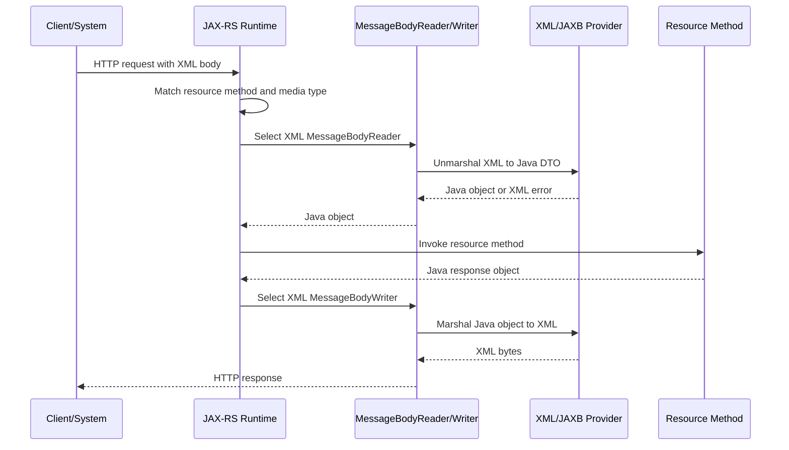
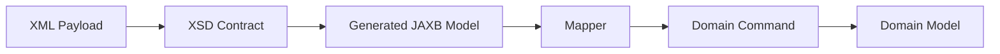

# Part 049 — XML Processing, JAXB, and Serialization Compatibility

> Fokus part ini: memahami XML processing dalam JAX-RS/Jakarta REST, kapan XML masih relevan di enterprise integration, bagaimana JAXB bekerja, bagaimana namespace/schema memengaruhi compatibility, apa risiko security seperti XXE, dan bagaimana melakukan PR review untuk perubahan XML contract.

Di banyak sistem modern, JSON menjadi default.

Tapi di enterprise production system, XML sering masih hidup karena:

```text
- legacy integration
- B2B interface
- telco/BSS/OSS integration
- SOAP-adjacent payload
- file-based integration
- vendor contract lama
- regulated document exchange
- canonical enterprise message model
```

Senior engineer tidak boleh melihat XML sebagai format usang semata.

XML adalah contract surface.

Kalau format XML berubah tanpa governance, efeknya bisa sama buruknya dengan breaking API change pada JSON.

---

## 1. Core Mental Model

Dalam JAX-RS, XML processing juga berjalan melalui entity provider.

Simplified flow:



JAX-RS does not parse XML by itself.

It selects a provider based on:

```text
- Java type
- media type
- registered providers
- provider priority
- annotations
- runtime implementation
```

Typical media types:

```text
application/xml
text/xml
application/*+xml
```

---

## 2. Standard vs Implementation

Separate the layers:

```text
JAX-RS / Jakarta REST
  Defines MessageBodyReader/Writer and content negotiation.

JAXB / Jakarta XML Binding
  Defines object <-> XML binding model.

Jersey integration
  Provides runtime modules/providers that can use JAXB or other XML providers.

Custom XML provider
  May implement MessageBodyReader/Writer directly.

Servlet/container/gateway
  May enforce body limits, compression, TLS, and header behavior.
```

Do not assume XML is active merely because DTOs have JAXB annotations.

Verify provider registration and media type behavior.

Internal verification:

```text
[ ] Does the service expose XML endpoints?
[ ] Are XML endpoints public, internal, legacy, or vendor-specific?
[ ] Which provider handles XML serialization?
[ ] Is JAXB used directly, through Jersey, or through custom provider?
[ ] Are XML tests present for request and response examples?
```

---

## 3. Why XML Compatibility Is Harder Than It Looks

JSON compatibility usually focuses on fields.

XML compatibility involves more dimensions:

```text
- element name
- attribute name
- namespace URI
- namespace prefix
- element order
- wrapper element
- repeated element shape
- optional element behavior
- empty element vs missing element
- text value vs child element
- schema version
- encoding
- whitespace handling
```

Example:

```xml
<customer id="C-100">
  <name>Alice</name>
</customer>
```

is not equivalent to every consumer as:

```xml
<customer>
  <id>C-100</id>
  <name>Alice</name>
</customer>
```

Both contain the same logical information.

But they are different contracts.

---

## 4. JAXB Mental Model

JAXB maps Java objects to XML structure.

Typical annotations:

```java
import jakarta.xml.bind.annotation.XmlAccessType;
import jakarta.xml.bind.annotation.XmlAccessorType;
import jakarta.xml.bind.annotation.XmlAttribute;
import jakarta.xml.bind.annotation.XmlElement;
import jakarta.xml.bind.annotation.XmlRootElement;

@XmlRootElement(name = "customer")
@XmlAccessorType(XmlAccessType.FIELD)
public class CustomerXmlDto {
    @XmlAttribute(name = "id")
    private String id;

    @XmlElement(name = "name")
    private String name;
}
```

Possible XML:

```xml
<customer id="C-100">
  <name>Alice</name>
</customer>
```

Important point:

```text
JAXB annotations are contract annotations.
```

They are not merely implementation decoration.

Changing them can break consumers.

---

## 5. Access Type Discipline

JAXB can access fields or properties.

Common options:

```java
@XmlAccessorType(XmlAccessType.FIELD)
```

or:

```java
@XmlAccessorType(XmlAccessType.PROPERTY)
```

Field access means JAXB reads fields directly.

Property access means JAXB uses getters/setters.

Failure mode:

```text
A DTO has both field annotations and getter annotations.
JAXB sees duplicate properties.
Runtime fails or emits unexpected XML.
```

Senior rule:

```text
Pick one access strategy per DTO family.
Do not mix field and property mapping casually.
```

Internal verification:

```text
[ ] Is `@XmlAccessorType` applied consistently?
[ ] Are annotations placed on fields or getters?
[ ] Are there duplicate XML property names?
[ ] Are generated DTOs using different JAXB conventions from handwritten DTOs?
```

---

## 6. Root Element and Wrapper Shape

Root element matters.

```java
@XmlRootElement(name = "quoteResponse")
public class QuoteResponseXmlDto {
    // fields
}
```

Possible XML:

```xml
<quoteResponse>
  ...
</quoteResponse>
```

Changing root element name is a breaking change for most XML consumers.

Collections also need careful shape.

Example A:

```xml
<items>
  <item>...</item>
  <item>...</item>
</items>
```

Example B:

```xml
<item>...</item>
<item>...</item>
```

Example C:

```xml
<items>
  <quoteItem>...</quoteItem>
</items>
```

These are different contracts.

JAXB controls this through annotations such as:

```java
@XmlElementWrapper(name = "items")
@XmlElement(name = "item")
private List<ItemXmlDto> items;
```

Review question:

```text
Does the XML collection shape match the external contract exactly?
```

---

## 7. Namespace Is Part of the Contract

XML namespace is not cosmetic.

Example:

```xml
<q:quote xmlns:q="urn:example:quote:v1">
  <q:id>Q-100</q:id>
</q:quote>
```

The namespace URI is part of identity.

These are different to XML processors:

```text
{urn:example:quote:v1}quote
{urn:example:quote:v2}quote
{}quote
```

Prefix can be cosmetic.

Namespace URI is not.

Common issue:

```text
Developer changes prefix from q to quote.
Consumer using correct namespace-aware parser still works.
Consumer using brittle string parsing breaks.
```

Senior view:

```text
Support correct XML semantics.
But know that real enterprise consumers may be brittle.
```

Internal verification:

```text
[ ] Are XML namespaces used?
[ ] Where are namespace URIs defined?
[ ] Is there a schema/XSD per namespace?
[ ] Do consumers depend on exact prefix?
[ ] Are namespace changes treated as version changes?
```

---

## 8. XML Schema and XSD Compatibility

XSD defines the structure of XML.

It can specify:

```text
- element names
- element order
- required/optional fields
- data types
- max/min occurrence
- attributes
- namespace
- constraints
```

XSD is both useful and dangerous.

Useful because it catches invalid payloads early.

Dangerous because schema evolution can be rigid.

Compatibility rules:

```text
Usually safe:
- adding optional element at tolerated extension point
- adding optional attribute if consumers ignore unknown attributes
- relaxing validation carefully

Usually breaking:
- renaming element
- changing namespace URI without versioning
- changing element order in sequence-based schema
- changing required/optional semantics
- changing scalar to complex type
- changing list wrapper shape
- changing data type
```

Internal verification:

```text
[ ] Is XSD the source of truth?
[ ] Is XML generated from XSD, or XSD generated from DTO?
[ ] Are schemas versioned?
[ ] Are schemas validated in CI?
[ ] Are sample payloads tested against schema?
```

---

## 9. Element Order Risk

In XML, element order can matter.

XSD `sequence` enforces order.

Example:

```xml
<quote>
  <id>Q-100</id>
  <status>DRAFT</status>
</quote>
```

may be valid, while:

```xml
<quote>
  <status>DRAFT</status>
  <id>Q-100</id>
</quote>
```

may be invalid under strict schema.

JAXB can control order:

```java
@XmlType(propOrder = {"id", "status", "createdAt"})
public class QuoteXmlDto {
    private String id;
    private String status;
    private OffsetDateTime createdAt;
}
```

Failure mode:

```text
A refactor changes getter order or generated class order.
XML output order changes.
A strict consumer rejects payload.
```

Senior rule:

```text
For XML contracts with XSD or legacy consumers, define order explicitly.
```

---

## 10. Attributes vs Elements

XML supports attributes and elements.

Attribute example:

```xml
<customer id="C-100" type="BUSINESS" />
```

Element example:

```xml
<customer>
  <id>C-100</id>
  <type>BUSINESS</type>
</customer>
```

Trade-off:

```text
Attributes:
- good for metadata or identifiers
- harder for complex/nested values
- less extensible for rich data

Elements:
- good for business data
- easier for nested structures
- more verbose
```

Do not switch between attribute and element casually.

It is a contract change.

---

## 11. Missing, Empty, Nil, and Null

XML has several ways to express absence.

```xml
<!-- missing -->
<customer />
```

```xml
<!-- empty string or empty element depending on schema/context -->
<name />
```

```xml
<!-- explicit nil if xsi:nil is used -->
<name xsi:nil="true" xmlns:xsi="http://www.w3.org/2001/XMLSchema-instance" />
```

These are not always equivalent.

Business interpretation may differ:

```text
missing field
  Consumer should keep existing value or use default.

empty field
  Consumer may clear the value.

nil field
  Consumer may treat value as explicitly null.
```

Internal verification:

```text
[ ] How does the XML contract represent null?
[ ] Are empty tags allowed?
[ ] Does `xsi:nil` appear in payloads?
[ ] Are missing values interpreted differently from empty values?
```

---

## 12. XML Date and Time Handling

XML date/time can be represented in many ways:

```xml
<createdAt>2026-07-10T10:15:30Z</createdAt>
<effectiveDate>2026-07-10</effectiveDate>
<localTime>10:15:30</localTime>
```

Critical distinction:

```text
Instant timestamp
  A precise moment.

Local date
  Calendar date without timezone.

Effective date
  Business validity boundary.

Validity window
  start/end period with inclusivity semantics.
```

Do not serialize `LocalDateTime` as if it were an instant.

If XML is used for pricing/catalog/order integration, date semantics must be explicit.

Internal verification:

```text
[ ] Are XML date/time fields documented?
[ ] Are timezone offsets included where needed?
[ ] Is UTC required?
[ ] Are effective-date rules tested?
[ ] Is date format controlled by adapter?
```

---

## 13. JAXB Adapters

JAXB adapters customize representation.

Example:

```java
import jakarta.xml.bind.annotation.adapters.XmlAdapter;

public final class OffsetDateTimeAdapter extends XmlAdapter<String, OffsetDateTime> {
    @Override
    public OffsetDateTime unmarshal(String value) {
        return value == null ? null : OffsetDateTime.parse(value);
    }

    @Override
    public String marshal(OffsetDateTime value) {
        return value == null ? null : value.toString();
    }
}
```

Usage:

```java
@XmlJavaTypeAdapter(OffsetDateTimeAdapter.class)
private OffsetDateTime createdAt;
```

Adapter risks:

```text
- inconsistent format across fields
- silent timezone conversion
- null handling differences
- parser accepts too many formats
- marshal/unmarshal not symmetric
```

Senior rule:

```text
Centralize adapters for date/time, money, enum code, and identifiers.
```

---

## 14. BigDecimal, Currency, and Monetary XML

Money is a common enterprise XML payload field.

Bad representation:

```xml
<price>10.0</price>
```

Better if contract is explicit:

```xml
<price currency="USD">10.00</price>
```

or:

```xml
<amount>10.00</amount>
<currency>USD</currency>
```

Important questions:

```text
- How many decimal places are allowed?
- Is currency required?
- Is rounding already applied?
- Is tax included or excluded?
- Is value net, gross, recurring, one-time, prorated?
```

JAXB with `BigDecimal` preserves precision better than `double`.

Avoid:

```java
private double amount;
```

Prefer:

```java
private BigDecimal amount;
```

Internal verification:

```text
[ ] Are monetary XML fields `BigDecimal`?
[ ] Is currency explicit?
[ ] Is rounding policy documented?
[ ] Are XML samples tested for scale/precision?
```

---

## 15. Enum Representation

Java enum names are not always stable contract values.

```java
public enum QuoteStatus {
    DRAFT,
    SUBMITTED,
    APPROVED
}
```

If serialized directly, renaming enum constant breaks XML.

A more stable pattern is explicit code:

```xml
<status code="DRAFT">Draft</status>
```

or:

```xml
<status>DRAFT</status>
```

with a documented compatibility policy.

Review questions:

```text
[ ] Are enum values stable external codes?
[ ] Can new enum values appear without breaking consumers?
[ ] What should consumers do with unknown values?
[ ] Are deprecated enum values documented?
```

---

## 16. XML Security: XXE and External Entity Risk

XML parsers can be dangerous if not hardened.

Risks include:

```text
- XXE: XML External Entity
- SSRF via external entity resolution
- local file disclosure
- billion laughs/entity expansion
- excessive nesting
- huge payload memory exhaustion
- schema fetch over network
```

Example of dangerous XML pattern:

```xml
<!DOCTYPE data [
  <!ENTITY xxe SYSTEM "file:///etc/passwd">
]>
<data>&xxe;</data>
```

Secure XML parsing should disable:

```text
- external entity resolution
- DTDs if not needed
- external schema loading unless explicitly controlled
- unbounded entity expansion
```

In JAX-RS, if XML is handled by provider/framework, verify provider hardening.

Internal verification:

```text
[ ] Are DTDs disabled?
[ ] Are external entities disabled?
[ ] Is schema loading local and controlled?
[ ] Are XML body size/depth limits enforced?
[ ] Are XML parser CVEs tracked?
```

---

## 17. XML Payload Size and Memory Pressure

XML is verbose.

A payload that is 5 MB in JSON may become much larger in XML.

Common failure modes:

```text
- body buffered fully into memory
- DOM parser loads entire document
- JAXB unmarshalling allocates large object graph
- multipart XML attachment causes heap pressure
- gateway accepts larger body than service can process
```

Senior rule:

```text
Know whether XML processing is streaming or buffering.
```

Checklist:

```text
[ ] Max request body size defined?
[ ] Gateway and service limits aligned?
[ ] XML parser streaming or DOM-based?
[ ] Large XML tested under memory limit?
[ ] Does failure return controlled 413/400/422 instead of OOM?
```

---

## 18. JAX-RS Resource Example with XML

Example endpoint:

```java
@Path("/quotes")
@Consumes(MediaType.APPLICATION_XML)
@Produces(MediaType.APPLICATION_XML)
public class QuoteXmlResource {

    private final QuoteApplicationService service;

    public QuoteXmlResource(QuoteApplicationService service) {
        this.service = service;
    }

    @POST
    public Response createQuote(QuoteCreateXmlRequest request) {
        QuoteCreatedXmlResponse response = service.createFromXml(request);
        return Response.status(Response.Status.CREATED)
                .entity(response)
                .build();
    }
}
```

This is technically valid.

But production review must ask:

```text
[ ] Is XML endpoint intended or accidental?
[ ] Does OpenAPI/documentation show XML?
[ ] Is request validation applied?
[ ] Are XML errors mapped consistently?
[ ] Is XML parser hardened?
[ ] Is XML sample contract tested?
```

---

## 19. Supporting Both JSON and XML

A resource can support both:

```java
@Consumes({MediaType.APPLICATION_JSON, MediaType.APPLICATION_XML})
@Produces({MediaType.APPLICATION_JSON, MediaType.APPLICATION_XML})
```

This seems convenient.

But it creates governance questions:

```text
- Are JSON and XML contracts semantically identical?
- Are both officially supported?
- Are both tested?
- Can clients choose via Accept header?
- What happens if Accept is missing?
- Which one is default?
- Are error responses also dual-format?
```

Failure mode:

```text
Endpoint accidentally supports XML because provider is on classpath.
A client starts depending on it.
Team later removes XML provider and breaks client.
```

Senior rule:

```text
Do not expose media types accidentally.
```

---

## 20. Content Negotiation Failure Modes

XML introduces content negotiation failure modes:

```text
415 Unsupported Media Type
  Request Content-Type not supported.

406 Not Acceptable
  Client Accept header asks for unsupported response type.

500 Internal Server Error
  Provider exists but marshalling fails.

400 Bad Request
  XML malformed or cannot unmarshal.

422 Unprocessable Entity
  XML syntactically valid but semantically invalid.
```

Debug flow:

```text
1. Check request Content-Type.
2. Check Accept header.
3. Check resource @Consumes/@Produces.
4. Check provider registration.
5. Check JAXB annotations.
6. Check root element and namespace.
7. Check schema validation if enabled.
8. Check exception mapper.
```

---

## 21. XML Error Response Contract

If API supports XML response, errors should be considered too.

JSON error:

```json
{
  "code": "VALIDATION_ERROR",
  "message": "Invalid request",
  "details": []
}
```

XML error:

```xml
<error>
  <code>VALIDATION_ERROR</code>
  <message>Invalid request</message>
  <details />
</error>
```

Questions:

```text
[ ] Are error responses available in XML?
[ ] Is error XML schema documented?
[ ] Does ExceptionMapper honor Accept header?
[ ] Are validation errors represented consistently?
```

Do not let success response support XML while error response always emits JSON.

That is an integration trap.

---

## 22. DTO Reuse Risk

Avoid using the same DTO blindly for JSON and XML.

Why?

```text
JSON and XML have different shape constraints.
XML may need root element, namespace, wrapper element, order.
JSON may need field naming, null inclusion, unknown field tolerance.
```

One DTO annotated for both Jackson and JAXB becomes crowded:

```java
@JsonProperty("customerId")
@XmlElement(name = "customerId")
private String customerId;
```

This can be acceptable for small stable contracts.

But in complex enterprise APIs, separate DTOs are often cleaner:

```text
QuoteJsonRequest
QuoteXmlRequest
QuoteCommand
QuoteEntity
```

Mapping overhead is cheaper than accidental contract coupling.

---

## 23. Generated XML Models

Some XML integrations generate Java classes from XSD.

Common tools:

```text
- JAXB XJC
- Maven JAXB plugins
- vendor-provided generated classes
```

Generated classes should usually be treated as boundary models.

Do not put domain logic inside generated classes.

Recommended shape:



Internal verification:

```text
[ ] Are JAXB classes generated from XSD?
[ ] Is generated code committed or generated during build?
[ ] Which plugin/version generates it?
[ ] Are generated classes edited manually?
[ ] Is there mapping from generated XML model to domain command?
```

---

## 24. Schema Validation: Where and When

Schema validation can happen:

```text
- at gateway
- in JAX-RS provider
- in resource method
- in service layer
- in integration adapter
- in batch/file ingestion pipeline
```

Trade-off:

```text
Validate early:
  Reject invalid XML before business logic.
  But can add cost and strict coupling.

Validate late:
  More contextual error handling.
  But invalid payload may travel deeper.
```

For external integrations, validate close to boundary.

For internal trusted systems, still validate enough to protect correctness.

---

## 25. XML and OpenAPI

OpenAPI can document XML media types, but XML shape details may require explicit metadata.

Checklist:

```text
[ ] Does OpenAPI list `application/xml` under requestBody/response content?
[ ] Are XML examples included?
[ ] Are XML element names/wrappers documented?
[ ] Is XSD linked if XSD is authoritative?
[ ] Is generated client/server tested for XML?
```

If XML is only documented by sample payloads, samples become contract evidence.

Keep them versioned.

---

## 26. Backward-Compatible XML Changes

Usually safer:

```text
- add optional element at allowed extension point
- add optional attribute if consumers ignore unknown attributes
- add new enum value only if consumers are tolerant
- add new namespace version while preserving old namespace
```

Usually unsafe:

```text
- rename root element
- change namespace URI in-place
- change element order under sequence schema
- change attribute to element
- change element to attribute
- remove element
- make optional field required
- change date/time format
- change decimal scale/rounding behavior
```

Senior review rule:

```text
A small JAXB annotation change can be a breaking API change.
```

---

## 27. Debugging XML Failures

Common symptoms:

```text
400 malformed XML
415 unsupported media type
406 not acceptable
500 marshal/unmarshal exception
consumer says payload is invalid
schema validation error
namespace mismatch
unexpected empty field
wrong element order
```

Debug checklist:

```text
[ ] Capture raw request/response payload safely.
[ ] Check Content-Type and Accept.
[ ] Check encoding.
[ ] Validate XML against XSD if available.
[ ] Compare namespace URI, not just prefix.
[ ] Check root element.
[ ] Check wrapper/list shape.
[ ] Check null/empty/nil semantics.
[ ] Check JAXB adapter behavior.
[ ] Check provider registration and priority.
[ ] Check ExceptionMapper output format.
```

Never log full sensitive XML payloads in production unless policy allows it.

Use redacted captures.

---

## 28. Observability for XML Endpoints

Recommended telemetry dimensions:

```text
- endpoint
- media type
- request size bucket
- response size bucket
- schema validation result
- parse/unmarshal error count
- marshal error count
- downstream integration target
- latency histogram
```

Avoid high-cardinality labels:

```text
- customer name
- raw external reference
- full file name
- full XML path with dynamic value
- payload hash as metric label
```

Logs should include:

```text
- correlation ID
- partner/system identifier if allowed
- contract version
- schema version
- error code
- sanitized location of failure
```

---

## 29. Internal Verification Checklist

For CSG Quote & Order or similar enterprise systems, verify:

```text
[ ] Are XML APIs supported, deprecated, or accidental?
[ ] Which endpoints consume/produce XML?
[ ] Which runtime/provider handles XML?
[ ] Is JAXB used with `jakarta.xml.bind.*` or legacy `javax.xml.bind.*`?
[ ] Are XML DTOs handwritten or generated from XSD?
[ ] Is XSD source of truth?
[ ] Are XML namespaces versioned?
[ ] Is XML parser hardened against XXE?
[ ] Are body size/depth limits enforced?
[ ] Are XML examples contract-tested?
[ ] Are XML errors returned in XML when Accept requires XML?
[ ] Are XML changes reviewed as compatibility-sensitive?
[ ] Are legacy consumers inventoried?
[ ] Are XML fields mapped to domain objects through explicit mapper layer?
```

---

## 30. PR Review Checklist

When reviewing XML/JAXB changes:

```text
[ ] Does the change alter external XML shape?
[ ] Is root element unchanged?
[ ] Is namespace URI unchanged or properly versioned?
[ ] Is element order unchanged where schema requires order?
[ ] Are wrapper elements stable?
[ ] Are attributes/elements not swapped accidentally?
[ ] Is null/empty/nil behavior unchanged?
[ ] Are date/time and money formats stable?
[ ] Are enum values stable?
[ ] Are XML examples updated?
[ ] Are schema tests updated?
[ ] Are XML security settings unaffected?
[ ] Are generated JAXB classes not manually patched?
[ ] Are DTO/domain/entity boundaries preserved?
[ ] Are consumer compatibility risks documented?
```

---

## 31. Senior-Level Rule of Thumb

XML deserves stricter contract discipline than many teams give it.

```text
XML names are contract.
Namespaces are contract.
Element order can be contract.
Wrapper shape is contract.
Null representation is contract.
Date/time format is contract.
JAXB annotation changes are contract changes.
```

Prefer:

```text
- explicit XML DTOs
- XSD or sample-driven contract tests
- stable namespace/version policy
- secure parser configuration
- explicit mapper to domain model
- clear deprecation policy for legacy XML APIs
```

Avoid:

```text
- accidental XML exposure
- mixing JSON/XML concerns blindly in one DTO
- relying on provider defaults
- changing JAXB annotations without compatibility review
- accepting external entities or unbounded XML payloads
```

---

## 32. What You Should Be Able to Do After This Part

After this part, you should be able to:

```text
[ ] Explain how JAX-RS uses providers for XML processing.
[ ] Distinguish JAX-RS, JAXB, Jersey XML integration, and custom XML providers.
[ ] Read JAXB annotations as contract definitions.
[ ] Identify namespace, root element, wrapper, order, null, and schema compatibility risks.
[ ] Debug XML 400/406/415/500 failures systematically.
[ ] Review XML endpoint changes for security and compatibility.
[ ] Verify whether XML support is intentional in an internal codebase.
```

---

# Summary

XML may be less common than JSON in newer APIs, but in enterprise systems it often remains a critical integration format.

JAX-RS delegates XML processing to entity providers.

JAXB maps Java objects to XML shape.

The real contract is defined by media type, JAXB annotations, namespace, schema, examples, provider behavior, and consumer expectations.

Senior engineers treat XML changes with compatibility discipline, security hardening, and explicit boundary mapping.
