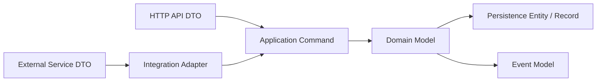
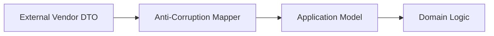

# Part 050 — MapStruct and DTO-Domain-Entity Boundaries

> Fokus part ini: memahami kenapa mapping layer penting dalam service enterprise, bagaimana MapStruct membantu mapping compile-time, bagaimana menjaga batas antara API DTO, domain object, persistence entity, XML/JSON model, event model, dan integration model, serta bagaimana mereview mapping agar tidak menciptakan coupling tersembunyi.

Mapping sering dianggap membosankan.

Di sistem kecil, mungkin benar.

Di sistem enterprise, mapping adalah boundary control.

Tanpa mapping discipline, sistem biasanya jatuh ke pola seperti ini:

```text
JAX-RS Resource returns database entity directly.
Kafka event reuses REST response DTO.
MyBatis entity contains JSON annotation.
Domain object contains JAXB annotation.
External vendor model leaks into core service.
Pricing field changes break API and database together.
```

Itu bukan efisiensi.

Itu coupling.

---

## 1. Core Mental Model

Setiap layer punya model sendiri karena setiap layer punya alasan berubah yang berbeda.



Model boundary umum:

```text
API DTO
  Shape contract untuk HTTP consumer.

Application command/query
  Intent yang diproses use case.

Domain model
  Business invariant dan behavior.

Persistence entity/record
  Shape penyimpanan database.

Event model
  Contract untuk async consumer.

External integration DTO
  Shape milik sistem lain.
```

Mapping mengubah satu model ke model lain.

Senior view:

```text
Mapping is not copying fields.
Mapping is translating between contracts.
```

---

## 2. Why Not Reuse One Model Everywhere?

One model everywhere looks simple:

```java
public class Quote {
    private String id;
    private String status;
    private BigDecimal totalPrice;
}
```

It becomes tempting to use it as:

```text
- JSON request
- JSON response
- domain object
- database entity
- Kafka event
- XML payload
- external API payload
```

That creates several risks:

```text
API change forces DB/domain change.
DB column leaks to API.
Internal status leaks to external client.
Event compatibility follows REST compatibility accidentally.
Validation annotations mix with persistence annotations.
Serialization annotations pollute domain model.
Security-sensitive fields accidentally exposed.
```

Model reuse is not automatically bad.

But reuse across architectural boundaries must be justified.

---

## 3. Boundary Types

### 3.1 API DTO

Owned by HTTP contract.

Example:

```java
public record CreateQuoteRequest(
        String customerId,
        List<CreateQuoteItemRequest> items,
        String requestedCurrency
) {}
```

Concern:

```text
- JSON/XML field name
- validation
- backward compatibility
- OpenAPI docs
- error reporting
```

Should not contain:

```text
- database column logic
- SQL mapping
- business behavior that needs invariants
- Kafka topic naming
```

### 3.2 Application Command

Owned by use case.

```java
public record CreateQuoteCommand(
        CustomerId customerId,
        List<CreateQuoteLineCommand> lines,
        Currency currency
) {}
```

Concern:

```text
- use case intent
- normalized input
- typed identifiers
- validated shape before domain mutation
```

### 3.3 Domain Model

Owned by business invariants.

```java
public final class Quote {
    private final QuoteId id;
    private QuoteStatus status;
    private Money total;

    public void submit() {
        if (status != QuoteStatus.DRAFT) {
            throw new InvalidQuoteTransitionException(id, status, QuoteStatus.SUBMITTED);
        }
        this.status = QuoteStatus.SUBMITTED;
    }
}
```

Concern:

```text
- invariant
- state transition
- domain language
- correctness
```

Should not know:

```text
- HTTP status codes
- JSON annotation
- database table name
- Kafka serialization
```

### 3.4 Persistence Entity / Record

Owned by storage.

```java
public record QuoteRow(
        UUID id,
        String status,
        BigDecimal totalAmount,
        String currency,
        OffsetDateTime createdAt
) {}
```

Concern:

```text
- table/column shape
- SQL result mapping
- migration compatibility
- indexing/query behavior
```

### 3.5 Event Model

Owned by async contract.

```java
public record QuoteSubmittedEvent(
        String eventId,
        String quoteId,
        String tenantId,
        String occurredAt,
        String schemaVersion
) {}
```

Concern:

```text
- event compatibility
- replay
- idempotency
- consumer tolerance
- schema registry
```

---

## 4. Where MapStruct Fits

MapStruct generates mapping code at compile time.

Instead of reflection-heavy runtime mapping, it creates Java implementation classes during compilation.

Example mapper:

```java
import org.mapstruct.Mapper;
import org.mapstruct.Mapping;

@Mapper(componentModel = "jakarta")
public interface QuoteApiMapper {

    @Mapping(target = "currency", source = "requestedCurrency")
    CreateQuoteCommand toCommand(CreateQuoteRequest request);
}
```

Generated implementation is ordinary Java code.

Benefits:

```text
- compile-time feedback
- fast runtime performance
- explicit mapping rules
- less reflection magic
- easier to inspect generated code
```

Risks:

```text
- implicit field-by-field mapping hides semantic mismatch
- unmapped fields ignored accidentally
- nested mapping becomes too magical
- business logic sneaks into mapper
- mapper becomes a dumping ground
```

---

## 5. MapStruct Component Model

MapStruct supports different component models.

Common choices:

```java
@Mapper(componentModel = "default")
```

Manual usage:

```java
QuoteMapper mapper = Mappers.getMapper(QuoteMapper.class);
```

Dependency-injected usage:

```java
@Mapper(componentModel = "jakarta")
public interface QuoteMapper {
}
```

or in some stacks:

```java
@Mapper(componentModel = "cdi")
```

or:

```java
@Mapper(componentModel = "spring")
```

For JAX-RS/Jersey/CDI/HK2 codebases, verify actual DI mechanism.

Internal verification:

```text
[ ] Which MapStruct component model is used?
[ ] Are mappers injected through CDI, HK2, manual factory, or static singleton?
[ ] Is generated implementation included in build output?
[ ] Are annotation processors enabled in IDE and CI?
[ ] Are mapper dependencies injectable in runtime container?
```

---

## 6. Explicit Mapping vs Convention Mapping

MapStruct maps same-name fields by convention.

Example:

```java
QuoteResponse toResponse(QuoteView view);
```

If both types have `id`, `status`, and `total`, mapping is automatic.

That is convenient.

But automatic mapping can hide compatibility risk.

Example:

```java
record QuoteView(String status) {}
record QuoteResponse(String status) {}
```

Both are strings.

But do they mean the same thing?

```text
Domain status: INTERNAL_REVIEW
API status: PENDING_APPROVAL
```

Senior rule:

```text
Use explicit mapping when semantics differ, even if types match.
```

---

## 7. Unmapped Target Policy

MapStruct can report unmapped fields.

Recommended for important boundaries:

```java
@Mapper(
    componentModel = "jakarta",
    unmappedTargetPolicy = ReportingPolicy.ERROR
)
public interface QuoteResponseMapper {
}
```

Why?

If a new response field is added, the compiler forces the team to decide how to map it.

This prevents silent omission.

Trade-off:

```text
ERROR policy:
  Safer for contract boundaries.
  More maintenance overhead.

WARN policy:
  Easier development.
  Can hide missing fields.

IGNORE policy:
  Dangerous unless intentionally scoped.
```

Internal verification:

```text
[ ] What is global unmappedTargetPolicy?
[ ] Are critical mappers using ERROR?
[ ] Are ignored fields documented?
[ ] Are warnings failing CI?
```

---

## 8. Ignore Fields Intentionally

Ignoring fields is sometimes valid.

Example:

```java
@Mapper(componentModel = "jakarta", unmappedTargetPolicy = ReportingPolicy.ERROR)
public interface QuoteMapper {

    @Mapping(target = "id", ignore = true)
    @Mapping(target = "status", constant = "DRAFT")
    Quote toNewQuote(CreateQuoteCommand command);
}
```

This says:

```text
id is generated elsewhere.
status is initialized by business rule.
```

Bad ignore:

```java
@Mapping(target = "tenantId", ignore = true)
```

without explanation.

That may cause tenant isolation failure.

Senior review question:

```text
Is ignored data irrelevant, generated, forbidden, or accidentally dropped?
```

---

## 9. Mapping and Validation Boundary

Do not use mapper as validation engine.

Bad:

```java
public CreateQuoteCommand toCommand(CreateQuoteRequest request) {
    if (request.customerId() == null) {
        throw new BadRequestException("customerId required");
    }
    // map
}
```

Better boundary:

```text
JAX-RS DTO validation
  checks API input shape.

Mapper
  translates validated DTO into command.

Application service/domain
  checks business invariant.
```

MapStruct can perform simple conversions.

It should not become policy engine.

---

## 10. Type Conversion

MapStruct can convert basic types.

But important conversions should be explicit.

Example:

```java
@Named("toCustomerId")
default CustomerId toCustomerId(String value) {
    return CustomerId.parse(value);
}
```

Used as:

```java
@Mapping(target = "customerId", source = "customerId", qualifiedByName = "toCustomerId")
CreateQuoteCommand toCommand(CreateQuoteRequest request);
```

Good candidates for explicit conversion:

```text
- String -> typed ID
- String -> enum code
- String -> Currency
- BigDecimal -> Money
- OffsetDateTime -> Instant
- external status -> internal status
- tenant string -> TenantId
```

Dangerous automatic conversions:

```text
- date/time conversion with timezone loss
- BigDecimal to double
- enum by name when external code differs
- null to default without policy
```

---

## 11. Null Mapping Strategy

Null behavior is a business decision.

MapStruct options include strategies around null values.

Examples of policy questions:

```text
For create request:
  Null may mean invalid input.

For patch request:
  Null may mean clear value.

For partial update:
  Missing may mean unchanged.

For response:
  Null may mean unknown, not applicable, hidden, or unset.
```

Do not let MapStruct default behavior decide this silently.

Patch/update mapping is especially risky.

Example:

```java
void updateEntityFromPatch(PatchQuoteRequest request, @MappingTarget QuoteEntity entity);
```

If null values overwrite existing entity fields accidentally, data loss can happen.

Internal verification:

```text
[ ] Are null strategies explicit for update mappers?
[ ] Is PATCH behavior documented?
[ ] Are missing and null distinguishable?
[ ] Are tests covering null/absent/empty cases?
```

---

## 12. Update Mapping and `@MappingTarget`

MapStruct can update an existing object.

```java
void updateEntity(QuoteUpdateCommand command, @MappingTarget QuoteRowBuilder builder);
```

or:

```java
void updateEntity(QuotePatchRequest request, @MappingTarget QuoteEntity entity);
```

This is useful but dangerous.

Risks:

```text
- overwrites immutable/audit fields
- clears tenant ID
- clears optimistic lock version
- bypasses domain transition rules
- applies API patch directly to persistence entity
```

Senior rule:

```text
Do not apply external patch DTO directly to persistence entity unless deliberately designed and tested.
```

Prefer:

```text
PatchRequest -> PatchCommand -> Domain method -> Entity persistence mapping
```

---

## 13. Nested Mapping

Nested mapping can be convenient:

```java
QuoteResponse toResponse(QuoteView view);
QuoteItemResponse toResponse(QuoteItemView item);
```

MapStruct can use one mapping method inside another.

Risk:

```text
A nested mapper changes behavior and affects many endpoints.
```

Guideline:

```text
Make shared nested mappers stable and tested.
Do not hide endpoint-specific contract decisions in generic nested mappers.
```

Example problem:

```text
Quote item response for quote detail needs full price breakdown.
Quote item response for search result needs summary only.
A shared mapper accidentally exposes too much data in search result.
```

---

## 14. Mapping Collections

Mapping collections seems trivial:

```java
List<QuoteItemResponse> toResponses(List<QuoteItemView> items);
```

But in enterprise systems, collection mapping may need:

```text
- stable ordering
- filtering unauthorized items
- pagination boundary
- max size enforcement
- redaction
- partial response field selection
```

Do not hide access control in MapStruct.

Authorization/filtering should usually happen before mapping or in a clearly named projection layer.

---

## 15. Mapping Domain to API Response

Avoid returning domain object directly.

Better:

```text
Domain model -> Application view/read model -> API response DTO
```

Example:

```java
public record QuoteSummaryView(
        String id,
        String status,
        BigDecimal totalAmount,
        String currency
) {}

public record QuoteSummaryResponse(
        String id,
        String status,
        MoneyResponse total
) {}
```

Mapper:

```java
@Mapper(componentModel = "jakarta")
public interface QuoteResponseMapper {
    @Mapping(target = "total.amount", source = "totalAmount")
    @Mapping(target = "total.currency", source = "currency")
    QuoteSummaryResponse toResponse(QuoteSummaryView view);
}
```

This keeps API shape separate from domain internals.

---

## 16. Mapping API Request to Domain Command

Example:

```java
public record CreateQuoteRequest(
        String customerId,
        List<CreateQuoteItemRequest> items,
        String currency
) {}

public record CreateQuoteCommand(
        CustomerId customerId,
        List<CreateQuoteLineCommand> lines,
        Currency currency
) {}
```

Mapper:

```java
@Mapper(componentModel = "jakarta", uses = {IdMapper.class, MoneyMapper.class})
public interface QuoteCommandMapper {

    @Mapping(target = "lines", source = "items")
    CreateQuoteCommand toCommand(CreateQuoteRequest request);
}
```

The mapper translates API language to application language.

It should not decide whether the quote is allowed.

That belongs to application/domain logic.

---

## 17. Mapping Domain to Persistence

Persistence mapping should respect persistence concerns:

```text
- IDs
- optimistic lock version
- audit fields
- tenant ID
- soft delete flag
- createdAt/updatedAt
- JSONB columns
- denormalized search fields
```

Example:

```java
@Mapper(componentModel = "jakarta")
public interface QuotePersistenceMapper {

    @Mapping(target = "status", source = "status.code")
    @Mapping(target = "totalAmount", source = "total.amount")
    @Mapping(target = "currency", source = "total.currency.currencyCode")
    QuoteRow toRow(Quote quote);
}
```

Important:

```text
Persistence mapping can be lossy.
```

That is acceptable only when intentional.

---

## 18. Mapping Persistence to Domain

Loading from DB into domain object is not just field copy.

It may need:

```text
- invariant reconstruction
- enum/status validation
- Money object creation
- tenant consistency check
- deleted/archive state handling
- version field handling
```

Danger:

```text
DB row contains invalid state due to old bug or manual patch.
Mapper reconstructs invalid domain silently.
```

Possible strategies:

```text
Strict reconstruction:
  Fail if row is invalid.

Tolerant reconstruction:
  Load invalid legacy rows but mark degraded.

Migration-first:
  Fix data before code relies on stricter invariant.
```

Senior engineers ask:

```text
What happens if persisted data violates current domain assumptions?
```

---

## 19. Mapping Event Models

Event model should not be reused from API response.

Reason:

```text
API response is optimized for synchronous client needs.
Event is optimized for async consumer needs and replay.
```

Event mapper example:

```java
@Mapper(componentModel = "jakarta")
public interface QuoteEventMapper {

    @Mapping(target = "eventId", expression = "java(eventIdProvider.newId())")
    @Mapping(target = "occurredAt", expression = "java(clock.instant().toString())")
    QuoteSubmittedEvent toEvent(Quote quote, TenantId tenantId);
}
```

Be careful with expressions that call services.

MapStruct mappers should stay predictable.

For event metadata, often better:

```text
Domain/Event factory creates envelope metadata.
Mapper maps payload only.
```

---

## 20. Mapping External Integration Models

External service DTOs are not your domain.

Example:

```text
ExternalCatalogProductResponse
  belongs to vendor/system contract.

ProductCatalogEntry
  belongs to your application/domain model.
```

Mapper acts as anti-corruption layer.



Do not let vendor naming, statuses, or error codes leak into domain model unless intentionally normalized.

---

## 21. Mapping and Security Redaction

Mapping can accidentally expose fields.

Example:

```java
record UserEntity(
    String id,
    String email,
    String passwordHash,
    String internalRiskScore
) {}

record UserResponse(
    String id,
    String email
) {}
```

If someone maps entity directly to response and later adds same-name field to response, exposure risk increases.

PR review:

```text
[ ] Does response DTO include only approved fields?
[ ] Are internal fields excluded explicitly?
[ ] Are tenant/customer-sensitive fields redacted?
[ ] Are audit/security fields never exposed accidentally?
```

Use allow-list response mapping.

Avoid broad generic mapping for external responses.

---

## 22. Mapping and Multi-Tenancy

Tenant fields are sensitive.

Risks:

```text
- tenantId missing from command
- tenantId overwritten by request body
- tenantId mapped from untrusted client input
- tenantId lost in event payload
- tenant-specific config not applied during mapping
```

Rule:

```text
Tenant identity should usually come from trusted context, not request body.
```

Example:

```java
CreateQuoteCommand toCommand(CreateQuoteRequest request, @Context TenantContext tenantContext);
```

But consider whether mapper should accept context or application service should construct command explicitly.

Clarity beats cleverness.

---

## 23. MapStruct Context Parameter

MapStruct supports context parameters.

```java
CreateQuoteCommand toCommand(CreateQuoteRequest request, @Context MappingContext context);
```

This can be useful for:

```text
- locale
- timezone
- tenant context
- formatting rules
- lookup cache
```

But it can also hide dependencies.

If mapping requires database or remote calls, stop and reconsider.

Mapper should not become orchestration layer.

---

## 24. `@AfterMapping` and `@BeforeMapping`

MapStruct supports hooks.

```java
@AfterMapping
protected void normalize(@MappingTarget CreateQuoteCommand command) {
    // post-processing
}
```

Use sparingly.

Risks:

```text
- hidden mutation
- business rules inside mapper
- hard-to-test behavior
- surprising side effect
```

Acceptable uses:

```text
- simple normalization
- derived presentation fields
- defaulting that belongs to boundary model
```

Question:

```text
If this hook failed, would it be a business rule failure?
```

If yes, it probably belongs outside mapper.

---

## 25. Mapper Package Structure

Recommended separation:

```text
api.mapper
  HTTP DTO <-> command/view

persistence.mapper
  domain/view <-> row/entity

event.mapper
  domain/event payload mapping

integration.catalog.mapper
  external catalog DTO <-> application model

integration.payment.mapper
  external payment DTO <-> application model
```

Avoid:

```text
common.mapper.EverythingMapper
```

A generic shared mapper tends to become an architectural junk drawer.

---

## 26. Testing Mappers

Mapper tests are valuable when mapping has semantic meaning.

Test cases:

```text
- required fields mapped
- ignored fields intentionally not mapped
- enum/status conversion
- money/currency conversion
- date/time conversion
- null behavior
- nested collection mapping
- redaction/security-sensitive fields
- tenant propagation
- event schema compatibility
```

Not every trivial mapper needs exhaustive tests.

But critical boundary mappers should be tested.

Example:

```java
@Test
void mapsCreateQuoteRequestToCommand() {
    CreateQuoteRequest request = new CreateQuoteRequest(
            "C-100",
            List.of(new CreateQuoteItemRequest("SKU-1", 2)),
            "USD"
    );

    CreateQuoteCommand command = mapper.toCommand(request);

    assertThat(command.customerId()).isEqualTo(CustomerId.of("C-100"));
    assertThat(command.currency()).isEqualTo(Currency.getInstance("USD"));
    assertThat(command.lines()).hasSize(1);
}
```

---

## 27. Generated Code Inspection

MapStruct generated code can reveal surprises.

Look under build output such as:

```text
target/generated-sources/annotations
```

Review generated code when:

```text
- mapping behavior is unclear
- null behavior is surprising
- nested mapper is selected unexpectedly
- performance concern exists
- DI injection fails
- annotation processor behavior differs between IDE and CI
```

Senior tip:

```text
If you cannot explain the generated mapper, do not trust the mapper blindly.
```

---

## 28. MapStruct with Records and Immutability

Java records are useful DTOs.

```java
public record QuoteResponse(String id, String status) {}
```

MapStruct can map to records through canonical constructor.

Immutability benefits:

```text
- safer DTOs
- clearer construction
- fewer accidental mutations
- easier testing
```

Challenges:

```text
- update mapping not applicable
- default values need explicit construction
- complex nested construction may need factory methods
```

For domain models, immutability is valuable but requires careful reconstruction from persistence.

---

## 29. Mapping Performance

MapStruct is usually fast because it generates direct method calls.

But mapping can still be expensive if:

```text
- huge collections are mapped repeatedly
- mapping triggers lazy loads
- mapping performs lookups
- mapping allocates large nested object graphs
- response returns too much data
```

Performance checklist:

```text
[ ] Are list endpoints mapping thousands of objects?
[ ] Is pagination applied before mapping?
[ ] Does mapping trigger N+1 query?
[ ] Are expensive derived fields computed per item?
[ ] Is response shape too heavy for search/list API?
```

Mapping does not fix bad query/projection design.

---

## 30. Mapping and Partial Response

If API supports partial response or field selection, mapping must be aligned.

Options:

```text
- map full response then filter fields
- use endpoint-specific response DTO
- use projection query matching requested fields
- use view model per API use case
```

Trade-off:

```text
Full map then filter:
  Simple but may over-fetch/over-compute.

Endpoint-specific DTO:
  Explicit and safe, more classes.

Projection query:
  Efficient but more query complexity.
```

For high-volume endpoints, prefer projections and explicit DTOs.

---

## 31. Mapping and Backward Compatibility

Mapping change can be breaking even if DTO class did not change.

Example:

```text
Before:
  API status = APPROVED

After:
  API status = QUOTE_APPROVED
```

Same field.

Different value.

Breaking change.

Compatibility-sensitive mapping areas:

```text
- enum/status conversion
- date/time formatting
- monetary scale
- null/default behavior
- list ordering
- identifier format
- redacted fields
- deprecated fields
```

PR review must inspect mapper changes, not only DTO changes.

---

## 32. Mapping and Database Migration

When schema changes, mapper changes often follow.

Expand-contract example:

```text
Release 1:
  Add new nullable column.
  Mapper still writes old column.

Release 2:
  Mapper writes both old and new.
  Backfill existing rows.

Release 3:
  Mapper reads new, fallback old.

Release 4:
  Remove old column usage.
```

Mapping layer is central to safe migration.

Internal verification:

```text
[ ] Does mapper support old and new schema during rollout?
[ ] Is rollback safe if mapper writes new fields?
[ ] Is backfill coordinated with mapper behavior?
[ ] Are read fallback rules tested?
```

---

## 33. Mapping and Event Evolution

Event mapping must respect schema compatibility.

Adding optional event field:

```text
Domain has new value.
Event mapper adds optional field.
Schema compatibility check passes.
Old consumers ignore field.
```

Breaking event mapping:

```text
Mapper changes meaning of existing field.
Schema still passes because type is same.
Consumers break semantically.
```

Important:

```text
Schema compatibility is necessary but not sufficient.
Semantic compatibility must be reviewed.
```

---

## 34. Common Anti-Patterns

### Anti-pattern 1 — Entity as API Response

```java
@GET
public QuoteEntity getQuote() {
    return repository.find(...);
}
```

Problems:

```text
- exposes DB shape
- leaks internal fields
- ties API to migration
- weakens compatibility control
```

### Anti-pattern 2 — API DTO as Domain Model

```text
Request DTO carries validation, JSON names, and is mutated by domain logic.
```

Problem:

```text
Transport concern pollutes business logic.
```

### Anti-pattern 3 — Event Reuses REST DTO

```text
Kafka event payload = REST response DTO
```

Problem:

```text
Synchronous and asynchronous contracts evolve differently.
```

### Anti-pattern 4 — Generic Mapper Utility

```java
mapper.map(source, Target.class)
```

Problem:

```text
No explicit semantic mapping.
Reviewers cannot see contract decisions.
```

### Anti-pattern 5 — Business Rule in Mapper

```text
Mapper decides discount eligibility, quote transition, or tenant access.
```

Problem:

```text
Business behavior hides in translation layer.
```

---

## 35. Internal Verification Checklist

For CSG Quote & Order or similar enterprise systems, verify:

```text
[ ] Is MapStruct used?
[ ] Which version is used?
[ ] Which component model is configured?
[ ] Are annotation processors configured in Maven and IDE?
[ ] Are mappers separated by boundary: API, persistence, event, integration?
[ ] Are domain objects free from JSON/XML/SQL annotations?
[ ] Are persistence entities/rows not returned directly from resources?
[ ] Are event models separate from REST DTOs?
[ ] Are tenant fields mapped from trusted context?
[ ] Are monetary/date/time conversions explicit?
[ ] Are ignored fields documented?
[ ] Is unmappedTargetPolicy strict enough?
[ ] Are mapper tests present for critical boundary mappings?
[ ] Are generated mapper implementations inspected when behavior is unclear?
```

---

## 36. PR Review Checklist

When reviewing mapper/model-boundary changes:

```text
[ ] What boundary does this mapper cross?
[ ] Is the mapping semantic or mere field copy?
[ ] Are API DTO, domain model, persistence entity, and event model still separate?
[ ] Are new fields mapped intentionally?
[ ] Are ignored fields justified?
[ ] Does mapping preserve tenant isolation?
[ ] Does mapping expose sensitive/internal fields?
[ ] Are enum/status conversions compatible?
[ ] Are date/time/currency conversions explicit?
[ ] Is null behavior safe?
[ ] Does PATCH/update mapping avoid data loss?
[ ] Does mapping trigger N+1 or excessive allocation?
[ ] Are mapper tests updated?
[ ] Is event/API compatibility affected?
[ ] Is migration rollout compatibility preserved?
```

---

## 37. Senior-Level Rule of Thumb

Mapping is architecture.

```text
A DTO is a contract.
A domain object is an invariant boundary.
A persistence entity is a storage boundary.
An event model is an async contract.
An integration DTO is someone else's contract.
A mapper is the translation layer between those worlds.
```

Prefer:

```text
- explicit boundary models
- MapStruct compile-time mapping
- strict unmapped field policy for critical contracts
- explicit conversions for IDs, enums, money, time
- dedicated mappers per boundary
- mapper tests for compatibility-sensitive mappings
```

Avoid:

```text
- returning entities from resources
- sharing REST DTOs as Kafka events
- putting JSON/XML/SQL annotations in domain models
- hiding business logic in mappers
- ignoring unmapped fields silently
- mapping tenant ID from untrusted request body
```

---

## 38. What You Should Be Able to Do After This Part

After this part, you should be able to:

```text
[ ] Explain why enterprise systems need separate API, domain, persistence, event, and integration models.
[ ] Use MapStruct as compile-time mapping, not hidden architecture magic.
[ ] Identify when model reuse is safe and when it creates coupling.
[ ] Review mapper changes for compatibility, security, tenancy, precision, and migration risks.
[ ] Debug MapStruct generation, DI, and null mapping issues.
[ ] Design mapper package structure by boundary.
[ ] Prevent DTO/domain/entity leakage in JAX-RS services.
```

---

# Summary

MapStruct is useful because it makes mapping explicit, fast, and compile-time checked.

But the deeper topic is not MapStruct.

The deeper topic is boundary discipline.

JAX-RS API DTOs, domain models, persistence entities, event payloads, XML models, and external integration DTOs have different reasons to change.

Senior engineers protect those boundaries.

They use mapping not as boilerplate, but as controlled translation between contracts.
