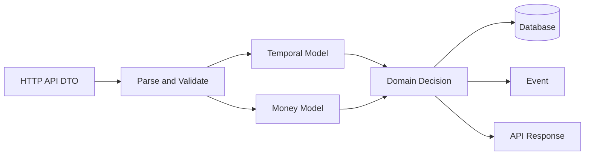

# Part 051 — Date, Time, Currency, and Precision

> Fokus part ini: memahami kenapa date/time/currency/precision adalah correctness boundary di enterprise backend, terutama pada sistem quote/order/CPQ/catalog/pricing. Materi ini tidak mengasumsikan detail internal CSG; semua model tenancy, catalog, pricing, tax, dan effective date harus diverifikasi di codebase dan dokumentasi internal.

Bug date/time dan money biasanya tidak terlihat seperti bug teknis.

Ia terlihat seperti:

```text
Quote expired too early.
Discount applied to wrong catalog version.
Order activated one day late.
Price changed at midnight in one region but not another.
Tax rounded differently between UI, backend, invoice, and downstream billing.
Same request returns different price before and after daylight saving transition.
```

Dalam sistem enterprise, terutama CPQ/order management, date/time/currency bukan field biasa.

Mereka adalah bagian dari contract correctness.

---

## 1. Core Mental Model

Ada tiga jenis correctness yang sering tercampur:

```text
Temporal correctness
  Apakah waktu, tanggal, effective period, expiry, dan ordering event benar?

Monetary correctness
  Apakah amount, currency, scale, rounding, dan tax boundary benar?

Serialization correctness
  Apakah representasi HTTP/JSON/XML/database/event tidak mengubah makna?
```

Mental model sederhana:



Senior engineer harus selalu bertanya:

```text
Apakah field ini merepresentasikan instant, local date, business date, effective period, atau display-only date?
Apakah amount ini exact money, calculated intermediate, tax base, rounded display value, atau persisted official amount?
Apakah timezone/currency/rounding policy eksplisit atau diasumsikan diam-diam?
```

---

## 2. Why This Matters in Enterprise CPQ/Order Systems

Pada aplikasi quote/order, banyak keputusan bergantung pada waktu dan uang:

```text
- catalog version selection
- product availability
- price list validity
- promotion eligibility
- discount validity
- contract start/end date
- quote expiration
- order activation date
- billing cycle alignment
- tax calculation boundary
- currency conversion timing
- SLA measurement
- audit chronology
```

Jika model temporal/monetary salah, hasilnya bukan hanya exception.

Hasilnya bisa berupa keputusan bisnis yang salah tetapi tetap terlihat valid.

Contoh:

```text
A quote was created at 2026-07-10T17:05+07:00.
Catalog version changes at 2026-07-10T00:00Z.
Pricing engine uses local date Asia/Jakarta.
Order service uses UTC instant.
Billing uses customer billing timezone.
```

Tanpa policy eksplisit, setiap service bisa memilih catalog version berbeda.

---

## 3. Java Time Types: Do Not Treat Them as Interchangeable

Java 17 menyediakan `java.time`, tetapi pemilihan type tetap harus tepat.

### 3.1 `Instant`

Gunakan untuk titik waktu global.

```java
Instant createdAt = Instant.now(clock);
```

Cocok untuk:

```text
- audit timestamp
- event timestamp
- creation/update timestamp
- expiry absolute timestamp
- log chronology
- distributed tracing timestamp
```

Karakteristik:

```text
- UTC-based
- no timezone display context
- good for ordering events globally
```

### 3.2 `OffsetDateTime`

Gunakan ketika offset dari UTC perlu dipertahankan dalam contract.

```java
OffsetDateTime submittedAt = OffsetDateTime.now(clock);
```

Cocok untuk:

```text
- API contract yang menyertakan offset
- external integration yang mengharuskan ISO-8601 dengan offset
```

Hati-hati:

```text
Offset is not full timezone rule.
+07:00 is not the same concept as Asia/Jakarta.
```

### 3.3 `ZonedDateTime`

Gunakan ketika aturan timezone region penting.

```java
ZonedDateTime activationTime = instant.atZone(ZoneId.of("Asia/Jakarta"));
```

Cocok untuk:

```text
- business schedule berdasarkan regional timezone
- daylight saving sensitive logic
- local business calendar conversion
```

### 3.4 `LocalDate`

Gunakan untuk business date tanpa jam.

```java
LocalDate effectiveDate = LocalDate.of(2026, 7, 10);
```

Cocok untuk:

```text
- catalog effective date
- pricing effective date
- contract date
- invoice date
- billing period date
```

Risiko:

```text
LocalDate has no timezone.
Converting LocalDate to Instant requires a ZoneId and boundary rule.
```

### 3.5 `LocalDateTime`

Gunakan dengan sangat hati-hati.

```java
LocalDateTime local = LocalDateTime.of(2026, 7, 10, 9, 0);
```

`LocalDateTime` tidak punya timezone dan tidak merepresentasikan instant global.

Banyak bug muncul ketika `LocalDateTime` diperlakukan seperti timestamp universal.

Gunakan hanya jika:

```text
- input memang local tanpa timezone
- timezone disediakan terpisah
- conversion policy eksplisit
```

---

## 4. Temporal Vocabulary You Must Make Explicit

Jangan hanya memakai nama field `date`.

Nama field harus menjelaskan semantics.

Buruk:

```java
private LocalDate date;
private String time;
private Instant valid;
```

Lebih baik:

```java
private Instant quoteCreatedAt;
private Instant quoteExpiresAt;
private LocalDate catalogEffectiveDate;
private LocalDate priceEffectiveDate;
private LocalDate contractStartDate;
private LocalDate contractEndDate;
private ZoneId customerBillingZone;
```

Vocabulary yang harus dibedakan:

```text
createdAt
  Kapan record dibuat secara teknis.

updatedAt
  Kapan record terakhir diubah.

submittedAt
  Kapan user/system melakukan submit.

effectiveFrom / effectiveTo
  Kapan rule mulai/berakhir berlaku.

validFrom / validTo
  Rentang validitas business object.

expiresAt
  Kapan object tidak boleh dipakai lagi.

businessDate
  Tanggal bisnis yang digunakan untuk keputusan domain.

processingDate
  Tanggal batch/job memproses data.

eventOccurredAt
  Kapan event bisnis terjadi.

messagePublishedAt
  Kapan event dipublish secara teknis.
```

Senior review rule:

```text
If a field is named date/time without semantics, request clarification.
```

---

## 5. UTC vs Local Time

Rule praktis:

```text
Store technical chronology as Instant/UTC.
Evaluate business rules using explicit business timezone/date policy.
Serialize external contract with explicit format and timezone/offset semantics.
```

### 5.1 Store UTC for Technical Timestamps

```java
public record AuditStamp(
        Instant createdAt,
        String createdBy,
        Instant updatedAt,
        String updatedBy
) {}
```

Cocok untuk:

```text
- audit
- logs
- database created_at
- event metadata
- tracing
```

### 5.2 Use Local Business Date for Business Validity

```java
public record PriceValidity(
        LocalDate validFrom,
        LocalDate validTo
) {
    public boolean isValidOn(LocalDate businessDate) {
        return !businessDate.isBefore(validFrom)
                && (validTo == null || businessDate.isBefore(validTo));
    }
}
```

Perhatikan boundary:

```text
validTo exclusive is usually easier than inclusive end date.
```

Tetapi internal policy harus diverifikasi.

---

## 6. Effective Date and Validity Window

Effective date adalah salah satu konsep paling penting di CPQ/catalog/pricing.

Contoh:

```text
Product A exists in catalog version 2026.07.
Price P1 valid from 2026-07-01 to 2026-08-01.
Promotion D10 valid from 2026-07-10 to 2026-07-15.
Quote created on 2026-07-10.
Order submitted on 2026-07-16.
```

Pertanyaan domain:

```text
Should pricing be locked at quote creation?
Should order submission re-price?
Should catalog version follow quote date, order date, or requested activation date?
Can quote be amended using original catalog version?
```

Jangan jawab dari asumsi.

Harus ada policy internal.

### 6.1 Half-Open Interval

Untuk interval temporal, preferensi umum di engineering adalah half-open interval:

```text
[validFrom, validTo)
```

Artinya:

```text
validFrom inclusive
validTo exclusive
```

Contoh:

```java
public record ValidityWindow(
        LocalDate validFrom,
        LocalDate validToExclusive
) {
    public boolean contains(LocalDate date) {
        return !date.isBefore(validFrom)
                && (validToExclusive == null || date.isBefore(validToExclusive));
    }
}
```

Keuntungan:

```text
- avoids end-of-day ambiguity
- easy adjacent windows
- easier database query
```

Adjacent windows:

```text
[2026-07-01, 2026-08-01)
[2026-08-01, 2026-09-01)
```

Tidak overlap dan tidak gap.

---

## 7. Catalog Version Effective Date

Catalog-driven system biasanya punya beberapa pilihan version selection:

```text
current catalog version
quote creation effective catalog
requested activation date catalog
customer contract catalog
tenant-specific catalog
manual override catalog
```

Model yang buruk:

```java
Product product = catalogService.findProduct(productId);
```

Model yang lebih eksplisit:

```java
Product product = catalogService.findProduct(
        productId,
        new CatalogSelectionContext(
                tenantId,
                businessDate,
                customerSegment,
                channel
        )
);
```

Dalam sistem enterprise, catalog lookup hampir tidak pernah hanya by `productId`.

Ia sering by:

```text
- tenant
- market/region
- channel
- customer segment
- effective date
- catalog version
- product lifecycle status
- compatibility rules
```

Internal verification checklist penting:

```text
- catalog version dipilih berdasarkan tanggal apa?
- apakah quote menyimpan catalog version snapshot?
- apakah order re-evaluate catalog saat submit?
- apakah catalog bisa berbeda per tenant/region/channel?
- apakah ada compatibility rule antara old quote dan new catalog?
```

---

## 8. Pricing Effective Date

Pricing effective date tidak selalu sama dengan catalog effective date.

Contoh field yang harus dibedakan:

```text
catalogEffectiveDate
priceEffectiveDate
promotionEffectiveDate
taxEffectiveDate
contractEffectiveDate
```

Pricing decision dapat bergantung pada:

```text
- quote creation date
- requested service activation date
- order submission date
- billing start date
- promotion campaign date
- contract amendment date
```

Contoh model:

```java
public record PricingContext(
        TenantId tenantId,
        CustomerId customerId,
        Currency currency,
        LocalDate priceEffectiveDate,
        ZoneId businessZone,
        String salesChannel
) {}
```

Review warning:

```text
If pricing uses LocalDate.now() internally, it is probably wrong.
```

Prefer passing explicit `PricingContext`.

---

## 9. Clock Abstraction for Testing

Jangan panggil `Instant.now()` langsung di domain logic.

Buruk:

```java
public boolean isExpired() {
    return Instant.now().isAfter(expiresAt);
}
```

Lebih baik:

```java
public boolean isExpired(Instant now) {
    return now.isAfter(expiresAt);
}
```

Atau inject `Clock` di application service:

```java
public final class QuoteApplicationService {
    private final Clock clock;

    public QuoteApplicationService(Clock clock) {
        this.clock = clock;
    }

    public void submitQuote(QuoteId quoteId) {
        Instant now = Instant.now(clock);
        Quote quote = quoteRepository.get(quoteId);
        quote.submit(now);
    }
}
```

Test:

```java
Clock fixedClock = Clock.fixed(
        Instant.parse("2026-07-10T10:15:30Z"),
        ZoneOffset.UTC
);
```

Benefit:

```text
- deterministic test
- reproducible expiry behavior
- test temporal edge cases
- no midnight flaky test
```

---

## 10. Date/Time Serialization in JAX-RS APIs

API contract harus eksplisit.

Contoh JSON:

```json
{
  "quoteId": "Q-1001",
  "createdAt": "2026-07-10T03:15:30Z",
  "expiresAt": "2026-07-17T03:15:30Z",
  "priceEffectiveDate": "2026-07-10",
  "customerTimezone": "Asia/Jakarta"
}
```

Guideline:

```text
Instant -> ISO-8601 UTC string, e.g. 2026-07-10T03:15:30Z
LocalDate -> ISO date, e.g. 2026-07-10
ZoneId -> explicit region ID, e.g. Asia/Jakarta
Do not serialize epoch millis unless required by legacy contract.
Do not serialize ambiguous local timestamp without timezone policy.
```

Jackson configuration harus diverifikasi:

```text
- JavaTimeModule registered?
- timestamps disabled?
- timezone override configured?
- date format consistent across services?
- null handling and default handling defined?
```

Contoh risk:

```java
objectMapper.setTimeZone(TimeZone.getDefault());
```

Ini bisa membuat serialization tergantung environment container.

---

## 11. Database Temporal Mapping

PostgreSQL temporal type harus dipilih sadar.

Common mapping:

```text
timestamp with time zone
  Usually maps well for Instant-like technical timestamp.

timestamp without time zone
  Local timestamp without timezone semantics; dangerous if misused.

date
  Good for LocalDate business date.

time
  Time of day without date; use carefully.
```

Recommended mental model:

```text
created_at / updated_at / published_at -> Instant/UTC concept
business_date / effective_date -> LocalDate concept
```

Database column naming harus membantu:

```sql
created_at            timestamptz not null
quote_expires_at      timestamptz not null
price_effective_date  date not null
valid_from_date       date not null
valid_to_date         date null
```

Anti-pattern:

```sql
date timestamp not null
```

`date` sebagai nama kolom menghilangkan semantics.

---

## 12. Timezone Handling Failure Modes

### 12.1 Default Timezone Drift

Bug:

```java
LocalDate today = LocalDate.now();
```

Di local developer machine:

```text
Asia/Jakarta
```

Di container:

```text
UTC
```

Akibat:

```text
pricing date berbeda
quote expiry berbeda
batch job memproses tanggal berbeda
```

Prefer:

```java
LocalDate businessDate = LocalDate.now(businessZone);
```

### 12.2 Midnight Boundary

Sistem yang berjalan di beberapa region sering gagal di midnight boundary.

Test wajib:

```text
- just before midnight local time
- just after midnight local time
- month end
- year end
- leap year
- DST transition if relevant timezone observes DST
```

### 12.3 Inclusive End Date Ambiguity

```text
validTo = 2026-07-10
```

Apakah valid sampai awal hari atau akhir hari?

Better:

```text
validToExclusive = 2026-07-11
```

Atau dokumentasikan explicit inclusive policy.

---

## 13. Currency Model

Currency bukan string bebas.

Buruk:

```java
public record Price(BigDecimal amount, String currency) {}
```

Lebih baik:

```java
public record Money(BigDecimal amount, Currency currency) {
    public Money {
        if (amount == null) throw new IllegalArgumentException("amount is required");
        if (currency == null) throw new IllegalArgumentException("currency is required");
    }
}
```

`java.util.Currency` bisa dipakai untuk ISO currency, tetapi internal requirement bisa lebih kompleks:

```text
- supported currency per tenant/market
- display precision
- accounting precision
- pricing precision
- tax precision
- legacy currency code
- non-standard internal currency/token
```

Jangan mengasumsikan semua amount punya 2 decimal places.

Contoh:

```text
JPY often has 0 minor unit.
BHD has 3 minor units.
Internal pricing calculation may need more scale than display.
```

---

## 14. BigDecimal Correctness

Untuk money, gunakan `BigDecimal`, bukan `double`.

Buruk:

```java
double total = 0.1 + 0.2;
```

Lebih baik:

```java
BigDecimal total = new BigDecimal("0.10").add(new BigDecimal("0.20"));
```

Jangan gunakan constructor dari double:

```java
new BigDecimal(0.1) // bad
```

Gunakan:

```java
BigDecimal.valueOf(0.1)       // acceptable for double source
new BigDecimal("0.10")       // best for literal exact decimal
```

### 14.1 Scale Matters

```java
new BigDecimal("10.0").equals(new BigDecimal("10.00")) // false
new BigDecimal("10.0").compareTo(new BigDecimal("10.00")) == 0 // true
```

Rule:

```text
Use compareTo for numeric equality.
Be careful using BigDecimal as Map key.
Normalize scale at boundaries if needed.
```

### 14.2 Rounding Must Be Explicit

Buruk:

```java
amount.divide(quantity);
```

Bisa throw `ArithmeticException` jika decimal non-terminating.

Lebih baik:

```java
amount.divide(quantity, 6, RoundingMode.HALF_UP);
```

Tetapi rounding mode harus berasal dari policy, bukan preferensi developer.

---

## 15. Rounding Policy

Rounding bukan detail teknis.

Rounding adalah business/legal/accounting policy.

Pertanyaan wajib:

```text
At stage mana rounding dilakukan?
Per line item?
Per tax component?
Per discount?
Per invoice total?
Per currency?
Per tenant/market?
```

Contoh perbedaan:

```text
Round each line then sum
  vs
Sum raw line amounts then round total
```

Hasil bisa berbeda.

Model yang lebih aman:

```java
public interface RoundingPolicy {
    BigDecimal roundMoney(BigDecimal amount, Currency currency);
    BigDecimal roundTax(BigDecimal amount, Currency currency);
    BigDecimal roundDisplay(BigDecimal amount, Currency currency);
}
```

Jangan hardcode:

```java
setScale(2, RoundingMode.HALF_UP)
```

Kecuali policy internal memang itu.

---

## 16. Tax Calculation Boundary

Tax calculation sering punya boundary khusus:

```text
- tax jurisdiction
- tax date
- customer address
- service address
- product tax category
- exemption status
- invoice date
- currency
- rounding rule
```

Jangan campur tax calculation sebagai bagian kecil dari DTO mapping.

Tax harus punya boundary eksplisit:

```java
public record TaxCalculationContext(
        TenantId tenantId,
        CustomerId customerId,
        LocalDate taxEffectiveDate,
        Currency currency,
        Address serviceAddress,
        List<TaxableLine> taxableLines
) {}
```

Failure mode:

```text
- tax date uses current date instead of invoice/effective date
- service address missing, fallback to billing address silently
- rounding differs between tax service and order service
- tax result not persisted, recalculation changes historical order
```

Internal verification checklist:

```text
- tax calculated internally or external service?
- what is authoritative tax date?
- is tax result persisted or recalculated?
- rounding done by which component?
- who owns tax error handling?
```

---

## 17. API DTO Example

```java
public record QuotePriceResponse(
        String quoteId,
        String currency,
        String subtotal,
        String discountTotal,
        String taxTotal,
        String grandTotal,
        LocalDate priceEffectiveDate,
        Instant pricedAt,
        String pricingPolicyVersion
) {}
```

Why amounts as String?

Some teams prefer string for exact decimal representation in JSON to avoid client floating-point parsing mistakes.

Other teams use JSON number with strict client guidance.

Do not decide casually.

Internal standard must decide:

```text
- JSON money as string or number?
- decimal scale included or normalized?
- currency as ISO code or internal code?
- amount formatting in API or UI only?
```

---

## 18. Event Model Example

For Kafka/event contracts, include enough temporal metadata to replay correctly.

```json
{
  "eventId": "evt-001",
  "eventType": "QuotePriced",
  "occurredAt": "2026-07-10T03:15:30Z",
  "publishedAt": "2026-07-10T03:15:31Z",
  "tenantId": "tenant-a",
  "quoteId": "Q-1001",
  "priceEffectiveDate": "2026-07-10",
  "currency": "USD",
  "grandTotal": "149.99",
  "pricingPolicyVersion": "pricing-policy-2026.07"
}
```

Replay warning:

```text
If event consumers recalculate price using current catalog/pricing rules during replay, replay may not reproduce original business decision.
```

Persist or publish the decision inputs needed for replay.

---

## 19. Testing Temporal and Monetary Edge Cases

Minimum test set:

```text
Temporal:
- before validFrom
- exactly at validFrom
- inside validity window
- exactly at validToExclusive
- after validToExclusive
- month end
- year end
- leap day
- timezone conversion
- default timezone changed to UTC

Monetary:
- zero amount
- negative amount if refunds/credits exist
- high precision input
- non-terminating division
- multi-line rounding
- tax rounding
- different currency minor units
- equality compare using scale difference
```

Example JUnit idea:

```java
@Test
void quoteExpiresExactlyAtExpiryInstant() {
    Instant expiresAt = Instant.parse("2026-07-10T10:00:00Z");
    Quote quote = new Quote(expiresAt);

    assertFalse(quote.isExpired(Instant.parse("2026-07-10T09:59:59Z")));
    assertTrue(quote.isExpired(Instant.parse("2026-07-10T10:00:00Z")));
}
```

---

## 20. Production Debugging Playbook

When investigating temporal/money bugs, collect facts first:

```text
Request ID / trace ID
Tenant/customer/market/channel
Input date/time fields
Server received timestamp
Business timezone used
Catalog version selected
Pricing effective date
Pricing policy version
Currency
Raw amounts before rounding
Rounding stage and mode
Persisted amount
Published event amount
Downstream amount
```

Useful log fields:

```text
tenantId
businessDate
businessZone
catalogVersion
priceEffectiveDate
currency
roundingPolicy
pricingPolicyVersion
quoteId
orderId
```

Avoid logging sensitive customer/PII fields unless explicitly allowed.

---

## 21. PR Review Checklist

Use this checklist for changes touching time/money:

```text
Temporal semantics:
- Is every date/time field named with clear meaning?
- Is Instant vs LocalDate vs OffsetDateTime vs ZonedDateTime chosen intentionally?
- Is timezone explicit?
- Is business date passed as context instead of calling now() inside logic?
- Is validity interval inclusive/exclusive policy explicit?
- Are edge cases tested?

Catalog/pricing:
- Is catalog effective date explicit?
- Is pricing effective date explicit?
- Is price locked or recalculated? Is that policy clear?
- Does tenant-specific config affect selection?

Money:
- Is BigDecimal used instead of double/float?
- Is BigDecimal created safely?
- Is rounding policy explicit?
- Is currency explicit?
- Are scale and equality issues handled?

API/event/database:
- Is serialization format stable?
- Is database type appropriate?
- Is event replay deterministic?
- Is backward compatibility preserved?
```

---

## 22. Internal Verification Checklist

For CSG Quote & Order or any enterprise CPQ/order codebase, verify:

```text
Temporal policy:
- What is the canonical timezone policy?
- Are technical timestamps stored in UTC?
- Which type is used for business date?
- Are `LocalDateTime` usages justified?
- Is default JVM timezone controlled in container?

Catalog/pricing:
- What date selects catalog version?
- What date selects price list?
- Does quote lock catalog/pricing result?
- Does order submission re-price?
- Are tenant/channel/region-specific catalogs supported?

Money/currency:
- What currency model is used?
- Are amounts stored as numeric/decimal/string?
- What scale is used in database?
- Is rounding per line, per component, or total?
- Is tax calculation internal or external?

Testing/operations:
- Is Clock injectable?
- Are temporal edge cases tested?
- Are money edge cases tested?
- Are pricing decisions observable in logs/traces?
- Are catalog/pricing policy versions logged or persisted?
```

---

## 23. Common Anti-Patterns

```text
Using LocalDateTime for global event timestamp.
Calling LocalDate.now() inside domain/pricing code.
Using system default timezone implicitly.
Using double for money.
Hardcoding scale 2 for every currency.
Rounding at random places.
Recalculating historical price with current rules.
Serializing date/time in ambiguous local format.
Using field name `date` without domain meaning.
Mixing display formatting with API contract.
Using BigDecimal.equals for numeric equality.
Ignoring tenant-specific catalog/pricing configuration.
```

---

## 24. Senior-Level Heuristic

A senior engineer does not ask only:

```text
Does this compile?
```

A senior engineer asks:

```text
Will this still be correct across timezone, month-end, catalog changes, retries, replay, migration, tenant config, currency scale, and historical audit?
```

For enterprise quote/order systems, correctness is often hidden in temporal and monetary edges.

Treat time and money as first-class domain infrastructure.
