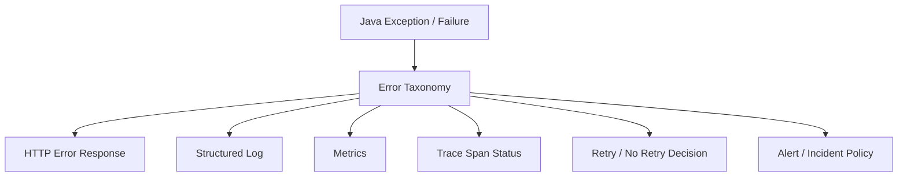

# Part 052 — Domain, Technical, and Validation Error Mapping

> Fokus part ini: membangun taxonomy error yang stabil untuk JAX-RS enterprise service, membedakan validation error, domain error, authorization error, dependency error, database error, messaging error, dan infrastructure error, lalu memetakannya ke HTTP response, log, metrics, trace, retry policy, dan PR review checklist.

Error handling bukan bagian tambahan.

Error handling adalah contract.

Di sistem enterprise, error response dikonsumsi oleh:

```text
- frontend
- partner API client
- downstream service
- workflow engine
- batch/reconciliation job
- customer support tool
- observability platform
- incident responder
```

Jika error mapping tidak konsisten, sistem sulit dipakai, sulit di-debug, dan berbahaya saat incident.

---

## 1. Core Mental Model

Exception adalah mekanisme Java.

Error contract adalah desain API.

Log adalah alat operator.

Metric adalah alat deteksi.

Trace adalah alat korelasi.

Jangan campur semuanya menjadi satu.



Goal error mapping:

```text
Same class of failure should produce same external contract, same observability signal, and same operational action.
```

---

## 2. Error Categories

Minimum taxonomy untuk JAX-RS enterprise service:

```text
Validation error
  Input shape or constraint invalid before domain decision.

Domain error
  Request valid syntactically but violates business rule/invariant.

Authentication error
  Caller identity missing or invalid.

Authorization error
  Caller authenticated but not allowed.

Conflict error
  Request conflicts with current state/version/idempotency/lock.

Not found error
  Target resource does not exist or is not visible to caller.

Dependency error
  Downstream service/cache/cloud provider unavailable or returns failure.

Database error
  Constraint, deadlock, timeout, connection exhaustion, migration mismatch.

Messaging error
  Event publish/consume failure, serialization failure, poison message.

Infrastructure error
  Runtime/container/network/config/platform failure.

Unexpected error
  Unclassified bug or unexpected runtime exception.
```

Senior rule:

```text
Every error should have an owner, an expected caller behavior, and an operational meaning.
```

---

## 3. Validation Error

Validation error terjadi sebelum domain logic membuat keputusan bisnis.

Contoh:

```text
- required field missing
- string too long
- invalid enum value
- malformed UUID
- invalid date format
- invalid money precision
- invalid nested DTO
```

Typical HTTP mapping:

```text
400 Bad Request
```

Atau untuk semantic validation tertentu, beberapa organisasi memakai:

```text
422 Unprocessable Entity
```

Pilih satu standard internal dan konsisten.

Example response:

```json
{
  "errorCode": "VALIDATION_FAILED",
  "message": "Request validation failed.",
  "correlationId": "req-123",
  "details": [
    {
      "field": "items[0].quantity",
      "code": "MIN_VALUE",
      "message": "quantity must be greater than 0"
    }
  ]
}
```

Do not expose raw framework internals:

```text
ConstraintViolationException: create.arg0.items[0].quantity must be greater than 0
```

Raw messages are often unstable and not consumer-friendly.

---

## 4. Domain Error

Domain error berarti input shape valid, caller may be valid, but the requested business action is not allowed.

Examples:

```text
Quote cannot be submitted because status is EXPIRED.
Order cannot be cancelled because fulfillment already started.
Product cannot be added because incompatible with existing bundle.
Promotion cannot be applied because price effective date is outside validity window.
Tenant is not eligible for this product catalog.
```

Typical mapping depends on semantics:

```text
400 Bad Request
  If request violates business rule independent of current resource version.

409 Conflict
  If failure is due to current resource state, version, duplicate, or concurrency conflict.

422 Unprocessable Entity
  If internal API standard uses 422 for semantic domain rejection.
```

Do not blindly map all domain errors to 500.

Domain rejection is usually expected behavior.

---

## 5. Conflict Error

Conflict deserves explicit treatment because enterprise systems often have state transitions.

Common conflict cases:

```text
- optimistic locking version mismatch
- duplicate idempotency key with different payload
- state transition conflict
- concurrent update
- unique constraint conflict
- active lock conflict
- resource already exists
```

Typical mapping:

```text
409 Conflict
```

Example:

```json
{
  "errorCode": "QUOTE_STATE_CONFLICT",
  "message": "Quote cannot be submitted from the current state.",
  "correlationId": "req-123",
  "details": {
    "quoteId": "Q-1001",
    "currentState": "EXPIRED",
    "requestedAction": "SUBMIT"
  }
}
```

Be careful exposing internal state names if they are not part of public contract.

---

## 6. Authentication and Authorization Error

Authentication asks:

```text
Who are you?
```

Authorization asks:

```text
Are you allowed to do this?
```

Typical mapping:

```text
401 Unauthorized
  Missing/invalid/expired token.

403 Forbidden
  Valid identity but insufficient permission.
```

Guideline:

```text
Do not reveal whether a hidden resource exists if that leaks information.
```

Sometimes unauthorized access to a resource should return:

```text
404 Not Found
```

But only if internal security policy says so.

Internal verification:

```text
- token validation failure response standard
- missing permission response standard
- tenant isolation violation response standard
- resource existence leak policy
```

---

## 7. Not Found Error

`404 Not Found` seems simple, but in enterprise systems it can mean:

```text
- resource truly does not exist
- resource exists but belongs to another tenant
- resource exists but caller has no visibility
- resource exists in another environment/region
- resource is soft-deleted/archived
- resource exists but catalog version/effective date hides it
```

Response should be safe:

```json
{
  "errorCode": "RESOURCE_NOT_FOUND",
  "message": "Requested resource was not found.",
  "correlationId": "req-123"
}
```

For internal logs, include more details if allowed:

```text
tenantId
resourceType
resourceId
visibilityReason
softDeleted
catalogVersion
```

But do not expose sensitive reason externally unless contract allows it.

---

## 8. Dependency Error

Dependency error comes from outbound calls:

```text
- downstream API timeout
- downstream returns 5xx
- downstream returns malformed payload
- cloud service unavailable
- Redis timeout
- external pricing/tax service failure
- identity provider unavailable
```

Typical mapping:

```text
502 Bad Gateway
  Downstream responded invalid/error as gateway-like dependency.

503 Service Unavailable
  Dependency unavailable or circuit open.

504 Gateway Timeout
  Dependency timeout.
```

But internal API gateway/platform conventions may differ.

Do not leak downstream raw error body.

Better:

```json
{
  "errorCode": "DEPENDENCY_UNAVAILABLE",
  "message": "A required dependency is currently unavailable.",
  "correlationId": "req-123"
}
```

Logs should include:

```text
dependencyName
operation
statusCode
timeoutMs
latencyMs
circuitBreakerState
retryAttempt
```

---

## 9. Database Error

Database errors need careful mapping.

Examples:

```text
unique constraint violation
foreign key violation
check constraint violation
deadlock detected
lock timeout
statement timeout
connection acquisition timeout
serialization failure
migration mismatch
read-only transaction violation
```

Not all DB errors are 500.

Mapping examples:

```text
unique constraint duplicate business key -> 409 Conflict
optimistic lock version mismatch -> 409 Conflict
check constraint caused by invalid business command -> domain/validation mapping if expected
deadlock/serialization failure -> 503 or retry internally, depending policy
connection pool exhausted -> 503 or 500 depending standard
unknown SQL error -> 500
```

Important:

```text
SQLState and constraint name are internal evidence.
They should not be blindly exposed to API clients.
```

Use internal mapping table.

```java
public enum DatabaseFailureKind {
    UNIQUE_CONFLICT,
    FK_CONFLICT,
    DEADLOCK,
    LOCK_TIMEOUT,
    STATEMENT_TIMEOUT,
    CONNECTION_EXHAUSTED,
    UNKNOWN
}
```

---

## 10. Messaging Error

Messaging error appears in two places:

```text
HTTP command path publishes event.
Async consumer processes event.
```

HTTP path example:

```text
Create quote writes DB successfully but event publish fails.
```

Better design usually avoids direct dual-write using outbox.

If outbox is used:

```text
HTTP request commits DB + outbox row.
Async publisher publishes event later.
HTTP response can succeed once durable state is committed.
```

Consumer error taxonomy:

```text
Deserialization error
  Event cannot be read.

Schema incompatibility
  Event violates expected contract.

Poison message
  Event is valid but always fails business processing.

Transient dependency error
  Consumer cannot reach DB/downstream.

Duplicate event
  Already processed.

Out-of-order event
  Event version/sequence older than current state.
```

Mapping is not HTTP response; it maps to:

```text
- retry
- DLQ
- skip duplicate
- park event
- raise incident
- reconciliation job
```

---

## 11. Infrastructure Error

Infrastructure error includes failures below application logic:

```text
- misconfiguration
- missing secret
- DNS failure
- TLS handshake failure
- Kubernetes pod OOMKilled
- thread pool exhausted
- disk full
- file descriptor exhaustion
- classpath mismatch
- dependency injection failure
```

Some occur at startup, some at runtime.

Startup infrastructure error should usually fail fast.

Runtime infrastructure error should produce stable response and strong observability.

Example response:

```json
{
  "errorCode": "SERVICE_UNAVAILABLE",
  "message": "Service is temporarily unavailable.",
  "correlationId": "req-123"
}
```

Do not expose:

```text
Secret path
JDBC URL with credential
internal hostname
stack trace
Kubernetes namespace details
```

---

## 12. Unexpected Error

Unexpected error is a bug or unclassified runtime failure.

Typical mapping:

```text
500 Internal Server Error
```

External response should be generic:

```json
{
  "errorCode": "INTERNAL_ERROR",
  "message": "An unexpected error occurred.",
  "correlationId": "req-123"
}
```

Internal log should contain enough debug information:

```text
exception class
stack trace
resource class/method
tenant id if safe
operation
correlation id
trace id
request route template
sanitized request metadata
```

Never return stack trace to client.

---

## 13. Error Response Contract

A stable error contract should include:

```text
errorCode
message
correlationId or traceId
details for validation/domain-specific safe data
```

Example generic shape:

```java
public record ApiErrorResponse(
        String errorCode,
        String message,
        String correlationId,
        Object details
) {}
```

For validation:

```java
public record ValidationErrorDetails(
        List<FieldViolation> violations
) {}

public record FieldViolation(
        String field,
        String code,
        String message
) {}
```

Be careful with `details` as arbitrary object.

Too much flexibility can destroy governance.

Better:

```text
Use known detail shapes for known error categories.
```

---

## 14. Error Code Strategy

Error code should be stable and machine-readable.

Bad:

```text
"Something went wrong"
"Invalid input"
"SQL-23505"
```

Better:

```text
VALIDATION_FAILED
QUOTE_NOT_FOUND
QUOTE_STATE_CONFLICT
TENANT_ACCESS_DENIED
DEPENDENCY_TIMEOUT
DATABASE_CONFLICT
INTERNAL_ERROR
```

For large systems, use namespaced codes:

```text
QUOTE.VALIDATION_FAILED
QUOTE.STATE_CONFLICT
PRICING.RULE_NOT_APPLICABLE
CATALOG.PRODUCT_NOT_AVAILABLE
SECURITY.PERMISSION_DENIED
```

Trade-off:

```text
Flat codes are simpler.
Namespaced codes scale better.
```

Internal standard should decide.

---

## 15. Exception Hierarchy Design

Do not create one exception class per HTTP status code only.

Better hierarchy maps domain semantics first.

Example:

```java
public abstract class ApplicationException extends RuntimeException {
    private final String errorCode;

    protected ApplicationException(String errorCode, String message) {
        super(message);
        this.errorCode = errorCode;
    }

    public String errorCode() {
        return errorCode;
    }
}

public final class QuoteStateConflictException extends ApplicationException {
    public QuoteStateConflictException(String quoteId, String currentState, String action) {
        super("QUOTE_STATE_CONFLICT",
                "Quote cannot perform requested action from current state.");
    }
}
```

Avoid exception messages as contract.

Use explicit error code and safe details.

---

## 16. JAX-RS ExceptionMapper Strategy

JAX-RS `ExceptionMapper` centralizes mapping.

Example:

```java
@Provider
public final class ApplicationExceptionMapper
        implements ExceptionMapper<ApplicationException> {

    @Override
    public Response toResponse(ApplicationException exception) {
        ApiErrorResponse body = new ApiErrorResponse(
                exception.errorCode(),
                exception.getMessage(),
                Correlation.currentId(),
                null
        );

        return Response.status(statusFor(exception))
                .type(MediaType.APPLICATION_JSON_TYPE)
                .entity(body)
                .build();
    }
}
```

You may also have specific mappers:

```text
ConstraintViolationException mapper
JsonMappingException / JsonParseException mapper
NotFoundException mapper
NotAllowedException mapper
ApplicationException mapper
Throwable fallback mapper
```

Ordering/selection depends on JAX-RS implementation behavior and class specificity.

Internal verification:

```text
- which mappers are registered?
- are framework exceptions mapped consistently?
- is there a catch-all Throwable mapper?
- does mapper log or duplicate logs?
- does mapper preserve correlation ID?
```

---

## 17. Mapping Framework-Level Errors

Common framework errors:

```text
No route matched -> 404
HTTP method not allowed -> 405
not acceptable -> 406
unsupported media type -> 415
malformed JSON -> 400
message body provider missing -> 415/500 depending case
parameter conversion failed -> 400
bean validation failed -> 400/422
```

Make these responses consistent with your error envelope.

Example:

```json
{
  "errorCode": "MALFORMED_JSON",
  "message": "Request body is not valid JSON.",
  "correlationId": "req-123"
}
```

Do not return Jersey/internal HTML error pages from API endpoints.

---

## 18. Retriable vs Non-Retriable

Every error category should define caller behavior.

```text
Validation error
  Do not retry without changing request.

Domain error
  Do not retry unless state/business condition changes.

Conflict
  Retry only after refresh/reload or with same idempotency semantics.

Authentication
  Retry after obtaining valid credential.

Authorization
  Do not retry without permission change.

Dependency timeout
  Retry may be allowed with budget/backoff.

Database deadlock/serialization failure
  Internal retry may be possible if operation is idempotent.

Internal error
  Caller retry depends on standard; avoid encouraging blind retry.
```

Use headers carefully:

```text
Retry-After
  Only when service can provide meaningful retry guidance.
```

---

## 19. Logging Strategy for Errors

Avoid double logging.

Bad pattern:

```text
Resource logs exception.
Service logs exception.
Repository logs exception.
ExceptionMapper logs exception.
```

This creates noise.

Better:

```text
Log at boundary where classification and context are complete.
```

Usually:

```text
ExceptionMapper logs API failure once.
Consumer error handler logs message processing failure once.
Startup bootstrap logs fatal config/wiring failure once.
```

Suggested log levels:

```text
Validation error -> usually DEBUG/INFO, not ERROR
Expected domain rejection -> INFO or WARN depending business meaning
Authorization denial -> WARN/security log if suspicious
Dependency timeout -> WARN/ERROR depending impact
Unexpected error -> ERROR
Startup fatal -> ERROR
```

Internal standard may differ.

---

## 20. Metrics and Alerting

Error metrics should be categorized, not only counted by HTTP status.

Useful dimensions:

```text
route template
method
status class
error category
error code
exception class group
consumer group / topic for messaging
```

Dangerous dimensions:

```text
raw URL with IDs
customer ID
tenant ID if high-cardinality or sensitive
exception message
SQL query
```

Metrics examples:

```text
http.server.errors{route="/quotes/{id}", error_code="QUOTE_NOT_FOUND"}
dependency.errors{dependency="pricing-service", kind="timeout"}
db.errors{kind="deadlock"}
kafka.consumer.errors{topic="quote-events", kind="schema_incompatible"}
```

Alerting should focus on impact:

```text
- 5xx rate
- dependency failure rate
- validation spike if caused by client rollout
- auth failure spike
- DLQ growth
- DB deadlock spike
```

---

## 21. Tracing Error Semantics

Trace span should record:

```text
error status
error category
safe error code
exception class
sanitized message if allowed
```

Do not attach high-cardinality or sensitive payloads.

Good span attributes:

```text
error.type = "DEPENDENCY_TIMEOUT"
app.error_code = "PRICING_DEPENDENCY_TIMEOUT"
dependency.name = "pricing-service"
http.route = "/quotes/{quoteId}/price"
```

Bad span attributes:

```text
customer.email
full request body
raw SQL with parameter values
JWT token
```

---

## 22. Error Mapping and Resilience

Error mapping drives resilience decisions.

Example:

```text
HTTP 500 from downstream may be retryable.
HTTP 400 from downstream usually not retryable.
HTTP 409 may require state refresh.
HTTP 429 should follow rate-limit/backoff policy.
HTTP 503 may trigger circuit breaker.
HTTP 504 may trigger retry if operation is idempotent.
```

But status code alone is not enough.

Use classified dependency failure:

```java
public enum DependencyFailureKind {
    TIMEOUT,
    RATE_LIMITED,
    UNAVAILABLE,
    BAD_RESPONSE,
    AUTH_FAILURE,
    CLIENT_ERROR,
    UNKNOWN
}
```

Then map to retry/circuit policy.

---

## 23. Domain Error Example: Quote Submit

```java
public final class Quote {
    public void submit(Instant now) {
        if (status != QuoteStatus.DRAFT) {
            throw new QuoteStateConflictException(id.value(), status.name(), "SUBMIT");
        }
        if (!now.isBefore(expiresAt)) {
            throw new QuoteExpiredException(id.value(), expiresAt);
        }
        status = QuoteStatus.SUBMITTED;
    }
}
```

Possible mapping:

```text
QuoteStateConflictException -> 409 QUOTE_STATE_CONFLICT
QuoteExpiredException -> 409 QUOTE_EXPIRED or 422 depending internal standard
```

Important:

```text
Expired quote is not system failure.
It is a business rejection.
```

---

## 24. Database Constraint Example

Suppose duplicate idempotency key violates unique constraint.

Do not expose:

```text
duplicate key value violates unique constraint "uq_idempotency_key"
```

Instead classify:

```text
IDEMPOTENCY_CONFLICT -> 409 Conflict
```

Pseudo mapping:

```java
if (sqlState.equals("23505") && constraintName.equals("uq_idempotency_key")) {
    throw new IdempotencyConflictException();
}
```

Caution:

```text
Constraint names become part of internal mapping.
Renaming constraints can break error behavior if not tested.
```

---

## 25. Validation vs Domain vs Database Boundary

Same business rule can appear at multiple layers, but each layer has different role.

Example: quantity must be positive.

```text
API validation
  Reject obvious invalid request early.

Domain invariant
  Protect core model even if called from non-HTTP path.

Database constraint
  Final integrity guard.
```

Do not rely only on API validation.

A domain service can be called by:

```text
- REST endpoint
- Kafka consumer
- batch job
- workflow worker
- admin tool
```

Domain invariants must survive all entrypoints.

---

## 26. API Contract Compatibility

Changing error response can be breaking.

Breaking examples:

```text
Removing errorCode.
Renaming errorCode used by clients.
Changing status code from 409 to 500.
Changing validation detail shape.
Returning raw exception message instead of stable message.
Changing field path format.
```

Usually safe:

```text
Adding optional safe field.
Adding new error code for new scenario if documented.
Adding correlationId if absent.
```

Internal compatibility matrix should include error contracts.

---

## 27. Security and Redaction

Never expose:

```text
stack trace
SQL query with values
secret/config path with sensitive name
internal hostname/IP
JWT/token
password/API key
PII
tenant existence leak
filesystem path
classpath details
```

Be careful with exception messages from:

```text
database driver
HTTP client
cloud SDK
JSON parser
security library
```

They may contain sensitive metadata.

Use sanitized external messages.

---

## 28. Internal Verification Checklist

Verify in the internal codebase:

```text
Error contract:
- Is there a standard error envelope?
- Are error codes cataloged?
- Are validation details standardized?
- Are error response examples in OpenAPI?

JAX-RS mapping:
- Which ExceptionMapper classes exist?
- Is there a fallback mapper?
- Are framework errors mapped into the same envelope?
- Are mappers registered explicitly or by scanning?

Domain/application:
- Is there a domain exception hierarchy?
- Are domain errors mapped to 4xx/409/422 instead of 500?
- Are conflict errors explicit?
- Are idempotency conflicts handled?

Database:
- Are SQLState/constraint errors classified?
- Are deadlocks/timeouts mapped consistently?
- Are unique constraints tied to business errors?

Dependencies:
- Are downstream errors classified?
- Are retryable/non-retryable failures explicit?
- Is raw downstream body exposed or sanitized?

Observability:
- Are correlation ID and trace ID included?
- Are error metrics grouped by category/code?
- Are logs redacted?
- Is double logging avoided?

Security:
- Are stack traces hidden externally?
- Are tenant existence leaks considered?
- Are auth/authz failures safe?
```

---

## 29. PR Review Checklist

Use this for changes touching error behavior:

```text
Contract:
- Is status code correct and consistent?
- Is errorCode stable and documented?
- Is response shape backward-compatible?
- Is OpenAPI updated?

Taxonomy:
- Is this validation, domain, conflict, auth, dependency, DB, messaging, infra, or unexpected?
- Is caller expected to retry?
- Is operator expected to alert?

Security:
- Does response leak internal details?
- Does it leak tenant/resource existence?
- Are sensitive fields redacted?

Observability:
- Is correlationId/traceId present?
- Is error logged once with enough context?
- Are metrics useful without high-cardinality labels?
- Does trace include safe error classification?

Implementation:
- Is exception mapper coverage complete?
- Are framework exceptions handled?
- Are database/dependency errors classified near boundary?
- Are tests covering negative paths?
```

---

## 30. Common Anti-Patterns

```text
Mapping every exception to 500.
Returning raw exception message to clients.
Returning stack trace in response.
Using HTTP status as the only error code.
Using exception message as client contract.
Logging same exception in every layer.
Treating domain rejection as system failure.
Treating database constraint error as generic 500 when it is known conflict.
Losing correlation ID in error path.
Returning different error envelope for validation vs domain vs framework errors.
Not testing negative paths.
Changing error code without compatibility review.
```

---

## 31. Senior-Level Heuristic

A strong error system answers five questions quickly:

```text
What happened?
Who/what is affected?
Can the caller fix it?
Should the system retry it?
Should an operator be alerted?
```

If the error response, log, metric, and trace cannot answer those questions, the error mapping is incomplete.

In enterprise systems, good error mapping is not cosmetic.

It is how correctness, supportability, and operability survive production reality.
