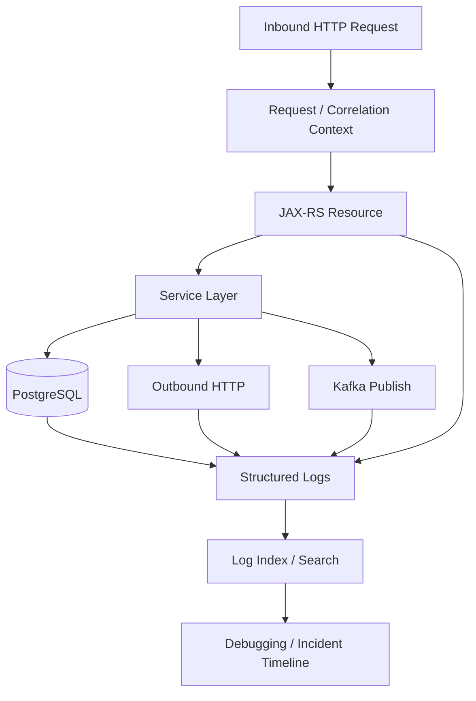
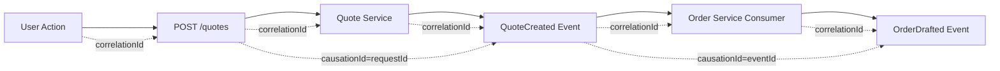
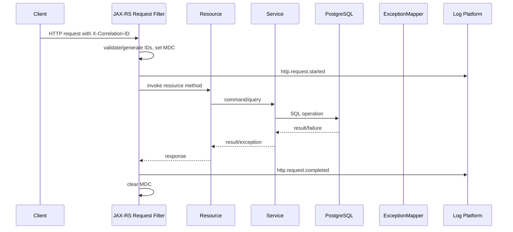
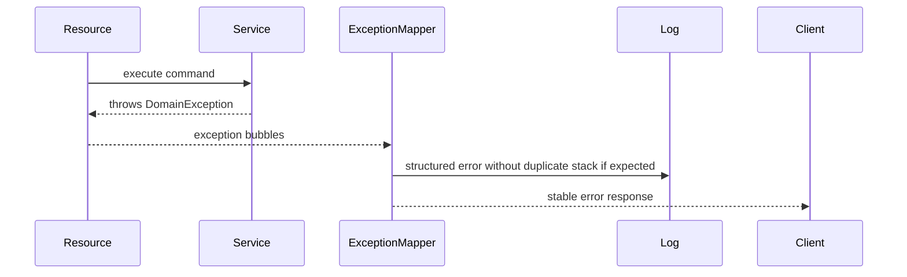

# Part 053 — Structured Logging, Correlation ID, and Causation ID

> Fokus part ini: membangun mental model logging yang bisa dipakai saat production incident. Bukan sekadar "print log". Kita akan membahas structured logging, log level, correlation ID, causation ID, request ID, MDC, propagation, redaction, cardinality, dan checklist review untuk JAX-RS enterprise backend.

Logging bukan dokumentasi runtime.

Logging adalah **evidence trail**.

Di service enterprise, log dipakai untuk menjawab pertanyaan seperti:

```text
Request ini datang dari siapa?
Masuk endpoint mana?
Memproses tenant mana?
Memanggil downstream apa?
Query apa yang lambat?
Event Kafka apa yang dipublish?
Error ini retryable atau bukan?
Apakah customer terdampak?
Apakah data sensitif bocor ke log?
```

Jika log tidak terstruktur, jawaban pertanyaan tersebut berubah menjadi tebakan.

---

## 1. Core Mental Model

Log adalah event.

Setiap log line harus dianggap sebagai record yang akan dikonsumsi oleh manusia dan mesin.



Senior engineer melihat log sebagai bagian dari contract operasional.

```text
Code changes behavior.
Log changes diagnosability.
Bad logs increase MTTR.
Leaky logs increase security risk.
Noisy logs increase cost and hide signal.
```

---

## 2. What Structured Logging Means

Structured logging berarti log ditulis sebagai field, bukan hanya kalimat bebas.

Contoh tidak ideal:

```text
User failed to create order because customer not found
```

Lebih baik:

```json
{
  "level": "WARN",
  "event": "order.create.rejected",
  "reason": "customer_not_found",
  "correlationId": "c-7f3a",
  "tenantId": "tenant-a",
  "customerId": "cust-123",
  "orderId": null,
  "httpMethod": "POST",
  "httpPath": "/orders",
  "status": 404,
  "durationMs": 42
}
```

Bukan berarti semua log harus JSON secara manual.

Yang penting:

```text
- field konsisten
- value bisa dicari
- event name stabil
- sensitive data tidak bocor
- cardinality dikontrol
- correlation context selalu ada
```

---

## 3. Log Message vs Log Fields

Message berguna untuk manusia.

Fields berguna untuk query, dashboard, alert, dan correlation.

Idealnya log punya keduanya.

```text
message: "Order creation rejected because customer was not found"
event: "order.create.rejected"
reason: "customer_not_found"
status: 404
correlationId: "..."
tenantId: "..."
```

Rule praktis:

```text
Human-readable message explains what happened.
Structured fields explain how to find, aggregate, and correlate it.
```

Anti-pattern:

```java
log.info("Create order failed for tenant " + tenantId + " user " + userId + " request " + request);
```

Masalah:

```text
- raw request bisa berisi PII/secret
- sulit dicari per field
- inconsistent naming
- expensive string concatenation jika level disabled
- rentan log injection jika input mentah masuk message
```

Lebih baik, tergantung logging stack internal:

```java
log.warn("Order creation rejected: customer not found",
    kv("event", "order.create.rejected"),
    kv("reason", "customer_not_found"),
    kv("tenantId", tenantId),
    kv("customerId", customerId),
    kv("correlationId", correlationId));
```

Atau jika stack tidak support key-value logging, gunakan MDC + JSON encoder.

---

## 4. Minimum Fields for Enterprise Request Logs

Minimum field untuk inbound HTTP request:

```text
timestamp
level
serviceName
serviceVersion
environment
podName / hostName
threadName
loggerName
event
message
correlationId
requestId
traceId
spanId
tenantId
principalId / subjectId
httpMethod
httpPathTemplate
httpRoute
httpStatus
durationMs
errorCode
exceptionClass
```

Catatan penting:

```text
Prefer path template over raw path for metrics/log aggregation.
```

Contoh:

```text
Good: /quotes/{quoteId}/items/{itemId}
Risky: /quotes/Q-123/items/I-456
```

Raw path dapat memiliki cardinality tinggi dan mungkin mengandung identifier sensitif.

---

## 5. Correlation ID, Request ID, Trace ID, and Causation ID

Istilah ini sering dicampur.

Untuk sistem enterprise, bedakan seperti ini.

### 5.1 Request ID

Request ID mengidentifikasi satu inbound request ke satu service.

```text
One HTTP request to one service = one requestId.
```

Useful untuk:

```text
- debugging local service
- matching access log and application log
- support ticket for one API call
```

### 5.2 Correlation ID

Correlation ID menghubungkan beberapa operasi yang masih bagian dari satu business interaction.

```text
One user action / business command / workflow transaction = one correlationId.
```

Contoh:

```text
POST /quotes
  -> calls pricing service
  -> calls catalog service
  -> writes database
  -> publishes QuoteCreated event
```

Semua operasi itu harus membawa `correlationId` yang sama.

### 5.3 Trace ID

Trace ID adalah identifier distributed tracing.

Biasanya dikelola OpenTelemetry/W3C trace context.

```text
One distributed trace = one traceId.
```

Trace ID cocok untuk latency breakdown.

Correlation ID cocok untuk business-level troubleshooting.

Kadang satu correlation ID punya lebih dari satu trace ID, terutama jika workflow asynchronous berlangsung lama.

### 5.4 Causation ID

Causation ID menunjukkan event/command/request yang menyebabkan aksi saat ini.

```text
Event A caused command B.
Command B caused event C.
```

Contoh:

```text
QuoteSubmitted event
  causationId = commandId of SubmitQuote

OrderCreated event
  causationId = eventId of QuoteSubmitted
```

Causation ID penting untuk event-driven systems.

Tanpanya, sulit menjawab:

```text
Event ini muncul karena request mana?
Retry ini retry dari operasi mana?
Reconciliation job ini memperbaiki kegagalan apa?
```

---

## 6. Recommended ID Model

Minimum ID model yang sehat:

```text
requestId
  Unique per inbound service request.

correlationId
  Stable across business flow.

traceId/spanId
  From tracing system.

causationId
  Parent event/command/message/request that caused this operation.

messageId / eventId
  Unique event/message identifier for asynchronous processing.

idempotencyKey
  Caller-provided or generated deduplication key for unsafe/retryable operations.
```

Mapping umum:



---

## 7. MDC: Useful but Dangerous

MDC atau Mapped Diagnostic Context adalah mekanisme umum di Java logging untuk menyimpan field context per thread.

Contoh concept:

```java
MDC.put("correlationId", correlationId);
MDC.put("tenantId", tenantId);
try {
    resourceMethod.invoke();
} finally {
    MDC.clear();
}
```

Manfaat:

```text
- setiap log dalam request otomatis punya context
- service layer tidak perlu pass correlationId ke setiap method hanya untuk logging
- compatible dengan JSON log encoder
```

Risiko:

```text
- MDC berbasis ThreadLocal
- thread pool reuse bisa membawa context lama jika tidak dibersihkan
- async executor kehilangan context jika tidak dipropagate
- Kafka consumer thread dapat mencampur message context jika cleanup buruk
```

Senior rule:

```text
MDC must be set at boundary and cleared at boundary.
```

Boundary umum:

```text
- inbound HTTP filter
- Kafka consumer poll/message handler
- scheduled job start/end
- executor task wrapper
- workflow worker task boundary
```

---

## 8. JAX-RS Inbound Logging Filter Pattern

Di JAX-RS, inbound correlation biasanya dilakukan lewat `ContainerRequestFilter` dan `ContainerResponseFilter`.

Conceptual example:

```java
@Provider
@Priority(Priorities.AUTHENTICATION - 100)
public class CorrelationFilter implements ContainerRequestFilter, ContainerResponseFilter {

    @Override
    public void filter(ContainerRequestContext request) {
        String incomingCorrelationId = request.getHeaderString("X-Correlation-ID");
        String correlationId = isValid(incomingCorrelationId)
            ? incomingCorrelationId
            : generateCorrelationId();

        String requestId = generateRequestId();

        request.setProperty("correlationId", correlationId);
        request.setProperty("requestId", requestId);

        MDC.put("correlationId", correlationId);
        MDC.put("requestId", requestId);
        MDC.put("httpMethod", request.getMethod());
        MDC.put("httpPath", request.getUriInfo().getPath());
    }

    @Override
    public void filter(ContainerRequestContext request, ContainerResponseContext response) {
        try {
            String correlationId = (String) request.getProperty("correlationId");
            String requestId = (String) request.getProperty("requestId");

            response.getHeaders().putSingle("X-Correlation-ID", correlationId);
            response.getHeaders().putSingle("X-Request-ID", requestId);
        } finally {
            MDC.clear();
        }
    }
}
```

Catatan:

```text
- Header name harus mengikuti standard internal.
- Jangan percaya semua inbound ID mentah tanpa validasi panjang/charset.
- Jangan generate ulang correlation ID jika caller sudah mengirim ID valid.
- Response harus mengembalikan correlation ID agar client/support bisa melaporkan ID tersebut.
```

---

## 9. Do Not Log Raw Request/Response Bodies by Default

Raw body logging tampak membantu, tetapi berbahaya.

Risiko:

```text
PII leak
credential leak
payment/tax/customer data leak
large payload cost
multipart/binary corruption
performance overhead
legal/compliance exposure
```

Default rule:

```text
Do not log full request/response body in production.
```

Jika butuh debugging payload:

```text
- gunakan allowlist field
- gunakan sampling
- gunakan environment gating
- gunakan redaction
- gunakan temporary flag dengan expiry
- hindari multipart/binary
- audit siapa mengaktifkan payload logging
```

Untuk CPQ/order-style system, payload dapat berisi:

```text
- customer identity
- address
- pricing detail
- discount rule
- tax data
- contract terms
- product configuration
- commercial entitlement
```

Semua harus diperlakukan sensitif sampai terbukti sebaliknya.

---

## 10. Log Level Strategy

Log level bukan dekorasi.

Log level adalah sinyal operasional.

### TRACE

Untuk detail sangat rendah.

Biasanya disabled di production.

Gunakan untuk:

```text
- local debugging
- temporary deep diagnosis
- low-level protocol detail
```

### DEBUG

Untuk diagnosis developer.

Biasanya disabled atau sampling di production.

Gunakan untuk:

```text
- selected decision branch
- non-sensitive intermediate state
- feature flag evaluation summary
```

### INFO

Untuk lifecycle dan business-significant events yang normal.

Gunakan untuk:

```text
- service startup completed
- config profile loaded
- request completed access log
- job started/completed
- event published/consumed summary
```

Hati-hati: terlalu banyak INFO membuat log mahal dan noisy.

### WARN

Untuk kondisi abnormal tetapi masih tertangani.

Gunakan untuk:

```text
- validation/domain rejection yang signifikan
- downstream transient failure yang recovered
- retry exhausted but converted to known error
- degraded mode activated
- suspicious but not confirmed security event
```

### ERROR

Untuk kegagalan yang membutuhkan perhatian operasional atau menunjukkan bug/technical failure.

Gunakan untuk:

```text
- unexpected exception
- database unavailable
- event publish failed after retry
- job failed permanently
- data inconsistency detected
```

Senior rule:

```text
If everything is ERROR, nothing is actionable.
If failures are INFO, operations will miss incidents.
```

---

## 11. Event Naming for Logs

Stable `event` field membuat log bisa di-query tanpa parsing message.

Contoh naming:

```text
http.request.completed
http.request.rejected
quote.create.accepted
quote.create.rejected
quote.price.calculated
order.submit.started
order.submit.failed
kafka.event.published
kafka.event.consumed
kafka.event.rejected
database.query.slow
feature_flag.evaluated
job.reconciliation.completed
security.authorization.denied
```

Pattern yang baik:

```text
<noun>.<action>.<outcome>
```

Avoid:

```text
"Something happened"
"Error"
"Failed"
"Debug"
"Processing"
```

Event name harus stabil meskipun message berubah.

---

## 12. Logging Domain Decisions

Tidak semua domain rejection adalah error teknis.

Contoh:

```text
Quote cannot be submitted because required approval is missing.
```

Itu mungkin normal business outcome.

Log sebagai `WARN` atau bahkan `INFO`, tergantung expected frequency dan operational meaning.

Contoh field:

```json
{
  "event": "quote.submit.rejected",
  "reason": "approval_missing",
  "quoteId": "Q-123",
  "tenantId": "tenant-a",
  "status": 409,
  "correlationId": "c-1"
}
```

Senior question:

```text
Apakah rejection ini expected business behavior, abuse signal, integration bug, atau data inconsistency?
```

Level dan alert bergantung pada jawaban.

---

## 13. Logging Dependency Calls

Outbound dependency call harus bisa dilihat dari log/trace/metric.

Field minimum:

```text
event
dependencyName
dependencyType
operation
method
urlTemplate / route
status / errorCode
durationMs
attempt
retryable
circuitBreakerState
correlationId
traceId
```

Contoh:

```json
{
  "event": "http.client.completed",
  "dependencyName": "catalog-service",
  "operation": "getProductOffering",
  "httpMethod": "GET",
  "route": "/product-offerings/{id}",
  "status": 200,
  "durationMs": 37,
  "attempt": 1,
  "correlationId": "c-123"
}
```

Untuk failure:

```json
{
  "event": "http.client.failed",
  "dependencyName": "pricing-service",
  "operation": "calculatePrice",
  "errorType": "timeout",
  "durationMs": 2000,
  "attempt": 3,
  "retryable": true,
  "finalFailure": true,
  "correlationId": "c-123"
}
```

---

## 14. Logging Database Operations

Jangan log semua SQL mentah di production tanpa kontrol.

Yang biasanya lebih aman:

```text
queryName
repositoryName
operation
rowCount
durationMs
sqlState
constraintName
lockWaitMs
transactionId/correlationId
```

Contoh:

```json
{
  "event": "database.query.slow",
  "repository": "QuoteRepository",
  "queryName": "findActiveQuoteByCustomer",
  "durationMs": 850,
  "rowCount": 42,
  "tenantId": "tenant-a",
  "correlationId": "c-123"
}
```

SQL logging boleh berguna di non-production.

Di production, raw SQL dengan parameter bisa berisi sensitive data.

---

## 15. Logging Kafka Events

Untuk producer:

```text
event = kafka.event.published / kafka.event.publish_failed
topic
partition
keyHash atau safeKey
eventType
eventId
schemaVersion
correlationId
causationId
attempt
durationMs
```

Untuk consumer:

```text
event = kafka.event.consumed / kafka.event.rejected / kafka.event.failed
topic
partition
offset
consumerGroup
eventType
eventId
schemaVersion
correlationId
causationId
processingDurationMs
retryAttempt
```

Jangan log full event payload by default.

Log event metadata.

Jika perlu payload sample, gunakan redaction dan controlled sampling.

---

## 16. Tenant-Aware Logging

Di multi-tenant enterprise system, tenant context adalah field penting.

Namun tenant ID juga bisa sensitif tergantung policy.

Minimum:

```text
tenantId or tenantKey
region / partition if relevant
configurationVersion if tenant-specific config affects behavior
catalogVersion if catalog-driven behavior affects result
pricingRuleVersion if pricing is involved
```

Contoh CPQ/order-style diagnosis:

```text
Quote result changed because tenant-specific catalog version changed.
```

Tanpa tenant/catalog/pricing version di log, diagnosis menjadi sulit.

Internal verification harus menentukan:

```text
- tenant identifier yang boleh muncul di log
- apakah perlu hashing/masking
- apakah tenant-specific config version tersedia
- apakah catalog/pricing effective date dilog secara aman
```

---

## 17. Redaction and Sensitive Data Handling

Field yang biasanya tidak boleh dilog mentah:

```text
password
secret
access token
refresh token
API key
authorization header
cookie
private key
customer full name
email
phone
address
payment identifier
tax identifier
contract detail
full request body
full quote/order payload
```

Redaction harus dilakukan di beberapa layer:

```text
- application logging helper
- JSON encoder/filter
- HTTP logging filter
- exception mapper
- observability exporter
- log ingestion pipeline
```

Senior rule:

```text
Redaction in only one layer is not enough.
```

Karena leak bisa masuk dari:

```text
- exception message
- third-party library log
- raw request dump
- debug statement
- SQL parameter logging
- stack trace with embedded payload
```

---

## 18. Stack Trace Strategy

Stack trace berguna untuk unexpected technical failure.

Tapi stack trace berlebihan menambah noise.

Rule praktis:

```text
Expected domain/validation errors should not log full stack trace.
Unexpected technical errors should log stack trace once at boundary.
Retried transient errors may log summary per attempt and full stack only on final failure.
```

Anti-pattern:

```text
Same exception logged in repository, service, resource, and exception mapper.
```

Dampak:

```text
- duplicate error count
- noisy alert
- inflated log cost
- confusing incident timeline
```

Better:

```text
Log with full stack at ownership boundary.
Propagate typed exception upward.
ExceptionMapper logs final unhandled technical failure once.
```

---

## 19. Log Injection Risk

Jangan memasukkan input user mentah ke log message tanpa sanitization.

Contoh risk:

```text
User input contains newline or fake JSON field.
```

Dampak:

```text
- forged log line
- broken log parser
- misleading audit trail
```

Mitigasi:

```text
- structured fields via encoder
- sanitize control characters
- limit length
- avoid raw payload
- validate inbound correlation ID charset/length
```

Inbound correlation header juga harus divalidasi.

Jangan menerima string panjang arbitrary sebagai correlation ID.

---

## 20. Cardinality and Cost

Logging field cardinality tinggi dapat meningkatkan cost dan menurunkan usability.

High-cardinality fields:

```text
requestId
traceId
spanId
userId
customerId
quoteId
orderId
raw path
raw query string
idempotencyKey
payload hash
```

Bukan berarti tidak boleh dilog.

Tapi jangan semua dijadikan indexed facet atau metric label.

Prinsip:

```text
Log can contain high-cardinality fields for search.
Metrics labels should avoid high-cardinality fields.
Dashboards should aggregate on stable low-cardinality dimensions.
```

Low-cardinality fields:

```text
serviceName
environment
endpointTemplate
statusClass
errorCategory
errorCode
dependencyName
eventType
tenantTier if allowed
```

---

## 21. Access Log vs Application Log

Access log menjelaskan request boundary.

Application log menjelaskan internal decision.

Access log minimum:

```text
method
path template
status
duration
request size
response size
caller identity class
correlationId
requestId
traceId
```

Application log minimum:

```text
business event
technical decision
dependency result
error taxonomy
state transition
```

Jangan menggantikan access log dengan random application log.

Keduanya punya fungsi berbeda.

---

## 22. Startup and Configuration Logs

Saat service start, log harus memberi evidence:

```text
service name
version/build sha
environment
active profile
runtime/container type
JAX-RS implementation if known
registered key features
config source summary
safe default status
external dependencies configured
observability enabled/disabled
```

Jangan log secret value.

Contoh aman:

```json
{
  "event": "service.startup.completed",
  "serviceName": "quote-service",
  "version": "1.42.0",
  "environment": "prod",
  "profile": "prod-aws",
  "jaxrsImplementation": "jersey",
  "configSources": ["env", "mounted-config", "secret-manager"],
  "observabilityEnabled": true
}
```

Jika implementation belum diverifikasi, jangan tulis asumsi di materi internal.

Di codebase nyata, startup log dapat menjadi evidence.

---

## 23. Shutdown Logs

Shutdown log penting untuk membedakan:

```text
normal rollout
pod eviction
OOMKilled
crash loop
manual restart
node drain
```

Minimum:

```text
event = service.shutdown.started
reason if known
inflightRequests
consumerPaused
jobStopped
durationMs
shutdownCompleted
```

JAX-RS service yang punya Kafka consumer, scheduler, atau background worker perlu log graceful shutdown dengan jelas.

---

## 24. Example: JAX-RS Request Logging Flow



For exception:



---

## 25. PR Review Checklist

Saat review PR, cek:

```text
[ ] Apakah endpoint baru punya request/correlation context?
[ ] Apakah log event name stabil dan searchable?
[ ] Apakah log punya errorCode/errorCategory untuk failure?
[ ] Apakah log level sesuai operational meaning?
[ ] Apakah expected domain/validation errors tidak spam stack trace?
[ ] Apakah unexpected technical failures punya stack trace di boundary yang tepat?
[ ] Apakah outbound HTTP/DB/Kafka calls punya context yang cukup?
[ ] Apakah tenant ID/config/catalog/pricing version dilog secara aman jika relevan?
[ ] Apakah PII/secret/token/request body tidak bocor?
[ ] Apakah correlation ID dikembalikan di response?
[ ] Apakah MDC dibersihkan pada request/message/job boundary?
[ ] Apakah async executor/Kafka consumer mempertahankan atau membersihkan context dengan benar?
[ ] Apakah log field names konsisten dengan standard internal?
[ ] Apakah high-cardinality fields tidak dipakai sebagai metric labels?
[ ] Apakah log volume wajar untuk traffic production?
```

---

## 26. Internal Verification Checklist

Di codebase, dokumentasi internal, pipeline, dan observability platform, cek:

```text
Logging stack
[ ] SLF4J/Logback/Log4j2/java.util.logging?
[ ] JSON encoder dipakai atau plain text?
[ ] Apakah platform log ingestion parsing field secara benar?
[ ] Apakah ada standard event naming?

Correlation model
[ ] Header correlation ID standard apa yang dipakai?
[ ] Apakah request ID berbeda dari correlation ID?
[ ] Apakah trace ID dari OpenTelemetry dipakai?
[ ] Apakah causation ID dipakai di event-driven flow?

JAX-RS boundary
[ ] Apakah ada ContainerRequestFilter untuk correlation/MDC?
[ ] Apakah ada ContainerResponseFilter untuk response header dan cleanup?
[ ] Apakah ExceptionMapper menulis structured error log?
[ ] Apakah access log tersedia dari runtime/gateway/container?

Context propagation
[ ] Apakah MDC ikut executor/thread pool?
[ ] Apakah MDC dibersihkan setelah async task?
[ ] Apakah Kafka headers membawa correlation/causation ID?
[ ] Apakah scheduled job punya generated correlation/job run ID?

Security
[ ] Apakah Authorization/Cookie/Set-Cookie/header secret diredact?
[ ] Apakah request/response body logging disabled by default?
[ ] Apakah PII field policy terdokumentasi?
[ ] Apakah audit log dipisah dari application log?

Operations
[ ] Apakah log bisa dicari berdasarkan correlationId?
[ ] Apakah log bisa dicari berdasarkan tenantId jika policy mengizinkan?
[ ] Apakah error log terhubung dengan metrics/traces?
[ ] Apakah startup/shutdown log cukup untuk incident diagnosis?
```

---

## 27. Failure Modes

### 27.1 Missing Correlation ID

Gejala:

```text
Incident timeline tidak bisa dirangkai lintas service.
Support punya error screenshot tapi tidak bisa menemukan log.
```

Penyebab:

```text
- inbound filter tidak ada
- gateway tidak meneruskan header
- response tidak mengembalikan ID
- async boundary kehilangan context
```

Mitigasi:

```text
- generate ID at edge/service boundary
- propagate outbound
- return ID to caller
- test propagation
```

### 27.2 MDC Leak Across Requests

Gejala:

```text
Log request A muncul dengan tenant/correlation request B.
```

Penyebab:

```text
- thread reused
- MDC tidak clear di finally
- async task wrapper salah
```

Mitigasi:

```text
- clear MDC in finally
- use context-aware executor
- add tests for cleanup
```

### 27.3 Sensitive Data Leak

Gejala:

```text
Token, PII, address, pricing detail, atau full payload muncul di log platform.
```

Penyebab:

```text
- raw request logging
- exception message berisi payload
- third-party debug log
- SQL parameter logging
```

Mitigasi:

```text
- redaction filter
- disable raw body logging
- classify fields
- scan logs for known sensitive patterns
```

### 27.4 Log Storm

Gejala:

```text
Log ingestion cost naik tajam.
Useful logs tertutup noise.
Alert menjadi noisy.
```

Penyebab:

```text
- error logged repeatedly inside retry loop
- debug/info log in hot path
- stack trace duplicated at many layers
- high-traffic endpoint logs too much
```

Mitigasi:

```text
- log summary at boundary
- sample noisy logs
- reduce per-attempt logging
- aggregate metrics instead of logs
```

---

## 28. Senior-Level Heuristics

Gunakan prinsip ini:

```text
A log line should either help explain a state transition, a failure, a security-relevant event, or an operational lifecycle event.
```

Jika log tidak menjawab pertanyaan operasional, mungkin noise.

Jika log menjawab pertanyaan dengan data sensitif, perlu redaction.

Jika log hanya bisa dipahami oleh penulisnya, perlu event name dan structured fields.

Jika log tidak punya correlation context, nilainya turun drastis saat incident.

---

## 29. Practical Cheat Sheet

```text
Use structured fields, not string parsing.
Use stable event names.
Generate requestId per request.
Propagate correlationId across service boundary.
Use causationId across command/event chains.
Use traceId/spanId from tracing system.
Set MDC at boundary.
Clear MDC in finally.
Do not log raw body by default.
Redact secrets and PII.
Do not spam stack traces for expected errors.
Log full stack once for unexpected technical failures.
Prefer route template over raw path.
Control cardinality.
Review logging as production behavior, not cosmetic code.
```

---

## 30. Key Takeaways

Structured logging adalah bagian dari design.

Correlation ID menghubungkan business flow.

Request ID mengidentifikasi satu service request.

Trace ID/span ID menghubungkan telemetry tracing.

Causation ID menjelaskan hubungan sebab-akibat pada event-driven flow.

MDC membantu, tetapi berbahaya jika tidak dibersihkan atau tidak dipropagate dengan benar.

Log yang baik mempercepat incident response.

Log yang buruk menyembunyikan failure, menaikkan biaya, dan bisa membocorkan data sensitif.
