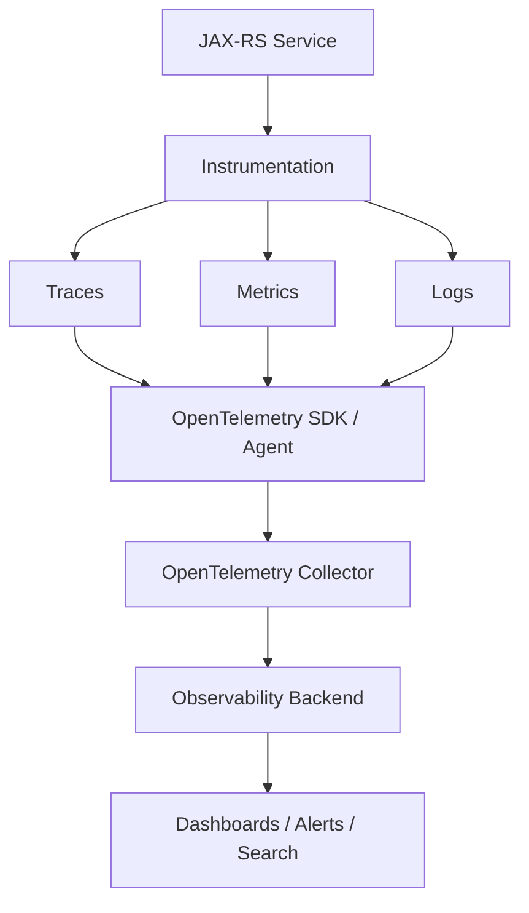
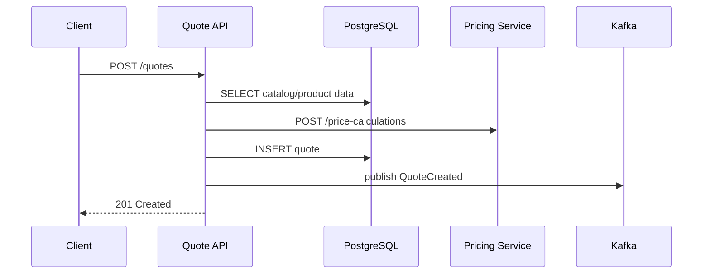
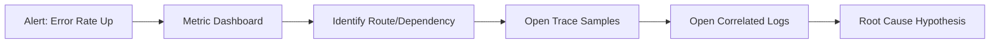
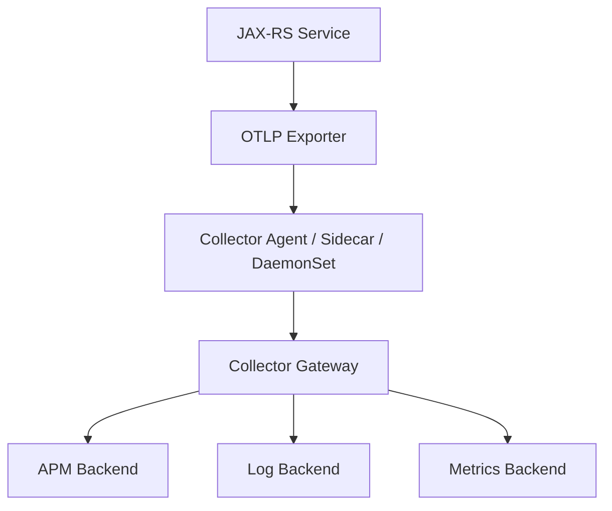

# Part 054 — OpenTelemetry Traces, Metrics, and Logs

> Fokus part ini: memahami OpenTelemetry sebagai model telemetry modern untuk JAX-RS enterprise service. Kita akan membahas traces, metrics, logs, trace ID, span ID, instrumentation point, collector, exporter, semantic attributes, dan cara menghubungkan telemetry dengan debugging production.

OpenTelemetry bukan sekadar tracing library.

OpenTelemetry adalah standardisasi cara aplikasi menghasilkan telemetry.

Telemetry utama:

```text
Traces  -> menjawab "request ini lewat mana dan lambat di mana?"
Metrics -> menjawab "apakah sistem sehat secara agregat?"
Logs    -> menjawab "apa yang terjadi pada event tertentu?"
```

Ketiganya saling melengkapi.

---

## 1. Core Mental Model

Observability bukan berarti semua data dikirim.

Observability berarti sistem menghasilkan signal yang cukup untuk menjawab pertanyaan operasional tanpa harus redeploy.



Dalam production system, telemetry harus menjawab:

```text
Apakah API latency naik?
Endpoint mana yang terdampak?
Tenant mana yang terdampak, jika policy mengizinkan?
Downstream mana yang lambat?
Apakah DB atau Kafka menjadi bottleneck?
Apakah error berasal dari validation, domain, dependency, atau bug?
Apakah rollout baru menyebabkan regression?
```

---

## 2. OpenTelemetry Building Blocks

Konsep utama:

```text
Instrumentation
  Code/agent/library yang menghasilkan telemetry.

Tracer
  Komponen yang membuat span.

Meter
  Komponen yang membuat metrics.

Logger / log bridge
  Komponen yang menghubungkan logs dengan telemetry context.

Context
  Carrier untuk trace/span/baggage di process dan lintas network.

Exporter
  Mengirim telemetry keluar dari process.

Collector
  Menerima, memproses, dan meneruskan telemetry ke backend.
```

OpenTelemetry bisa dipakai melalui:

```text
- Java agent auto-instrumentation
- manual instrumentation via SDK/API
- framework/library instrumentation
- collector-side enrichment/filtering
```

Internal stack bisa berbeda.

Karena itu, selalu verifikasi apakah service memakai Java agent, SDK manual, platform wrapper, atau kombinasi.

---

## 3. Traces

Trace merepresentasikan perjalanan satu operation lintas komponen.

Contoh:

```text
HTTP POST /quotes
  span: inbound JAX-RS request
  span: validate request
  span: query catalog table
  span: call pricing service
  span: persist quote
  span: publish QuoteCreated event
```



Trace membuat sequence tersebut terlihat sebagai tree/span graph.

---

## 4. Span

Span adalah unit kerja dalam trace.

Span biasanya punya:

```text
traceId
spanId
parentSpanId
name
kind
start time
end time
duration
status
attributes
events
links
```

Span kind umum:

```text
SERVER    inbound request
CLIENT    outbound request
PRODUCER  publish message
CONSUMER  consume message
INTERNAL  internal operation
```

Naming span harus stabil.

Contoh baik:

```text
HTTP POST /quotes
PricingClient.calculatePrice
QuoteRepository.insertQuote
Kafka publish QuoteCreated
```

Contoh buruk:

```text
POST /quotes/Q-123/items/I-456
calculate for customer John Smith
```

Masalahnya cardinality tinggi dan sensitive data risk.

---

## 5. Trace ID and Span ID

`traceId` mengidentifikasi keseluruhan trace.

`spanId` mengidentifikasi satu unit kerja dalam trace.

```text
traceId = journey ID
spanId  = step ID
```

Trace ID berbeda dari correlation ID.

Mapping yang sehat:

```text
traceId
  Observability-level distributed trace.

correlationId
  Business/support-level interaction ID.

requestId
  One service inbound request ID.

causationId
  Parent command/event/request causing current operation.
```

Dalam log, trace ID/span ID sebaiknya muncul otomatis lewat MDC/log bridge.

---

## 6. Context Propagation

Trace hanya berguna jika context dipropagate.

Untuk HTTP, standard umum adalah W3C Trace Context:

```text
traceparent
tracestate
```

Untuk baggage:

```text
baggage
```

Untuk internal/business correlation, sering ada header tambahan:

```text
X-Correlation-ID
X-Request-ID
X-Causation-ID
```

Jangan mencampur semuanya tanpa standard internal.

OpenTelemetry context menjawab tracing.

Correlation/cause headers menjawab business/debugging context.

Keduanya boleh hidup berdampingan.

---

## 7. Auto-Instrumentation vs Manual Instrumentation

### 7.1 Auto-Instrumentation

Java agent dapat otomatis membuat span untuk:

```text
- inbound HTTP/server framework
- outbound HTTP client
- JDBC
- Kafka producer/consumer
- common executors
- logging correlation
```

Kelebihan:

```text
- cepat diaktifkan
- coverage luas
- minim perubahan code
```

Kekurangan:

```text
- span name/attribute mungkin terlalu generic
- business context tidak otomatis diketahui
- overhead harus diuji
- library support bergantung versi
- hidden behavior jika engineer tidak paham agent
```

### 7.2 Manual Instrumentation

Manual instrumentation cocok untuk business/domain operation.

Contoh concept:

```java
Span span = tracer.spanBuilder("QuoteService.createQuote")
    .setSpanKind(SpanKind.INTERNAL)
    .startSpan();
try (Scope scope = span.makeCurrent()) {
    span.setAttribute("quote.operation", "create");
    span.setAttribute("tenant.tier", tenantTier);
    return quoteService.create(command);
} catch (Exception ex) {
    span.recordException(ex);
    span.setStatus(StatusCode.ERROR);
    throw ex;
} finally {
    span.end();
}
```

Kelebihan:

```text
- business operation terlihat jelas
- bisa menambah domain-safe attributes
- membantu debugging workflow kompleks
```

Risiko:

```text
- terlalu banyak span
- high-cardinality attributes
- leakage sensitive data
- inconsistent naming
```

Senior rule:

```text
Use auto-instrumentation for infrastructure boundaries.
Use manual instrumentation for important business or architectural boundaries.
```

---

## 8. What to Instrument in JAX-RS Service

Minimum instrumentation points:

```text
Inbound HTTP request
JAX-RS resource method / route
ExceptionMapper outcome
Outbound HTTP client
JDBC/PostgreSQL calls
Kafka producer publish
Kafka consumer process
Redis calls if important
Cloud SDK calls if important
Scheduled job execution
Workflow worker task
Feature flag evaluation if rollout-critical
```

Tidak semua method service butuh span.

Instrument boundary yang menjawab:

```text
where time is spent
where failure occurred
which dependency is unhealthy
which business operation is affected
```

---

## 9. Metrics

Metrics adalah angka agregat dari waktu ke waktu.

Untuk service HTTP, minimal:

```text
request count
request latency
error count
in-flight requests
request size
response size
```

Untuk dependency:

```text
outbound HTTP latency/error
DB query latency/error
connection pool usage
Kafka consumer lag
Kafka processing latency
Redis latency/error
cloud SDK latency/error
```

Untuk JVM/container:

```text
heap used
non-heap used
GC pause
thread count
CPU usage
memory limit usage
class count
```

Untuk business operation, pilih hati-hati:

```text
quote creation count
order submission count
pricing calculation failure count
reconciliation mismatch count
```

Business metrics harus low-cardinality dan tidak bocor data.

---

## 10. Metric Types

Umum di OpenTelemetry:

```text
Counter
  Monotonically increasing count.

UpDownCounter
  Value bisa naik/turun, misalnya in-flight requests.

Histogram
  Distribution, misalnya latency.

Gauge / ObservableGauge
  Current measurement, misalnya memory usage.
```

Latency sebaiknya histogram, bukan hanya average.

Average menyembunyikan tail latency.

Gunakan:

```text
p50
p90
p95
p99
max if needed
```

Senior rule:

```text
Users feel tail latency, not average latency.
```

---

## 11. RED and USE Metrics

Untuk request-driven service, gunakan RED:

```text
Rate
  request per second

Errors
  error rate by route/status/error category

Duration
  latency distribution
```

Untuk resource/system, gunakan USE:

```text
Utilization
  CPU, memory, connection pool usage

Saturation
  queue length, thread pool queue, pending requests

Errors
  failed operations, rejected tasks, OOM, connection failures
```

JAX-RS service butuh keduanya.

---

## 12. Semantic Attributes

OpenTelemetry punya semantic conventions untuk attributes seperti HTTP, DB, messaging.

Contoh concept:

```text
http.request.method
http.route
http.response.status_code
server.address
url.scheme
user_agent.original

 db.system
 db.name
 db.operation.name
 db.collection.name

 messaging.system
 messaging.destination.name
 messaging.operation.name
 messaging.kafka.consumer.group
```

Gunakan standard attributes jika tersedia.

Tambahkan custom attributes hanya jika perlu.

Custom attributes harus:

```text
- low-cardinality jika dipakai untuk metrics
- tidak mengandung PII/secret
- punya naming convention
- stabil lintas service
```

---

## 13. Logs in OpenTelemetry Context

Logs tetap penting.

Dengan OTel/log bridge, log bisa mengandung:

```text
traceId
spanId
severity
body/message
attributes
resource attributes
```

Manfaat:

```text
Dari trace, buka logs untuk span/request yang sama.
Dari error log, buka trace untuk latency breakdown.
Dari metric spike, cari trace exemplar/log terkait.
```

Ideal debugging flow:



---

## 14. Resource Attributes

Resource attributes menjelaskan "siapa yang menghasilkan telemetry".

Minimum:

```text
service.name
service.version
deployment.environment
host.name
container.name
k8s.namespace.name
k8s.pod.name
k8s.container.name
cloud.provider
cloud.region
```

Tanpa resource attributes, telemetry sulit dipakai saat banyak service/cluster/environment.

Internal platform biasanya mengisi sebagian via agent/collector/Kubernetes metadata.

Tetap verifikasi.

---

## 15. OpenTelemetry Collector

Collector adalah komponen penting.

Fungsinya:

```text
receive telemetry
batch telemetry
retry export
add resource attributes
filter sensitive attributes
sample traces
route telemetry to backend
convert protocol/format
```

Typical flow:



Deployment model bisa berbeda:

```text
- in-process exporter directly to backend
- sidecar collector
- node/DaemonSet collector
- centralized gateway collector
- platform-managed agent
```

Internal verification wajib.

---

## 16. Exporter and Protocol

OTel umumnya memakai OTLP:

```text
OTLP/gRPC
OTLP/HTTP
```

Exporter failure tidak boleh menjatuhkan business request.

Telemetry export harus:

```text
- bounded
- batched
- retried carefully
- droppable under pressure
- observable itself
```

Failure mode:

```text
Collector down menyebabkan app memory naik jika queue tidak bounded.
Exporter retry terlalu agresif menambah CPU/network pressure.
Telemetry backend lambat ikut mengganggu request latency jika export synchronous.
```

Senior rule:

```text
Telemetry should help diagnose production; it should not become the cause of outage.
```

---

## 17. Inbound JAX-RS Tracing

Auto instrumentation biasanya membuat server span untuk inbound request.

Yang perlu dipastikan:

```text
- span name memakai route template, bukan raw path
- HTTP method tersedia
- status code tersedia
- error status benar
- exception recorded untuk unexpected technical failure
- correlation ID bisa dicari di logs
```

Route template penting.

Bad:

```text
HTTP GET /quotes/Q-123/items/I-456
```

Good:

```text
HTTP GET /quotes/{quoteId}/items/{itemId}
```

Raw path menyebabkan high-cardinality trace/metric.

---

## 18. ExceptionMapper and Span Status

ExceptionMapper harus konsisten dengan telemetry.

Mapping concept:

```text
Validation error     -> HTTP 400, span may not be ERROR if expected client error policy says so
Domain rejection     -> HTTP 409/422, often not technical ERROR
Auth failure         -> HTTP 401/403, security signal
Dependency timeout   -> HTTP 504/503, span ERROR
Unexpected exception -> HTTP 500, span ERROR
```

Tidak semua 4xx harus dianggap span error secara operasional.

Tapi security-relevant 4xx bisa tetap perlu signal.

Policy internal harus jelas.

---

## 19. Outbound HTTP Instrumentation

Outbound span harus menjawab:

```text
service mana yang dipanggil?
operation apa?
berapa lama?
status apa?
retry attempt berapa?
apakah circuit breaker open?
```

Attributes aman:

```text
dependency.name
http.request.method
http.route or route template
http.response.status_code
retry.attempt
resilience.circuit_breaker.state
```

Avoid:

```text
full URL with query containing IDs/secrets
Authorization header
raw request/response body
customer name/email
```

---

## 20. JDBC/PostgreSQL Instrumentation

Auto instrumentation bisa membuat DB spans.

Perlu hati-hati dengan SQL statement.

SQL raw dapat mengandung sensitive data jika parameter inline.

Preferred attributes:

```text
db.system = postgresql
db.operation.name = SELECT/INSERT/UPDATE/DELETE
db.query.summary or queryName
repository.name
```

Jika internal policy mengizinkan statement, pastikan parameter tidak inline dan redaction aktif.

Metrics yang penting:

```text
connection pool active
connection pool idle
connection wait time
query duration
transaction duration
lock wait
deadlock count
```

---

## 21. Kafka Instrumentation

Kafka tracing lebih sulit karena asynchronous.

Producer span:

```text
kind = PRODUCER
topic
eventType
schemaVersion
eventId
correlationId
causationId
```

Consumer span:

```text
kind = CONSUMER
topic
partition
offset
consumerGroup
eventType
processingDuration
retryAttempt
```

Context propagation via Kafka headers perlu standard internal.

Headers umum:

```text
traceparent
tracestate
baggage
X-Correlation-ID
X-Causation-ID
X-Event-ID
```

Tanpa propagation, trace akan terputus di boundary Kafka.

---

## 22. Scheduled Job and Batch Instrumentation

Scheduled job tidak punya inbound HTTP trace.

Karena itu job harus membuat root context sendiri.

Minimum:

```text
job.name
job.run_id
schedule_time
start_time
duration
items_scanned
items_processed
items_failed
lock_acquired
retry_count
correlationId or jobRunCorrelationId
```

Job failure tanpa telemetry biasanya baru terlihat saat data sudah tidak konsisten.

Reconciliation job harus punya metric untuk mismatch detected/fixed/failed.

---

## 23. Feature Flag and Rollout Telemetry

Untuk safe rollout, telemetry harus bisa menjawab:

```text
Apakah error naik hanya untuk flag enabled?
Apakah canary version lebih lambat?
Apakah tenant tertentu terdampak?
Apakah path baru menghasilkan data mismatch?
```

Jangan menaruh raw tenant/customer/user ID sebagai metric label.

Gunakan dimensi aman seperti:

```text
service.version
feature.flag.name
feature.flag.variant
deployment.ring
release.channel
```

Feature flag value di span/log boleh membantu, tetapi harus dikontrol cardinality dan sensitivity-nya.

---

## 24. Observability for Multi-Tenancy

Multi-tenancy butuh observability, tetapi juga butuh privacy.

Pertanyaan yang harus dijawab:

```text
Apakah tenant tertentu mengalami error?
Apakah tenant-specific config menyebabkan behavior beda?
Apakah catalog/pricing version tertentu bermasalah?
```

Namun:

```text
tenantId mungkin sensitive
customerId biasanya high-cardinality dan sensitive
contract/pricing details tidak boleh bocor
```

Strategy:

```text
- log tenantId hanya jika policy mengizinkan
- gunakan hashed tenant key jika perlu
- gunakan tenant tier/region sebagai metrics label
- gunakan configVersion/catalogVersion/pricingRuleVersion bila aman
- hindari customer-level metrics label
```

---

## 25. Dashboard Design

Dashboard service minimum:

```text
HTTP rate by route
HTTP latency p50/p95/p99 by route
HTTP error rate by route/status/error category
Top dependency latency
Top dependency error
DB pool usage
DB query latency
Kafka consumer lag
Kafka processing error
JVM heap/non-heap/GC/thread
Container CPU/memory/restart
```

Dashboard harus membantu triage cepat.

Bukan menampilkan semua metric tanpa struktur.

Urutan triage:

```text
Is service receiving traffic?
Is latency high?
Is error rate high?
Which route?
Which dependency?
Which version/rollout ring?
Which logs/traces explain it?
```

---

## 26. Alerting Strategy

Alert harus actionable.

Alert buruk:

```text
CPU > 80% for 1 minute
```

Mungkin noisy.

Alert lebih baik:

```text
p95 latency for POST /quotes > SLO threshold for 10 minutes
5xx rate > threshold for critical endpoint
Kafka consumer lag increasing for 15 minutes
DB connection pool saturation > threshold
Reconciliation mismatch > 0 for critical invariant
```

Alert harus punya:

```text
owner
severity
runbook
dashboard link
likely causes
rollback/degrade guidance
```

---

## 27. Common Failure Modes

### 27.1 Broken Trace Propagation

Gejala:

```text
Trace hanya berisi satu service.
Outbound HTTP/Kafka muncul sebagai trace berbeda.
```

Penyebab:

```text
- headers tidak diteruskan
- client instrumentation tidak aktif
- executor kehilangan context
- Kafka headers tidak dipropagate
```

Mitigasi:

```text
- verify W3C trace headers
- instrument HTTP client/Kafka producer/consumer
- context-aware executor
- propagation tests
```

### 27.2 High-Cardinality Explosion

Gejala:

```text
Metrics backend mahal/lambat.
Dashboard sulit dibuka.
Backend menolak series baru.
```

Penyebab:

```text
- raw path sebagai label
- userId/customerId/orderId sebagai metric label
- exception message sebagai label
- dynamic span names
```

Mitigasi:

```text
- use route template
- restrict label allowlist
- review semantic attributes
- move high-cardinality data to logs only if safe
```

### 27.3 Telemetry Overhead

Gejala:

```text
Latency naik setelah instrumentation.
CPU naik.
Memory naik.
Exporter queue penuh.
```

Penyebab:

```text
- too many spans
- too many attributes
- synchronous export
- collector unavailable
- debug logging enabled
```

Mitigasi:

```text
- batching
- sampling
- bounded queues
- reduce manual spans
- load test instrumentation overhead
```

### 27.4 Missing Business Context

Gejala:

```text
Trace menunjukkan DB lambat, tetapi tidak tahu business operation mana yang terdampak.
```

Penyebab:

```text
- hanya auto-instrumentation
- tidak ada manual span untuk domain operation
- tidak ada correlation/causation ID di logs/events
```

Mitigasi:

```text
- add business boundary spans
- add safe domain attributes
- propagate correlation/causation ID
```

---

## 28. PR Review Checklist

Saat review PR, cek:

```text
[ ] Endpoint baru otomatis punya server span?
[ ] Span name memakai route template, bukan raw path?
[ ] Error mapping konsisten dengan span status?
[ ] Outbound HTTP call punya client span dan dependency name?
[ ] DB operation penting bisa terlihat dari trace/metric?
[ ] Kafka publish/consume membawa trace/correlation context?
[ ] Manual span hanya dipakai untuk boundary penting?
[ ] Attributes tidak mengandung PII/secret?
[ ] Metric labels low-cardinality?
[ ] Logs punya traceId/spanId/correlationId?
[ ] Scheduled job punya jobRunId dan telemetry?
[ ] Feature flag/canary behavior bisa dibedakan di telemetry?
[ ] Telemetry failure tidak menjatuhkan request path?
[ ] Dashboard/alert perlu diperbarui untuk behavior baru?
```

---

## 29. Internal Verification Checklist

Cek di codebase, deployment, platform, dan observability docs:

```text
Instrumentation model
[ ] Apakah memakai OpenTelemetry Java agent?
[ ] Apakah memakai manual SDK instrumentation?
[ ] Apakah framework/platform wrapper dipakai?
[ ] Versi OTel agent/SDK apa?

Exporter/collector
[ ] OTLP/gRPC atau OTLP/HTTP?
[ ] Exporter endpoint dari config mana?
[ ] Collector model: sidecar, DaemonSet, gateway, managed?
[ ] Apakah queue/batch/retry exporter bounded?

HTTP/JAX-RS
[ ] Apakah inbound JAX-RS/Servlet span otomatis muncul?
[ ] Apakah route template terdeteksi?
[ ] Apakah status code dan exception terekam benar?
[ ] Apakah correlation ID masuk logs dan response?

Dependency instrumentation
[ ] Apakah Jersey Client/Retrofit/OpenFeign terinstrumentasi?
[ ] Apakah JDBC/PostgreSQL spans aktif?
[ ] Apakah Kafka producer/consumer spans aktif?
[ ] Apakah Redis/cloud SDK spans aktif jika relevan?

Context propagation
[ ] Apakah W3C trace context diteruskan di HTTP?
[ ] Apakah Kafka headers membawa traceparent?
[ ] Apakah executor/thread pool menjaga context?
[ ] Apakah MDC/logs punya traceId/spanId?

Metrics
[ ] Apakah RED metrics tersedia per route?
[ ] Apakah DB pool metrics tersedia?
[ ] Apakah Kafka lag/processing metrics tersedia?
[ ] Apakah JVM/container metrics tersedia?
[ ] Apakah label cardinality dikontrol?

Security/cost
[ ] Apakah attributes diredact?
[ ] Apakah PII policy diterapkan?
[ ] Apakah sampling strategy jelas?
[ ] Apakah telemetry cost dimonitor?
```

---

## 30. Minimal Telemetry Contract for a JAX-RS Endpoint

Untuk endpoint production, minimal harus ada:

```text
Trace
  SERVER span for inbound route
  CLIENT spans for downstream calls
  DB spans or query metrics
  messaging spans if event published

Metrics
  request count
  latency histogram
  error count by category/status
  dependency latency/error

Logs
  request completed log
  structured error log if failure
  correlationId
  traceId/spanId
  tenant/config context if allowed
```

Contoh mapping:

```text
POST /quotes
  trace: HTTP POST /quotes
  span: QuoteService.createQuote
  span: CatalogRepository.findOffering
  span: PricingClient.calculate
  span: QuoteRepository.insert
  span: Kafka publish QuoteCreated

  metrics:
    http.server.duration{route="/quotes", method="POST"}
    http.server.request.count{status_class="2xx"}
    dependency.duration{dependency="pricing-service"}

  logs:
    quote.create.accepted
    kafka.event.published
    http.request.completed
```

---

## 31. OpenTelemetry and Senior Engineering Judgment

OpenTelemetry memberi mekanisme.

Ia tidak otomatis memberi observability yang baik.

Senior engineer tetap harus menentukan:

```text
boundary mana yang penting
span mana yang terlalu noise
attribute mana yang aman
metric mana yang actionable
alert mana yang meaningful
sampling mana yang tepat
data mana yang tidak boleh keluar
```

Observability yang baik adalah hasil desain.

Bukan hasil mengaktifkan agent saja.

---

## 32. Practical Cheat Sheet

```text
Use traces for request journey.
Use metrics for aggregate health.
Use logs for event detail.
Use route templates, not raw paths.
Keep span names stable.
Avoid PII/secret in attributes/logs.
Avoid high-cardinality metric labels.
Propagate trace context across HTTP and Kafka.
Bridge traceId/spanId into logs.
Instrument business boundaries manually when auto-instrumentation is not enough.
Use collector for batching, filtering, routing, and sampling.
Monitor telemetry overhead.
Make alerts actionable with runbooks.
```

---

## 33. Key Takeaways

OpenTelemetry adalah fondasi telemetry lintas traces, metrics, dan logs.

Trace menjelaskan perjalanan request.

Metric menjelaskan kesehatan agregat.

Log menjelaskan detail event.

Trace ID dan span ID harus tersedia di log agar debugging tidak terputus.

Auto-instrumentation membantu, tetapi tidak menggantikan manual instrumentation pada business boundary penting.

Context propagation adalah syarat utama distributed tracing.

Telemetry harus aman, bounded, low-noise, dan cost-aware.
