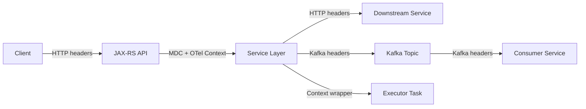
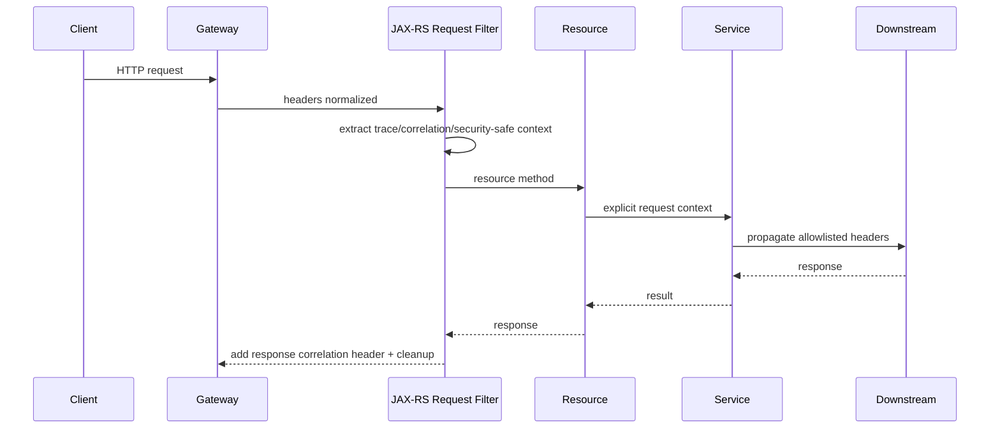
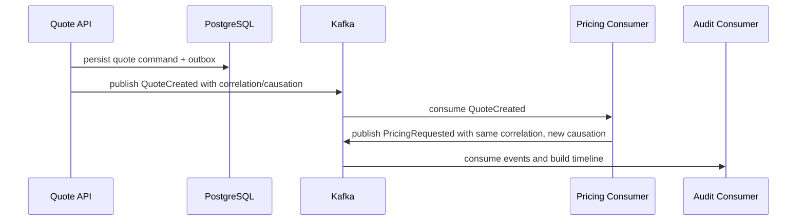

# Part 055 — Context Propagation across HTTP, Kafka, and Executors

> Fokus part ini: memahami bagaimana context berpindah dari satu boundary ke boundary lain di sistem enterprise: inbound HTTP, outbound HTTP, Kafka producer/consumer, executor/thread pool, MDC logging, security context, OpenTelemetry trace context, baggage, correlation ID, dan causation ID.

Context propagation adalah salah satu sumber bug production yang paling sulit dilihat.

Bukan karena konsepnya rumit, tetapi karena saat gagal, aplikasi tetap berjalan.

Yang rusak adalah kemampuan kita menjawab:

```text
Request ini berasal dari mana?
User/tenant mana yang memicunya?
Span mana parent-nya?
Event Kafka ini disebabkan oleh HTTP command apa?
Log ini milik request yang mana?
Kenapa audit trail terputus?
Kenapa trace tampak seperti beberapa request terpisah?
```

Dalam JAX-RS enterprise service, context sering berpindah melalui:

```text
HTTP inbound request
  -> JAX-RS filter/resource method
  -> service/domain layer
  -> database call
  -> outbound HTTP call
  -> Kafka publish
  -> async executor
  -> Kafka consumer in another service
  -> reconciliation job
```

Jika propagation tidak disiplin, debugging distributed system menjadi tebakan.

---

## 1. Core Mental Model

Context adalah metadata yang menjelaskan eksekusi, bukan data bisnis utama.

Contoh context:

```text
trace_id
span_id
parent_span_id
correlation_id
causation_id
request_id
tenant_id
user_id / subject
service_name
operation_name
idempotency_key
feature_flag_snapshot
locale / timezone
security principal
```

Tidak semua context boleh dipropagasikan ke semua tempat.

Aturan senior engineer:

```text
Propagate what is required for correctness, security, and observability.
Do not propagate sensitive data blindly.
```

Context propagation harus punya boundary.



Yang perlu dipahami:

1. HTTP membawa context lewat header.
2. Kafka membawa context lewat header.
3. Thread pool tidak otomatis membawa `ThreadLocal`.
4. MDC biasanya berbasis `ThreadLocal`.
5. OpenTelemetry context juga harus disimpan/diaktifkan dengan benar.
6. Security context tidak boleh disalin sembarangan ke background job.

---

## 2. Trace Context vs Correlation ID vs Causation ID

Ketiganya sering dicampur.

### Trace context

Trace context dipakai distributed tracing.

Biasanya mengikuti W3C Trace Context:

```text
traceparent: 00-<trace-id>-<span-id>-<flags>
tracestate: vendor-specific state
```

Maknanya:

```text
trace_id -> satu distributed execution graph
span_id  -> satu operation/node dalam graph
```

Trace context cocok untuk observability.

### Correlation ID

Correlation ID adalah ID yang dipakai untuk mengelompokkan log/event terkait.

Dalam banyak organisasi, correlation ID bisa sama dengan trace ID, tetapi tidak wajib.

Contoh:

```text
X-Correlation-ID: quote-request-8f37...
```

Gunanya:

```text
Cari semua log yang terkait satu external request/business operation.
```

### Causation ID

Causation ID menjelaskan hubungan sebab-akibat.

Contoh:

```text
HTTP command CreateQuote
  correlation_id = c-123
  causation_id   = request-001

Kafka event QuoteCreated
  correlation_id = c-123
  causation_id   = event-quote-created-001

Kafka event PricingRequested
  correlation_id = c-123
  causation_id   = event-quote-created-001
```

Causation ID sangat penting dalam event-driven system.

Tanpa causation ID, kita tahu event-event saling terkait, tetapi tidak tahu event mana menyebabkan event berikutnya.

---

## 3. Context Carrier by Boundary

Setiap boundary punya carrier berbeda.

| Boundary | Carrier | Common Fields |
|---|---|---|
| HTTP inbound | HTTP headers | `traceparent`, `tracestate`, `x-correlation-id`, auth header |
| HTTP outbound | HTTP headers | trace context, correlation ID, tenant context jika aman |
| Kafka producer | Kafka record headers | trace context, correlation ID, causation ID, event metadata |
| Kafka consumer | Kafka record headers | restored context, event ID, source service |
| Executor/thread pool | captured object/wrapper | OTel context, MDC map, security-safe subset |
| Logs | MDC fields | trace ID, span ID, correlation ID, tenant ID if allowed |
| Audit | explicit audit payload | actor, action, target, timestamp, reason |

Prinsipnya:

```text
Never assume context crosses boundary automatically.
```

---

## 4. Inbound HTTP Context in JAX-RS

Pada inbound HTTP, context biasanya dibaca di filter.

Contoh JAX-RS filter konseptual:

```java
@Provider
@Priority(Priorities.AUTHENTICATION)
public final class RequestContextFilter implements ContainerRequestFilter, ContainerResponseFilter {

    @Override
    public void filter(ContainerRequestContext request) {
        String correlationId = firstNonBlank(
            request.getHeaderString("X-Correlation-ID"),
            UUID.randomUUID().toString()
        );

        MDC.put("correlation_id", correlationId);
        MDC.put("http_method", request.getMethod());
        MDC.put("http_path", request.getUriInfo().getPath());

        // Do not blindly trust tenant/user headers unless gateway/auth policy says so.
    }

    @Override
    public void filter(ContainerRequestContext request, ContainerResponseContext response) {
        String correlationId = MDC.get("correlation_id");
        if (correlationId != null) {
            response.getHeaders().putSingle("X-Correlation-ID", correlationId);
        }
        MDC.clear();
    }
}
```

Catatan penting:

```text
MDC.clear() wajib dilakukan.
```

Alasannya: thread request bisa dipakai ulang oleh container.

Jika MDC tidak dibersihkan, request berikutnya bisa mewarisi context lama.

Itu bukan hanya bug observability; itu bisa menjadi data leak.

---

## 5. HTTP Outbound Propagation

Saat service memanggil downstream service, context harus dipropagasikan secara eksplisit.

Contoh konseptual:

```java
public final class OutboundHeaderFactory {
    public Map<String, String> buildHeaders(RequestContext ctx) {
        Map<String, String> headers = new HashMap<>();
        headers.put("X-Correlation-ID", ctx.correlationId());
        headers.put("X-Request-ID", UUID.randomUUID().toString());

        // W3C trace context is usually injected by OpenTelemetry instrumentation.
        // If manual propagation is used, verify exact propagator standard.

        return headers;
    }
}
```

Anti-pattern:

```java
// BAD: forward all inbound headers blindly
inboundHeaders.forEach(outboundRequest::header);
```

Kenapa buruk?

```text
Authorization header bisa bocor ke downstream yang tidak berhak.
Internal-only header bisa keluar trust boundary.
Spoofed tenant header bisa dipakai oleh service lain.
Large headers bisa menyebabkan 431 Request Header Fields Too Large.
```

Better rule:

```text
Whitelist propagated headers.
```

Untuk enterprise systems, header propagation harus dianggap security-sensitive.

---

## 6. Kafka Header Propagation

Kafka tidak punya HTTP headers, tetapi record punya headers.

Context bisa dibawa lewat Kafka record headers:

```text
traceparent
tracestate
x-correlation-id
x-causation-id
event-id
event-type
event-version
source-service
tenant-id, jika policy mengizinkan
```

Producer harus mengisi metadata event secara eksplisit.

```java
ProducerRecord<String, byte[]> record = new ProducerRecord<>(topic, key, payload);
record.headers().add("x-correlation-id", correlationId.getBytes(StandardCharsets.UTF_8));
record.headers().add("x-causation-id", commandId.getBytes(StandardCharsets.UTF_8));
record.headers().add("event-id", eventId.getBytes(StandardCharsets.UTF_8));
record.headers().add("source-service", "quote-order-service".getBytes(StandardCharsets.UTF_8));
producer.send(record);
```

Dalam praktik production, jangan menulis helper manual berulang di semua producer.

Gunakan abstraction:

```text
EventPublisher
  -> enrich metadata
  -> inject trace context
  -> enforce event ID
  -> enforce event type/version
  -> publish
```

---

## 7. Kafka Consumer Context Restoration

Saat consumer menerima event, context harus direstore untuk logging dan tracing selama processing event.

```java
public void onMessage(ConsumerRecord<String, byte[]> record) {
    try (MdcScope ignored = MdcScope.fromKafka(record.headers())) {
        String correlationId = Mdc.get("correlation_id");
        log.info("Processing event topic={} partition={} offset={}",
            record.topic(), record.partition(), record.offset());

        handler.handle(record);
    }
}
```

Yang harus terjadi:

```text
Read Kafka headers.
Restore correlation_id into MDC.
Restore trace context into OTel context if instrumentation/manual propagation supports it.
Create consumer span.
Clear MDC after processing.
Commit offset only after safe processing boundary.
```

Failure mode umum:

```text
Consumer logs tidak punya correlation ID.
Trace baru dibuat untuk setiap consumer processing, tidak tersambung dengan producer.
MDC dari message sebelumnya bocor ke message berikutnya.
DLQ event kehilangan metadata original.
Retry topic membuat causation chain putus.
```

---

## 8. Executor and Thread Pool Propagation

Thread pool adalah tempat context sering hilang.

Contoh:

```java
MDC.put("correlation_id", "c-123");
executor.submit(() -> {
    log.info("Running async task"); // correlation_id might be missing
});
```

Kenapa?

Karena MDC biasanya `ThreadLocal`.

Thread worker berbeda dari request thread.

Solusinya bukan berharap framework otomatis selalu benar.

Solusinya capture dan restore.

```java
public final class ContextAwareExecutor implements Executor {
    private final Executor delegate;

    public ContextAwareExecutor(Executor delegate) {
        this.delegate = delegate;
    }

    @Override
    public void execute(Runnable command) {
        Map<String, String> capturedMdc = MDC.getCopyOfContextMap();
        io.opentelemetry.context.Context capturedOtel = io.opentelemetry.context.Context.current();

        delegate.execute(() -> {
            Map<String, String> previous = MDC.getCopyOfContextMap();
            try (var scope = capturedOtel.makeCurrent()) {
                if (capturedMdc != null) {
                    MDC.setContextMap(capturedMdc);
                } else {
                    MDC.clear();
                }
                command.run();
            } finally {
                MDC.clear();
                if (previous != null) {
                    MDC.setContextMap(previous);
                }
            }
        });
    }
}
```

Catatan:

```text
Security context propagation ke async task harus dibatasi.
```

Background work tidak selalu boleh memakai identity user original.

Kadang harus berubah menjadi service identity dengan audit reference ke original actor.

---

## 9. ThreadLocal Risk

`ThreadLocal` berguna, tetapi berbahaya di server.

Risiko utama:

```text
Context leak antar request.
Memory leak jika value besar.
Data user/tenant bocor ke request lain.
Async task kehilangan context.
Test menjadi flaky karena state tersembunyi.
```

Anti-pattern:

```java
public final class TenantContextHolder {
    private static final ThreadLocal<String> TENANT = new ThreadLocal<>();

    public static void set(String tenant) { TENANT.set(tenant); }
    public static String get() { return TENANT.get(); }
}
```

Pattern ini bisa diterima hanya jika:

```text
Set di boundary yang jelas.
Clear di finally/filter.
Tidak dipakai sebagai pengganti parameter domain.
Tidak dipakai lintas async boundary tanpa wrapper.
Tidak menyimpan object besar.
```

Preferensi desain:

```text
Use explicit context object for business-sensitive decisions.
Use MDC/OTel context for observability metadata.
```

---

## 10. Baggage: Powerful but Dangerous

OpenTelemetry Baggage adalah key-value metadata yang bisa dipropagasikan lintas service.

Baggage berguna untuk:

```text
tenant tier
routing hint
experiment cohort
region hint
```

Tetapi baggage berbahaya jika berisi:

```text
PII
pricing data
large payload
authorization decision
secret
full user profile
```

Rule:

```text
Baggage is not a secure data store.
Baggage is not an authorization source.
Baggage should be small, low-cardinality, and policy-approved.
```

Internal system harus punya allowlist baggage keys.

---

## 11. Context Propagation and Security

Tidak semua context dari inbound request boleh dipercaya.

Contoh raw header:

```text
X-Tenant-ID: tenant-a
X-User-ID: admin
X-Correlation-ID: c-123
```

Header ini bisa datang dari client langsung kecuali gateway menghapus/mengganti.

Security rule:

```text
Identity and tenant context must come from trusted authentication/authorization layer, not arbitrary client headers.
```

Header yang boleh diterima dari client:

```text
Correlation/request ID, jika divalidasi dan dibatasi panjang/formatnya.
```

Header yang harus berasal dari trusted layer:

```text
authenticated subject
tenant identity
permission claims
service identity
```

Internal verification harus memastikan gateway/proxy/filter tidak membiarkan spoofed identity headers lolos.

---

## 12. Context Propagation in JAX-RS Filters

Pipeline yang umum:



Filter responsibilities:

```text
Generate missing correlation ID.
Validate incoming correlation ID format/length.
Populate MDC.
Ensure response includes correlation ID.
Clear MDC in all outcomes.
Do not decide business authorization unless designed as auth filter.
```

---

## 13. Context Propagation in Event-Driven Flow

Event-driven flow needs causation tracking.



Event metadata should usually include:

```text
event_id
correlation_id
causation_id
traceparent, if supported
event_type
event_version
occurred_at
source_service
source_instance, optional
producer_schema_version
```

Do not rely only on Kafka topic/offset for business event identity.

Offset identifies position in a partition, not business event identity.

---

## 14. DLQ and Retry Must Preserve Context

Retry/DLQ often breaks context.

Bad behavior:

```text
Original event goes to retry topic.
Retry publisher creates new event headers from scratch.
DLQ contains payload only, no original metadata.
Operator cannot trace original HTTP request.
```

Expected behavior:

```text
Original correlation ID preserved.
Original event ID preserved or referenced.
Retry attempt count added.
Last failure reason added safely.
Original topic/partition/offset captured.
DLQ record keeps diagnostic metadata.
```

Example retry metadata:

```text
x-original-topic
x-original-partition
x-original-offset
x-original-event-id
x-correlation-id
x-causation-id
x-retry-attempt
x-last-error-code
x-failed-at
```

Avoid putting full exception stack trace into Kafka headers.

It can exceed size limits and leak sensitive data.

---

## 15. Context Object vs Global Access

A mature codebase often uses explicit context object:

```java
public record RequestContext(
    String correlationId,
    String requestId,
    String tenantId,
    String subject,
    Instant receivedAt
) {}
```

Resource method:

```java
@POST
@Path("/quotes")
public Response createQuote(CreateQuoteRequest request, @Context HttpHeaders headers) {
    RequestContext ctx = requestContextFactory.from(headers);
    QuoteResult result = quoteService.createQuote(ctx, request);
    return Response.status(Status.CREATED).entity(result).build();
}
```

Benefit:

```text
Business-relevant context is explicit.
Tests can construct context easily.
No hidden dependency on ThreadLocal.
Context crossing async boundary becomes intentional.
```

But avoid passing an overloaded `Context` object containing everything.

Context object should be stable and intentionally scoped.

---

## 16. Context and Tenant-Aware Systems

In enterprise CPQ/order systems, tenant context can affect:

```text
product catalog
pricing rules
tax rules
currency
permissions
data partition
feature flags
routing
logging/audit
```

Therefore tenant context is not merely observability metadata.

Tenant context may affect correctness.

Rule:

```text
Tenant used for authorization/data access must come from trusted identity/config boundary.
Tenant used for logs must be sanitized and policy-approved.
```

Do not derive tenant from arbitrary request body unless the API contract explicitly allows it and authorization verifies it.

---

## 17. Debugging Broken Context Propagation

Symptoms:

```text
Logs have missing correlation_id.
Trace shows multiple roots for one business operation.
Kafka consumer spans are disconnected.
DLQ messages cannot be traced to original request.
Tenant ID appears wrong in logs.
MDC fields from previous request appear in current request.
```

Debug path:

```text
1. Check inbound HTTP headers.
2. Check request filter extraction.
3. Check MDC populated at resource method.
4. Check outbound HTTP/Kafka headers.
5. Check executor boundary capture/restore.
6. Check consumer header extraction.
7. Check MDC cleanup.
8. Check OTel propagator configuration.
9. Check gateway/proxy header mutation.
10. Check log formatter includes fields.
```

Useful test:

```text
Send request with known X-Correlation-ID.
Assert response contains same correlation ID.
Assert logs include same correlation ID.
Assert outbound HTTP mock receives same correlation ID.
Assert Kafka record headers include same correlation ID.
Assert consumer logs include same correlation ID.
```

---

## 18. Testing Context Propagation

Unit tests should cover:

```text
missing correlation ID generates one
invalid correlation ID rejected or normalized
MDC cleared after request
outbound header allowlist applied
Kafka headers include required metadata
executor wrapper preserves MDC/OTel context
security-sensitive headers are not forwarded
```

Example test shape:

```java
@Test
void clearsMdcAfterRequest() {
    filter.filter(requestContext);
    assertThat(MDC.get("correlation_id")).isEqualTo("c-123");

    filter.filter(requestContext, responseContext);
    assertThat(MDC.getCopyOfContextMap()).isNullOrEmpty();
}
```

Integration tests should verify propagation across real components where possible:

```text
JAX-RS test container
mock downstream HTTP server
Testcontainers Kafka
log capture/test appender
```

---

## 19. Common Failure Modes

| Failure | Cause | Impact | Detection |
|---|---|---|---|
| Missing correlation ID | Filter not registered | Logs cannot be grouped | Log query/dashboard |
| Wrong tenant in logs | MDC not cleared | Data leak risk | Security review/log anomaly |
| Trace disconnected | Propagator not configured | Broken distributed trace | Trace UI roots |
| Kafka context missing | Headers not copied | Event debugging hard | Consumer log/header inspection |
| Async logs missing context | ThreadLocal not propagated | Background task invisible | Executor tests |
| Header spoofing | Trusting inbound headers | Security breach | Pen test/security review |
| Cardinality explosion | Tenant/user in metric label | Observability cost/instability | Metrics backend warning |
| DLQ context lost | Retry publisher drops headers | Incident diagnosis slow | DLQ inspection |

---

## 20. PR Review Checklist

Review context propagation changes with these questions:

```text
Does inbound filter validate and normalize correlation/request IDs?
Is MDC cleared in all code paths?
Are propagated HTTP headers allowlisted?
Is trace context propagated by OTel instrumentation or manual propagator?
Are Kafka headers populated consistently?
Are retry/DLQ headers preserving diagnostic metadata?
Does executor/thread pool capture and restore context?
Is security/tenant context sourced from trusted boundary?
Are sensitive values excluded from baggage/logs/headers?
Are tests covering missing/invalid/leaked context?
```

Red flags:

```text
forward all headers
static ThreadLocal without clear
business logic reading tenant from MDC
Kafka event without event_id/correlation_id
async task using user identity indefinitely
MDC fields not included in log pattern
```

---

## 21. Internal Verification Checklist

For CSG Quote & Order or any internal enterprise codebase, verify instead of assuming:

```text
HTTP Context
- What inbound headers are standardized?
- Is W3C Trace Context used?
- Is X-Correlation-ID used separately from trace ID?
- Does gateway generate/normalize request IDs?
- Are spoofed identity/tenant headers stripped?

JAX-RS/Jersey Layer
- Which request/response filters populate MDC?
- Are filters registered explicitly or discovered by scanning?
- Is MDC cleared in response filter/finally block?
- Are ExceptionMappers preserving response correlation headers?

OpenTelemetry
- Is OTel Java agent used or manual SDK instrumentation?
- Which propagators are enabled?
- Are traces, metrics, and logs correlated?
- Is baggage enabled or restricted?

Kafka
- Which headers are mandatory for events?
- Are traceparent/correlation/causation IDs propagated?
- Are retry/DLQ topics preserving original metadata?
- Is event_id required?

Executors
- Are custom executors wrapped for MDC/OTel context?
- Are async jobs allowed to carry user context?
- Is security context propagated, transformed, or dropped?

Tenancy
- Where is tenant resolved?
- Is tenant context trusted from token, gateway, database, or request payload?
- Are tenant IDs logged? If yes, is this policy-approved?

Operations
- Can one production incident timeline be reconstructed from logs/traces/events?
- Are runbooks using correlation ID and trace ID consistently?
```

---

## 22. Senior Engineering Heuristics

Use these rules:

```text
Context that affects correctness should be explicit.
Context that affects observability can live in MDC/OTel context.
Context that affects security must come from trusted identity boundary.
Context crossing async boundary must be captured/restored intentionally.
Context crossing service boundary must be allowlisted.
Context in Kafka must survive retry and DLQ.
Context must be cleaned up after use.
```

The goal is not to add IDs everywhere.

The goal is causal continuity.

A senior engineer should be able to answer:

```text
Given one customer-impacting issue, can we reconstruct the technical and business path across HTTP, DB, Kafka, jobs, and downstream services?
```

If the answer is no, context propagation is incomplete.

---

## 23. Practical Mental Model

Think of context propagation as a chain of custody.

```text
Inbound request receives context.
Service validates and normalizes context.
Business layer uses explicit safe context.
Observability layer records context.
Outbound integrations propagate allowed context.
Async/event boundaries preserve causality.
Cleanup prevents leakage.
```

The invariant:

```text
Every externally triggered operation should be traceable without leaking sensitive data or trusting untrusted metadata.
```

That is the bar for production enterprise JAX-RS systems.
