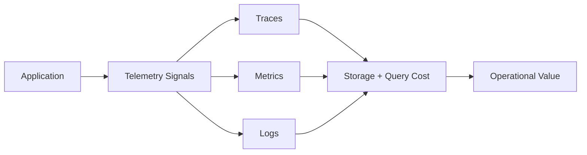
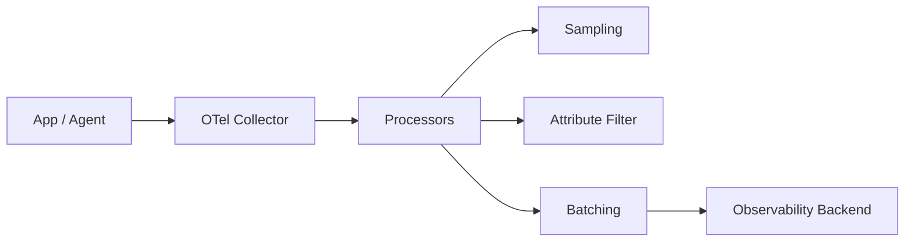

# Part 056 — Sampling Strategy and High-Cardinality Label Risk

> Fokus part ini: memahami bagaimana telemetry bisa menjadi alat debugging yang kuat sekaligus menjadi sumber biaya, noise, dan instability jika sampling dan cardinality tidak dikontrol. Kita akan membahas trace sampling, head sampling, tail sampling, metric label cardinality, log attribute cardinality, tenant/customer/user ID risk, dan review checklist untuk production observability.

Observability yang buruk bukan hanya kurang data.

Observability juga bisa buruk karena terlalu banyak data yang salah.

Dua masalah besar:

```text
Sampling salah
  -> trace penting tidak terlihat, atau telemetry terlalu mahal.

Cardinality tidak terkontrol
  -> metrics backend mahal/lambat/rusak, dashboard noisy, alert tidak stabil.
```

Senior engineer harus memahami telemetry sebagai production system tersendiri.

Telemetry punya:

```text
cost
capacity
latency
failure modes
data governance
security risk
```

---

## 1. Core Mental Model

Telemetry menjawab pertanyaan operasional.

Tetapi telemetry juga mengonsumsi resource.



Tujuannya bukan mengirim semua data.

Tujuannya:

```text
Send enough signal to debug and operate the system safely.
```

Observability production harus seimbang:

```text
coverage
cost
privacy
cardinality
queryability
alertability
retention
```

---

## 2. What Sampling Means

Sampling adalah keputusan untuk menyimpan/mengirim sebagian telemetry.

Biasanya paling relevan untuk traces.

Contoh:

```text
100% trace sampling
  semua request ditrace

10% trace sampling
  sekitar satu dari sepuluh request ditrace

error-based tail sampling
  simpan trace jika request error atau latency tinggi
```

Sampling tidak sama dengan logging level.

Sampling menjawab:

```text
Dari semua execution, mana yang worth disimpan sebagai trace lengkap?
```

---

## 3. Head Sampling vs Tail Sampling

### Head sampling

Head sampling mengambil keputusan di awal request.

```text
Request masuk -> sampler decide record/drop -> trace mengikuti keputusan itu
```

Kelebihan:

```text
simple
murah
bisa dilakukan di app/agent
mengurangi volume sejak awal
```

Kekurangan:

```text
belum tahu apakah request akan error
belum tahu latency akhir
bisa membuang trace penting
```

### Tail sampling

Tail sampling mengambil keputusan setelah trace selesai atau hampir selesai.

```text
Request selesai -> collector melihat atribut/result -> decide keep/drop
```

Kelebihan:

```text
bisa simpan error traces
bisa simpan high-latency traces
bisa simpan trace dari endpoint tertentu
bisa policy-driven
```

Kekurangan:

```text
butuh collector/buffer
lebih kompleks
lebih mahal di pipeline awal
ada latency sebelum decision
```

Production enterprise sering memakai kombinasi:

```text
Head sampling untuk baseline volume.
Tail sampling untuk error/slow/critical path.
```

---

## 4. Sampling Strategy by Signal Type

| Signal | Sampling Strategy | Notes |
|---|---|---|
| Traces | sampled | Tidak semua request perlu full trace |
| Metrics | aggregated, not sampled randomly | Metrics harus stabil untuk alert/SLO |
| Logs | level + sampling for noisy logs | Error/security/audit logs tidak boleh sembarang disample |
| Audit | generally not sampled | Audit harus memenuhi compliance/forensics |
| Security logs | generally not sampled for critical events | Sampling bisa menghilangkan attack evidence |

Rule:

```text
Do not apply generic random sampling to audit/security-critical records.
```

Audit dan security logs punya governance berbeda dari application debug logs.

---

## 5. Trace Sampling Policy Examples

Trace sampling bisa dipolicy-kan berdasarkan:

```text
endpoint
status code
latency
error type
tenant tier, jika policy mengizinkan
operation criticality
release/canary phase
feature flag
```

Contoh policy konseptual:

```yaml
trace_sampling:
  default_rate: 0.05
  always_keep:
    - http.status_code >= 500
    - duration_ms > 2000
    - route in ["POST /quotes", "POST /orders"]
  increased_sampling:
    - canary_release: true
      rate: 0.50
    - feature_flag: "new-pricing-engine"
      rate: 0.25
```

Untuk CPQ/order-style system, critical operations mungkin perlu sampling lebih tinggi:

```text
quote creation
order submission
pricing calculation
catalog activation
contract generation
payment/tax boundary, jika ada
```

Tetap jangan menganggap nama endpoint internal tertentu ada tanpa verifikasi.

---

## 6. Sampling and SLOs

SLO biasanya berbasis metrics, bukan sampled traces.

Contoh:

```text
99.9% of POST /quotes requests complete under 800ms over 30 days.
```

Data untuk SLO harus berasal dari metrics yang lengkap/agregat.

Trace sampling 10% tidak boleh membuat SLO salah.

Trace dipakai untuk menjelaskan mengapa SLO burn terjadi.

```text
Metrics detect.
Traces explain.
Logs narrate.
```

Jika traces disampling terlalu agresif, saat metrics menunjukkan latency spike, trace penyebabnya mungkin tidak tersedia.

---

## 7. High Cardinality: The Hidden Observability Killer

Cardinality adalah jumlah nilai unik untuk sebuah label/attribute.

Contoh low-cardinality label:

```text
http.method = GET | POST | PUT | DELETE
http.status_code = 200 | 400 | 500
service.name = quote-service | order-service
```

Contoh high-cardinality label:

```text
user_id = millions of users
request_id = unique per request
trace_id = unique per trace
order_id = unique per order
quote_id = unique per quote
timestamp = unique-ish
raw_url = includes query params
```

High cardinality pada metrics bisa menghancurkan backend observability.

Kenapa?

Metrics disimpan sebagai time series.

```text
metric_name + label set = time series
```

Jika label punya jutaan nilai unik, jumlah time series meledak.

---

## 8. Metrics Cardinality Example

Metric aman:

```text
http.server.duration{
  service="quote-order-api",
  method="POST",
  route="/quotes",
  status_code="201"
}
```

Metric berbahaya:

```text
http.server.duration{
  service="quote-order-api",
  method="POST",
  raw_path="/quotes/9f7a-1234-...",
  user_id="u-928391",
  tenant_id="tenant-12345",
  request_id="req-abc"
}
```

Masalah:

```text
raw_path menciptakan nilai unik per entity.
user_id menciptakan nilai unik besar.
request_id menciptakan nilai unik per request.
tenant_id bisa high-cardinality tergantung jumlah tenant.
```

Gunakan route template, bukan raw path:

```text
GOOD: /quotes/{quoteId}
BAD:  /quotes/9f7a-1234
```

---

## 9. Cardinality Rules by Signal

| Data | Metrics Label | Trace Attribute | Log Field |
|---|---:|---:|---:|
| route template | yes | yes | yes |
| HTTP method | yes | yes | yes |
| status code | yes | yes | yes |
| tenant ID | usually no / restricted | maybe | maybe, policy-based |
| user ID | no | rarely | only if approved/redacted |
| request ID | no | yes | yes |
| trace ID | no | inherent | yes |
| order ID | no | maybe | maybe, policy-based |
| exception class | yes if bounded | yes | yes |
| exception message | no | maybe sanitized | yes sanitized |
| SQL query text | no | no/controlled | sanitized/debug only |

Rule:

```text
Metrics labels must be bounded.
Trace attributes can tolerate more detail but still need policy.
Logs can hold detail, but must be searchable, redacted, and controlled.
```

---

## 10. Route Template vs Raw URL

This is one of the most important API observability rules.

Use:

```text
http.route = /quotes/{quoteId}/items/{itemId}
```

Avoid:

```text
http.target = /quotes/123/items/999?filter=customerId:abc
```

Why?

Raw URL includes:

```text
IDs
query params
possibly PII
unbounded values
```

In JAX-RS, route template extraction may depend on instrumentation quality.

Internal verification should check whether telemetry reports:

```text
@Path template
actual raw path
both
neither
```

If only raw path appears in metrics labels, cardinality risk is high.

---

## 11. Tenant Cardinality Risk

Tenant ID is tricky.

In enterprise systems, tenant is operationally useful.

But tenant can be high-cardinality and sensitive.

Options:

```text
Do not use tenant_id in metrics labels.
Use tenant_tier instead.
Use tenant_region instead.
Use allowlisted strategic tenant labels only if approved.
Put tenant_id in logs/traces with access control and retention policy.
Use exemplars or trace links for tenant-specific investigation.
```

Example safer metric:

```text
quote_creation_latency{
  tenant_tier="enterprise",
  region="ap-southeast",
  route="/quotes"
}
```

Risky metric:

```text
quote_creation_latency{
  tenant_id="tenant-928391"
}
```

There is no universal rule.

But there must be a platform rule.

---

## 12. High Cardinality in Logs

Logs can handle high-cardinality fields better than metrics, but not for free.

Risks:

```text
index explosion
slow queries
storage cost
PII leak
retention compliance issue
```

Log fields like these need policy:

```text
user_id
customer_id
tenant_id
quote_id
order_id
email
phone
contract_id
pricing_rule_id
```

Better approach:

```text
Include business IDs only when needed for support/debugging.
Redact or hash sensitive IDs if required.
Control index strategy in log backend.
Avoid logging full request/response body by default.
```

---

## 13. Span Attribute Discipline

Trace spans can contain attributes.

Useful attributes:

```text
service.name
http.method
http.route
http.status_code
db.system
db.operation
messaging.system
messaging.destination.name
messaging.operation
error.type
feature_flag.name, if bounded
```

Risky attributes:

```text
full SQL with parameters
raw request body
JWT token
customer PII
large payload
unbounded IDs everywhere
```

Senior rule:

```text
Span attributes should explain operation behavior, not duplicate payloads.
```

---

## 14. Exemplars: Connecting Metrics to Traces

Some observability backends support exemplars.

An exemplar links a metric data point to a trace sample.

Mental model:

```text
Latency histogram shows p99 spike.
Exemplar points to a trace that contributed to that bucket.
```

This is powerful because:

```text
Metrics stay low-cardinality.
Trace carries detail for selected sample.
```

If available, exemplars reduce pressure to put high-cardinality labels into metrics.

Internal verification:

```text
Does the platform support exemplars?
Are trace IDs attached to latency histograms?
Can dashboard jump from metric spike to trace?
```

---

## 15. Cardinality Budget

A mature platform defines cardinality budgets.

Example:

```text
Metric labels allowed:
- service.name
- environment
- region
- http.method
- http.route
- http.status_code
- error.type bounded list

Metric labels forbidden:
- request_id
- trace_id
- user_id
- raw URL
- quote_id
- order_id
- unbounded tenant_id
```

A budget forces trade-off.

For every new metric label, ask:

```text
How many unique values can this label have?
Can it grow with users, requests, orders, tenants, or time?
Is it needed for alerting or only debugging?
Could it live in logs/traces instead?
```

---

## 16. Sampling During Incident

Incident mode may need different sampling.

Example:

```text
Normal mode:
  default trace sampling 5%

Incident mode:
  route /quotes sampled 50%
  errors sampled 100%
  slow requests sampled 100%
  noisy debug logs enabled for 30 minutes
```

This should be controlled safely.

Do not leave incident-level telemetry enabled forever.

Common failure:

```text
Team increases sampling/debug logs during incident.
No owner turns it back down.
Observability bill spikes.
Backend becomes noisy.
```

Use TTL-based config where possible.

---

## 17. Sampling During Canary and Progressive Delivery

New rollout needs more observability.

During canary:

```text
increase trace sampling for canary pods/version
track error rate by version
track latency by version
compare old vs new release
sample feature-flagged path more heavily
```

Label caution:

```text
version/build SHA is bounded enough if controlled.
feature flag name may be bounded.
feature flag variant may be bounded.
request ID is not bounded.
```

Useful dimensions:

```text
service.version
release.track = stable | canary
feature_flag = new-pricing-engine
feature_variant = control | treatment
```

Only if label values are bounded and platform-approved.

---

## 18. Telemetry and Privacy

Observability data is often copied to many systems.

Therefore, telemetry must be treated as data exposure surface.

Never put these in metrics labels or span attributes without explicit approval:

```text
access token
refresh token
JWT raw value
password
secret
API key
full address
email
phone
payment data
full contract text
raw customer payload
```

Logs need redaction.

Traces need attribute filtering.

Metrics need label governance.

Collectors can enforce some policy, but applications should not emit unsafe data in the first place.

---

## 19. OpenTelemetry Collector as Policy Point

The OpenTelemetry Collector can help enforce telemetry policy:

```text
sampling
attribute dropping
attribute renaming
resource enrichment
batching
rate limiting
export routing
PII filtering, if configured
```

Conceptual collector flow:



But do not rely only on collector filtering.

If application emits secrets, the secret has already left the process.

---

## 20. Alerting and Cardinality

Alerts should use stable aggregate metrics.

Good alert dimensions:

```text
service
environment
region
route template
status code class
operation type
```

Bad alert dimensions:

```text
user_id
tenant_id unless carefully curated
request_id
raw error message
exception message with dynamic values
```

Alert should answer:

```text
Is a meaningful slice of the system unhealthy?
```

Not:

```text
Did one unique request fail?
```

Single request failure belongs in logs/traces, not paging alerts.

---

## 21. Metrics Design for JAX-RS APIs

Recommended API metrics:

```text
http.server.request.duration histogram
http.server.request.count
http.server.error.count
http.server.active_requests
http.server.request.size
http.server.response.size
```

Common labels:

```text
service.name
environment
http.method
http.route
http.status_code
error.type bounded
```

Avoid:

```text
raw path
query string
request body field
user ID
quote/order ID
request ID
```

For business metrics:

```text
quote.created.count
quote.pricing.failed.count
order.submission.count
catalog.activation.count
```

Keep labels bounded:

```text
status = success | failed
failure_category = validation | authorization | dependency | domain | unknown
channel = api | batch | event
```

---

## 22. Failure Modes

| Failure | Cause | Impact | Detection |
|---|---|---|---|
| Trace missing for incident | Sampling too low | Debugging slow | Incident review |
| Observability cost spike | Sampling too high | Budget/platform pressure | Cost dashboard |
| Metrics backend overloaded | High-cardinality labels | Slow dashboard/ingestion failure | Metrics backend warnings |
| SLO inaccurate | SLO based on sampled traces | Wrong reliability view | SLO review |
| PII leak | Unsafe attributes/log fields | Compliance/security incident | Security scan/audit |
| Alert noise | Labels too granular | Alert fatigue | Alert review |
| Route cardinality explosion | raw path used | Many time series | Cardinality dashboard |
| Canary blind spot | no version dimension/sampling | Regression missed | Release review |

---

## 23. Debugging Cardinality Problems

When observability platform is slow/expensive/noisy, inspect:

```text
Top metrics by series count.
Labels with most unique values.
New labels added recently.
Raw path vs route template usage.
Tenant/user/customer IDs in labels.
Exception message used as label.
Build/version labels with unbounded values.
```

Ask:

```text
Did a new PR add a metric label?
Did instrumentation change from route template to raw URL?
Did a gateway rewrite path before instrumentation?
Did a feature add tenant/customer-specific metric labels?
Did logs start indexing dynamic fields?
```

Fixes:

```text
Drop label.
Replace raw value with normalized category.
Move detail to trace/log.
Use route template.
Limit indexing.
Apply collector processor.
Add CI linting for forbidden labels.
```

---

## 24. PR Review Checklist

When reviewing telemetry changes, ask:

```text
What question does this telemetry answer?
Is this metric needed for alerting, dashboarding, or debugging?
Are all metric labels bounded?
Could any label grow with request/user/order/tenant/time?
Is route template used instead of raw URL?
Are IDs avoided in metrics labels?
Are PII/secrets excluded from logs/spans/metrics?
Is trace sampling appropriate for this path?
Are error and slow paths sampled enough?
Will canary/new feature have enough observability?
Is audit/security logging excluded from unsafe sampling?
Is collector/platform policy aligned with app emission?
```

Red flags:

```text
request_id as metric label
trace_id as metric label
raw exception message as metric label
full URL with query params
customer/user/order/quote ID as metric label
logging full payload by default
100% tracing enabled permanently without volume analysis
sampling audit logs
```

---

## 25. Internal Verification Checklist

For CSG Quote & Order or any enterprise JAX-RS codebase, verify:

```text
Sampling
- Is trace sampling configured in app, agent, collector, or backend?
- Is head sampling, tail sampling, or both used?
- Are error traces kept at higher rate?
- Are slow requests sampled?
- Is sampling adjusted during canary/incident?
- Is there a TTL or owner for temporary sampling changes?

Metrics Cardinality
- What labels are allowed on API metrics?
- Is http.route template available?
- Are raw paths/query strings excluded?
- Are tenant/customer/user/order/quote IDs forbidden as metric labels?
- Is there a cardinality dashboard?
- Is there CI/linting for metric names/labels?

Logs and Traces
- Are trace_id/span_id included in logs?
- Are correlation_id and causation_id included where needed?
- Are PII fields redacted?
- Are request/response bodies logged only under controlled conditions?
- Are span attributes filtered?

OpenTelemetry Collector
- Is an OTel Collector used?
- What processors are enabled?
- Are attribute filters configured?
- Is tail sampling configured?
- Are different exporters used for traces/metrics/logs?

Operations
- Are SLOs based on metrics, not sampled traces?
- Can operators jump from metric spike to trace/log?
- Are observability costs reviewed?
- Are telemetry changes reviewed like production code?
```

---

## 26. Senior Engineering Heuristics

Use these rules:

```text
Metrics are for aggregate truth.
Traces are for causal explanation.
Logs are for narrative detail.
Audit logs are evidence.
Security logs are detection and forensics.
```

For cardinality:

```text
If a value grows with users, requests, entities, tenants, or time, it is probably unsafe as a metric label.
```

For sampling:

```text
Sample normal traces.
Keep errors and slow requests.
Do not blindly sample audit/security-critical records.
Increase observability during rollout, then reduce it intentionally.
```

For production ownership:

```text
Telemetry must be useful during the worst hour of the system, not just impressive during a demo.
```

---

## 27. Practical Mental Model

A good telemetry strategy separates concerns:

```text
Metrics:
  low-cardinality, complete enough for SLO and alerting.

Traces:
  sampled, causally rich, useful for root cause analysis.

Logs:
  structured, searchable, correlated, redacted.

Audit/security records:
  governed, retained, not casually sampled.
```

The invariant:

```text
Observability must improve operational clarity without creating new production, cost, or compliance failures.
```

That is the senior-level bar.
