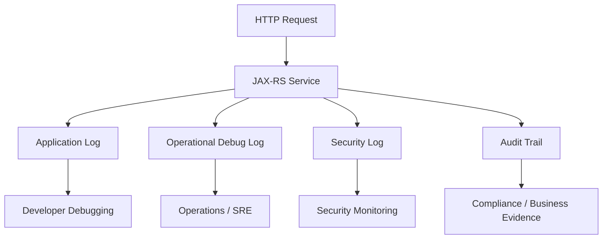
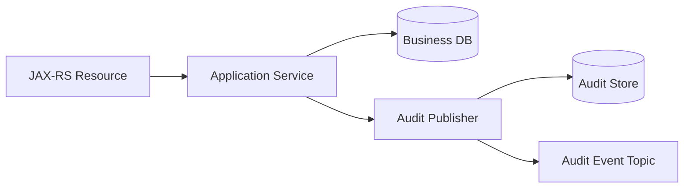
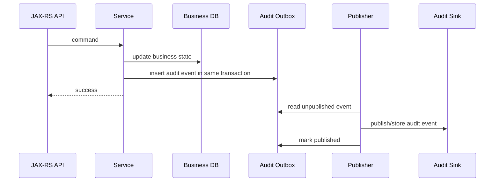
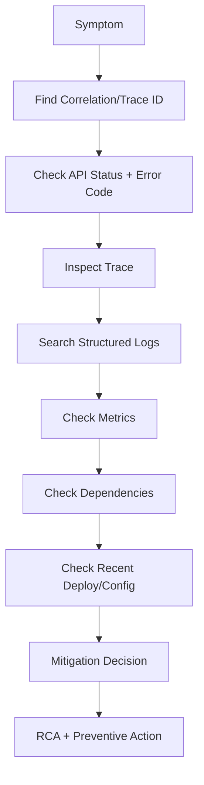

# Part 057 — Audit Security Logging and Operational Debugging

> Fokus part ini: membedakan application log, audit log, security log, dan operational debugging signal. Di sistem enterprise seperti CPQ/quote/order management, log bukan hanya alat developer. Log adalah evidence, alat investigasi, input compliance, dan salah satu fondasi incident response.

Logging production yang baik bukan berarti `log everything`.

Logging production yang baik berarti:

```text
cukup detail untuk investigasi
cukup aman untuk tidak membocorkan data
cukup stabil untuk dicari
cukup konsisten untuk dikorelasikan
cukup terstruktur untuk mesin
cukup ringkas agar tidak menjadi noise dan biaya
```

Senior engineer harus memandang logging sebagai bagian dari desain sistem.

Bukan dekorasi setelah code selesai.

---

## 1. Core Mental Model

Dalam service enterprise, ada beberapa jenis log/signal yang sering dicampur:

```text
application log
  -> apa yang terjadi di aplikasi

operational log
  -> apa yang perlu operator tahu untuk debugging

security log
  -> event yang relevan untuk security monitoring

audit log
  -> evidence perubahan/action penting yang harus bisa dipertanggungjawabkan
```

Perbedaan ini penting karena masing-masing punya:

```text
retention berbeda
akses berbeda
format berbeda
sensitivity berbeda
immutability requirement berbeda
consumer berbeda
```

Diagram sederhananya:



Satu request bisa menghasilkan beberapa signal.

Tetapi signal tersebut tidak boleh asal disamakan.

---

## 2. Application Log vs Audit Log vs Security Log

### Application log

Application log menjawab:

```text
Apa yang terjadi di code path aplikasi?
```

Contoh:

```text
request received
validation failed
external service timeout
database deadlock
retry exhausted
background worker started
```

Application log biasanya dipakai oleh engineer.

### Audit log

Audit log menjawab:

```text
Siapa melakukan apa, terhadap object apa, kapan, dari mana, dan hasilnya apa?
```

Contoh audit event:

```text
user approved quote
user changed pricing override
user submitted order
system cancelled stale workflow
admin changed tenant configuration
service applied catalog version
```

Audit log biasanya dipakai oleh:

```text
compliance
support
security investigation
business dispute resolution
customer impact analysis
```

### Security log

Security log menjawab:

```text
Apakah ada aktivitas mencurigakan atau pelanggaran security boundary?
```

Contoh:

```text
invalid token
expired token
wrong audience
permission denied
cross-tenant access attempt
excessive failed authorization
suspicious admin action
secret access failure
mTLS handshake failure
```

Security log biasanya dikonsumsi SIEM atau security monitoring.

---

## 3. Why Audit Trail Exists

Audit trail ada karena sistem enterprise membutuhkan accountability.

Bukan hanya correctness teknis.

Untuk sistem quote/order, beberapa action punya konsekuensi bisnis:

```text
pricing changed
quote approved
contract term selected
order submitted
customer-facing data modified
manual override applied
workflow state changed
```

Jika terjadi dispute, incident, atau compliance review, pertanyaannya bukan:

```text
Apakah method Java execute tanpa exception?
```

Pertanyaannya:

```text
Siapa melakukan action ini?
Kapan?
Dari channel mana?
Dengan input apa?
Terhadap tenant/customer/order/quote mana?
Apakah berhasil?
Jika gagal, gagal karena apa?
Apakah action ini authorized?
Apakah ada approver?
Apakah ada previous value dan new value?
```

Audit trail harus bisa menjawab pertanyaan tersebut.

---

## 4. Audit Event Shape

Audit event harus structured.

Jangan bergantung pada kalimat bebas seperti:

```text
User john updated quote Q123
```

Gunakan field yang bisa dicari.

Contoh shape konseptual:

```json
{
  "eventType": "QUOTE_PRICE_OVERRIDE_APPLIED",
  "eventTime": "2026-07-10T03:15:30.123Z",
  "actorType": "USER",
  "actorId": "user-123",
  "tenantId": "tenant-abc",
  "subjectType": "QUOTE",
  "subjectId": "quote-456",
  "action": "APPLY_PRICE_OVERRIDE",
  "result": "SUCCESS",
  "correlationId": "corr-789",
  "causationId": "cmd-111",
  "sourceIp": "10.1.2.3",
  "userAgent": "...",
  "reasonCode": "APPROVED_DISCOUNT_POLICY",
  "metadata": {
    "oldValueHash": "...",
    "newValueHash": "...",
    "approvalId": "approval-222"
  }
}
```

Tidak semua field selalu ada.

Tetapi audit schema harus eksplisit.

Minimal audit event biasanya punya:

```text
event type
time
actor
subject/object
action
result
tenant/customer boundary
correlation id
source/context
```

---

## 5. What Should Be Audited

Audit bukan untuk semua log line.

Audit untuk action yang punya business/security/compliance significance.

Biasanya audit-worthy:

```text
create/update/delete business object
approval/rejection
manual override
permission change
configuration change
security-sensitive access
export/download sensitive data
tenant/customer boundary change
workflow state transition
financial/pricing/tax-affecting decision
```

Untuk CPQ/quote/order-like system, kandidat audit:

```text
quote created
quote recalculated
pricing rule applied
manual discount override applied
quote submitted for approval
quote approved/rejected
order generated from quote
order submitted
order cancelled
catalog version selected
tenant-specific rule changed
```

Tetapi detail internal CSG harus diverifikasi.

Jangan mengasumsikan event/action tertentu ada di codebase.

---

## 6. What Should Not Be Audited

Tidak semua debug event harus jadi audit event.

Biasanya bukan audit:

```text
method entered
SQL executed
cache miss
retry attempt
HTTP client connection opened
JSON serialization completed
```

Hal-hal itu penting untuk debugging, tetapi bukan business evidence.

Kesalahan umum:

```text
application log dianggap audit trail
```

Ini berbahaya karena application log sering:

```text
tidak immutable
tidak punya schema stabil
tidak punya actor/object/action jelas
tidak punya retention yang sesuai
dapat berubah saat refactor
tidak selalu lengkap
```

Audit trail harus punya lifecycle sendiri.

---

## 7. Audit Persistence Pattern

Audit event dapat dikirim ke beberapa target:

```text
database audit table
append-only log store
Kafka topic
SIEM pipeline
object storage archive
vendor audit service
```

Pattern sederhana:



Tetapi production system perlu memikirkan consistency.

Jika business transaction berhasil tetapi audit event gagal, apa yang terjadi?

Pilihan:

```text
fail business operation jika audit gagal
best-effort audit
transactional audit table
outbox-based audit publishing
```

Untuk action compliance-critical, best-effort sering tidak cukup.

Pattern yang lebih aman:



Dengan cara ini, audit event tidak hilang saat publish sink sedang down.

---

## 8. Security Logging Taxonomy

Security log bukan hanya `login failed`.

Untuk service API, security events dapat mencakup:

```text
AUTHENTICATION_FAILED
TOKEN_EXPIRED
TOKEN_INVALID_SIGNATURE
TOKEN_WRONG_ISSUER
TOKEN_WRONG_AUDIENCE
TOKEN_CLOCK_SKEW_REJECTED
AUTHORIZATION_DENIED
TENANT_MISMATCH
SENSITIVE_DATA_ACCESS
ADMIN_CONFIGURATION_CHANGED
SECRET_ACCESS_DENIED
RATE_LIMIT_SECURITY_TRIGGERED
SUSPICIOUS_REPLAY_ATTEMPT
```

Security log harus menghindari membocorkan token atau secret.

Jangan log:

```text
raw JWT
Authorization header
refresh token
client secret
private key
password
full PII payload
session cookie
```

Boleh log fingerprint/hash yang aman jika dibutuhkan:

```text
token fingerprint
key id
issuer
audience
subject id
client id
scope summary
failure reason category
```

---

## 9. Secure Logging and Redaction

Logging adalah salah satu sumber data leak paling umum.

Data sensitif yang sering tidak sengaja masuk log:

```text
Authorization header
Cookie header
JWT claims
customer name/email/phone
address
payment data
contract details
pricing details
internal cost/margin
raw request body
raw response body
SQL bind parameter
stacktrace with data
```

Redaction harus terjadi sebelum log dikirim.

Contoh policy:

```text
Authorization -> [REDACTED]
Cookie -> [REDACTED]
email -> hash or partial mask
phone -> partial mask
customerId -> allowed if not PII by policy
tenantId -> allowed with cardinality control
quoteId/orderId -> allowed if operationally needed
```

Contoh utility konseptual:

```java
public final class SafeLog {
    public static String redactHeader(String name, String value) {
        if (name == null) return null;
        String lower = name.toLowerCase(Locale.ROOT);

        if (lower.equals("authorization") || lower.equals("cookie") || lower.contains("secret")) {
            return "[REDACTED]";
        }

        return value;
    }
}
```

Jangan bergantung pada developer discipline manual.

Gunakan:

```text
centralized logging wrapper
structured logging helper
request logging filter with denylist/allowlist
object mapper redaction annotation
logback/log4j masking policy
CI/static check untuk secret logging
```

---

## 10. JAX-RS Logging Points

Di JAX-RS service, logging bisa ditempatkan di beberapa layer.

```text
Container/gateway
  -> raw access log, TLS, status, latency

JAX-RS request filter
  -> request metadata, correlation ID, identity summary

Resource method
  -> API-level command received, validation boundary

Application service
  -> business action, state transition, domain decision

Repository/client adapter
  -> DB/downstream dependency behavior

ExceptionMapper
  -> normalized error response and exception category

Response filter
  -> final status, latency, response metadata
```

Jangan semua layer log hal yang sama.

Logging harus punya ownership.

Contoh:

```text
request filter logs request envelope
service logs business decision
exception mapper logs normalized failure
response filter logs outcome and duration
audit publisher records business evidence
```

---

## 11. Request/Response Logging Filter

JAX-RS request filter cocok untuk metadata.

Bukan raw body besar.

Contoh konseptual:

```java
@Provider
@Priority(Priorities.AUTHENTICATION)
public class RequestMetadataLoggingFilter implements ContainerRequestFilter {

    @Override
    public void filter(ContainerRequestContext requestContext) {
        String method = requestContext.getMethod();
        String path = requestContext.getUriInfo().getPath();
        String correlationId = requestContext.getHeaderString("X-Correlation-ID");

        // Put into MDC for downstream logs.
        MDC.put("http.method", method);
        MDC.put("http.path", path);
        MDC.put("correlation.id", correlationId);

        // Log metadata only. Do not log Authorization/Cookie/raw body.
        log.info("http_request_received method={} path={}", method, path);
    }
}
```

Response filter cocok untuk outcome:

```java
@Provider
public class ResponseOutcomeLoggingFilter implements ContainerResponseFilter {

    @Override
    public void filter(ContainerRequestContext request, ContainerResponseContext response) {
        int status = response.getStatus();
        String method = request.getMethod();
        String path = request.getUriInfo().getPath();

        log.info("http_request_completed method={} path={} status={}", method, path, status);
    }
}
```

Production note:

```text
Pastikan MDC dibersihkan setelah request.
```

Jika thread reused oleh container, MDC yang tidak dibersihkan bisa menyebabkan log cross-request salah.

---

## 12. ExceptionMapper and Failure Logging

`ExceptionMapper` adalah tempat natural untuk normalized failure logging.

Tetapi jangan semua exception dilog sebagai `ERROR`.

Contoh taxonomy:

```text
validation error -> INFO or WARN depending policy
not found -> INFO or DEBUG
business rule rejection -> INFO
permission denied -> WARN/security log
unexpected exception -> ERROR
external timeout -> WARN/ERROR depending impact
```

Kesalahan umum:

```text
semua 4xx dilog ERROR
semua exception stacktrace dilog penuh
business rejection dianggap incident
```

Lebih baik:

```java
@Provider
public class ApiExceptionMapper implements ExceptionMapper<Throwable> {

    @Override
    public Response toResponse(Throwable ex) {
        ErrorCategory category = classify(ex);

        switch (category) {
            case VALIDATION -> log.info("request_validation_failed code={}", errorCode(ex));
            case AUTHORIZATION -> securityLog.warn("authorization_denied code={}", errorCode(ex));
            case TECHNICAL -> log.error("unexpected_api_failure", ex);
            default -> log.warn("api_failure category={}", category, ex);
        }

        return buildErrorResponse(category, ex);
    }
}
```

---

## 13. Operational Debugging Workflow

Debugging production harus structured.

Jangan mulai dari membaca code acak.

Mulai dari signal dan timeline.

```text
1. Identify incident/request/customer/tenant/time window.
2. Find correlation ID / trace ID / request ID.
3. Inspect API outcome: status, latency, endpoint, error code.
4. Follow trace across downstream calls.
5. Check logs by correlation ID.
6. Check metrics around the same time window.
7. Check dependency health: DB, Kafka, Redis, downstream HTTP.
8. Check deployment/config changes.
9. Reconstruct timeline.
10. Decide mitigation: rollback, config change, kill switch, rate limit, manual recovery.
```

Mermaid view:



Senior debugging is evidence-driven.

---

## 14. Debugging by Symptom

### Symptom: User gets 500

Check:

```text
error code in response
correlation ID
ExceptionMapper category
stacktrace availability
recent deployments
DB/downstream failures
```

Avoid:

```text
assuming it is application bug before checking dependencies
```

### Symptom: User gets 403

Check:

```text
identity subject
tenant id
permission set
resource ownership
policy decision log
role/ACL source freshness
```

Avoid:

```text
logging raw JWT to debug claims
```

### Symptom: Request slow

Check:

```text
trace span durations
DB query latency
connection pool wait
external client latency
thread pool saturation
GC pause
CPU throttling
```

### Symptom: Audit trail missing

Check:

```text
was action audit-worthy?
audit event generated?
audit persisted in transaction?
outbox publisher running?
audit sink down?
retry exhausted?
```

---

## 15. Tenant-Aware Logging

Multi-tenant systems need tenant-aware logs.

But tenant/customer identifiers can create privacy and cardinality issues.

Recommended distinction:

```text
tenantId
  useful for routing/debugging/security boundary

customerId
  may be business-sensitive; use only if needed

userId
  security/audit useful; privacy-sensitive

quoteId/orderId
  useful for support; may be sensitive
```

Policy should define which fields may appear in:

```text
application logs
metrics labels
trace attributes
audit events
security logs
```

Important:

```text
A field safe for audit may be unsafe for metrics label.
```

Example:

```text
tenantId in audit event -> often useful
tenantId as metric label -> high cardinality risk
raw customer email in logs -> usually unsafe
```

---

## 16. Tamper Resistance and Retention

Audit trail may need stronger guarantees than application logs.

Consider:

```text
append-only storage
restricted write path
restricted delete access
retention policy
immutable archive
hash chaining
object lock / WORM storage
separate access control
```

Not every system needs all of these.

But senior engineer must ask:

```text
Can someone modify or delete the evidence after the fact?
Who has access?
How long is it retained?
Can support search it safely?
Can compliance export it?
```

---

## 17. Failure Modes

### Failure mode: audit event missing

Causes:

```text
best-effort audit publish failed
audit outside transaction
exception before audit call
async publisher dropped event
audit sink unavailable
filter does not cover internal action
```

Mitigation:

```text
transactional audit/outbox
mandatory audit at service boundary
publisher retry
reconciliation job
alert on unpublished audit backlog
```

### Failure mode: sensitive data leaked in logs

Causes:

```text
raw request/response body logging
exception message contains PII
Authorization header logged
SQL bind params logged
third-party client logs request
```

Mitigation:

```text
redaction filter
allowlist logging
safe error messages
logger config review
security scanning
incident response process
```

### Failure mode: impossible to debug incident

Causes:

```text
missing correlation ID
unstructured logs
inconsistent error codes
logs sampled too aggressively
trace context lost in executor/Kafka
```

Mitigation:

```text
mandatory correlation propagation
structured logs
standard error taxonomy
context propagation library
observability review
```

### Failure mode: log cost explosion

Causes:

```text
log per item in large loop
debug logging enabled in production
high-cardinality fields
raw payload logging
retry storm generating logs
```

Mitigation:

```text
rate-limited logging
sampled debug logs
cardinality policy
payload logging ban
retry storm detection
```

---

## 18. PR Review Checklist

When reviewing logging/audit/security changes, ask:

```text
Does this log expose secret, token, PII, pricing, margin, or contract data?
Is this application log, audit log, or security log?
Is the event structured?
Does it include correlation/trace ID?
Does it include tenant boundary where appropriate?
Does it avoid high-cardinality labels in metrics?
Is log level correct?
Is stacktrace necessary?
Is audit event persisted reliably?
Is audit event emitted exactly at the right business boundary?
Is security failure logged without leaking sensitive data?
Can support/debugging use this during incident?
Does this create excessive volume during retry/storm/failure?
```

For audit specifically:

```text
Is actor clear?
Is subject/object clear?
Is action clear?
Is result clear?
Is timestamp authoritative?
Is old/new value policy clear?
Is event immutable enough for requirement?
Is retention defined?
```

---

## 19. Internal Verification Checklist

Verify in internal codebase/platform:

```text
Which logging framework is used? Logback, Log4j2, JUL, other?
Is logging JSON structured or plain text?
What are mandatory fields in every log line?
How is correlation ID generated and propagated?
How are trace ID/span ID included in logs?
Is MDC cleared after request?
Is there a centralized request/response logging filter?
Is raw body logging allowed anywhere?
Is there a redaction library or policy?
Where are audit events produced?
Are audit events stored in DB, Kafka, external audit service, or logs?
Are audit events transactional with business state?
Is outbox used for audit publishing?
What is audit retention policy?
Who can access audit logs?
What security events are sent to SIEM?
Are tenant/customer/user IDs allowed in logs?
Is PII classification documented?
How are support/debugging workflows documented?
Is there an incident playbook that uses correlation ID/trace ID?
```

For CSG Quote & Order context, verify carefully:

```text
which quote/order actions are audit-worthy
whether pricing override is audited
whether catalog/rule changes are audited
whether tenant-specific config changes are audited
whether manual workflow transitions are audited
whether support/admin actions have separate audit treatment
```

Do not assume these exist without evidence.

---

## 20. Senior Engineer Heuristics

Use these heuristics:

```text
If it affects customer/business state, consider audit.
If it affects security boundary, consider security log.
If it helps debug production failure, use structured application log.
If it contains sensitive data, redact or do not log.
If it can explode volume, sample or aggregate.
If it crosses service boundary, carry correlation/trace context.
If it must be evidence, do not rely on best-effort debug logs.
```

The point is not more logs.

The point is better evidence.

---

## 21. Practical Exercise

Pick one existing endpoint in the internal codebase.

Trace these questions:

```text
What logs are emitted when request succeeds?
What logs are emitted when validation fails?
What logs are emitted when authorization fails?
What logs are emitted when DB fails?
Is correlation ID present in all logs?
Is trace ID present?
Is tenant ID present where allowed?
Are any sensitive fields logged?
Is any business action audited?
Is the audit event reliable?
Can you reconstruct an incident timeline from existing logs?
```

Then propose one improvement:

```text
better error category
better redaction
better audit event
better correlation propagation
better log level
better runbook link
```

---

## 22. Key Takeaways

```text
Application logs explain code behavior.
Audit logs provide business/compliance evidence.
Security logs expose boundary violations and suspicious behavior.
Operational debugging needs correlation, structure, and timeline.
Raw payload logging is dangerous.
Audit trail must be reliable enough for its business purpose.
A senior engineer reviews logs as production API for humans and machines.
```

Logging is not just output.

It is part of the system contract.
