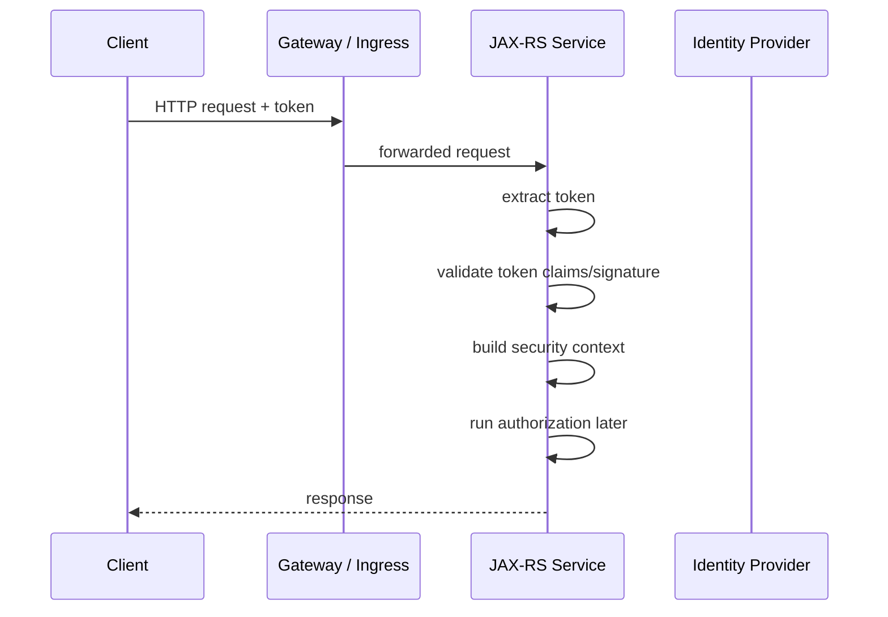
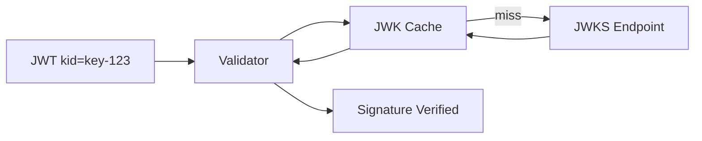

# Part 058 — Authentication, OAuth2, OIDC, JWT, and Identity

> Fokus part ini: memahami authentication dan identity di JAX-RS enterprise API. Kita akan membahas perbedaan authentication vs authorization, OAuth2/OIDC mental model, JWT validation, issuer/audience/key rotation, clock skew, security context, JAX-RS filter placement, dan failure mode 401/403.

Authentication menjawab:

```text
Who or what is calling this API?
```

Authorization menjawab:

```text
Is this caller allowed to perform this action on this resource?
```

Keduanya sering dicampur.

Di production enterprise system, mencampur keduanya menghasilkan bug security yang serius.

---

## 1. Core Mental Model

API backend biasanya bertindak sebagai protected resource.

Client mengirim credential/token.

Service memvalidasi identity.

Lalu service membuat security context untuk layer berikutnya.



Authentication yang benar bukan hanya decode JWT.

Authentication berarti:

```text
token extracted from trusted location
token format understood
signature verified
issuer trusted
audience matches service
expiration valid
not-before valid
algorithm allowed
key rotation handled
identity mapped to internal principal
context propagated safely
failure mapped to correct 401 response
```

---

## 2. Authentication vs Authorization

Authentication:

```text
Caller identity is valid.
```

Authorization:

```text
Valid caller has permission.
```

Examples:

```text
No token
  -> authentication failure, usually 401

Expired token
  -> authentication failure, usually 401

Valid token but missing permission
  -> authorization failure, usually 403

Valid user but accessing another tenant's quote
  -> authorization/tenant isolation failure, usually 403 or domain-specific denial
```

Do not return 500 for auth failure.

Do not treat every permission problem as invalid token.

A clean boundary helps:

```text
Auth filter
  validates identity

Authorization layer
  checks action/resource permission

Domain layer
  enforces business invariants
```

---

## 3. OAuth2 Mental Model

OAuth2 is an authorization framework.

It defines how clients obtain access tokens to access protected resources.

Common actors:

```text
Resource Owner
  user or entity that owns the data

Client
  application calling the API

Authorization Server
  issues tokens

Resource Server
  API that validates token and serves protected resource
```

In this series, JAX-RS service usually acts as:

```text
Resource Server
```

It must validate token before trusting caller identity.

Do not assume token is valid because it is present.

---

## 4. OIDC Mental Model

OIDC extends OAuth2 with identity.

OAuth2 alone is about delegated access.

OIDC adds identity layer with ID token and standardized claims.

Important distinction:

```text
access token
  used to call APIs

ID token
  used by client to know authenticated user
```

A backend API usually validates access tokens.

Do not blindly accept ID token as API bearer token unless platform standard explicitly allows it.

Internal verification is required.

---

## 5. JWT Mental Model

JWT is a compact token format.

A JWT has three parts:

```text
header.payload.signature
```

Header may contain:

```json
{
  "alg": "RS256",
  "typ": "JWT",
  "kid": "key-123"
}
```

Payload may contain claims:

```json
{
  "iss": "https://idp.example.com/",
  "sub": "user-123",
  "aud": "quote-order-api",
  "exp": 1783650000,
  "nbf": 1783646400,
  "iat": 1783646400,
  "scope": "quote:read quote:write",
  "tenant_id": "tenant-abc"
}
```

Signature proves token was signed by trusted key.

But signature is only one part of validation.

---

## 6. JWT Validation Checklist

A production resource server should validate at least:

```text
format
signature
algorithm allowlist
issuer
 audience
expiration
not-before
issued-at sanity
clock skew
key id / JWK resolution
token type if present
subject/principal mapping
required claims
scope/role claim location if authentication layer needs it
```

Never accept:

```text
alg = none
unexpected algorithm
wrong issuer
wrong audience
expired token
token signed by unknown key
unverified decoded token
```

Dangerous anti-pattern:

```java
// Anti-pattern: decode without verify
DecodedJWT jwt = JWT.decode(rawToken);
String user = jwt.getSubject();
```

Decoding is not validation.

Correct mental model:

```text
parse -> verify signature -> validate claims -> map identity -> create context
```

---

## 7. Issuer and Audience

Issuer answers:

```text
Who issued this token?
```

Audience answers:

```text
Who is this token intended for?
```

Both are critical.

If service validates signature but ignores audience, a token issued for another service may be accepted incorrectly.

Example failure:

```text
Token intended for Service A is reused to call Service B.
Service B validates signature only.
Service B accepts token.
Privilege boundary is broken.
```

Therefore:

```text
issuer must be trusted
audience must match this API or accepted audience list
```

Internal verification:

```text
What is the expected audience for Quote & Order APIs?
Are there multiple audiences?
Does gateway transform or exchange token?
```

---

## 8. JWT Clock Skew

Distributed systems have imperfect clocks.

JWT time claims:

```text
exp  -> expiration time
nbf  -> not valid before
iat  -> issued at
```

Production validators often allow small clock skew.

Example:

```text
allow 30s or 60s skew
```

Too strict:

```text
valid tokens rejected due to small clock mismatch
```

Too loose:

```text
expired tokens accepted too long
```

Verify platform standard.

Do not invent skew policy per service.

---

## 9. JWK and Key Rotation

JWT signed with asymmetric key usually includes `kid`.

Service uses `kid` to find public key from JWK set.



Production issues:

```text
JWK cache stale
IDP unavailable
key rotation not handled
unknown kid during rollout
cache TTL too long
cache TTL too short causing IDP overload
```

Robust validator behavior should handle:

```text
known key from cache
unknown kid -> refresh JWK once
IDP failure -> fail closed or use still-valid cache depending policy
key rollover overlap
```

Security default:

```text
fail closed when token cannot be verified
```

---

## 10. Bearer Token Extraction

Most APIs use:

```http
Authorization: Bearer <token>
```

Extraction rules should be strict.

Reject ambiguous cases:

```text
missing Authorization header
wrong scheme
multiple Authorization headers
empty token
malformed bearer value
```

Do not log token.

Log only safe metadata:

```text
issuer
audience
subject hash/fingerprint
kid
failure category
```

Example failure mapping:

```text
missing token -> 401
malformed token -> 401
invalid signature -> 401
expired token -> 401
wrong audience -> 401
valid token but no permission -> 403
```

---

## 11. JAX-RS Authentication Filter

Authentication is usually implemented as a filter.

Conceptually:

```java
@Provider
@Priority(Priorities.AUTHENTICATION)
public class AuthenticationFilter implements ContainerRequestFilter {

    private final TokenValidator tokenValidator;

    @Override
    public void filter(ContainerRequestContext requestContext) {
        String authorization = requestContext.getHeaderString("Authorization");
        String rawToken = extractBearerToken(authorization);

        AuthenticatedPrincipal principal = tokenValidator.validate(rawToken);

        SecurityContext securityContext = new ApiSecurityContext(
            principal,
            requestContext.getSecurityContext().isSecure()
        );

        requestContext.setSecurityContext(securityContext);
    }
}
```

Important:

```text
Filter must run before authorization filters.
Filter must not leak raw token to logs.
Filter must map failures consistently.
Filter must create a stable internal principal model.
```

JAX-RS standard provides `SecurityContext`.

But exact integration with Jersey/HK2/CDI/security framework is implementation-specific.

Verify internal codebase.

---

## 12. Internal Principal Model

Do not pass raw JWT everywhere.

Create internal identity model.

Example:

```java
public record AuthenticatedPrincipal(
    String subject,
    String tenantId,
    String clientId,
    Set<String> scopes,
    Set<String> roles,
    Map<String, Object> claims
) {}
```

But be careful with arbitrary claims.

A better model often separates:

```text
trusted normalized fields
raw claims for diagnostic only if allowed
```

Why normalize?

```text
Claim names differ by IdP.
Roles/scopes may be nested.
Tenant claim may have custom name.
Service-to-service identity differs from user identity.
```

Application logic should not know all IdP-specific claim shapes.

---

## 13. User Identity vs Service Identity

Caller may be:

```text
human user
frontend application
backend service
scheduled job
workflow worker
support/admin tool
```

These identities are not the same.

Useful fields:

```text
actor type
subject
client id
tenant id
service name
impersonation/delegation indicator
original user if delegated
```

Dangerous ambiguity:

```text
sub = service-account-123
```

Does this represent a human user or service account?

Internal principal should make this explicit.

---

## 14. Token Propagation

A service may call downstream services.

Options:

```text
forward original user token
exchange token for downstream audience
use service token
use both user context and service identity
```

Forwarding original token is simple but can be wrong if audience is not valid for downstream.

Token exchange is safer but requires platform support.

Service token is appropriate for system actions but may lose user accountability unless causation/original actor is propagated separately.

For enterprise systems:

```text
preserve actor context for audit
use correct audience for downstream
avoid privilege escalation
avoid confused deputy problem
```

This part only introduces the concern.

Service-to-service hardening is expanded later.

---

## 15. Identity and Tenant Resolution

Tenant may come from:

```text
JWT claim
request host/subdomain
path parameter
header
database lookup
API gateway context
session/context store
```

Do not allow conflicting tenant sources without explicit rule.

Example problem:

```text
JWT tenant_id = tenant-A
Path = /tenants/tenant-B/quotes
Service uses path tenant only.
Cross-tenant access risk.
```

Safer approach:

```text
resolve tenant from trusted identity/context
if request contains tenant id, verify it matches allowed tenant scope
log mismatch as security event
```

Internal verification is mandatory for tenant model.

---

## 16. 401 vs 403

Common mapping:

```text
401 Unauthorized
  authentication failed or missing

403 Forbidden
  authenticated caller is not allowed
```

Despite the name, HTTP `401 Unauthorized` is about authentication.

Examples:

```text
No token -> 401
Malformed token -> 401
Expired token -> 401
Wrong issuer -> 401
Wrong audience -> 401
Valid token but missing scope -> 403
Valid token but wrong tenant -> 403
Valid token but resource policy denies -> 403
```

Do not expose too much detail to attacker.

External response can be generic:

```json
{
  "errorCode": "AUTHENTICATION_FAILED",
  "message": "Authentication failed"
}
```

Internal logs can hold safe reason category:

```text
auth.failure.reason=TOKEN_EXPIRED
```

Never include raw token.

---

## 17. Authentication Failure Modes

### Failure mode: accepting unverified token

Cause:

```text
decode JWT without signature validation
mock validator accidentally used in production
validation disabled by config
```

Mitigation:

```text
fail-fast startup if auth disabled in production
separate test config
integration tests for invalid signature
security review
```

### Failure mode: wrong audience accepted

Cause:

```text
aud claim not checked
audience wildcard too broad
gateway token intended for another service forwarded
```

Mitigation:

```text
strict audience allowlist
contract with IdP/gateway
negative tests
```

### Failure mode: key rotation outage

Cause:

```text
JWK cache stale
unknown kid not refreshed
IdP unreachable during rotation
```

Mitigation:

```text
JWK refresh on unknown kid
reasonable cache TTL
rotation overlap
alert on validation failure spike
```

### Failure mode: authentication context lost

Cause:

```text
ThreadLocal not propagated
async executor loses context
Kafka consumer does not reconstruct identity/causation
```

Mitigation:

```text
explicit context object
MDC/context propagation wrapper
message headers for causation/correlation
```

### Failure mode: token logged

Cause:

```text
request header logging
exception message includes token
HTTP client debug logging
```

Mitigation:

```text
header redaction
safe logging policy
security scan
logger config review
```

---

## 18. Debugging Authentication Issues

Debugging 401:

```text
Was Authorization header present?
Was scheme Bearer?
Was token malformed?
Which issuer?
Which audience?
Was token expired?
Was nbf in future?
Which kid?
Was kid found in JWK cache?
Did signature verification fail?
Was clock skew involved?
Did gateway strip/replace header?
```

Debugging 403:

```text
Was authentication successful?
What principal was created?
What tenant was resolved?
What scopes/roles/permissions were mapped?
Which policy denied?
Was resource ownership checked?
Was permission source stale?
```

Log safe diagnostic categories, not secrets.

Good log pattern:

```text
auth_failed reason=TOKEN_EXPIRED issuer=https://idp.example kid=key-123 correlationId=...
```

Bad log pattern:

```text
auth_failed token=eyJhbGciOi...
```

---

## 19. Testing Authentication

Authentication test cases should include:

```text
missing token
wrong scheme
malformed token
invalid signature
expired token
nbf in future
wrong issuer
wrong audience
unknown kid
valid user token
valid service token
valid token missing required claim
```

Authorization tests are separate:

```text
valid token but missing scope
valid token wrong tenant
valid token wrong resource ownership
valid admin token allowed
```

Do not rely only on happy path token.

Security bugs live in negative cases.

---

## 20. PR Review Checklist

When reviewing authentication changes, ask:

```text
Is token signature actually verified?
Are allowed algorithms explicit?
Is issuer validated?
Is audience validated?
Is expiration validated?
Is nbf/iat handled with reasonable clock skew?
Is JWK refresh/key rotation handled?
Are raw tokens redacted from logs?
Is failure mapped to 401 consistently?
Is authorization kept separate from authentication?
Is internal principal normalized?
Is tenant identity resolved from trusted source?
Are user vs service identities distinguished?
Are negative tests present?
Can auth be disabled accidentally in production?
```

For JAX-RS-specific review:

```text
Is auth filter registered?
Is priority correct?
Does it run before authorization logic?
Does it set SecurityContext or equivalent?
Does it clean context/MDC?
Does it work with async/executor code paths?
```

---

## 21. Internal Verification Checklist

Verify in internal CSG/codebase/platform:

```text
Which identity provider is used?
Is authentication handled by gateway, service, or both?
Are services validating JWT themselves?
Which library validates JWT?
Are tokens opaque or JWT?
What issuers are trusted?
What audiences are expected?
What algorithms are allowed?
How is JWK discovered and cached?
What is the clock skew policy?
How are scopes/roles represented?
How is tenant identity represented?
How are service accounts represented?
Is token exchange used for downstream calls?
Is original actor propagated for audit?
Where is SecurityContext set?
Is there a custom principal type?
Are auth failures sent to security logs/SIEM?
Are raw headers redacted?
Are negative auth tests in CI?
```

For Quote & Order context, verify carefully:

```text
whether quote/order APIs are user-facing, service-facing, or both
whether tenant is claim-based or route/config-based
whether pricing/catalog actions require stronger identity context
whether support/admin flows use impersonation or delegation
whether audit trail records actor type and original actor
```

Do not assume any of these without internal evidence.

---

## 22. Senior Engineer Heuristics

Use these rules:

```text
Presence of token is not authentication.
Decoded JWT is not validated JWT.
Signature validation without issuer/audience is incomplete.
Authentication and authorization must be separate concepts.
Raw token must never be logged.
Tenant identity must come from trusted context or be cross-checked.
Service identity and user identity must not be collapsed.
401 means identity failed; 403 means permission failed.
Negative tests are more valuable than happy-path auth tests.
```

Authentication is not a filter you add once and forget.

It is a boundary that every request crosses.

---

## 23. Practical Exercise

Pick one protected endpoint.

Trace:

```text
Where is token extracted?
Where is token validated?
Which claims are validated?
How is principal created?
Where is tenant resolved?
Where is SecurityContext set?
Where is authorization performed?
What happens when token expires?
What happens when audience is wrong?
What is logged for auth failure?
Are tokens redacted?
```

Then add or propose tests for:

```text
expired token
wrong audience
invalid signature
missing tenant claim
valid token but wrong tenant/resource
```

---

## 24. Key Takeaways

```text
Authentication identifies the caller.
Authorization decides what the caller may do.
OAuth2/OIDC/JWT are related but not interchangeable.
JWT validation requires signature and claim validation.
Issuer and audience are security boundaries.
JWK/key rotation is an operational concern.
JAX-RS authentication usually belongs in filters.
Raw tokens must never be logged.
Tenant identity must be resolved carefully.
Senior engineers review negative cases, not only happy path.
```

Identity is the first security boundary of an API.

Treat it as production infrastructure, not just annotation plumbing.
