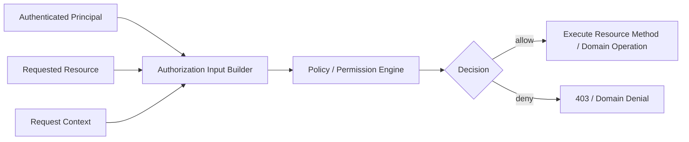
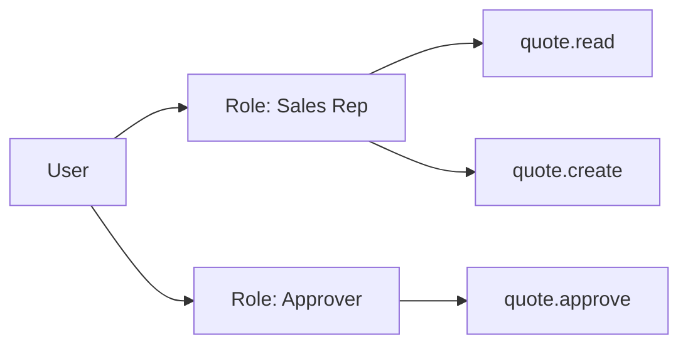

# Part 059 — Authorization, Permission, RBAC, and ACL

> Fokus part ini: memahami authorization sebagai keputusan akses, bukan sekadar validasi token. Kita akan membahas permission model, role, RBAC, ACL, object-level authorization, policy placement, failure mode, testing, dan checklist PR review untuk JAX-RS enterprise API.

Authentication menjawab:

```text
Who is calling?
```

Authorization menjawab:

```text
What is this caller allowed to do, on which resource, in which tenant/context, under which condition?
```

Dalam sistem enterprise quote/order, authorization biasanya tidak cukup dengan `role == ADMIN`.

Authorization sering bergantung pada:

```text
identity
role
permission
tenant
account/customer
sales channel
product catalog scope
quote/order ownership
workflow state
data classification
operation type
business delegation
service identity
```

Karena itu, authorization harus diperlakukan sebagai domain-critical control.

---

## 1. Core Mental Model

Authorization adalah keputusan eksplisit.

```text
subject + action + resource + context -> allow/deny
```

Contoh:

```text
subject  = user:alice
action   = quote.approve
resource = quote:Q-123
context  = tenant=T1, channel=enterprise, amount=500000, state=PENDING_APPROVAL
result   = allow/deny
```

Mermaid view:



Authorization bugs biasanya terjadi karena satu dari empat hal:

1. identity valid, tetapi permission tidak dicek
2. permission dicek terlalu kasar
3. resource ownership/tenant tidak dicek
4. check dilakukan di satu endpoint, tetapi lupa di endpoint lain

---

## 2. Authorization Is Not a UI Concern

UI boleh menyembunyikan tombol.

Backend tetap harus enforce authorization.

```text
Frontend hidden button != security control
```

JAX-RS service harus menganggap semua request bisa dipanggil langsung dengan curl/Postman/client custom.

Contoh anti-pattern:

```java
@POST
@Path("/quotes/{quoteId}/approve")
public Response approve(@PathParam("quoteId") String quoteId) {
    quoteService.approve(quoteId);
    return Response.ok().build();
}
```

Masalah:

```text
no principal
no permission check
no tenant check
no state check
no amount/delegation check
```

Versi lebih eksplisit:

```java
@POST
@Path("/quotes/{quoteId}/approve")
public Response approve(
        @PathParam("quoteId") String quoteId,
        @Context SecurityContext securityContext) {

    Principal principal = principalResolver.from(securityContext);
    Quote quote = quoteRepository.getRequired(quoteId);

    authorizationService.requireAllowed(
        principal,
        Permission.QUOTE_APPROVE,
        quote,
        AuthorizationContext.fromCurrentRequest()
    );

    quoteService.approve(quote, principal);
    return Response.ok().build();
}
```

Catatan penting: contoh ini hanya pattern. Codebase internal bisa memakai filter, annotation, interceptor, policy engine, atau domain service guard. Verifikasi internal selalu wajib.

---

## 3. Authorization vs Business Validation

Authorization:

```text
Is caller allowed?
```

Business validation:

```text
Is operation valid for the domain state?
```

Contoh approve quote:

```text
Authorization:
- caller has quote.approve permission
- caller belongs to same tenant
- caller can access this customer/account
- caller approval limit covers quote value

Business validation:
- quote is in PENDING_APPROVAL
- quote has valid line items
- quote has current pricing
- quote is not expired
```

Keduanya sering bertemu, tetapi jangan dicampur secara sembarangan.

Jika dicampur:

```text
- error mapping kacau
- audit trail tidak jelas
- security review sulit
- test negatif tidak lengkap
- domain rules bocor ke filter/security layer
```

Rule praktis:

```text
Security layer decides whether caller may attempt operation.
Domain layer decides whether operation makes sense.
```

---

## 4. Permission Model

Permission adalah action yang bisa dilakukan.

Contoh permission:

```text
quote.read
quote.create
quote.update
quote.submit
quote.approve
quote.reject
quote.cancel
order.read
order.create
order.amend
catalog.read
catalog.admin
pricing.override
discount.approve
```

Permission sebaiknya tidak hanya role name.

Bad:

```text
ADMIN
SALES
MANAGER
```

Better:

```text
quote.approve
pricing.override
order.cancel
```

Role boleh menjadi grouping permission.

```text
Role: SALES_REP
  - quote.read
  - quote.create
  - quote.update
  - quote.submit

Role: SALES_MANAGER
  - quote.read
  - quote.approve
  - discount.approve
```

Dengan model ini:

```text
role changes do not force endpoint changes
permission is stable contract
policy can evolve independently
review is more precise
```

---

## 5. RBAC

RBAC berarti Role-Based Access Control.

RBAC sederhana:

```text
user -> roles -> permissions
```



RBAC cocok untuk:

```text
coarse-grained access
administrative grouping
common enterprise access model
simple endpoint guard
```

RBAC kurang cukup untuk:

```text
object-level access
approval limit
tenant-specific catalog
customer/account hierarchy
workflow-state-dependent permission
region/channel-specific policy
```

Contoh masalah RBAC-only:

```text
User has role SALES_MANAGER.
Can they approve every quote in every tenant?
Probably not.
```

Maka RBAC biasanya perlu dikombinasikan dengan ACL atau policy-based checks.

---

## 6. ACL

ACL berarti Access Control List.

ACL mengikat subject ke resource tertentu.

```text
quote Q-123:
  alice -> read, update
  bob   -> read, approve
  team-east -> read
```

ACL cocok untuk:

```text
resource-specific sharing
case/quote ownership
delegated access
manual assignment
customer/account scoped access
```

ACL risk:

```text
large ACL table
complex inheritance
stale grants
hard-to-debug effective permission
performance cost during list/search
```

ACL harus punya clear lifecycle:

```text
who grants access?
who revokes access?
when does access expire?
how is access audited?
how is inherited access resolved?
```

---

## 7. ABAC and Policy-Based Authorization

ABAC berarti Attribute-Based Access Control.

Decision bergantung pada attribute.

```text
subject.department == resource.ownerDepartment
subject.approvalLimit >= quote.totalAmount
subject.region == quote.region
request.channel in subject.allowedChannels
```

Policy-based model:

```text
allow quote.approve when:
  subject has permission quote.approve
  and subject.tenant == quote.tenant
  and quote.state == PENDING_APPROVAL
  and quote.total <= subject.approvalLimit
```

Kelebihan:

```text
expressive
suitable for enterprise rules
can capture contextual decision
```

Risiko:

```text
policy sprawl
hard to test all combinations
unclear ownership
performance cost
policy drift across services
```

Senior engineer perlu menanyakan:

```text
Where is the source of authorization truth?
Is policy centralized or service-local?
How is policy versioned?
How is policy tested?
How is policy audited?
```

---

## 8. Authorization Placement in JAX-RS

Authorization bisa ditempatkan di beberapa layer.

### 8.1 ContainerRequestFilter

Cocok untuk coarse-grained guard:

```java
@Provider
@Priority(Priorities.AUTHORIZATION)
public class AuthorizationFilter implements ContainerRequestFilter {
    @Override
    public void filter(ContainerRequestContext requestContext) {
        // inspect method/path/annotation/principal
        // deny early if not allowed
    }
}
```

Kelebihan:

```text
centralized
early rejection
consistent error mapping
```

Kekurangan:

```text
resource object may not be loaded yet
hard for object-level authorization
risk of path/method policy drift
```

### 8.2 Annotation-Based Guard

Contoh:

```java
@POST
@Path("/quotes/{quoteId}/approve")
@RequiredPermission("quote.approve")
public Response approve(@PathParam("quoteId") String quoteId) {
    ...
}
```

Kelebihan:

```text
visible at endpoint
reviewable
works well for coarse permission
```

Kekurangan:

```text
not enough for object-level policy
custom annotation processing needed
can become false sense of security
```

### 8.3 Service-Level Guard

```java
public void approveQuote(Principal principal, QuoteId quoteId) {
    Quote quote = quoteRepository.getRequired(quoteId);
    authorization.requireAllowed(principal, Permission.QUOTE_APPROVE, quote);
    quote.approve(principal);
}
```

Kelebihan:

```text
close to domain operation
resource object available
reusable across API, jobs, workers
```

Kekurangan:

```text
must be consistently applied
review depends on service discipline
```

### 8.4 Domain-Level Guard

```java
quote.requireCanBeApprovedBy(principal);
quote.approve(principal);
```

Kelebihan:

```text
invariant close to aggregate
harder to bypass if all mutation goes through domain method
```

Kekurangan:

```text
may mix identity/policy into domain
can couple domain model to security infrastructure
```

Best production pattern often combines:

```text
filter/annotation for coarse endpoint guard
service/domain guard for object-level authorization
repository/data guard for tenant isolation
```

---

## 9. Coarse-Grained vs Fine-Grained Authorization

Coarse-grained:

```text
Can caller access this endpoint/action type?
```

Fine-grained:

```text
Can caller access this exact resource instance?
```

Example:

```text
Coarse:
  has quote.read

Fine:
  can read quote Q-123 because:
    same tenant
    allowed account
    assigned sales region
    not restricted by confidentiality flag
```

Do not stop at coarse checks for sensitive resources.

Endpoint review should ask:

```text
Is this endpoint object-specific?
Does it load data by ID?
Could a caller change the ID and access someone else's data?
Is there tenant/account ownership validation?
Is the list/search endpoint also scoped?
```

---

## 10. Object-Level Authorization

Object-level authorization is where many real vulnerabilities appear.

Bad pattern:

```java
@GET
@Path("/quotes/{id}")
public QuoteDto getQuote(@PathParam("id") String id) {
    return mapper.toDto(quoteRepository.findById(id));
}
```

Issue:

```text
IDOR: Insecure Direct Object Reference
```

Better pattern:

```java
@GET
@Path("/quotes/{id}")
public QuoteDto getQuote(@PathParam("id") String id,
                         @Context SecurityContext securityContext) {
    Principal principal = principalResolver.from(securityContext);
    Quote quote = quoteRepository.getRequired(id);

    authorization.requireAllowed(principal, Permission.QUOTE_READ, quote);

    return mapper.toDto(quote);
}
```

Even better when tenancy is enforced at query boundary:

```java
Quote quote = quoteRepository.getRequiredForTenant(id, principal.tenantId());
authorization.requireAllowed(principal, Permission.QUOTE_READ, quote);
```

Key invariant:

```text
Never load by global ID and return object without scoping and authorization.
```

---

## 11. List/Search Authorization

Many teams protect `GET /quotes/{id}` but forget `GET /quotes`.

List endpoint risk:

```text
query returns records from other tenant/account/region
filter parameter bypasses intended scope
pagination count leaks existence
sorting by restricted field leaks metadata
partial response exposes sensitive field
```

Safe pattern:

```text
client filters are constraints requested by caller
security filters are constraints enforced by service
final query = security scope AND client filter
```

Do not let client override security scope.

Example:

```text
caller tenant = T1
client filter = tenantId=T2
final query should be impossible or empty/denied
```

SQL mental model:

```sql
WHERE tenant_id = :principalTenant
  AND account_id IN (:allowedAccounts)
  AND status = :clientStatus
```

Never:

```sql
WHERE tenant_id = :clientTenant
```

unless client tenant has been strictly validated against principal scope.

---

## 12. Permission Naming Strategy

Good permission names are:

```text
stable
verb-oriented
resource-oriented
not role-specific
not UI-specific
not implementation-specific
```

Examples:

```text
quote.read
quote.create
quote.update
quote.submit
quote.approve
quote.cancel
quote.export
order.read
order.create
order.cancel
pricing.override
catalog.admin
```

Avoid:

```text
canClickApproveButton
salesManagerAction
endpointApproveQuote
adminOnly
```

Why?

```text
UI changes faster than permission model
endpoint names can change
roles differ by tenant/customer/organization
permissions should survive refactoring
```

---

## 13. Role Explosion and Permission Explosion

Role explosion:

```text
SALES_MANAGER_US_ENTERPRISE_DISCOUNT_APPROVER
SALES_MANAGER_EU_SMB_DISCOUNT_APPROVER
SALES_MANAGER_APAC_ENTERPRISE_READONLY
```

Permission explosion:

```text
quote.read.own.region.us.enterprise.active.v2
```

Both indicate the model is carrying too much context in names.

Better:

```text
permission = quote.approve
attributes = region, channel, account, amount, tenant
policy = combines permission + attributes
```

Senior review question:

```text
Is this modeled as role/permission because it is truly stable,
or because we do not have a policy/context model?
```

---

## 14. Authorization and Workflow State

In quote/order workflows, permission may depend on state.

Example:

```text
DRAFT quote:
  creator can update

SUBMITTED quote:
  creator cannot update
  approver can approve/reject

APPROVED quote:
  order service can convert to order
  sales rep cannot change price
```

State-dependent authorization must be explicit.

```java
authorization.requireAllowed(principal, Permission.QUOTE_APPROVE, quote);
quote.requireState(QuoteState.SUBMITTED);
quote.approve(principal);
```

Do not hide state logic only inside UI.

Do not rely on button visibility.

---

## 15. Authorization and Approval Limits

Approval often depends on amount, currency, discount, product class, or risk.

Example:

```text
approver limit = USD 100,000
quote total    = USD 120,000
result         = deny or require higher approval
```

Edge cases:

```text
currency conversion date
rounding policy
quote total recalculation
line item discount vs total discount
bundle pricing
tax inclusion/exclusion
catalog version
```

Authorization can depend on monetary correctness.

This connects to:

```text
Part 051 — Date, Time, Currency, and Precision
```

PR review should ask:

```text
Is the amount used for permission calculated from trusted source?
Is the currency normalized?
Is effective date considered?
Can caller manipulate amount in request DTO?
```

---

## 16. Authorization Failure Mapping

Typical mapping:

```text
missing/invalid token -> 401 Unauthorized
valid identity but forbidden action -> 403 Forbidden
resource not found -> 404 Not Found
resource exists but caller cannot know it exists -> 404 or 403 depending policy
```

Security-sensitive systems sometimes return 404 to avoid existence leak.

Example:

```text
GET /quotes/Q-999
```

If quote exists in another tenant:

```text
Option A: 403 Forbidden
  reveals quote ID exists somewhere

Option B: 404 Not Found
  hides existence
```

Choose intentionally and document it.

Do not mix randomly.

---

## 17. Audit Trail for Authorization Decisions

Not every authorization check needs full audit log.

But sensitive decisions should be auditable:

```text
approval
pricing override
discount override
order cancellation
permission grant/revoke
export/download
admin operation
cross-tenant access attempt
```

Audit event should capture:

```text
actor
service identity
tenant
resource type
resource id
action
decision
reason/policy id
request id
trace id
timestamp
source IP/user agent if relevant
```

Be careful with PII and secrets.

Audit log must not become data leak.

---

## 18. Authorization and Caching

Caching authorization decision is dangerous if not bounded.

Risk:

```text
user permission revoked but cached allow remains active
role updated but service still permits old action
tenant assignment changed but stale cache returns access
```

If caching is needed:

```text
short TTL
cache key includes subject + tenant + action + resource attributes
invalidate on permission change if possible
fail closed when uncertain
log cache decision source
```

Do not cache object-level decisions casually.

Better cache stable permission metadata than final contextual decision.

---

## 19. Authorization and Data Access Layer

Repository can enforce scoping.

Example:

```java
Optional<Quote> findByTenantAndId(TenantId tenantId, QuoteId quoteId);
```

Better than:

```java
Optional<Quote> findById(QuoteId quoteId);
```

For multi-tenant services, consider making unsafe global lookup obviously named:

```java
findByGlobalIdForInternalAdminOnly(...)
```

Data access guard is not a replacement for authorization service.

It is defense-in-depth.

---

## 20. Authorization and Background Jobs

Jobs do not have a human user.

They still need identity.

Possible actors:

```text
system:reconciliation-job
service:quote-service
service:order-service
scheduler:cleanup
```

Job authorization questions:

```text
Can this job operate across tenants?
Which tenant scope is it running for?
Can it bypass user-level restrictions?
Is its action audited as system action?
What prevents accidental broad mutation?
```

Do not make jobs bypass all guards by default.

If a job needs elevated privilege, model it explicitly.

---

## 21. Authorization and Service-to-Service Calls

A downstream service needs to know whether call is:

```text
on behalf of user
as the calling service itself
as a batch/system process
```

Patterns:

```text
user token propagation
service token only
token exchange
act-as / on-behalf-of token
dual context: user identity + service identity
```

Risk:

```text
service A has broad access to service B
service A exposes endpoint to user
user indirectly triggers privileged B operation
```

This is confused deputy.

Mitigation:

```text
validate audience
validate caller service
preserve user context when needed
check delegated permission
use narrow service permissions
```

---

## 22. JAX-RS SecurityContext

JAX-RS has `SecurityContext`.

It can expose:

```java
Principal getUserPrincipal();
boolean isUserInRole(String role);
boolean isSecure();
String getAuthenticationScheme();
```

Useful but often too limited for enterprise authorization.

You may need richer principal:

```java
public record AuthenticatedPrincipal(
    String subject,
    String tenantId,
    Set<String> roles,
    Set<String> permissions,
    Set<String> accountScopes,
    String issuer,
    String audience,
    String authScheme
) {}
```

Do not scatter token claim parsing everywhere.

Centralize principal resolution.

---

## 23. Annotation-Based Permission Example

Example custom annotation:

```java
@Retention(RUNTIME)
@Target({METHOD, TYPE})
public @interface RequiredPermission {
    String value();
}
```

Usage:

```java
@POST
@Path("/quotes/{quoteId}/approve")
@RequiredPermission("quote.approve")
public Response approve(@PathParam("quoteId") String quoteId) {
    ...
}
```

Important caveat:

```text
annotation usually verifies action permission only
it does not automatically verify quote ownership/tenant/scope
```

Therefore, annotation should not be the only guard for object-level APIs.

---

## 24. Negative Testing Strategy

Security tests must test denial, not only happy path.

Minimum cases:

```text
no token -> 401
invalid token -> 401
valid token, missing permission -> 403
valid token, wrong tenant -> 403/404
valid token, resource outside account scope -> 403/404
valid token, wrong workflow state -> domain error
valid token, insufficient approval limit -> 403/domain denial
admin/service token misuse -> denied
```

For list endpoint:

```text
cannot list other tenant data
cannot override tenant filter
cannot infer restricted count
cannot sort/filter on forbidden field if it leaks data
```

---

## 25. Common Failure Modes

### 25.1 IDOR

```text
Caller changes path ID and accesses another user's/tenant's resource.
```

Detection:

```text
negative test with same permission but different tenant/resource scope
```

### 25.2 Missing Object-Level Check

```text
Endpoint checks quote.read but not access to this quote.
```

Detection:

```text
review resource loading and authorization call order
```

### 25.3 Authorization Only in UI

```text
Button hidden but API still allows action.
```

Detection:

```text
call endpoint directly with insufficient permission
```

### 25.4 Overbroad Service Token

```text
Any internal service can call privileged endpoint.
```

Detection:

```text
review audience, caller service, and permission claims
```

### 25.5 Stale Permission Cache

```text
Revoked permission remains effective.
```

Detection:

```text
revocation test + cache TTL observation
```

### 25.6 List Endpoint Scope Leak

```text
Search returns records outside allowed scope.
```

Detection:

```text
seed data across tenants/accounts and verify final result set
```

---

## 26. Debugging Authorization Failures

When request returns 403, ask:

```text
Was authentication successful?
What principal was built?
Which roles/permissions are present?
Which resource was loaded?
Which tenant/account scope was applied?
Which policy denied?
Was denial expected?
Was error mapping correct?
Was audit/log emitted?
```

Useful log fields:

```text
requestId
traceId
subject
serviceIdentity
tenantId
resourceType
resourceId
action
permission
policyId
decision
reasonCode
```

Do not log raw token.

Do not log sensitive claims unnecessarily.

---

## 27. PR Review Checklist

For every new/changed endpoint:

```text
[ ] Is authentication required?
[ ] Is authorization required?
[ ] Is the action permission explicit?
[ ] Is object-level authorization performed?
[ ] Is tenant/account/customer scope enforced?
[ ] Is list/search scoped server-side?
[ ] Can client override security filters?
[ ] Is 401 vs 403 vs 404 behavior intentional?
[ ] Are negative authorization tests present?
[ ] Is audit required for this action?
[ ] Are security logs redacted?
[ ] Does downstream call preserve correct user/service context?
[ ] Is permission name stable and not UI-specific?
[ ] Does the endpoint avoid role-only hardcoding unless intentional?
[ ] Are background/system actors modeled explicitly?
```

For data access changes:

```text
[ ] Does query include tenant/security scope?
[ ] Are count queries scoped?
[ ] Are joins scoped?
[ ] Are search/filter/sort fields safe?
[ ] Are repository methods clearly named for scoped vs global access?
```

---

## 28. Internal Verification Checklist

Verify in internal CSG/codebase context:

```text
[ ] What authorization model is used: RBAC, ACL, ABAC, policy engine, custom service?
[ ] Where are permissions defined?
[ ] Where are roles mapped to permissions?
[ ] Are permissions stored in token, DB, config, external IAM, or policy service?
[ ] Is `SecurityContext` used directly or wrapped into internal principal?
[ ] Are there custom annotations such as `@RequiredPermission`?
[ ] Are authorization checks done in filters, interceptors, resource methods, service layer, or domain layer?
[ ] How is object-level authorization implemented?
[ ] How is tenant/account/customer scope enforced?
[ ] Do repositories require tenant/security scope?
[ ] How are list/search endpoints protected?
[ ] How are service-to-service calls authorized?
[ ] Are system jobs modeled as explicit actors?
[ ] Are denied decisions logged/audited?
[ ] What is the standard mapping for 401/403/404?
[ ] Are negative tests required in PRs?
[ ] Is there a permission catalog or security baseline document?
```

---

## 29. Senior Engineer Heuristics

A senior engineer should be suspicious when seeing:

```text
if (user.isAdmin())
findById(id) without tenant/scope
permission checks only in frontend
role names hardcoded in resource methods
no negative authorization tests
service token accepted without audience/caller check
list endpoint with client-supplied tenant/account filter
catch authorization exception and return 500
```

Good authorization design feels repetitive in the right way:

```text
identity resolved centrally
permission named consistently
resource loaded with scope
object-level check explicit
error mapping stable
negative tests present
audit for sensitive action
```

---

## 30. Key Takeaways

Authorization is not a boolean attached to a token.

Authorization is a contextual decision:

```text
subject + action + resource + context -> allow/deny
```

For enterprise JAX-RS APIs, strong authorization requires:

```text
clear permission model
RBAC/ACL/ABAC boundaries
object-level checks
tenant/account scoping
safe list/search behavior
explicit service-to-service semantics
negative tests
auditability
PR review discipline
```

The most dangerous authorization bugs are rarely syntax errors.

They are missing invariants.

